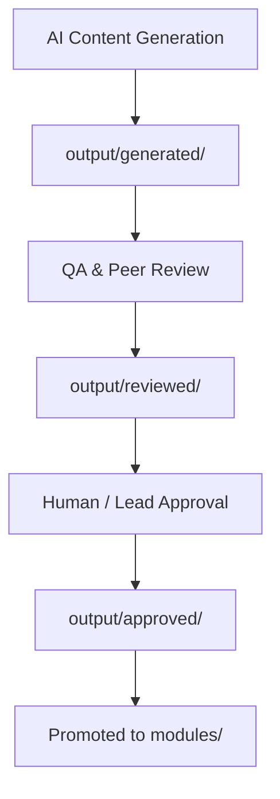

# AI Generation Workflow

**Purpose:** Step-by-step generation and staging workflow.

## Step-by-Step Staging Workflow

### Step 1: Initialization & Context Gathering
- Review `.ai/context.md` and `.ai/project_state.yaml` for active module status.
- Check `standards/COURSE_SPEC.md` and `standards/STYLE_GUIDE.md` for formatting requirements.

### Step 2: Component Scoping & Generation
- Locate the appropriate template in `standards/templates/`.
- Generate new course materials and place them initially into the staging area: `output/generated/`.

### Step 3: QA Review & Validation
- The `@qa-reviewer` agent inspects files in `output/generated/` against `standards/REVIEW_CHECKLIST.md`.
- Run automated validation scripts (`scripts/validate_templates.py`, `scripts/validate_links.py`).
- Once validation passes, move the files to `output/reviewed/`.

### Step 4: Final Approval
- Lead architect or human maintainer reviews the materials in `output/reviewed/`.
- Upon approval, files are transitioned to `output/approved/`.

### Step 5: Promotion & Publishing
- Promote fully approved files from `output/approved/` into their final destination within `modules/` (e.g., `modules/linux/`, `modules/kubernetes/`).
- Update `.ai/project_state.yaml` to reflect completion.
