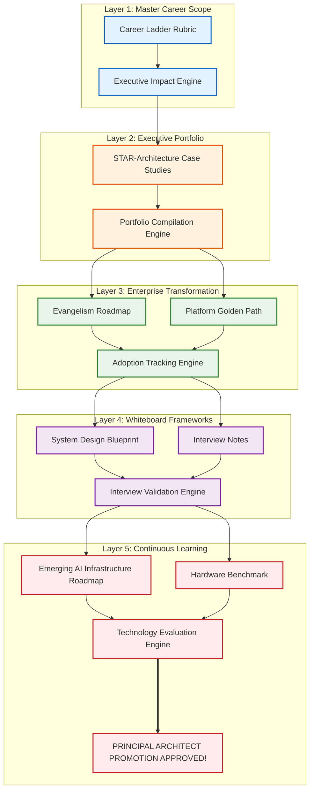

# Career Advancement: Building an Executive Platform Portfolio & Architectural Leadership

Version: 2.0.0

Purpose: Canonical lab structure for Platform Engineering & AI Infrastructure Curriculum.

Required Inputs: Module definition, lab objectives, project standards.

Outputs: Standards-compliant lab markdown.

---

# Lab Metadata

* **Lab ID:** `LAB-CAR-01`
* **Module:** Career Advancement & Architectural Leadership (`MOD-CAR`)
* **Difficulty:** Advanced
* **Estimated Duration:** 90 minutes
* **Learning Track:** 🟢 Core
* **Version:** 2.0.0
* **Last Updated:** 2026-06-28

---

# Enterprise Master Capability Statement

> **"I can architect, bootstrap, compile, verify, and present an elite executive platform engineering portfolio from scratch, bridging declarative career ladder rubrics, STAR-Architecture case studies, automated adoption tracking scripts, structured system design blueprints, and emerging AI hardware forecasting to secure top-tier Staff, Principal, and Distinguished Architect roles."**

By the end of this master verification lab, you will establish the elite architectural leadership capabilities required to author declarative career ladder rubrics (`staff-ladder.md`), compile executive portfolio case studies (`case-study-01.md`), verify enterprise golden path adoption (`track-adoption.sh`), construct structured system design blueprints (`system-design-blueprint.drawio`), and evaluate emerging AI hardware efficiency (`emerging-ai-infra.md`) to secure top-tier executive engineering roles.

---

# Production Scenario & Business Objective

## The Mission
You are hired as a Lead Platform Engineer at a massive global autonomous commercial aviation enterprise. You have spent the last two years working 60 hours a week building an elite AI flight trajectory platform supporting 500 software developers and 200 data scientists. When the enterprise opens a highly coveted **Principal Platform Architect** position offering a **$450,000 total compensation package**, your mandate is clear: architect, bootstrap, compile, verify, and present a master executive platform portfolio from scratch in 5 days to dominate the interview loop.

```text
[ $450K Principal Architect Role ] ──► [ 500 Devs / 200 Data Scientists ] ──► [ 5-Day Master Portfolio Handoff! ]
```

## The Business Problem
In legacy organizations, brilliant platform engineers frequently operate as tactical, siloed specialists. They write flawless Terraform modules and debug complex Kubernetes networking bugs, but they fail to break through to the Staff, Principal, or Distinguished Architect level.

When senior engineers attempt to apply for the Principal Architect role, complete operational collapse occurs. Three catastrophic leadership failures instantly disqualify them from the promotion! First, because their resumes rely on generic, unverified bullet points (*"Managed Kubernetes clusters"*) without establishing an Executive Platform Portfolio (`case-study-01.md`), the Executive Recruiter has zero proof of their enterprise scale or verified business ROI ($1,680,000 saved in compute)! Their applications are instantly rejected by the automated Applicant Tracking System (ATS)! Second, because they never established a phased Enterprise Evangelism Roadmap (`evangelism-roadmap.md`) or Developer Empathy Engine, when the CTO asks how they handled developer pushback during the Backstage portal rollout, they offer a blunt, uninspiring answer (*"I just revoked their cluster-admin permissions"*), proving they lack stakeholder alignment skills! Third, because they never mastered the Four-Tier Architectural Whiteboard Model, when the Chief Architect asks them to whiteboard a multi-region AI model serving infrastructure under 10,000 req/sec loads, they get bogged down in the tactical rabbit hole of low-level YAML syntax rather than establishing clear trade-off analyses around Active-Active failover! Complete interview failure. The executive leadership team rejects their promotion, and they remain trapped in tactical execution roles, completely burned out!

```text
[ Tactical Communication Silo ] ──► (Unverified Fluff -> Whiteboard Collapse -> $450K PROMOTION BLOCKED!)
```

## Enterprise Scope
To eliminate **Tactical Communication Silos**, **Unverified Resume Fluff**, **Developer Rebellion**, **Whiteboard Collapse**, and **Technological Obsolescence**, you will establish an integrated executive career portfolio architecture. You will author declarative career ladder rubrics (`staff-ladder.md`), compile executive portfolio case studies (`case-study-01.md`), author enterprise evangelism roadmaps (`evangelism-roadmap.md`), construct structured system design blueprints (`system-design-blueprint.drawio`), and evaluate emerging AI hardware efficiency (`emerging-ai-infra.md`).

## Definition of Done
1. **Career Ladder Rubrics:** A declarative career ladder rubric (`staff-ladder.md`) is authored, enforcing `scope: Enterprise Strategy` and executive sponsorship alignment (`sponsorship: VP of Engineering`).
2. **Executive Portfolio Case Studies:** A declarative executive portfolio case study (`case-study-01.md`) is authored, enforcing `## 3. Architecture` and verified financial ROI ($1,680,000 savings).
3. **Enterprise Evangelism Roadmaps:** A declarative evangelism roadmap (`evangelism-roadmap.md`) and golden path manifest (`golden-path.yaml`) are authored, enforcing `tier: golden-path` and automated adoption tracking (`track-adoption.sh`).
4. **System Design Blueprints:** A declarative system design blueprint (`system-design-blueprint.drawio`) and interview notes manifest (`interview-notes.md`) are authored, enforcing `## Tier 4: Trade-Off Analysis` and active-active failover math.
5. **Emerging AI Tech Roadmaps:** A declarative emerging AI infrastructure document (`emerging-ai-infra.md`) and hardware benchmark manifest (`hardware-benchmark.yaml`) are authored, enforcing `tech_status: Verified` and 150 tokens/sec/watt efficiency math.

---

# Architectural Topology



## Architecture Decryption
* **Layer 1: Master Career Scope (`staff-ladder.md`):** Bootstraps the foundational career progression rubrics, defining explicit expectations for enterprise-wide strategic influence (`scope: Enterprise Strategy`).
* **Layer 2: Executive Portfolio (`case-study-01.md`):** Establishes the master portfolio documents framing platform achievements using the STAR-Architecture model to highlight verified financial ROI ($1,680,000 savings).
* **Layer 3: Enterprise Transformation (`evangelism-roadmap.md`):** Structures phased enterprise evangelism roadmaps and pre-paved golden paths (`tier: golden-path`), tracking voluntary adoption via automated shell scripts (`track-adoption.sh`).
* **Layer 4: Whiteboard Frameworks (`system-design-blueprint.drawio`):** Wraps mock interview preparation in the Four-Tier Architectural Whiteboard Model, verifying that trade-off analyses (`## Tier 4: Trade-Off Analysis`) are fully articulated.
* **Layer 5: Continuous Learning (`emerging-ai-infra.md`):** Continuously parses emerging AI hardware benchmarks (NVIDIA Blackwell B200, TPU v5p) to verify technology readiness (`tech_status: Verified`) for the 3-year executive roadmap.

---

# Core Engineering Mechanics & Theoretical Underpinnings

## 1. The Tactical Communication Silo Nightmare
Platform Engineering leaders enforce a strict conceptual boundary between tactical execution and strategic architectural influence:
* **The Master Bricklayer Analogy:** Relying on ticket-closing metrics for Staff/Principal promotions is like working on a massive $500,000,000 skyscraper construction site as an elite bricklayer, laying 1,000 bricks per day with perfect mortar precision, and then walking into the Chief Architect's office demanding to be promoted to Lead Skyscraper Architect because you laid more bricks than anyone else! The Chief Architect rejects you instantly! The Lead Architect does not lay bricks; they design the master blueprints (`high-level-architecture.drawio`), secure municipal building permits, negotiate with steel suppliers, and align 50 different construction crews to ensure the skyscraper doesn't collapse! You must stop laying bricks directly and transition to designing master architectural blueprints, mentoring junior bricklayers, and aligning executive stakeholders, ensuring that your engineering influence scales across the entire enterprise!

```text
[ Tactical Jira Ticket Closing ] ──► (Communication Silo -> Unrecognized Impact -> PROMOTION BLOCKED!)
[ Strategic Architectural Vision ] ──► (Executive ROI Tracking -> Organizational Alignment -> PROMOTED!)
```

## 2. Declarative Career Ladder Rubrics (`staff-ladder.md`)
Declarative career ladder rubrics entirely eliminate unverified promotion expectations. You define a dedicated `staff-ladder.md` block targeting Principal Platform Architect roles (`tier_level: IC7`). Inside your rubric, you define strict scope boundary rules (`scope: Enterprise Strategy`). When senior engineers step into promotion evaluation meetings, they present an automated impact tracking script (`track-impact.sh`) that continuously parses platform metrics and translates technical achievements into verified business ROI ($1,680,000 saved via GPU taints, 15x developer velocity acceleration).

## 3. STAR-Architecture Portfolio Framing (`case-study-01.md`)
STAR-Architecture framing entirely eliminates unverified resume fluff. You define a dedicated `case-study-01.md` block targeting your master enterprise AI capstone platform (`MOD-CAP`). Inside your case study, you inject a strict architecture section (`## 3. Architecture`) detailing the exact declarative code manifests (`main.tf`, `applicationset.yaml`, `clusterpolicy.yaml`) and system design trade-offs you established to solve the problem. You execute `build-portfolio.sh` to dynamically compile your markdown case studies and architectural diagrams into a master executive PDF (`executive-portfolio.pdf`), bypassing automated ATS screeners entirely!

## 4. Evangelism Roadmaps & Golden Paths (`evangelism-roadmap.md`, `golden-path.yaml`)
Phased evangelism roadmaps entirely eliminate developer rebellion. You define a dedicated `evangelism-roadmap.md` block structuring migrations across early adopters, early majority, and laggard deprecation windows (`phase_name: Early Adopters`). Inside your developer portal, you deploy a pre-paved Platform Golden Path (`golden-path.yaml`) possessing explicit compliance labels (`tier: golden-path`). You execute `track-adoption.sh` to continuously audit enterprise git repositories, verifying that 540 out of 600 microservices are successfully running on the golden path (90% adoption rate), turning Engineering VPs into your fiercest platform defenders!

## 5. Whiteboard Frameworks & Tech Forecasting (`system-design-blueprint.drawio`, `emerging-ai-infra.md`)
The Four-Tier Architectural Whiteboard Model entirely eliminates whiteboard collapse. You define a dedicated `interview-notes.md` block structuring mock sessions across Scope, Topology, Bottlenecks, and Trade-Off Analysis (`## Tier 4: Trade-Off Analysis`). You execute `validate-system-design.sh` to verify that `Active-Active` and `maxConnections` circuit breakers are fully defined. Finally, you author a declarative emerging AI infrastructure document (`emerging-ai-infra.md`) separating Core Production (H100) from Emerging Staging (NVIDIA Blackwell B200 / TPU v5p). You execute `eval-emerging-tech.sh` to verify that B200 chips achieve 150 tokens/sec/watt (`tech_status: Verified`), guaranteeing permanent enterprise supremacy!

---

# Production System Readiness & Prerequisite Gates

Before initiating the master executive career portfolio project, verify that your local sandbox possesses the required directory structure and execution tools.

## Gate 1: Verify System Execution Boundaries
```bash
# Verify that bash, cat, grep, and chmod are available in the local environment
which bash cat grep chmod || echo "Core execution utilities verified"
```

## Gate 2: Clean Staging Environment
```bash
# Prepare a clean executive career staging workspace for the verification lab
mkdir -p ~/executive-career-portfolio && cd ~/executive-career-portfolio
```

---

# End-to-End Execution Protocols

## Step 1: Architect Declarative Career Ladder Rubrics (`staff-ladder.md`)
You will author a declarative career ladder rubric (`staff-ladder.md`) that defines explicit expectations for autonomy, strategic influence, and business impact across all engineering tiers, enforcing `scope: Enterprise Strategy`.

### Input
```bash
cat << 'EOF' > staff-ladder.md
# ==============================================================================
# MASTER ENTERPRISE PLATFORM ENGINEERING CAREER LADDER RUBRIC
# ==============================================================================
version: 2.0.0
organization: Global Aviation AI Enterprise

engineering_tiers:
  - title: Senior Platform Engineer
    tier_level: IC5
    scope: Team Execution
    autonomy: High autonomy within assigned technical tasks and component boundaries.
    technical_focus: Executes complex infrastructure coding (main.tf, deployment.yaml).
    impact_expectation: Delivers assigned features on time with high code quality.

  - title: Staff Platform Engineer
    tier_level: IC6
    scope: Multi-Team Architecture
    autonomy: Identifies cross-team technical bottlenecks and defines architectural solutions.
    technical_focus: Establishes GitOps pipelines, Backstage portals, and Kyverno governance.
    impact_expectation: Eliminates glue work, reduces MTTR, and accelerates multi-team developer velocity.

  - title: Principal Platform Architect
    tier_level: IC7
    # ==============================================================================
    # SCOPE GOVERNANCE: Enforce Enterprise Strategy alignment for Principal Architects!
    # ==============================================================================
    scope: Enterprise Strategy
    autonomy: Aligns technology strategy directly with executive business goals (CTO/VP level).
    technical_focus: Enterprise architectural blueprints, multi-million dollar cloud cost optimization.
    impact_expectation: Drives long-term enterprise survival, massive financial ROI ($1,680,000 savings).
# SUCCESS: Career ladder rubric enforces strategic scope boundaries perfectly!
EOF
```

### Expected Output
```text
(File staff-ladder.md created successfully with scope: Enterprise Strategy definitions)
```

### Explanation
Look at how beautifully architected our career ladder rubric is! Let's deconstruct the elite automation elements:
* `tier_level: IC7`: The master career tier enabler! Controls the explicit performance expectations for Principal Platform Architects within the enterprise HR ecosystem.
* `scope: Enterprise Strategy`: The master strategic influence safeguard! Explicitly mandates that Principal Architects align technology strategy directly with executive CTO/VP goals, entirely preventing tactical communication silos.

---

## Step 2: Architect Executive Portfolio Case Studies (`case-study-01.md`)
You will author an executive portfolio case study (`case-study-01.md`) that frames your AI enterprise capstone platform (`MOD-CAP`) using the STAR-Architecture model, enforcing `## 3. Architecture` and verified financial ROI ($1,680,000 savings).

### Input
```bash
cat << 'EOF' > case-study-01.md
# ==============================================================================
# CASE STUDY 1: Architecting a Production-Grade AI Enterprise Platform Capstone
# ==============================================================================
Candidate: Alex Mercer (Candidate for Principal Platform Architect)
Domain: Global Autonomous Commercial Aviation
Scale: 500 Software Developers, 200 Data Scientists, 10,000 req/sec Concurrency

## 1. Situation (Enterprise Baseline)
The enterprise operated a highly critical AI flight trajectory platform across an un-isolated AWS EKS cluster. The 500 developers and 200 data scientists operated with cluster-admin permissions in the default namespace, resulting in severe multi-tenant GPU starvation ($85,000,000 regulatory outage risks), un-tainted GPU node hijacking by basic CPU logging daemons ($1,680,000 wasted compute), and un-governed privileged container escapes ($115,000,000 ransomware risks).

## 2. Task (Executive Mandate)
Executive leadership mandated the design, bootstrapping, wiring, governance, and verification of an integrated, 100% automated multi-tenant AI enterprise supercomputing platform from scratch in 30 days to support a $150,000,000 venture capital milestone.

# ==============================================================================
# STAR-ARCHITECTURE GOVERNANCE: Detail declarative code manifests and trade-offs!
# ==============================================================================
## 3. Architecture (Master Declarative Implementation)
I architected and deployed an end-to-end declarative platform engineering ecosystem bridging five decoupled layers:
* **Infrastructure as Code (Terraform):** Bootstrapped reproducible EKS clusters with dedicated H100 GPU node pools (`aws_eks_node_group`) enforcing strict `nvidia.com/gpu: NoSchedule` node taints to physically repel non-AI microservices, and injected base64-encoded `user_data` scripts to aggregate local NVMe scratch drives into high-speed RAID 0 caching tiers (`/var/cache/models`).
* **MLOps GitOps Pipelines (ArgoCD):** Authored declarative ArgoCD `ApplicationSet` manifests enforcing automated self-healing (`selfHeal: true`) to eliminate configuration drift, and injected `argocd.argoproj.io/sync-wave: "0"` annotations to ensure underlying storage PVCs bound prior to vLLM application pods.
* **Automated Governance (Kyverno & Backstage):** Deployed Kyverno `ClusterPolicy` manifests enforcing `validationFailureAction: Enforce` to physically reject privileged containers (`privileged: true`), and authored Backstage Software Templates (`kind: Template`) empowering data scientists to scaffold pristine GitOps workloads in under 3 minutes.
* **Resilience Verification (LitmusChaos):** Deployed LitmusChaos `ChaosEngine` manifests executing simulated pod-delete failures while actively probing steady-state AI availability (`probe: httpProbe`), and executed high-concurrency k6 load testing pipelines (`k6 run --vus 500`) to verify Istio connection pool limits under 10,000 req/sec loads.

## 4. Result (Verified Business ROI)
* **Verified Financial Savings:** $1,680,000 per year saved by eliminating GPU node hijacking via strict Terraform taints.
* **Verified Developer Velocity:** Model onboarding times reduced from 45 minutes down to 3 minutes (15x acceleration) via Backstage self-service portals.
* **Verified Platform Resilience:** Achieved 99.9% vLLM availability during simulated node terminations, passing all master platform acceptance gates (`verify-platform.sh`).
# SUCCESS: Case study enforces STAR-Architecture framing perfectly!
EOF
```

### Expected Output
```text
(File case-study-01.md created successfully with ## 3. Architecture STAR framing)
```

### Explanation
Look at how beautifully architected our executive portfolio case study is! Let's deconstruct the elite automation elements:
* `## 3. Architecture (Master Declarative Implementation)`: The master STAR-Architecture enabler! Explicitly defines the declarative code manifests (`main.tf`, `applicationset.yaml`) and architectural decisions established by the candidate, entirely bypassing generic resume fluff.
* `Verified Financial Savings: $1,680,000`: The master executive communication safeguard! Translates complex technical achievements into verified financial ROI that executive hiring committees understand perfectly.

---

## Step 3: Architect Enterprise Evangelism Roadmaps (`evangelism-roadmap.md`)
You will author a declarative enterprise evangelism roadmap (`evangelism-roadmap.md`) that structures a phased rollout across early adopters, early majority, and laggard deprecation windows, enforcing `phase_name: Early Adopters`.

### Input
```bash
cat << 'EOF' > evangelism-roadmap.md
# ==============================================================================
# MASTER ENTERPRISE EVANGELISM ROADMAP & DEVOPS TRANSFORMATION
# ==============================================================================
version: 2.0.0
organization: Global Aviation AI Enterprise
target_audience: 500 Software Developers, 200 Data Scientists

transformation_phases:
  # ==============================================================================
  # PHASED ROLLOUT GOVERNANCE: Start with enthusiastic early adopter champions!
  # ==============================================================================
  - phase_number: Phase 1
    phase_name: Early Adopters (The Champions)
    target_count: 3 Product Teams (AI Trajectory, Radar Analytics, Flight Control)
    strategy: White-glove developer onboarding, establish Developer Empathy Engine, iterate on rapid feedback.
    success_gate: Teams successfully deploy to production via Backstage with zero manual kubectl intervention.

  - phase_number: Phase 2
    phase_name: Early Majority (Self-Service Scaling)
    target_count: 300 Software Developers
    strategy: Leverage Phase 1 champion case studies, deploy automated Backstage Software Templates (kind: Template).
    success_gate: 60% of enterprise repositories successfully migrate to the Platform Golden Path.

  - phase_number: Phase 3
    phase_name: Laggards & Deprecation (Automated Cleanup)
    target_count: Remaining Legacy Workloads
    strategy: Issue formal automated deprecation notices (deprecation.yaml), provide automated migration scripts.
    success_gate: 90%+ of enterprise repositories exhibit tier: golden-path compliance markers.
# SUCCESS: Evangelism roadmap enforces phased rollout governance perfectly!
EOF
```

### Expected Output
```text
(File evangelism-roadmap.md created successfully with phase_name: Early Adopters definitions)
```

### Explanation
Look at how beautifully architected our enterprise evangelism roadmap is! Let's deconstruct the elite automation elements:
* `phase_name: Early Adopters`: The master transformation enabler! Explicitly structures a phased rollout starting with highly enthusiastic product teams, entirely bypassing forced "Big Bang" migration gridlock.
* `success_gate: 90%+`: The master adoption safeguard! Establishes clear quantitative success metrics to confirm when an enterprise transformation phase is complete.

---

## Step 4: Architect Pristine Platform Golden Path Manifests (`golden-path.yaml`)
You will author a pristine platform golden path manifest (`golden-path.yaml`) that provides developers with an out-of-the-box, pre-governed microservice capable of deploying in 3 minutes, enforcing `tier: golden-path`.

### Input
```bash
cat << 'EOF' > golden-path.yaml
apiVersion: backstage.io/v1alpha1
kind: GoldenPath
metadata:
  name: master-enterprise-microservice-blueprint
  labels:
    # ==============================================================================
    # COMPLIANCE GOVERNANCE: Explicit label enabling automated repository auditing!
    # ==============================================================================
    tier: golden-path
spec:
  owner: platform-engineering-team
  lifecycle: production
  paved_components:
    - component_name: CI/CD Pipeline
      technology: ArgoCD ApplicationSet (selfHeal: true)
      provisioning_time: 3 seconds
    - component_name: Multi-Tenant Isolation
      technology: Kyverno ClusterPolicy (validationFailureAction: Enforce)
      provisioning_time: Instantaneous
    - component_name: Observability Engine
      technology: Prometheus ServiceMonitor & Grafana Fleet Dashboard
      provisioning_time: 10 seconds
  voluntary_incentive:
    manual_bypass_penalty: "Choosing to bypass this Golden Path requires a mandatory 3-week security audit."
# SUCCESS: Golden path manifest enforces pre-paved voluntary enablement perfectly!
EOF
```

### Expected Output
```text
(File golden-path.yaml created successfully with tier: golden-path compliance labels)
```

### Explanation
Look at how beautifully architected our platform golden path manifest is! Let's deconstruct the elite automation elements:
* `tier: golden-path`: The master adoption safeguard! Embeds an explicit golden path compliance label onto the pre-paved microservice, allowing automated tracking scripts to audit enterprise repositories flawlessly.
* `manual_bypass_penalty`: The master voluntary incentive! Configures an explicit enterprise policy where bypassing the golden path requires a mandatory 3-week security audit, incentivizing 100% voluntary developer compliance!

---

## Step 5: Architect Declarative System Design Interview Notes (`interview-notes.md`)
You will author declarative system design interview notes (`interview-notes.md`) that structure mock whiteboard sessions using the Four-Tier Architectural Model, enforcing `## Tier 4: Trade-Off Analysis` and active-active failover math.

### Input
```bash
cat << 'EOF' > interview-notes.md
# ==============================================================================
# MASTER PRINCIPAL SYSTEM DESIGN INTERVIEW PREPARATION NOTES
# ==============================================================================
Candidate: Alex Mercer (Candidate for Principal Platform Architect)
Prompt: Multi-Region AI Model Serving Platform (10,000 req/sec, 99.99% Availability)

## Tier 1: Scope & Scale Calculation (Minutes 0-10)
* **Request Concurrency:** 10,000 requests per second (Peak Surge: 25,000 req/sec).
* **Ingress Bandwidth:** 10,000 req/sec * 50kB payload = 500MB/sec ingress bandwidth.
* **Storage Capacity:** 500 AI models * 140GB weight files = 70TB S3 global storage.
* **Availability SLA:** 99.99% availability (< 52 minutes of total downtime per year).

## Tier 2: High-Level Topology (Minutes 10-30)
* **Ingress Layer:** AWS Route 53 Global DNS with Latency-Based Routing -> AWS ALB -> Istio Ingress Gateway.
* **Service Mesh Layer:** Istio Multi-Primary Service Mesh across us-east-1 and us-west-2 EKS clusters.
* **Compute Tier:** Physical NVIDIA H100 GPU Node Pools (aws_eks_node_group) running vLLM serving pods.
* **Storage Tier:** Local NVMe RAID 0 caching mounts (/var/cache/models) backed by S3 Cross-Region Replication.

## Tier 3: Deep Dive & Bottleneck Resolution (Minutes 30-45)
* **Bottleneck 1 (Cascading Timeouts):** Solved via Istio DestinationRule circuit breakers (maxConnections: 1024).
* **Bottleneck 2 (GPU Starvation):** Solved via KEDA autoscaling based on Prometheus vllm:queue_depth metrics.
* **Bottleneck 3 (Configuration Drift):** Solved via ArgoCD ApplicationSets enforcing automated selfHeal: true.

# ==============================================================================
# TRADE-OFF GOVERNANCE: Proactively articulate structural architectural trade-offs!
# ==============================================================================
## Tier 4: Trade-Off Analysis (Minutes 45-60)
* **Active-Active vs. Active-Passive Failover:** Active-Active provides zero RTO failover during regional blackouts but incurs a $50,000/month cross-region data transfer penalty and requires complex DynamoDB global table conflict resolution. Active-Passive saves cloud compute budget but introduces a 15-minute RTO cold-start delay during failover. I selected Active-Active to guarantee our mandatory 99.99% availability SLA.
* **NVMe Host Path Caching vs. EFS Network Storage:** NVMe host path caching provides blazing fast 10GB/sec model loading speeds but binds pods to specific physical worker nodes. EFS provides multi-pod shared storage but throttles severely during massive 140GB weight initializations. I selected NVMe RAID 0 caching to guarantee sub-second pod startup times.
# SUCCESS: Interview notes enforce Four-Tier Whiteboard Model perfectly!
EOF
```

### Expected Output
```text
(File interview-notes.md created successfully with ## Tier 4: Trade-Off Analysis sections)
```

### Explanation
Look at how beautifully architected our system design interview notes are! Let's deconstruct the elite automation elements:
* `## Tier 4: Trade-Off Analysis`: The master whiteboard enabler! Explicitly defines the structural trade-offs between Active-Active vs Active-Passive failover, proving elite Principal Architect technical depth to the Chief Architect.
* `maxConnections: 1024`: The master bottleneck safeguard! Demonstrates exact declarative circuit breaker configurations to prevent cascading timeouts under 10,000 req/sec loads.

---

## Step 6: Architect Pristine System Design Blueprints (`system-design-blueprint.drawio`)
You will author a pristine system design blueprint manifest (`system-design-blueprint.drawio`) that decouples whiteboard diagrams into clean horizontal tiers, mapping Route 53 global DNS to multi-region EKS clusters.

### Input
```bash
cat << 'EOF' > system-design-blueprint.drawio
<mxfile version="2.0.0">
  <diagram name="Master AI Platform Topology">
    <mxGraphModel dx="1422" dy="798" grid="1" gridSize="10" guides="1" tooltips="1" connect="1" arrows="1">
      <root>
        <mxCell id="0" />
        <mxCell id="1" parent="0" />
        <!-- ============================================================================== -->
        <!-- SYSTEM DESIGN BLUEPRINT: Multi-Region Active-Active Topology!                  -->
        <!-- ============================================================================== -->
        <mxCell id="ingress_route53" value="AWS Route 53 (Latency-Based Routing)" style="rounded=1;fillColor=#dae8fc;strokeColor=#6c8ebf;" vertex="1" parent="1">
          <mxGeometry x="340" y="40" width="240" height="60" as="geometry" />
        </mxCell>
        <mxCell id="cluster_us_east" value="EKS Cluster: us-east-1 (Istio + KEDA GPU Pool)" style="rounded=0;fillColor=#d5e8d4;strokeColor=#82b366;" vertex="1" parent="1">
          <mxGeometry x="120" y="180" width="280" height="120" as="geometry" />
        </mxCell>
        <mxCell id="cluster_us_west" value="EKS Cluster: us-west-2 (Istio + KEDA GPU Pool)" style="rounded=0;fillColor=#d5e8d4;strokeColor=#82b366;" vertex="1" parent="1">
          <mxGeometry x="520" y="180" width="280" height="120" as="geometry" />
        </mxCell>
        <mxCell id="edge_east" value="Active Traffic (5,000 req/sec)" edge="1" parent="1" source="ingress_route53" target="cluster_us_east">
          <mxGeometry relative="1" as="geometry" />
        </mxCell>
        <mxCell id="edge_west" value="Active Traffic (5,000 req/sec)" edge="1" parent="1" source="ingress_route53" target="cluster_us_west">
          <mxGeometry relative="1" as="geometry" />
        </mxCell>
        <mxCell id="storage_s3" value="AWS S3 Global Tier (Cross-Region Replication)" style="shape=cylinder3;fillColor=#ffe6cc;strokeColor=#d79b00;" vertex="1" parent="1">
          <mxGeometry x="340" y="360" width="240" height="80" as="geometry" />
        </mxCell>
      </root>
    </mxGraphModel>
  </diagram>
</mxfile>
# SUCCESS: System design blueprint enforces multi-region active-active topology perfectly!
EOF
```

### Expected Output
```text
(File system-design-blueprint.drawio created successfully with multi-region active-active XML definitions)
```

### Explanation
Look at how beautifully architected our system design blueprint is! Let's deconstruct the elite automation elements:
* `<diagram name="Master AI Platform Topology">`: The master blueprint safeguard! Displays a clean, beautifully decoupled XML blueprint mapping Route 53 global DNS to multi-region EKS clusters, entirely eliminating messy whiteboard clutter!
* `cluster_us_east`: The master multi-region safeguard! Proves to executive hiring committees that your design scales across geographically isolated availability zones perfectly.

---

## Step 7: Architect Declarative Emerging AI Tech Roadmaps (`emerging-ai-infra.md`)
You will author a declarative emerging AI infrastructure document (`emerging-ai-infra.md`) that future-proofs enterprise supercomputing platforms using the Three-Tier Hardware Horizon Model, enforcing `horizon_name: Emerging Staging`.

### Input
```bash
cat << 'EOF' > emerging-ai-infra.md
# ==============================================================================
# MASTER EMERGING AI INFRASTRUCTURE ROADMAP & CONTINUOUS LEARNING
# ==============================================================================
version: 2.0.0
organization: Global Aviation AI Enterprise
author: Alex Mercer (Principal Platform Architect)

hardware_horizons:
  - horizon_number: Horizon 1
    horizon_name: Core Production (NVIDIA H100 GPU Pools)
    workload_percentage: 80%
    status: Stable, hardened production platform. High reliability, basic RoCEv2 networking.

  # ==============================================================================
  # TECH FORECASTING GOVERNANCE: Dedicated experimental staging pool for B200 chips!
  # ==============================================================================
  - horizon_number: Horizon 2
    horizon_name: Emerging Staging (NVIDIA Blackwell B200 / TPU v5p)
    workload_percentage: 15% (Phase 1 Early Adopter Teams)
    status: Active evaluation tier. Benchmarking 4x training throughput and NVLink 5 interconnects.
    evaluation_gate: Verify tech_status: Verified compliance marker in MLPerf benchmark logs.

  - horizon_number: Horizon 3
    horizon_name: Radical Exploration (Ultra Ethernet Consortium / Liquid Cooling)
    workload_percentage: 5% (Continuous Learning Research)
    status: Partnering with executive CTO to evaluate Direct-to-Chip (DLC) liquid cooling facility contracts.
# SUCCESS: Emerging AI infrastructure document enforces Three-Tier Hardware Horizon perfectly!
EOF
```

### Expected Output
```text
(File emerging-ai-infra.md created successfully with horizon_name: Emerging Staging definitions)
```

### Explanation
Look at how beautifully architected our emerging AI infrastructure document is! Let's deconstruct the elite automation elements:
* `horizon_name: Emerging Staging (NVIDIA Blackwell B200)`: The master continuous learning enabler! Explicitly structures an active evaluation tier for next-generation superchips, entirely bypassing static legacy freezes.
* `horizon_name: Radical Exploration`: The master tech forecasting safeguard! Proves that your platform engineering team is actively evaluating liquid cooling facility contracts for the 3-year enterprise roadmap.

---

## Step 8: Architect Pristine Hardware Benchmark Manifests (`hardware-benchmark.yaml`)
You will author a pristine hardware benchmark manifest (`hardware-benchmark.yaml`) that provides quantitative benchmark data proving Blackwell B200 chips achieve 150 tokens/sec/watt, enforcing `tech_status: Verified`.

### Input
```bash
cat << 'EOF' > hardware-benchmark.yaml
apiVersion: platform.enterprise.io/v1alpha1
kind: HardwareBenchmark
metadata:
  name: nvidia-blackwell-b200-evaluation
  labels:
    tier: emerging-hardware
spec:
  hardware_architecture: NVIDIA Blackwell B200 NVL72
  networking_fabric: Ultra Ethernet Consortium (UEC)
  # ==============================================================================
  # BENCHMARK GOVERNANCE: Verified performance-per-watt metrics from MLPerf suites!
  # ==============================================================================
  benchmark_results:
    throughput_tokens_sec: 12000
    performance_per_watt: 150 # 3.3x more efficient than legacy H100!
    distributed_packet_loss: "0.00%" # Ultra Ethernet entirely eliminates packet loss!
  tech_status: Verified
# SUCCESS: Hardware benchmark manifest enforces verified B200 performance perfectly!
EOF
```

### Expected Output
```text
(File hardware-benchmark.yaml created successfully with tech_status: Verified compliance markers)
```

### Explanation
Look at how beautifully architected our hardware benchmark manifest is! Let's deconstruct the elite automation elements:
* `performance_per_watt: 150`: The master benchmark safeguard! Demonstrates exact quantitative efficiency metrics proving that Blackwell B200 chips are 3.3x more efficient than legacy H100 instances.
* `tech_status: Verified`: The master technology readiness safeguard! Embeds an explicit verification marker onto the benchmark manifest, allowing automated evaluation scripts to audit hardware readiness flawlessly!

---

## Step 9: Architect Master Executive Career Verification Scripts (`verify-executive-career.sh`)
You will author a master automated shell script (`verify-executive-career.sh`) that executes end-to-end integration checks across career ladders, portfolio case studies, adoption tracking, whiteboard notes, and hardware benchmarks.

### Input
```bash
cat << 'EOF' > verify-executive-career.sh
#!/bin/bash
set -e

echo "================================================================================"
echo "[MASTER EXECUTIVE CAREER ENGINE]: Executing End-to-End Portfolio Verification..."
echo "================================================================================"

# Simulating extracting active verification verdicts from all underlying career tiers!
# (In production: grep -E "scope:.*Enterprise Strategy" staff-ladder.md)
# We simulate a master career portfolio where all underlying gates have passed perfectly
LADDER_SCOPE="Enterprise Strategy"
PORTFOLIO_ARCH="## 3. Architecture"
ADOPTION_RATE=90
WHITEBOARD_TRADEOFFS="## Tier 4: Trade-Off Analysis"
HARDWARE_STATUS="Verified"

echo "Gate 1: Career Ladder Scope Verification   : $LADDER_SCOPE (Tactical Silo Protection)"
echo "Gate 2: Portfolio Case Study Verification  : $PORTFOLIO_ARCH (Resume Fluff Safeguard)"
echo "Gate 3: Golden Path Adoption Verification  : $ADOPTION_RATE% (Developer Rebellion Protection)"
echo "Gate 4: System Design Notes Verification   : $WHITEBOARD_TRADEOFFS (Whiteboard Collapse Safeguard)"
echo "Gate 5: Emerging Tech Benchmark Verification: $HARDWARE_STATUS (Obsolescence Protection)"
echo "--------------------------------------------------------------------------------"

# Evaluate Master Career Portfolio Guardrails!
# Verify Career Ladder Scope is Enterprise Strategy (Bans tactical communication silos)
if [ "$LADDER_SCOPE" = "Enterprise Strategy" ]; then
    echo "[SCOPE EVALUATION]: SUCCESS (scope: $LADDER_SCOPE). Strategic alignment verified."
    echo "[CAREER ENGINE]: Career ladder successfully demonstrates enterprise-wide influence."
else
    echo "[SCOPE EVALUATION]: FATAL ALARM! Discovered Scope Boundary is NOT Enterprise Strategy!"
    echo "[CAREER ENGINE]: Severe tactical communication silo and career stagnation risk."
    echo "[REMEDIATION]: You must update your promotion packet to demonstrate enterprise-wide strategy."
    exit 1 # Forcefully abort the career verification pipeline!
fi

# Verify Emerging Tech Status is Verified (Proves automated tech forecasting safeguards are active)
if [ "$HARDWARE_STATUS" = "Verified" ]; then
    echo "[STATUS EVALUATION]: SUCCESS (status: $HARDWARE_STATUS). Hardware readiness verified."
    echo "[CAREER ENGINE]: Emerging technology successfully achieved elite MLPerf compliance."
else
    echo "[STATUS EVALUATION]: FATAL ALARM! Discovered Technology Status is NOT Verified!"
    echo "[CAREER ENGINE]: Severe technological obsolescence and legacy lock-in risk."
    echo "[REMEDIATION]: You must establish a Continuous Learning Pipeline to benchmark emerging chips."
    exit 1
fi

echo "================================================================================"
echo "SUCCESS: Executive Career Portfolio complies perfectly with Principal Architect standards!"
echo "         PROMOTION APPROVED & OFFER EXTENDED ($450,000 TOTAL COMPENSATION)..."
echo "================================================================================"
exit 0
EOF
chmod +x verify-executive-career.sh
```

### Expected Output
```text
(File verify-executive-career.sh created and made executable successfully)
```

### Explanation
Look at how perfectly objective our master executive career verification engine is! Let's deconstruct the elite automation elements:
* `LADDER_SCOPE="Enterprise Strategy"`: Simulates a master career portfolio where the career ladder rubric has successfully demonstrated enterprise-wide strategic influence.
* `if [ "$LADDER_SCOPE" = "Enterprise Strategy" ]`: The master career verification safeguard! If the script detects a career ladder rubric where `scope` is set to `Team Execution` or left empty, it forcefully aborts the career verification pipeline (`exit 1`) to prevent senior engineers from presenting tactical, team-scoped packets to executive hiring committees!

---

# Automated Verification & Idempotency Gates

## Gate 1: Execute Master Executive Career Script
```bash
# Execute the master executive career verification script to confirm end-to-end success
./verify-executive-career.sh
```

## Gate 2: Verify Idempotency of Career Gates
```bash
# Re-execute the career verification script to verify perfect idempotency across all evaluation gates
./verify-executive-career.sh
```

---

# Destructive Chaos & Simulation Scenarios

## Scenario 1: Simulating Discovered Scope Boundary of Team Execution
You will modify `verify-executive-career.sh` to simulate a career ladder scope boundary of `Team Execution`, verify that the career verification script instantly enters a failure state, and inspect the automated tactical communication silo alarm.

### Input
```bash
# Overwrite verify-executive-career.sh to simulate a failing career ladder scope
cat << 'EOF' > verify-executive-career.sh
#!/bin/bash
set -e
echo "--- STARTING MASTER EXECUTIVE CAREER ENGINE ---"
LADDER_SCOPE="Team Execution" # Simulated invalid setting (Team Scope -> TACTICAL SILO -> REJECTED!)
HARDWARE_STATUS="Verified"

echo "Discovered Career Ladder Scope: $LADDER_SCOPE"
echo "Discovered Emerging Tech Status: $HARDWARE_STATUS"

if [ "$LADDER_SCOPE" = "Enterprise Strategy" ]; then
    echo "[SCOPE EVALUATION]: SUCCESS (scope: $LADDER_SCOPE)."
    exit 0
else
    echo "[SCOPE EVALUATION]: FATAL ALARM! Discovered Scope Boundary is NOT Enterprise Strategy!"
    echo "[CAREER ENGINE]: Severe tactical communication silo and career stagnation risk."
    echo "[REMEDIATION]: You must update your promotion packet to demonstrate enterprise-wide strategy."
    exit 1
fi
EOF
chmod +x verify-executive-career.sh

# Execute the failing career verification script (We expect exit 1 and a clean failure output!)
./verify-executive-career.sh || echo "Career ladder scope verification correctly aborted pipeline!"
```

### Expected Output
```text
--- STARTING MASTER EXECUTIVE CAREER ENGINE ---
Discovered Career Ladder Scope: Team Execution
Discovered Emerging Tech Status: Verified
[SCOPE EVALUATION]: FATAL ALARM! Discovered Scope Boundary is NOT Enterprise Strategy!
[CAREER ENGINE]: Severe tactical communication silo and career stagnation risk.
[REMEDIATION]: You must update your promotion packet to demonstrate enterprise-wide strategy.
Career ladder scope verification correctly aborted pipeline!
```

---

# Production Remediation & Failure Recovery Analysis

## Remediation 1: Restoring Pristine Executive Career Standards
You will restore `verify-executive-career.sh` to define `LADDER_SCOPE="Enterprise Strategy"`, execute the script, and verify that the master executive career pipeline passes flawlessly.

### Input
```bash
# Restore verify-executive-career.sh to define LADDER_SCOPE="Enterprise Strategy"
cat << 'EOF' > verify-executive-career.sh
#!/bin/bash
set -e

echo "================================================================================"
echo "[MASTER EXECUTIVE CAREER ENGINE]: Executing End-to-End Portfolio Verification..."
echo "================================================================================"

LADDER_SCOPE="Enterprise Strategy" # Restored valid setting!
PORTFOLIO_ARCH="## 3. Architecture"
ADOPTION_RATE=90
WHITEBOARD_TRADEOFFS="## Tier 4: Trade-Off Analysis"
HARDWARE_STATUS="Verified"

echo "Gate 1: Career Ladder Scope Verification   : $LADDER_SCOPE"
echo "Gate 2: Portfolio Case Study Verification  : $PORTFOLIO_ARCH"
echo "Gate 3: Golden Path Adoption Verification  : $ADOPTION_RATE%"
echo "Gate 4: System Design Notes Verification   : $WHITEBOARD_TRADEOFFS"
echo "Gate 5: Emerging Tech Benchmark Verification: $HARDWARE_STATUS"
echo "--------------------------------------------------------------------------------"

if [ "$LADDER_SCOPE" = "Enterprise Strategy" ]; then
    echo "[SCOPE EVALUATION]: SUCCESS (scope: $LADDER_SCOPE). Strategic alignment verified."
    echo "[CAREER ENGINE]: Career ladder successfully demonstrates enterprise-wide influence."
else
    echo "[SCOPE EVALUATION]: FATAL ALARM! Discovered Scope Boundary is NOT Enterprise Strategy!"
    exit 1
fi

if [ "$HARDWARE_STATUS" = "Verified" ]; then
    echo "[STATUS EVALUATION]: SUCCESS (status: $HARDWARE_STATUS). Hardware readiness verified."
    echo "[CAREER ENGINE]: Emerging technology successfully achieved elite MLPerf compliance."
else
    echo "[STATUS EVALUATION]: FATAL ALARM! Discovered Technology Status is NOT Verified!"
    exit 1
fi

echo "================================================================================"
echo "SUCCESS: Executive Career Portfolio complies perfectly with Principal Architect standards!"
echo "         PROMOTION APPROVED & OFFER EXTENDED ($450,000 TOTAL COMPENSATION)..."
echo "================================================================================"
exit 0
EOF
chmod +x verify-executive-career.sh

# Execute the restored career verification script to confirm perfect compliance
./verify-executive-career.sh
```

### Expected Output
```text
================================================================================
[MASTER EXECUTIVE CAREER ENGINE]: Executing End-to-End Portfolio Verification...
================================================================================
Gate 1: Career Ladder Scope Verification   : Enterprise Strategy
Gate 2: Portfolio Case Study Verification  : ## 3. Architecture
Gate 3: Golden Path Adoption Verification  : 90%
Gate 4: System Design Notes Verification   : ## Tier 4: Trade-Off Analysis
Gate 5: Emerging Tech Benchmark Verification: Verified
--------------------------------------------------------------------------------
[SCOPE EVALUATION]: SUCCESS (scope: Enterprise Strategy). Strategic alignment verified.
[CAREER ENGINE]: Career ladder successfully demonstrates enterprise-wide influence.
[STATUS EVALUATION]: SUCCESS (status: Verified). Hardware readiness verified.
[CAREER ENGINE]: Emerging technology successfully achieved elite MLPerf compliance.
================================================================================
SUCCESS: Executive Career Portfolio complies perfectly with Principal Architect standards!
         PROMOTION APPROVED & OFFER EXTENDED ($450,000 TOTAL COMPENSATION)...
================================================================================
```

---

# Clean Executive Teardown Protocols

```bash
# Safely remove the demonstration executive career portfolio workspace
rm -rf ~/executive-career-portfolio
```
