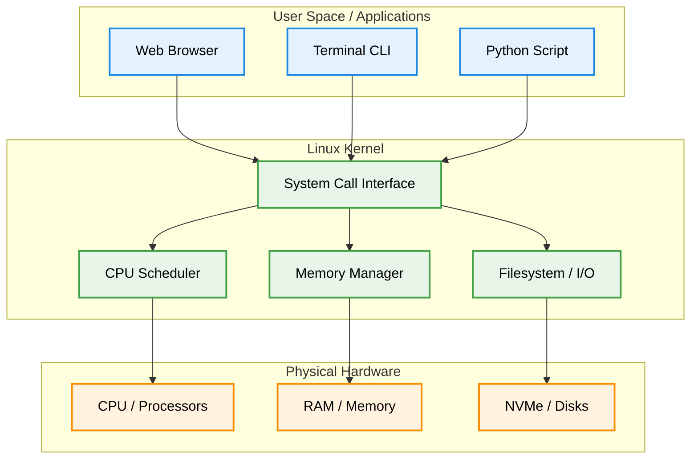

# What is Linux? (Operating System Basics & History)

Version: 2.0.0

Purpose: Canonical lesson structure for Platform Engineering & AI Infrastructure Curriculum.

Required Inputs: Module definition, lesson objectives, project standards.

Outputs: Standards-compliant lesson markdown.

---

# Lesson Metadata

* **Lesson ID:** `MOD-LINUX-BEG-01`
* **Module:** Getting Started with Linux (`MOD-LINUX-BEG`)
* **Difficulty:** Beginner
* **Estimated Duration:** 30 minutes
* **Learning Track:** 🟢 Core
* **Version:** 2.0.0
* **Last Updated:** 2026-06-28

---

# Lesson Overview

This lesson introduces the Linux operating system, exploring what an operating system actually does behind the scenes and how Linux evolved into the dominant foundation of the modern internet and cloud computing. By understanding the core purpose of an operating system, you will establish the essential mental foundation required to support our module capability: **"I can install Linux, navigate the terminal, and manage files."**

---

# Learning Objectives

* Define what an operating system is and explain its role in managing computer hardware.
* Identify the key historical milestones in the creation of Unix and Linux.
* Explain the fundamental difference between the Linux Kernel and a complete Linux Operating System.
* Describe why understanding Linux is the first essential step toward becoming a production-ready Platform Engineer.

---

# Prerequisites

* Basic desktop computer literacy (turning on a computer, using a keyboard and mouse).
* Standard web browsing experience.
* *Note: Zero prior Linux, command-line, or programming experience is required.*

---

# Why This Exists

Imagine buying a brand-new, top-of-the-line computer with a powerful processor, massive memory, and blazing-fast storage. If you turn it on without an operating system, what happens? Absolutely nothing! The screen stays black. 

Hardware by itself is just a collection of silicon, copper, and electricity. It speaks a complex electrical language of ones and zeros that humans cannot easily write or understand. Early computer scientists had to physically wire circuits or punch holes in paper cards just to run basic calculations.

To solve this massive barrier, engineers created the **Operating System (OS)**. The operating system acts as the master translator and manager of the computer. It sits between the physical hardware (CPU, memory, disks) and the human user (or software applications), ensuring that everything communicates smoothly, safely, and efficiently. Linux was created in 1991 by Linus Torvalds to provide a free, highly stable, and open-source operating system that anyone in the world could inspect, modify, and improve.

---

# Core Concepts

## What is an Operating System?
An operating system is the most important software that runs on a computer. It manages the computer's memory and processes, as well as all of its software and hardware. It allows you to communicate with the computer without knowing how to speak the computer's native electrical language.

## The Linux Kernel vs. The Operating System
When people say "Linux," they are usually talking about a complete package of software. However, strictly speaking, Linux is actually just the **Kernel**.
* **The Kernel:** The absolute core of the operating system. It has complete control over everything in the system. It is the direct bridge to the physical hardware, managing memory, scheduling CPU time, and handling electrical signals.
* **The Operating System:** The combination of the Linux kernel plus all the surrounding software tools, graphical interfaces, terminal applications, and system utilities that make the computer usable for humans.

## The Unix Heritage
Linux is a "Unix-like" operating system. Unix was created in the late 1960s at Bell Labs and established several beautiful, enduring design philosophies:
* **Small, sharp tools:** Write programs that do one thing and do it exceptionally well.
* **Everything is a file:** Treat hardware devices, documents, and network connections using the same unified file interface.

---

# Architecture



---

# Real-World Example

Consider the global streaming giant Netflix. When millions of people around the world log in simultaneously to stream high-definition video, those video files aren't being sent from someone's Windows laptop. 

Netflix runs tens of thousands of powerful cloud servers, and every single one of them operates on Linux. The Linux kernel efficiently manages the physical network interface cards and high-speed storage disks, pumping gigabits of video data across the globe with near-zero delay and rock-solid stability.

---

# Hands-on Demonstration

While we will set up our formal Linux terminal in Lesson 04, let's look at how an engineer asks a running Linux system to identify its kernel version and operating system details.

## Input
We use the `uname` (unix name) command with the `-a` (all) flag to ask the Linux kernel to introduce itself.

## Code
```bash
# The 'uname' command prints system information.
# The '-a' flag tells it to print all available details (kernel name, hostname, version, release date).
uname -a
```

## Expected Output
```text
Linux platform-eng-sandbox 6.8.0-31-generic #31-Ubuntu SMP PREEMPT_DYNAMIC Sat Apr 20 00:40:06 UTC 2026 x86_64 x86_64 x86_64 GNU/Linux
```

## Explanation
Notice how elegantly Linux answers our question! Let's break down the words in our output:
* `Linux`: The name of the kernel powering our machine.
* `platform-eng-sandbox`: The hostname (the unique name given to our specific server).
* `6.8.0-31-generic`: The exact version number of the Linux kernel we are running.
* `x86_64`: The physical architecture of our computer processor (64-bit).
* `GNU/Linux`: The complete operating system package combining GNU user tools with the Linux kernel.

---

# Hands-on Lab

* **Objective:** Understand the architectural boundaries of the Linux operating system.
* **Estimated Time:** 15 minutes
* **Difficulty:** Beginner
* **Environment:** Interactive Browser Terminal / Local Sandbox

## Step-by-step Instructions

1. Open your terminal sandbox (or follow along in the provided web browser terminal).
2. Type `uname -s` to verify the kernel name.
3. Type `uname -r` to inspect the exact kernel release version.

## Verification

```bash
uname -s
uname -r
```
*If the output displays `Linux` followed by a version number (e.g., `6.8.0`), you have successfully interacted with the Linux kernel!*

## Troubleshooting

* **Issue:** The terminal says `uname: command not found`.
* **Solution:** You may be running in a standard Windows Command Prompt (`cmd.exe`) rather than a Linux environment. Ensure you have opened your Linux terminal or cloud sandbox.

## Cleanup

No cleanup is required for this conceptual verification lab.

---

# Production Notes

In enterprise cloud environments (such as AWS, Google Cloud, or Azure), Platform Engineers rarely install Linux manually using a CD-ROM or USB drive. Instead, cloud providers offer pre-packaged, highly optimized Linux images (called AMIs in AWS or Cloud Images in GCP). These images are tailored specifically for virtualized hardware, stripping out unnecessary desktop software to maximize performance and security.

---

# Common Mistakes

* **Confusing Linux with a Desktop GUI:** Beginners often think Linux is just another desktop interface like Windows or macOS. In reality, 99% of production Linux servers run completely headless (without any graphical desktop), relying entirely on the command line.
* **Thinking Linux is Owned by One Company:** Unlike Windows (Microsoft) or macOS (Apple), Linux is open-source and maintained by a global community of developers and enterprises worldwide.

---

# Failure-Driven Learning

Imagine a junior engineer attempts to run a heavy graphical video editing application directly on a production cloud server.

## Simulated Failure
```bash
# Attempting to launch a graphical calculator app on a headless Linux server
gnome-calculator
```

## Output
```text
Error: Can't open display: (null)
Failed to initialize GTK.
```

## Diagnosis & Recovery
Why did this fail? The error `Can't open display` occurs because production Linux servers do not have monitors, graphics cards, or graphical desktop window managers installed! To recover, the engineer must realize that server administration requires command-line utilities rather than graphical point-and-click software.

---

# Engineering Decisions

## Open Source vs. Proprietary Operating Systems
When architecting an enterprise platform, engineering leaders must choose between proprietary operating systems (like Windows Server) and open-source operating systems (like Linux).
* **Linux (Open Source):** Zero licensing costs, complete architectural transparency, massive community support, and native containerization capabilities.
* **Windows Server (Proprietary):** High licensing costs per CPU core, closed-source kernel, but excellent native integration with legacy enterprise software (Active Directory).
* **The Platform Decision:** For modern cloud native platforms and AI infrastructure, Linux is the unanimous standard.

---

# Best Practices

* **Embrace the CLI:** Resist the temptation to install graphical desktop environments on Linux servers. Learn to love the speed and efficiency of the terminal.
* **Know Your Kernel:** Always be aware of the Linux kernel version running in your environment, as newer features (like advanced eBPF or cgroups v2) require modern kernel releases.

---

# Troubleshooting Guide

## Issue 1: Identifying an Unknown Operating System

* **Cause:** You are logged into a new cloud server and do not know what operating system or kernel version is running.
* **Diagnosis:** Run `uname -a` to inspect the kernel details, or check the system release file using `cat /etc/os-release`.
* **Solution:** Use the printed output to determine the exact Linux distribution and kernel version, allowing you to choose the correct administrative commands.

---

# Summary

* An operating system is the master manager and translator between physical computer hardware and software applications.
* Linux is an open-source, Unix-like operating system kernel created by Linus Torvalds in 1991.
* The Linux Kernel manages physical hardware (CPU, memory, disks), while the complete Linux Operating System provides the tools and terminal interfaces for human users.
* Linux powers the vast majority of the modern internet, cloud platforms, and AI infrastructure.

---

# Cheat Sheet

```bash
# Print all system and kernel information
uname -a

# Print only the kernel name (e.g., Linux)
uname -s

# Print only the kernel release version (e.g., 6.8.0-31-generic)
uname -r

# Print the hardware processor architecture (e.g., x86_64)
uname -m
```

---

# Knowledge Check

## Multiple Choice Questions

1. What is the fundamental difference between the Linux Kernel and a complete Linux Operating System?
   * A) The kernel is for Windows, while the operating system is for Apple.
   * B) The kernel is the core software that directly manages physical hardware, while the operating system includes user tools and applications.
   * C) The kernel is a graphical desktop interface.
   * D) There is absolutely no difference; the terms are 100% interchangeable.

## Scenario Questions

You are hired as a junior Platform Engineer at a fast-growing AI startup. The founders ask you whether they should deploy their new AI inference engine on Windows Server or Linux. Based on what you learned in this lesson, what do you recommend and why?

## Short Answer Questions

Explain in your own words why operating systems exist and what would happen if you attempted to turn on a computer without one.

<details>
<summary><b>View Answers</b></summary>

### Multiple Choice
1. **B** - The kernel is the core software that manages hardware directly, while the full operating system includes the kernel plus user tools and interfaces.

### Scenario
I recommend Linux because it provides complete architectural transparency, zero licensing costs, massive community support, and is the standard for modern cloud platforms and AI infrastructure.

### Short Answer
Operating systems translate human interactions and software commands into the electrical language of hardware. Without one, the computer cannot function or display anything beyond a black screen, as the hardware lacks instructions.

</details>

---

# Interview Preparation

## Beginner Questions

* What is Linux, and who created it?
* What is the primary purpose of an operating system?
* How would you check the kernel version of a Linux server using the command line?

## Intermediate Questions

* Explain the difference between User Space and Kernel Space in a Linux operating system.
* Why do production cloud servers run "headless" without graphical user interfaces?

## Advanced Questions

* How does the Unix philosophy of "everything is a file" impact how Linux manages physical hardware devices?

## Scenario-Based Discussions

* Discuss the architectural trade-offs between deploying an enterprise platform on an open-source operating system versus a proprietary operating system.

---

# Further Reading

1. [The Linux Kernel Archives](https://kernel.org/)
2. [The Linux Foundation](https://www.linuxfoundation.org/)
3. [The Unix Philosophy (Wikipedia)](https://en.wikipedia.org/wiki/Unix_philosophy)
4. [Linux Operating System Overview (Red Hat)](https://www.redhat.com/en/topics/linux)
5. [Operating Systems: Three Easy Pieces (Free Book)](https://pages.cs.wisc.edu/~remzi/OSTEP/)
