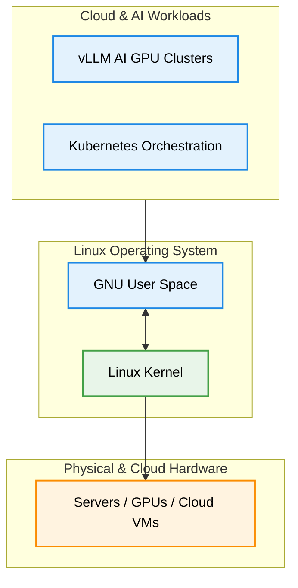

# Why Linux? (Open Source, Stability & The Cloud Ecosystem)

Version: 2.0.0

Purpose: Canonical lesson structure for Platform Engineering & AI Infrastructure Curriculum.

Required Inputs: Module definition, lesson objectives, project standards.

Outputs: Standards-compliant lesson markdown.

---

# Lesson Metadata

* **Lesson ID:** `MOD-LINUX-BEG-02`
* **Module:** Getting Started with Linux (`MOD-LINUX-BEG`)
* **Difficulty:** Beginner
* **Estimated Duration:** 35 minutes
* **Learning Track:** 🟢 Core
* **Version:** 2.0.0
* **Last Updated:** 2026-06-28

---

# Lesson Overview

This lesson explores exactly why Linux became the undisputed operating system of the modern cloud, enterprise data centers, and artificial intelligence infrastructure. By understanding the immense power of open-source software, high stability, and cloud native integration, you will establish the necessary confidence and motivation supporting our module capability: **"I can install Linux, navigate the terminal, and manage files."**

---

# Learning Objectives

* Define what open-source software is and explain how it differs from proprietary software.
* Explain why Linux's architectural stability and security make it ideal for mission-critical production servers.
* Identify the role Linux plays in the broader Cloud Native and AI infrastructure ecosystem.
* Describe the economic and technical motivations that drive enterprise companies to choose Linux.

---

# Prerequisites

* Basic desktop computer literacy.
* Completion of `MOD-LINUX-BEG-01` (What is Linux?).

---

# Why This Exists

In the 1980s and early 1990s, operating systems were largely owned by massive corporations like Microsoft, IBM, and Sun Microsystems. If a company wanted to run a commercial server, they had to pay thousands of dollars in strict licensing fees per server just for the operating system software. Furthermore, the source code was locked away as a proprietary secret. If a server crashed due to a bug in the operating system, engineers were helpless; they had to wait months for the vendor to release an official patch.

This slow, expensive, and secretive model throttled innovation. As the early internet began to explode in growth, companies needed an operating system that was free, highly flexible, and transparent. 

Linux solved this massive industry bottleneck by adopting the **GNU General Public License (GPL)**—making it 100% free and open-source. Anyone could inspect the code, modify it to fit their exact hardware, and deploy it across ten thousand servers without paying a single dollar in software licensing fees. This unleashed the modern cloud computing boom.

---

# Core Concepts

## The Open Source Revolution
Open-source software means the original blueprint of the software (the source code) is freely available to the public. 
* **Complete Transparency:** Engineers can inspect every single line of code to verify exactly how it behaves and ensure there are no hidden backdoors.
* **Global Community:** Hundreds of thousands of software engineers from rival companies (Google, Microsoft, Red Hat, Meta) collaborate to fix bugs and add powerful features to the Linux kernel every day.

## Unmatched Architectural Stability & Uptime
In a desktop operating system (like Windows or macOS), installing a minor software update or driver often forces you to reboot the entire computer. 
* **Zero Reboot Upgrades:** Linux is architected so perfectly that you can update running software, patch security vulnerabilities, and swap out core services without ever rebooting the machine.
* **Rock-Solid Uptime:** Production Linux servers routinely run for multiple years without a single reboot or crash.

## The Cloud & AI Foundation
Modern cloud platforms (Amazon Web Services, Google Cloud, Microsoft Azure) and container engines (Docker, Kubernetes) were architected specifically on top of Linux. Because Linux is lightweight and modular, it can be stripped down to run inside tiny embedded devices or scaled up to power supercomputers running massive AI models.

---

# Architecture



---

# Real-World Example

Consider the global financial market, such as the New York Stock Exchange (NYSE) or major high-frequency trading firms. These institutions process millions of financial transactions every second, worth billions of dollars. 

If a trading server freezes or forces a reboot for even 3 seconds, the company loses millions of dollars. The NYSE operates entirely on Linux because its extreme architectural stability, predictable low-latency performance, and total transparency ensure the global financial engine runs flawlessly without interruption.

---

# Hands-on Demonstration

Let's see how an engineer inspects the uptime of a running Linux server to verify how long it has been operating without a reboot or failure.

## Input
We use the `uptime` command to ask Linux how long it has been running continuously.

## Code
```bash
# The 'uptime' command prints the current time, how long the system has been running,
# how many users are logged on, and the system load averages.
uptime
```

## Expected Output
```text
 04:30:15 up 142 days, 11:24,  2 users,  load average: 0.12, 0.08, 0.05
```

## Explanation
Look at the numbers in our output! `up 142 days, 11:24` tells us this specific Linux server has been running continuously for over 142 days without a single reboot, update freeze, or crash. Notice how elegantly Linux keeps track of this high stability! The `load average` numbers (`0.12, 0.08, 0.05`) show how lightly the CPU has been working over the last 1, 5, and 15 minutes.

---

# Hands-on Lab

* **Objective:** Verify system uptime and explore basic system load statistics in a running Linux environment.
* **Estimated Time:** 10 minutes
* **Difficulty:** Beginner
* **Environment:** Interactive Browser Terminal / Local Sandbox

## Step-by-step Instructions

1. Open your terminal sandbox.
2. Type `uptime` and press Enter to inspect the continuous running duration of your instance.
3. Type `uptime -p` (pretty) to see a clean, human-readable summary of the uptime.

## Verification

```bash
uptime
uptime -p
```
*If the output confirms the system has been `up` for minutes, hours, or days, you have successfully verified Linux's stability tracking!*

## Troubleshooting

* **Issue:** The terminal says `uptime: command not found`.
* **Solution:** Ensure you are executing within your Linux terminal sandbox rather than a Windows PowerShell prompt.

## Cleanup

No cleanup is required for this verification lab.

---

# Production Notes

When enterprise organizations migrate from legacy on-premises servers to the cloud, choosing Linux generates massive financial savings (FinOps). Because Linux requires zero licensing fees per CPU core, companies can dynamically spin up ten thousand temporary cloud servers during a major traffic surge (like Black Friday or a massive AI model training run) and instantly terminate them when finished, paying only for the raw compute hardware used.

---

# Common Mistakes

* **Assuming Free Means Low Quality:** Beginners often assume that because Linux is free and open-source, it must be hobbyist software. In reality, Linux is backed and actively developed by the wealthiest technology corporations on earth (Google, Microsoft, Meta, IBM).
* **Expecting a Commercial Customer Service Number:** Because Linux is open-source, there is no single 1-800 customer support hotline. Engineers rely on official documentation, global community forums, or enterprise support contracts from vendors like Red Hat or Canonical.

---

# Failure-Driven Learning

Imagine a junior engineer attempts to locate a proprietary Windows licensing registration key on a production Linux cloud server.

## Simulated Failure
```bash
# Attempting to query the Windows Software Licensing Management tool on Linux
slmgr.vbs /dlv
```

## Output
```text
bash: slmgr.vbs: command not found
```

## Diagnosis & Recovery
Why did this fail? `slmgr.vbs` is a proprietary licensing script used exclusively on Microsoft Windows Server to verify expensive commercial product keys! To recover, the engineer must realize that Linux operates under the free, open-source GNU General Public License (GPL), requiring absolutely no activation keys or software licensing verification checks.

---

# Engineering Decisions

## Vendor Lock-in vs. Architectural Freedom
When building an enterprise platform, engineering leaders must evaluate the risk of vendor lock-in.
* **Proprietary Stacks:** Tie your entire architecture to a single vendor's roadmap, licensing fee increases, and proprietary API lock-in.
* **Linux & Open Source:** Provide complete architectural freedom. You can migrate your Linux container workloads seamlessly from AWS to Google Cloud, or even back to an on-premises data center, without rewriting your core operating system layer.

---

# Best Practices

* **Audit Open Source Dependencies:** While Linux is highly secure, always verify the provenance and community reputation of any third-party open-source packages you install on top of it.
* **Design for High Availability:** Although Linux servers can run for years without rebooting, always architect your cloud platforms assuming any individual server could suffer physical hardware failure.

---

# Troubleshooting Guide

## Issue 1: Determining System Health & Load

* **Cause:** A web server feels slow, and you need to know if the server has been struggling or recently rebooted.
* **Diagnosis:** Run `uptime` to check how long the system has been up and inspect the 1, 5, and 15-minute load averages.
* **Solution:** If the system uptime is only a few minutes, the server recently suffered an unexpected crash or reboot. If the load averages are vastly higher than your CPU core count, the server is overloaded and requires autoscaling.

---

# Summary

* Linux is open-source software, allowing complete architectural transparency, global collaboration, and zero licensing fees.
* Linux provides unmatched stability and uptime, routinely running for years without requiring a single reboot.
* The modern cloud computing ecosystem, container runtimes (Docker/Kubernetes), and AI GPU clusters are built natively on top of Linux.
* Choosing Linux eliminates commercial vendor lock-in and drastically reduces enterprise infrastructure costs.

---

# Cheat Sheet

```bash
# Print system uptime, active users, and CPU load averages
uptime

# Print uptime in a pretty, human-readable format
uptime -p

# Print the exact date and time the system was started
uptime -s
```

---

# Knowledge Check

## Multiple Choice Questions

1. Why does Linux offer significant financial advantages for massive cloud deployments compared to proprietary operating systems?
   * A) Linux computers do not require electricity to run.
   * B) Linux has zero software licensing fees per server, allowing companies to scale to tens of thousands of servers without paying commercial OS licensing costs.
   * C) Linux forces you to buy expensive proprietary hardware.
   * D) Linux is only free if you use it for playing video games.

## Scenario Questions

You are a Platform Engineer at an enterprise company that currently pays $500,000 every year in operating system licensing fees for proprietary on-premises servers. The Chief Technology Officer (CTO) asks you if migrating to Linux in the cloud would be stable enough for their mission-critical banking database. How do you respond based on what you learned in this lesson?

## Short Answer Questions

Explain in your own words what open-source software is and why having access to the source code is beneficial for a Platform Engineer.

<details>
<summary><b>View Answers</b></summary>

### Multiple Choice
1. **B** - Linux is open-source and eliminates per-server commercial licensing fees, making it highly cost-effective to scale to tens of thousands of cloud instances.

### Scenario
Yes, Linux is exceptionally stable and capable of running for years without requiring a reboot, making it the perfect choice for high-availability enterprise environments like banking.

### Short Answer
Open-source software means the underlying source code is freely available for anyone to view and modify. This allows Platform Engineers to verify exactly how the software works, audit it for security, and customize it without waiting for a vendor patch.

</details>

---

# Interview Preparation

## Beginner Questions

* What does "open-source" mean in the context of Linux?
* How would you check how long a Linux server has been running without a reboot?
* Why do cloud providers (like AWS and Google Cloud) rely primarily on Linux for their cloud infrastructure?

## Intermediate Questions

* Explain the meaning of the three "load average" numbers produced by the `uptime` command.
* How does the open-source collaboration model improve the security of the Linux kernel?

## Advanced Questions

* How does Linux's zero-reboot architectural design impact how Site Reliability Engineers (SREs) manage kernel security patches in production?

## Scenario-Based Discussions

* Discuss the trade-offs of relying on open-source community support versus paying for an enterprise Linux support contract (e.g., Red Hat Enterprise Linux) in a highly regulated banking environment.

---

# Further Reading

1. [The GNU Operating System & GPL License](https://www.gnu.org/)
2. [Open Source Initiative (OSI)](https://opensource.org/)
3. [Why Linux is Core to Cloud Computing (Linux Foundation)](https://www.linuxfoundation.org/)
4. [High Availability & Uptime Concepts (Wikipedia)](https://en.wikipedia.org/wiki/High_availability)
5. [How Linux Rules the Supercomputer World](https://www.top500.org/)
