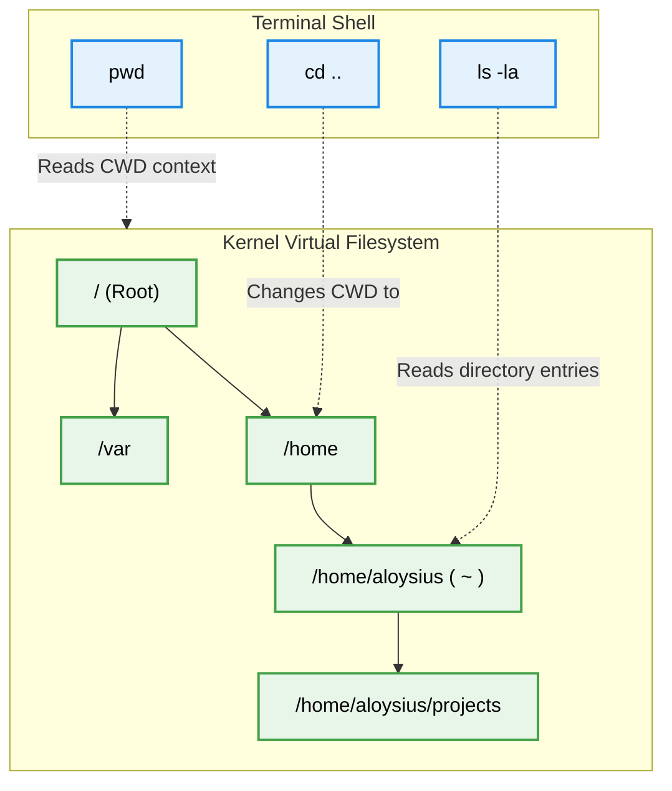

# First Commands & Getting Help (`ls`, `cd`, `pwd`, `man`, `--help`)

Version: 2.0.0

Purpose: Canonical lesson structure for Platform Engineering & AI Infrastructure Curriculum.

Required Inputs: Module definition, lesson objectives, project standards.

Outputs: Standards-compliant lesson markdown.

---

# Lesson Metadata

* **Lesson ID:** `MOD-LINUX-BEG-06`
* **Module:** Getting Started with Linux (`MOD-LINUX-BEG`)
* **Difficulty:** Beginner
* **Estimated Duration:** 45 minutes
* **Learning Track:** 🟢 Core
* **Version:** 2.0.0
* **Last Updated:** 2026-06-28

---

# Lesson Overview

This lesson equips you with the fundamental navigation commands of the Linux operating system, teaching you how to move through the filesystem and independently discover how unknown commands operate. By mastering `pwd`, `ls`, `cd`, `man`, and `--help`, you will achieve the second definitive pillar of our module capability: **"I can install Linux, navigate the terminal, and manage files."**

---

# Learning Objectives

* Determine your exact physical location in the Linux filesystem using `pwd`.
* Inspect the contents of directories using `ls`, including hidden files (`-a`) and detailed lists (`-l`).
* Navigate seamlessly between directories using `cd`, mastering absolute vs. relative file paths.
* Discover command options and documentation independently using `man` and `--help`.

---

# Prerequisites

* Basic desktop computer literacy.
* Completion of `MOD-LINUX-BEG-05` (Terminal Basics & The Shell Prompt).

---

# Why This Exists

In a graphical desktop operating system (like Windows or macOS), finding your files is a visual, point-and-click experience. You open a graphical "File Explorer" window, double-click on a folder icon named "Documents," and visually inspect the icons inside. 

However, as we established earlier, production cloud servers and AI containers do not have graphical desktop interfaces. When you log into a remote server via SSH, you are dropped into a black terminal window with a blinking cursor. You cannot click on folders. You cannot see what files are in front of you. 

If you do not know how to ask the computer where you are standing or what files are nearby, you are completely blind. 

To solve this, the creators of Unix and Linux established a beautiful, concise set of **Navigational Commands** (`pwd`, `ls`, `cd`). These tiny, highly efficient tools act as your virtual eyes and legs inside the command line, allowing you to sprint through massive server filesystems with incredible precision and speed!

---

# Core Concepts

## 1. Where Am I? (`pwd`)
When you get lost in a massive directory tree, you need a GPS. `pwd` stands for **Print Working Directory**. When executed, it prints the absolute, full file path of the exact folder you are currently standing in.

## 2. What is Around Me? (`ls`)
Once you know where you are standing, you need to look around. `ls` stands for **List**. It prints the names of all files and folders located in your current directory.
* **Flags / Options:** You can modify how `ls` behaves by adding flags (letters preceded by a dash `-`):
  * `ls -l` (long): Prints a beautiful, detailed table showing file permissions, file sizes, and modification dates.
  * `ls -a` (all): Prints all files, including **hidden files** (in Linux, any file name starting with a dot `.` is automatically hidden from normal view!).

## 3. How Do I Move? (`cd`)
To walk into a new folder, you use `cd`, which stands for **Change Directory**.
* **Absolute vs. Relative Paths:**
  * **Absolute Path:** A path that starts from the absolute root of the computer system, indicated by a leading forward slash (e.g., `cd /var/log/nginx`).
  * **Relative Path:** A path that starts from where you are currently standing (e.g., `cd projects`).
* **Navigational Shortcuts:**
  * `cd ..` (two dots): Moves you up exactly one folder level into the parent directory.
  * `cd ~` (tilde): Instantly teleports you back to your user's home directory from anywhere in the system!
  * `cd -` (dash): Instantly jumps back to the previous folder you were standing in before your last move.

## 4. How Do I Learn More? (`man` and `--help`)
A professional Platform Engineer does not memorize every command flag. Instead, they know how to ask Linux for the official manual!
* `man [command]`: Opens the official **Manual Page** for any command, providing an exhaustive breakdown of every possible option.
* `[command] --help`: Prints a quick, concise summary of a command's usage directly in the terminal window.

---

# Architecture



---

# Real-World Example

Imagine you are investigating a failing web application on a remote production cloud server. You know the error logs are stored somewhere inside `/var/log`, but you don't know the exact file name.

Using your foundational navigation tools, you execute `cd /var/log` to jump directly into the log directory. You then execute `ls -lh` (long, human-readable) to inspect the files, instantly spotting a massive 500-Megabyte log file named `error.log`. Because you know how to navigate and inspect directories, you isolate the problem in seconds without needing a graphical file explorer!

---

# Hands-on Demonstration

Let's look at how an engineer executes these elegant navigation commands in sequence to explore a Linux filesystem.

## Input 1: Verifying Location and Inspecting Files
We check our active location with `pwd`, and then list all files in detailed format using `ls -la`.

## Code 1
```bash
# 'pwd' prints your current working directory.
pwd

# 'ls -la' lists all files (including hidden .files) in a detailed long table format.
ls -la
```

## Expected Output 1
```text
/home/aloysius

total 28
drwxr-x--- 4 aloysius aloysius 4096 Jun 28 04:15 .
drwxr-xr-x 3 root     root     4096 Jun 28 01:12 ..
-rw-r--r-- 1 aloysius aloysius  220 Jun 28 01:12 .bash_logout
-rw-r--r-- 1 aloysius aloysius 3771 Jun 28 01:12 .bashrc
drwxr-xr-x 2 aloysius aloysius 4096 Jun 28 04:15 projects
```

## Explanation 1
Notice the incredible wealth of information Linux provides! `pwd` confirms we are standing in `/home/aloysius`. `ls -la` reveals our files, including hidden system configuration files like `.bashrc`. Notice the letters on the far left (`drwxr-xr-x`). If a line starts with the letter `d`, it tells us instantly that the item is a **directory** (folder), such as `projects`!

---

## Input 2: Moving Directories and Getting Help
We use `cd` to move into the `projects` folder, and then use `--help` to learn how the `mkdir` command works.

## Code 2
```bash
# Move into the 'projects' directory using a relative path.
cd projects

# Ask the 'mkdir' command to print its quick summary help text.
mkdir --help
```

## Expected Output 2
```text
Usage: mkdir [OPTION]... DIRECTORY...
Create the DIRECTORY(ies), if they do not already exist.

  -m, --mode=MODE   set file mode (as in chmod), not a=rwx - umask
  -p, --parents     no error if existing, make parent directories as needed
  -v, --verbose     print a message for each created directory
      --help        display this help and exit
```

## Explanation 2
Look at how beautifully helpful Linux is! By running `mkdir --help`, the operating system immediately teaches us exactly how to use the command. It even highlights powerful flags like `-p (--parents)`, which allows us to create deeply nested folder structures in a single command!

---

# Hands-on Lab

* **Objective:** Master terminal navigation, directory inspection, and independent help discovery.
* **Estimated Time:** 15 minutes
* **Difficulty:** Beginner
* **Environment:** Interactive Browser Terminal / Local Sandbox

## Step-by-step Instructions

1. Open your terminal sandbox.
2. Type `pwd` to verify your starting directory path.
3. Type `ls -la` to inspect all visible and hidden files around you.
4. Type `cd /tmp` to jump into the temporary system directory using an absolute path.
5. Type `pwd` to verify your new location.
6. Type `cd ~` to instantly teleport back to your home directory.
7. Type `man ls` to open the official manual page for `ls`. (Press the **q key** on your keyboard to quit the manual page when finished!).

## Verification

```bash
pwd
ls -la
cd /tmp
cd ~
man ls
```
*If you successfully navigated to `/tmp`, returned home via `~`, and opened/quit the manual page, you have mastered Linux terminal navigation!*

## Troubleshooting

* **Issue:** You open `man ls`, but you cannot get back to your prompt. Pressing Enter or Escape does nothing.
* **Solution:** Manual pages open inside a terminal pager program called `less`. You must press the **q key** (quit) on your keyboard to exit the manual and return to your prompt!

## Cleanup

No cleanup is required for this foundational navigation lab.

---

# Production Notes

In automated Platform Engineering scripts (such as Dockerfiles or CI/CD pipelines), engineers must exercise extreme caution when using `cd`. Because automated scripts execute line-by-line in the background, relying on relative paths (`cd ../folder`) can easily break if the script is executed from an unexpected starting location. Therefore, production automation scripts strictly mandate the use of **Absolute Paths** (e.g., `cd /opt/my-app/bin`) to ensure predictable, unshakeable execution.

---

# Common Mistakes

* **Forgetting the Space in `cd ..`:** Beginners frequently type `cd..` without a space between the command and the dots. This will instantly return `command not found`. You must include a space: `cd ..`.
* **Assuming Linux Paths Use Backslashes (`\`):** Windows file paths use backslashes (`C:\Users\aloysius`). Linux file paths strictly use forward slashes (`/home/aloysius`). Typing backslashes in Linux will result in formatting errors!

---

# Failure-Driven Learning

Imagine a junior engineer attempts to jump directly into a folder name that contains spaces, but forgets how the Linux shell interprets blank spaces.

## Simulated Failure
```bash
# Attempting to move into a directory named 'My Summer Projects' without quotes
cd My Summer Projects
```

## Output
```text
bash: cd: too many arguments
```

## Diagnosis & Recovery
Why did this fail? The error `too many arguments` occurs because the Bash shell uses blank spaces to separate command words! The shell thought you were asking `cd` to move into three completely different folders simultaneously (`My`, `Summer`, and `Projects`). To recover, the engineer must wrap folder names containing spaces in quotation marks: `cd "My Summer Projects"`, or use the Tab key to let Bash automatically escape the spaces with backslashes (`cd My\ Summer\ Projects`).

---

# Engineering Decisions

## Navigating via CLI vs. Web GUI Consoles
When managing cloud infrastructure, engineering leaders must evaluate how operators interact with systems.
* **Web GUI Consoles (AWS Management Console):** Friendly for absolute beginners, but heavily prone to human error, impossible to audit perfectly, and notoriously slow.
* **Terminal CLI Navigation (`cd`, `ls`, `pwd`):** Fast, fully auditable, low bandwidth, and identical across every Linux machine on earth.
* **The Platform Decision:** Platform Engineers strictly mandate CLI and code-based navigation for all production operations.

---

# Best Practices

* **Always Check `pwd` Before Deleting:** Before running any file deletion commands, always run `pwd` to double-check exactly which directory you are standing in.
* **Use `cd -` to Toggle Folders:** If you are jumping back and forth between two deeply separated directories (e.g., `/var/log/nginx` and `/home/aloysius/projects`), use `cd -` to instantly toggle between them like a switch!

---

# Troubleshooting Guide

## Issue 1: "Permission Denied" When Changing Directories

* **Cause:** You attempt to `cd` into a protected system directory (such as `/root`), but the terminal rejects you.
* **Diagnosis:** The terminal returns `bash: cd: /root: Permission denied`.
* **Solution:** You are operating as a standard user (`$`) and do not have read permissions for the superuser's home directory. If you genuinely require access, you must elevate your privileges using `sudo` (which we explore fully in Module 02!).

---

# Summary

* `pwd` (Print Working Directory) acts as your terminal GPS, printing your absolute folder location.
* `ls` (List) acts as your terminal eyes, displaying visible files, hidden files (`-a`), and detailed long tables (`-l`).
* `cd` (Change Directory) acts as your terminal legs, allowing you to traverse absolute paths (`/var/log`) and relative shortcuts (`..`, `~`, `-`).
* `man` and `--help` empower Platform Engineers to independently discover command syntax and flags without needing internet search engines.

---

# Cheat Sheet

```bash
# Print your absolute current working directory
pwd

# List all files and folders in detailed long table format
ls -la

# Move up exactly one folder level into the parent directory
cd ..

# Teleport instantly back to your user's home directory
cd ~

# Toggle instantly back to your previous working directory
cd -

# Open the official manual page for any command (Press 'q' to quit)
man [command]

# Print a quick summary of a command's usage and flags
[command] --help
```

---

# Knowledge Check

## Multiple Choice Questions

1. You are standing in `/home/aloysius/projects` and want to inspect all files in the folder, including hidden configuration files like `.env`. Which command do you execute?
   * A) `pwd --hidden`
   * B) `ls -la`
   * C) `cd .env`
   * D) `man projects`

## Scenario Questions

You are logged into a secure cloud server that has absolutely no outbound internet access, meaning you cannot use Google or StackOverflow. You need to use the `curl` command to test a network connection, but you cannot remember the exact flag for setting a connection timeout. Based on what you learned in this lesson, how do you independently discover the correct flag directly in the terminal?

## Short Answer Questions

Explain the difference between an Absolute file path and a Relative file path when using the `cd` command.

<details>
<summary><b>View Answers</b></summary>

### Multiple Choice
1. **B** - The `ls` command lists directory contents, while the `-l` flag provides detailed information and the `-a` flag ensures hidden files (starting with a dot) are included.

### Scenario
Run `curl --help` for a quick summary of options, or use `man curl` to read the full official manual page for the command to find the exact timeout flag.

### Short Answer
An absolute path starts from the root directory (`/`) and works anywhere in the system, whereas a relative path starts from your current location, requiring fewer keystrokes but depending on where you are currently standing.

</details>

---

# Interview Preparation

## Beginner Questions

* What does `pwd` stand for, and what does it do?
* How do you list hidden files in a Linux directory?
* How do you exit a manual page opened by the `man` command?

## Intermediate Questions

* Explain what the `..` and `.` symbols represent in a Linux filesystem directory structure.
* Why is it risky to rely on relative file paths inside automated CI/CD deployment scripts?

## Advanced Questions

* Explain how the Linux Virtual Filesystem (VFS) abstracts different physical underlying filesystems (e.g., ext4, xfs) to present a single unified directory tree starting at `/`.

## Scenario-Based Discussions

* Discuss the trade-offs of designing custom internal platform CLI tools with robust `--help` documentation versus maintaining external web-based wiki documentation for engineering teams.

---

# Further Reading

1. [Linux Filesystem Hierarchy Standard (FHS)](https://refspecs.linuxfoundation.org/FHS_3.0/fhs/index.html)
2. [GNU Core Utilities (`ls`, `pwd`) Manual](https://www.gnu.org/software/coreutils/manual/coreutils.html)
3. [The Linux man-pages Project](https://www.kernel.org/doc/man-pages/)
4. [Absolute vs Relative Paths (Linux Handbook)](https://linuxhandbook.com/absolute-vs-relative-path/)
5. [Learn the Linux Command Line (Tutorial)](https://ubuntu.com/tutorials/command-line-for-beginners)
