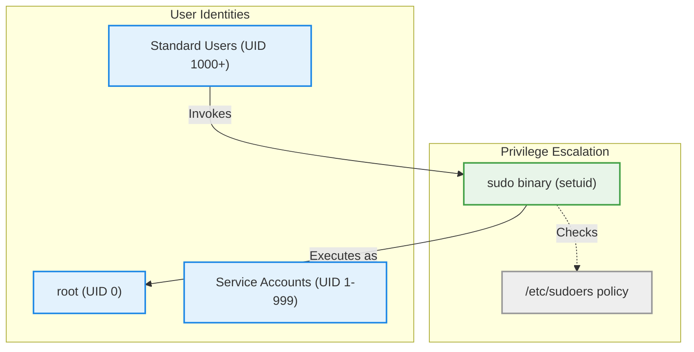

# User & Group Administration (Multi-User Concepts & `sudo`)

Version: 2.0.0

Purpose: Canonical lesson structure for Platform Engineering & AI Infrastructure Curriculum.

Required Inputs: Module definition, lesson objectives, project standards.

Outputs: Standards-compliant lesson markdown.

---

# Lesson Metadata

* **Lesson ID:** `MOD-LINUX-ADM-01`
* **Module:** Linux Administration (`MOD-LINUX-ADM`)
* **Difficulty:** Beginner
* **Estimated Duration:** 40 minutes
* **Learning Track:** 🟢 Core
* **Version:** 2.0.0
* **Last Updated:** 2026-06-28

---

# Lesson Overview

This lesson navigates the multi-user architecture of the Linux operating system, exploring how Linux cleanly isolates different human operators and background software services across separate user accounts. By mastering user creation, group organization, and the superuser do (`sudo`) mechanism, you will confidently achieve the first essential pillar of our module capability: **"I can administer a Linux server, manage permissions, automate simple tasks, and troubleshoot common issues."**

---

# Learning Objectives

* Explain the architectural concept of a multi-user operating system and describe why user isolation is essential for system security.
* Differentiate between the root superuser (`UID 0`), standard system users, and service user accounts.
* Create, modify, and delete user accounts and groups using `useradd`, `usermod`, `userdel`, and `groupadd`.
* Utilize `sudo` to execute administrative commands securely without logging directly into the root account.

---

# Prerequisites

* Completion of Module 01 (`MOD-LINUX-BEG`: Getting Started with Linux).
* Foundational terminal navigation skills (`pwd`, `ls`, `cd`, `cat`).

---

# Why This Exists

In the earliest days of personal desktop computing (such as early Windows or MS-DOS), the operating system was strictly "single-user." Whoever sat at the physical keyboard had complete, unrestricted access to every file, setting, and hardware component in the machine. If a virus infected a user's game file, it had unrestricted permission to destroy the entire operating system.

However, Unix and Linux were designed from the very beginning to power massive, shared enterprise mainframes and cloud servers where dozens of engineers login simultaneously. If one engineer makes a mistake or runs a malicious script, it must be mathematically and structurally impossible for that script to delete another engineer's files or take down the server.

To solve this, Linux established a beautiful, impenetrable **Multi-User Security Model**. Every single file, directory, and software program in Linux is explicitly owned by a specific **User** and **Group**. By separating operators into isolated accounts and controlling administrative elevation through `sudo` (Superuser Do), Linux guarantees that a server can host hundreds of users and microservices simultaneously with absolute security and stability.

---

# Core Concepts

## 1. The Multi-User Hierarchy (UIDs)
In Linux, the operating system doesn't actually care about your username string (e.g., `aloysius`). Behind the scenes, the kernel tracks users using a unique number called a **User ID (UID)**.
* **UID 0 (`root`):** The absolute master superuser account. It has unrestricted, god-like administrative power over the entire system.
* **UID 1 - 999 (System & Service Accounts):** Dedicated, highly restricted user accounts created automatically by Linux to run background software services (like a web server daemon or database engine). These accounts do not have passwords and cannot be logged into by humans!
* **UID 1000+ (Standard Human Users):** Regular user accounts created for human operators and software engineers. They are completely isolated inside their own home directories (`/home/username`).

## 2. Groups (GIDs)
Managing permissions for fifty individual developers one-by-one is exhausting. Linux solves this by organizing users into **Groups**, tracked by a **Group ID (GID)**. Placing fifty developers into a single group named `engineering` allows you to assign permissions to the entire team at once!

## 3. The Superuser Do (`sudo`) Mechanism
Because logging directly into the `root` account is incredibly dangerous (one typo can wipe the hard drive), Platform Engineers strictly lock away the `root` account. Instead, they use `sudo`.
* `sudo [command]`: Stands for **Superuser Do**. It acts like a temporary, highly secure master key. When a standard user types `sudo` before a command, Linux pauses, verifies their password, checks if they are authorized in the `/etc/sudoers` file, and executes that single command with root privileges before instantly returning them to their safe standard prompt (`$`)!

---

# Architecture



---

# Real-World Example

Consider a massive enterprise cloud infrastructure team at a financial corporation like Goldman Sachs. You have three distinct entities running on a production database server:
1. **The Database Daemon:** Runs under a restricted service account named `postgres (UID 110)`. If a hacker compromises the database software, they are trapped inside UID 110 and cannot access the rest of the server!
2. **The Junior Engineers:** Logged in under standard accounts (`UID 1001`, `1002`). They can inspect log files in their home directories but cannot modify database system settings.
3. **The Senior Site Reliability Engineers:** Logged in under standard accounts (`UID 1005`). When they need to restart the database daemon, they execute `sudo systemctl restart postgresql`. The action is securely logged to the system audit trail, guaranteeing perfect operational transparency and security.

---

# Hands-on Demonstration

Let's look at how an engineer inspects user account details, creates a new developer account, and executes an administrative command securely using `sudo`.

## Input 1: Inspecting User and Group Identification Files
We use the `id` command to view our active UID and GID details, and use `cat` to inspect the master user account database file (`/etc/passwd`).

## Code 1
```bash
# 'id' prints your active User ID (UID), primary Group ID (GID), and secondary groups.
id

# 'cat /etc/passwd' prints the master list of all user accounts on the server.
# We pipe it into 'grep' to filter specifically for our active username.
cat /etc/passwd | grep $(whoami)
```

## Expected Output 1
```text
uid=1000(aloysius) gid=1000(aloysius) groups=1000(aloysius),27(sudo),100(users)
aloysius:x:1000:1000:Aloysius Pattath,,,:/home/aloysius:/bin/bash
```

## Explanation 1
Look at how beautifully transparent Linux is! `id` confirms our active user has `UID 1000` and belongs to the `sudo` group (`27`), meaning we have permission to execute administrative commands! Notice the line from `/etc/passwd`. Let's break down the colon-separated values:
* `aloysius`: The username string.
* `x`: Indicates that the password is encrypted and stored securely in a separate file (`/etc/shadow`).
* `1000:1000`: The user's UID and primary GID.
* `/home/aloysius`: The user's absolute home directory path.
* `/bin/bash`: The default shell program assigned to the user.

---

## Input 2: Creating a New User and Adding to a Group
We use `sudo useradd` to create a brand-new developer account, and `sudo usermod` to add them to the engineering group.

## Code 2
```bash
# Create a new group named 'engineering'.
sudo groupadd engineering

# Create a new user named 'sarah', creating a home directory (-m) and setting Bash as the shell (-s).
sudo useradd -m -s /bin/bash sarah

# Add the user 'sarah' to the secondary group 'engineering' (-aG means append to Group).
sudo usermod -aG engineering sarah

# Verify the newly created user's identification details.
id sarah
```

## Expected Output 2
```text
[sudo] password for aloysius: 
uid=1001(sarah) gid=1001(sarah) groups=1001(sarah),1002(engineering)
```

## Explanation 2
Notice how perfectly this functions! When we execute our first `sudo` command, Linux securely prompts us for our password. Once verified, it creates the group `engineering`, creates the user `sarah` (`UID 1001`), creates her home directory (`-m`), and successfully appends her to the `engineering` group!

---

# Hands-on Lab

* **Objective:** Inspect active user IDs, create new user accounts and groups, and utilize `sudo`.
* **Estimated Time:** 15 minutes
* **Difficulty:** Beginner
* **Environment:** Interactive Browser Terminal / Local Sandbox

## Step-by-step Instructions

1. Open your terminal sandbox.
2. Type `id` to verify your active User ID (UID) and Group ID (GID).
3. Type `sudo groupadd platform-engineers` to create a new engineering group.
4. Type `sudo useradd -m -s /bin/bash alex` to create a new developer account.
5. Type `sudo usermod -aG platform-engineers alex` to append the new user to the engineering group.
6. Type `id alex` to verify the newly created user's identity details.

## Verification

```bash
cat /etc/group | grep "platform-engineers"
id alex
```
*If your terminal displays `platform-engineers:x:100X:alex` and confirms Alex's group membership, you have mastered Linux user administration!*

## Troubleshooting

* **Issue:** `sudo useradd` returns `username is not in the sudoers file. This incident will be reported`.
* **Solution:** Your active user account does not have administrative privileges configured in `/etc/sudoers`. If running in a local virtual machine, you must log in as root to add your user to the `sudo` (or `wheel` on RHEL) group.

## Cleanup

```bash
# Safely remove the demonstration user and group when finished
sudo userdel -r alex
sudo groupdel platform-engineers
```

---

# Production Notes

In enterprise cloud architectures, Platform Engineers rarely create human user accounts manually using `useradd` on individual servers. If a company has ten thousand cloud servers, creating fifty user accounts on every single server would be an absolute nightmare. Instead, enterprise environments use centralized identity federation protocols like **LDAP (Lightweight Directory Access Protocol)**, **Kerberos**, or Cloud IAM integration (AWS SSO / Okta). Servers dynamically query a central identity provider to authenticate engineers and determine their group memberships in real-time.

---

# Common Mistakes

* **Running Every Command as `sudo` unnecessarily:** Beginners often develop the dangerous habit of typing `sudo` before every single command (e.g., `sudo ls` or `sudo cat file.txt`). This completely bypasses Linux's safety mechanisms and can lead to accidentally overwriting critical system files. Only use `sudo` when explicitly performing administrative tasks!
* **Forgetting the `-m` Flag with `useradd`:** If you run `useradd username` without the `-m` (make home directory) flag, Linux will create the account but will *not* create their `/home/username` folder! When the user attempts to log in, the terminal will crash with `Could not chdir to home directory`. Always include `-m`!

---

# Failure-Driven Learning

Imagine a junior engineer attempts to inspect the highly secure, encrypted system password hash file (`/etc/shadow`) as a standard user.

## Simulated Failure
```bash
# Attempting to view the master encrypted password hash file as a standard user
cat /etc/shadow
```

## Output
```text
cat: /etc/shadow: Permission denied
```

## Diagnosis & Recovery
Why did this fail? `/etc/shadow` contains the master encrypted password hashes for every user on the server. If standard users could read this file, hackers could perform offline brute-force password cracking attacks! To recover, the engineer must realize that inspecting sensitive system authentication files requires administrative privilege elevation, and execute the command using `sudo`: `sudo cat /etc/shadow`.

---

# Engineering Decisions

## Logging in as `root` vs. Elevating via `sudo`
When hardening a production server, engineering leaders must decide how administrators access the system.
* **Direct Root Login:** Allows administrators to log directly into `root` over SSH. This is incredibly dangerous, as hackers can brute-force the root password, and there is zero auditability regarding which human administrator actually ran a specific command.
* **Sudo Elevation:** Disables direct root login entirely. Administrators log in using their personal standard accounts and elevate via `sudo`. Every command executed via `sudo` is perfectly logged to the system journal (`/var/log/auth.log`), creating an unbreakable audit trail of who ran what!
* **The Platform Decision:** Platform Engineers strictly disable direct root login across all production base images, mandating `sudo` elevation for all administrative tasks.

---

# Best Practices

* **Audit Your Sudoers:** Regularly review the `/etc/sudoers` file (using the safe `visudo` editor) to ensure only authorized engineering groups possess administrative privileges.
* **Use Service Accounts for Software:** Whenever deploying a new background service or application, create a dedicated, non-login service account (`useradd -r -s /usr/sbin/nologin appuser`) to run it securely.

---

# Troubleshooting Guide

## Issue 1: "User is not in the sudoers file"

* **Cause:** A newly hired developer attempts to run an administrative command using `sudo`, but the terminal rejects them.
* **Diagnosis:** The terminal returns `username is not in the sudoers file. This incident will be reported`.
* **Solution:** Log into the server using an authorized administrative account and execute `sudo usermod -aG sudo username` (on Ubuntu/Debian) or `sudo usermod -aG wheel username` (on RHEL/Rocky Linux) to grant them secondary group membership in the master administrative group.

---

# Summary

* Linux is a secure, multi-user operating system that cleanly isolates operators across unique User IDs (UIDs) and Group IDs (GIDs).
* `UID 0` is the all-powerful `root` superuser, `UID 1-999` are restricted service accounts, and `UID 1000+` are standard human users.
* `useradd`, `usermod`, `userdel`, and `groupadd` empower administrators to manage accounts and group memberships cleanly.
* `sudo` (Superuser Do) provides a secure, temporary, and fully auditable gateway for executing administrative commands without risking direct root login.

---

# Cheat Sheet

```bash
# Print your active User ID (UID) and Group ID (GID) details
id [username]

# Inspect the master list of all user accounts on the server
cat /etc/passwd

# Create a new user account with a home directory (-m) and default shell (-s)
sudo useradd -m -s /bin/bash username

# Set or change a user's login password
sudo passwd username

# Create a brand-new group
sudo groupadd groupname

# Add an existing user to a secondary group (-aG = append to Group)
sudo usermod -aG groupname username

# Delete a user account and remove their home directory (-r)
sudo userdel -r username

# Safely edit the master sudoers administrative configuration file
sudo visudo
```

---

# Knowledge Check

## Multiple Choice Questions

1. You are creating a brand-new user account named `david` for a newly hired software engineer. Which command ensures that Linux successfully creates David's account along with his `/home/david` directory and sets his default shell to Bash?
   * A) `sudo useradd david`
   * B) `sudo useradd -m -s /bin/bash david`
   * C) `sudo usermod -aG david bash`
   * D) `cat /etc/passwd | grep david`

## Scenario Questions

You are a Site Reliability Engineer managing a production web server. A junior developer asks you for the password to log directly into the `root` account over SSH so they can restart the Nginx web server. Based on what you learned in this lesson, how do you explain why direct root login is strictly forbidden in production, and what alternative solution do you implement to allow them to restart Nginx securely?

## Short Answer Questions

Explain the architectural difference between a standard human user account (`UID 1000+`) and a system service account (`UID 1 - 999`).

<details>
<summary><b>View Answers</b></summary>

### Multiple Choice
1. **B** - The `-m` flag creates the home directory and `-s` specifies the default shell.

### Scenario
Direct root login removes accountability and violates the principle of least privilege. Instead, grant the developer restricted `sudo` privileges via `visudo` to only run the `systemctl restart nginx` command.

### Short Answer
Standard user accounts (UID 1000+) are meant for interactive login with a home directory and shell. System service accounts (UID 1-999) are used by background daemons, do not have interactive shells, and enhance security by preventing login.

</details>

---

# Interview Preparation

## Beginner Questions

* What is a UID in Linux, and what is `UID 0`?
* What does the `sudo` command stand for, and why is it used?
* How would you add an existing user to a secondary group like `docker`?

## Intermediate Questions

* Explain what information is stored in `/etc/passwd` versus `/etc/shadow`.
* Why is it critical to use the `visudo` command when editing the `/etc/sudoers` file rather than using a standard text editor like Nano or Vim?

## Advanced Questions

* Explain how the Linux Pluggable Authentication Modules (PAM) architecture intercepts and validates user authentication requests during a `sudo` privilege elevation operation.

## Scenario-Based Discussions

* Discuss the security and operational trade-offs of managing local Linux user accounts via Ansible automation versus integrating servers with a centralized LDAP / Cloud IAM identity provider in a multi-cloud enterprise environment.

---

# Further Reading

1. [Linux User and Group Management (Red Hat Enterprise Linux Documentation)](https://docs.redhat.com/)
2. [Sudo Official Project Website](https://www.sudo.ws/)
3. [Understanding /etc/passwd and /etc/shadow (Linux Handbook)](https://linuxhandbook.com/)
4. [Mastering visudo and sudoers configuration](https://www.digitalocean.com/community/tutorials/how-to-edit-the-sudoers-file)
5. [Pluggable Authentication Modules (PAM) Overview](https://en.wikipedia.org/wiki/Pluggable_Authentication_Modules)
