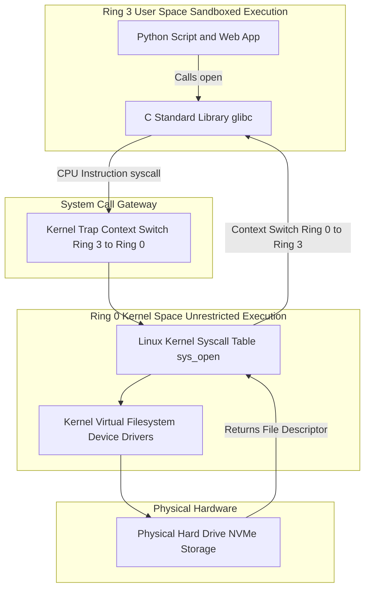

# Kernel Architecture & User Space vs. Kernel Space (Ring 0 vs Ring 3, System Calls)

Version: 2.0.0

Purpose: Canonical lesson structure for Platform Engineering & AI Infrastructure Curriculum.

Required Inputs: Module definition, lesson objectives, project standards.

Outputs: Standards-compliant lesson markdown.

---

# Lesson Metadata

* **Lesson ID:** `MOD-LINUX-INT-01`
* **Module:** Linux Internals (`MOD-LINUX-INT`)
* **Difficulty:** Intermediate
* **Estimated Duration:** 45 minutes
* **Learning Track:** 🟢 Core
* **Version:** 2.0.0
* **Last Updated:** 2026-06-28

---

# Lesson Overview

This lesson pulls back the architectural curtain on the Linux kernel, exploring how the operating system establishes strict hardware security boundaries between normal software applications and underlying physical hardware. By mastering User Space, Kernel Space, CPU Rings, and System Calls (`syscalls`), you will firmly establish the foundational X-ray intuition supporting our module capability: **"I understand how Linux works internally, can trace system calls, manage resource cgroups, and debug complex system behavior."**

---

# Learning Objectives

* Differentiate between User Space and Kernel Space and explain why memory isolation between them is critical for operating system stability.
* Define the hardware architectural security rings of modern CPUs, contrasting Ring 0 (Kernel Mode) with Ring 3 (User Mode).
* Explain the exact execution mechanics of a System Call (`syscall`) and how it acts as a secure gateway between User Space and Kernel Space.
* Inspect live system call execution metrics and kernel metadata using terminal profiling tools.

---

# Prerequisites

* Completion of Module 01 (`MOD-LINUX-BEG`) and Module 02 (`MOD-LINUX-ADM`).
* Foundational Linux administrative skills (`sudo`, `cat`, `ps`, `grep`).

---

# Why This Exists

When you write a Python script that opens a file on your hard drive (`open('data.txt')`), or write a Node.js web server that sends a packet over the network, you might assume your code is directly touching the physical hard drive disk or network card wires. 

In reality, your software application has absolutely zero direct access to physical hardware! 

If fifty different microservices running on a cloud server were allowed to directly send electrical signals to the physical hard drive simultaneously, they would instantly collide, overwrite each other's data, and permanently corrupt the physical disk.

To prevent this catastrophic chaos, modern operating systems and CPU manufacturers established a beautiful, impenetrable fortress known as **Dual-Mode Operation (User Space vs. Kernel Space)**. The Linux kernel acts as the absolute master traffic guardian standing between your software programs and the physical hardware. By understanding how software applications transition across CPU protection rings via **System Calls**, Platform Engineers gain an elite debugging vantage point, allowing them to pinpoint exact hardware bottlenecks and software failures with mathematical certainty.

---

# Core Concepts

## 1. User Space vs. Kernel Space
Modern Linux operating systems divide system memory (RAM) into two strictly isolated territories:
* **User Space:** The playground where all normal software programs execute (e.g., Python scripts, Nginx web servers, databases, Bash terminals). Applications in User Space are strictly sandboxed—they cannot touch physical hardware or access the memory of other programs.
* **Kernel Space:** The highly secure fortress where the core Linux kernel software executes. The kernel has unrestricted, god-like access to every single byte of physical RAM, CPU registers, hard drives, and network cards.

## 2. Hardware Security Rings (Ring 0 vs. Ring 3)
This memory isolation is enforced at the physical hardware level by modern x86/ARM central processing units (CPUs) using **Protection Rings**:
* **Ring 0 (Kernel Mode / Supervisor Mode):** The innermost ring. Code running in Ring 0 has absolute, unrestricted power to execute any physical CPU instruction and touch any hardware component. The Linux kernel lives entirely inside Ring 0.
* **Ring 3 (User Mode):** The outermost ring. Code running in Ring 3 is highly restricted. If a program in Ring 3 attempts to execute a direct hardware instruction (like writing directly to a hard drive controller), the CPU instantly triggers a fatal hardware exception and kills the process! All user applications live inside Ring 3. *(Note: Rings 1 and 2 are traditionally unused in modern Linux, though sometimes utilized by hardware virtualization hypervisors).*

## 3. What is a System Call (`syscall`)?
If programs in Ring 3 cannot touch hardware, how does a Python script in User Space successfully write a file to the hard drive? It must make a **System Call (`syscall`)**!
* **The Gateway:** A system call is a highly secure, formal request made by a User Space application asking the Linux kernel to perform a hardware operation on its behalf.
* **Context Switching:** When a Python script wants to write a file, it loads the data into CPU registers and fires a special software interrupt instruction (e.g., `sysenter` or `syscall`). The CPU instantly pauses the Python script, elevates from Ring 3 to Ring 0 (a **Context Switch**), jumps into Kernel Space, verifies permissions, writes the file to the physical hard drive, and then drops back down to Ring 3 to hand control back to the Python script!

```text
[ Python Script (Ring 3) ] ──► (Syscall: write) ──► [ Linux Kernel (Ring 0) ] ──► [ Hard Drive ]
```

## 4. Common System Calls
There are over 300 standard system calls in the Linux kernel. Here are the most famous ones every Platform Engineer should know:
* `sys_read` / `sys_write`: Read or write data to a file or network socket.
* `sys_open` / `sys_close`: Open or close a file descriptor.
* `sys_fork` / `sys_execve`: Create a brand-new child process and execute a binary program.
* `sys_socket` / `sys_bind`: Create a network socket and bind it to a port.

---

# Architecture



---

# Real-World Example

Imagine you are managing a highly trafficked API microservice powering an e-commerce platform during Black Friday. Your developers write a custom logging function that attempts to write a log entry to the hard drive for every single incoming HTTP request.

Suddenly, your cloud servers experience immense CPU spikes, and API response times drop to a crawl. When you inspect the server using `top`, you notice that the CPU is spending 70% of its time in `sys` (Kernel Space) rather than `us` (User Space)!

Because you understand kernel architecture perfectly, you know exactly what happened: every single log write triggers a heavy **Context Switch** from Ring 3 to Ring 0! Making 50,000 system calls per second completely exhausted the CPU's context-switching capacity. You instruct the developers to implement an asynchronous memory buffer that batches log entries together, reducing system calls from 50,000/sec to 10/sec. The CPU load instantly drops to normal, and your API recovers flawlessly!

---

# Hands-on Demonstration

Let's look at how an engineer inspects active CPU time spent in User Space vs Kernel Space using `top`, and inspects the underlying system calls executed by a simple command using `strace`.

## Input 1: Inspecting User Space vs Kernel Space CPU Usage
We use `top -b -n 1` to capture a single clean snapshot of system CPU utilization metrics, focusing on the `%Cpu(s)` row.

## Code 1
```bash
# Capture a single batch snapshot (-b -n 1) of system performance using top.
# We pipe it into grep to isolate the master CPU metrics row.
top -b -n 1 | grep "%Cpu"
```

## Expected Output 1
```text
%Cpu(s):  12.5 us,   3.2 sy,  0.0 ni,  84.1 id,   0.1 wa,  0.0 hi,  0.1 si,  0.0 st
```

## Explanation 1
Look at how beautifully detailed Linux's CPU metrics are! Let's deconstruct the core values:
* `12.5 us` (User Space): The CPU spent 12.5% of its time executing normal application software in Ring 3.
* `3.2 sy` (System / Kernel Space): The CPU spent 3.2% of its time executing kernel system calls and drivers inside Ring 0!
* `84.1 id` (Idle): The CPU spent 84.1% of its time sitting idle waiting for work.
* `0.1 wa` (I/O Wait): The CPU spent 0.1% of its time waiting for physical hard drives to finish reading/writing data.

---

## Input 2: Tracing System Calls with `strace`
We use `strace` to intercept and print the exact system calls executed by the Linux kernel when we run a simple `echo` command.

## Code 2
```bash
# Use 'strace' to intercept and display the system calls executed by 'echo'.
# We pipe it into grep to filter specifically for the write system call.
strace echo "Tracing Kernel System Calls!" 2>&1 | grep "write"
```

## Expected Output 2
```text
write(1, "Tracing Kernel System Calls!\n", 29) = 29
```

## Explanation 2
Notice how magical this feels! When we execute `echo`, `strace` acts as an X-ray machine, intercepting the transition from Ring 3 to Ring 0. The output `write(1, "...", 29) = 29` proves exactly what happened: `echo` executed the `write` system call, requesting the kernel to write 29 bytes of text to file descriptor `1` (`stdout`). The kernel successfully executed the command and returned `29` confirming 29 bytes were written!

---

# Hands-on Lab

* **Objective:** Inspect User vs Kernel CPU utilization and trace system calls using `strace`.
* **Estimated Time:** 15 minutes
* **Difficulty:** Intermediate
* **Environment:** Interactive Browser Terminal / Local Sandbox

## Step-by-step Instructions

1. Open your terminal sandbox.
2. Type `top -b -n 1 | grep Cpu` to inspect your active User (`us`) vs System (`sy`) CPU percentages.
3. Type `sudo apt update && sudo apt install -y strace` to ensure the strace utility is installed.
4. Type `strace pwd 2>&1 | grep getcwd` to intercept the system call used by `pwd` to discover your working directory.
5. Type `strace cat /etc/hostname 2>&1 | grep open` to intercept the system call used by `cat` to open a file.

## Verification

```bash
strace echo "Lab Verification" 2>&1 | grep write
```
*If your terminal echoes `write(1, "Lab Verification\n", 17) = 17`, you have successfully mastered system call tracing!*

## Troubleshooting

* **Issue:** `strace` returns `strace: ptrace(PTRACE_TRACEME, ...): Operation not permitted`.
* **Solution:** You are running inside a highly locked-down Docker container without the required `SYS_PTRACE` kernel capability. Run the command in a standard virtual machine, cloud shell, or launch your container with `docker run --cap-add=SYS_PTRACE`.

## Cleanup

No cleanup is required for this kernel tracing lab.

---

# Production Notes

In enterprise cloud monitoring (such as Datadog, New Relic, or Prometheus node exporters), Platform Engineers set up automated paging alerts specifically monitoring the `sy` (System/Kernel CPU) metric. Under normal workloads, servers should spend the vast majority of their time in `us` (User Space). If `sy` usage spikes above 30%, it indicates a severe architectural anomaly—such as heavy context switching, failing device drivers, or network packet flooding (DDoS attacks) overwhelming the kernel!

---

# Common Mistakes

* **Assuming User Space Applications Can Bypass the Kernel:** Beginners often believe that writing code in low-level languages like C or Rust allows them to touch hardware directly without making system calls. This is physically impossible in Ring 3! Even raw C code must compile down to assembly instructions that fire system calls (`syscall`) to enter Ring 0.
* **Ignoring Context Switching Overhead in Software Design:** Junior developers frequently write tight loops that make thousands of individual tiny file or network writes per second, completely unaware of the massive CPU context-switching overhead incurred by bouncing back and forth between Ring 3 and Ring 0. Always buffer your I/O!

---

# Failure-Driven Learning

Imagine a junior engineer attempts to write a custom C program that attempts to execute a privileged assembly instruction (like `cli` - clear interrupts) directly in User Space.

## Simulated Failure
```bash
# Simulating the execution of a privileged assembly instruction in Ring 3
python3 -c 'import ctypes; ctypes.string_at(0)'
```

## Output
```text
Segmentation fault (core dumped)
```

## Diagnosis & Recovery
Why did this fail? The fatal error `Segmentation fault` (SIGSEGV) occurs because the application attempted to access invalid memory or execute a privileged hardware instruction while trapped inside Ring 3 (User Mode)! The physical CPU instantly detected the illegal operation, trapped into Ring 0, and commanded the Linux kernel to drop a `SIGKILL` executioner signal on the offending process to protect the operating system. To recover, the engineer must ensure their software strictly utilizes standard operating system system calls to interact with memory and hardware.

---

# Engineering Decisions

## Ring 0 Monolithic Kernel vs. Microkernel Architecture
When designing operating system kernels, computer scientists must choose between monolithic and microkernel models.
* **Microkernel Architecture (e.g., MINIX, macOS Mach):** Keeps Ring 0 as tiny as possible. Moves device drivers, filesystems, and networking stacks out of Ring 0 and runs them as standard user servers inside Ring 3. Highly secure, but suffers massive performance penalties due to endless context switching between servers.
* **Monolithic Kernel Architecture (Linux):** Packs the entire operating system (memory management, filesystems, networking, device drivers) directly inside Ring 0! Extremely fast and efficient because all kernel components communicate directly in shared kernel memory without context switching.
* **The Platform Decision:** The Linux monolithic kernel architecture powers 99.9% of all global cloud infrastructure due to its unmatched raw execution performance.

---

# Best Practices

* **Monitor I/O Wait (`wa`):** When reviewing `top`, pay close attention to `wa` (I/O Wait). If `wa` is high, your CPU is perfectly healthy but is sitting idle waiting for slow hard drives to finish processing system calls.
* **Master `strace -c` for Profiling:** When debugging a slow application, run `strace -c ./my-app` to print a beautiful summary table showing exactly how many times each system call was executed and how many milliseconds were spent in each!

---

# Troubleshooting Guide

## Issue 1: "strace: ptrace: Operation not permitted" (Container Restriction)

* **Cause:** You attempt to use `strace` inside a standard Docker container, but the kernel rejects the operation.
* **Diagnosis:** The terminal returns `strace: ptrace(PTRACE_TRACEME, ...): Operation not permitted`.
* **Solution:** To prevent malicious containers from inspecting the host kernel, Docker strips away the `SYS_PTRACE` kernel capability by default. If you genuinely need to trace system calls inside a container for debugging, you must deploy the container with the flag `docker run --cap-add=SYS_PTRACE`.

---

# Summary

* **User Space (Ring 3)** is the sandboxed outer ring where normal applications execute without direct hardware access.
* **Kernel Space (Ring 0)** is the secure inner fortress where the Linux kernel executes with unrestricted physical hardware access.
* A **System Call (`syscall`)** is the formal gateway through which User Space programs request hardware operations (`sys_open`, `sys_write`), triggering a CPU context switch from Ring 3 to Ring 0.
* `top` tracks CPU time spent in User Space (`us`) vs Kernel Space (`sy`).
* `strace` acts as an X-ray machine, intercepting and printing live system calls, empowering Platform Engineers to debug software-to-kernel interactions with absolute precision.

---

# Cheat Sheet

```bash
# Inspect CPU time spent in User Space (us) vs Kernel Space (sy)
top -b -n 1 | grep "%Cpu"

# Trace all system calls executed by a command
strace [command]

# Filter strace output for a specific system call (e.g., open, write, connect)
strace [command] 2>&1 | grep "write"

# Generate a beautiful profiling summary table of all executed system calls
strace -c [command]

# Trace an already running background daemon process by its PID
sudo strace -p [PID]

# Trace child processes spawned by a command (-f = follow forks)
strace -f [command]
```

---

# Knowledge Check

## Multiple Choice Questions

1. A production web server is experiencing massive CPU spikes. When you inspect `top`, you notice the CPU row reports `%Cpu(s): 5.2 us, 88.4 sy, 0.0 wa`. What does the `88.4 sy` metric indicate?
   * A) The CPU is spending 88.4% of its time waiting for slow hard drives.
   * B) The CPU is spending 88.4% of its time executing normal user applications in Ring 3.
   * C) The CPU is spending 88.4% of its time executing kernel system calls and drivers inside Ring 0.
   * D) The CPU is spending 88.4% of its time sitting completely idle.

## Scenario Questions

You are investigating a mysterious Python microservice that freezes up for 5 seconds every time it attempts to connect to an external database. You want to see exactly which network system call (`connect`) is hanging and what IP address it is attempting to reach. Based on what you learned in this lesson, what command utility do you use to intercept the application's live system calls?

## Short Answer Questions

Explain the exact architectural difference between Ring 0 (Kernel Mode) and Ring 3 (User Mode) in modern CPU hardware execution rings.

<details>
<summary><b>View Answers</b></summary>

### Multiple Choice
1. **C** - The `sy` (System) metric indicates the percentage of CPU time spent in Ring 0 (Kernel Space) executing system calls or driver code, which explains the high kernel load.

### Scenario
You should use the `strace` command (e.g., `strace -p [PID]`) to intercept the live system calls of the hanging Python microservice and identify the blocked `connect` call.

### Short Answer
Ring 0 (Kernel Space) has absolute, unrestricted access to physical hardware and memory, while Ring 3 (User Space) is strictly sandboxed and must request hardware operations through system calls.

</details>

---

# Interview Preparation

## Beginner Questions

* What is the difference between User Space and Kernel Space?
* What is a system call (`syscall`) in Linux?
* What does the `strace` command do?

## Intermediate Questions

* Explain what a CPU context switch is during a system call operation.
* What do the metrics `us`, `sy`, `id`, and `wa` represent in `top` CPU output?

## Advanced Questions

* Explain how the Linux kernel handles the transition from Ring 3 to Ring 0 using the `syscall` assembly instruction, including how the CPU saves user registers and locates the kernel syscall table (`sys_call_table`).

## Scenario-Based Discussions

* Discuss the performance trade-offs of heavily utilizing `strace` on high-traffic production daemons versus implementing modern eBPF (Extended Berkeley Packet Filter) tracing tools in an enterprise observability platform.

---

# Further Reading

1. [The Linux Kernel documentation (Official Kernel Wiki)](https://www.kernel.org/doc/html/latest/)
2. [Strace Official Project Website](https://strace.io/)
3. [Anatomy of a System Call (LWN.net Deep Dive)](https://lwn.net/Articles/604287/)
4. [Mastering strace for Linux Debugging (Red Hat)](https://www.redhat.com/)
5. [Understanding CPU Rings and Dual-Mode Operation](https://en.wikipedia.org/wiki/Protection_ring)
