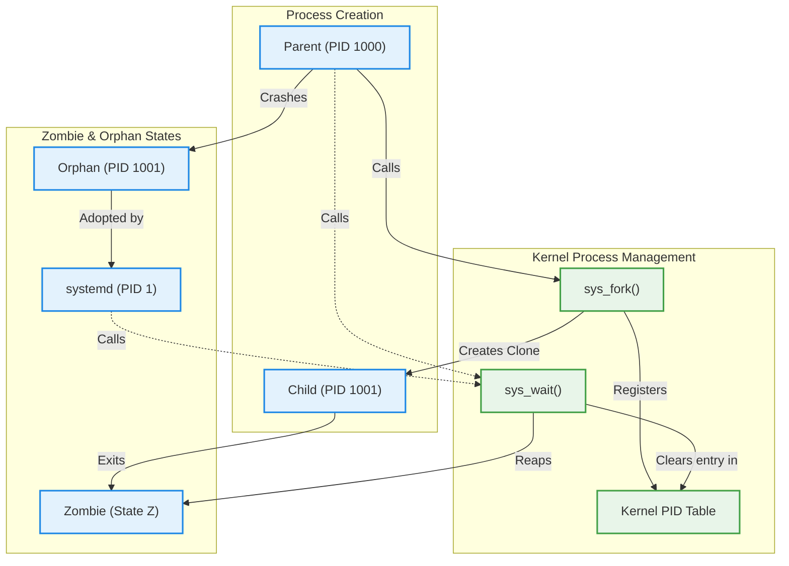

# Process Management Under the Hood (`fork`, `execve`, Zombie & Orphan Processes)

Version: 2.0.0

Purpose: Canonical lesson structure for Platform Engineering & AI Infrastructure Curriculum.

Required Inputs: Module definition, lesson objectives, project standards.

Outputs: Standards-compliant lesson markdown.

---

# Lesson Metadata

* **Lesson ID:** `MOD-LINUX-INT-02`
* **Module:** Linux Internals (`MOD-LINUX-INT`)
* **Difficulty:** Intermediate
* **Estimated Duration:** 50 minutes
* **Learning Track:** 🟢 Core
* **Version:** 2.0.0
* **Last Updated:** 2026-06-28

---

# Lesson Overview

This lesson explores the elegant biological mechanics of process creation and lifecycle management within the Linux kernel. By deconstructing the legendary `fork-exec` model, the Process Control Block (PCB), and the obscure phenomena of Zombie and Orphan processes, you will firmly establish the deep architectural intuition supporting our module capability: **"I understand how Linux works internally, can trace system calls, manage resource cgroups, and debug complex system behavior."**

---

# Learning Objectives

* Explain the two-step `fork-exec` architectural model used by the Linux kernel to create and launch new processes.
* Define the Process Control Block (PCB / `task_struct`) and describe how the kernel tracks process execution states.
* Differentiate between a Zombie Process (`defunct`) and an Orphan Process, explaining the vital role of `PID 1` in process reaping.
* Inspect process parent-child hierarchy trees using `pstree` and identify zombie states using `ps aux`.

---

# Prerequisites

* Completion of `MOD-LINUX-INT-01` (Kernel Architecture & System Calls).
* Foundational Linux process control skills (`ps aux`, `kill`, `grep`).

---

# Why This Exists

In Module 02, we learned how to inspect active running processes using `ps aux`, monitor them using `top`, and terminate them using `kill`. However, as an external systems administrator, you were viewing processes as black boxes. You knew how to start them and stop them, but you didn't know how the Linux kernel physically constructs them in memory or cleans up their data when they die.

In desktop GUI operating systems, process creation is often a massive, highly complex monolithic operation. In Unix and Linux, process creation is an incredibly elegant, two-step cellular division process known as the **`fork-exec` model**.

Every single process in Linux (except `PID 1`) is created by an existing parent process dividing itself into an exact clone. When processes die, they leave behind exit codes that must be formally "reaped" by their parents. If a parent process suffers a software bug and forgets to reap its dead children, the system becomes infested with **Zombie Processes** that cannot be killed by normal `kill -9` commands! By mastering the deep internal lifecycle of Linux processes, Platform Engineers can diagnose complex process deadlocks, prevent PID table exhaustion, and architect robust, self-healing cloud container entrypoints.

---

# Core Concepts

## 1. The `fork-exec` Model
In Linux, creating a brand-new running software program is a beautiful two-step system call sequence:
* `sys_fork` (Cellular Division): The existing parent process makes a `fork()` system call. The Linux kernel instantly pauses the parent and creates an exact duplicate child clone in memory. The child receives an identical copy of the parent's memory, variables, and open file descriptors, but receives a brand-new Process ID (PID)!
* `sys_execve` (Brain Replacement): Immediately after forking, the child clone makes an `execve()` system call, pointing to a new binary file on the hard drive (e.g., `/usr/bin/python3`). The Linux kernel completely wipes out the child's old cloned memory and replaces its "brain" with the brand-new Python program!

```text
[ Parent Process (Bash) ] ──► (fork) ──► [ Cloned Child (Bash) ] ──► (execve) ──► [ New Process (Python) ]
```

## 2. The Process Control Block (`task_struct`)
Behind the scenes, the Linux kernel tracks every running process using a massive C-structure in Ring 0 memory called the `task_struct` (or Process Control Block). It stores the process's PID, parent PID (`PPID`), active memory locations, CPU registers, and open file descriptors.

## 3. Zombie Processes (`defunct` / State `Z`)
When a child process finishes running, it doesn't instantly vanish. It shuts down its memory but leaves its `task_struct` sitting in the kernel's master PID table holding its Exit Code (`$?`).
* **The Zombie State:** The dead child enters the **Zombie (`Z` / `<defunct>`)** state, waiting silently for its parent to make a `wait()` system call to read its exit code (a process called **Reaping**).
* **The Danger:** If a badly written parent software program never calls `wait()`, the dead child remains a zombie forever! Because a zombie is already dead, **you cannot kill a zombie using `kill -9`!** If a server accumulates 30,000 zombies, the kernel's PID table becomes completely exhausted, and the server crashes because it cannot fork new processes!

## 4. Orphan Processes and `PID 1` Reaping
What happens if a parent process suddenly crashes and dies while its child process is still actively running in the background?
* **The Orphan State:** The child instantly becomes an **Orphan Process** because its parent PID (`PPID`) no longer exists!
* **`PID 1` Adoption:** The Linux kernel's execution engine instantly steps in to save the orphan. It re-assigns the orphan's `PPID` directly to `PID 1` (`systemd` or `init`). `PID 1` is specially programmed to act as the ultimate foster parent—whenever an adopted orphan eventually dies, `PID 1` instantly calls `wait()` and reaps the zombie cleanly!

---

# Architecture



---

# Real-World Example

Imagine you are deploying a custom Python web application inside a Docker container to a production Kubernetes cluster. To keep the container lightweight, you set the Python application directly as `PID 1` in your Dockerfile (`ENTRYPOINT ["python3", "app.py"]`).

The Python application frequently spawns temporary child helper scripts to process images. However, the Python developers forgot to include `wait()` calls in their code. 

Suddenly, your Kubernetes container freezes up and stops accepting web requests. When you inspect the container using `ps aux`, you see 5,000 dead child processes sitting in the `Z` (`<defunct>`) state! 

Because you understand Linux internal process mechanics perfectly, you know exactly what happened: your Python app was running as `PID 1` but lacked the architectural capability to reap dead zombies! You update your Dockerfile to include a specialized lightweight init system like `tini` (`ENTRYPOINT ["tini", "--", "python3", "app.py"]`). `tini` becomes `PID 1`, flawlessly reaps all dead helper zombies, and your Kubernetes container runs healthily forever!

---

# Hands-on Demonstration

Let's look at how an engineer inspects process hierarchy trees using `pstree`, and simulates the creation and identification of a Zombie process using `ps aux | grep`.

## Input 1: Inspecting Process Hierarchy Trees
We use `pstree -p` to view a beautiful visual ASCII tree showing the exact parent-child relationships and PIDs of running system processes.

## Code 1
```bash
# Display a visual ASCII tree of running processes and their exact PIDs (-p).
# We pipe it into head to view the top 10 master parent branches starting from PID 1.
pstree -p | head -n 10
```

## Expected Output 1
```text
systemd(1)─┬─systemd-journal(480)
           ├─systemd-logind(510)
           ├─systemd-network(515)
           ├─sshd(712)───sshd(1020)───bash(1050)───pstree(24510)
           └─cron(720)
```

## Explanation 1
Look at how beautifully this visualizes the Linux process architecture! `systemd(1)` sits at the absolute root of the tree as `PID 1`. Notice our active terminal session branch: the master SSH daemon `sshd(712)` forked a child login session `sshd(1020)`, which forked our `bash(1050)` shell, which forked our `pstree(24510)` command! Every process is perfectly linked to its parent.

---

## Input 2: Simulating and Inspecting a Zombie Process
We use a short, clever Python one-liner to fork a child process that instantly exits while the parent sleeps, creating a live Zombie process, and inspect it using `ps aux`.

## Code 2
```bash
# Run a Python one-liner in the background that forks a child and leaves it as a zombie.
python3 -c 'import os, time; pid = os.fork(); time.sleep(300) if pid > 0 else os._exit(0)' &

# Use ps aux piped into grep to inspect the newly created zombie process state.
ps aux | grep -w "Z" | grep -v "grep"
```

## Expected Output 2
```text
[1] 24550
aloysius   24551  0.0  0.0      0     0 pts/0    Z    04:55   0:00 [python3] <defunct>
```

## Explanation 2
Notice how magical this is! Our Python script successfully executed `os.fork()`. The child clone (`PID 24551`) instantly executed `os._exit(0)`, dying immediately. Because the parent (`PID 24550`) went to sleep without calling `wait()`, the child became a live zombie! Notice the `ps aux` output: `Z` in the state column and `<defunct>` in the command column prove the process is a zombie sitting in the kernel PID table!

---

# Hands-on Lab

* **Objective:** Inspect process trees using `pstree`, simulate a Zombie process, and verify zombie states using `ps aux`.
* **Estimated Time:** 15 minutes
* **Difficulty:** Intermediate
* **Environment:** Interactive Browser Terminal / Local Sandbox

## Step-by-step Instructions

1. Open your terminal sandbox.
2. Type `pstree -p` to inspect your active parent-child process hierarchy.
3. Type `python3 -c 'import os, time; os.fork(); time.sleep(200)' &` to launch a background process fork simulation.
4. Type `ps aux | grep python3` to view the parent and child processes running in your terminal.
5. Type `kill -9 [CHILD_PID]` (using the exact PID of the child process) to forcefully terminate the child while the parent sleeps.
6. Type `ps aux | grep defunct` to verify the dead child successfully entered the `Z` (`<defunct>`) zombie state!

## Verification

```bash
ps aux | grep -w "Z" | grep -v grep
```
*If your terminal displays a process row containing `Z` and `<defunct>`, you have mastered Linux internal process lifecycles!*

## Troubleshooting

* **Issue:** You try executing `kill -9 [ZOMBIE_PID]` to remove the `<defunct>` process, but it does absolutely nothing.
* **Solution:** As established in this lesson, you cannot kill a zombie because a zombie is already dead! To remove a zombie from the PID table, you must kill its **Parent Process** (`kill -9 [PARENT_PID]`). Once the parent dies, the zombie becomes an orphan, is instantly adopted by `PID 1`, and is reaped cleanly!

## Cleanup

```bash
# Safely kill the parent Python process to allow PID 1 to reap the zombie
pkill -9 -f python3
```

---

# Production Notes

In enterprise Kubernetes engineering, the phenomenon of Zombie accumulation inside containers is a massive operational headache. By default, Docker and Kubernetes do not provide a full init system like `systemd` inside containers. If you deploy a Node.js or Python application directly as `PID 1`, and it spawns subprocesses, those subprocesses will become permanent zombies when they finish! Platform Engineers strictly enforce the inclusion of the `tini` init binary (`--init` flag in Docker, or `tini` in Dockerfiles) across all production container images to guarantee flawless zombie reaping.

---

# Common Mistakes

* **Trying to Kill Zombies Directly with `kill -9`:** Beginners waste hours trying to run `kill -9` on `<defunct>` processes, baffled as to why the PID won't disappear. Train your brain to remember: **You cannot kill a dead process! Kill the parent!**
* **Confusing Zombies with Orphan Processes:** A Zombie has a living parent but is dead itself. An Orphan is actively alive and running but has lost its parent. They are opposite lifecycle states!

---

# Failure-Driven Learning

Imagine a junior engineer writes an automated Bash script that runs a runaway `while true; do fork()` loop, triggering a catastrophic operating system failure known as a Fork Bomb.

## Simulated Failure
```bash
# Simulating the famous, catastrophic Bash Fork Bomb
:(){ :|:& };:
```

## Output
```text
bash: fork: retry: Resource temporarily unavailable
bash: fork: retry: Resource temporarily unavailable
bash: fork: Resource temporarily unavailable
[Operating system completely locks up, terminal crashes, server forcefully reboots...]
```

## Diagnosis & Recovery
Why did this fail? The infamous Bash Fork Bomb (`:(){ :|:& };:`) defines a function named `:` that recursively forks two background copies of itself in an infinite loop! Within seconds, the script creates 32,768 clone processes, completely exhausting the Linux kernel's master PID table (`Resource temporarily unavailable`). Because there are no free PIDs remaining, the kernel cannot even fork a `kill` command to stop it! To recover and prevent this in production, Platform Engineers configure strict user process limits in `/etc/security/limits.conf` (`username hard nproc 5000`), ensuring a single user can never exhaust the kernel's master PID table!

---

# Engineering Decisions

## Monolithic Process Spawn vs. `fork-exec` Architecture
When designing operating system execution engines, computer scientists must choose how to construct new processes.
* **Monolithic Spawn (Windows `CreateProcess`):** Uses a single, massive system call taking dozens of complex arguments to build a brand-new process from scratch in memory. Highly complex and rigid.
* **The `fork-exec` Model (Linux):** Uses two beautifully simple, elegant steps (`fork` to clone, `execve` to replace brain). This allows the child process to inherit open file descriptors, environment variables, and security contexts from the parent flawlessly before executing new code!
* **The Platform Decision:** The Unix `fork-exec` model is the absolute bedrock of Linux execution mechanics and container spawning architectures.

---

# Best Practices

* **Always Check PPID in `ps`:** When investigating obscure background processes, use `ps -ef` or `ps -o pid,ppid,cmd` to inspect the Parent PID (`PPID`). Knowing who spawned a process is critical for debugging.
* **Use `tini` in Containers:** Make it your absolute mandatory habit to include `tini` as the master entrypoint in every Dockerfile you author for production workloads.

---

# Troubleshooting Guide

## Issue 1: "bash: fork: Resource temporarily unavailable" (PID Exhaustion)

* **Cause:** Your Linux server completely runs out of available Process IDs (PIDs) in the kernel's master PID table (`/proc/sys/kernel/pid_max`).
* **Diagnosis:** Every time you attempt to run any terminal command (even `ls` or `cd`), the terminal aborts with `bash: fork: retry: Resource temporarily unavailable`.
* **Solution:** Your server is suffering from PID table exhaustion due to a runaway script or zombie infestation. If you have an existing open terminal, execute `exec pkill -9 -f [runaway_process]` (using `exec` replaces your current bash process without needing to fork a new PID!). If locked out entirely, you must perform a hard server reboot.

---

# Summary

* The **`fork-exec` model** is a two-step cellular division sequence where `sys_fork` clones the parent and `sys_execve` replaces the child's memory with a new binary.
* The **Process Control Block (`task_struct`)** tracks process PIDs, parent PIDs (`PPID`), and execution states in Ring 0 memory.
* A **Zombie Process (`Z` / `<defunct>`)** is a dead child waiting for its parent to call `wait()` to read its exit code. It cannot be killed directly with `kill -9`.
* An **Orphan Process** is a living child whose parent died; it is instantly adopted by `PID 1` (`systemd`), which acts as an automated foster parent to reap it when it dies.
* `pstree` provides beautiful visual process hierarchy trees essential for debugging complex process spawning chains.

---

# Cheat Sheet

```bash
# Display a visual ASCII tree of all running processes and PIDs
pstree -p

# Display a process tree starting from a specific parent PID
pstree -p [PID]

# Inspect all running processes along with their Parent PIDs (PPID)
ps -ef

# Filter ps output to isolate only Zombie (defunct) processes
ps aux | grep -w "Z" | grep -v "grep"

# Kill a zombie process by terminating its Parent Process (PPID)
kill -9 [PPID]

# View the maximum number of PIDs allowed by the Linux kernel
cat /proc/sys/kernel/pid_max

# Safely execute a command without forking a new PID (replaces current shell)
exec [command]
```

---

# Knowledge Check

## Multiple Choice Questions

1. You are inspecting a Kubernetes container and notice 500 processes sitting in the `Z` (`<defunct>`) state. You attempt to execute `kill -9` on the process IDs, but they remain in the table. Why does `kill -9` fail to remove them?
   * A) You must use `sudo` to kill defunct processes.
   * B) The processes are protected by systemd symlinks.
   * C) The processes are already dead (zombies); you must kill their Parent Process to allow `PID 1` to reap them.
   * D) The processes are actively running heavy network downloads.

## Scenario Questions

You are writing a custom Dockerfile for a Node.js microservice. A senior engineer reviews your code and requests that you add the `tini` init binary as the container's master `ENTRYPOINT`. Based on what you learned in this lesson, what exact architectural problem does `tini` solve when operating as `PID 1` inside a container?

## Short Answer Questions

Explain the two distinct system call steps involved in the Linux `fork-exec` process creation model.

<details>
<summary><b>View Answers</b></summary>

### Multiple Choice
1. **C** - Zombie processes are already dead. You must kill their Parent Process to allow them to become orphaned, at which point `PID 1` will adopt and properly reap them.

### Scenario
The `tini` binary operates as a lightweight init system (`PID 1`). It resolves the zombie process accumulation issue by acting as a foster parent that automatically calls `wait()` to reap dead orphan/zombie processes.

### Short Answer
The first step is `sys_fork`, where the kernel creates an exact duplicate clone of the parent process. The second step is `sys_execve`, where the kernel replaces the cloned child's memory with the brand-new binary program.

</details>

---

# Interview Preparation

## Beginner Questions

* What is a zombie process in Linux?
* What does `pstree` do?
* What happens to a child process if its parent suddenly crashes and dies?

## Intermediate Questions

* Explain the difference between `fork()` and `execve()`.
* Why can't you kill a zombie process using `kill -9`?

## Advanced Questions

* Explain how the Linux kernel utilizes Copy-On-Write (COW) memory management mechanics during a `fork()` system call to avoid physically copying the parent's entire RAM allocation until the child actually modifies a memory page.

## Scenario-Based Discussions

* Discuss the operational trade-offs of deploying complex multi-process applications (e.g., Nginx + PHP-FPM) inside a single container using a process manager like Supervisord versus decoupling them into separate single-process containers in a Kubernetes pod.

---

# Further Reading

1. [Understanding Zombie and Orphan Processes (Linux Handbook)](https://linuxhandbook.com/zombie-orphan-processes/)
2. [Tini - A tiny but valid init for containers (Official GitHub)](https://github.com/krallin/tini)
3. [The fork() and execve() System Calls (Kernel Documentation)](https://www.kernel.org/)
4. [Mastering pstree and Process Hierarchies (Red Hat)](https://www.redhat.com/)
5. [Demystifying Copy-on-Write in Linux Fork Mechanics](https://en.wikipedia.org/wiki/Copy-on-write)
