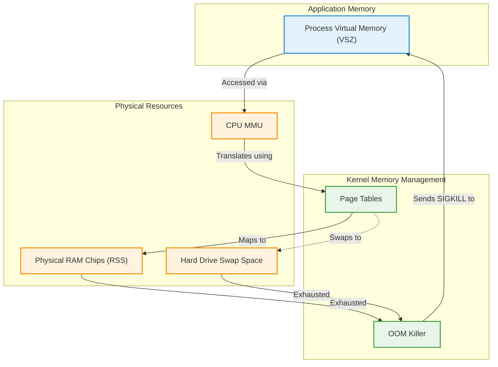

# Memory Management & Virtual Memory (Paging, Swap, OOM Killer Mechanics)

Version: 2.0.0

Purpose: Canonical lesson structure for Platform Engineering & AI Infrastructure Curriculum.

Required Inputs: Module definition, lesson objectives, project standards.

Outputs: Standards-compliant lesson markdown.

---

# Lesson Metadata

* **Lesson ID:** `MOD-LINUX-INT-03`
* **Module:** Linux Internals (`MOD-LINUX-INT`)
* **Difficulty:** Intermediate
* **Estimated Duration:** 50 minutes
* **Learning Track:** 🟢 Core
* **Version:** 2.0.0
* **Last Updated:** 2026-06-28

---

# Lesson Overview

This lesson explores the highly sophisticated memory management engine of the Linux kernel, decrypting how Linux virtualizes physical RAM, manages page tables, utilizes disk swap space, and protects system stability during severe memory exhaustion. By mastering Virtual Memory, Paging, Swap mechanics, and the Out-Of-Memory (OOM) Killer, you will firmly establish the deep diagnostic intuition supporting our module capability: **"I understand how Linux works internally, can trace system calls, manage resource cgroups, and debug complex system behavior."**

---

# Learning Objectives

* Define the architectural concept of Virtual Memory and explain how the kernel uses Page Tables to map virtual addresses to physical RAM.
* Differentiate between Resident Set Size (RSS) and Virtual Memory Size (VSZ) when inspecting process memory consumption.
* Explain the role of Swap Space and describe the severe performance degradation caused by Swap Thrashing.
* Deconstruct the execution mechanics of the Linux kernel's Out-Of-Memory (OOM) Killer, including `oom_score` calculations.
* Inspect system memory buffers, caches, and swap utilization using `free -h` and `/proc/meminfo`.

---

# Prerequisites

* Completion of `MOD-LINUX-INT-01` and `MOD-LINUX-INT-02`.
* Foundational Linux process monitoring skills (`top`, `ps aux`, `cat`).

---

# Why This Exists

In Module 02, we learned how to check basic system memory usage using `top` and `ps aux`. However, as an external systems administrator, you were taking memory metrics at face value. If you saw a Python script reporting `500 MB` of memory usage, you assumed it was consuming exactly 500 Megabytes of physical RAM chips.

In reality, the way Linux manages computer memory is an incredible, highly sophisticated illusion known as **Virtual Memory**. 

If fifty microservices running on a cloud server were allowed to directly access physical RAM chip addresses simultaneously, they would easily collide, overwrite each other's memory variables, and crash the operating system. Furthermore, what happens if your applications attempt to consume 20 Gigabytes of RAM on a server that only possesses 16 Gigabytes of physical memory chips?

To solve the twin challenges of absolute memory isolation and physical resource scaling, the Linux kernel virtualizes memory using **Page Tables** and **Swap Space**. When memory gets completely exhausted, the kernel deploys an elite automated self-defense mechanism called the **Out-Of-Memory (OOM) Killer**. By mastering Linux internal memory mechanics, Platform Engineers can diagnose obscure memory leaks, prevent disk swap thrashing, and architect bulletproof container memory limits.

---

# Core Concepts

## 1. Virtual Memory and Page Tables
In Linux, software programs never touch physical RAM chips directly! 
* **The Illusion:** When you launch a Python script, the Linux kernel presents it with a pristine, contiguous virtual memory space starting at address `0x0000`. The Python script believes it owns the entire computer's memory!
* **Page Tables:** Behind the scenes, the Linux kernel divides memory into tiny 4-Kilobyte chunks called **Pages**. The kernel maintains a master translation map in Ring 0 called a **Page Table**. When Python attempts to write to virtual address `0x1024`, the CPU's Memory Management Unit (MMU) checks the Page Table and instantly translates it to physical RAM chip location `0x8A4B`!

```text
[ Python Script (Virtual Address 0x1024) ] ──► [ Kernel Page Table ] ──► [ Physical RAM Chip (0x8A4B) ]
```

## 2. RSS vs. VSZ (Process Memory Metrics)
When you inspect process memory using `ps aux` or `top`, you will see two distinct memory columns:
* **VSZ (Virtual Memory Size):** The total amount of virtual memory the kernel has *promised* to the process. This includes memory space the application hasn't actually used yet, as well as shared libraries! (It is a virtual illusion).
* **RSS (Resident Set Size):** The exact amount of physical RAM chips the process is actively occupying in real physical memory at this exact second! **(This is the true metric Platform Engineers monitor!).**

## 3. Swap Space and Thrashing
What happens when your physical RAM chips become 100% full?
* **Swap Space:** Linux maintains a dedicated emergency overflow file or partition on the physical hard drive called **Swap**. When RAM fills up, the kernel takes dormant memory pages belonging to sleeping background daemons and moves them out of physical RAM onto the hard drive Swap space, freeing up physical RAM for active applications!
* **Swap Thrashing:** Hard drives are thousands of times slower than physical RAM chips. If your server completely runs out of RAM and starts constantly moving active pages back and forth between RAM and the hard drive, the server grinds to an absolute halt. This catastrophic state is called **Swap Thrashing**.

## 4. The Out-Of-Memory (OOM) Killer
What happens if both physical RAM and hard drive Swap space become 100% completely exhausted?
* **The OOM Killer:** To prevent the entire operating system kernel from freezing and crashing, the Linux kernel deploys an automated executioner known as the **Out-Of-Memory (OOM) Killer**.
* **The `oom_score` Calculation:** The kernel inspects every running process on the server and calculates an `oom_score` based on how much physical RAM the process is consuming. The process consuming the most memory receives the highest score. The kernel instantly drops a brutal `SIGKILL` (`kill -9`) signal on the winning process, instantly terminating it to free up RAM and save the operating system!

---

# Architecture



---

# Real-World Example

Imagine you are managing a Kubernetes cluster powering an enterprise banking platform. You deploy a Java microservice inside a container configured with a strict Kubernetes memory limit of `2 Gigabytes` (`limits.memory: 2Gi`).

During peak banking hours, the Java application experiences a slight memory leak and attempts to allocate `2.1 Gigabytes` of physical RAM. 

Suddenly, the container vanishes, and Kubernetes restarts it. When you inspect the pod status using `kubectl describe pod`, you see the fatal exit reason: `OOMKilled`. 

Because you understand Linux internal memory mechanics perfectly, you know exactly what happened: when the container breached its assigned cgroup memory limit, the Linux kernel's OOM Killer instantly stepped in, calculated the Java process's `oom_score`, and dropped a `SIGKILL` signal to protect the rest of the Kubernetes node! You update the application's JVM heap flags (`-Xmx1500m`) to keep memory usage safely below 2 Gigabytes, and your banking service runs flawlessly!

---

# Hands-on Demonstration

Let's look at how an engineer inspects system memory buffers, caches, and swap using `free -h`, inspects detailed kernel memory metadata using `cat /proc/meminfo`, and checks a process's `oom_score`.

## Input 1: Inspecting System Memory, Buffers, and Swap
We use `free -h` (human-readable) to view a pristine summary dashboard of physical RAM, shared memory, filesystem caches, and swap utilization.

## Code 1
```bash
# Display system physical memory, buffers, caches, and swap in human-readable format (-h).
free -h
```

## Expected Output 1
```text
               total        used        free      shared  buff/cache   available
Mem:            15Gi       3.2Gi       6.1Gi       112Mi       6.1Gi        11Gi
Swap:          2.0Gi          0B       2.0Gi
```

## Explanation 1
Look at how beautifully elegant this dashboard is! Let's deconstruct the core columns:
* `total: 15Gi`: The server possesses 15 Gigabytes of total physical RAM chips.
* `used: 3.2Gi`: Active applications are currently consuming 3.2 Gigabytes of RAM.
* `buff/cache: 6.1Gi`: The Linux kernel is cleverly using 6.1 Gigabytes of dormant RAM to cache recently opened files from the hard drive, making file reading lightning fast! *(Note: If an application suddenly needs this RAM, the kernel instantly frees up the cache!)*
* `available: 11Gi`: The true amount of RAM immediately available for starting new applications.
* `Swap: used 0B`: Our Swap usage is pristine at 0 bytes, confirming zero swap thrashing!

---

## Input 2: Inspecting Detailed Kernel Memory and OOM Scores
We use `cat /proc/meminfo` to view detailed kernel memory tables, and inspect the `oom_score` of our active Bash shell process.

## Code 2
```bash
# Inspect detailed kernel memory tables from the /proc pseudo-filesystem.
# We pipe it into head to view the master physical memory rows.
cat /proc/meminfo | head -n 5

# Inspect the active OOM Killer score of our active Bash terminal process.
cat /proc/$$/oom_score
```

## Expected Output 2
```text
MemTotal:       16278456 kB
MemFree:         6421024 kB
MemAvailable:   11845120 kB
Buffers:          341200 kB
Cached:          5821040 kB

100
```

## Explanation 2
Notice how perfectly transparent Linux is! `/proc/meminfo` is the absolute master plain-text file from which tools like `free` and `top` calculate their dashboards. Notice our `oom_score` check: `$$` is a special variable representing our active Bash PID! `cat /proc/$$/oom_score` returns `100`. This is a very low, safe score, meaning the OOM Killer will ignore our shell during a memory crisis!

---

# Hands-on Lab

* **Objective:** Inspect physical RAM, buffers, caches, swap space, and process OOM scores.
* **Estimated Time:** 15 minutes
* **Difficulty:** Intermediate
* **Environment:** Interactive Browser Terminal / Local Sandbox

## Step-by-step Instructions

1. Open your terminal sandbox.
2. Type `free -h` to inspect your active physical RAM and Swap usage.
3. Type `cat /proc/meminfo | grep Swap` to inspect detailed kernel swap memory tables.
4. Type `ps aux | head -n 5` to inspect the `VSZ` (Virtual Memory) and `RSS` (Physical RAM) columns of running processes.
5. Type `echo $$` to identify your active Bash terminal Process ID (PID).
6. Type `cat /proc/$$/oom_score` to inspect your active OOM Killer score.

## Verification

```bash
free -h | grep Mem
```
*If your terminal successfully outputs your master physical memory table, you have mastered Linux internal memory inspection!*

## Troubleshooting

* **Issue:** `free -h` reports `Swap: total 0B, used 0B`.
* **Solution:** Your cloud virtual machine or container sandbox was provisioned without a dedicated Swap partition. This is perfectly normal and is actually the absolute mandatory standard for Kubernetes cluster nodes!

## Cleanup

No cleanup is required for this memory inspection lab.

---

# Production Notes

In enterprise Kubernetes engineering, Platform Engineers strictly disable Swap space entirely across all physical worker nodes (`sudo swapoff -a`). Why? Kubernetes is designed to pack containers onto servers with flawless mathematical precision based on strict memory limits (`limits.memory`). If Swap space were active, a memory-leaking container could silently overflow onto the hard drive swap disk, causing severe, unpredictable disk thrashing across the entire Kubernetes node! Kubernetes strictly mandates zero swap.

---

# Common Mistakes

* **Panicking Over High `buff/cache` Usage:** Beginners frequently look at `free -h`, see `buff/cache` consuming 90% of their RAM, and panic, believing their server is out of memory. Train your brain to remember: **Linux borrows unused RAM for disk caching! It is instantly freed when applications need it! Look at the `available` column, not `used`!**
* **Confusing VSZ with True Memory Consumption:** Junior developers often look at `ps aux`, see a process reporting `10 GB` of `VSZ`, and assume it is hogging all the RAM chips. `VSZ` is a virtual illusion! Always look at `RSS` (Resident Set Size) for true physical RAM usage.

---

# Failure-Driven Learning

Imagine a junior engineer attempts to run a heavy AI image processing pipeline that completely consumes all physical RAM and swap space, triggering an automated kernel OOM Killer intervention.

## Simulated Failure
```bash
# Simulating a massive memory allocation crash in Python
python3 -c 'import time; a = []; [a.append("*" * 10**7) for i in range(1000)]; time.sleep(10)'
```

## Output
```text
Killed
```

## Diagnosis & Recovery
Why did this fail? The fatal message `Killed` (without any Python traceback error!) is the definitive signature of the Linux kernel's Out-Of-Memory (OOM) Killer! The Python script attempted to allocate Gigabytes of text strings in memory, completely exhausting physical RAM. The kernel instantly caught the exhaustion, calculated the Python process's `oom_score`, and dropped a brutal `SIGKILL` (`kill -9`) signal to terminate the process and protect the server. To confirm this in production, the engineer must execute `sudo dmesg -T | grep -i oom` (or `sudo journalctl -kr | grep -i oom`) to view the exact kernel audit log confirming `Out of memory: Kill process 24580 (python3) score 852`. To recover, the engineer must optimize their code to stream data rather than loading everything into RAM at once.

---

# Engineering Decisions

## Monolithic Swap vs. Immutable Memory Limits
When architecting an enterprise cloud platform, engineering leaders must decide how servers handle memory exhaustion.
* **Traditional Swap Architecture:** Enable massive Swap partitions on cloud servers. If applications leak memory, they overflow onto the hard drive. Prevents immediate crashes, but causes severe, silent performance degradation (Swap Thrashing) that can degrade API response times for hours without triggering alerts.
* **Immutable Memory Limits (Kubernetes OOM):** Disable Swap entirely (`swapoff -a`). Configure strict cgroup memory limits on every container. If an application leaks memory, the OOM Killer terminates it instantly (`OOMKilled`), and Kubernetes instantly restarts a fresh, healthy container instance!
* **The Platform Decision:** Platform Engineers strictly mandate immutable memory limits and zero swap for all modern cloud-native architectures to ensure fail-fast, self-healing reliability.

---

# Best Practices

* **Master `dmesg | grep oom`:** Whenever an application process suddenly vanishes without leaving an error log, make it your absolute mandatory habit to execute `sudo dmesg -T | grep -i oom` to check if the OOM Killer executed it!
* **Adjust `oom_score_adj` for Critical Daemons:** If you have a highly critical system daemon (like an SSH server or monitoring agent) that must *never* be killed during a memory crisis, you can modify its OOM adjustment score (`echo -1000 > /proc/[PID]/oom_score_adj`), making it mathematically impossible for the OOM Killer to target it!

---

# Troubleshooting Guide

## Issue 1: "Out of memory: Kill process (OOM Killer Execution)"

* **Cause:** Your Linux server completely runs out of physical RAM and swap space due to heavy application load or severe software memory leaks.
* **Diagnosis:** A critical application daemon suddenly vanishes. Inspecting kernel logs (`sudo dmesg -T | grep -i oom`) reveals `Out of memory: Kill process 1102 (java) score 851 or sacrifice child`.
* **Solution:** The OOM Killer executed the process to save the operating system from crashing. To resolve this permanently, you must either upgrade your server's physical RAM chips (vertical scaling), configure strict memory usage boundaries in your application runtime (e.g., JVM heap flags `-Xmx`), or fix the underlying software memory leak.

---

# Summary

* **Virtual Memory** is an illusion presented to applications, translated to physical RAM chips by the kernel using **Page Tables**.
* **VSZ (Virtual Memory Size)** is the promised virtual memory space; **RSS (Resident Set Size)** is the true physical RAM actively occupied by the process.
* **Swap Space** is an emergency hard drive overflow file; **Swap Thrashing** occurs when a server runs out of RAM and constantly moves pages to slow disk.
* The **Out-Of-Memory (OOM) Killer** is an automated kernel executioner that calculates `oom_score` and drops `SIGKILL` (`kill -9`) on heavy processes to protect the operating system during severe memory crises.
* `free -h` and `/proc/meminfo` provide elegant, comprehensive visibility into physical RAM, buffers, filesystem caches, and swap utilization.

---

# Cheat Sheet

```bash
# Inspect physical RAM, buffers, caches, and swap in human-readable format
free -h

# Inspect detailed kernel memory tables from the /proc pseudo-filesystem
cat /proc/meminfo

# Inspect the active OOM Killer score of a running process
cat /proc/[PID]/oom_score

# Protect a critical process from being killed by the OOM Killer (-1000 = immune)
sudo sh -c "echo -1000 > /proc/[PID]/oom_score_adj"

# Search kernel hardware logs to confirm if the OOM Killer executed a process
sudo dmesg -T | grep -i oom

# Disable all Swap space on the server instantly (Mandatory for Kubernetes nodes)
sudo swapoff -a

# View active Swap space allocation partitions
swapon --show
```

---

# Knowledge Check

## Multiple Choice Questions

1. You are inspecting a Linux server using `free -h` and notice the memory table reports `total: 16Gi, used: 2.1Gi, buff/cache: 12.5Gi, available: 13.5Gi`. A junior engineer panics because `buff/cache` is consuming 12.5 Gigabytes of RAM. What is the correct interpretation of this dashboard?
   * A) The server is suffering from severe Swap Thrashing and needs an immediate reboot.
   * B) The server is completely out of memory and will soon trigger the OOM Killer.
   * C) The server is perfectly healthy; Linux borrows unused RAM to cache hard drive files, and there are 13.5 Gigabytes immediately available for applications.
   * D) The server has a massive memory leak in the kernel systemd daemon.

## Scenario Questions

You are managing a production Kubernetes cluster and notice a Python microservice container keeps unexpectedly crashing and restarting. You run `kubectl describe pod` and see the exit reason is `OOMKilled`. Based on what you learned in this lesson, how do you explain the exact kernel mechanics that caused this termination, and what command would you run on the physical server node to view the kernel audit log confirming the execution?

## Short Answer Questions

Explain the exact architectural difference between `VSZ` (Virtual Memory Size) and `RSS` (Resident Set Size) when inspecting process memory consumption in `ps aux`.

<details>
<summary><b>View Answers</b></summary>

### Multiple Choice
1. **C** - The server is perfectly healthy. Linux borrows unused RAM for filesystem caching (`buff/cache`), which can be instantly freed when applications need it. The true available memory for applications is 13.5 Gigabytes.

### Scenario
The Python microservice breached its strictly configured cgroup memory limit, triggering the kernel's localized OOM Killer to calculate its `oom_score` and send a `SIGKILL` signal. You can confirm this kernel execution using `sudo dmesg -T | grep -i oom`.

### Short Answer
`VSZ` (Virtual Memory Size) represents the total virtual memory space promised to the process by the kernel, while `RSS` (Resident Set Size) represents the actual physical RAM chips the process is actively consuming.

</details>

---

# Interview Preparation

## Beginner Questions

* What is Virtual Memory in Linux?
* What does the `free -h` command do?
* What is Swap space, and why is it used?

## Intermediate Questions

* Explain the difference between `VSZ` and `RSS`.
* Why do Platform Engineers strictly disable Swap space (`swapoff -a`) on Kubernetes worker nodes?

## Advanced Questions

* Explain how the Linux kernel calculates the `oom_score` of running processes during an Out-Of-Memory event, including how `oom_score_adj` modifies the final calculation.

## Scenario-Based Discussions

* Discuss the operational trade-offs of relying on traditional hard drive Swap space to prevent application out-of-memory crashes on standalone cloud virtual machines versus architecting immutable, fail-fast container memory limits in a cloud-native platform environment.

---

# Further Reading

1. [Understanding Linux Free Command and Memory Buffers (Linux Handbook)](https://linuxhandbook.com/free-command/)
2. [The Linux OOM Killer Demystified (LWN.net Deep Dive)](https://lwn.net/Articles/317814/)
3. [Memory Management in the Linux Kernel (Kernel Documentation)](https://www.kernel.org/)
4. [Mastering /proc/meminfo (Red Hat Enterprise Linux Guide)](https://docs.redhat.com/)
5. [Why Kubernetes Requires Disabling Swap (Official K8s Documentation)](https://kubernetes.io/)
