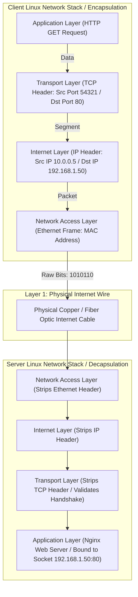

# The OSI Model, TCP/IP Suite & Socket Mechanics

Version: 2.0.0

Purpose: Canonical lesson structure for Platform Engineering & AI Infrastructure Curriculum.

Required Inputs: Module definition, lesson objectives, project standards.

Outputs: Standards-compliant lesson markdown.

---

# Lesson Metadata

* **Lesson ID:** `MOD-NET-01`
* **Module:** Networking Fundamentals (`MOD-NET`)
* **Difficulty:** Beginner
* **Estimated Duration:** 45 minutes
* **Learning Track:** 🟢 Core
* **Version:** 2.0.0
* **Last Updated:** 2026-06-28

---

# Lesson Overview

This lesson explores the master architectural models of computer networking, decrypting how raw bits of electrical data travel from an application on one server across the world to an application on another. By mastering the OSI 7-Layer Model, the TCP/IP Suite, and Network Socket Mechanics, you will firmly establish the deep conceptual intuition supporting our module capability: **"I can configure network connections, manage DNS, set up a secure web proxy, and analyze network traffic."**

---

# Learning Objectives

* Define the Open Systems Interconnection (OSI) 7-Layer Model and explain the architectural purpose of each layer.
* Contrast the theoretical OSI model with the practical 4-Layer TCP/IP Suite used by modern operating systems.
* Explain the mechanics of Data Encapsulation and Decapsulation as packets traverse up and down the network stack.
* Differentiate between TCP (Transmission Control Protocol) and UDP (User Datagram Protocol), explaining the 3-Way Handshake (`SYN`, `SYN-ACK`, `ACK`).
* Define what a Network Socket is (`IP Address : Port`) and inspect active socket states using terminal utilities.

---

# Prerequisites

* Completion of Module 01 (`MOD-LINUX-BEG`), Module 02 (`MOD-LINUX-ADM`), and Module 03 (`MOD-LINUX-INT`).
* Foundational terminal networking inspection skills (`ss -tulpn`, `ip addr`).

---

# Why This Exists

When you open a web browser and type `https://www.google.com`, or when an AI microservice queries a cloud vector database, a miraculous sequence of events occurs in milliseconds. The text request is broken down into tiny digital packets, converted into pulses of laser light or electrical copper voltages, shot across subsea intercontinental cables, caught by a remote server, reassembled into pristine data, and processed by a remote software application.

If every hardware manufacturer (Cisco, Intel, Apple, Mellanox) and operating system (Linux, Windows, iOS) used their own proprietary, secret language to transmit data, the global internet would instantly collapse. A Linux server would be completely incapable of talking to an Apple iPhone.

To solve the monumental challenge of global interoperability, international computer science task forces established **Universal Networking Models (The OSI Model and TCP/IP Suite)**. These architectural blueprints act as the universal grammar of the internet. By understanding exactly how applications encapsulate data into network frames and establish reliable **Network Sockets**, Platform Engineers gain an elite diagnostic framework, allowing them to instantly isolate whether a system failure is caused by a physical broken wire, a blocked firewall port, or a broken software application.

---

# Core Concepts

## 1. The OSI 7-Layer Model
The Open Systems Interconnection (OSI) model is a conceptual framework that divides network communication into seven distinct vertical layers:
* **Layer 1: Physical Layer.** Raw bits (`0`s and `1`s) transmitted as electrical voltages on copper wires, laser pulses in fiber optic cables, or radio waves (Wi-Fi).
* **Layer 2: Data Link Layer.** Organizes raw bits into **Frames**. Uses physical MAC (Media Access Control) addresses to transfer data between hardware switches on the exact same local network (LAN).
* **Layer 3: Network Layer.** Organizes frames into **Packets**. Uses logical IP (Internet Protocol) addresses and routers to navigate packets across different global networks (The Internet).
* **Layer 4: Transport Layer.** Organizes packets into **Segments**. Uses Port numbers (e.g., Port 80, 443) and master transmission protocols (TCP vs UDP) to manage end-to-end communication between software applications.
* **Layer 5: Session Layer.** Establishes, maintains, and terminates communication sessions between two computers.
* **Layer 6: Presentation Layer.** Translates, encrypts, and compresses data (e.g., converting raw text into encrypted SSL/TLS data or JPEG image formats).
* **Layer 7: Application Layer.** The topmost layer where network-aware software applications (Web browsers, Nginx web servers, SSH clients) interact directly with network protocols (HTTP, FTP, SSH, DNS).

```text
[L7: Application] ──► [L6: Presentation] ──► [L5: Session] ──► [L4: Transport] ──► [L3: Network] ──► [L2: Data Link] ──► [L1: Physical Wire]
```

## 2. The TCP/IP Suite
While the OSI model is excellent for theoretical learning, the actual Linux operating system kernel implements a highly streamlined 4-layer model called the **TCP/IP Suite**:
* **Application Layer:** Combines OSI Layers 5, 6, and 7 (HTTP, SSH, DNS).
* **Transport Layer:** OSI Layer 4 (TCP, UDP).
* **Internet Layer:** OSI Layer 3 (IP, ICMP).
* **Network Access Layer:** Combines OSI Layers 1 and 2 (Ethernet, MAC Drivers).

## 3. Data Encapsulation and Decapsulation
As data travels down the network stack on the sending server, each layer attaches its own specialized tracking header to the data—like putting a smaller envelope inside a larger envelope. This is **Encapsulation**. When the packet reaches the destination server, the Linux kernel strips away each header layer-by-layer as it travels up to the application. This is **Decapsulation**.

## 4. TCP vs. UDP (The Transport Titans)
Layer 4 provides two master protocols for transmitting data:
* **TCP (Transmission Control Protocol):** Connection-oriented, highly reliable, and guaranteed delivery. Before sending data, TCP performs a strict **3-Way Handshake** (`SYN ──►`, `◄── SYN-ACK`, `ACK ──►`). If a packet is lost on the wire, TCP automatically retransmits it! Essential for webpages, banking transactions, and database queries.
* **UDP (User Datagram Protocol):** Connectionless, ultra-fast, and best-effort delivery. UDP fires packets onto the network without any handshake or delivery confirmation! If a packet gets lost, it is gone forever. Essential for live video streaming, online gaming, and lightning-fast DNS lookups.

## 5. Network Socket Mechanics
As established in Module 02 and Module 03, the Linux kernel treats everything as a file. A **Network Socket** is an elite virtual endpoint defined by combining an **IP Address** and a **Port Number** (e.g., `192.168.1.50 : 80`). When an application binds to a socket, the kernel assigns it a File Descriptor (FD) and listens for traffic arriving at that specific IP and Port!

---

# Architecture



---

# Real-World Example

Imagine you are an Infrastructure Engineer managing a high-frequency trading platform. Your trading application queries a live stock market pricing feed. Originally, the application was built using TCP (Transmission Control Protocol). 

During intense market volatility, you notice your trading bot is experiencing severe latency spikes. When you inspect the network traffic, you see that TCP is performing its rigorous 3-Way Handshake and constantly waiting for acknowledgement packets (`ACK`). If a single pricing packet is delayed, TCP forcefully blocks all subsequent packets while it waits for a retransmission (**Head-of-Line Blocking**)!

Because you understand Layer 4 transport mechanics perfectly, you realize TCP's guaranteed delivery is actually harming your trading speed! In stock trading, an outdated price quote from 500 milliseconds ago is completely worthless; you only care about the absolute newest price right now! You work with the developers to migrate the pricing feed to UDP (User Datagram Protocol). UDP eliminates all handshakes and retransmissions, firing live pricing packets onto the wire instantly. Your trading bot's latency drops from 500ms to 2ms, and your platform executes trades flawlessly!

---

# Hands-on Demonstration

Let's look at how an engineer inspects active network socket states and established TCP connections using `ss -atn`, and inspects underlying kernel protocol statistics using `netstat -s`.

## Input 1: Inspecting Active Network Sockets and TCP States
We use `ss -atn` (all TCP sockets, numeric ports) to view a pristine table of active listening sockets and established 3-Way Handshake connections.

## Code 1
```bash
# Display all active TCP sockets, numeric ports, and state details (-atn).
# We pipe it into head to view the master top rows.
ss -atn | head -n 5
```

## Expected Output 1
```text
State      Recv-Q Send-Q Local Address:Port               Peer Address:Port              
LISTEN     0      128          0.0.0.0:22                      0.0.0.0:*                 
LISTEN     0      511          0.0.0.0:80                      0.0.0.0:*                 
ESTAB      0      0       192.168.1.50:22                 10.0.0.5:54321             
ESTAB      0      0       192.168.1.50:80                 10.0.0.8:48210
```

## Explanation 1
Look at how beautifully rich this socket state data is! `ss -atn` reveals the exact mechanics of Layer 4. Notice the `State` column: `LISTEN` confirms Nginx (`0.0.0.0:80`) and SSH (`0.0.0.0:22`) are actively bound to sockets waiting for traffic. Notice the `ESTAB` (Established) rows: our server (`192.168.1.50:22`) successfully completed a 3-Way Handshake with a remote client (`10.0.0.5:54321`)!

---

## Input 2: Inspecting Kernel TCP/IP Protocol Statistics
We use `netstat -s` (or `ip -s link`) to inspect detailed kernel protocol counters, tracking exact counts of sent packets, received segments, and active connections.

## Code 2
```bash
# Display detailed summary statistics for TCP/IP network protocols (-s).
# We pipe it into grep to filter specifically for master TCP connection metrics.
netstat -s | grep -E "active connections|established|segments" | head -n 5
```

## Expected Output 2
```text
    142 active connection openings
    15 passive connection openings
    22 active connections established
    548912 segments received
    548210 segments send out
```

## Explanation 2
Notice how perfectly transparent Linux's network stack is! `netstat -s` queries the kernel's master networking tables in Ring 0. The output proudly displays exact metrics: `142 active connection openings` (our server initiated a `SYN` packet to an external server) and `548912 segments received` (Layer 4 successfully caught and decapsulated over half a million TCP segments)!

---

# Hands-on Lab

* **Objective:** Inspect active TCP/UDP sockets, verify established connection states, and view kernel protocol statistics.
* **Estimated Time:** 15 minutes
* **Difficulty:** Beginner
* **Environment:** Interactive Browser Terminal / Local Sandbox

## Step-by-step Instructions

1. Open your terminal sandbox.
2. Type `ss -tulpn` to inspect all active listening TCP/UDP sockets on your machine.
3. Type `ss -atn | grep ESTAB` to isolate only active, successfully established TCP network connections.
4. Type `sudo apt update && sudo apt install -y net-tools` to ensure the netstat utility is installed.
5. Type `netstat -s | grep -i udp` to inspect detailed kernel statistics for the UDP protocol.
6. Type `cat /proc/net/tcp` to inspect the raw plain-text TCP socket table maintained directly by the Linux kernel in Ring 0!

## Verification

```bash
ss -atn | head -n 2
```
*If your terminal successfully outputs the master socket state header table, you have mastered Linux network socket inspection!*

## Troubleshooting

* **Issue:** `netstat -s` returns `netstat: command not found`.
* **Solution:** The legacy `netstat` utility is part of the `net-tools` package, which is frequently omitted in minimal container base images. Execute `sudo apt update && sudo apt install -y net-tools` (or use the modern alternative `ss -s`) to view summary statistics.

## Cleanup

No cleanup is required for this networking inspection lab.

---

# Production Notes

In enterprise cloud infrastructure (such as AWS Security Groups or Kubernetes Network Policies), Platform Engineers use the OSI model daily to communicate where security controls operate. For example, an AWS Network Load Balancer (NLB) operates strictly at **Layer 4 (Transport Layer)**—it inspects only IP addresses and Port numbers (`TCP:80`), making it lightning fast! An AWS Application Load Balancer (ALB) operates at **Layer 7 (Application Layer)**—it inspects the actual HTTP headers, URL paths (`/api/v1/users`), and SSL certificates! Knowing the difference between L4 and L7 load balancing is a mandatory Platform Engineering capability.

---

# Common Mistakes

* **Confusing Port Numbers with Underlying Protocols:** Beginners frequently assume that if a service is running on Port 80, it *must* be unencrypted HTTP, or if it is running on Port 443, it *must* be HTTPS. Port numbers are just virtual apartment numbers! You can easily configure an SSH daemon to listen on Port 80, or configure Nginx to run HTTP on Port 22!
* **Ignoring the 3-Way Handshake in Health Checks:** Junior developers frequently configure automated load balancer health checks to perform a full HTTP GET request (`Layer 7`) every second. This generates massive CPU overhead. If you only want to know if the daemon is alive, configure a simple TCP Health Check (`Layer 4`), which performs a tiny, lightweight 3-Way Handshake (`SYN`, `SYN-ACK`, `ACK`) and instantly closes the connection!

---

# Failure-Driven Learning

Imagine a junior engineer attempts to start a web server on a port that is strictly reserved or already actively bound to another application socket.

## Simulated Failure
```bash
# Simulating a Socket Binding failure due to a port collision
# We use Python to attempt to bind to port 22, which is already owned by SSH!
sudo python3 -c 'import socket; s = socket.socket(); s.bind(("0.0.0.0", 22))'
```

## Output
```text
Traceback (most recent call last):
  File "<string>", line 1, in <module>
OSError: [Errno 98] Address already in use
```

## Diagnosis & Recovery
Why did this fail? As established in Module 02 and Module 03, the fatal error `Address already in use` (Errno 98) occurs because the Linux kernel strictly mandates that only one application process can bind to a specific network socket (`IP:Port`) at a time! Because the SSH daemon (`sshd`) is already actively listening on `0.0.0.0:22`, the kernel forcefully rejected Python's bind request. To recover, the engineer must use `sudo ss -tulpn | grep :22` to identify the existing PID, and configure Python to use an available alternate port like `8080`!

---

# Engineering Decisions

## Layer 4 (TCP) vs. Layer 7 (HTTP) Load Balancing
When architecting an enterprise cloud platform, engineering leaders must choose how to balance incoming customer traffic.
* **Layer 4 Load Balancing (Transport Layer / TCP):** Inspects only the outer IP address and Port number. It does not terminate SSL certificates or look inside the application data. Passes packets directly to background servers. Extremely fast, handles millions of requests per second, and requires near-zero CPU overhead.
* **Layer 7 Load Balancing (Application Layer / HTTP):** Decapsulates the entire packet, terminates the SSL certificate, inspects the HTTP headers, cookies, and URL paths, and makes highly intelligent routing decisions (e.g., sending `/images` to server A and `/api` to server B). Requires heavy CPU overhead.
* **The Platform Decision:** Platform Engineers utilize Layer 4 load balancing for massive, high-throughput ingest layers and database clusters, while deploying Layer 7 load balancing for intelligent microservice API gateways.

---

# Best Practices

* **Master `ss -s`:** When troubleshooting busy servers, execute `ss -s` to view a pristine, ultra-fast summary dashboard showing exactly how many TCP, UDP, and RAW sockets are currently open on the machine.
* **Master the OSI Layers:** Memorize the classic mnemonic to remember the 7 OSI layers from bottom to top: **P**lease **D**o **N**ot **T**hrow **S**ausage **P**izza **A**way (Physical, Data Link, Network, Transport, Session, Presentation, Application).

---

# Troubleshooting Guide

## Issue 1: "Connection timed out" vs. "Connection refused"

* **Cause:** You attempt to connect to a remote server, but the connection fails. Beginners view these errors as identical, but to a Platform Engineer, they indicate completely different layer failures!
* **Diagnosis & Solution:**
  * `Connection timed out`: Your server fired a `SYN` packet onto the wire, but received absolutely zero response! The packet was lost on the wire (`Layer 1`), dropped by a router (`Layer 3`), or silently blocked by a firewall (`Layer 4`). Check security groups and routing tables!
  * `Connection refused`: Your server fired a `SYN` packet, the packet successfully reached the destination server, but the remote kernel instantly bounced back a `RST` (Reset) packet! This proves the network wiring and firewalls are perfectly healthy, but there is absolutely no software daemon actively listening on the port (`Layer 7`)! Log into the remote server and start the daemon!

---

# Summary

* The **OSI 7-Layer Model** divides network communication into Physical (1), Data Link (2), Network (3), Transport (4), Session (5), Presentation (6), and Application (7) layers.
* The **TCP/IP Suite** is the practical 4-layer model implemented by the Linux kernel (Application, Transport, Internet, Network Access).
* **Encapsulation** attaches headers as data moves down the stack; **Decapsulation** strips headers as data moves up.
* **TCP** is reliable and connection-oriented (`3-Way Handshake`); **UDP** is connectionless and ultra-fast.
* A **Network Socket** is an elite virtual endpoint (`IP : Port`); `ss -atn` isolates active listening sockets and established connections.

---

# Cheat Sheet

```bash
# Inspect all active TCP sockets, numeric ports, and connection states
ss -atn

# Inspect all active listening TCP and UDP sockets along with owning PIDs
sudo ss -tulpn

# Filter ss output to isolate only actively established connections
ss -atn | grep ESTAB

# Display an ultra-fast summary dashboard of all active system sockets
ss -s

# Display detailed kernel summary statistics for TCP/IP protocols
netstat -s

# Inspect the raw plain-text TCP socket table maintained directly by the kernel
cat /proc/net/tcp
```

---

# Knowledge Check

## Multiple Choice Questions

1. You are troubleshooting an application that cannot connect to an external database. The terminal returns `Connection refused`. What does this specific networking error prove about the system layers?
   * A) The physical network cable is broken (Layer 1 failure).
   * B) An intermediate cloud firewall is silently dropping the packets (Layer 3 failure).
   * C) The network wiring and firewalls are perfectly healthy, but there is no software daemon actively listening on the destination port (Layer 7 failure).
   * D) The server is completely out of memory and triggered the OOM killer.

## Scenario Questions

You are designing an automated health check for an enterprise load balancer pointing to a cluster of Nginx web servers. A junior engineer suggests configuring an HTTP GET request to `/index.html` every second. Based on what you learned in this lesson, how do you explain the CPU performance trade-offs between Layer 7 (HTTP) and Layer 4 (TCP) health checks, and why might a simple TCP 3-Way Handshake be superior?

## Short Answer Questions

Explain the exact architectural difference between TCP (Transmission Control Protocol) and UDP (User Datagram Protocol) in Layer 4 transport mechanics.

<details>
<summary><b>View Answers</b></summary>

### Multiple Choice
1. **C** - "Connection refused" indicates the TCP packet reached the destination host, proving layers 1-3 are fine, but the OS returned a RST packet because no application was listening on that port.

### Scenario
Layer 7 HTTP health checks require the web server to fully establish the connection, parse the HTTP request, and construct an HTTP response, which consumes significant CPU and memory. Layer 4 TCP health checks only perform the TCP 3-Way Handshake, handled purely by the kernel network stack, making it vastly more efficient while still proving the port is open.

### Short Answer
TCP is a connection-oriented protocol that ensures guaranteed delivery, ordering, and error-checking via mechanisms like the 3-Way Handshake and acknowledgments. UDP is a connectionless protocol that sends datagrams without guarantees of delivery, ordering, or error recovery, prioritizing speed and low latency.

</details>

---

# Interview Preparation

## Beginner Questions

* What is the OSI 7-Layer Model?
* What is a network socket in Linux?
* What does the `ss -atn` command display?

## Intermediate Questions

* Explain the 3-Way Handshake performed by TCP.
* What is the exact difference between `Connection timed out` and `Connection refused`?

## Advanced Questions

* Explain how the Linux kernel manages the TCP `SYN` queue and `ACCEPT` queue in physical RAM during a 3-Way Handshake, and describe the mechanics of a `SYN Flood` DDoS attack.

## Scenario-Based Discussions

* Discuss the architectural trade-offs of architecting a high-performance microservice communication mesh using HTTP/REST over TCP (Layer 7) versus migrating to gRPC over HTTP/2 or raw UDP sockets in a rapidly scaling enterprise environment.

---

# Further Reading

1. [Understanding the OSI Model (Cloudflare Learning Center)](https://www.cloudflare.com/learning/ddos/glossary/open-systems-interconnection-osi-model/)
2. [Mastering the ss Command (Linux Handbook)](https://linuxhandbook.com/ss-command/)
3. [TCP 3-Way Handshake Explained (DigitalOcean Tutorial)](https://www.digitalocean.com/)
4. [Anatomy of a Socket in Linux (Official Kernel Documentation)](https://www.kernel.org/)
5. [TCP vs UDP: Comprehensive Comparison](https://en.wikipedia.org/wiki/Transmission_Control_Protocol#Comparison_with_UDP)
