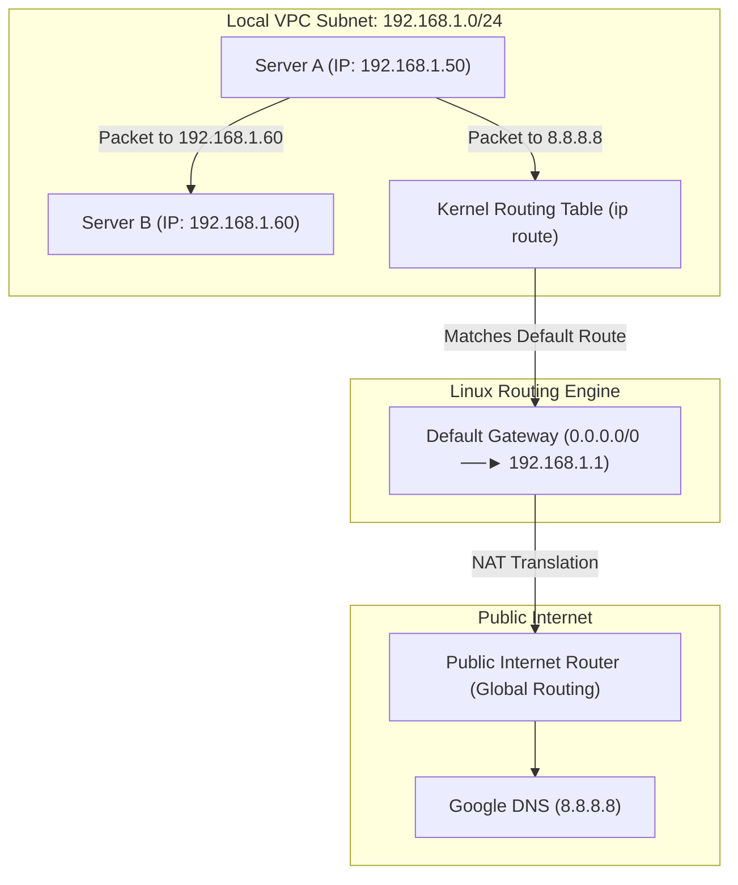

# IP Addressing, Subnetting & Routing Tables

Version: 2.0.0

Purpose: Canonical lesson structure for Platform Engineering & AI Infrastructure Curriculum.

Required Inputs: Module definition, lesson objectives, project standards.

Outputs: Standards-compliant lesson markdown.

---

# Lesson Metadata

* **Lesson ID:** `MOD-NET-02`
* **Module:** Networking Fundamentals (`MOD-NET`)
* **Difficulty:** Beginner to Intermediate
* **Estimated Duration:** 50 minutes
* **Learning Track:** 🟢 Core
* **Version:** 2.0.0
* **Last Updated:** 2026-06-28

---

# Lesson Overview

This lesson explores the mathematical navigation engine of computer networking, decrypting how Linux assigns logical IP addresses, divides massive networks using Subnetting and CIDR notation, and forwards packets across the world using Kernel Routing Tables. By mastering IPv4/IPv6, CIDR blocks, and `ip route`, you will firmly establish the essential cloud engineering capabilities supporting our module capability: **"I can configure network connections, manage DNS, set up a secure web proxy, and analyze network traffic."**

---

# Learning Objectives

* Define the architectural structure of an IPv4 address (32-bit dotted-decimal) and contrast it with an IPv6 address (128-bit hexadecimal).
* Explain the exact mathematical role of a Subnet Mask and calculate network boundaries using CIDR notation (e.g., `/24`, `/16`).
* Differentiate between Public IP addresses (globally routable) and Private IP addresses (RFC 1918 internal subnets).
* Inspect active network interfaces and kernel routing tables using `ip addr` and `ip route`.
* Define the Default Gateway (`0.0.0.0/0`) and diagnose asymmetric routing or missing route table exceptions.

---

# Prerequisites

* Completion of `MOD-NET-01` (OSI Model & Socket Mechanics).
* Foundational terminal networking inspection skills (`ip addr`, `ping`).

---

# Why This Exists

In Lesson 01, we explored how applications encapsulate data into packets and bind to network sockets (`IP : Port`). However, having a network socket is useless if the underlying Linux kernel doesn't know how to navigate the physical wires to reach the destination server.

If you deploy a Kubernetes cluster inside an AWS Virtual Private Cloud (VPC), you are instantly forced to make a mathematical decision: *"What CIDR block do you want for your VPC? What subnets do you want for your public web servers versus your private databases?"*

If you blindly guess and assign the exact same IP subnet to both your database cluster and your web servers, or misconfigure your Linux kernel's internal routing table, your servers will suffer catastrophic routing loops or become completely cut off from the internet.

To solve the complex challenge of addressing and navigating billions of global computers, computer scientists established **IP Addressing, Subnetting, and Kernel Routing Tables**. By mastering CIDR math and routing table inspection (`ip route`), Platform Engineers can architect highly secure, perfectly isolated cloud VPCs, prevent IP exhaustion, and diagnose complex packet drops instantly.

---

# Core Concepts

## 1. IPv4 vs. IPv6 Architecture
An IP address is a logical numerical label assigned to every device connected to a computer network.
* **IPv4 (Internet Protocol Version 4):** A 32-bit binary number presented to humans in four 8-bit octets separated by dots (e.g., `192.168.1.50`). Because 32 bits only allows for ~4.3 billion unique addresses, the global internet completely ran out of public IPv4 addresses in 2011!
* **IPv6 (Internet Protocol Version 6):** A massive 128-bit number presented in eight groups of hexadecimal strings (e.g., `2001:0db8:85a3:0000:0000:8a2e:0370:7334`). It provides $3.4 \times 10^{38}$ unique addresses—enough to assign an IP address to every single grain of sand on Earth!

## 2. Private vs. Public IP Addresses (RFC 1918)
To prevent the internet from running out of IPv4 addresses immediately, engineers established RFC 1918, which carves out dedicated **Private IP Ranges** that can be reused freely inside enterprise internal networks:
* **Private Ranges:** `10.0.0.0 - 10.255.255.255`, `172.16.0.0 - 172.31.255.255`, `192.168.0.0 - 192.168.255.255`.
* **The Golden Rule:** Private IP addresses are strictly forbidden from crossing the public internet! To talk to the public internet, a private server must pass through a router performing **NAT (Network Address Translation)**, which swaps the private IP for a public, globally routable IP!

## 3. Subnetting and CIDR Notation (`/24`)
An IP address contains two hidden parts: the **Network Portion** (like a street name) and the **Host Portion** (like a specific house number). How does the Linux kernel know where the street name ends and the house number begins? It uses a **Subnet Mask**!
* **CIDR Notation (Classless Inter-Domain Routing):** Instead of writing out clunky subnet masks like `255.255.255.0`, Platform Engineers use CIDR slash notation to indicate exactly how many bits are locked for the network portion:
  * `/24`: Locks the first 24 bits (`192.168.1.X`). Leaves 8 bits for hosts, providing exactly **256 IP addresses** (254 usable).
  * `/16`: Locks the first 16 bits (`10.0.X.X`). Leaves 16 bits for hosts, providing exactly **65,536 IP addresses**.
  * `/32`: Locks all 32 bits! Points to a single, exact individual host IP address (`192.168.1.50/32`).

## 4. Kernel Routing Tables (`ip route`)
When an application fires a packet addressed to `8.8.8.8`, how does the Linux kernel know which physical network interface card (`eth0` vs `eth1`) to push the packet out of? It checks the **Kernel Routing Table**!
* `ip route show`: Prints the active kernel routing table in Ring 0 memory.
* **The Default Gateway (`0.0.0.0/0`):** This is the master emergency exit route! `0.0.0.0/0` matches literally every IP address on earth. It tells the Linux kernel: *"If you want to reach an IP address that is not on your local subnet, push the packet out to this master router IP address and let the router figure it out!"*

---

# Architecture



---

# Real-World Example

Imagine you are an Infrastructure Engineer building a brand-new AWS Virtual Private Cloud (VPC) using Terraform. You assign the VPC a master CIDR block of `10.0.0.0/16`. You create a public subnet (`10.0.1.0/24`) for your web servers and a private subnet (`10.0.2.0/24`) for your Postgres databases.

You deploy a Linux virtual machine into the private database subnet. When you log into the database server and attempt to execute `sudo apt update` to install security patches, the terminal freezes and eventually aborts with `Connection timed out`.

Because you understand IP routing tables perfectly, you don't panic. You execute `ip route show` on the database server. The output shows a local route for `10.0.2.0/24`, but the **Default Gateway (`0.0.0.0/0`)** row is completely missing! 

You instantly realize what happened: because the private subnet has no default route pointing to a NAT Gateway, the Linux kernel has absolutely no idea how to push packets out to the public internet repository servers! You update your Terraform code to add an AWS Route Table entry pointing `0.0.0.0/0` to a NAT Gateway, verify the route appears in `ip route`, and your database updates flawlessly!

---

# Hands-on Demonstration

Let's look at how an engineer inspects active IP addresses and CIDR prefixes using `ip addr`, inspects the active kernel routing table using `ip route`, and verifies local subnet reachability using `ping`.

## Input 1: Inspecting Active IP Addresses and CIDR Subnets
We use `ip addr show` to view our active network interfaces, assigned IPv4/IPv6 addresses, and exact CIDR slash subnet masks.

## Code 1
```bash
# Display detailed information about active network interfaces and CIDR IP addresses.
ip addr show
```

## Expected Output 1
```text
1: lo: <LOOPBACK,UP,LOWER_UP> mtu 65536 qdisc noqueue state UNKNOWN group default qlen 1000
    link/loopback 00:00:00:00:00:00 brd 00:00:00:00:00:00
    inet 127.0.0.1/8 scope host lo
       valid_lft forever preferred_lft forever
2: eth0: <BROADCAST,MULTICAST,UP,LOWER_UP> mtu 1500 qdisc pfifo_fast state UP group default qlen 1000
    link/ether 02:42:ac:11:00:02 brd ff:ff:ff:ff:ff:ff
    inet 192.168.1.50/24 brd 192.168.1.255 scope global eth0
       valid_lft forever preferred_lft forever
```

## Explanation 1
Look at how beautifully rich this IP data is! `ip addr` reveals two interfaces: `lo` (loopback, `127.0.0.1/8`) and `eth0` (Ethernet). Notice our primary IP assignment: `inet 192.168.1.50/24`. The `/24` CIDR notation confirms our server owns IP `50` on the `192.168.1.0` network. `brd 192.168.1.255` is the master broadcast IP address used to shout packets to every single machine on our subnet simultaneously!

---

## Input 2: Inspecting Kernel Routing Tables and Gateway Verification
We use `ip route show` to inspect the active kernel routing table, verifying our local subnet routes and master default gateway IP address.

## Code 2
```bash
# Inspect the active kernel routing table and default gateway configuration.
ip route show
```

## Expected Output 2
```text
default via 192.168.1.1 dev eth0 proto dhcp metric 100
169.254.169.254 via 192.168.1.1 dev eth0 proto dhcp metric 100
192.168.1.0/24 dev eth0 proto kernel scope link src 192.168.1.50 metric 100
```

## Explanation 2
Notice how perfectly transparent Linux's routing engine is! Let's deconstruct the core rows:
* `192.168.1.0/24 dev eth0`: The local subnet route! It tells the kernel: *"If you want to talk to another server on the `192.168.1.X` network, push the packet directly out of `eth0` without using a router!"*
* `default via 192.168.1.1 dev eth0`: The master default gateway! It tells the kernel: *"If you want to reach any external public internet IP address, push the packet out of `eth0` directly to the master router located at `192.168.1.1`!"*
* `169.254.169.254`: The famous AWS/Cloud Metadata IP address used by cloud VMs to securely query their own instance credentials!

---

# Hands-on Lab

* **Objective:** Inspect IP addresses, calculate CIDR subnet boundaries, verify kernel routing tables, and test gateway reachability.
* **Estimated Time:** 15 minutes
* **Difficulty:** Beginner to Intermediate
* **Environment:** Interactive Browser Terminal / Local Sandbox

## Step-by-step Instructions

1. Open your terminal sandbox.
2. Type `ip addr show` to identify your active primary IP address and CIDR slash prefix.
3. Type `ip route show` to discover your master default gateway IP address.
4. Type `ping -c 3 [DEFAULT_GATEWAY_IP]` (using the exact IP address discovered in Step 3) to verify that your physical router is online and reachable.
5. Type `ip neigh show` to inspect your active ARP (Address Resolution Protocol) cache, viewing the physical MAC addresses of neighbor servers on your subnet.
6. Type `cat /proc/net/route` to inspect the raw plain-text routing table maintained directly by the Linux kernel in Ring 0!

## Verification

```bash
ip route show | grep default
```
*If your terminal successfully outputs the `default via` gateway line, you have mastered Linux routing table inspection!*

## Troubleshooting

* **Issue:** `ping [DEFAULT_GATEWAY_IP]` returns `Destination Host Unreachable`.
* **Solution:** Your local virtual machine or container sandbox has a broken virtual network bridge or misconfigured IP address. Use `ip link show` to verify that your network interface (`eth0`) reports `state UP`.

## Cleanup

No cleanup is required for this IP routing inspection lab.

---

# Production Notes

In enterprise cloud architecture (such as AWS VPCs or Google Cloud VPCs), Platform Engineers must be highly vigilant regarding **IP Exhaustion**. If you create an AWS subnet with a `/28` CIDR block, it provides $2^{32-28} = 16$ total IP addresses. However, AWS strictly reserves the first 4 IP addresses and the last 1 IP address of every subnet for internal routing and DNS! This leaves you with only **11 usable IP addresses**. If you attempt to deploy 12 Kubernetes pods into that subnet, the 12th pod will instantly crash with `No available IP addresses in subnet`! Always size your cloud subnets generously (e.g., `/24` or `/22`).

---

# Common Mistakes

* **Confusing `/24` with `/16` Subnet Sizes:** Beginners frequently mix up CIDR slash notation, assuming a larger slash number means more IP addresses. Train your brain to remember the inverse rule: **The slash number is the number of LOCKED network bits! A larger slash number (`/30`) leaves FEWER bits for hosts (2 IPs)! A smaller slash number (`/16`) leaves MORE bits for hosts (65,536 IPs)!**
* **Assuming Private IPs Can Route Across the Internet:** Junior developers frequently paste their local private IP address (`192.168.1.50`) into an external public DNS record or webhook configuration, completely baffled as to why external customers cannot reach their server. Private IPs are strictly internal! You must use an Elastic Public IP or Load Balancer!

---

# Failure-Driven Learning

Imagine a junior engineer attempts to configure a custom static route on a Linux server, but accidentally deletes the master default gateway route table entry.

## Simulated Failure
```bash
# Simulating a catastrophic routing failure by deleting the default gateway
sudo ip route del default

# Attempt to ping an external public internet IP address
ping -c 3 8.8.8.8
```

## Output
```text
ping: connect: Network is unreachable
```

## Diagnosis & Recovery
Why did this fail? The fatal error `Network is unreachable` is an incredibly specific routing exception! It proves that when `ping` asked the Linux kernel to send a packet to `8.8.8.8`, the kernel searched its active routing table (`ip route`), failed to find a local subnet match, and failed to find a master `default via` gateway entry! Because the kernel had no matching route table instruction, it forcefully aborted the command before a single electrical signal touched the physical wire! To recover, the engineer must restore the master default gateway route (`sudo ip route add default via 192.168.1.1 dev eth0`), and network connectivity restores instantly!

---

# Engineering Decisions

## Static Routing vs. Dynamic Routing Protocols (BGP)
When architecting an enterprise cloud network, engineering leaders must choose how routing tables are updated.
* **Static Routing (`ip route add`):** Administrators manually type static route table entries into individual servers or cloud route tables. Simple, highly secure, and requires zero CPU overhead. However, if a router physically fails, static routes cannot automatically reroute traffic around the outage.
* **Dynamic Routing Protocol (BGP - Border Gateway Protocol):** Servers and routers run automated routing daemons (e.g., FRR, Quagga) that continuously chat with neighbor routers, dynamically announcing active IP subnets and automatically calculating backup paths if a wire breaks!
* **The Platform Decision:** Platform Engineers utilize Static Routing for local VPC subnets, while strictly mandating BGP (Border Gateway Protocol) for massive multi-region cloud interconnects (AWS DirectConnect) and advanced Kubernetes networking (Cilium / Calico BGP peering).

---

# Best Practices

* **Master `ip route get`:** When troubleshooting complex servers with multiple network cards, execute `ip route get 8.8.8.8`. The Linux kernel will instantly print exactly which network interface card and gateway IP it will choose to reach that specific destination!
* **Standardize on RFC 1918 Ranges:** When architecting cloud platforms, strictly assign VPC CIDR blocks from RFC 1918 private ranges (`10.0.X.X`), ensuring zero chance of colliding with public internet web servers.

---

# Troubleshooting Guide

## Issue 1: "Destination Host Unreachable" vs. "Network is unreachable"

* **Cause:** You attempt to ping a remote server, but the command fails. Beginners view these errors as identical, but to a Platform Engineer, they indicate completely different layer failures!
* **Diagnosis & Solution:**
  * `Network is unreachable`: As established in our simulated failure, the Linux kernel searched its routing table (`ip route`), found absolutely zero matching route entries, and aborted instantly! Check your routing tables!
  * `Destination Host Unreachable`: The Linux kernel successfully found a matching route table entry, pushed an ARP (Address Resolution Protocol) broadcast packet out of `eth0` asking *"Who owns IP 192.168.1.60?"*, but received absolutely zero response from the local network! This proves your routing table is perfectly healthy, but the destination server is powered off, disconnected from the switch, or blocking ARP!

---

# Summary

* **IPv4** uses 32-bit dotted-decimal numbers; **IPv6** uses massive 128-bit hexadecimal strings to prevent IP exhaustion.
* **Private IP addresses (RFC 1918)** are strictly internal (`10.X.X.X`, `192.168.X.X`) and require NAT to talk to the public internet.
* **CIDR Notation (`/24`, `/16`)** defines the exact number of locked network bits in a subnet mask, determining how many usable host IPs remain.
* **Kernel Routing Tables (`ip route`)** command the Linux kernel how to navigate physical network cards to reach destination IPs.
* The **Default Gateway (`0.0.0.0/0`)** is the master emergency exit route for reaching external public internet addresses.

---

# Cheat Sheet

```bash
# Inspect active network interfaces, assigned IPs, and CIDR subnet masks
ip addr show

# Inspect the active kernel routing table and default gateway configuration
ip route show

# Ask the Linux kernel exactly which route and interface it will use to reach an IP
ip route get 8.8.8.8

# Inspect the active ARP cache (Physical MAC addresses of neighbor servers)
ip neigh show

# Manually add a custom static route to the kernel routing table
sudo ip route add 10.0.2.0/24 via 192.168.1.1 dev eth0

# Manually add a master default gateway route
sudo ip route add default via 192.168.1.1 dev eth0

# Inspect the raw plain-text routing table maintained directly by the kernel
cat /proc/net/route
```

---

# Knowledge Check

## Multiple Choice Questions

1. You create an AWS VPC subnet with a CIDR block of `10.0.1.0/28`. A junior engineer attempts to deploy 15 Kubernetes pods into the subnet, but the deployment fails with `No available IP addresses`. Why did a `/28` subnet fail to provide 15 usable IP addresses?
   * A) A `/28` subnet only provides 8 total IP addresses.
   * B) A `/28` subnet provides 16 total IP addresses, but cloud providers (like AWS) strictly reserve 5 IP addresses for internal routing and DNS, leaving only 11 usable IPs.
   * C) The pods are suffering from File Descriptor exhaustion.
   * D) Private IP addresses cannot be assigned to Kubernetes pods.

## Scenario Questions

You are troubleshooting a cloud virtual machine that can successfully ping other servers on its local private subnet (`192.168.1.X`), but fails instantly with `Network is unreachable` when attempting to ping Google (`8.8.8.8`). Based on what you learned in this lesson, what exact route table entry is missing from `ip route`, and what command would you run to verify the routing table?

## Short Answer Questions

Explain the exact architectural difference between a Public IP address and a Private IP address (RFC 1918) regarding internet routing mechanics.

<details>
<summary><b>View Answers</b></summary>

### Multiple Choice
1. **B** - A `/28` subnet provides 16 total IP addresses, but cloud providers (like AWS) strictly reserve 5 IP addresses for internal routing and DNS, leaving only 11 usable IPs.

### Scenario
The server is missing a default gateway route (e.g., `default via <gateway_ip>`) that tells it where to send traffic destined for external networks (`0.0.0.0/0`). You would run `ip route` or `ip route show` to verify the routing table.

### Short Answer
Public IP addresses are globally unique and routable across the public internet. Private IP addresses (defined in RFC 1918) are strictly non-routable on the internet; routers will drop them. They are used exclusively within local or private networks and require Network Address Translation (NAT) to communicate externally.

</details>

---

# Interview Preparation

## Beginner Questions

* What is the difference between IPv4 and IPv6?
* What does a `/24` CIDR notation mean?
* What does `ip route show` display?

## Intermediate Questions

* Explain the exact difference between `Network is unreachable` and `Destination Host Unreachable`.
* Why do private IP addresses require NAT (Network Address Translation) to communicate with the public internet?

## Advanced Questions

* Explain how the Linux kernel utilizes the Forwarding Information Base (FIB) and routing cache in physical RAM during packet forwarding, and describe the mechanics of enabling IP forwarding (`sysctl net.ipv4.ip_forward=1`) for container networking.

## Scenario-Based Discussions

* Discuss the architectural trade-offs of architecting an enterprise multi-region cloud network using isolated, non-overlapping VPC CIDR blocks versus implementing advanced overlay encapsulation networks (e.g., VXLAN / Geneve) in a large-scale Kubernetes environment.

---

# Further Reading

1. [Understanding IP Addressing and Subnetting (DigitalOcean Tutorial)](https://www.digitalocean.com/)
2. [Mastering the Linux ip route Command (Linux Handbook)](https://linuxhandbook.com/ip-route-command/)
3. [CIDR Notation and Subnetting Guide (Cloudflare Learning Center)](https://www.cloudflare.com/)
4. [RFC 1918 - Address Allocation for Private Internets](https://datatracker.ietf.org/doc/html/rfc1918)
5. [How Linux Packet Routing Works (Official Kernel Documentation)](https://www.kernel.org/)
