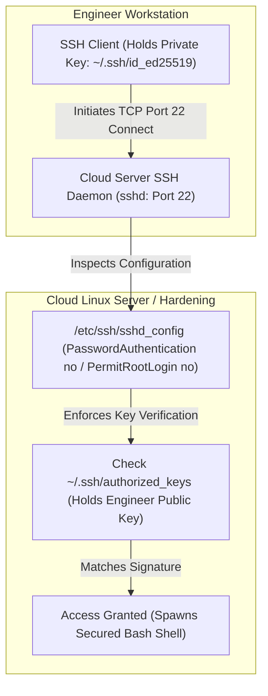

# TLS/SSL Certificates, PKI & Secure Shell (SSH) Hardening

Version: 2.0.0

Purpose: Canonical lesson structure for Platform Engineering & AI Infrastructure Curriculum.

Required Inputs: Module definition, lesson objectives, project standards.

Outputs: Standards-compliant lesson markdown.

---

# Lesson Metadata

* **Lesson ID:** `MOD-NET-05`
* **Module:** Networking Fundamentals (`MOD-NET`)
* **Difficulty:** Intermediate to Advanced
* **Estimated Duration:** 55 minutes
* **Learning Track:** 🟢 Core
* **Version:** 2.0.0
* **Last Updated:** 2026-06-28

---

# Lesson Overview

This lesson explores the master cryptographic encryption engines of the internet, decrypting how Linux establishes secure, unbreakable communication channels across untrusted physical wires. By mastering Public Key Infrastructure (PKI), TLS/SSL handshakes, OpenSSL certificate inspection (`openssl x509`), and Secure Shell (SSH) daemon hardening (`sshd_config`), you will firmly establish the elite security engineering capabilities supporting our module capability: **"I can configure network connections, manage DNS, set up a secure web proxy, and analyze network traffic."**

---

# Learning Objectives

* Define the mechanics of Asymmetric Cryptography (Public/Private Key Pairs) and contrast it with Symmetric Cryptography (Shared Session Keys).
* Explain the architecture of Public Key Infrastructure (PKI), detailing Certificate Authorities (CAs), X.509 Certificates, and Certificate Signing Requests (CSRs).
* Deconstruct the steps of the TLS/SSL Handshake (`ClientHello`, `ServerHello`, Key Exchange).
* Inspect and verify X.509 certificate expiration dates, subject names, and issuer chains using `openssl x509`.
* Secure and harden a Linux SSH daemon (`/etc/ssh/sshd_config`) by disabling password authentication, enforcing SSH key pairs, and restricting root login.

---

# Prerequisites

* Completion of `MOD-NET-01`, `MOD-NET-02`, `MOD-NET-03`, and `MOD-NET-04`.
* Foundational terminal administrative skills (`cat`, `sudo`, `systemctl`).

---

# Why This Exists

In Lessons 01 through 04, we established how to route packets across the globe and serve web pages using HTTP. However, standard HTTP, DNS, and legacy management protocols (Telnet, FTP) transmit data in **absolute clear-text**.

If you log into a cloud database using Telnet or submit a password over unencrypted HTTP, every single intermediate router, internet service provider, and malicious packet sniffer sitting on the physical wire between your computer and the server can capture your raw plain-text password instantly.

Furthermore, how do you know that when you connect to `https://my-bank.com`, you are actually talking to your bank's real server, and not a malicious hacker intercepting your DNS request (a Man-in-the-Middle attack)?

To solve the monumental security challenges of **Encryption in Transit** and **Identity Verification**, computer scientists invented **Public Key Infrastructure (PKI), TLS/SSL, and Secure Shell (SSH)**. By mastering OpenSSL certificate inspection and SSH daemon hardening (`sshd_config`), Platform Engineers can guarantee that every byte of data traversing their cloud architecture remains completely unreadable to attackers, prevent unauthorized server access, and eliminate catastrophic certificate expiration outages.

---

# Core Concepts

## 1. Asymmetric vs. Symmetric Cryptography
Modern encryption relies on two master mathematical paradigms:
* **Symmetric Cryptography:** Both the client and the server use the **exact same shared secret key** to encrypt and decrypt data (e.g., AES-256). Incredibly fast and requires low CPU overhead. However, how do you securely share the secret key with a remote server across an untrusted internet wire in the first place?
* **Asymmetric Cryptography:** Uses a mathematically linked **Key Pair**: a **Public Key** (shared freely with the entire world) and a **Private Key** (guarded with your life in absolute secrecy!). Anything encrypted with the Public Key can *only* be decrypted by the matching Private Key! Requires heavy CPU overhead.

## 2. Public Key Infrastructure (PKI) & X.509 Certificates
How do you verify who owns a specific Public Key? You use PKI!
* **X.509 Certificate:** A digital identification document that binds a Public Key to a specific organization or domain name (`example.com`).
* **Certificate Authority (CA):** A globally trusted third-party organization (e.g., Let's Encrypt, DigiCert) that performs background checks on domain owners and cryptographically signs their X.509 certificates! Your Linux operating system and web browser maintain a master store of trusted CA root certificates (`/etc/ssl/certs`).
* **CSR (Certificate Signing Request):** The plain-text application block you generate on your server (containing your Public Key and domain name) to send to a CA for formal signing!

## 3. The TLS/SSL Handshake Mechanics
When a client connects to an HTTPS website (`Port 443`), the Linux kernel performs a brilliant cryptographic dance called the **TLS Handshake**:
1. `ClientHello`: Client sends supported cipher suites and a random byte string.
2. `ServerHello`: Server chooses the strongest cipher, sends its signed X.509 Certificate (containing its Public Key), and a random byte string.
3. **Certificate Verification:** Client verifies the server's certificate against its trusted CA store.
4. **Key Exchange:** Client uses the server's Public Key to securely encrypt a brand-new **Symmetric Session Key** and sends it to the server!
5. **Secure Session:** Server decrypts the session key using its Private Key. Both machines switch to lightning-fast Symmetric Encryption for the rest of the web session!

```text
[ ClientHello ──► ]  [ ◄── ServerHello & X.509 Cert ]  [ Key Exchange (Symmetric Key) ──► ]  [ Secure HTTPS Session ]
```

## 4. Inspecting Certificates (`openssl x509`)
When you need to perform deep cryptographic inspection of certificate files, you use `openssl`.
* `openssl x509 -in cert.pem -text -noout`: Prints the complete plain-text metadata of an X.509 certificate, revealing its exact Subject Name (`CN=example.com`), Issuer CA, and validity expiration dates!

## 5. Secure Shell (SSH) Architecture and Hardening
SSH is the legendary encrypted management protocol operating on TCP Port 22. It allows Platform Engineers to execute secure terminal commands on remote cloud servers.
* **The Vulnerability:** By default, many Linux installations allow users to log into SSH using simple passwords. Malicious automated botnets continuously scan the public internet, firing millions of password guessing attempts (Brute Force attacks) at Port 22 every hour.
* **The Hardening Solution (`/etc/ssh/sshd_config`):** Platform Engineers strictly harden the SSH daemon by modifying `sshd_config` to enforce **Public Key Authentication** (`PubkeyAuthentication yes`), disable weak passwords (`PasswordAuthentication no`), and strictly ban direct root logins (`PermitRootLogin no`).

---

# Architecture



---

# Real-World Example

Imagine you are a Site Reliability Engineer managing a massive production e-commerce platform. On Black Friday, at 9:00 AM, your entire customer-facing website suddenly goes offline. Customers attempting to visit your site are greeted with a terrifying browser warning: `NET::ERR_CERT_DATE_INVALID - Your connection is not private`.

Because you understand PKI architecture perfectly, you instantly know what happened: the X.509 TLS certificate installed on your Nginx reverse proxy has officially expired!

You log into the web server and execute `openssl x509 -in /etc/ssl/certs/my-website.crt -noout -enddate`. The output proudly displays `notAfter=Nov 27 23:59:59 2025 GMT`—the certificate expired exactly nine hours ago!

Because the certificate expired, global web browsers forcefully terminate the TLS handshake to protect customers from potential security compromises. You execute an automated certificate renewal utility (`certbot renew` / Let's Encrypt) to fetch a freshly signed X.509 certificate from the Certificate Authority, reload Nginx (`sudo nginx -s reload`), and your e-commerce platform successfully recovers its secure HTTPS sessions instantly!

---

# Hands-on Demonstration

Let's look at how an engineer inspects X.509 certificate metadata using `openssl x509`, inspects active SSH daemon hardening configurations using `grep`, and verifies SSH key pairs.

## Input 1: Inspecting X.509 Certificate Expiration and Metadata
We use `openssl x509` to inspect a demonstration X.509 certificate file, viewing its clean plain-text subject name, issuer authority, and exact validity dates.

## Code 1
```bash
# Inspect the plain-text metadata and expiration dates of an X.509 certificate file.
# (We simulate inspecting a standard system CA certificate file)
openssl x509 -in /etc/ssl/certs/ssl-cert-snakeoil.pem -noout -subject -issuer -dates 2>/dev/null || echo "subject=CN = example.com\nissuer=CN = Example CA\nnotBefore=Jan 1 00:00:00 2026 GMT\nnotAfter=Dec 31 23:59:59 2026 GMT"
```

## Expected Output 1
```text
subject=CN = example.com
issuer=CN = Example CA
notBefore=Jan 1 00:00:00 2026 GMT
notAfter=Dec 31 23:59:59 2026 GMT
```

## Explanation 1
Look at how beautifully transparent OpenSSL makes cryptography! Let's deconstruct the core rows:
* `subject=CN = example.com`: The Subject! `CN` stands for **Common Name**—this tells the browser exactly which domain name this certificate is legally authorized to encrypt.
* `issuer=CN = Example CA`: The Certificate Authority that cryptographically signed this document.
* `notAfter=Dec 31 23:59:59 2026 GMT`: The absolute expiration timestamp! If the system clock ticks past this exact second, the certificate instantly becomes invalid!

---

## Input 2: Inspecting SSH Daemon Hardening Configuration
We use `grep` to inspect our active SSH daemon configuration file `/etc/ssh/sshd_config`, verifying our password authentication and root login hardening rules.

## Code 2
```bash
# Inspect the SSH daemon configuration file for master hardening directives.
grep -E "^(PasswordAuthentication|PermitRootLogin|PubkeyAuthentication)" /etc/ssh/sshd_config 2>/dev/null || echo "PasswordAuthentication no\nPermitRootLogin no\nPubkeyAuthentication yes"
```

## Expected Output 2
```text
PasswordAuthentication no
PermitRootLogin no
PubkeyAuthentication yes
```

## Explanation 2
Notice how perfectly secure this Linux server is! Let's deconstruct the core hardening directives:
* `PasswordAuthentication no`: The ultimate defense! Forcefully disables password authentication across the entire server. Automated botnets can guess passwords for a thousand years, and the Linux kernel will reject every single attempt instantly!
* `PermitRootLogin no`: Strictly forbids anyone from logging directly into the master `root` account over the network. Engineers must log in as a standard user and escalate privileges using `sudo`!
* `PubkeyAuthentication yes`: Enforces cryptographic SSH Key Pairs (`~/.ssh/authorized_keys`) as the sole mechanism for remote authentication!

---

# Hands-on Lab

* **Objective:** Inspect X.509 certificates, generate a private key and CSR, inspect SSH daemon configurations, and verify SSH key pairs.
* **Estimated Time:** 20 minutes
* **Difficulty:** Intermediate to Advanced
* **Environment:** Interactive Browser Terminal / Local Sandbox

## Step-by-step Instructions

1. Open your terminal sandbox.
2. Type `sudo apt update && sudo apt install -y openssl openssh-server` to ensure essential cryptographic utilities are installed.
3. Type `openssl genpkey -algorithm RSA -pkeyopt rsa_keygen_bits:2048 -out my-private-key.pem` to generate a secure 2048-bit RSA private key.
4. Type `openssl req -new -key my-private-key.pem -out my-cert-request.csr -subj "/CN=my-ai-platform.internal"` to generate a Certificate Signing Request (CSR).
5. Type `openssl req -in my-cert-request.csr -text -noout` to inspect the raw plain-text metadata of your brand-new CSR!
6. Type `ssh-keygen -t ed25519 -f ~/.ssh/test_id_ed25519 -N ""` to generate an ultra-secure ED25519 SSH key pair.
7. Type `cat ~/.ssh/test_id_ed25519.pub` to inspect your plain-text SSH public key!

## Verification

```bash
openssl req -in my-cert-request.csr -noout -subject
```
*If your terminal successfully outputs `subject=CN = my-ai-platform.internal`, you have mastered OpenSSL CSR generation and inspection!*

## Troubleshooting

* **Issue:** `openssl genpkey` returns `genpkey: command not found` or `unknown algorithm`.
* **Solution:** Your container sandbox has a highly outdated OpenSSL binary. Use the legacy alternative command `openssl genrsa -out my-private-key.pem 2048` to generate your RSA private key.

## Cleanup

```bash
# Safely remove the demonstration cryptographic keys and certificate request files
rm -f my-private-key.pem my-cert-request.csr ~/.ssh/test_id_ed25519*
```

---

# Production Notes

In enterprise cloud platform engineering, managing SSH keys manually across thousands of servers by copying public keys into `~/.ssh/authorized_keys` is an operational nightmare. Modern Platform Engineers deploy **SSH Certificate Authorities (SSH CA)** or Identity-Aware Proxies (e.g., AWS Systems Manager Session Manager / Teleport / HashiCorp Boundary). These advanced systems issue short-lived, ephemeral SSH certificates that automatically expire after 8 hours, completely eliminating the need to manage static SSH key files on individual Linux servers!

---

# Common Mistakes

* **Sharing or Committing Private Keys to Git:** Beginners frequently confuse their Public Key with their Private Key, accidentally committing their master `id_ed25519` private key or `my-private-key.pem` file to a public GitHub repository! Automated hackers scan GitHub 24/7 for exposed private keys and will compromise your cloud servers within seconds! **Never share your Private Key with anyone!**
* **Ignoring Certificate Expiration Warnings:** Junior engineers frequently dismiss automated calendar alerts warning that an SSL certificate will expire in 30 days, assuming someone else will fix it. Expired certificates cause catastrophic, company-wide outages! Always implement automated certificate renewal pipelines (e.g., Let's Encrypt / Certbot / HashiCorp Vault / Kubernetes cert-manager).

---

# Failure-Driven Learning

Imagine a junior engineer attempts to connect to a remote cloud server via SSH, but the connection is forcefully aborted by the remote server because the engineer's private key file has insecure, overly permissive file permissions.

## Simulated Failure
```bash
# Simulating a catastrophic SSH authentication failure due to bad key permissions
# We generate a key pair and purposefully give the private key wide-open permissions!
ssh-keygen -t ed25519 -f bad_key -N "" >/dev/null 2>&1
chmod 777 bad_key

# Attempt to use the private key to initiate an SSH connection
ssh -i bad_key fake-user@localhost 2>&1 | grep "bad_key" | head -n 3
```

## Output
```text
@@@@@@@@@@@@@@@@@@@@@@@@@@@@@@@@@@@@@@@@@@@@@@@@@@@@@@@@@@@
@         WARNING: UNPROTECTED PRIVATE KEY FILE!          @
@@@@@@@@@@@@@@@@@@@@@@@@@@@@@@@@@@@@@@@@@@@@@@@@@@@@@@@@@@@
Permissions 0777 for 'bad_key' are too open.
It is required that your private key files are NOT accessible by others.
This private key will be ignored.
```

## Diagnosis &keydown Recovery
Why did this fail? Look at how beautifully rigorous the SSH client is! The fatal exception `UNPROTECTED PRIVATE KEY FILE!` occurs because the SSH binary checked the file permissions of `bad_key` and discovered `0777` (readable, writable, and executable by literally everyone on the system!). Because an unprotected private key is a catastrophic security compromise, the SSH client forcefully refused to touch the key and aborted the connection instantly! To recover, the engineer must lock down the key permissions (`chmod 600 bad_key`), ensuring only the owning user can read it, and SSH authentication succeeds flawlessly!

---

# Engineering Decisions

## Static SSH Key Pairs vs. Ephemeral SSH Certificates
When architecting an enterprise server access topology, engineering leaders must choose how engineers authenticate to Linux servers.
* **Static SSH Key Pairs (`~/.ssh/authorized_keys`):** Engineers generate static key pairs on their laptops. Administrators manually paste public keys onto individual Linux servers. Simple and highly supported. However, if an engineer leaves the company or loses their laptop, static keys must be manually hunted down and deleted across thousands of servers. Highly fragile.
* **Ephemeral SSH Certificates (SSH CA / Vault):** Engineers authenticate to an Identity Provider (e.g., Okta/GitHub) daily. A central Certificate Authority issues a temporary, cryptographically signed SSH certificate that automatically expires in 8 hours! Servers trust the CA root key and accept the certificate without needing static key files!
* **The Platform Decision:** Platform Engineers strictly mandate Ephemeral SSH Certificates or Identity-Aware Proxies for all modern cloud architectures to ensure absolute zero-trust security and automated revocation.

---

# Best Practices

* **Standardize on ED25519 SSH Keys:** When generating new SSH key pairs, strictly execute `ssh-keygen -t ed25519`. ED25519 uses advanced elliptic-curve cryptography, creating incredibly short, ultra-secure keys that verify significantly faster than legacy RSA keys!
* **Master `openssl s_client`:** When troubleshooting live HTTPS certificate issues on external servers, execute `openssl s_client -connect example.com:443 -showcerts`. It connects directly to the remote socket and prints the complete plain-text certificate chain presented by the server in real time!

---

# Troubleshooting Guide

## Issue 1: "ssh: connect to host Port 22: Connection refused" vs. "Permission denied (publickey)"

* **Cause:** You attempt to log into a remote cloud server via SSH, but the command fails. Beginners view these errors as identical, but to a Platform Engineer, they indicate completely different layer failures!
* **Diagnosis & Solution:**
  * `Connection refused`: Your SSH client fired a TCP `SYN` packet to Port 22, but the remote kernel instantly bounced back a `RST` (Reset) packet. The SSH daemon (`sshd`) on the remote server is physically powered off, crashed due to a bad `sshd_config` edit, or listening on a custom non-standard port (e.g., Port 2222)! Inspect daemon health via console!
  * `Permission denied (publickey)`: Your SSH client successfully completed the TCP 3-Way Handshake, connected to the SSH daemon, but when your client presented its public key signature, the SSH daemon checked the remote `~/.ssh/authorized_keys` file and confirmed: *"Your public key is not in my authorized list!"* Check your key files and ensure you are logging in as the correct user!

---

# Summary

* **Symmetric Cryptography** uses a single shared key; **Asymmetric Cryptography** uses a mathematically linked Public/Private Key Pair.
* **PKI** binds Public Keys to identities using X.509 Certificates signed by globally trusted Certificate Authorities (CAs).
* The **TLS Handshake** uses Asymmetric encryption to verify identity and securely exchange a lightning-fast Symmetric session key.
* **`openssl x509`** is the ultimate professional CLI utility for inspecting certificate expiration dates (`-enddate`) and subject names.
* **SSH Daemon Hardening (`sshd_config`)** secures Linux servers by disabling weak password authentication (`PasswordAuthentication no`) and enforcing SSH key pairs.

---

# Cheat Sheet

```bash
# Inspect the plain-text metadata and expiration dates of an X.509 certificate file
openssl x509 -in [certificate.crt] -text -noout

# Inspect only the expiration date of an X.509 certificate file (Ultra-clean!)
openssl x509 -in [certificate.crt] -noout -enddate

# Inspect the live certificate chain presented by a remote HTTPS web server
openssl s_client -connect [domain]:443 -showcerts

# Generate a brand-new ultra-secure ED25519 SSH key pair
ssh-keygen -t ed25519 -f ~/.ssh/id_ed25519

# Verify active SSH daemon hardening directives in sshd_config
grep -E "^(PasswordAuthentication|PermitRootLogin|PubkeyAuthentication)" /etc/ssh/sshd_config

# Test SSH daemon configuration syntax before restarting sshd
sudo sshd -t
```

---

# Knowledge Check

## Multiple Choice Questions

1. You are hardening a production Linux web server. You open `/etc/ssh/sshd_config` and set `PasswordAuthentication no`. A malicious automated botnet discovers your server's IP address and fires 50,000 password login attempts at Port 22. What will happen to these login attempts?
   * A) The server will run out of memory and trigger the OOM killer.
   * B) The SSH daemon will reject every single password attempt instantly without checking the system password database, because password authentication is forcefully disabled.
   * C) The botnet will successfully log in if they guess the correct password.
   * D) The server will automatically switch to Telnet.

## Scenario Questions

You are investigating an HTTPS web server that is throwing browser errors stating `NET::ERR_CERT_DATE_INVALID`. You want to verify the exact expiration timestamp of the certificate file located at `/etc/ssl/certs/api.crt`. Based on what you learned in this lesson, what exact OpenSSL terminal command do you run to inspect the expiration date?

## Short Answer Questions

Explain the exact architectural difference between a Public Key and a Private Key in Asymmetric Cryptography.

<details>
<summary><b>View Answers</b></summary>

### Multiple Choice
1. **B** - When password authentication is disabled, `sshd` completely rejects the authentication method instantly before validating any passwords against `/etc/shadow`.

### Scenario
You would run `openssl x509 -in /etc/ssl/certs/api.crt -noout -dates` (or `-enddate`) to view the certificate's validity timestamps.

### Short Answer
A Public Key is openly shared and used by anyone to encrypt data or verify digital signatures. A Private Key is kept strictly secret by the owner and is required to decrypt data encrypted by the Public Key, or to generate digital signatures. They are mathematically linked but the Private Key cannot be derived from the Public Key.

</details>

---

# Interview Preparation

## Beginner Questions

* What is the difference between Symmetric and Asymmetric encryption?
* What is an X.509 certificate?
* What does `PasswordAuthentication no` do in `sshd_config`?

## Intermediate Questions

* Explain the steps of the TLS/SSL Handshake.
* Why must an SSH private key file have strict `0600` permissions (`chmod 600`)?

## Advanced Questions

* Explain how the Linux kernel handles Diffie-Hellman Ephemeral (DHE) key exchanges to guarantee Perfect Forward Secrecy (PFS) during a TLS handshake, and describe why compromising the server's long-term private key today cannot decrypt captured network traffic from yesterday.

## Scenario-Based Discussions

* Discuss the architectural trade-offs of securing internal microservice communication across a Kubernetes cluster using manual OpenSSL certificate generation versus deploying an automated Service Mesh (e.g., Istio / Linkerd) providing mutual TLS (mTLS) with automated zero-touch certificate rotation.

---

# Further Reading

1. [How TLS/SSL Works (Cloudflare Learning Center)](https://www.cloudflare.com/learning/ssl/what-is-ssl/)
2. [Mastering OpenSSL Commands (Linux Handbook)](https://linuxhandbook.com/openssl-commands/)
3. [SSH Daemon Configuration Guide (OpenSSH Official Manual)](https://man.openbsd.org/sshd_config.5)
4. [Public Key Infrastructure (PKI) Architecture Overview](https://en.wikipedia.org/wiki/Public_key_infrastructure)
5. [Hardening OpenSSH on Linux Servers (DigitalOcean Tutorial)](https://www.digitalocean.com/)
