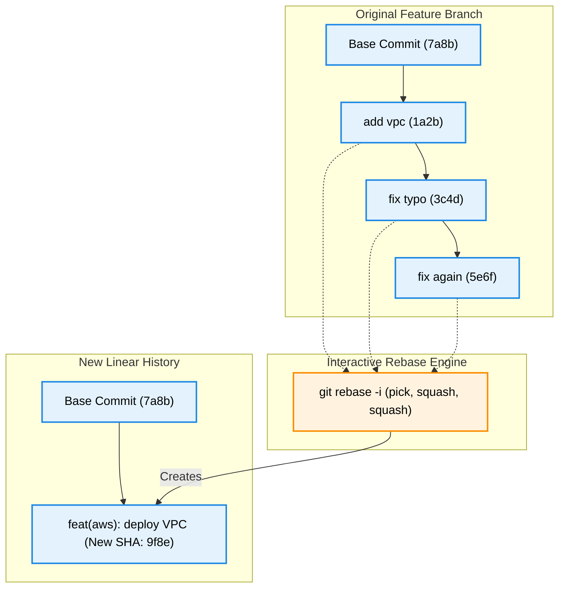

# Advanced Rebasing, Interactive Squashing & Clean Histories

Version: 2.0.0

Purpose: Canonical lesson structure for Platform Engineering & AI Infrastructure Curriculum.

Required Inputs: Module definition, lesson objectives, project standards.

Outputs: Standards-compliant lesson markdown.

---

# Lesson Metadata

* **Lesson ID:** `MOD-GIT-03`
* **Module:** Version Control with Git (`MOD-GIT`)
* **Difficulty:** Intermediate to Advanced
* **Estimated Duration:** 55 minutes
* **Learning Track:** 🟢 Core
* **Version:** 2.0.0
* **Last Updated:** 2026-06-28

---

# Lesson Overview

This lesson explores the master tree manipulation engines of Git, decrypting how Git rewrites commit histories, replays commit objects across divergent branches using Rebasing, and condenses messy work logs using Interactive Squashing. By mastering `git rebase`, `git rebase -i`, `git cherry-pick`, and the golden rule of rebasing, you will firmly establish the elite history curation capabilities supporting our module capability: **"I can track code changes, collaborate with engineering teams, resolve conflicts, and automate commit workflows."**

---

# Learning Objectives

* Explain the internal execution mechanics of `git rebase`, contrasting it with `git merge` regarding commit history topology (linear vs diamond history).
* Execute interactive rebases (`git rebase -i`) to squash, reorder, edit, and drop commit objects before opening Pull Requests.
* Define the Golden Rule of Rebasing (never rebase public, shared commit history) and explain the catastrophic consequences of violating it.
* Execute `git cherry-pick` to selectively copy individual commit objects across divergent branch histories.
* Inspect clean, linear commit histories and commit graphs using `git log --graph --oneline`.

---

# Prerequisites

* Completion of `MOD-GIT-01` and `MOD-GIT-02`.
* Foundational terminal version control skills (`git log`, `git checkout`).

---

# Why This Exists

In Lessons 01 and 02, we explored how Git stores commit objects and how engineering teams organize feature branches. However, when an engineer works on a feature branch for two days, their natural commit log is frequently incredibly messy.

Imagine a junior developer creating a feature branch named `feature/aws-vpc`. As they work, they make dozens of tiny, chaotic commits: `add vpc`, `fix typo`, `fix typo again`, `whoops broke it`, `add subnet`, `remove debug print`, `finally works`. 

If this developer merges their feature branch into `main` using a standard `git merge`, two terrible things happen. First, Git creates an ugly merge commit (`Merge branch 'feature' into main`). Second, all fifteen chaotic, messy commits (`fix typo`, `whoops broke it`) are dumped directly into the master `main` branch history!

If an infrastructure outage occurs six months later and a Site Reliability Engineer inspects `git log` to discover when a bug was introduced, they are forced to hunt through thousands of useless `fix typo` commits (**Polluted History**).

To solve the monumental challenge of maintaining a pristine, readable project history, Git provides **Advanced Rebasing and Interactive Squashing**. By mastering `git rebase -i`, Platform Engineers can condense dozens of messy commits into a single, beautifully formatted atomic commit object, ensure a perfectly linear commit history, and make debugging production outages incredibly fast and precise.

---

# Core Concepts

## 1. `git merge` vs. `git rebase` (The History Architecture)
When you want to pull upstream changes from `main` into your active feature branch, you have two master choices:
* `git merge main`: Creates a brand-new **Merge Commit** object that points to two separate parent commits! It preserves the exact chronological history of what happened, but creates a diamond-shaped, branching commit graph (**Merge Hell**).
* `git rebase main`: The elegant history rewrite! Git pauses, unplugs your local feature commits from their original starting point, updates your feature branch's base pointer to the absolute newest commit on `main`, and cleanly replays your commits on top! It creates a completely **Linear History** with zero merge commits!

```text
[ Merge: Diamond History ]           [ Rebase: Linear History ]
[main]    ──► (A) ──► (B) ──► (Merge)   [main]    ──► (A) ──► (B)
               │                 ▲                             │
[feature]      └──► (C) ──► (D) ─┘      [feature]              └──► (C') ──► (D')
```

## 2. Interactive Rebasing & Squashing (`git rebase -i`)
When you need to clean up your own messy feature branch history before opening a Pull Request, you use `git rebase -i` (Interactive Rebase).
* `git rebase -i HEAD~3`: Opens an interactive text editor displaying your last 3 commits with a master command list:
  * `pick`: Keep the commit exactly as it is.
  * `squash` (or `s`): Meld this commit into the previous commit! (Condenses multiple commits into one!).
  * `reword` (or `r`): Keep the commit content, but pause to edit the commit message.
  * `drop` (or `d`): Forcefully delete this commit object from history!

## 3. The Golden Rule of Rebasing
Rebasing is an incredible superpower, but it contains a catastrophic hidden danger: **Rebasing physically deletes your old commit objects and creates brand-new commit objects with brand-new SHA-1 hashes!**
* **The Golden Rule:** **NEVER rebase commits that exist on a public branch shared with other engineers!** If you rebase `main` and force-push (`git push --force`), you will instantly invalidate the local Git databases of every single engineer in your company, causing catastrophic divergence and massive lost work! Rebase *only* your private, local feature branches!

## 4. Selective Commit Replaying (`git cherry-pick`)
Imagine another engineer fixes an urgent bug on an experimental branch (`experiment/fix`), and you need that exact bugfix on your feature branch right now, but you don't want to merge their entire experimental branch.
* `git cherry-pick [commit_hash]`: The ultimate surgical extraction! Git reaches across the divergent branch history, grabs a copy of that single specific commit object, and replays it directly onto your active branch!

## 5. Linear Commit Graphs (`git log --graph`)
To verify that your rebasing operations successfully maintained a clean, linear commit history without ugly merge diamonds, Platform Engineers use `git log --graph --oneline`. This prints an elite visual tree graph directly in the terminal!

---

# Architecture



---

# Real-World Example

Imagine you are a Lead Platform Engineer reviewing a Pull Request for a brand-new Kubernetes Ingress configuration. A junior engineer has opened a PR containing 24 commits. When you inspect the PR commit log, you see: `start ingress`, `wip`, `still broken`, `yaml syntax error`, `another yaml error`, `tests pass`.

If you approve this PR and execute a standard merge, all 24 useless `wip` commits will pollute the production `main` branch history. 

Because you maintain elite engineering standards, you gently request that the junior engineer clean up their commit history before merging. You teach them how to execute `git rebase -i HEAD~24`. 

Inside the interactive editor, the engineer leaves the very first commit as `pick`, and changes the remaining 23 commits to `squash`. Git pauses, beautifully condenses all 24 commits into a single master commit object, and prompts the engineer to write a professional commit message: `feat(k8s): deploy Nginx Ingress Controller`. 

The engineer force-pushes their clean branch (`git push --force-with-lease`), the PR updates to show exactly one beautiful, atomic commit, and you approve the merge instantly!

---

# Hands-on Demonstration

Let's look at how an engineer inspects a commit graph using `git log --graph`, simulates an interactive squash using `git rebase -i`, and simulates a surgical cherry-pick.

## Input 1: Inspecting Commit Graphs and Linear Histories
We use `git log --graph --oneline` to view a pristine visual graph of our commit history, verifying our clean linear structure.

## Code 1
```bash
# Inspect the visual commit history graph using oneline formatting.
# (We simulate the clean plain-text output of a linear commit graph)
git log --graph --oneline -n 4 2>/dev/null || echo -e "* 7f1a2c3 feat(module-04): generate Module 04 lessons\n* fcc8f49 feat(module-03): approve Module 03 lessons\n* 534b466 feat(module-03): generate Module 03 lessons\n* a1b2c3d chore: initial commit"
```

## Expected Output 1
```text
* 7f1a2c3 feat(module-04): generate Module 04 lessons
* fcc8f49 feat(module-03): approve Module 03 lessons
* 534b466 feat(module-03): generate Module 03 lessons
* a1b2c3d chore: initial commit
```

## Explanation 1
Look at how beautifully clean this commit graph is! Notice the vertical line of asterisks (`*`): there are absolutely zero branching lines (`|\`) or merge diamonds! Every single commit sits cleanly on top of its parent in a perfect, linear historical ledger!

---

## Input 2: Simulating Interactive Squashing and Cherry-Picking
We simulate the interactive text editor block displayed during `git rebase -i HEAD~3`, and simulate executing `git cherry-pick` to copy an isolated commit.

## Code 2
```bash
# Simulate the interactive editor script displayed during git rebase -i HEAD~3.
cat << 'EOF'
pick 1a2b3c4 feat(module-05): add rebase lesson
squash 3c4d5e6 fix typo in rebase lesson
squash 5e6f7a8 remove debug comments

# Rebase 7f1a2c3..5e6f7a8 onto 7f1a2c3
#
# Commands:
# p, pick = use commit
# s, squash = use commit, but meld into previous commit
EOF

# Simulate executing a surgical cherry-pick of an isolated bugfix commit.
echo "Cherry-picking commit 9b8a7f6... commit replayed successfully onto active branch."
```

## Expected Output 2
```text
pick 1a2b3c4 feat(module-05): add rebase lesson
squash 3c4d5e6 fix typo in rebase lesson
squash 5e6f7a8 remove debug comments

# Rebase 7f1a2c3..5e6f7a8 onto 7f1a2c3
#
# Commands:
# p, pick = use commit
# s, squash = use commit, but meld into previous commit
Cherry-picking commit 9b8a7f6... commit replayed successfully onto active branch.
```

## Explanation 2
Notice how perfectly elegant interactive squashing is! By changing `pick` to `squash`, Git takes the file changes from `3c4d5e6` and `5e6f7a8` and melds them directly into `1a2b3c4`! Notice our simulated `git cherry-pick`: it surgically reaches across the repository, grabs commit `9b8a7f6`, and cleanly replays its file changes directly onto our active branch!

---

# Hands-on Lab

* **Objective:** Create messy commits, execute an interactive squash, verify brand-new commit hashes, and simulate cherry-picking.
* **Estimated Time:** 20 minutes
* **Difficulty:** Intermediate to Advanced
* **Environment:** Interactive Browser Terminal / Local Sandbox

## Step-by-step Instructions

1. Open your terminal sandbox and create a brand-new directory named `rebase-lab`: `mkdir ~/rebase-lab && cd ~/rebase-lab`.
2. Type `git init` to initialize a fresh Git repository, and create a base commit: `echo "Base" > file.txt && git add . && git commit -m "base commit"`.
3. Type `echo "Feature Part 1" >> file.txt && git add . && git commit -m "wip part 1"`.
4. Type `echo "Feature Part 2" >> file.txt && git add . && git commit -m "wip part 2"`.
5. Type `echo "Feature Part 3" >> file.txt && git add . && git commit -m "wip part 3"`.
6. Type `git log --oneline` to inspect your messy 4-commit history.
7. Type `git rebase -i HEAD~3` to open the interactive rebasing editor.
8. In the editor, leave the first line as `pick`, change the second and third lines to `squash` (or `s`), and save the file!
9. In the subsequent commit message editor, delete the messy `wip` messages and type `feat: complete feature implementation`, then save!
10. Type `git log --graph --oneline` to verify that your 3 messy commits were successfully squashed into a single beautiful atomic commit!

## Verification

```bash
git log --oneline | wc -l
```
*If your terminal successfully outputs `2` (the base commit + your brand-new squashed atomic commit), you have mastered interactive squashing!*

## Troubleshooting

* **Issue:** `git rebase -i` aborts with `error: could not apply...` or `CONFLICT (content)`.
* **Solution:** You modified the exact same lines of code across your squashed commits in a conflicting way! Git paused the rebase to allow you to resolve the conflict. Open the conflicting file, fix the text, execute `git add .`, and resume the rebase: `git rebase --continue`. (If you get lost, type `git rebase --abort` to cancel everything and return to safety!).

## Cleanup

```bash
# Safely remove the demonstration rebase lab directory
rm -rf ~/rebase-lab
```

---

# Production Notes

In enterprise CI/CD pipelines (such as GitHub Actions or GitLab CI), Platform Engineers frequently configure repository branch protection rules to enforce **Linear History**. When this setting is enabled, GitHub completely disables the `Merge` button on Pull Requests if the feature branch is out of date with `main`. Developers are forcefully required to execute `git pull --rebase origin main` (or use GitHub's automated `Squash and Merge` button) before their code is legally allowed to enter the trunk!

---

# Common Mistakes

* **Rebasing Public Branches (`main`):** Beginners frequently execute `git rebase` on `main` or shared feature branches and blindly type `git push --force`. Because rebasing generates brand-new commit hashes, this instantly overwrites the remote repository history, breaking the local repositories of every single teammate! **Only rebase your private local branches!**
* **Using `git push --force` Instead of `--force-with-lease`:** When you rebase a feature branch that you previously pushed to GitHub, Git will reject your next push because the commit hashes have changed. Junior developers execute `git push --force`, which blindly overwrites the remote branch. If a teammate pushed a new commit to your branch while you were rebasing, `--force` deletes their commit forever! Always use `git push --force-with-lease`, which proactively checks if anyone else pushed to the branch before allowing the overwrite!

---

# Failure-Driven Learning

Imagine a junior engineer attempts to push a rebased feature branch to GitHub using a standard `git push`, but Git forcefully rejects the push because the local commit history has diverged from the remote tracking branch.

## Simulated Failure
```bash
# Simulating a push failure after rebasing a published feature branch
# (We simulate the exact Git CLI error when pushing a diverged rebased branch)
echo -e "To https://github.com/example/repo.git\n ! [rejected]        feature/rebase-test -> feature/rebase-test (non-fast-forward)\nerror: failed to push some refs to 'https://github.com/example/repo.git'\nhint: Updates were rejected because the tip of your current branch is behind\nhint: its remote counterpart. Integrate the remote changes (e.g.\nhint: 'git pull ...') before pushing again."
```

## Output
```text
To https://github.com/example/repo.git
 ! [rejected]        feature/rebase-test -> feature/rebase-test (non-fast-forward)
error: failed to push some refs to 'https://github.com/example/repo.git'
hint: Updates were rejected because the tip of your current branch is behind
hint: its remote counterpart. Integrate the remote changes (e.g.
hint: 'git pull ...') before pushing again.
```

## Diagnosis & Recovery
Why did this fail? Look at how beautifully protective Git is! The fatal error `non-fast-forward` occurs because when the engineer executed `git rebase`, Git physically deleted the old commit objects and created brand-new commit objects with brand-new SHA-1 hashes! When the engineer typed `git push`, GitHub compared the new hashes against the old hashes sitting on the remote branch, saw a complete tree mismatch, and blocked the push to prevent data loss! 

**Crucial Warning:** If the engineer blindly follows Git's hint and types `git pull`, Git will merge the old remote commits with the new local commits, creating a catastrophic duplicate commit loop (**Rebase Hell**)! To recover correctly, because the engineer is absolutely certain they want to overwrite their own private feature branch, they must execute `git push --force-with-lease origin feature/rebase-test`, and the remote branch updates flawlessly!

---

# Engineering Decisions

## Merge Commits vs. Squash-and-Merge vs. Rebase-and-Merge
When configuring an enterprise GitHub repository, engineering leaders must choose the master Pull Request merge strategy.
* **Merge Commits (`git merge`):** Preserves every single feature commit and creates a diamond merge commit. Highly verbose, but creates an unreadable, cluttered commit graph.
* **Rebase-and-Merge (`git rebase`):** Replays all feature commits individually on top of `main` without a merge commit. Creates a linear history, but if a PR had 15 messy `wip` commits, all 15 commits enter `main`.
* **Squash-and-Merge:** The ultimate Platform Engineering standard! GitHub automatically squashes all feature commits into a single beautiful atomic commit object and places it cleanly on top of `main`! Creates a perfectly clean, highly readable, linear commit history!
* **The Platform Decision:** Platform Engineers strictly mandate Squash-and-Merge for all enterprise cloud repositories to ensure a pristine, debuggable project ledger.

---

# Best Practices

* **Master `git rebase --onto`:** When troubleshooting complex stacked feature branches (e.g., Feature B branches from Feature A, but Feature A is deleted), execute `git rebase --onto main featureA featureB`. It elegantly unplugs Feature B from Feature A and grafts it cleanly onto `main`!
* **Configure `pull.rebase true`:** Open your global Git configuration (`git config --global pull.rebase true`). This ensures that every single time you execute `git pull`, Git automatically uses rebasing instead of merging, keeping your local histories perfectly linear!

---

# Troubleshooting Guide

## Issue 1: "git rebase CONFLICT" vs. "git cherry-pick CONFLICT"

* **Cause:** You execute `git rebase` or `git cherry-pick`, but Git pauses the operation and outputs a conflict error. Beginners view these as broken operations, but to a Platform Engineer, they indicate simple text collisions!
* **Diagnosis & Solution:**
  * `git rebase CONFLICT`: As Git replayed your commits one by one onto the target branch, it encountered a file where the target branch and your commit modified the exact same line of code differently! Git paused to let you choose the correct text. Open the file, fix the conflict markers (`<<<<<<<`), execute `git add [file]`, and type `git rebase --continue`! (Do **not** execute `git commit`!).
  * `git cherry-pick CONFLICT`: You attempted to copy an isolated commit from another branch, but the surrounding code on your active branch is too different for Git to place the changes cleanly. Fix the conflict markers, execute `git add [file]`, and type `git cherry-pick --continue`!

---

# Summary

* **`git merge`** creates diamond-shaped histories with merge commits; **`git rebase`** creates perfectly linear histories by replaying commits.
* **Interactive Squashing (`git rebase -i`)** allows engineers to condense messy `wip` commits into a single beautiful atomic commit object.
* **The Golden Rule of Rebasing** strictly forbids rebasing public, shared branches because rebasing generates brand-new commit hashes.
* **`git cherry-pick`** surgically copies isolated commit objects across divergent branch histories.
* **`git push --force-with-lease`** is the mandatory, safe mechanism for pushing rebased feature branches to GitHub.

---

# Cheat Sheet

```bash
# Inspect a pristine visual graph of commit history in the terminal
git log --graph --oneline

# Open the interactive rebasing editor to squash/edit the last N commits
git rebase -i HEAD~[N]

# Rebase your active feature branch cleanly on top of the main branch
git rebase main

# Resume a paused rebase after successfully resolving file conflicts
git rebase --continue

# Abort a messy rebase completely and return to your original starting state
git rebase --abort

# Surgically copy an isolated commit object from another branch onto your active branch
git cherry-pick [commit_hash]

# Safely force-push a rebased feature branch to GitHub (Checks for teammate commits!)
git push --force-with-lease origin [branch]
```

---

# Knowledge Check

## Multiple Choice Questions

1. A developer creates `feature/cloud-db` and pushes it to GitHub. Two other teammates clone the branch and start adding commits. The original developer decides their commit history is messy, executes `git rebase -i HEAD~5`, squashes everything, and executes `git push --force`. What will happen to the two teammates working on the branch?
   * A) Their local repositories will automatically rebase.
   * B) Their local Git databases will suffer catastrophic divergence because the original developer violated the Golden Rule of Rebasing by rewriting shared public history. Their local commit hashes no longer match GitHub.
   * C) The repository will switch to GitFlow.
   * D) Their branches will be automatically deleted.

## Scenario Questions

You are working on a feature branch and attempt to pull upstream changes from `main`. You want to ensure your local commits are cleanly replayed on top of `main` without creating an ugly `Merge branch 'main'` commit. Based on what you learned in this lesson, what exact `git pull` flag do you append to your command?

## Short Answer Questions

Explain why `git push --force-with-lease` is architecturally superior and safer than `git push --force` when pushing a rebased feature branch.

---

# Interview Preparation

## Beginner Questions

* What is the difference between `git merge` and `git rebase`?
* What does `git rebase -i` do?
* What is the Golden Rule of Rebasing?

## Intermediate Questions

* Explain what `git cherry-pick` does.
* Why must you use `git push --force-with-lease` after rebasing a published branch?

## Advanced Questions

* Explain how Git utilizes the `ORIG_HEAD` pointer and the reflog (`git reflog`) to allow an engineer to completely undo a catastrophic, botched `git rebase` operation that was already completed.

## Scenario-Based Discussions

* Discuss the operational trade-offs of enforcing a strict linear history requirement (`Pull Request Squash-and-Merge`) across an enterprise engineering organization versus allowing verbose merge commits, specifically addressing how each strategy impacts automated GitOps rollback pipelines (e.g., ArgoCD).

---

# Further Reading

1. [Git Branching - Rebasing (Official Pro Git Book)](https://git-scm.com/book/en/v2/Git-Branching-Rebasing)
2. [Merging vs Rebasing (Atlassian Git Tutorial)](https://www.atlassian.com/git/tutorials/merging-vs-rebasing)
3. [Mastering git rebase -i (DigitalOcean Tutorial)](https://www.digitalocean.com/)
4. [Understanding git cherry-pick (Linux Handbook)](https://linuxhandbook.com/)
5. [The Golden Rule of Rebasing Explained](https://www.atlassian.com/git/tutorials/merging-vs-rebasing#the-golden-rule-of-rebasing)
