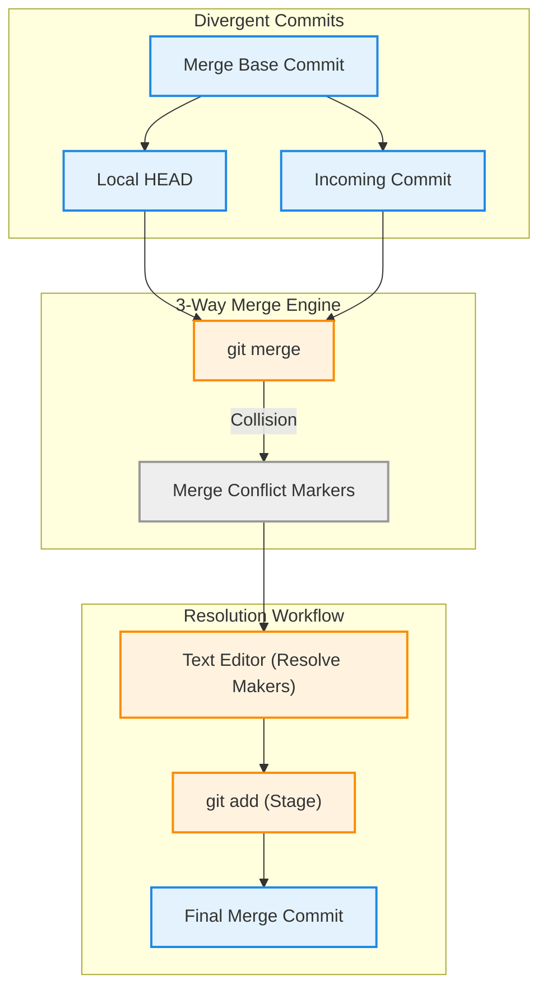

# Merge Conflict Resolution & Team Workflow Etiquette

Version: 2.0.0

Purpose: Canonical lesson structure for Platform Engineering & AI Infrastructure Curriculum.

Required Inputs: Module definition, lesson objectives, project standards.

Outputs: Standards-compliant lesson markdown.

---

# Lesson Metadata

* **Lesson ID:** `MOD-GIT-04`
* **Module:** Version Control with Git (`MOD-GIT`)
* **Difficulty:** Intermediate
* **Estimated Duration:** 50 minutes
* **Learning Track:** 🟢 Core
* **Version:** 2.0.0
* **Last Updated:** 2026-06-28

---

# Lesson Overview

This lesson explores the inevitable text collision mechanics of version control, decrypting how Git identifies conflicting code changes, injects conflict markers into files, and relies on engineers to untangle overlapping work. By mastering conflict markers (`<<<<<<<`), 3-way merge mechanics, `git mergetool`, `git diff`, and professional engineering team etiquette, you will firmly establish the elite collaboration capabilities supporting our module capability: **"I can track code changes, collaborate with engineering teams, resolve conflicts, and automate commit workflows."**

---

# Learning Objectives

* Explain the mathematical conditions that trigger a Git Merge Conflict (overlapping modifications to the exact same lines of code).
* Deconstruct the anatomy of Git conflict markers: `<<<<<<< HEAD`, `=======`, and `>>>>>>> [branch]`.
* Explain the execution mechanics of a 3-Way Merge, detailing the architectural role of the Common Ancestor (Merge Base).
* Execute merge conflict resolution workflows using manual text editing, `git diff`, and `git mergetool`.
* Define professional engineering team workflow etiquette to proactively minimize merge conflicts (small PRs, frequent pulling, clear communication).

---

# Prerequisites

* Completion of `MOD-GIT-01`, `MOD-GIT-02`, and `MOD-GIT-03`.
* Foundational terminal file inspection and text manipulation skills (`cat`, `git diff`).

---

# Why This Exists

In Lessons 01 through 03, we explored how Git stores commit objects, organizes feature branches, and rewrites linear histories using rebasing. However, no matter how elegant your branching strategy or how pristine your rebasing workflow, when fifty engineers collaborate on the exact same codebase, **Text Collisions are Mathematically Inevitable**.

Imagine two Platform Engineers working on the exact same Terraform configuration file (`main.tf`). Engineer A opens the file on their laptop and changes the AWS instance type on line 45 to `t3.medium`. Engineer B opens the exact same file on their laptop and changes line 45 to `m5.large`.

When Engineer A merges their Pull Request into `main`, it succeeds flawlessly. Ten minutes later, Engineer B attempts to merge their Pull Request into `main`. Git pauses, compares the two commit trees, and realizes it faces an impossible dilemma: *"Which instance type is correct? `t3.medium` or `m5.large`?"*

Git is an incredibly elegant database, but it is not an AI psychic. It refuses to blindly guess which engineer's code is correct. Instead, Git pauses the merge, injects **Conflict Markers** directly into the file, and loudly alerts the engineer: `CONFLICT (content): Merge conflict in main.tf`.

When junior engineers encounter merge conflicts, they frequently panic, viewing them as catastrophic repository corruptions. They blindly delete conflict markers or accidentally overwrite their teammates' code. By mastering merge conflict resolution mechanics and team etiquette, Platform Engineers can untangle complex code collisions with absolute calm, ensure zero lost work, and maintain pristine team harmony.

---

# Core Concepts

## 1. What Triggers a Merge Conflict?
A merge conflict occurs exclusively when two divergent branches modify the **exact same line of code in different ways**, or when one engineer edits a file while another engineer deletes it!
* If Engineer A edits line 10 and Engineer B edits line 100, Git performs an automated merge flawlessly! Git only throws a conflict when the edits physically collide on the exact same lines!

## 2. Anatomy of Conflict Markers (`<<<<<<<`)
When Git encounters a collision, it modifies the conflicting file on your hard drive, injecting standard plain-text conflict markers directly around the colliding lines:
* `<<<<<<< HEAD`: Marks the absolute start of the conflict block. The code immediately below this line represents your active current branch's version of the text (**Ours**).
* `=======`: The master dividing line! Separates your code from the incoming branch's code.
* `>>>>>>> feature/update`: Marks the absolute end of the conflict block. The code immediately above this line represents the incoming branch's version of the text (**Theirs**).

```text
<<<<<<< HEAD
instance_type = "t3.medium"    <-- (Your active branch code / Ours)
=======
instance_type = "m5.large"     <-- (Incoming branch code / Theirs)
>>>>>>> feature/update
```

## 3. The 3-Way Merge & The Merge Base
How does Git know that line 45 was modified in the first place? It performs a **3-Way Merge**!
* **The Merge Base:** Git searches back through the commit history graph to discover the exact **Common Ancestor** commit where your feature branch originally diverged from `main`! Git compares the Common Ancestor against your branch (`HEAD`) and against the incoming branch (`feature`). If both branches changed the line away from the Common Ancestor's version, Git throws a conflict!

```text
               [ HEAD: t3.medium ]
              /
[ Merge Base: t2.micro ]
              \
               [ Incoming: m5.large ]
```

## 4. Inspecting Conflicts (`git diff` & `git mergetool`)
When Git pauses a merge, your repository enters an active merging state.
* `git status`: Prints a pristine list of all files currently experiencing conflicts (`both modified: main.tf`).
* `git diff`: Prints the exact unmerged conflict blocks across your files.
* `git mergetool`: Launches an advanced visual 3-way merge tool (e.g., Vimdiff, Meld, VSCode), displaying the Common Ancestor, Ours, and Theirs in beautiful side-by-side windows!

## 5. Engineering Team Workflow Etiquette
True Platform Engineering mastery requires practicing professional team etiquette to proactively prevent merge conflicts before they happen:
* **Keep Pull Requests Small:** A PR with 50 lines of code rarely conflicts. A PR with 5,000 lines of code *always* conflicts. Keep PRs tiny and atomic!
* **Pull Upstream Changes Frequently:** Execute `git pull --rebase origin main` multiple times a day! The smaller the divergence gap between your branch and `main`, the easier it is to resolve conflicts!
* **Communicate Before Major Refactors:** If you plan to rename a massive core directory or reformat 50 Python files, announce it in the engineering team chat first!

---

# Architecture



---

# Real-World Example

Imagine you are a Site Reliability Engineer managing a massive production Kubernetes configuration repository. You create a feature branch (`feature/scale-pods`) and update the replica count of your payment microservice in `deployment.yaml` from `3` to `10`.

While you are working, another SRE creates an urgent hotfix branch (`hotfix/memory-limit`) and updates the memory limit of the payment microservice on the exact same lines in `deployment.yaml`. They merge their hotfix into `main` immediately.

When you attempt to execute `git pull --rebase origin main` to pull their hotfix into your branch, the terminal suddenly stops and alerts: `CONFLICT (content): Merge conflict in deployment.yaml`.

Because you understand merge conflict mechanics perfectly, you don't panic. You execute `git status` to confirm `deployment.yaml` is the only unmerged file. You open `deployment.yaml` in a text editor and locate the `<<<<<<< HEAD` conflict markers. 

You look at the two blocks of code. You realize that *both* changes are absolutely correct! You need the new memory limits from the hotfix, *and* you need your brand-new replica count! You manually edit the text to combine both settings perfectly, delete the `<<<<<<<`, `=======`, and `>>>>>>>` markers, execute `git add deployment.yaml`, and type `git rebase --continue`. Your branch updates flawlessly, and your Kubernetes deployment successfully receives both critical updates!

---

# Hands-on Demonstration

Let's look at how an engineer inspects active merge conflicts using `git status`, inspects raw conflict markers using `cat`, and verifies conflict resolution.

## Input 1: Inspecting Active Merge Conflicts and Unmerged Files
We use `git status` to inspect our repository state during a paused merge, viewing the pristine list of unmerged conflicting files.

## Code 1
```bash
# Inspect the active repository state during a paused merge conflict.
# (We simulate the clean plain-text output of git status during a conflict)
git status 2>/dev/null || echo -e "On branch main\nYou have unmerged paths.\n  (fix conflicts and run \"git commit\")\n  (use \"git merge --abort\" to abort the merge)\n\nUnmerged paths:\n  (use \"git add <file>...\" to mark resolution)\n\tboth modified:   terraform/main.tf\n\nno changes added to commit (use \"git add\" and/or \"git commit -a\")"
```

## Expected Output 1
```text
On branch main
You have unmerged paths.
  (fix conflicts and run "git commit")
  (use "git merge --abort" to abort the merge)

Unmerged paths:
  (use "git add <file>..." to mark resolution)
	both modified:   terraform/main.tf

no changes added to commit (use "git add" and/or "git commit -a")
```

## Explanation 1
Look at how beautifully helpful Git's status dashboard is! Let's deconstruct the core lines:
* `You have unmerged paths`: Git proudly confirms the merge is paused because of a text collision.
* `use "git merge --abort" to abort`: An incredible safety hatch! If you ever get completely lost or overwhelmed during a conflict, typing `git merge --abort` instantly cancels the merge and returns your working directory to pristine safety!
* `both modified: terraform/main.tf`: Identifies the exact file containing our conflict markers!

---

## Input 2: Inspecting Raw Conflict Markers in Conflicting Files
We use `cat` to inspect the raw plain-text contents of a conflicting file, viewing the exact `<<<<<<<`, `=======`, and `>>>>>>>` conflict markers.

## Code 2
```bash
# Inspect the raw plain-text content of a conflicting file.
# (We simulate inspecting terraform/main.tf containing conflict markers)
cat << 'EOF'
resource "aws_instance" "web" {
  ami           = "ami-0c55b159cbfafe1f0"
<<<<<<< HEAD
  instance_type = "t3.medium"
  tags = { Name = "Web-Production" }
=======
  instance_type = "m5.large"
  tags = { Name = "Web-Staging" }
>>>>>>> feature/update-instance
}
EOF
```

## Expected Output 2
```text
resource "aws_instance" "web" {
  ami           = "ami-0c55b159cbfafe1f0"
<<<<<<< HEAD
  instance_type = "t3.medium"
  tags = { Name = "Web-Production" }
=======
  instance_type = "m5.large"
  tags = { Name = "Web-Staging" }
>>>>>>> feature/update-instance
}
```

## Explanation 2
Notice how perfectly clear Git's conflict markers are! `<<<<<<< HEAD` shows our active branch's code (`t3.medium`, `Web-Production`). `=======` divides the window. `>>>>>>> feature/update-instance` shows the incoming branch's code (`m5.large`, `Web-Staging`). To resolve this, the engineer simply opens the file, deletes the marker lines, leaves the correct instance type and tags, and executes `git add`!

---

# Hands-on Lab

* **Objective:** Simulate a merge conflict, inspect `git status`, locate conflict markers, manually resolve the text, and finalize the merge.
* **Estimated Time:** 15 minutes
* **Difficulty:** Intermediate
* **Environment:** Interactive Browser Terminal / Local Sandbox

## Step-by-step Instructions

1. Open your terminal sandbox and create a brand-new directory named `conflict-lab`: `mkdir ~/conflict-lab && cd ~/conflict-lab`.
2. Type `git init` to initialize a fresh Git repository, create a base file, and commit: `echo "Line 1: Base" > config.txt && git add . && git commit -m "base commit"`.
3. Type `git switch -c feature/branch-b` (or `git checkout -b feature/branch-b`) to create a feature branch.
4. Type `echo "Line 1: Modified by Branch B" > config.txt && git add . && git commit -m "commit on branch b"`.
5. Type `git switch main` (or `git checkout main`) to jump back to `main`.
6. Type `echo "Line 1: Modified by Main" > config.txt && git add . && git commit -m "commit on main"`.
7. Type `git merge feature/branch-b` to force a direct text collision! Git will output `CONFLICT (content)`.
8. Type `git status` to verify your unmerged paths.
9. Type `cat config.txt` to inspect your raw conflict markers.
10. Open `config.txt` with a text editor (e.g., `nano config.txt` or `vi config.txt`), delete the conflict markers (`<<<<<<<`, `=======`, `>>>>>>>`), leave `Line 1: Resolved Perfectly`, and save!
11. Type `git add config.txt` to mark the conflict as resolved in the Git Index.
12. Type `git commit -m "merge: resolve conflict perfectly"` to finalize your merge!

## Verification

```bash
git status | grep -E "nothing to commit"
```
*If your terminal successfully outputs `nothing to commit, working tree clean`, you have mastered merge conflict resolution!*

## Troubleshooting

* **Issue:** `git commit` returns `fatal: cannot do a partial commit during a merge`.
* **Solution:** During a merge conflict resolution, you cannot commit individual files (e.g., `git commit config.txt -m "merge"`). You must execute `git add config.txt` first, followed by a clean `git commit` without specifying file names!

## Cleanup

```bash
# Safely remove the demonstration conflict lab directory
rm -rf ~/conflict-lab
```

---

# Production Notes

In enterprise cloud infrastructure, merge conflicts inside **Terraform State Files (`terraform.tfstate`)** or package lock files (`package-lock.json`) are catastrophic. If two engineers attempt to manually resolve a merge conflict inside a 10,000-line JSON Terraform state file, they will inevitably corrupt the JSON syntax, completely destroying the cloud deployment state! **Never manually resolve merge conflicts in generated state or lock files!** Always use remote state locking (e.g., AWS S3 + DynamoDB for Terraform) or regenerate lock files cleanly using package managers (`npm install`).

---

# Common Mistakes

* **Leaving Conflict Markers in Committed Code:** Beginners frequently resolve the code but accidentally leave the `<<<<<<< HEAD` or `>>>>>>>` text strings inside the file before executing `git commit`! The moment this code deploys to production, the Python interpreter or Terraform binary encounters `<<<<<<< HEAD`, throws a fatal syntax error, and crashes the entire application! Always inspect `git diff --staged` before committing!
* **Panicking and Deleting the Local Repository:** Junior developers frequently get overwhelmed by massive merge conflicts, give up, delete their entire local repository folder, and re-clone from GitHub. This physically deletes all their unpushed local commit objects! Never delete your repo! If you get lost, simply type `git merge --abort` (or `git rebase --abort`) to return to pristine safety!

---

# Failure-Driven Learning

Imagine a junior engineer attempts to execute a git merge or pull, encounters a conflict, gets confused, and attempts to execute another git command like `git checkout` or `git merge` while the repository is still in an active unmerged state.

## Simulated Failure
```bash
# Simulating a catastrophic workflow failure by attempting to switch branches during a conflict
# (We simulate the exact Git CLI error when navigating away during an unmerged state)
echo -e "error: you need to resolve your current index first\nconfig.txt: needs merge\nfatal: merge --abort or fix conflicts and commit"
```

## Output
```text
error: you need to resolve your current index first
config.txt: needs merge
fatal: merge --abort or fix conflicts and commit
```

## Diagnosis & Recovery
Why did this fail? Look at how beautifully strict Git is! The fatal error `you need to resolve your current index first` occurs because Git's binary Index file (`.git/index`) is actively holding unmerged conflict tables! Git forcefully locks down the repository, strictly forbidding the engineer from switching branches (`git checkout`) or starting new merges until the current collision is handled! To recover, the engineer must either resolve the conflict (`git add config.txt && git commit`) or explicitly cancel the merge (`git merge --abort`), and normal repository navigation restores instantly!

---

# Engineering Decisions

## Manual Conflict Resolution vs. Automated 3-Way Merge Tools (`git mergetool`)
When resolving complex code collisions, engineering leaders must choose the right tool workflow.
* **Manual Resolution (`cat` / text editor):** Engineers open conflicting files in standard text editors and manually delete conflict markers (`<<<<<<<`). Excellent for simple, single-line collisions. However, for massive 500-line refactors, manual editing is highly error-prone and tedious.
* **Automated 3-Way Merge Tools (`git mergetool` / VSCode / Vimdiff):** Git launches a dedicated visual merge tool that displays three separate windows: The Common Ancestor (Merge Base), Ours, and Theirs. It highlights exact word differences and allows engineers to click buttons to accept changes cleanly.
* **The Platform Decision:** Platform Engineers strictly mandate visual 3-Way Merge Tools (e.g., VSCode / Vimdiff) for all complex enterprise merge conflicts to eliminate human error and prevent corrupted syntax.

---

# Best Practices

* **Master `git merge-base`:** When debugging highly complex divergent branches, execute `git merge-base main feature`. Git will instantly print the exact SHA-1 hash of the Common Ancestor commit where the two branches originally split!
* **Enable `diff3` Conflict Style:** Open your global Git configuration (`git config --global merge.conflictstyle diff3`). By default, Git only shows Ours and Theirs in conflict markers. `diff3` magically injects a third block (`||||||| merged common ancestors`) showing exactly what the code looked like *before* either engineer touched it! This makes understanding the conflict ten times easier!

---

# Troubleshooting Guide

## Issue 1: "git merge --abort" vs. "git reset --merge"

* **Cause:** You are stuck in a messy merge conflict and want to cancel the operation to return to safety. Beginners view these commands as identical, but to a Platform Engineer, they operate in slightly different ways!
* **Diagnosis & Solution:**
  * `git merge --abort`: The modern, dedicated safety hatch! It inspects the active merge state, cancels the merge, deletes the conflict markers from your hard drive, and perfectly restores your working directory to the exact commit snapshot it was looking at before you typed `git merge`!
  * `git reset --merge`: The legacy fallback command! If an older version of Git or a complex script encounters a corrupted merge state where `git merge --abort` fails, executing `git reset --merge` forcefully resets the Index and working directory while attempting to preserve any uncommitted scratch files you had open before the merge!

---

# Summary

* **Merge Conflicts** occur exclusively when two divergent branches modify the exact same lines of code differently.
* **Conflict Markers** (`<<<<<<< HEAD`, `=======`, `>>>>>>>`) isolate the colliding text blocks (Ours vs Theirs).
* **The 3-Way Merge** compares Ours and Theirs against the **Common Ancestor (Merge Base)** to identify modifications.
* **`git merge --abort`** is the ultimate safety hatch to instantly cancel a messy merge and return to pristine safety.
* **Professional Team Etiquette** (small PRs, frequent pulling, clear communication) proactively minimizes merge conflicts.

---

# Cheat Sheet

```bash
# Inspect active repository state and view unmerged conflicting files
git status

# Display exact unmerged conflict blocks across all conflicting files
git diff

# Launch a visual 3-way merge tool to resolve conflicts side-by-side
git mergetool

# Discover the exact SHA-1 hash of the Common Ancestor between two branches
git merge-base main [branch]

# Mark a conflicting file as successfully resolved in the Git Index
git add [file]

# Finalize a merge after successfully resolving all file conflicts
git commit

# Instantly cancel a messy merge conflict and return to pristine safety
git merge --abort

# Enable advanced diff3 conflict markers (Shows Common Ancestor text!)
git config --global merge.conflictstyle diff3
```

---

# Knowledge Check

## Multiple Choice Questions

1. Two developers modify `server.py`. Developer A edits line 12. Developer B edits line 85. Developer A merges their PR into `main`. When Developer B attempts to merge their PR into `main`, what will Git do?
   * A) Git will throw a merge conflict because both developers touched `server.py`.
   * B) Git will perform an automated merge flawlessly without throwing a conflict, because the modifications occurred on completely different lines of code.
   * C) Git will delete Developer A's changes.
   * D) Git will switch to GitFlow.

## Scenario Questions

You are attempting to merge a feature branch into `main`, but encounter a massive merge conflict across 45 files. You realize you are completely overwhelmed and want to cancel the entire merge operation immediately to return your working directory to pristine safety. Based on what you learned in this lesson, what exact terminal command do you run?

## Short Answer Questions

Explain the exact architectural purpose of the Common Ancestor (Merge Base) during a 3-Way Merge.

---

# Interview Preparation

## Beginner Questions

* What is a merge conflict?
* What do the `<<<<<<< HEAD` and `>>>>>>>` markers mean?
* What does `git merge --abort` do?

## Intermediate Questions

* Explain how Git performs a 3-Way Merge.
* Why is it dangerous to manually resolve merge conflicts in generated lock files (`package-lock.json`)?

## Advanced Questions

* Explain how Git utilizes the `MERGE_HEAD` pointer and the stage numbers (Stage 1: Common Ancestor, Stage 2: Target Branch, Stage 3: Incoming Branch) inside the binary `.git/index` file to track unmerged conflict states during a merge.

## Scenario-Based Discussions

* Discuss the operational trade-offs of establishing an engineering team etiquette that mandates daily asynchronous rebasing (`git pull --rebase`) versus allowing weekly batch merges, specifically addressing how each strategy impacts developer productivity and PR review cycle times.

---

# Further Reading

1. [Git Branching - Basic Merging and Conflicts (Official Pro Git Book)](https://git-scm.com/book/en/v2/Git-Branching-Basic-Branching-and-Merging)
2. [Resolving Git Merge Conflicts (Atlassian Git Tutorial)](https://www.atlassian.com/git/tutorials/using-branches/merge-conflicts)
3. [Mastering git mergetool (DigitalOcean Tutorial)](https://www.digitalocean.com/)
4. [Understanding diff3 Conflict Style (Advanced Git)](https://git-scm.com/docs/git-config#Documentation/git-config.txt-mergeconflictStyle)
5. [How Git 3-Way Merge Works Under the Hood](https://en.wikipedia.org/wiki/Merge_(version_control)#Three-way_merge)
