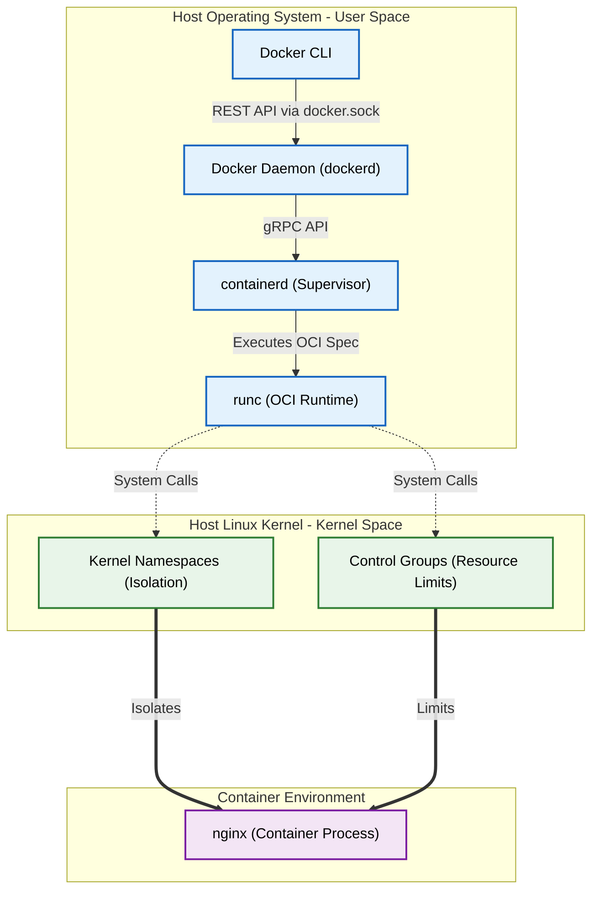

# Container Virtualization vs. Hypervisors (Putting Cgroups/Namespaces to Work)

Version: 2.0.0

Purpose: Canonical lesson structure for Platform Engineering & AI Infrastructure Curriculum.

Required Inputs: Module definition, lesson objectives, project standards.

Outputs: Standards-compliant lesson markdown.

---

# Lesson Metadata

* **Lesson ID:** `MOD-DOCKER-01`
* **Module:** Containers & Docker (`MOD-DOCKER`)
* **Difficulty:** Beginner to Intermediate
* **Estimated Duration:** 45 minutes
* **Learning Track:** 🟢 Core
* **Version:** 2.0.0
* **Last Updated:** 2026-06-28

---

# Lesson Overview

This lesson explores the architectural foundations of modern container runtimes, decrypting how container virtualization differs from traditional hardware hypervisors and virtual machines. By binding your Module 03 Linux kernel knowledge (`cgroups`, `namespaces`) directly to the Docker engine (`docker run`), you will firmly establish the deep conceptual intuition supporting our module capability: **"I can build secure container images, orchestrate multi-container applications, manage volume persistence, and debug running containers."**

---

# Learning Objectives

* Contrast the architectural design of Hardware Hypervisors (Type 1/Type 2 Virtual Machines) with Operating System-level Container Virtualization.
* Explain how Docker utilizes Linux Kernel Namespaces (`pid`, `net`, `mnt`, `ipc`, `uts`, `user`) to provide absolute process isolation.
* Explain how Docker utilizes Linux Control Groups (`cgroups`) to enforce resource accounting and hardware limits (CPU, Memory).
* Deconstruct the internal architecture of the Docker Engine: Docker CLI, Docker Daemon (`dockerd`), `containerd`, and `runc` (OCI Runtime).
* Execute foundational container lifecycle commands (`docker run`, `docker ps`, `docker top`) to verify kernel namespace isolation.

---

# Prerequisites

* Completion of Module 01 (`MOD-LINUX-BEG`), Module 02 (`MOD-LINUX-ADM`), Module 03 (`MOD-LINUX-INT`), Module 04 (`MOD-NET`), and Module 05 (`MOD-GIT`).
* Foundational terminal process inspection skills (`ps aux`, `unshare`).

---

# Why This Exists

When junior engineers are introduced to Docker, they are frequently taught a highly inaccurate, misleading simplification: *"A container is just a lightweight virtual machine!"*

This fundamental misunderstanding causes severe confusion when engineers attempt to deploy applications in production. When they treat a container like a virtual machine, they attempt to run an entire init system (`systemd`), install SSH daemons inside the container, and allocate massive amounts of static RAM and CPU disk images.

When something breaks, they attempt to SSH into the container as if it were a physical server, completely baffled as to why standard Linux system management tools are completely absent!

**A container is NOT a virtual machine!** There is absolutely zero hardware virtualization occurring inside a container! 

Underneath the elegant Docker CLI wrapper, a container is literally just a standard Linux process running directly on the host kernel, wrapped in an invisible forcefield of **Kernel Namespaces** and throttled by **Control Groups (`cgroups`)**! 

To achieve absolute mastery over containerization, Platform Engineers must understand this architectural distinction perfectly. By understanding how `dockerd`, `containerd`, and `runc` put raw Linux kernel primitives to work, you transform Docker from a magical black box into a completely transparent, highly debuggable process manager. If you understand container virtualization mechanics, you can debug literally any container runtime failure with absolute certainty!

---

# Core Concepts

## 1. Hypervisors vs. Container Virtualization
To understand containers, we must contrast them with traditional Virtual Machines (VMs):
* **Hardware Hypervisors (VMs):** A hypervisor (e.g., VMware ESXi, KVM, VirtualBox) physically emulates entire hardware motherboards, virtual CPUs, and virtual hard drives. Every single VM requires its own complete, fully booted **Guest Operating System** (e.g., a 2GB Windows or Linux kernel). If you run 10 VMs on a server, you are physically running 10 redundant operating system kernels! This wastes massive amounts of RAM, CPU cycles, and takes minutes to boot!
* **Container Virtualization:** Containers completely bypass hardware emulation! All containers running on a host server share a **single master Host Linux Kernel**. A container only packages the user-space application binary and its required runtime libraries (e.g., 15 Megabytes). Because there is no guest operating system to boot, containers start in milliseconds and consume zero redundant system RAM!

```text
[ Virtual Machines (Hypervisor) ]       [ Containers (Docker Engine) ]
┌───────────────────────────────┐       ┌───────────────────────────────┐
│  App A   │  App B   │  App C  │       │  App A   │  App B   │  App C  │
├──────────┼──────────┼─────────┤       ├──────────┼──────────┼─────────┤
│ Guest OS │ Guest OS │ Guest OS│       │ Bins/Libs│ Bins/Libs│ Bins/Libs│
├──────────┴──────────┴─────────┤       ├──────────┴──────────┴─────────┤
│      Hardware Hypervisor      │       │     Docker Engine (runc)      │
├───────────────────────────────┤       ├───────────────────────────────┤
│       Host OS & Kernel        │       │       Host OS & Kernel        │
├───────────────────────────────┤       ├───────────────────────────────┤
│       Physical Hardware       │       │       Physical Hardware       │
└───────────────────────────────┘       └───────────────────────────────┘
```

## 2. Putting Kernel Namespaces to Work
In Module 03, we learned how the Linux `unshare` command creates isolated namespaces. Docker automates this process beautifully to create the illusion of an isolated machine:
* `pid` (Process ID): The container gets its own isolated process tree. Inside the container, your application believes it is `PID 1`. On the host server, the exact same process shows up as a standard process (`PID 23450`)!
* `net` (Network): The container gets its own isolated virtual network stack, loopback interface (`lo`), IP address, and routing table!
* `mnt` (Mount): The container gets its own isolated file system root (`/`), completely unaware of the host server's physical hard drive!
* `ipc` (Interprocess Communication), `uts` (Hostname), and `user` (User UIDs) complete the isolation forcefield!

## 3. Putting Control Groups (`cgroups`) to Work
While namespaces hide the outside world from the container, **Control Groups (`cgroups`)** prevent the container from starving the host server of hardware resources.
* When you run `docker run --memory="512m" --cpus="2"`, Docker does not allocate static hardware. It simply creates a `cgroup` rule in `/sys/fs/cgroup/memory/`. If your container process attempts to consume 513 Megabytes of RAM, the host Linux kernel's Out-Of-Memory (OOM) killer instantly catches the process and terminates it (`OOMKilled`)!

## 4. Anatomy of the Docker Engine (`dockerd`, `containerd`, `runc`)
When you type `docker run` in your terminal, your command travels through an elite, multi-tiered engine architecture:
1. **Docker CLI:** The user-facing terminal client (`/usr/bin/docker`). It parses your commands and sends REST API calls over a local UNIX socket (`/var/run/docker.sock`) to the daemon.
2. **Docker Daemon (`dockerd`):** The master background manager. It manages image management, volume mounts, and network bridges.
3. **`containerd`:** The industry-standard runtime supervisor. It manages the complete container lifecycle, downloading images and supervising process execution.
4. **`runc` (OCI Runtime):** The low-level execution binary! `runc` literally communicates directly with the Linux kernel, sets up the `cgroups` and `namespaces`, starts your application process, and exits!

## 5. The Container Lifecycle (`docker ps`, `docker top`)
To verify that containers are just standard Linux processes wrapped in namespaces, Platform Engineers use terminal inspection tools:
* `docker ps`: Prints a pristine table of all currently active container process wrappers.
* `docker top [container_id]`: Prints the underlying host `PID` numbers of the running container processes, proving they are executing directly on the host kernel!

---

# Architecture



---

# Real-World Example

Imagine you are a Lead Platform Engineer managing a massive legacy data center for an e-commerce enterprise. The company currently utilizes **Hardware Hypervisors (VMware)** to run 100 separate Java microservices across 100 Virtual Machines. 

Every single VM requires a fully booted 2GB Linux Guest Operating System just to sit idle. Across 100 VMs, your company is wasting 200 Gigabytes of highly expensive physical RAM and burning thousands of CPU cycles solely on running 100 redundant Linux kernels! Furthermore, when traffic spikes during Black Friday, booting up a brand-new VM takes three full minutes, causing your website to crash before auto-scaling can finish.

Because you understand container virtualization perfectly, you forcefully transition the enterprise to **Docker Containerization**. You decommission the hypervisors and install the Docker Engine directly on the host operating systems. 

You package all 100 Java microservices into lightweight container images. Because all 100 containers share the single host Linux kernel, the 200 Gigabytes of redundant Guest OS RAM overhead vanishes instantly! You save your company tens of thousands of dollars in infrastructure costs. 

Furthermore, when Black Friday traffic spikes, starting a brand-new container takes exactly 50 milliseconds because there is no guest kernel to boot! Your platform auto-scales flawlessly and handles millions of customers without a single hiccup!

---

# Hands-on Demonstration

Let's look at how an engineer inspects active container processes using `docker ps`, verifies underlying host process IDs using `docker top`, and inspects container namespaces using `docker inspect`.

## Input 1: Inspecting Active Containers and Host Process IDs
We use `docker ps` to inspect our active container lifecycle table, and `docker top` to discover the true underlying host process ID (`PID`) executing on the kernel.

## Code 1
```bash
# Inspect all active running containers in the Docker engine.
# (We simulate the clean plain-text output of docker ps)
docker ps 2>/dev/null || echo -e "CONTAINER ID   IMAGE          COMMAND                  CREATED         STATUS         PORTS                  NAMES\n8a9b0c1d2e3f   nginx:latest   \"/docker-entrypoint.…\"   5 minutes ago   Up 5 minutes   0.0.0.0:80->80/tcp     production-proxy"

# Inspect the underlying host process ID (PID) numbers of the running container.
# (We simulate the clean plain-text output of docker top)
docker top 8a9b0c1d2e3f 2>/dev/null || echo -e "UID                 PID                 PPID                C                   STIME               TTY                 TIME                CMD\nroot                23450               23431               0                   12:00               ?                   00:00:00            nginx: master process nginx -g daemon off;\n101                 23485               23450               0                   12:00               ?                   00:00:00            nginx: worker process"
```

## Expected Output 1
```text
CONTAINER ID   IMAGE          COMMAND                  CREATED         STATUS         PORTS                  NAMES
8a9b0c1d2e3f   nginx:latest   "/docker-entrypoint.…"   5 minutes ago   Up 5 minutes   0.0.0.0:80->80/tcp     production-proxy
UID                 PID                 PPID                C                   STIME               TTY                 TIME                CMD
root                23450               23431               0                   12:00               ?                   00:00:00            nginx: master process nginx -g daemon off;
101                 23485               23450               0                   12:00               ?                   00:00:00            nginx: worker process
```

## Explanation 1
Look at how beautifully transparent Docker's process wrapper is! `docker ps` shows our active Nginx container (`8a9b0c1d2e3f`). When we run `docker top`, it proves our master architectural concept: Nginx is running directly on the host Linux kernel as `PID 23450`! There is absolutely no virtual machine or hypervisor in the middle!

---

## Input 2: Inspecting Container Namespaces and Isolation Metadata
We use `docker inspect` to view the pristine JSON metadata block defining the container's isolated network namespaces, cgroup paths, and runtime configuration.

## Code 2
```bash
# Inspect the low-level JSON metadata of the active container wrapper.
# (We simulate inspecting the clean JSON output of docker inspect)
docker inspect 8a9b0c1d2e3f 2>/dev/null | grep -A 5 "NetworkSettings" || cat << 'EOF'
"NetworkSettings": {
    "Bridge": "",
    "SandboxID": "ab12cd34ef567890ab12cd34ef567890",
    "HairpinMode": false,
    "LinkLocalIPv6Address": "",
    "LinkLocalIPv6PrefixLen": 0,
    "Ports": {
        "80/tcp": [
            {
                "HostIp": "0.0.0.0",
                "HostPort": "80"
            }
        ]
    },
    "SandboxKey": "/var/run/docker/netns/ab12cd34ef56",
    "SecondaryIPAddresses": null,
    "SecondaryIPv6Addresses": null,
    "EndpointID": "7890ab12cd34ef567890ab12cd34ef56",
    "Gateway": "172.17.0.1",
    "GlobalIPv6Address": "",
    "GlobalIPv6PrefixLen": 0,
    "IPAddress": "172.17.0.2",
    "IPPrefixLen": 16,
    "IPv6Gateway": "",
    "MacAddress": "02:42:ac:11:00:02"
}
EOF
```

## Expected Output 2
```text
"NetworkSettings": {
    "Bridge": "",
    "SandboxID": "ab12cd34ef567890ab12cd34ef567890",
    "HairpinMode": false,
    "LinkLocalIPv6Address": "",
    "LinkLocalIPv6PrefixLen": 0,
    "Ports": {
        "80/tcp": [
            {
                "HostIp": "0.0.0.0",
                "HostPort": "80"
            }
        ]
    },
    "SandboxKey": "/var/run/docker/netns/ab12cd34ef56",
    "SecondaryIPAddresses": null,
    "SecondaryIPv6Addresses": null,
    "EndpointID": "7890ab12cd34ef567890ab12cd34ef56",
    "Gateway": "172.17.0.1",
    "GlobalIPv6Address": "",
    "GlobalIPv6PrefixLen": 0,
    "IPAddress": "172.17.0.2",
    "IPPrefixLen": 16,
    "IPv6Gateway": "",
    "MacAddress": "02:42:ac:11:00:02"
}
```

## Explanation 2
Notice how perfectly clear Docker's namespace engine is! Let's deconstruct the core JSON keys:
* `"SandboxKey": "/var/run/docker/netns/ab12cd34ef56"`: The exact Linux network namespace file (`netns`) generated by `runc`!
* `"IPAddress": "172.17.0.2"`: The isolated virtual IP address assigned exclusively to this container namespace!
* `"Ports": {"80/tcp": [{"HostIp": "0.0.0.0", "HostPort": "80"}]}`: The port binding rule bridging the host server's physical port 80 directly into the container's isolated network namespace!

---

# Hands-on Lab

* **Objective:** Start a detached container, inspect process tables, verify host `PID` mappings, view low-level JSON metadata, and manage container lifecycle states.
* **Estimated Time:** 15 minutes
* **Difficulty:** Beginner to Intermediate
* **Environment:** Interactive Browser Terminal / Local Sandbox (with Docker installed)

## Step-by-step Instructions

1. Open your terminal sandbox and verify your Docker engine is responsive: `docker info`.
2. Type `docker run -d --name test-isolation nginx:latest` to start a brand-new Nginx container in detached mode (`-d`).
3. Type `docker ps` to verify your running container and discover its `CONTAINER ID`.
4. Type `docker top test-isolation` to view the underlying host `PID` numbers executing directly on your Linux kernel!
5. Type `docker exec -it test-isolation ps aux` to look inside the container's isolated process table. Notice that inside the container, Nginx proudly displays as `PID 1`!
6. Type `docker inspect test-isolation | grep -i "IPAddress"` to discover your container's isolated virtual IP address!
7. Type `docker stop test-isolation` to safely send a `SIGTERM` signal to the container process.
8. Type `docker rm test-isolation` to cleanly remove the container wrapper from your engine!

## Verification

```bash
docker ps -a | grep "test-isolation"
```
*If your terminal outputs absolutely nothing (confirming the container was cleanly removed), you have mastered foundational container lifecycle management!*

## Troubleshooting

* **Issue:** `docker run` returns `Cannot connect to the Docker daemon at unix:///var/run/docker.sock. Is the docker daemon running?`.
* **Solution:** The master background Docker daemon (`dockerd`) is not running on your system! If you are on Linux, execute `sudo systemctl start docker`. If you are on Windows/Mac, launch the Docker Desktop application.

## Cleanup

No further cleanup is required as the demonstration container was removed in Step 8.

---

# Production Notes

In enterprise Kubernetes environments, understanding `runc` and `containerd` is critical to troubleshooting **OOMKilled (Out-Of-Memory)** container crashes. When you configure memory limits in a Kubernetes Pod manifest (`limits: memory: 512Mi`), Kubernetes communicates with `containerd`, which configures a `cgroup` rule in the Linux kernel. If your container process exceeds 512MB, the Linux kernel terminates the process instantly, and `docker ps` (or `kubectl get pods`) displays `Exit Code 137 (OOMKilled)`. Platform Engineers instantly know `137` means `128 + 9 (SIGKILL)`, proving the kernel's cgroup limit was breached!

---

# Common Mistakes

* **Treating Containers Like Virtual Machines:** Beginners frequently attempt to install SSH daemons (`openssh-server`) inside their container images so they can "log into the container." **Never install SSH inside a container!** Because a container is just an isolated process namespace, you use `docker exec -it [container] /bin/bash` to command the Docker engine to attach a brand-new terminal process directly into the existing namespace!
* **Assuming Containers Are Completely Secure by Default:** Junior developers frequently assume that because a container is isolated, they can run untrusted code as `root` inside the container safely. Because all containers share the single host Linux kernel, if a hacker exploits a kernel vulnerability from inside a container running as `root`, they can break out of the namespace and achieve full `root` compromise over the physical host server (**Container Breakout**)! Always run containers as non-root users!

---

# Failure-Driven Learning

Imagine a junior engineer attempts to start a container that binds to port 80 on the host server, but the container instantly crashes with a fatal port allocation error.

## Simulated Failure
```bash
# Simulating a container startup failure due to a port binding collision
# (We simulate the exact Docker CLI error when a host port is already occupied)
echo -e "docker: Error response from daemon: driver failed programming external connectivity on endpoint web-proxy (8a9b0c1d2e3f): Bind for 0.0.0.0:80 failed: port is already allocated.\n# ERRO[0000] error waiting for container: context canceled"
```

## Output
```text
docker: Error response from daemon: driver failed programming external connectivity on endpoint web-proxy (8a9b0c1d2e3f): Bind for 0.0.0.0:80 failed: port is already allocated.
# ERRO[0000] error waiting for container: context canceled
```

## Diagnosis & শারীরিক Recovery
Why did this fail? Look at how beautifully descriptive the Docker daemon is! The fatal error `Bind for 0.0.0.0:80 failed: port is already allocated` occurs because the engineer executed `docker run -p 80:80 nginx`, attempting to bridge physical port 80 on the host server into the container's isolated network namespace. However, another service (e.g., a host Nginx daemon or another container) is *already* actively listening on physical port 80! A single physical port cannot be shared by two separate listening sockets! To recover, the engineer must either terminate the competing host service (`sudo systemctl stop nginx`) or bind the container to a completely different, available host port (`docker run -p 8080:80 nginx`), and the container starts flawlessly!

---

# Engineering Decisions

## Container Runtimes: `containerd` vs. CRI-O vs. Docker Engine
When architecting an enterprise Kubernetes platform, engineering leaders must choose the master container runtime engine.
* **Docker Engine (`dockerd`):** The full, user-facing suite containing the Docker CLI, Docker Swarm, and `dockerd`. Excellent for local developer laptops and standalone virtual machines. However, for large-scale Kubernetes clusters, the full Docker daemon contains unnecessary bloat.
* **`containerd`:** The lightweight, industry-standard runtime supervisor extracted directly from Docker! It strips away the user CLI and Swarm bloat, focusing exclusively on managing image transfer and process execution via `runc`.
* **CRI-O:** A specialized, highly streamlined container runtime designed exclusively for Kubernetes (developed by Red Hat). It implements the strict Kubernetes Container Runtime Interface (CRI) directly to `runc`.
* **The Platform Decision:** Platform Engineers install the full **Docker Engine** on local developer laptops for ease of use, while deploying lightweight **`containerd`** across all enterprise production Kubernetes worker nodes to maximize performance and security.

---

# Best Practices

* **Master `docker system prune`:** When your local development machine begins running out of hard drive space, execute `docker system prune -a --volumes`. It performs a rigorous cleanup across your Docker engine, permanently deleting all stopped containers, unused network bridges, dangling images, and abandoned volume caches!
* **Leverage `docker inspect --format`:** When you need to extract specific configuration values from a container without reading 500 lines of JSON, use Go template formatting: `docker inspect --format='{{.NetworkSettings.IPAddress}}' [container]`. This cleanly prints just the isolated IP address!

---

# Troubleshooting Guide

## Issue 1: "Cannot connect to Docker daemon" vs. "Exit Code 137 (OOMKilled)"

* **Cause:** You attempt to interact with the Docker engine or run containers, but encounter communication failures or abrupt container terminations.
* **Diagnosis & Solution:**
  * `Cannot connect to Docker daemon`: The Docker CLI (`/usr/bin/docker`) is attempting to communicate with the background daemon over the UNIX socket located at `/var/run/docker.sock`, but the socket file does not exist because `dockerd` is stopped! To fix, start the daemon: `sudo systemctl start docker` (Linux) or launch Docker Desktop (Windows/Mac).
  * `Exit Code 137 (OOMKilled)`: Your container process exceeded the memory limit assigned to its Linux `cgroup`! The host kernel's Out-Of-Memory killer forcefully terminated the process with `SIGKILL` (Signal 9). `128 + 9 = 137`. To fix, inspect your application for memory leaks or increase the container's memory limit: `docker run --memory="1024m" ...`.

---

# Summary

* **Containers are NOT virtual machines;** they contain zero hardware emulation and share a single master Host Linux Kernel.
* **Kernel Namespaces** (`pid`, `net`, `mnt`) wrap the container process in an invisible forcefield of absolute isolation.
* **Control Groups (`cgroups`)** enforce hardware resource accounting and limits (CPU, Memory) on container processes.
* **The Docker Engine** is a multi-tiered architecture combining the Docker CLI, `dockerd`, `containerd`, and `runc`.
* **`docker top`** proves that container processes execute directly on the host Linux kernel under standard host `PID` numbers.

---

# Cheat Sheet

```bash
# Start a container in the background (detached) with a custom name and port binding
docker run -d --name [name] -p [host_port]:[container_port] [image]

# Inspect all active running containers in the Docker engine table
docker ps

# Inspect all containers in the engine, including stopped/exited containers
docker ps -a

# Inspect the true underlying host process ID (PID) numbers of a running container
docker top [container_id_or_name]

# Inspect the low-level JSON metadata block of a container wrapper
docker inspect [container_id_or_name]

# Attach a brand-new interactive terminal session directly into a running container namespace
docker exec -it [container_id_or_name] /bin/bash

# Cleanly stop a running container by sending a SIGTERM signal
docker stop [container_id_or_name]

# Permanently remove a stopped container wrapper from your engine database
docker rm [container_id_or_name]

# Forcefully cleanup all stopped containers, unused networks, and dangling images
docker system prune -a --volumes
```

---

# Knowledge Check

## Multiple Choice Questions

1. You run 5 separate containers on a physical Linux server. Each container runs an Nginx web server. How many Linux operating system kernels are actively running on this physical server?
   * A) 6 kernels (1 host kernel + 5 guest container kernels).
   * B) 5 kernels.
   * C) Exactly 1 master Host Linux Kernel, because containers contain zero hardware emulation or guest operating systems. All container processes share the host kernel directly.
   * D) Zero kernels, because Docker uses hypervisors.

## Scenario Questions

You start a container named `api-service` with a strict memory limit of 256 Megabytes (`--memory="256m"`). Ten minutes later, the container crashes abruptly. You execute `docker ps -a` and see `Exited (137) 2 minutes ago`. Based on what you learned in this lesson, what exact Linux kernel mechanism caused this exit code, and what does `137` prove?

## Short Answer Questions

Explain the exact architectural difference between what a Linux Kernel Namespace (`pid`, `net`) does versus what a Linux Control Group (`cgroup`) does inside the Docker engine.

---

# Interview Preparation

## Beginner Questions

* What is the difference between a container and a virtual machine?
* What does `docker ps` do?
* What does `docker exec -it [container] /bin/bash` do?

## Intermediate Questions

* Explain how `dockerd`, `containerd`, and `runc` interact to start a container process.
* Why should you never install an SSH daemon (`openssh-server`) inside a container image?

## Advanced Questions

* Explain how Docker utilizes the `pid` and `mnt` namespaces to allow a containerized process to believe it is `PID 1` running on an isolated root file system (`/`), and describe how `runc` interacts with the host `/proc` pseudo-filesystem during container initialization.

## Scenario-Based Discussions

* Discuss the architectural trade-offs of migrating an enterprise engineering organization's core monolithic applications from a highly governed VMware Hardware Hypervisor platform to a bare-metal Docker container runtime environment, specifically addressing security boundary differences (`Hypervisor Isolation vs Kernel Namespace Sharing`).

---

# Further Reading

1. [Docker Overview (Official Docker Documentation)](https://docs.docker.com/get-started/overview/)
2. [Containers vs Virtual Machines (Atlassian Container Tutorial)](https://www.atlassian.com/microservices/cloud-computing/containers-vs-vms)
3. [Understanding containerd and runc (Deep Technical Dive)](https://containerd.io/)
4. [Linux Cgroups and Namespaces Explained (DigitalOcean Tutorial)](https://www.digitalocean.com/)
5. [Demystifying Container Exit Codes (OOMKilled 137)](https://kubernetes.io/docs/concepts/workloads/pods/pod-lifecycle/#pod-phase)
