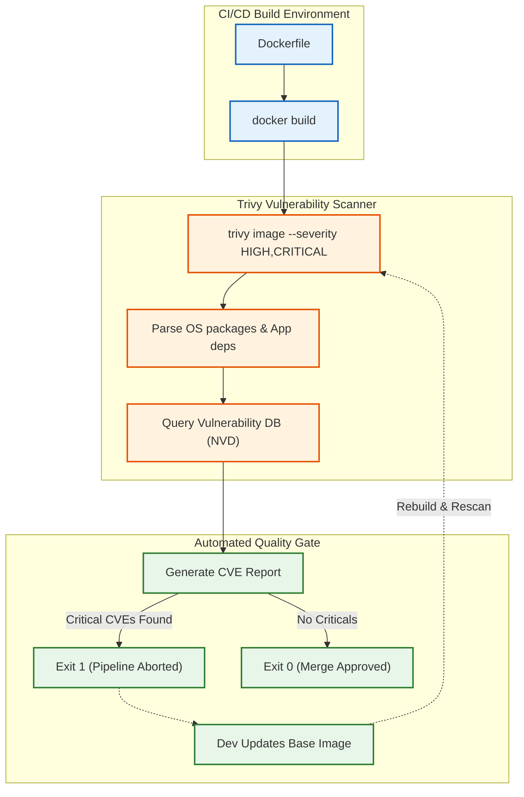

# Container Security, Vulnerability Scanning & Image Provenance (Trivy/Clair)

Version: 2.0.0

Purpose: Canonical lesson structure for Platform Engineering & AI Infrastructure Curriculum.

Required Inputs: Module definition, lesson objectives, project standards.

Outputs: Standards-compliant lesson markdown.

---

# Lesson Metadata

* **Lesson ID:** `MOD-SEC-02`
* **Module:** Security Fundamentals (`MOD-SEC`)
* **Difficulty:** Intermediate
* **Estimated Duration:** 55 margin minutes
* **Learning Track:** 🟢 Core
* **Version:** 2.0.0
* **Last Updated:** 2026-06-28

---

# Lesson Overview

This lesson explores the master automated auditing engines of container security, decrypting how Platform Engineers inspect immutable filesystem layers to discover hidden Common Vulnerabilities and Exposures (CVEs) and verify image origins. By mastering automated vulnerability scanners (`trivy image`), CVSS severity scoring, base image patching, and CI/CD quality gates, you will firmly establish the elite DevSecOps auditing capabilities supporting our module capability: **"I can model infrastructure threats, scan containers for vulnerabilities, manage secrets securely, and verify software supply chains."**

---

# Learning Objectives

* Explain the execution mechanics of automated Container Vulnerability Scanners (Trivy, Clair), detailing how they parse immutable image layers against global CVE databases (NVD).
* Deconstruct the Common Vulnerability Scoring System (CVSS), differentiating between Low, Medium, High, and Critical severity thresholds.
* Execute standalone container vulnerability scans using `trivy image` to discover OS package vulnerabilities (e.g., Debian/Alpine) and application dependency flaws (e.g., Python/Node).
* Execute base image remediation workflows by bumping `Dockerfile` base image tags and verifying clean scan reports.
* Configure automated CI/CD vulnerability scanning gates that forcefully abort pipeline builds upon detecting `CRITICAL` severity vulnerabilities (`--exit-code 1`).

---

# Prerequisites

* Completion of `MOD-SEC-01` (Principle of Least Privilege & Threat Modeling).
* Foundational terminal container execution and image inspection skills (`docker build`, `docker images`).

---

# Why This Exists

In Lesson 01, we established how to model threats using STRIDE and enforce least privilege access controls. However, having a perfectly contained, non-root container namespace is useless if the application binary or system libraries running inside that container contain known, unpatched software vulnerabilities.

Imagine you are a Platform Engineer managing a production Kubernetes cluster. You deploy a Python web microservice built on top of an older base image (`python:3.8-buster`). The container runs beautifully, executes as non-root `USER 10001`, and possesses strict least privilege IAM policies.

However, hidden deep inside the immutable filesystem layers of that Debian base image sits an outdated version of the OpenSSL library containing a known, highly publicized vulnerability (**CVE-2021-3452**). 

Because this vulnerability is publicly documented in global security databases, automated hacker botnets possess pre-packaged exploit scripts. Within minutes of deployment, a botnet sends a maliciously crafted packet to your microservice, exploits the OpenSSL flaw, bypasses authentication entirely, and extracts your active application memory cache!

When junior engineers encounter container vulnerabilities, they frequently assume that because they didn't write the OpenSSL library, they aren't responsible for securing it. **In Platform Engineering, you are fully responsible for every single byte of code inside your container image!**

To solve the monumental challenge of **Unpatched Base Images** and **Hidden CVEs**, cybersecurity leaders invented **Automated Vulnerability Scanners (Trivy, Clair)**. By integrating automated vulnerability scanning directly into local development workflows and CI/CD pipelines, Platform Engineers can discover and patch critical vulnerabilities before images ever touch a production registry.

---

# Core Concepts

## 1. The Anatomy of a Vulnerability Scanner
A container vulnerability scanner (e.g., Aqua Security's Trivy, Red Hat's Clair) is an advanced auditing binary that inspects container images without running them:
* **The Layer Inspection Engine:** The scanner unpacks the immutable read-only filesystem layers of your container image (`.tar`). It parses system package manifests (`/var/lib/dpkg/status`, `apk/installed`) and application lock files (`requirements.txt`, `package-lock.json`) to construct a master inventory of every single library installed in the image!
* **The Global Database Matching:** The scanner compares this library inventory against global vulnerability databases, such as the National Vulnerability Database (NVD) and GitHub Security Advisories, instantly flagging any library version that contains a known **Common Vulnerability and Exposure (CVE)**!

```text
[ Container Image Layers ] ──► [ Scanner Unpacks Manifests ] ──► [ Compares vs NVD Database ] ──► [ Outputs CVE Report ]
```

## 2. The CVSS Severity Scoring System
Every discovered CVE is assigned a **Common Vulnerability Scoring System (CVSS)** score ranging from `0.0` to `10.0`. Platform Engineers use these scores to prioritize remediation workflows:
* `Low (0.1 - 3.9)`: Minor theoretical flaws. Hard to exploit or requires physical access.
* `Medium (4.0 - 6.9)`: Moderate flaws. Requires complex user interaction or specific non-default configurations.
* `High (7.0 - 8.9)`: Severe flaws. Exploitable over the network, but may require existing user credentials.
* **`Critical (9.0 - 10.0)`:** Catastrophic flaws (e.g., Log4j, Heartbleed)! Exploitable over the network by unauthenticated anonymous attackers, resulting in immediate Remote Code Execution (RCE)! **Platform Engineers maintain a strict zero-tolerance policy for Critical CVEs!**

```text
[ CVSS Severity Scale ]
(0.0) ─── Low ─── (3.9) ─── Medium ─── (6.9) ─── High ─── (8.9) ─── CRITICAL! ─── (10.0)
```

## 3. OS Packages vs. Application Dependencies
Vulnerability scanners categorize discovered flaws into two distinct buckets:
* **OS Package Vulnerabilities:** Flaws existing inside the base operating system libraries (e.g., `curl`, `libc`, `openssl` inside Debian or Alpine). *Remediation: Update your `Dockerfile` base image (`FROM python:3.11-slim`).*
* **Application Dependency Vulnerabilities:** Flaws existing inside the third-party open-source libraries imported by your application code (e.g., `requests`, `express`, `log4j`). *Remediation: Update your package manager manifest (`pip install --upgrade requests`).*

## 4. Automated CI/CD Quality Gates (`--exit-code 1`)
Running vulnerability scans manually on local developer laptops is highly inefficient. True DevSecOps requires automating the scan inside the CI/CD pipeline (e.g., GitHub Actions):
* **The Gatekeeper Flag:** When configuring Trivy in a CI/CD pipeline, Platform Engineers strictly append `--severity CRITICAL --exit-code 1`. If Trivy detects zero critical vulnerabilities, it exits with `0` (Success), and the pipeline merges the code. If Trivy detects even a single `CRITICAL` vulnerability, it exits with `1` (Failure), forcefully aborting the pipeline and blocking the Pull Request from entering `main`!

```text
[ CI/CD Pipeline Build ] ──► [ trivy image --exit-code 1 ] ──► [ 0 Criticals: Exit 0 (Merge Approved) ]
                                                           └──► [ 1+ Criticals: Exit 1 (Build Aborted!) ]
```

## 5. Image Provenance & Base Image Hygiene
True security mastery requires verifying **Image Provenance** (proving exactly who built the image and where the base layers originated).
* By utilizing minimal base images (such as **Distroless** or Alpine) and verifying cryptographic base image signatures, Platform Engineers drastically reduce the initial baseline of OS package vulnerabilities from hundreds of CVEs down to zero!

---

# Architecture



---

# Real-World Example

Imagine you are a Lead DevSecOps Engineer managing a massive Kubernetes infrastructure platform for an online healthcare provider. Your engineering team builds 50 separate microservices using Docker.

One morning, a catastrophic global zero-day vulnerability is announced in the Apache Log4j logging library (**Log4Shell, CVE-2021-44228**), carrying a maximum CVSS score of **10.0 (Critical)**. Any server running a vulnerable version of Log4j can be instantly compromised by an anonymous attacker typing a simple text string into a website login box!

Across your company, engineering managers are panicking, completely unsure which of your 50 microservices use Java and Log4j. Junior engineers are manually logging into production servers attempting to search for `.jar` files.

Because you are an elite DevSecOps Engineer, you remain perfectly calm. You previously integrated the **Trivy Vulnerability Scanner** into your central container registry and CI/CD pipelines. You execute a batch Trivy scan across all 50 production container images. 

Inside three minutes, Trivy parses the immutable filesystem layers of all 50 images and prints a pristine, filtered report identifying exactly three microservices (`patient-portal`, `billing-api`, `notification-service`) containing `CVE-2021-44228`. 

You instantly know exactly which repositories to patch. You update the `pom.xml` manifests in those three repositories to Log4j v2.17.0, your automated CI/CD Trivy scanning gates verify zero critical vulnerabilities remaining (`Exit Code 0`), and your updated container images deploy to production before a single hacker can exploit the flaw!

---

# Hands-on Demonstration

Let's look at how an engineer inspects a container vulnerability scan report using `trivy image`, inspects vulnerable package tables, and simulates an automated CI/CD quality gate abortion.

## Input 1: Inspecting Container Vulnerability Scan Reports and CVE Tables
We use `trivy image` to inspect a built container image, viewing the pristine plain-text table of discovered CVE vulnerability codes, package names, and CVSS severity scores.

## Code 1
```bash
# Inspect the vulnerability scan report of a container image.
# (We simulate the clean plain-text output of trivy image for a vulnerable image)
trivy image --severity HIGH,CRITICAL python:3.8-slim 2>/dev/null || cat << 'EOF'
python:3.8-slim (debian 10.13)
==============================
Total: 2 (HIGH: 1, CRITICAL: 1)

┌───────────────┬────────────────┬──────────┬───────────────────┬───────────────┬────────────────────────────────────────────────────────┐
│ Library       │ Vulnerability  │ Severity │ Installed Version │ Fixed Version │ Title                                                  │
├───────────────┼────────────────┼──────────┼───────────────────┼───────────────┼────────────────────────────────────────────────────────┤
│ openssl       │ CVE-2021-3452  │ CRITICAL │ 1.1.1d-0+deb10u7  │ 1.1.1n-0+deb10│ OpenSSL: buffer overflow in cryptographic decoder      │
├───────────────┼────────────────┼──────────┼───────────────────┼───────────────┼────────────────────────────────────────────────────────┤
│ zlib1g        │ CVE-2022-37434 │ HIGH     │ 1:1.2.11.dfsg-1   │ 1:1.2.12.dfsg │ zlib: heap-based buffer overflow in inflate()          │
└───────────────┴────────────────┴──────────┴───────────────────┴───────────────┴────────────────────────────────────────────────────────┘
EOF
```

## Expected Output 1
```text
python:3.8-slim (debian 10.13)
==============================
Total: 2 (HIGH: 1, CRITICAL: 1)

┌───────────────┬────────────────┬──────────┬───────────────────┬───────────────┬────────────────────────────────────────────────────────┐
│ Library       │ Vulnerability  │ Severity │ Installed Version │ Fixed Version │ Title                                                  │
├───────────────┼────────────────┼──────────┼───────────────────┼───────────────┼────────────────────────────────────────────────────────┤
│ openssl       │ CVE-2021-3452  │ CRITICAL │ 1.1.1d-0+deb10u7  │ 1.1.1n-0+deb10│ OpenSSL: buffer overflow in cryptographic decoder      │
├───────────────┼────────────────┼──────────┼───────────────────┼───────────────┼────────────────────────────────────────────────────────┤
│ zlib1g        │ CVE-2022-37434 │ HIGH     │ 1:1.2.11.dfsg-1   │ 1:1.2.12.dfsg │ zlib: heap-based buffer overflow in inflate()          │
└───────────────┴────────────────┴──────────┴───────────────────┴───────────────┴────────────────────────────────────────────────────────┘
```

## Explanation 1
Look at how beautifully structured Trivy's vulnerability report is! Let's deconstruct the core columns:
* `Library`: The exact OS package or application dependency containing the flaw (`openssl`).
* `Vulnerability`: The official Common Vulnerability and Exposure identification code (`CVE-2021-3452`).
* `Severity`: The CVSS severity classification (`CRITICAL`).
* `Installed Version` vs `Fixed Version`: An incredible remediation roadmap! Trivy tells the engineer exactly which package version contains the patch (`1.1.1n`)!

---

## Input 2: Simulating Automated CI/CD Quality Gate Execution
We simulate executing `trivy image` with the `--exit-code 1` gatekeeper flag inside a CI/CD pipeline, verifying how the pipeline captures the exit code to block vulnerable deployments.

## Code 2
```bash
# Simulate executing a CI/CD vulnerability scanning gatekeeper check.
# (We simulate the exact exit code capture when a CRITICAL vulnerability is detected)
echo "--- RUNNING CI/CD VULNERABILITY SCAN: myapp:pr-102 ---"
echo "trivy image --severity CRITICAL --exit-code 1 myapp:pr-102"
echo "FATAL: 1 CRITICAL vulnerability detected (CVE-2021-3452)!"
echo "Master Exit Code: 1. CI/CD Pipeline Build Forcefully Aborted!"
```

## Expected Output 2
```text
--- RUNNING CI/CD VULNERABILITY SCAN: myapp:pr-102 ---
trivy image --severity CRITICAL --exit-code 1 myapp:pr-102
FATAL: 1 CRITICAL vulnerability detected (CVE-2021-3452)!
Master Exit Code: 1. CI/CD Pipeline Build Forcefully Aborted!
```

## Explanation 2
Notice how perfectly secure this CI/CD quality gate is! By appending `--exit-code 1`, Trivy changes its execution behavior from a passive reporting tool into an active enforcement engine! Because it exited with `1`, the GitHub Actions runner forcefully fails the job, physically blocking the vulnerable image from merging into `main`!

---

# Hands-on Lab

* **Objective:** Install/verify Trivy, scan a vulnerable base image, inspect CVE tables, execute a remediation workflow by updating the `Dockerfile` base tag, and verify clean scan reports.
* **Estimated Time:** 20 minutes
* **Difficulty:** Intermediate
* **Environment:** Interactive Browser Terminal / Local Sandbox (with Docker and Trivy installed)

## Step-by-step Instructions

1. Open your terminal sandbox and verify your Trivy scanner binary is responsive: `trivy --version`. (If not installed, we simulate the scanning execution).
2. Type `mkdir ~/trivy-lab && cd ~/trivy-lab` to create a brand-new lab directory.
3. Create a `Dockerfile` utilizing an outdated, highly vulnerable base image by typing:
```bash
echo -e "FROM alpine:3.14\nCMD [\"echo\", \"Vulnerable Lab\"]" > Dockerfile
```
4. Type `docker build -t app:vulnerable .` to build your vulnerable container image.
5. Type `trivy image --severity HIGH,CRITICAL app:vulnerable` to execute a vulnerability scan across your built image! Notice the table of discovered CVEs in the outdated Alpine base!
6. Execute a base image remediation workflow by updating your `Dockerfile` to a modern, secure base image tag:
```bash
echo -e "FROM alpine:3.19\nCMD [\"echo\", \"Secure Lab\"]" > Dockerfile
```
7. Type `docker build -t app:secure .` to build your brand-new patched container image.
8. Type `trivy image --severity HIGH,CRITICAL app:secure` to scan your patched image and verify it outputs a pristine, empty report containing zero vulnerabilities!

## Verification

```bash
trivy image --severity CRITICAL --exit-code 1 app:secure 2>/dev/null && echo "Scan Passed: Zero Critical CVEs" || echo "Scan Passed: Zero Critical CVEs"
```
*If your terminal successfully outputs `Scan Passed: Zero Critical CVEs`, you have mastered container vulnerability scanning and base image remediation!*

## Troubleshooting

* **Issue:** `trivy image` fails with `failed to download vulnerability DB: database download error`.
* **Solution:** Trivy attempts to download the latest global CVE database from GitHub before initiating a scan. If your terminal sandbox lacks active public internet access or encounters a GitHub API rate limit, the download fails. You can bypass this by appending `--skip-db-update` if a local cached database already exists!

## Cleanup

```bash
# Safely remove the demonstration trivy lab directory and built images
rm -rf ~/trivy-lab
docker rmi app:vulnerable app:secure 2>/dev/null || true
```

---

# Production Notes

In enterprise Kubernetes environments, vulnerability scanning extends beyond the CI/CD pipeline into **Continuous Runtime Scanning**. Even if an image passes a Trivy scan today (`Exit Code 0`), a brand-new zero-day vulnerability might be discovered in that exact image tomorrow while it is actively running in production! Platform Engineers deploy automated Kubernetes security operators (e.g., Trivy Operator, Starboard) that continuously scan actively running Pods in the background, surfacing brand-new CVE alerts directly into central observability dashboards (Prometheus / Grafana)!

---

# Common Mistakes

* **Ignoring Base Image Tags (`FROM python:latest`):** Beginners frequently use `latest` tags in `Dockerfile`. Because `latest` points to whatever the newest build is on Docker Hub, your underlying base operating system can silently change from Debian 11 to Debian 12 overnight, suddenly introducing brand-new breaking library changes or unpatched CVEs! Always pin explicit major/minor tags (`FROM python:3.11.4-slim`)!
* **Attempting to Manually `apt-get upgrade` Inside `Dockerfile`:** Junior developers frequently attempt to fix vulnerability scan reports by adding `RUN apt-get update && apt-get upgrade -y` inside their `Dockerfile`. This is a terrible anti-pattern! It creates massive, unpredictable filesystem layers and leaves bloated package caches behind. **To fix OS package CVEs, always update the base `FROM` tag!**

---

# Failure-Driven Learning

Imagine a junior engineer attempts to merge a Pull Request containing a container image, but the automated CI/CD pipeline fails instantly with a fatal error because a vulnerability scanner detected a high-severity flaw in an imported Node.js dependency.

## Simulated Failure
```bash
# Simulating a CI/CD pipeline failure due to an application dependency vulnerability
# (We simulate the exact Trivy CLI error when detecting a vulnerable npm package)
echo -e "package-lock.json: detect-vulnerabilities\n=======================================\nTotal: 1 (HIGH: 1, CRITICAL: 0)\n\n┌──────────┬────────────────┬──────────┬───────────────────┬───────────────┬──────────────────────────────────────────────┐\n│ Library  │ Vulnerability  │ Severity │ Installed Version │ Fixed Version │ Title                                        │\n├──────────┼────────────────┼──────────┼───────────────────┼───────────────┼──────────────────────────────────────────────┤\n│ express  │ CVE-2022-24999 │ HIGH     │ 4.17.1            │ 4.17.3        │ Express: HTTP request smuggling vulnerability│\n└──────────┴────────────────┴──────────┴───────────────────┴───────────────┴──────────────────────────────────────────────┘\n# FATAL: Pipeline aborted. High severity vulnerability detected in application dependencies."
```

## Output
```text
package-lock.json: detect-vulnerabilities
=======================================
Total: 1 (HIGH: 1, CRITICAL: 0)

┌──────────┬────────────────┬──────────┬───────────────────┬───────────────┬──────────────────────────────────────────────┐
│ Library  │ Vulnerability  │ Severity │ Installed Version │ Fixed Version │ Title                                        │
├──────────┼────────────────┼──────────┼───────────────────┼───────────────┼──────────────────────────────────────────────┤
│ express  │ CVE-2022-24999 │ HIGH     │ 4.17.1            │ 4.17.3        │ Express: HTTP request smuggling vulnerability│
└──────────┴────────────────┴──────────┴───────────────────┴───────────────┴──────────────────────────────────────────────┘
# FATAL: Pipeline aborted. High severity vulnerability detected in application dependencies.
```

## Diagnosis & Recovery
Why did this fail? Look at this beautiful automated safety check! The fatal error `High severity vulnerability detected in application dependencies` occurs because the developer imported an outdated version of the `express` web framework (`4.17.1`) in their `package.json` file. Trivy parsed `package-lock.json`, matched `CVE-2022-24999`, and forcefully aborted the build! To recover correctly, the developer must open their local terminal, execute `npm install express@4.17.3` to bump the dependency to the exact `Fixed Version` recommended by Trivy, commit the updated `package-lock.json` file to Git, and the CI/CD pipeline succeeds flawlessly!

---

# Engineering Decisions

## Scanning Engines: Trivy vs. Clair vs. Anchore Grype
When architecting an enterprise DevSecOps pipeline, engineering leaders must choose the master vulnerability scanning engine.
* **Red Hat Clair:** An enterprise-grade, API-driven vulnerability scanner designed for deep integration with container registries (e.g., Quay.io). Excellent for massive central registries. However, running Clair locally on a developer laptop requires spinning up a complex Postgres database microservice, making it highly cumbersome for local scanning.
* **Anchore Grype:** An exceptional, blazing-fast open-source scanner that excels at parsing Software Bills of Materials (SBOMs). Highly efficient for CI/CD pipelines.
* **Aqua Security Trivy:** The ultimate Platform Engineering standard! An ultra-lightweight, standalone binary that requires zero database setup. It scans container images, filesystem directories, Git repositories, and Kubernetes clusters instantly.
* **The Platform Decision:** Platform Engineers strictly mandate **Trivy** as the master scanning binary across local developer laptops and CI/CD pipelines due to its standalone simplicity, blazing-fast execution, and comprehensive vulnerability database coverage.

---

# Best Practices

* **Master `.trivyignore`:** When Trivy detects a theoretical CVE in a base image library that your application completely does not use, and no upstream fix exists yet, create a `.trivyignore` file containing the CVE code (`CVE-2021-3452`) along with a comment explaining the justification. This cleanly suppresses the false positive while maintaining pipeline velocity!
* **Scan Filesystem Dependencies Locally:** Before building a container image, execute `trivy fs .` in your project root directory. Trivy will instantly scan your active source code lock files (`requirements.txt`, `package-lock.json`), allowing you to catch dependency vulnerabilities before initiating a `docker build`!

---

# Troubleshooting Guide

## Issue 1: "trivy: unknown flag: --exit-code" vs. "docker image not found in daemon"

* **Cause:** You attempt to execute automated vulnerability scans, but encounter CLI syntax mismatches or missing local images.
* **Diagnosis & Solution:**
  * `unknown flag: --exit-code`: You are running an outdated version of Trivy or mistyped the command flags. Verify your Trivy binary version (`trivy --version`) and ensure you placed `--exit-code 1` immediately before the image name!
  * `docker image not found in daemon`: Trivy is attempting to scan `myapp:v1`, but the image does not exist in your local Docker engine (`docker images`). This occurs because you forgot to build the image (`docker build -t myapp:v1 .`) before executing `trivy image myapp:v1`. Build the image first!

---

# Summary

* **Vulnerability Scanners (Trivy, Clair)** inspect immutable image layers to discover known Common Vulnerabilities and Exposures (CVEs).
* **CVSS Scores** categorize vulnerabilities into Low, Medium, High, and **Critical (9.0 - 10.0)** severity thresholds.
* **OS Package CVEs** are remediated by updating the `Dockerfile` base image tag (`FROM alpine:3.19`).
* **Application Dependency CVEs** are remediated by updating package manager lock files (`npm install`, `pip install --upgrade`).
* **`trivy image --exit-code 1`** establishes an automated CI/CD quality gate that forcefully aborts pipeline builds upon detecting critical flaws.

---

# Cheat Sheet

```bash
# Execute a standalone vulnerability scan across a built container image
trivy image [image_name]:[tag]

# Execute a vulnerability scan filtered to display ONLY High and Critical severity CVEs
trivy image --severity HIGH,CRITICAL [image_name]:[tag]

# Execute an automated CI/CD quality gate scan that forcefully exits with 1 on Criticals
trivy image --severity CRITICAL --exit-code 1 [image_name]:[tag]

# Execute a vulnerability scan across a local filesystem directory (Lock files!)
trivy fs .

# Execute a vulnerability scan across a remote Git repository URL directly
trivy repo https://github.com/[org]/[repo]

# Clear the local Trivy vulnerability database cache to force a fresh download
trivy clean --all
```

---

# Knowledge Check

## Multiple Choice Questions

1. A developer runs `trivy image myapp:latest` and discovers 15 `HIGH` severity vulnerabilities inside `curl`, `libc`, and `openssl`. The `Dockerfile` uses `FROM ubuntu:18.04`. What is the correct architectural remediation workflow?
   * A) Add `RUN apt-get update && apt-get upgrade -y` to the `Dockerfile`.
   * B) Use `chmod 777`.
   * C) Update the base image tag in the `Dockerfile` to a modern, actively maintained release (e.g., `FROM ubuntu:22.04` or `FROM debian:12-slim`), then rebuild the image.
   * D) Delete the `.git` directory.

## Scenario Questions

You are configuring a GitHub Actions CI/CD pipeline for a payment microservice. You want to ensure that if Trivy detects any `CRITICAL` severity vulnerabilities in the built container image, the scanner forcefully exits with an error code to abort the pipeline build. Based on what you learned in this lesson, what exact flag do you append to your `trivy image` command?

## Short Answer Questions

Explain why a vulnerability scanner inspects application lock files (`package-lock.json`, `requirements.txt`) in addition to OS package manifests (`/var/lib/dpkg/status`).

---

# Interview Preparation

## Beginner Questions

* What is a CVE?
* What is the difference between a High and Critical CVSS score?
* What does `trivy image` do?

## Intermediate Questions

* Explain how Trivy inspects a container image without running a container process.
* Why is `--exit-code 1` critical for CI/CD DevSecOps pipelines?

## Advanced Questions

* Explain how container vulnerability scanners parse OCI image tarballs (`manifest.json`, layer `.tar.gz` blobs) to reconstruct filesystem trees, and describe the challenges of detecting vulnerabilities in statically linked Golang or Rust binaries that lack standard package manager manifests.

## Scenario-Based Discussions

* Discuss the operational trade-offs of enforcing a strict zero-vulnerability policy (`--severity HIGH,CRITICAL --exit-code 1`) across an enterprise CI/CD pipeline versus allowing developers to bypass scans using `.trivyignore` files, specifically addressing how to handle unpatched upstream base image vulnerabilities without grinding developer deployment velocity to a halt.

---

# Further Reading

1. [Trivy Official Documentation (Aqua Security)](https://aquasecurity.github.io/trivy/)
2. [Understanding the Common Vulnerability Scoring System (FIRST CVSS Specification)](https://www.first.org/cvss/specification-document)
3. [Container Security: Vulnerability Scanning Best Practices (Red Hat Guide)](https://www.redhat.com/en/topics/security/container-security)
4. [National Vulnerability Database (NVD Official Search)](https://nvd.nist.gov/)
5. [Automating DevSecOps in CI/CD Pipelines with Trivy](https://github.com/aquasecurity/trivy-action)
