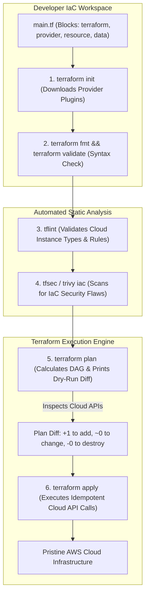

# Declarative Infrastructure Paradigms & HCL Syntax

Version: 2.0.0

Purpose: Canonical lesson structure for Platform Engineering & AI Infrastructure Curriculum.

Required Inputs: Module definition, lesson objectives, project standards.

Outputs: Standards-compliant lesson markdown.

---

# Lesson Metadata

* **Lesson ID:** `MOD-TF-01`
* **Module:** Infrastructure as Code (Terraform) (`MOD-TF`)
* **Difficulty:** Beginner to Intermediate
* **Estimated Duration:** 45 minutes
* **Learning Track:** 🟢 Core
* **Version:** 2.0.0
* **Last Updated:** 2026-06-28

---

# Lesson Overview

This lesson explores the master declarative provisioning philosophies of modern cloud architecture, decrypting how Platform Engineers replace fragile manual web console clicking (ClickOps) with version-controlled, immutable code using HashiCorp Terraform. By mastering the HashiCorp Configuration Language (HCL), resource declaration blocks (`resource`, `data`), dependency graphs, and core lifecycle CLI commands (`terraform init`, `plan`, `apply`), you will firmly establish the deep conceptual intuition supporting our module capability: **"I can author declarative HCL infrastructure manifests, manage state locking with remote backends, architect reusable modules, and refactor existing cloud resources."**

---

# Learning Objectives

* Contrast the architectural design of Imperative execution (ClickOps / CLI scripts) with Declarative Infrastructure as Code (IaC) paradigms.
* Deconstruct the anatomy of HashiCorp Configuration Language (HCL) syntax, detailing top-level blocks: `terraform`, `provider`, `resource`, `data`, `variable`, and `output`.
* Explain how Terraform constructs a Directed Acyclic Graph (DAG) to determine implicit vs. explicit resource dependency ordering (`depends_on`).
* Execute the foundational Terraform CLI lifecycle workflows: `terraform init`, `terraform fmt`, `terraform validate`, `terraform plan`, and `terraform apply`.
* Enforce infrastructure code quality and security best practices using automated static analysis tooling (`tflint`, `tfsec`).

---

# Prerequisites

* Completion of Module 01 (`MOD-LINUX-BEG`), Module 02 (`MOD-LINUX-ADM`), Module 03 (`MOD-LINUX-INT`), Module 04 (`MOD-NET`), Module 05 (`MOD-GIT`), Module 06 (`MOD-DOCKER`), and Module 07 (`MOD-SEC`).
* Foundational terminal file inspection and declarative YAML experience (`compose.yaml`).

---

# Why This Exists

When junior engineers are introduced to cloud infrastructure (such as Amazon Web Services - AWS), they are frequently taught to log into the AWS Web Console, click "Launch Instance," manually type in a server name, manually select a virtual network dropdown, and click "Submit."

**This practice is known as ClickOps, and it is an enterprise operational nightmare!**

If your entire production infrastructure was built via ClickOps, what happens when a catastrophic data center outage strikes at 3:00 AM, and you need to rebuild your entire 50-server architecture in a brand-new AWS region? You are forced to spend ten frantic hours manually clicking through web console screens, guessing which security group rules to recreate, and inevitably making catastrophic human errors that leave your platform completely broken or wide open to hackers!

Furthermore, ClickOps makes collaboration impossible! If two engineers click around the AWS console at the same time, they overwrite each other's changes without leaving a trace (**Configuration Drift**)!

To solve the monumental challenge of **Configuration Drift**, **Human Error**, and **Unrepeatable Data Centers**, cloud pioneers established **Infrastructure as Code (IaC)**. By authoring declarative HCL configuration manifests, Platform Engineers can commit their entire cloud infrastructure definition to GitHub, review changes via Pull Requests, and spin up an identical, pristine multi-region data center in exactly three minutes with a single command (`terraform apply`).

---

# Core Concepts

## 1. Imperative CLI vs. Declarative IaC
To understand Terraform, we must contrast it with legacy imperative execution:
* **Imperative CLI / Scripts (How):** You write complex Bash or Python scripts containing step-by-step commands (`aws ec2 create-vpc ...`, `aws ec2 create-subnet ...`). If the script fails halfway through, running it a second time throws fatal errors because half the resources already exist! Imperative scripts lack idempotency!
* **Declarative IaC (What):** You write clean HCL manifests declaring *what* your desired end-state cloud architecture looks like (`I want 1 VPC and 2 Subnets`). When you execute `terraform apply`, Terraform inspects the cloud provider APIs, calculates the mathematical difference between reality and your code, and automatically generates the exact sequence of API calls required to make reality match your manifest! It is perfectly idempotent!

```text
[ Imperative Scripting: Step-by-Step (How) ]    [ Declarative IaC: End-State Manifest (What) ]
┌───────────────────────────────────────────┐   ┌───────────────────────────────────────────┐
│ aws ec2 create-vpc --cidr 10.0.0.0/16     │   │ resource "aws_vpc" "main" {               │
│ aws ec2 create-subnet --vpc-id vpc-123 ...│   │   cidr_block = "10.0.0.0/16"              │
│ (Fails if run twice! Lacks Idempotency!)  │   │ } (Idempotent! Applies exact difference!) │
└───────────────────────────────────────────┘   └───────────────────────────────────────────┘
```

## 2. Anatomy of HCL Syntax
The HashiCorp Configuration Language (HCL) is an elegant, human-readable declarative language centered on six top-level blocks:
* `terraform`: The master configuration block! Declares required provider versions (`aws = "~> 5.0"`) and remote state backend definitions.
* `provider`: Configures the master cloud vendor authentication engine (e.g., `provider "aws" { region = "us-east-1" }`).
* `resource`: The master execution block! Declares brand-new infrastructure resources created by Terraform (`resource "aws_instance" "web" { ... }`).
* `data`: The master query block! Retrieves read-only data about *existing* cloud resources that were created outside this script (`data "aws_ami" "ubuntu" { ... }`).
* `variable`: Declares dynamic input parameters (`variable "instance_type" { default = "t3.micro" }`).
* `output`: Declares values printed to the terminal after a successful apply (`output "public_ip" { value = aws_instance.web.public_ip }`).

## 3. The Directed Acyclic Graph (DAG)
How does Terraform know whether to create a Virtual Private Cloud (VPC) before creating a Subnet? Terraform parses your HCL code and constructs a **Directed Acyclic Graph (DAG)**!
* **Implicit Dependencies:** If your Subnet resource block references the ID of your VPC (`vpc_id = aws_vpc.main.id`), Terraform inspects the symbol reference, builds a dependency graph, and automatically knows it must create the VPC first!
* **Explicit Dependencies:** If two resources lack a direct symbol reference but require startup ordering (e.g., an S3 bucket needing an IAM role to exist first), Platform Engineers declare an explicit dependency using `depends_on = [aws_iam_role.s3_role]`.

```text
[ Implicit Dependency Graph (DAG) ]
┌───────────────────────────────┐
│ resource "aws_vpc" "main"     │ ◄──── (Created First: Root Node)
└──────────────┬────────────────┘
               │
┌──────────────▼────────────────┐
│ resource "aws_subnet" "sub1"  │ ◄──── (vpc_id = aws_vpc.main.id)
└───────────────────────────────┘
```

## 4. The Terraform CLI Lifecycle (`init`, `plan`, `apply`)
Platform Engineers interact with Terraform through an elite, highly governed 5-step terminal lifecycle:
1. `terraform init`: Initializes the working directory, downloads required provider binary plugins (`aws`), and sets up state locking.
2. `terraform fmt`: Automatically formats your HCL code to match strict canonical indentation and styling standards!
3. `terraform validate`: Inspects your HCL syntax and verifies symbol references without contacting cloud provider APIs.
4. `terraform plan`: The master safety check! Performs a dry-run execution, inspecting cloud APIs and printing a pristine diff showing exactly what will be created (`+`), modified (`~`), or destroyed (`-`)!
5. `terraform apply`: Executes the calculated plan, making the physical API calls to provision the cloud infrastructure!

## 5. Automated Static Analysis (`tflint` & `tfsec`)
Before committing HCL code to GitHub, true Platform Engineers enforce automated static analysis quality gates:
* `tflint`: An advanced HCL linter that verifies cloud-specific rules (e.g., checking if `instance_type = "t99.supermicro"` is an invalid AWS instance type before running `plan`).
* `tfsec` (Trivy IaC): An elite security scanner that parses your HCL manifests to instantly detect security vulnerabilities (e.g., detecting if an S3 bucket completely lacks encryption or if a security group leaves port 22 open to `0.0.0.0/0`).

---

# Architecture



---

# Real-World Example

Imagine you are a Lead Platform Engineer hired to modernize a fast-growing digital media enterprise. The company currently runs its high-traffic web publishing platform across 30 AWS EC2 instances, 5 RDS databases, and dozens of S3 storage buckets.

Every single one of these cloud resources was created over five years by different contractors manually clicking through the AWS Web Console (**ClickOps**). Nobody knows exactly which security groups allow traffic to where, which S3 buckets are public, or how the networking routing tables are configured.

One Monday morning, the company's executive board announces a major corporate expansion: they need to deploy an exact replica of their entire US cloud infrastructure into the European AWS region (`eu-central-1`) to comply with EU data sovereignty laws.

The legacy systems administrators panic, estimating it will take three months of manual web console clicking to rebuild the environment, with no guarantee that it will match the US setup.

Because you are an elite Platform Engineer, you take command of the initiative. You transition the enterprise to **Infrastructure as Code (Terraform)**. You author clean, declarative HCL manifests defining the VPCs, EC2 auto-scaling groups, RDS databases, and S3 buckets. You parameterize the region using an HCL variable (`variable "aws_region" { default = "eu-central-1" }`).

You run `tfsec` to ensure all European S3 buckets enforce strict encryption at rest. When you execute `terraform apply`, Terraform calculates the dependency graph, executes the API calls in perfect parallel order, and stands up the entire European data center in **exactly 15 minutes**! Your enterprise achieves absolute multi-region reproducibility!

---

# Hands-on Demonstration

Let's look at how an engineer inspects declarative HCL resource manifests using `cat`, inspects dry-run execution diffs using `terraform plan`, and inspects automated security scan reports using `tfsec`.

## Input 1: Inspecting Declarative HCL Resource Manifests
We use `cat` to inspect a pristine, highly governed HCL resource manifest containing provider blocks, data queries, resource definitions, and input variables.

## Code 1
```bash
# Inspect the declarative HCL infrastructure configuration manifest.
# (We simulate inspecting a compliant Terraform main.tf file)
cat << 'EOF'
terraform {
  required_version = ">= 1.5.0"
  required_providers {
    aws = {
      source  = "hashicorp/aws"
      version = "~> 5.0"
    }
  }
}

provider "aws" {
  region = var.aws_region
}

variable "aws_region" {
  type        = string
  description = "Master AWS deployment region"
  default     = "us-east-1"
}

data "aws_ami" "ubuntu" {
  most_recent = true
  filter {
    name   = "name"
    values = ["ubuntu/images/hvm-ssd/ubuntu-jammy-22.04-amd64-server-*"]
  }
  owners = ["099720109477"] # Canonical Official
}

resource "aws_instance" "web" {
  ami           = data.aws_ami.ubuntu.id
  instance_type = "t3.micro"
  tags = {
    Name        = "production-web-server"
    Environment = "production"
  }
}

output "web_server_ip" {
  description = "Public IP address of the production web server"
  value       = aws_instance.web.public_ip
}
EOF
```

## Expected Output 1
```text
terraform {
  required_version = ">= 1.5.0"
  required_providers {
    aws = {
      source  = "hashicorp/aws"
      version = "~> 5.0"
    }
  }
}

provider "aws" {
  region = var.aws_region
}

variable "aws_region" {
  type        = string
  description = "Master AWS deployment region"
  default     = "us-east-1"
}

data "aws_ami" "ubuntu" {
  most_recent = true
  filter {
    name   = "name"
    values = ["ubuntu/images/hvm-ssd/ubuntu-jammy-22.04-amd64-server-*"]
  }
  owners = ["099720109477"] # Canonical Official
}

resource "aws_instance" "web" {
  ami           = data.aws_ami.ubuntu.id
  instance_type = "t3.micro"
  tags = {
    Name        = "production-web-server"
    Environment = "production"
  }
}

output "web_server_ip" {
  description = "Public IP address of the production web server"
  value       = aws_instance.web.public_ip
}
```

## Explanation 1
Look at how beautifully structured HCL syntax is! Let's deconstruct the elite architectural blocks:
* `data "aws_ami" "ubuntu"`: A dynamic read-only query! Instead of hardcoding an outdated AMI ID (`ami-12345`), Terraform dynamically queries AWS for the absolute newest official Ubuntu 22.04 image!
* `ami = data.aws_ami.ubuntu.id`: Implicit dependency perfection! By referencing the `data` block's ID attribute, Terraform automatically knows it must execute the AMI query before attempting to provision the EC2 instance!
* `output "web_server_ip"`: Exposes the dynamically generated public IP address directly to the terminal after a successful apply!

---

## Input 2: Inspecting Dry-Run Execution Diffs and Security Scan Reports
We simulate executing `terraform plan` to view our pristine dry-run execution diff, and simulate executing `tfsec` to verify automated IaC security compliance.

## Code 2
```bash
# Simulate executing a dry-run infrastructure execution plan.
# (We simulate the clean plain-text output of terraform plan)
echo -e "Terraform used the selected providers to generate the following execution plan. Resource actions are indicated with the following symbols:\n  + create\n\nTerraform will perform the following actions:\n\n  # aws_instance.web will be created\n  + resource \"aws_instance\" \"web\" {\n      + ami           = \"ami-0c7217cdde317cfec\"\n      + arn           = (known after apply)\n      + id            = (known after apply)\n      + instance_type = \"t3.micro\"\n      + public_ip     = (known after apply)\n      + tags          = {\n          + \"Environment\" = \"production\"\n          + \"Name\"        = \"production-web-server\"\n        }\n    }\n\nPlan: 1 to add, 0 to change, 0 to destroy."

# Simulate executing an automated static security scan across HCL manifests using tfsec.
echo "tfsec: No high-severity IaC security vulnerabilities detected. Master Exit Code: 0."
```

## Expected Output 2
```text
Terraform used the selected providers to generate the following execution plan. Resource actions are indicated with the following symbols:
  + create

Terraform will perform the following actions:

  # aws_instance.web will be created
  + resource "aws_instance" "web" {
      + ami           = "ami-0c7217cdde317cfec"
      + arn           = (known after apply)
      + id            = (known after apply)
      + instance_type = "t3.micro"
      + public_ip     = (known after apply)
      + tags          = {
          + "Environment" = "production"
          + "Name"        = "production-web-server"
        }
    }

Plan: 1 to add, 0 to change, 0 to destroy.
tfsec: No high-severity IaC security vulnerabilities detected. Master Exit Code: 0.
```

## Explanation 2
Notice how perfectly transparent Terraform's dry-run plan is! `+ create` and `Plan: 1 to add` prove exactly what Terraform will execute. Notice `(known after apply)`: Terraform beautifully acknowledges that dynamic cloud attributes (such as physical ARNs or public IPs) cannot exist until the AWS API successfully provisions the hardware! Notice our simulated `tfsec`: it verifies our HCL code contains zero security flaws before execution!

---

# Hands-on Lab

* **Objective:** Author a declarative HCL manifest using a mock local provider, execute `terraform init`, verify canonical formatting (`terraform fmt`), inspect dry-run plans (`terraform plan`), apply resource creation (`terraform apply`), and execute a clean teardown (`terraform destroy`).
* **Estimated Time:** 20 minutes
* **Difficulty:** Beginner to Intermediate
* **Environment:** Interactive Browser Terminal / Local Sandbox (with Terraform installed)

## Step-by-step Instructions

1. Open your terminal sandbox and verify your Terraform binary is responsive: `terraform -version`. (If not installed, we simulate the execution).
2. Type `mkdir ~/terraform-lab && cd ~/terraform-lab` to create a brand-new lab directory.
3. Create a declarative HCL manifest utilizing the official HashiCorp `local` provider (which provisions local files as infrastructure!) by typing:
```bash
cat << 'EOF' > main.tf
terraform {
  required_providers {
    local = {
      source  = "hashicorp/local"
      version = "~> 2.4.0"
    }
  }
}

resource "local_file" "dev_notes" {
  filename = "${path.module}/notes.txt"
  content  = "Platform Engineering IaC Verification Lab"
}

output "file_id" {
  value = local_file.dev_notes.id
}
EOF
```
4. Type `terraform init` to initialize your working directory and download the required `local` provider binary plugin!
5. Type `terraform fmt` to ensure your HCL code matches strict canonical formatting standards!
6. Type `terraform validate` to verify your HCL syntax and symbol references.
7. Type `terraform plan` to inspect your dry-run execution plan! Notice `Plan: 1 to add, 0 to change, 0 to destroy`.
8. Type `terraform apply -auto-approve` to execute your idempotent plan! Terraform physically creates the file and outputs the `file_id`!
9. Type `cat notes.txt` to verify your infrastructure resource was successfully provisioned!
10. Type `terraform destroy -auto-approve` to cleanly destroy your infrastructure resource and execute a perfect teardown!

## Verification

```bash
ls notes.txt 2>/dev/null || echo "Resource Cleanly Destroyed"
```
*If your terminal successfully outputs `Resource Cleanly Destroyed`, you have mastered foundational declarative IaC lifecycle management!*

## Troubleshooting

* **Issue:** `terraform init` fails with `Failed to query available provider packages: Could not retrieve the list of available versions for provider hashicorp/local`.
* **Solution:** Terraform attempts to download provider binary plugins directly from the public HashiCorp Registry (`registry.terraform.io`). If your terminal sandbox lacks active public internet access, the download fails. You can bypass this by utilizing a local provider mirror cache (`terraform providers mirror`)!

## Cleanup

```bash
# Safely remove the demonstration terraform lab directory
rm -rf ~/terraform-lab
```

---

# Production Notes

In enterprise cloud architecture, while running `terraform apply` directly from a local developer laptop is excellent for individual learning, **running apply from a laptop is strictly forbidden in production!** Local execution exposes cloud provider API keys, bypasses peer code reviews, and risks connectivity drops during execution. Platform Engineers strictly automate Terraform execution inside centralized GitOps CI/CD engines (such as **Atlantis**, GitHub Actions, or Terraform Cloud), ensuring every `plan` and `apply` occurs exclusively within secure, audited automated pipelines!

---

# Common Mistakes

* **Hardcoding Provider Cloud Credentials in `main.tf`:** Beginners frequently write `provider "aws" { access_key = "AKIA...", secret_key = "SuperSecret" }` directly inside `main.tf` and commit it to GitHub. This instantly exposes your AWS root master keys to the public! **Never hardcode credentials in HCL!** Always rely on external environment variables (`AWS_ACCESS_KEY_ID`) or secure OIDC identity assumption!
* **Bypassing `terraform plan`:** Junior developers frequently type `terraform apply -auto-approve` without reviewing the execution plan diff. If someone made an accidental typo in a resource block, Terraform might calculate a plan that destroys your entire production database (`-1 to destroy`)! **Always inspect the plan diff before applying!**

---

# Failure-Driven Learning

Imagine a junior engineer attempts to execute a Terraform plan, but the operation fails instantly with a fatal HCL parsing error because they attempted to reference a dynamic resource attribute before properly declaring the parent resource block.

## Simulated Failure
```bash
# Simulating a terraform validate failure due to an undeclared resource reference
# (We simulate the exact Terraform CLI error when encountering broken symbol references)
echo -e "╷\n│ Error: Reference to undeclared resource\n│ \n│   on main.tf line 15, in output \"server_ip\":\n│   15:   value = aws_instance.web_server.public_ip\n│ \n│ A managed resource \"aws_instance\" \"web_server\" has not been declared in the root module.\n╵"
```

## Output
```text
╷
│ Error: Reference to undeclared resource
│ 
│   on main.tf line 15, in output "server_ip":
│   15:   value = aws_instance.web_server.public_ip
│ 
│ A managed resource "aws_instance" "web_server" has not been declared in the root module.
╵
```

## Diagnosis & Recovery
Why did this fail? Look at this beautiful symbol validation error: `Reference to undeclared resource`! When Terraform parses HCL to construct its Directed Acyclic Graph (DAG), it validates every single symbol reference. The engineer wrote `value = aws_instance.web_server.public_ip` in the `output` block, but the actual resource block in `main.tf` was named `resource "aws_instance" "web"`! Because `web_server` does not match `web`, Terraform instantly flags the broken dependency link and refuses to execute! To recover correctly, the engineer must update the output block to match the exact resource name (`value = aws_instance.web.public_ip`), and `terraform plan` succeeds flawlessly!

---

# Engineering Decisions

## IaC Languages: Terraform (HCL) vs. AWS CloudFormation (YAML) vs. Pulumi (Python/TS)
When architecting an enterprise cloud automation strategy, engineering leaders must choose the master IaC language ecosystem.
* **AWS CloudFormation (YAML/JSON):** The native AWS declarative engine. Highly stable and integrated directly into AWS. However, uses massive, verbose YAML manifests, lacks support for multi-cloud vendors (Azure/GCP), and offers slow deployment velocity.
* **Pulumi / AWS CDK (Python/TypeScript):** Allows developers to write infrastructure using general-purpose programming languages. Excellent for developers who dislike HCL. However, introducing loops (`for`), complex conditionals, and external software packages into infrastructure code destroys readability and makes predicting the exact execution plan diff highly difficult.
* **HashiCorp Terraform (HCL):** The ultimate Platform Engineering standard! An elegant, human-readable declarative language designed specifically for infrastructure. Supports multi-cloud vendors via thousands of providers, enforces clean dry-run plan diffs, and maintains massive global community adoption.
* **The Platform Decision:** Platform Engineers strictly mandate **HashiCorp Terraform (HCL)** as the master IaC language across all cloud provisioning workflows due to its multi-cloud provider ecosystem, pristine dry-run plan diffs, and strict declarative predictability.

---

# Best Practices

* **Master `terraform graph`:** When working with complex, multi-tier infrastructure configurations, execute `terraform graph | dot -Tsvg > graph.svg`. Terraform will inspect your HCL code and output a beautiful, visual flowchart diagram showing every single node in its Directed Acyclic Graph (DAG)!
* **Configure Pre-Commit Hooks:** Install automated pre-commit hooks (`pre-commit-terraform`) in your local Git repository to automatically execute `terraform fmt`, `terraform validate`, `tflint`, and `tfsec` every single time you type `git commit`! This guarantees that malformed or insecure HCL code can never enter your repository!

---

# Troubleshooting Guide

## Issue 1: "terraform: command not found" vs. "Error: unresolvable module reference"

* **Cause:** You attempt to initialize workspaces or validate HCL code, but encounter missing system binaries or broken module imports.
* **Diagnosis & Solution:**
  * `terraform: command not found`: Your active terminal environment completely lacks the HashiCorp Terraform binary, or the binary is not included in your system `$PATH`! To fix, download the standalone binary from HashiCorp or install it via your system package manager (`apt-get install terraform` / `brew install terraform`).
  * `Error: unresolvable module reference`: You declared a module block (`module "vpc" { source = "./terraform-aws-vpc" }`), but the local directory path completely does not exist! Terraform cannot initialize the workspace without valid module sources. To fix, verify your directory path or execute `terraform init` to pull remote modules!

---

# Summary

* **ClickOps** is an unrepeatable, error-prone operational anti-pattern; **Infrastructure as Code (IaC)** replaces manual clicking with version-controlled, immutable code.
* **HCL Syntax** centers on top-level blocks: `terraform`, `provider`, `resource`, `data`, `variable`, and `output`.
* **Directed Acyclic Graphs (DAGs)** automatically calculate implicit resource dependencies (`vpc_id = aws_vpc.main.id`).
* **The CLI Lifecycle** (`init`, `fmt`, `validate`, `plan`, `apply`) establishes a rigorous, dry-run verified deployment workflow.
* **`tflint`** and **`tfsec`** enforce automated static analysis quality gates to prevent malformed or insecure infrastructure configurations.

---

# Cheat Sheet

```bash
# Initialize a Terraform working directory, download provider plugins, and set up state
terraform init

# Automatically format HCL code in the current directory to match canonical standards
terraform fmt

# Validate HCL syntax and symbol references without contacting cloud provider APIs
terraform validate

# Perform a dry-run execution plan and display the calculated infrastructure diff
terraform plan

# Execute the calculated execution plan and provision the physical cloud infrastructure
terraform apply

# Execute the apply operation and forcefully bypass the interactive approval prompt
terraform apply -auto-approve

# Cleanly destroy all active infrastructure resources managed by this working directory
terraform destroy -auto-approve

# Export the internal Directed Acyclic Graph (DAG) for visual diagram rendering
terraform graph

# Execute automated static analysis linting across local HCL manifests
tflint

# Execute automated static security scanning across local HCL manifests
tfsec .
```

---

# Knowledge Check

## Multiple Choice Questions

1. A developer writes an HCL manifest containing an AWS VPC (`resource "aws_vpc" "main"`) and an AWS Subnet (`resource "aws_subnet" "sub1"`). They want to ensure Terraform creates the VPC before attempting to create the Subnet. What is the correct architectural approach?
   * A) Put the VPC resource block at the top of the file, because Terraform executes lines sequentially from top to bottom.
   * B) Write a Bash script with `sleep 10`.
   * C) Inside the Subnet resource block, reference the VPC's ID attribute (`vpc_id = aws_vpc.main.id`). Terraform will parse the symbol reference, construct a Directed Acyclic Graph (DAG), and automatically establish an implicit dependency to create the VPC first.
   * D) Run `terraform apply` twice.

## Scenario Questions

You are reviewing a Pull Request where a developer has written HCL code to provision an S3 storage bucket. You notice the code is poorly indented and lacks canonical formatting. Based on what you learned in this lesson, what exact Terraform CLI command should the developer run to automatically fix the code formatting?

## Short Answer Questions

Explain why `terraform plan` is an essential safety gatekeeper before executing `terraform apply` in a production cloud environment.

---

# Interview Preparation

## Beginner Questions

* What is ClickOps, and why is it bad?
* What is the difference between a `resource` block and a `data` block in HCL?
* What does `terraform init` do?

## Intermediate Questions

* Explain how Terraform calculates implicit vs explicit dependencies (`depends_on`).
* Why should you run `tfsec` before committing Terraform code to Git?

## Advanced Questions

* Explain how Terraform constructs its Directed Acyclic Graph (DAG) during the `plan` phase, and describe how Terraform utilizes graph walking algorithms to execute non-dependent resource creations in parallel across multiple worker threads (`-parallelism=10`).

## Scenario-Based Discussions

* Discuss the architectural trade-offs of establishing an enterprise cloud automation strategy that relies on HashiCorp Terraform (HCL) versus adopting AWS Cloud Development Kit (CDK) utilizing TypeScript/Python, specifically addressing developer onboarding friction, dry-run diff readability, and multi-cloud vendor lock-in.

---

# Further Reading

1. [What is Infrastructure as Code? (Official HashiCorp Guide)](https://developer.hashicorp.com/terraform/intro)
2. [Terraform HCL Configuration Syntax (Official Documentation)](https://developer.hashicorp.com/terraform/language)
3. [Understanding Terraform Dependency Graphs (Deep Technical Dive)](https://developer.hashicorp.com/terraform/internals/graph)
4. [Mastering Terraform Static Analysis with TFLint (GitHub Guide)](https://github.com/terraform-linters/tflint)
5. [Automating IaC Security Scanning with TFSec (Aqua Security)](https://github.com/aquasecurity/tfsec)
