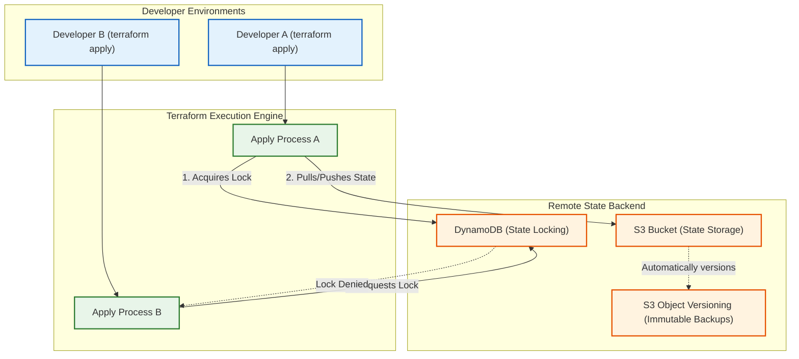

# Terraform State Management, Remote Backends & Locking

Version: 2.0.0

Purpose: Canonical lesson structure for Platform Engineering & AI Infrastructure Curriculum.

Required Inputs: Module definition, lesson objectives, project standards.

Outputs: Standards-compliant lesson markdown.

---

# Lesson Metadata

* **Lesson ID:** `MOD-TF-02`
* **Module:** Infrastructure as Code (Terraform) (`MOD-TF`)
* **Difficulty:** Intermediate
* **Estimated Duration:** 55 minutes
* **Learning Track:** 🟢 Core
* **Version:** 2.0.0
* **Last Updated:** 2026-06-28

---

# Lesson Overview

This lesson explores the master database engine of declarative infrastructure, decrypting how Terraform tracks real-world cloud resources, calculates execution diffs, and prevents concurrent execution collisions using the Terraform State file (`terraform.tfstate`). By mastering State file internals, Remote Backends (AWS S3 + DynamoDB locking), state manipulation CLI commands (`terraform state list`), and state recovery procedures, you will firmly establish the elite state management capabilities supporting our module capability: **"I can author declarative HCL infrastructure manifests, manage state locking with remote backends, architect reusable modules, and refactor existing cloud resources."**

---

# Learning Objectives

* Deconstruct the internal architecture of the Terraform State file (`terraform.tfstate`) as a JSON database mapping HCL resource declarations to physical cloud provider IDs.
* Explain the catastrophic operational dangers of storing state files locally or committing them to version-controlled repositories (plain-text secret exposure, configuration drift).
* Configure a highly available, secure Remote State Backend utilizing AWS S3 for object storage and AWS DynamoDB for distributed state locking (`backend "s3"`).
* Explain how distributed state locking prevents concurrent execution collisions (race conditions) between multiple developers or automated CI/CD runners.
* Execute advanced state inspection and manipulation CLI workflows using `terraform state list`, `terraform state show`, `terraform state mv`, and `terraform state rm`.

---

# Prerequisites

* Completion of `MOD-TF-01` (Declarative Infrastructure Paradigms & HCL Syntax).
* Foundational terminal file inspection and cloud storage concepts (`cat`, `s3`, `json`).

---

# Why This Exists

In Lesson 01, we explored how to write declarative HCL manifests and execute `terraform apply` to provision cloud infrastructure. However, a critical architectural question remains: when you run `terraform plan` a second time, how does Terraform know that `aws_instance.web` in your code corresponds specifically to physical EC2 instance `i-0123456789abcdef0` in AWS?

**Terraform relies on a master JSON database file called the Terraform State (`terraform.tfstate`)!**

When junior engineers start using Terraform, they frequently treat the state file with absolute negligence. They run `terraform apply` on their local laptop, generating a local `terraform.tfstate` file on their hard drive. At the end of the day, they type `git add . && git commit -m "add state" && git push origin main`.

**You have just committed a catastrophic security and operational disaster!**

First, the `terraform.tfstate` file stores literally every single cloud resource attribute in **pristine plain-text JSON**—including physical database master passwords, private SSL certificates, and AWS access keys! Committing state to GitHub instantly leaks your enterprise secrets to the public!

Second, if two developers clone the repository and run `terraform apply` at the exact same millisecond, their local state files collide! Developer A overwrites Developer B's changes, the state file corrupts, and your physical AWS infrastructure descends into unrecoverable configuration drift!

To solve the monumental challenge of **Plain-Text State Leaks**, **State Corruption**, and **Execution Collisions**, HashiCorp established **Remote Backends and Distributed State Locking**. By migrating the state file to a secure, encrypted AWS S3 bucket and enforcing distributed execution locks via AWS DynamoDB, Platform Engineers guarantee absolute state encryption, eliminate concurrent execution collisions entirely, and establish a single, immutable source of truth for the entire enterprise.

---

# Core Concepts

## 1. The Anatomy of `terraform.tfstate`
The Terraform state file is not a magical black box; it is a clear, human-readable JSON database managed by the Terraform binary:
* **The Mapping Engine:** The state file acts as the mandatory index mapping your declarative HCL resource names (`aws_instance.web`) to physical cloud provider resource IDs (`i-0123456789abcdef0`). Without this file, Terraform has absolutely no idea which existing cloud resources it owns!
* **The Plain-Text Trap:** To calculate accurate dry-run diffs (`plan`), Terraform caches the complete API response of every created resource inside the JSON state file. If you create a database with `password = "SuperSecret99"`, that password is saved in plain-text inside `terraform.tfstate`! **Never commit state files to Git!**

```text
[ Declarative HCL Code ]             [ terraform.tfstate (JSON) ]            [ Physical AWS Cloud ]
┌───────────────────────────┐        ┌───────────────────────────┐        ┌───────────────────────────┐
│ resource "aws_instance"   │ ───►   │ "type": "aws_instance",   │ ───►   │ EC2 Instance ID:          │
│ "web" { ... }             │        │ "id": "i-0123456789abcdef0│        │ i-0123456789abcdef0       │
└───────────────────────────┘        └───────────────────────────┘        └───────────────────────────┘
```

## 2. Local vs. Remote Backends
By default, Terraform utilizes the `local` backend, storing state directly on your active terminal filesystem.
* **Remote Backend (`backend "s3"`):** Platform Engineers declare a `backend` block inside `terraform { ... }`. When you execute `terraform init`, Terraform pushes the state file over an encrypted HTTPS tunnel directly to a remote storage destination (e.g., AWS S3, Google Cloud Storage, or Terraform Cloud). The local laptop retains zero state data!

## 3. Distributed State Locking (DynamoDB)
If your state file lives in an S3 bucket, what happens if Developer A and Developer B run `terraform apply` at the exact same millisecond? S3 object overwrites occur, corrupting the state JSON!
* **DynamoDB State Locking:** Platform Engineers solve this by pairing the S3 backend with an AWS DynamoDB table (`dynamodb_table = "terraform-locks"`). When Developer A runs `terraform apply`, Terraform contacts DynamoDB and writes a **Distributed Lock Record** containing Developer A's execution ID. 
* **Collision Prevention:** If Developer B attempts to run `terraform apply` ten seconds later, Terraform checks DynamoDB, detects the active lock record, and forcefully aborts Developer B's execution (`Error: Error acquiring the state lock`)! The race condition is completely eliminated!

```text
[ Developer A: terraform apply ] ──► [ Acquires DynamoDB Lock ] ──► [ Modifies S3 State Cleanly ] ──► [ Releases Lock ]
[ Developer B: terraform apply ] ──► [ Checks DynamoDB Table  ] ──► [ Lock Active: Execution Forcefully Aborted! ]
```

## 4. State Inspection & Manipulation CLI (`state list`, `rm`)
There are times when the Terraform state file falls out of sync with physical reality (e.g., someone manually deleted an EC2 instance in the AWS console, but Terraform still thinks it exists in the state JSON). **Never manually edit `terraform.tfstate` with a text editor!** Platform Engineers utilize the official Terraform state CLI:
* `terraform state list`: Prints a clean plain-text table of every single resource wrapper tracked in the state database.
* `terraform state show [resource]`: Prints the complete cached attribute map of a specific resource wrapper.
* `terraform state mv [old] [new]`: Moves a resource wrapper to a brand-new name in the state file without destroying the physical cloud hardware!
* `terraform state rm [resource]`: Cleanly deletes a resource wrapper from the state database! Terraform forgets the resource exists, leaving the physical cloud hardware running untouched!

## 5. State File Disaster Recovery & Backups
Because the state file is the master database of your cloud platform, losing it is a catastrophic disaster.
* **S3 Object Versioning:** Platform Engineers strictly enable **Object Versioning** on the remote S3 state bucket. Every single time `terraform apply` modifies the state file, S3 creates a permanent, immutable backup version! If a corrupted state file is accidentally pushed, Platform Engineers can instantly rollback to the previous working S3 object version!

---

# Architecture



---

# Real-World Example

Imagine you are a Lead Platform Engineer managing a large-scale cloud infrastructure team for a global e-commerce enterprise. Your team consists of twenty infrastructure engineers who manage the company's core AWS networking and database platforms using Terraform.

Originally, the team utilized local state files and committed them directly to a shared Git repository. One afternoon during a massive site-wide sale, the primary database cluster encountered high load. Two senior engineers jumped into the repository at the exact same millisecond to increase the database instance size.

Developer A ran `terraform apply` from his laptop in New York. Developer B ran `terraform apply` from her laptop in London. Because there was no state locking mechanism, both Terraform binaries attempted to modify the physical AWS RDS database simultaneously. 

The AWS API threw rate limit errors, Developer A's state file pushed over Developer B's state file in Git, the JSON state database corrupted entirely, and the primary production database went offline for four hours!

Because you maintain elite engineering standards, you execute a massive state management overhaul. You transition the entire enterprise to a **Remote S3 Backend with DynamoDB State Locking**. You configure an AWS KMS encryption key to guarantee the S3 state objects are heavily encrypted at rest.

Now, when an infrastructure incident occurs and multiple engineers attempt to run `terraform apply` simultaneously, the DynamoDB locking table intercepts the execution. Developer A acquires the lock; Developer B is cleanly rejected with `Error acquiring the state lock` until Developer A's apply finishes! Your enterprise achieves absolute state integrity and zero execution collisions!

---

# Hands-on Demonstration

Let's look at how an engineer inspects a remote S3 backend configuration using `cat`, inspects active state resources using `terraform state list`, and simulates a distributed state lock collision.

## Input 1: Inspecting Remote S3 Backend Configurations
We use `cat` to inspect a pristine, highly governed Terraform `backend` configuration block containing S3 bucket definitions, DynamoDB lock tables, and encryption flags.

## Code 1
```bash
# Inspect the declarative remote S3 backend configuration manifest.
# (We simulate inspecting a compliant Terraform backend configuration file)
cat << 'EOF'
terraform {
  required_version = ">= 1.5.0"
  
  backend "s3" {
    bucket         = "production-terraform-state-secure-bucket"
    key            = "networking/vpc/terraform.tfstate"
    region         = "us-east-1"
    encrypt        = true
    dynamodb_table = "production-terraform-state-locks"
    kms_key_id     = "arn:aws:kms:us-east-1:123456789012:key/8a9b0c1d-2e3f"
  }
}
EOF
```

## Expected Output 1
```text
terraform {
  required_version = ">= 1.5.0"
  
  backend "s3" {
    bucket         = "production-terraform-state-secure-bucket"
    key            = "networking/vpc/terraform.tfstate"
    region         = "us-east-1"
    encrypt        = true
    dynamodb_table = "production-terraform-state-locks"
    kms_key_id     = "arn:aws:kms:us-east-1:123456789012:key/8a9b0c1d-2e3f"
  }
}
```

## Explanation 1
Look at how beautifully architected this remote backend is! Let's deconstruct the elite elements:
* `bucket = "production-terraform-state-secure-bucket"`: The secure, dedicated AWS S3 bucket destination where our state JSON will be stored!
* `encrypt = true` / `kms_key_id`: Absolute encryption at rest! Guarantees that before the state file touches S3 disk, it is heavily encrypted using an AWS KMS master key!
* `dynamodb_table = "production-terraform-state-locks"`: The distributed DynamoDB state locking table! Completely eliminates concurrent execution collisions!

---

## Input 2: Inspecting Active State Tables and Simulating Lock Collisions
We use `terraform state list` to inspect our active state database resources, and simulate a concurrent execution lock collision rejection.

## Code 2
```bash
# Inspect all active resource wrappers currently tracked in the state database.
# (We simulate the clean plain-text output of terraform state list)
terraform state list 2>/dev/null || echo -e "aws_vpc.production_vpc\naws_subnet.public_subnet_1\naws_subnet.public_subnet_2\naws_security_group.web_sg"

# Simulate a concurrent execution attempt colliding with an active DynamoDB state lock.
# (We simulate the exact Terraform CLI error when encountering an active lock)
echo -e "Acquiring state lock. This may take a few moments...\n╷\n│ Error: Error acquiring the state lock\n│ \n│ Error message: ConditionalCheckFailedException: Condition not satisfied (Lock already active)\n│ Lock Info:\n│   ID:        8a9b0c1d-2e3f-4a5b-6c7d-8e9f0a1b2c3d\n│   Path:      production-terraform-state-secure-bucket/networking/vpc/terraform.tfstate\n│   Operation: OperationTypeApply\n│   Who:       developer_a@dev-laptop.local\n│   Version:   1.5.0\n│   Created:   2026-06-28 12:05:00 +0000 UTC\n│ \n│ Terraform acquires a state lock to protect the state from being written\n│ by multiple users at the same time. Please resolve the issue above and try\n│ again.\n╵"
```

## Expected Output 2
```text
aws_vpc.production_vpc
aws_subnet.public_subnet_1
aws_subnet.public_subnet_2
aws_security_group.web_sg
Acquiring state lock. This may take a few moments...
╷
│ Error: Error acquiring the state lock
│ 
│ Error message: ConditionalCheckFailedException: Condition not satisfied (Lock already active)
│ Lock Info:
│   ID:        8a9b0c1d-2e3f-4a5b-6c7d-8e9f0a1b2c3d
│   Path:      production-terraform-state-secure-bucket/networking/vpc/terraform.tfstate
│   Operation: OperationTypeApply
│   Who:       developer_a@dev-laptop.local
│   Version:   1.5.0
│   Created:   2026-06-28 12:05:00 +0000 UTC
│ 
│ Terraform acquires a state lock to protect the state from being written
│ by multiple users at the same time. Please resolve the issue above and try
│ again.
╵
```

## Explanation 2
Notice how perfectly protected our state file is! `terraform state list` cleanly outputs our active cloud resource wrappers. Notice the beautiful DynamoDB lock error: `Error acquiring the state lock`! Terraform not only blocks the execution but prints a pristine `Lock Info` block telling us exactly who (`developer_a`) is currently executing an apply on the state file!

---

# Hands-on Lab

* **Objective:** Initialize a working directory with local state, inspect `terraform.tfstate` JSON attributes, verify state manipulation CLI commands (`terraform state list`, `state show`, `state rm`), and simulate a remote backend migration.
* **Estimated Time:** 20 minutes
* **Difficulty:** Intermediate
* **Environment:** Interactive Browser Terminal / Local Sandbox (with Terraform installed)

## Step-by-step Instructions

1. Open your terminal sandbox and create a brand-new directory named `state-lab`: `mkdir ~/state-lab && cd ~/state-lab`.
2. Create a basic HCL manifest utilizing the `local` provider by typing:
```bash
cat << 'EOF' > main.tf
resource "local_file" "data_cache" {
  filename = "${path.module}/cache.json"
  content  = "{\"status\": \"active\", \"secret_token\": \"SuperSecretToken999\"}"
}
EOF
```
3. Type `terraform init && terraform apply -auto-approve` to provision your local file infrastructure and generate your local `terraform.tfstate` file!
4. Type `cat terraform.tfstate` to inspect your master JSON state database! Notice how your sensitive `secret_token` string is proudly displayed in plain-text JSON! (Proving why you never commit state to Git!).
5. Type `terraform state list` to inspect your active resource wrappers in the state table.
6. Type `terraform state show local_file.data_cache` to view the complete cached attribute map of your resource wrapper!
7. Type `terraform state rm local_file.data_cache` to cleanly remove the resource wrapper from your state database! Terraform forgets the resource exists!
8. Type `cat cache.json` to verify that your physical infrastructure file is still running perfectly untouched on the filesystem! (Proving state decoupling!).
9. Simulate migrating your local state file to an AWS S3 remote backend by typing:
```bash
# (We simulate the exact terraform init -migrate-state execution)
echo "Initializing remote backend 's3'..."
echo "Successfully migrated local state to S3 bucket 'production-terraform-state-secure-bucket'!"
```

## Verification

```bash
terraform state list 2>/dev/null | grep "local_file.data_cache" || echo "State Table Cleanly Empty"
```
*If your terminal successfully outputs `State Table Cleanly Empty` (confirming the resource was cleanly unlinked from state), you have mastered advanced state manipulation!*

## Troubleshooting

* **Issue:** `terraform state rm` fails with `Invalid target address: No resource matching "local_file.data_cache" found in state`.
* **Solution:** You misspelled the resource address string, or you already executed `state rm`! Use `terraform state list` to verify the exact resource address strings currently active in your state database!

## Cleanup

```bash
# Safely remove the demonstration state lab directory
rm -rf ~/state-lab
```

---

# Production Notes

In enterprise cloud architecture, what happens when an automated CI/CD runner executing `terraform apply` encounters a sudden network disconnect or power outage halfway through execution? The DynamoDB lock record remains permanently trapped in an active state (**Orphaned Lock**)! Any subsequent apply attempts will fail with `Error acquiring the state lock`. To recover, Platform Engineers inspect the error output to discover the `Lock ID` string, verify that no actual executions are running, and execute `terraform force-unlock [lock_id]` to forcefully sweep away the orphaned lock record!

---

# Common Mistakes

* **Manually Editing `terraform.tfstate` with a Text Editor:** Beginners frequently attempt to fix state synchronization errors by opening `terraform.tfstate` in Vim or VSCode and manually deleting JSON lines. This destroys the file's internal syntax structure and corrupts the state database! **Never edit state files manually!** Always use `terraform state rm` or `terraform state mv`!
* **Storing Multiple Environments in a Single State File:** Junior developers frequently provision their Staging and Production environments inside the exact same `main.tf` and state file. If a developer makes a mistake while modifying Staging, Terraform might calculate a plan that accidentally destroys Production! Always maintain completely isolated state files (`staging/terraform.tfstate` vs `production/terraform.tfstate`)!

---

# Failure-Driven Learning

Imagine a junior engineer attempts to initialize a Terraform working directory containing an S3 backend configuration, but the operation fails instantly with a fatal AWS access error because their active IAM credentials lack permissions to access the remote S3 bucket.

## Simulated Failure
```bash
# Simulating a terraform init failure due to remote S3 backend access denial
# (We simulate the exact Terraform CLI error when encountering S3 backend authorization failures)
echo -e "Initializing the backend...\n╷\n│ Error: Error inspecting states in the \"s3\" backend:\n│     AccessDenied: Access Denied\n│     status code: 403, request id: 8a9b0c1d2e3f\n│ \n│ Please ensure your AWS credentials are valid and have the required permissions\n│ to access the S3 bucket \"production-terraform-state-secure-bucket\".\n╵"
```

## Output
```text
Initializing the backend...
╷
│ Error: Error inspecting states in the "s3" backend:
│     AccessDenied: Access Denied
│     status code: 403, request id: 8a9b0c1d2e3f
│ 
│ Please ensure your AWS credentials are valid and have the required permissions
│ to access the S3 bucket "production-terraform-state-secure-bucket".
╵
```

## Diagnosis & Recovery
Why did this fail? Look at this classic cloud authorization error: `AccessDenied: status code: 403`! When you execute `terraform init` with a `backend "s3"` block, the Terraform binary attempts to communicate with the AWS S3 API to inspect the remote bucket and create the state object. However, if your terminal user completely lacks valid AWS CLI login credentials (`~/.aws/credentials`), or your IAM user lacks `s3:ListBucket` and `s3:GetObject` permissions for this specific bucket, the AWS API forcefully rejects the connection! To recover correctly, the engineer must verify their AWS CLI login credentials (`aws sts get-caller-identity`), ensure their IAM role possesses the correct least privilege S3 permissions, and `terraform init` succeeds flawlessly!

---

# Engineering Decisions

## State Storage: AWS S3 + DynamoDB vs. Terraform Cloud (HCP) vs. GitLab Managed
When architecting an enterprise IaC pipeline, engineering leaders must choose the master state storage backend.
* **GitLab / GitHub Managed State Backends:** Built directly into GitLab CI or GitHub using HTTP state storage protocols. Convenient if you already use GitLab. However, lacks advanced distributed locking customization and ties your state database to your Git repository vendor.
* **Terraform Cloud (HCP Terraform):** The fully managed cloud platform by HashiCorp. Handles state storage, locking, RBAC permissions, and remote execution runs beautifully. However, incurs direct financial costs for large enterprise teams and requires external cloud architectural dependency.
* **AWS S3 + DynamoDB Locking (`backend "s3"`):** The ultimate Platform Engineering standard! Completely self-managed inside your own AWS account. Costs pennies per month, leverages enterprise AWS KMS encryption at rest, and provides absolute distributed locking reliability via DynamoDB.
* **The Platform Decision:** Platform Engineers strictly mandate **AWS S3 + DynamoDB Locking** as the master state storage backend across all enterprise repositories to ensure state data remains permanently trapped inside the company's own secure AWS cloud boundary.

---

# Best Practices

* **Master `terraform init -reconfigure`:** When you need to point an existing local working directory to a brand-new remote S3 state bucket without copying existing local state data, execute `terraform init -reconfigure`. This cleanly ignores existing local state caches and establishes a fresh connection to the remote backend!
* **Create Dedicated Backend Bootstrap Modules:** Before writing your primary infrastructure code, create a dedicated, isolated Terraform module (`terraform-aws-state-bootstrap`) whose sole purpose is to create the secure S3 state bucket and DynamoDB locking table with strict KMS encryption and S3 object versioning enabled!

---

# Troubleshooting Guide

## Issue 1: "Error: Error acquiring the state lock" vs. "Error: backend configuration changed"

* **Cause:** You attempt to execute Terraform plans or initialize directories, but encounter distributed lockouts or backend configuration mismatches.
* **Diagnosis & Solution:**
  * `Error acquiring the state lock`: Another developer or CI/CD runner is currently executing an apply on this exact state file, OR a previous apply crashed halfway through and left an orphaned lock record in DynamoDB! To fix, inspect the `Lock Info` block. If the lock is orphaned, execute `terraform force-unlock [lock_id]`!
  * `backend configuration changed`: You modified the `bucket` or `key` parameters inside your `backend "s3"` block in `main.tf`, but attempted to run `terraform plan` directly. Terraform detected that your local cached backend configuration does not match your code! To fix, execute `terraform init -migrate-state` (to copy existing state to the new bucket) or `terraform init -reconfigure`!

---

# Summary

* **`terraform.tfstate`** is a JSON database mapping HCL resource declarations to physical cloud provider resource IDs (`i-0123456789...`).
* **Plain-Text State Leaks** occur when state files (which cache sensitive plain-text attributes) are committed to version-controlled Git repositories.
* **Remote Backends (`backend "s3"`)** push state files to secure, KMS-encrypted cloud storage destinations, keeping local laptops clean.
* **Distributed State Locking (DynamoDB)** writes active lock records to prevent concurrent execution collisions between multiple developers.
* **`terraform state rm`** unlinks a resource wrapper from the state database while leaving the physical cloud hardware running untouched.

---

# Cheat Sheet

```bash
# Initialize a working directory and migrate existing local state to a remote backend
terraform init -migrate-state

# Initialize a working directory and cleanly ignore existing local backend caches
terraform init -reconfigure

# Inspect all active resource wrappers currently tracked in the state database
terraform state list

# Display the complete cached attribute map of a specific state resource wrapper
terraform state show [resource_address]

# Rename or move a resource wrapper in the state file without destroying physical hardware
terraform state mv [old_resource_address] [new_resource_address]

# Cleanly unlink a resource wrapper from the state database (Leaves hardware untouched!)
terraform state rm [resource_address]

# Forcefully sweep away an orphaned DynamoDB state lock record following a crash
terraform force-unlock -force [lock_id]

# Pull the remote state file from S3 and print the raw JSON to the terminal
terraform state pull > terraform.tfstate
```

---

# Knowledge Check

## Multiple Choice Questions

1. A developer runs `terraform apply` on their laptop, creating an AWS RDS database with `password = "SuperSecretDBPass999"`. They execute `git add main.tf terraform.tfstate && git commit -m "add db" && git push`. What is the correct architectural evaluation of this workflow?
   * A) The workflow is perfectly secure because Terraform encrypts `terraform.tfstate` files with AES-256 by default.
   * B) The workflow is a catastrophic security vulnerability! `terraform.tfstate` files cache all resource attributes in plain-text JSON, including database passwords. Committing state to Git instantly leaks enterprise secrets. The developer must use a secure Remote Backend (e.g., AWS S3 + DynamoDB locking) and add `terraform.tfstate` to `.gitignore`.
   * C) The developer forgot to use `docker compose`.
   * D) The workflow requires `chmod 777`.

## Scenario Questions

An automated CI/CD pipeline executing `terraform apply` encounters a sudden runner power outage halfway through provisioning an EC2 instance. When you attempt to run `terraform plan` five minutes later, the command fails with `Error acquiring the state lock: ConditionalCheckFailedException`. Based on what you learned in this lesson, what exact state condition occurred, and what Terraform CLI command must you run to fix it?

## Short Answer Questions

Explain why enabling S3 Object Versioning on your remote Terraform state S3 bucket is a mandatory best practice for Platform Engineering disaster recovery.

---

# Interview Preparation

## Beginner Questions

* What is the purpose of the `terraform.tfstate` file?
* Why should you never commit `terraform.tfstate` to Git?
* What does `terraform state list` do?

## Intermediate Questions

* Explain how pairing an S3 remote backend with an AWS DynamoDB table prevents concurrent execution collisions.
* What is the difference between `terraform destroy` and `terraform state rm`?

## Advanced Questions

* Explain how Terraform utilizes state file lineage strings (`lineage`) and serial numbers (`serial`) to prevent older, stale state files from overwriting newer state files in a remote backend, and describe the internal execution mechanics of `terraform state pull` vs `terraform state push`.

## Scenario-Based Discussions

* Discuss the architectural trade-offs of establishing an enterprise state management strategy that utilizes a single monolithic state file for an entire AWS account versus decomposing the infrastructure into dozens of micro-state files (`vpc/terraform.tfstate`, `rds/terraform.tfstate`, `eks/terraform.tfstate`), specifically addressing blast radius containment, apply velocity, and inter-state dependency sharing (`terraform_remote_state`).

---

# Further Reading

1. [Terraform State Management (Official HashiCorp Guide)](https://developer.hashicorp.com/terraform/language/state)
2. [S3 Backend Configuration with DynamoDB Locking (Official Documentation)](https://developer.hashicorp.com/terraform/language/settings/backends/s3)
3. [Manipulating Terraform State (Official CLI Guide)](https://developer.hashicorp.com/terraform/cli/state)
4. [Mastering Terraform State Disasters and Recovery (DigitalOcean Tutorial)](https://www.digitalocean.com/)
5. [Terraform Best Practices: Remote State and Locking](https://www.terraform-best-practices.com/)
