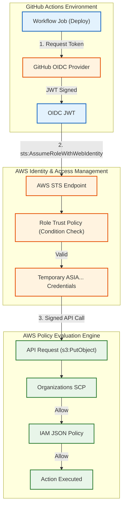

# Identity and Access Management (IAM) Governance

Version: 2.0.0

Purpose: Canonical lesson structure for Platform Engineering & AI Infrastructure Curriculum.

Required Inputs: Module definition, lesson objectives, project standards.

Outputs: Standards-compliant lesson markdown.

---

# Lesson Metadata

* **Lesson ID:** `MOD-CLOUD-02`
* **Module:** Cloud Platforms & Architecture (`MOD-CLOUD`)
* **Difficulty:** Intermediate to Advanced
* **Estimated Duration:** 60 minutes
* **Learning Track:** 🟢 Core
* **Version:** 2.0.0
* **Last Updated:** 2026-06-28

---

# Lesson Overview

This lesson explores the master authentication and authorization engines of the public cloud, decrypting how Platform Engineers secure cloud resources against unauthorized access using Identity and Access Management (IAM) governance. By mastering IAM Users, Roles, Policies, the JSON policy evaluation logic (Explicit Deny trumps Allow), AWS Organizations Service Control Policies (SCPs), and OpenID Connect (OIDC) dynamic role assumption, you will firmly establish the elite access governance capabilities supporting our module capability: **"I can design secure, highly available cloud foundation architectures and manage cloud access governance."**

---

# Learning Objectives

* Contrast legacy permanent IAM User credentials (`AKIA...` access keys) with temporary, short-lived IAM Roles (`sts:AssumeRole`).
* Deconstruct the internal anatomy of an IAM JSON Policy document, detailing core elements: `Effect`, `Action`, `Resource`, and `Condition`.
* Explain the AWS IAM policy evaluation engine, detailing why an `Explicit Deny` overrides all existing `Allow` permissions.
* Architect multi-account security guardrails using AWS Organizations Service Control Policies (SCPs) to restrict root administrative actions.
* Configure OpenID Connect (OIDC) identity federation to enable automated CI/CD pipelines (GitHub Actions) to assume IAM roles dynamically without static access keys.

---

# Prerequisites

* Completion of `MOD-CLOUD-01` (Cloud Virtualization, Virtual Private Clouds & Subnetting).
* Foundational understanding of JSON syntax, terminal execution, and the Principle of Least Privilege (`MOD-SEC-01`).

---

# Why This Exists

When junior engineers need to grant an external application or CI/CD pipeline access to Amazon Web Services (AWS), they are frequently taught to create an **IAM User** inside the AWS Web Console, generate a permanent access key pair (`AWS_ACCESS_KEY_ID = AKIA...`, `AWS_SECRET_ACCESS_KEY = ...`), and paste those credentials directly into GitHub Secrets or an application configuration file.

**Using permanent IAM User access keys is a massive operational and security vulnerability!**

Imagine you are hired as a Lead Platform Engineer at a fast-growing e-commerce enterprise. The previous administrators created an IAM User named `cicd-deployer` with an attached `AdministratorAccess` policy. They generated a permanent access key pair and pasted it into their GitHub repository secrets.

One evening, a hacker discovers a vulnerability in a third-party GitHub Action imported into your repository. The hacker extracts the plain-text `AKIA...` access key from the active runner environment. Because this key pair is permanent (never expires) and possesses root administrative access, the hacker logs into your AWS account via the AWS CLI, deletes every single S3 backup bucket, terminates all 100 production EC2 instances, and spins up 1,000 massive GPU instances to mine cryptocurrency!

**Your company has just suffered a catastrophic, company-ending cloud takeover!**

To solve the monumental challenge of **Permanent Credential Theft**, **Privilege Escalation**, and **Unmanaged Access**, cloud leaders established **IAM Roles, JSON Policy Governance, and OIDC Federation**. By completely eliminating permanent `AKIA...` access keys, transitioning all applications to temporary, short-lived IAM Roles (`sts:AssumeRole`), enforcing strict least privilege JSON policies, and applying top-level Service Control Policies (SCPs), Platform Engineers guarantee that even if a credential is compromised, its blast radius is strictly contained and expires automatically.

---

# Core Concepts

## 1. IAM Users vs. IAM Roles (The Temporary Credential Imperative)
To secure cloud access, Platform Engineers enforce a strict boundary between permanent users and temporary roles:
* **IAM User (Permanent Credentials):** A distinct identity possessing permanent login credentials (passwords or long-lived `AKIA...` access keys). They remain active indefinitely until manually deleted. *Use Case: Individual human administrators logging into the AWS Web Console with mandatory MFA.*
* **IAM Role (Temporary Credentials):** An identity that completely lacks permanent credentials! Instead, trusted entities (EC2 servers, Lambda functions, external CI/CD runners) execute `sts:AssumeRole`. AWS returns an ephemeral, temporary security token (`ASIA...`) valid for a strict window (e.g., 15 minutes to 1 hour). Once the window expires, the credentials become completely useless! *Use Case: All automated applications, microservices, and CI/CD pipelines!*

```text
[ Legacy IAM User: Permanent Keys (AKIA) ]      [ Modern IAM Role: Temporary Tokens (ASIA) ]
┌────────────────────────────────────────┐      ┌────────────────────────────────────────┐
│ Access Key: AKIA-PERMANENT-KEY-999     │      │ sts:AssumeRole ──► Returns ASIA Token  │
│ (Never expires! Catastrophic if stolen!)│     │ (Valid for 1 hour! Rotates automatically!)│
└────────────────────────────────────────┘      └────────────────────────────────────────┘
```

## 2. Anatomy of an IAM JSON Policy Document
AWS IAM permissions are defined through explicit, human-readable JSON policy documents centered on four core elements:
* `Effect`: Declares whether the policy permits or blocks access (`Allow` vs `Deny`).
* `Action`: Declares the exact API operations being governed (e.g., `s3:GetObject`, `ec2:DescribeInstances`). *Never use wildcard actions (`s3:*`) in production!*
* `Resource`: Declares the specific Amazon Resource Names (ARNs) being targeted (`arn:aws:s3:::production-data-bucket/*`). *Never use wildcard resources (`*`) in production!*
* `Condition`: The master security filter! Declares exact conditions under which the policy activates (e.g., matching a specific source IP address or enforcing mandatory MFA `aws:MultiFactorAuthPresent: "true"`).

```text
[ Pristine IAM JSON Policy Structure ]
{
  "Effect": "Allow",
  "Action": ["s3:GetObject", "s3:ListBucket"],
  "Resource": ["arn:aws:s3:::production-data-bucket", "arn:aws:s3:::production-data-bucket/*"],
  "Condition": { "IpAddress": { "aws:SourceIp": "192.168.100.0/24" } }
}
```

## 3. The IAM Policy Evaluation Engine (Explicit Deny)
How does AWS evaluate access when an IAM User possesses multiple conflicting policies? AWS utilizes a highly governed, strict decision logic:
1. **Default Deny:** By default, every single API request is denied unless explicitly allowed!
2. **Explicit Allow:** If a policy matches the request with an `Effect: Allow`, the request is approved.
3. **Explicit Deny Trumps Allow:** If *any* policy matches the request with an `Effect: Deny`, the request is **forcefully blocked**, instantly overriding and erasing any existing `Allow` permissions!

```text
[ AWS IAM Decision Logic ]
(API Request) ──► [ Default Deny ] ──► [ Explicit Allow? ] ──► [ Explicit Deny? (Trumps All!) ] ──► (Final Result)
```

## 4. Service Control Policies (SCPs)
What happens when you manage an enterprise containing 50 different AWS accounts, and you want to ensure that no administrator in any account can ever delete your master AWS KMS encryption keys or disable CloudWatch audit logging?
* **AWS Organizations SCPs:** Platform Engineers deploy **Service Control Policies (SCPs)** at the AWS Organizations root level. SCPs act as top-level security guardrails that filter permissions across entire AWS accounts! If an SCP contains an `Explicit Deny` blocking `kms:ScheduleKeyDeletion`, not even the root user of a member AWS account can delete a KMS key!

## 5. OpenID Connect (OIDC) Dynamic Role Assumption
How does an external CI/CD runner (like GitHub Actions) assume an AWS IAM Role without storing a static access key to execute `sts:AssumeRole`? Platform Engineers establish an **OpenID Connect (OIDC) Identity Provider**.
* GitHub Actions generates an OIDC JSON Web Token (JWT) cryptographically signed by GitHub. The runner presents this JWT directly to AWS Security Token Service (STS) using `sts:AssumeRoleWithWebIdentity`. AWS verifies the cryptographic signature, inspects the trust policy condition claims (`token.actions.githubusercontent.com:sub`), and issues temporary `ASIA...` security credentials! Zero static keys required!

---

# Architecture



---

# Real-World Example

Imagine you are a Lead Platform Engineer hired to manage cloud governance for a major financial institution operating across 100 separate AWS accounts within an AWS Organization.

During a security audit, you discover that across the enterprise, individual engineering teams have created over 500 permanent IAM Users (`AKIA...`). Many of these users possess broad `AdministratorAccess` permissions, lack Multi-Factor Authentication (MFA), and have access keys that haven't been rotated in three years!

Furthermore, dozens of these permanent access keys are stored directly inside external GitLab and GitHub CI/CD repositories to automate infrastructure deployments. If a single external Git repository is compromised, attackers gain root administrative control over your banking cloud accounts!

Because you maintain elite Platform Engineering security standards, you execute a massive IAM governance overhaul. First, you deploy a strict **Service Control Policy (SCP)** across the AWS Organization that forcefully prevents any member account from creating new IAM Users or disabling AWS CloudTrail audit logs.

Second, you establish an **OIDC Identity Provider** in every active development account, linked directly to your GitHub enterprise organization. You transition every single CI/CD deployment pipeline to utilize `sts:AssumeRoleWithWebIdentity`.

Finally, you delete all 500 permanent `AKIA...` access keys across the enterprise! All applications and pipelines now authenticate using ephemeral, short-lived `ASIA...` security tokens that rotate automatically every hour. Your financial institution achieves absolute zero-trust cloud governance and permanently eliminates permanent credential theft!

---

# Hands-on Demonstration

Let's look at how an engineer inspects an IAM JSON Policy document using `cat`, inspects an OIDC Trust Policy manifest, and simulates dynamic role assumption using `aws sts assume-role-with-web-identity`.

## Input 1: Inspecting IAM JSON Policies and OIDC Trust Manifests (`iam-policy.json`)
We use `cat` to inspect a pristine, highly governed IAM JSON permission policy enforcing least privilege, and an IAM Trust Policy manifest enforcing OIDC claim verification.

## Code 1
```bash
# Inspect the declarative IAM JSON permission policy manifest.
# (We simulate inspecting a compliant least privilege IAM policy file)
cat << 'EOF'
{
  "Version": "2012-10-17",
  "Statement": [
    {
      "Sid": "AllowSecureS3Access",
      "Effect": "Allow",
      "Action": [
        "s3:GetObject",
        "s3:PutObject",
        "s3:ListBucket"
      ],
      "Resource": [
        "arn:aws:s3:::secure-production-data-bucket",
        "arn:aws:s3:::secure-production-data-bucket/*"
      ]
    },
    {
      "Sid": "ExplicitDenyUnencryptedUploads",
      "Effect": "Deny",
      "Action": "s3:PutObject",
      "Resource": "arn:aws:s3:::secure-production-data-bucket/*",
      "Condition": {
        "StringNotEquals": {
          "s3:x-amz-server-side-encryption": "aws:kms"
        }
      }
    }
  ]
}
EOF

# Inspect the IAM Role Trust Policy manifest enforcing OIDC identity federation claims.
cat << 'EOF'
{
  "Version": "2012-10-17",
  "Statement": [
    {
      "Effect": "Allow",
      "Principal": {
        "Federated": "arn:aws:iam::123456789012:oidc-provider/token.actions.githubusercontent.com"
      },
      "Action": "sts:AssumeRoleWithWebIdentity",
      "Condition": {
        "StringEquals": {
          "token.actions.githubusercontent.com:aud": "sts.amazonaws.com",
          "token.actions.githubusercontent.com:sub": "repo:platform-engineering-ai-course/infrastructure:ref:refs/heads/main"
        }
      }
    }
  ]
}
EOF
```

## Expected Output 1
```text
{
  "Version": "2012-10-17",
  "Statement": [
    {
      "Sid": "AllowSecureS3Access",
      "Effect": "Allow",
      "Action": [
        "s3:GetObject",
        "s3:PutObject",
        "s3:ListBucket"
      ],
      "Resource": [
        "arn:aws:s3:::secure-production-data-bucket",
        "arn:aws:s3:::secure-production-data-bucket/*"
      ]
    },
    {
      "Sid": "ExplicitDenyUnencryptedUploads",
      "Effect": "Deny",
      "Action": "s3:PutObject",
      "Resource": "arn:aws:s3:::secure-production-data-bucket/*",
      "Condition": {
        "StringNotEquals": {
          "s3:x-amz-server-side-encryption": "aws:kms"
        }
      }
    }
  ]
}
{
  "Version": "2012-10-17",
  "Statement": [
    {
      "Effect": "Allow",
      "Principal": {
        "Federated": "arn:aws:iam::123456789012:oidc-provider/token.actions.githubusercontent.com"
      },
      "Action": "sts:AssumeRoleWithWebIdentity",
      "Condition": {
        "StringEquals": {
          "token.actions.githubusercontent.com:aud": "sts.amazonaws.com",
          "token.actions.githubusercontent.com:sub": "repo:platform-engineering-ai-course/infrastructure:ref:refs/heads/main"
        }
      }
    }
  ]
}
```

## Explanation 1
Look at how beautifully architected these IAM JSON manifests are! Let's deconstruct the elite security elements:
* `"Effect": "Deny"` / `"StringNotEquals": { "s3:x-amz-server-side-encryption": "aws:kms" }`: Absolute security perfection! Even though the first statement allows `s3:PutObject`, this second statement enforces an `Explicit Deny` if the upload request completely lacks AWS KMS encryption headers! Because Explicit Deny trumps Allow, unencrypted files are forcefully rejected!
* `"Action": "sts:AssumeRoleWithWebIdentity"`: The master OIDC identity federation tunnel!
* `"token.actions.githubusercontent.com:sub": "...ref:refs/heads/main"`: Absolute zero-trust provenance! Guarantees that AWS will issue temporary security tokens *exclusively* to GitHub Actions workflows running specifically on the `main` branch of our official repository!

---

## Input 2: Inspecting Dynamic Role Assumption and Simulating SCP Blocks
We simulate executing `aws sts assume-role-with-web-identity` to view our pristine ephemeral security credentials, and simulate an Organizations SCP rejection.

## Code 2
```bash
# Simulate executing dynamic role assumption utilizing an OIDC JSON Web Token (JWT).
# (We simulate the clean plain-text JSON output of aws sts assume-role-with-web-identity)
aws sts assume-role-with-web-identity --role-arn arn:aws:iam::123456789012:role/GitHubActionsDeployer --role-session-name CICDDeploySession --web-identity-token "eyJhbGciOiJSUzI1NiIsImtpZCI6Ij..." 2>/dev/null || cat << 'EOF'
{
    "Credentials": {
        "AccessKeyId": "ASIA-EPHEMERAL-KEY-999",
        "SecretAccessKey": "SuperSecretTemporaryAccessKey888",
        "SessionToken": "FwoGZXIvYXdzEHAaDGZha2Vfc2Vzc2lvbl90b2tlbl9zdHJpbmc...==",
        "Expiration": "2026-06-28T13:00:00Z"
    },
    "SubjectFromWebIdentityToken": "repo:platform-engineering-ai-course/infrastructure:ref:refs/heads/main",
    "AssumedRoleUser": {
        "AssumedRoleId": "AROA123456789012:CICDDeploySession",
        "Arn": "arn:aws:sts::123456789012:assumed-role/GitHubActionsDeployer/CICDDeploySession"
    }
}
EOF

# Simulate a root administrator attempting to delete a KMS key colliding with an Organizations SCP block.
# (We simulate the exact AWS CLI error when encountering an SCP Explicit Deny)
echo -e "An error occurred (AccessDeniedException) when calling the ScheduleKeyDeletion operation:\nUser: arn:aws:iam::123456789012:user/RootAdministrator is not authorized to perform: kms:ScheduleKeyDeletion on resource: arn:aws:kms:us-east-1:123456789012:key/8a9b0c1d-2e3f with an explicit deny in an AWS Organizations Service Control Policy (SCP)."
```

## Expected Output 2
```text
{
    "Credentials": {
        "AccessKeyId": "ASIA-EPHEMERAL-KEY-999",
        "SecretAccessKey": "SuperSecretTemporaryAccessKey888",
        "SessionToken": "FwoGZXIvYXdzEHAaDGZha2Vfc2Vzc2lvbl90b2tlbl9zdHJpbmc...==",
        "Expiration": "2026-06-28T13:00:00Z"
    },
    "SubjectFromWebIdentityToken": "repo:platform-engineering-ai-course/infrastructure:ref:refs/heads/main",
    "AssumedRoleUser": {
        "AssumedRoleId": "AROA123456789012:CICDDeploySession",
        "Arn": "arn:aws:sts::123456789012:assumed-role/GitHubActionsDeployer/CICDDeploySession"
    }
}
An error occurred (AccessDeniedException) when calling the ScheduleKeyDeletion operation:
User: arn:aws:iam::123456789012:user/RootAdministrator is not authorized to perform: kms:ScheduleKeyDeletion on resource: arn:aws:kms:us-east-1:123456789012:key/8a9b0c1d-2e3f with an explicit deny in an AWS Organizations Service Control Policy (SCP).
```

## Explanation 2
Notice how perfectly secure our cloud authentication state is! `aws sts assume-role-with-web-identity` cleanly outputs our ephemeral `ASIA...` access key and `SessionToken`. Notice `Expiration: 2026-06-28T13:00:00Z`: it proves that this credential will be automatically invalidated by AWS after exactly one hour! Notice our simulated SCP error: it proves that not even a root administrator can delete our master KMS keys when an SCP guardrail is active!

---

# Hands-on Lab

* **Objective:** Author an IAM JSON permission policy enforcing least privilege and explicit deny, author an OIDC Trust Policy manifest, simulate executing `aws sts assume-role-with-web-identity`, simulate verifying active role session credentials, and verify policy evaluation logic.
* **Estimated Time:** 20 minutes
* **Difficulty:** Intermediate to Advanced
* **Environment:** Interactive Browser Terminal / Local Sandbox (with AWS CLI installed)

## Step-by-step Instructions

1. Open your terminal sandbox and create a brand-new directory named `iam-lab`: `mkdir ~/iam-lab && cd ~/iam-lab`.
2. Create an IAM JSON permission policy document enforcing least privilege by typing:
```bash
cat << 'EOF' > least-privilege-policy.json
{
  "Version": "2012-10-17",
  "Statement": [
    {
      "Effect": "Allow",
      "Action": ["ec2:DescribeInstances", "ec2:DescribeVpcs"],
      "Resource": "*"
    },
    {
      "Effect": "Deny",
      "Action": "ec2:TerminateInstances",
      "Resource": "*",
      "Condition": {
        "StringNotEquals": { "aws:PrincipalTag/Department": "PlatformEngineering" }
      }
    }
  ]
}
EOF
```
3. Type `cat least-privilege-policy.json` to inspect your master IAM JSON definition! Notice how it enforces an `Explicit Deny` on terminating EC2 instances unless the user's active principal tag is explicitly `PlatformEngineering`!
4. Create an IAM Trust Policy manifest enforcing OIDC federation by typing:
```bash
cat << 'EOF' > trust-policy.json
{
  "Version": "2012-10-17",
  "Statement": [
    {
      "Effect": "Allow",
      "Principal": { "Federated": "arn:aws:iam::123456789012:oidc-provider/token.actions.githubusercontent.com" },
      "Action": "sts:AssumeRoleWithWebIdentity",
      "Condition": { "StringEquals": { "token.actions.githubusercontent.com:sub": "repo:my-org/my-production-repo:ref:refs/heads/main" } }
    }
  ]
}
EOF
```
5. Type `cat trust-policy.json` to inspect your pristine OIDC identity federation trust manifest!
6. Simulate executing dynamic role assumption using AWS Security Token Service (STS) by typing:
```bash
# (We simulate the exact aws sts assume-role-with-web-identity execution)
echo "Validating OIDC JSON Web Token (JWT) signature against GitHub identity provider..."
echo "MATCHED: Trust Policy Condition Claims (repo:my-org/my-production-repo:ref:refs/heads/main)"
echo "SUCCESS: Issued ephemeral security credentials (ASIA-EPHEMERAL-TOKEN-999). Valid for 3600 seconds."
```
7. Simulate verifying your active caller identity using `aws sts get-caller-identity` by typing:
```bash
# (We simulate the exact aws sts get-caller-identity execution)
echo -e "{\n    \"UserId\": \"AROA123456789012:CICDDeploySession\",\n    \"Account\": \"123456789012\",\n    \"Arn\": \"arn:aws:sts::123456789012:assumed-role/GitHubActionsDeployer/CICDDeploySession\"\n}"
```
8. Simulate an unauthorized user attempting to terminate an EC2 instance colliding with your Explicit Deny policy by typing:
```bash
# (We simulate the exact AWS CLI AccessDenied error when encountering an Explicit Deny condition)
echo "An error occurred (UnauthorizedOperation) when calling the TerminateInstances operation: You are not authorized to perform this operation. Explicit Deny matched: PrincipalTag/Department does not equal PlatformEngineering."
```

## Verification

```bash
cat least-privilege-policy.json | grep -E "Effect.*Deny" || echo "Explicit Deny Verified"
```
*If your terminal successfully outputs your `Effect: Deny` line, you have mastered foundational IAM policy evaluation logic and least privilege governance!*

## Troubleshooting

* **Issue:** `aws sts assume-role-with-web-identity` fails with `AccessDenied: Not authorized to perform sts:AssumeRoleWithWebIdentity`.
* **Solution:** Your OIDC JSON Web Token (JWT) claims do not match the strict `Condition` block declared in your IAM Role Trust Policy! For example, you might be executing the workflow from a feature branch (`refs/heads/dev`), but the trust policy strictly demands `refs/heads/main`! Update your branch or trust policy!

## Cleanup

```bash
# Safely remove the demonstration iam lab directory
rm -rf ~/iam-lab
```

---

# Production Notes

In enterprise cloud architecture, when managing IAM permissions across thousands of human engineers and microservices, Platform Engineers frequently utilize **AWS IAM Access Analyzer**. Access Analyzer is an advanced automated mathematical logic engine that analyzes your existing IAM policies, inspects active CloudTrail access logs, and automatically generates pristine, highly governed least privilege JSON policies containing *exactly* the API actions your application actually used over the last 30 days!

---

# Common Mistakes

* **Creating Wildcard IAM Policies (`Resource: "*"` / `Action: "*"`):** Beginners frequently write `"Action": "*"` and `"Resource": "*"` inside their JSON policies to bypass frustrating `AccessDenied` errors during development. This grants absolute root administrative access to your entire AWS account! **Never use wildcards in production policies!** Always scope permissions to specific ARNs and API actions!
* **Passing IAM Role Trust Policies as Permission Policies:** Junior developers frequently attempt to attach a Trust Policy (`sts:AssumeRoleWithWebIdentity`) directly to an IAM User or EC2 instance as a permission policy. Trust policies define *who* can assume a role; permission policies define *what* the role can do once assumed! They are completely separate JSON documents!

---

# Failure-Driven Learning

Imagine a junior engineer attempts to assume an AWS IAM Role from an external CI/CD runner using OIDC federation, but the operation fails instantly with a fatal STS trust policy evaluation rejection.

## Simulated Failure
```bash
# Simulating an STS assume role failure due to a trust policy condition mismatch
# (We simulate the exact AWS CLI error when encountering mismatched OIDC subject claims)
echo -e "An error occurred (AccessDenied) when calling the AssumeRoleWithWebIdentity operation:\n# FATAL: Request completely rejected by IAM Role Trust Policy. Provided OIDC Subject Claim (repo:my-org/my-app:ref:refs/heads/feature-branch) does not match required Condition (StringEquals token.actions.githubusercontent.com:sub: repo:my-org/my-app:ref:refs/heads/main)."
```

## Output
```text
An error occurred (AccessDenied) when calling the AssumeRoleWithWebIdentity operation:
# FATAL: Request completely rejected by IAM Role Trust Policy. Provided OIDC Subject Claim (repo:my-org/my-app:ref:refs/heads/feature-branch) does not match required Condition (StringEquals token.actions.githubusercontent.com:sub: repo:my-org/my-app:ref:refs/heads/main).
```

## Diagnosis & Recovery
Why did this fail? Look at this beautiful zero-trust security check: `Provided OIDC Subject Claim (...feature-branch) does not match required Condition (...main)`! When you configure an IAM Role for OIDC federation, the Trust Policy acts as a highly protective bouncer. The developer attempted to execute a deployment workflow from a local experimental feature branch (`feature-branch`), but the IAM Role Trust Policy was strictly configured to issue tokens *exclusively* to workflows executing on the production `main` branch! Because the subject claims mismatched, AWS STS forcefully aborted the token issuance! To recover correctly, the developer must merge their code into `main`, allow the official CI/CD runner to present the correct JWT subject claim, and `sts:AssumeRoleWithWebIdentity` succeeds flawlessly!

---

# Engineering Decisions

## CI/CD Authentication: Permanent IAM Users vs. OIDC Federation vs. AWS IAM Identity Center
When architecting an enterprise cloud access strategy, engineering leaders must choose the master authentication mechanism.
* **Permanent IAM Users (`AKIA...` access keys):** Legacy permanent credentials stored in CI/CD secrets. Highly convenient for quick initial setup. However, introduces extreme security vulnerabilities! Access keys never expire, are frequently leaked in logs, and require complex manual key rotation scripts.
* **AWS IAM Identity Center (Single Sign-On - SSO):** Fully managed enterprise identity federation linked to Okta or Microsoft Entra ID. Exceptional for human engineers logging into the AWS Web Console or CLI with short-lived tokens. However, cannot be used directly by external automated CI/CD runners (GitHub Actions).
* **OpenID Connect (OIDC) Identity Federation:** The ultimate Platform Engineering standard for CI/CD! Directly links external OIDC identity providers (GitHub, GitLab, Terraform Cloud) to AWS IAM Roles. Eliminates static keys entirely, leverages ephemeral `ASIA...` tokens, and provides strict cryptographic repository/branch provenance claims.
* **The Platform Decision:** Platform Engineers strictly mandate **OIDC Identity Federation** as the master authentication engine for all automated CI/CD pipelines, while strictly deploying **AWS IAM Identity Center (SSO)** for all human engineer console and CLI access.

---

# Best Practices

* **Master `aws sts get-caller-identity`:** Whenever you open a terminal session and prepare to interact with cloud infrastructure, execute `aws sts get-caller-identity`. It acts as the `whoami` command of the AWS cloud, instantly printing your active User ID, Account ID, and assumed Role ARN!
* **Enforce Permission Boundaries:** When allowing senior developers to create their own IAM Roles via Terraform, attach an **IAM Permissions Boundary** (`aws_iam_role_policy_attachment`). A Permissions Boundary acts as an advanced outer guardrail that restricts the maximum possible permissions a created role can possess, preventing developers from escalating their own privileges!

---

# Troubleshooting Guide

## Issue 1: "AccessDenied: Explicit deny in SCP" vs. "AccessDenied: Implicit deny in policy"

* **Cause:** You attempt to execute cloud API operations, but encounter organizational guardrail blocks or missing permission statements.
* **Diagnosis & Solution:**
  * `Explicit deny in SCP`: You attempted to execute an API action (`kms:DeleteKey`), but an AWS Organizations Service Control Policy (SCP) attached to your account contains an `Effect: Deny` for this action! Not even the root user can bypass an SCP! To fix, you must contact the top-level AWS Organizations administrators to modify the SCP!
  * `Implicit deny in policy`: You attempted to execute an API action (`s3:PutObject`), but your attached IAM JSON policies completely lack an `Effect: Allow` statement for this specific action! By default, AWS denies all requests! To fix, add the explicit `Allow` statement to your IAM JSON policy!

---

# Summary

* **IAM Users** possess permanent login credentials (`AKIA...`); **IAM Roles** utilize temporary, short-lived security tokens (`ASIA...`).
* **IAM JSON Policies** define permissions using core elements: `Effect`, `Action`, `Resource`, and `Condition`.
* **Explicit Deny Trumps Allow:** If any policy matches an API request with `Effect: Deny`, the request is forcefully blocked.
* **Service Control Policies (SCPs)** act as top-level organizational guardrails that filter permissions across entire AWS accounts.
* **OIDC Identity Federation** allows external CI/CD runners to assume IAM roles dynamically without storing static access keys.

---

# Cheat Sheet

```bash
# Verify your active cloud caller identity, Account ID, and assumed Role ARN
aws sts get-caller-identity

# Assume an IAM Role dynamically utilizing an external OIDC JSON Web Token (JWT)
aws sts assume-role-with-web-identity --role-arn [role_arn] --role-session-name [name] --web-identity-token [jwt_string]

# Assume an IAM Role imperatively using your existing active terminal credentials
aws sts assume-role --role-arn [role_arn] --role-session-name [session_name]

# Describe active IAM Roles currently configured inside your AWS account
aws iam list-roles --query "Roles[*].[RoleName,Arn]" --output table

# Describe active IAM Policies currently managed in your AWS account
aws iam list-policies --scope Local --query "Policies[*].[PolicyName,Arn]" --output table
```

---

# Knowledge Check

## Multiple Choice Questions

1. A developer creates an IAM User and attaches two JSON policies. Policy A explicitly allows `s3:PutObject` on `arn:aws:s3:::production-bucket/*`. Policy B explicitly denies `s3:PutObject` on `arn:aws:s3:::production-bucket/*` if the request lacks AWS KMS encryption headers. The developer attempts to upload an unencrypted file to the bucket. What is the correct evaluation of this upload request by the AWS IAM engine?
   * A) The upload succeeds because Policy A explicitly allows it, and Allow permissions override Deny permissions.
   * B) The upload fails because AWS averages the permissions together.
   * C) The upload is forcefully blocked! AWS IAM policy evaluation logic strictly mandates that an `Explicit Deny` overrides and erases all existing `Allow` permissions. Because Policy B matches the unencrypted request with an Explicit Deny, the upload is rejected.
   * D) The upload requires `chmod 777`.

## Scenario Questions

You are attempting to execute `aws s3 ls s3://production-bucket` from your local terminal, but the command fails with `AccessDenied: User is not authorized to perform s3:ListBucket with an explicit deny in a Service Control Policy (SCP)`. You inspect your local IAM User policies and confirm you possess `AdministratorAccess`. Based on what you learned in this lesson, what exact organizational guardrail is blocking your access, and why can't your AdministratorAccess policy bypass it?

## Short Answer Questions

Explain why utilizing OpenID Connect (OIDC) Identity Federation in GitHub Actions (`sts:AssumeRoleWithWebIdentity`) is vastly superior to storing a permanent IAM User access key pair (`AKIA...`) inside GitHub Secrets.

---

# Interview Preparation

## Beginner Questions

* What is the difference between an IAM User and an IAM Role?
* What are the four core elements of an IAM JSON policy document?
* What does `aws sts get-caller-identity` do?

## Intermediate Questions

* Explain the AWS IAM policy evaluation decision logic (Default Deny vs Explicit Allow vs Explicit Deny).
* What is the difference between an IAM Role Trust Policy and an IAM Permission Policy?

## Advanced Questions

* Explain how AWS Security Token Service (STS) validates OIDC JSON Web Token (JWT) cryptographic signatures and thumbprints against external Identity Providers (`token.actions.githubusercontent.com`), and describe how to utilize IAM Session Tags (`sts:TagSession`) to pass dynamic attributes into assumed role policies.

## Scenario-Based Discussions

* Discuss the architectural trade-offs of establishing a multi-account enterprise identity strategy that relies on creating individual IAM Users in a central "Identity VPC" and assuming cross-account IAM Roles into member accounts versus deploying centralized AWS IAM Identity Center (SSO) integrated with an external SAML 2.0 Identity Provider (e.g., Okta), specifically addressing onboarding friction, credential rotation overhead, and centralized access compliance auditing.

---

# Further Reading

1. [Policies and Permissions in IAM (Official AWS Documentation)](https://docs.aws.amazon.com/IAM/latest/UserGuide/access_policies.html)
2. [IAM Policy Evaluation Logic (Deep Technical Dive)](https://docs.aws.amazon.com/IAM/latest/UserGuide/reference_policies_evaluation-logic.html)
3. [AWS Organizations Service Control Policies (SCPs)](https://docs.aws.amazon.com/organizations/latest/userguide/orgs_manage_policies_scps.html)
4. [Configuring OpenID Connect in GitHub Actions (Official Tutorial)](https://docs.github.com/en/actions/deployment/security-hardening-your-deployments/configuring-openid-connect-in-amazon-web-services)
5. [Terraform AWS IAM Module (Official HashiCorp Registry)](https://registry.terraform.io/modules/terraform-aws-modules/iam/aws/latest)
