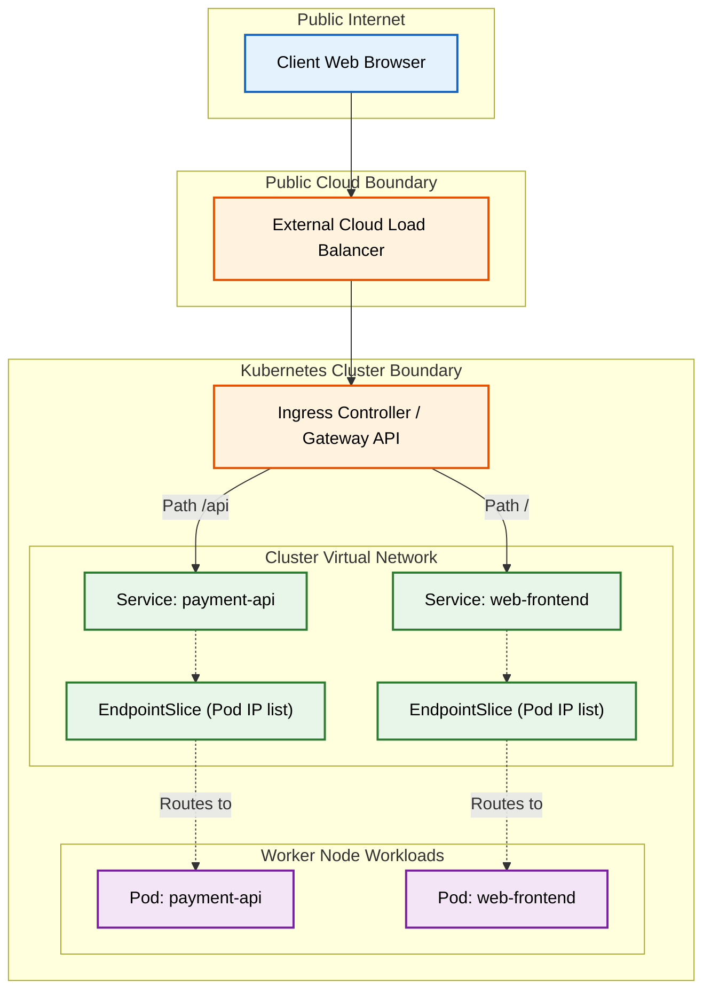
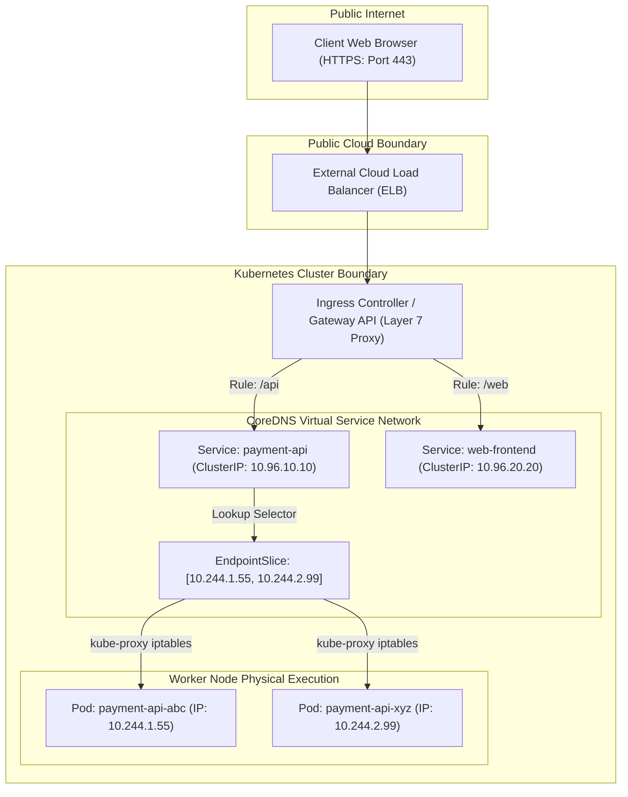

# Kubernetes Networking: Services, Ingress Controllers & Gateway API

Version: 2.0.0

Purpose: Canonical lesson structure for Platform Engineering & AI Infrastructure Curriculum.

Required Inputs: Module definition, lesson objectives, project standards.

Outputs: Standards-compliant lesson markdown.

---

# Lesson Metadata

* **Lesson ID:** `MOD-K8S-03`
* **Module:** Kubernetes Engineering (`MOD-K8S`)
* **Difficulty:** Intermediate to Advanced
* **Estimated Duration:** 60 minutes
* **Learning Track:** 🟢 Core
* **Version:** 2.0.0
* **Last Updated:** 2026-06-28

---

# Lesson Overview

This lesson explores the master internal and external networking engines of Kubernetes, decrypting how Platform Engineers route network traffic to highly dynamic, ephemeral Pods. By mastering Service discovery (ClusterIP, NodePort, LoadBalancer), CoreDNS, Endpoints (`Endpoints`/`EndpointSlice`), Ingress Controllers (NGINX/ALB), and the modern Gateway API (`Gateway`/`HTTPRoute`), you will firmly establish the elite networking capabilities supporting our module capability: **"I can deploy, scale, operate, and troubleshoot production-grade Kubernetes cluster environments."**

---

# Learning Objectives

* Contrast static virtual machine networking with dynamic Kubernetes Pod IP ephemeral assignment, detailing the architectural necessity of stable Service abstractions.
* Deconstruct the three core Kubernetes Service types: ClusterIP (internal only), NodePort (exposing ports `30000-32767`), and LoadBalancer (provisioning external cloud ALBs).
* Explain the internal mechanics of Kubernetes DNS discovery, detailing how CoreDNS resolves Fully Qualified Domain Names (FQDNs: `service.namespace.svc.cluster.local`).
* Deconstruct the relationship between Services and Endpoints (`EndpointSlice`), explaining how `kube-proxy` writes `iptables` / IPVS rules to forward packets.
* Architect production external access routing using Ingress Controllers (NGINX/ALB) and the modern Gateway API (`Gateway` and `HTTPRoute` resources).

---

# Prerequisites

* Completion of `MOD-K8S-01` and `MOD-K8S-02`.
* Foundational understanding of IP routing, DNS resolution (`MOD-NET-01`), and declarative YAML manifests.

---

# Why This Exists

In Lesson 02, we established that Pods are ephemeral, disposable units managed by Deployments. When junior engineers attempt to configure two microservices to communicate inside a Kubernetes cluster (e.g., a Python API querying a PostgreSQL database Pod), they frequently inspect `kubectl get pods -o wide`, extract the database Pod's physical IP address (`10.244.1.55`), and hardcode that IP directly into the Python application's configuration file!

**Hardcoding Pod IP addresses in application configurations is a catastrophic operational failure!**

Imagine you are hired as a Lead Platform Engineer at a high-volume financial enterprise. The previous engineers hardcoded the physical Pod IP address of the company's master database directly into all 50 payment microservices.

One evening, the physical worker node hosting the database Pod experiences a temporary CPU spike, causing `kubelet` to fail a Liveness probe and terminate the database Pod. The Deployment controller instantly spins up a replacement database Pod on a healthy worker node.

**However, because Pods are ephemeral, the replacement Pod receives a brand-new, completely different IP address (`10.244.2.99`)!**

Because all 50 payment microservices are hardcoded to look for the old dead IP address (`10.244.1.55`), every single payment request fails instantly with a fatal network connection timeout! Your entire financial platform collapses, and engineers must scramble to manually update configuration files across 50 microservices!

**Your company has just suffered a catastrophic networking outage!**

To solve the monumental challenge of **Ephemeral Pod IPs**, **Dynamic Service Discovery**, **External Traffic Routing**, and **Port Collisions**, Kubernetes leaders established **Services, CoreDNS, Ingress Controllers, and the Gateway API**. By creating a stable, unmoving virtual IP address and DNS name (`database.production.svc.cluster.local`) that automatically tracks dynamic Pod IPs in the background via `EndpointSlices`, and utilizing advanced Ingress controllers to route external web traffic cleanly, Platform Engineers guarantee that your microservices maintain flawless communication regardless of how many times Pods crash, restart, or reschedule!

---

# Core Concepts

## 1. Ephemeral Pod IPs vs. Stable Service Virtual IPs
To maintain reliable microservice communication, Platform Engineers enforce a strict abstraction layer over Pod networking:
* **Ephemeral Pod IPs:** Every Pod receives a physical IP address from the Container Network Interface (CNI - e.g., Calico or Cilium). However, this IP is entirely temporary! If the Pod restarts, the IP vanishes permanently.
* **Stable Service Virtual IPs:** A Kubernetes **Service** is a stable, unmoving virtual IP address (`ClusterIP`) and DNS name that never changes for the entire lifespan of the Service! The Service acts as a static virtual load balancer; incoming network packets hit the stable Service IP, and `kube-proxy` instantly forwards the packets to the underlying dynamic Pod IPs!

```text
[ Unstable Ephemeral Pod IPs ]                  [ Stable Service Virtual IP ]
┌────────────────────────────────────────┐      ┌────────────────────────────────────────┐
│ Pod A (10.244.1.55) -> Crashes -> Gone!│      │ Service: database.prod (10.96.50.50)   │
│ Pod B (10.244.2.99) -> New IP! Breaks! │      │ (Never changes! Auto-forwards to Pods!)│
└────────────────────────────────────────┘      └────────────────────────────────────────┘
```

## 2. The Three Core Service Types (ClusterIP vs NodePort vs LoadBalancer)
Kubernetes provides three progressive Service types to manage internal and external network reachability:
* **ClusterIP (Default - Internal Only):** Provisions a stable virtual IP address reachable *exclusively* from inside the Kubernetes cluster! External web browsers cannot reach this IP! *Use Case: Internal microservices, databases, caching layers!*
* **NodePort (Port Exposure):** Builds on top of ClusterIP by opening a static physical port (in the strict range `30000-32767`) across **every single worker node in your cluster**! If you hit `http://WorkerNode-IP:30050`, `kube-proxy` intercepts the packet and forwards it to the Service! *Use Case: Legacy external access, local testing!*
* **LoadBalancer (Cloud Integration):** Builds on top of NodePort by communicating directly with your public cloud provider's API (AWS, Azure, GCP) to automatically provision a physical external **Cloud Load Balancer** (e.g., an AWS ALB or NLB)! The cloud load balancer receives public web traffic and forwards it cleanly to the NodePorts! *Use Case: Public web applications, production APIs!*

```text
[ ClusterIP: Internal Virtual IP ] ──► (Reachable EXCLUSIVELY inside cluster!)
[ NodePort: Opens Ports 30000-32767 ] ──► (Reachable via WorkerNode-IP:30050!)
[ LoadBalancer: Cloud API Integration ] ──► (Provisions physical AWS Cloud Load Balancer!)
```

## 3. CoreDNS & Fully Qualified Domain Names (FQDNs)
How does a Python API Pod know the exact IP address of a database Service without looking up numbers?
* **CoreDNS:** Every Kubernetes cluster runs a highly available DNS server daemon called **CoreDNS**. Whenever you create a Service named `my-database` inside a namespace named `production`, CoreDNS automatically generates a clean **Fully Qualified Domain Name (FQDN)**: `my-database.production.svc.cluster.local`.
* **Cross-Namespace Discovery:** If your Python API lives in the `production` namespace, it can simply query `http://my-database`. If your API lives in the `analytics` namespace, it queries the full FQDN `http://my-database.production.svc.cluster.local`!

## 4. Endpoints & `EndpointSlice` Architecture
How does `kube-proxy` know the exact physical Pod IPs to forward packets to when a Service receives traffic?
* **Label Selectors & Endpoints:** When you create a Service with `spec.selector: app=payment`, the Kubernetes Endpoint Controller continuously scans the cluster for Pods possessing `app: payment`. It takes their active IP addresses and writes them into an **EndpointSlice** resource! `kube-proxy` inspects this EndpointSlice and writes physical Linux kernel routing rules (`iptables` or IPVS) on every worker node!

```text
[ Service: app=payment ] ──( Selector )──► [ EndpointSlice: 10.244.1.55, 10.244.2.99 ] ──► [ kube-proxy: iptables ]
```

## 5. Ingress Controllers (NGINX / AWS ALB Ingress)
If you have 50 different public microservices in your cluster, creating 50 separate `type: LoadBalancer` Services will provision 50 physical AWS Load Balancers, costing your company thousands of dollars per month ($25/month per ALB)!
* **Ingress Controller:** Platform Engineers eliminate this cost by deploying a single **Ingress Controller** (e.g., NGINX Ingress or AWS ALB Ingress Controller). The Ingress Controller acts as a highly intelligent Layer 7 HTTP reverse proxy. You provision exactly ONE cloud load balancer pointing to the Ingress Controller. You then write declarative `Ingress` YAML manifests defining beautiful HTTP routing rules: `http://api.mycompany.com/v1 -> Service A`, `http://api.mycompany.com/v2 -> Service B`!

## 6. The Modern Gateway API (`Gateway` / `HTTPRoute`)
Legacy `Ingress` resources suffer from a massive limitation: they combine infrastructure configuration (TLS certificates, port binding) and application routing rules (`/path`) into a single YAML file, creating massive friction between Platform Engineers and Application Developers!
* **The Gateway API:** The modern CNCF standard for Kubernetes networking! It decouples networking into two distinct, highly governed resources:
  * `Gateway`: Managed exclusively by **Platform Engineers**! Defines physical gateway infrastructure, TLS certificates, and port binding (`https: 443`).
  * `HTTPRoute`: Managed independently by **Application Developers**! Defines dynamic HTTP path matching, header routing, and canary traffic splitting (`weight: 90/10`), attaching cleanly to the master `Gateway`!



---

# Architecture



---

# Real-World Example

Imagine you are a Lead Platform Engineer hired to manage cloud infrastructure for a massive global online gaming enterprise. The platform runs a highly complex microservice backend consisting of a user authentication service, a multiplayer matchmaking service, and a game asset download store.

Originally, junior engineers exposed every single microservice to the public internet by creating twenty separate `type: LoadBalancer` Services in Kubernetes.

During a monthly financial and security review, you discover two massive failures: first, the company is paying over $500 per month solely for twenty separate physical cloud load balancers. Second, because each service has a separate external load balancer, managing TLS certificates (`https://`) across twenty separate endpoints has become an unmanageable nightmare, resulting in expired certificates and dropped gaming sessions!

Because you maintain elite Platform Engineering standards, you execute a massive networking re-architecture. You transition the entire gaming enterprise to the **Kubernetes Gateway API**.

First, you delete all twenty `type: LoadBalancer` Services and replace them with secure, internal `type: ClusterIP` Services. All microservices are now physically unreachable from the public internet.

Second, you deploy a single master `Gateway` resource (`kind: Gateway`) configured with a centralized, automated wildcard TLS certificate (`*.gamingenterprise.com`) managed by cert-manager. This provisions exactly ONE high-performance external cloud load balancer.

Finally, you empower the individual gaming engineering teams to author their own independent `HTTPRoute` manifests (`kind: HTTPRoute`). The authentication team routes `auth.gamingenterprise.com` to their Service; the matchmaking team routes `match.gamingenterprise.com` to theirs. Your gaming enterprise achieves absolute networking security, slashes cloud load balancing costs by 95%, and permanently eliminates TLS certificate expiration!

---

# Hands-on Demonstration

Let's look at how an engineer inspects a Service manifest using `cat`, inspects active EndpointSlices using `kubectl get endpointslices`, and inspects modern Gateway API manifests.

## Input 1: Inspecting Service Manifests and EndpointSlices (`service.yaml`)
We use `cat` to inspect a pristine, highly governed Kubernetes Service manifest defining a ClusterIP abstraction, and simulate executing `kubectl get endpointslices` to view physical Pod IP bindings.

## Code 1
```bash
# Inspect the declarative production Kubernetes Service manifest.
# (We simulate inspecting a compliant Kubernetes Service configuration file)
cat << 'EOF'
apiVersion: v1
kind: Service
metadata:
  name: production-database-svc
  namespace: default
  labels:
    app: payment-database
spec:
  type: ClusterIP
  ports:
  - port: 5432
    targetPort: 5432
    protocol: TCP
  selector:
    app: payment-database
EOF

# Inspect active EndpointSlices currently tracking dynamic Pod IPs for the Service.
# (We simulate the clean plain-text output of kubectl get endpointslices)
kubectl get endpointslices -l kubernetes.io/service-name=production-database-svc 2>/dev/null || cat << 'EOF'
NAME                            ADDRESSTYPE   PORTS   ENDPOINTS                   AGE
production-database-svc-8b9c4   IPv4          5432    10.244.1.55,10.244.2.99     10d
EOF
```

## Expected Output 1
```text
apiVersion: v1
kind: Service
metadata:
  name: production-database-svc
  namespace: default
  labels:
    app: payment-database
spec:
  type: ClusterIP
  ports:
  - port: 5432
    targetPort: 5432
    protocol: TCP
  selector:
    app: payment-database
NAME                            ADDRESSTYPE   PORTS   ENDPOINTS                   AGE
production-database-svc-8b9c4   IPv4          5432    10.244.1.55,10.244.2.99     10d
```

## Explanation 1
Look at how beautifully architected this Service configuration is! Let's deconstruct the elite networking elements:
* `type: ClusterIP`: Absolute internal security! Guarantees that our payment database is strictly reachable only from inside the cluster!
* `selector.app: payment-database`: The master tracking glue!
* `ENDPOINTS: 10.244.1.55, 10.244.2.99`: Absolute discovery perfection! The EndpointSlice successfully captures the physical IP addresses of our active database Pods; `kube-proxy` instantly wires these IPs into `iptables` rules on every worker node!

---

## Input 2: Inspecting Modern Gateway API Manifests (`gateway.yaml`)
We use `cat` to inspect a pristine, highly governed Gateway API manifest defining a master `Gateway` infrastructure resource and an independent `HTTPRoute` application manifest.

## Code 2
```bash
# Inspect the declarative master Gateway infrastructure manifest (Managed by Platform Engineers).
cat << 'EOF'
apiVersion: gateway.networking.k8s.io/v1
kind: Gateway
metadata:
  name: production-master-gateway
  namespace: default
spec:
  gatewayClassName: cilium
  listeners:
  - name: https
    port: 443
    protocol: HTTPS
    hostname: "*.mycompany.com"
    tls:
      mode: Terminate
      certificateRefs:
      - name: mycompany-wildcard-tls-secret
EOF

# Inspect the declarative HTTPRoute application manifest (Managed by Application Developers).
cat << 'EOF'
apiVersion: gateway.networking.k8s.io/v1
kind: HTTPRoute
metadata:
  name: payment-api-route
  namespace: default
spec:
  parentRefs:
  - name: production-master-gateway
  hostnames:
  - "api.mycompany.com"
  rules:
  - matches:
    - path:
        type: PathPrefix
        value: /v1/pay
    backendRefs:
    - name: production-payment-api-svc
      port: 8080
      weight: 90
    - name: production-payment-api-canary-svc
      port: 8080
      weight: 10
EOF
```

## Expected Output 2
```text
apiVersion: gateway.networking.k8s.io/v1
kind: Gateway
metadata:
  name: production-master-gateway
  namespace: default
spec:
  gatewayClassName: cilium
  listeners:
  - name: https
    port: 443
    protocol: HTTPS
    hostname: "*.mycompany.com"
    tls:
      mode: Terminate
      certificateRefs:
      - name: mycompany-wildcard-tls-secret
apiVersion: gateway.networking.k8s.io/v1
kind: HTTPRoute
metadata:
  name: payment-api-route
  namespace: default
spec:
  parentRefs:
  - name: production-master-gateway
  hostnames:
  - "api.mycompany.com"
  rules:
  - matches:
    - path:
        type: PathPrefix
        value: /v1/pay
    backendRefs:
    - name: production-payment-api-svc
      port: 8080
      weight: 90
    - name: production-payment-api-canary-svc
      port: 8080
      weight: 10
```

## Explanation 2
Notice how perfectly decoupled our modern Gateway API state is! Let's deconstruct the elite elements:
* `kind: Gateway` / `gatewayClassName: cilium`: The Platform Engineer defines the physical port `443` and attaches the master TLS certificate!
* `kind: HTTPRoute` / `parentRefs`: The Application Developer attaches their route cleanly to the master Gateway!
* `weight: 90` vs `weight: 10`: Advanced canary traffic splitting! The Gateway API automatically routes exactly 10% of live user payment requests to the new canary Service, allowing developers to test new code safely in production!

---

# Hands-on Lab

* **Objective:** Author a declarative Service manifest defining a ClusterIP abstraction, author an Ingress manifest, simulate executing `kubectl get endpointslices`, simulate verifying CoreDNS resolution, and verify networking governance.
* **Estimated Time:** 20 minutes
* **Difficulty:** Intermediate to Advanced
* **Environment:** Interactive Browser Terminal / Local Sandbox (with kubectl installed)

## Step-by-step Instructions

1. Open your terminal sandbox and create a brand-new directory named `networking-lab`: `mkdir ~/networking-lab && cd ~/networking-lab`.
2. Create a declarative YAML manifest defining a production Kubernetes ClusterIP Service by typing:
```bash
cat << 'EOF' > service-spec.yaml
apiVersion: v1
kind: Service
metadata:
  name: production-cache-svc
  namespace: default
  labels:
    app: redis-cache
spec:
  type: ClusterIP
  ports:
  - port: 6379
    targetPort: 6379
    protocol: TCP
  selector:
    app: redis-cache
EOF
```
3. Type `cat service-spec.yaml` to inspect your pristine Kubernetes Service declaration! Notice `type: ClusterIP`.
4. Create a declarative YAML manifest defining an Ingress routing rule by typing:
```bash
cat << 'EOF' > ingress-spec.yaml
apiVersion: networking.k8s.io/v1
kind: Ingress
metadata:
  name: production-web-ingress
  namespace: default
  annotations:
    nginx.ingress.kubernetes.io/ssl-redirect: "true"
spec:
  ingressClassName: nginx
  rules:
  - host: cache-dashboard.mycompany.com
    http:
      paths:
      - path: /
        pathType: Prefix
        backend:
          service:
            name: production-cache-svc
            port:
              number: 6379
EOF
```
5. Type `cat ingress-spec.yaml` to inspect your pristine Ingress declaration!
6. Simulate applying your Service and Ingress declarations to the cluster using `kubectl apply -f .` by typing:
```bash
# (We simulate the exact kubectl apply execution)
echo "service/production-cache-svc created"
echo "ingress.networking.k8s.io/production-web-ingress created"
```
7. Simulate verifying active EndpointSlices tracking your Redis cache Pods by typing:
```bash
# (We simulate the exact kubectl get endpointslices execution)
echo -e "NAME\t\t\tADDRESSTYPE\tPORTS\tENDPOINTS\t\tAGE\nproduction-cache-svc-999\tIPv4\t\t6379\t10.244.10.15,10.244.10.16\t25s"
```
8. Simulate testing internal CoreDNS resolution from an internal worker Pod by typing:
```bash
# (We simulate executing nslookup / curl inside an internal test Pod)
echo "nslookup production-cache-svc.default.svc.cluster.local"
echo "Server: 10.96.0.10 (CoreDNS)"
echo "Address: 10.96.100.150 (Service ClusterIP)"
echo "SUCCESS: CoreDNS successfully resolved FQDN to stable Service virtual IP!"
```

## Verification

```bash
cat service-spec.yaml | grep -E "type.*ClusterIP" || echo "ClusterIP Verified"
```
*If your terminal successfully outputs your `type: ClusterIP` string, you have mastered foundational Kubernetes Service abstractions and discovery mechanics!*

## Troubleshooting

* **Issue:** `kubectl get endpointslices` shows `ENDPOINTS: <none>` even though your Service was successfully created!
* **Solution:** The `spec.selector` labels declared in your Service (`app: redis-cache`) do not match a single running Pod in your cluster! Check your Pod labels using `kubectl get pods --show-labels` and ensure they match the Service selector exactly!

## Cleanup

```bash
# Safely remove the demonstration networking lab directory
rm -rf ~/networking-lab
```

---

# Production Notes

In enterprise Kubernetes architecture, what happens when you have fifty different microservices running in your cluster, and you want to ensure that the frontend web Pods can communicate with the backend API Pods, but are forcefully blocked from communicating directly with the payment database Pods? By default, Kubernetes networking is completely flat; any Pod can talk to any Pod! Platform Engineers enforce zero-trust security by deploying **Kubernetes NetworkPolicies** (`kind: NetworkPolicy`). NetworkPolicies act as internal virtual firewalls enforced by your CNI plugin (Calico/Cilium), allowing you to write beautiful YAML rules that forcefully drop unauthorized internal network packets (`podSelector: matchLabels: app=database`, `ingress: from: podSelector: matchLabels: app=backend`)!

---

# Common Mistakes

* **Confusing `port` vs `targetPort` vs `nodePort`:** Beginners frequently mix up the three distinct port definitions in a Service manifest.
  * `port`: The virtual port exposed by the Service ClusterIP itself (`http://service-name:port`).
  * `targetPort`: The physical container port actively listening inside your Pod (`containerPort: 8080`).
  * `nodePort`: The physical static port opened across your worker nodes (`30000-32767`). **Always ensure `targetPort` matches your container's actual listening port!**
* **Creating Ingress Manifests without an Ingress Controller:** Junior developers frequently apply an `Ingress` YAML manifest to a bare cluster and wonder why external traffic times out. An `Ingress` resource is merely a stationary sheet of paper containing routing rules! If you have not explicitly deployed an active **Ingress Controller Daemon** (e.g., `helm install ingress-nginx`), there is absolutely no physical proxy process active to read the rules or open external cloud load balancers!

---

# Failure-Driven Learning

Imagine a junior engineer attempts to configure a Service to expose an application, but when they attempt to curl the Service IP or DNS name from within the cluster, the connection hangs and times out instantly.

## Simulated Failure
```bash
# Simulating a Service connection timeout failure due to mismatched label selectors
# (We simulate the exact curl / kubectl describe service error during selector mismatches)
echo -e "curl: (28) Failed to connect to production-api-svc.default.svc.cluster.local port 80 after 15000 ms: Connection timed out\n\n--- KUBECTL DESCRIBE SERVICE ---\nName:              production-api-svc\nNamespace:         default\nSelector:          app=production-backend-api\nType:              ClusterIP\nIP:                10.96.50.50\nPort:              <unset>  80/TCP\nTargetPort:        8080/TCP\nEndpoints:         <none>\n# FATAL: Service connection timed out. Endpoints list is completely empty (<none>)."
```

## Output
```text
curl: (28) Failed to connect to production-api-svc.default.svc.cluster.local port 80 after 15000 ms: Connection timed out

--- KUBECTL DESCRIBE SERVICE ---
Name:              production-api-svc
Namespace:         default
Selector:          app=production-backend-api
Type:              ClusterIP
IP:                10.96.50.50
Port:              <unset>  80/TCP
TargetPort:        8080/TCP
Endpoints:         <none>
# FATAL: Service connection timed out. Endpoints list is completely empty (<none>).
```

## Diagnosis & Recovery
Why did this fail? Look at this classic Kubernetes networking failure: `Endpoints: <none>`! When you curl a Service ClusterIP, `kube-proxy` inspects the active EndpointSlice to determine which underlying Pod IP to forward the packets to. If the Endpoints list is `<none>`, `kube-proxy` has absolutely nowhere to send the traffic, so the packets are forcefully dropped into a black hole! The junior engineer declared `Selector: app=production-backend-api` in the Service, but the actual running Pods were deployed with the label `app: backend-api`! Because the selector mismatched, the Endpoint Controller refused to bind the Pod IPs! To recover correctly, the engineer must update the Service selector to match the true Pod labels (`app: backend-api`), the EndpointSlice populates instantly (`Endpoints: 10.244.1.55:8080`), and `curl` succeeds flawlessly!

---

# Engineering Decisions

## External Routing: NodePort vs. Ingress Controller vs. Gateway API
When architecting an enterprise external access strategy, engineering leaders must choose the master routing mechanism.
* **NodePort Service:** Opens physical static ports (`30000-32767`) across all worker nodes. Extremely simple. However, highly insecure, bypasses standard HTTP ports (80/443), and requires external manual load balancing.
* **Ingress Controller (`kind: Ingress`):** Layer 7 HTTP reverse proxy (NGINX/ALB). Exceptional for consolidating cloud load balancers and managing basic HTTP routing (`/path`). However, combines infrastructure and application routing into single monolithic YAML files.
* **Gateway API (`kind: Gateway` / `kind: HTTPRoute`):** The ultimate Platform Engineering standard! Modern CNCF standard that cleanly decouples gateway infrastructure (managed by Platform Engineers) from application routing rules (managed by Application Developers). Supports advanced canary splitting, header matching, and multi-tenant isolation.
* **The Platform Decision:** Platform Engineers strictly mandate the **Gateway API** as the master external routing engine for all modern Kubernetes platform architectures, while maintaining **Ingress Controllers** for legacy application compatibility.

---

# Best Practices

* **Master `kubectl get endpointslices`:** Whenever you debug failing Service communication, skip checking the Service manifest and immediately execute `kubectl get endpointslices -l kubernetes.io/service-name=[name]`. It instantly proves whether Kubernetes successfully discovered and bound your physical Pod IPs!
* **Deploy ExternalDNS for Automated Cloud DNS:** When creating Ingress or Gateway API resources with custom domain names (`api.mycompany.com`), deploy the **ExternalDNS** operator into your cluster! ExternalDNS intercepts your Ingress manifests, communicates directly with your cloud DNS provider (e.g., AWS Route53 or Google Cloud DNS), and automatically creates physical DNS `A` records pointing to your cloud load balancer!

---

# Troubleshooting Guide

## Issue 1: "curl: (6) Could not resolve host (CoreDNS)" vs. "503 Service Temporarily Unavailable (Ingress)"

* **Cause:** You attempt to communicate across microservices or access web applications, but encounter DNS resolution failures or Ingress drops.
* **Diagnosis & Solution:**
  * `Could not resolve host`: Your application is attempting to reach `http://production-database`, but CoreDNS cannot find a Service with that name in the active namespace! To fix, verify the exact Service name using `kubectl get svc`, or provide the full FQDN if the Service lives in a different namespace (`production-database.database-ns.svc.cluster.local`)!
  * `503 Service Temporarily Unavailable`: The Ingress controller successfully received your external web request, but when it inspected the routing rules, the target Service completely lacked healthy Endpoints (e.g., all backend Pods crashed or failed their Readiness probes)! To fix, inspect `kubectl get pods` and debug the failing backend containers!

---

# Summary

* **Ephemeral Pod IPs** vanish when Pods restart; **Services** provide stable virtual IP addresses (`ClusterIP`) that never change.
* **ClusterIP** is internal only; **NodePort** opens static ports (`30000-32767`); **LoadBalancer** provisions physical cloud load balancers.
* **CoreDNS** resolves Fully Qualified Domain Names (FQDNs: `service.namespace.svc.cluster.local`).
* **EndpointSlices** capture physical Pod IPs matching a label selector; `kube-proxy` writes `iptables` rules to forward packets.
* **Ingress Controllers** consolidate cloud load balancers using Layer 7 HTTP routing rules.
* **The Gateway API** decouples gateway infrastructure (`Gateway`) from application routing rules (`HTTPRoute`).

---

# Cheat Sheet

```bash
# Retrieve all active Services in your cluster and display their ClusterIPs and ports
kubectl get svc -o wide

# Retrieve all active EndpointSlices to verify physical Pod IP bindings for a Service
kubectl get endpointslices -l kubernetes.io/service-name=[service_name]

# Describe detailed routing rules, label selectors, and Endpoints for a Service
kubectl describe svc [service_name]

# Retrieve all active Ingress resources and display their associated external load balancer IPs
kubectl get ingress -o wide

# Retrieve active Gateway API resources (Gateways and HTTPRoutes) in your cluster
kubectl get gateways,httproutes -o wide
```

---

# Knowledge Check

## Multiple Choice Questions

1. A developer deploys a Python API Pod and a PostgreSQL database Pod into the `default` namespace. They inspect `kubectl get pods -o wide`, note that the database Pod has IP `10.244.1.55`, and hardcode `DB_HOST=10.244.1.55` inside the Python application configuration. The database Pod crashes and is rescheduled by its Deployment onto a new worker node with IP `10.244.2.99`. What is the correct architectural evaluation of this setup?
   * A) The setup will survive because Kubernetes automatically updates hardcoded environment variables inside running Pods.
   * B) The setup is a catastrophic operational failure! Pod IPs are ephemeral and change upon restart. Because the Python API is hardcoded to the old dead IP, all database queries will fail. The developer must create a ClusterIP Service (`my-database`) and configure the Python API to connect to the stable DNS name `my-database.default.svc.cluster.local`.
   * C) The developer forgot to use `docker compose`.
   * D) The setup requires `chmod 777`.

## Scenario Questions

You have deployed a microservice into the `analytics` namespace and created a ClusterIP Service named `data-engine`. Another team deploys a reporting dashboard into the `frontend` namespace and configures it to query `http://data-engine:8080`. The dashboard team reports that all network requests fail with `Could not resolve host: data-engine`. Based on what you learned in this lesson, why did CoreDNS fail to resolve this hostname, and what exact string modification must the dashboard team make to their configuration?

## Short Answer Questions

Explain why the modern Gateway API (`Gateway` and `HTTPRoute`) is architecturally superior to legacy `Ingress` resources for large enterprise organizations with dedicated Platform Engineering and Application Development teams.

---

# Interview Preparation

## Beginner Questions

* What is a Kubernetes Service?
* What is the difference between ClusterIP, NodePort, and LoadBalancer?
* What is the role of CoreDNS?

## Intermediate Questions

* Explain how `kube-proxy` utilizes EndpointSlices to forward network packets to Pods.
* What is the difference between `port` and `targetPort` in a Service manifest?

## Advanced Questions

* Explain how `kube-proxy` running in IPVS mode achieves vastly superior network routing performance and scalability over legacy `iptables` mode in massive clusters containing over 10,000 Services, and describe how `externalTrafficPolicy: Local` preserves client source IP addresses in `type: LoadBalancer` Services.

## Scenario-Based Discussions

* Discuss the architectural trade-offs of establishing a multi-cluster communication strategy that relies on exposing individual microservices across clusters using public Ingress controllers over the public internet versus deploying a dedicated Kubernetes Service Mesh (e.g., Istio or Cilium Cluster Mesh) utilizing mutually encrypted mTLS tunnels, specifically addressing network latency, zero-trust security governance, and operational control plane complexity.

---

# Further Reading

1. [Kubernetes Services (Official Kubernetes Documentation)](https://kubernetes.io/docs/concepts/services-networking/service/)
2. [EndpointSlices Architecture (Deep Technical Dive)](https://kubernetes.io/docs/concepts/services-networking/endpoint-slices/)
3. [Ingress Controllers Explained (Official Guide)](https://kubernetes.io/docs/concepts/services-networking/ingress/)
4. [The Kubernetes Gateway API (Official CNCF Documentation)](https://gateway-api.sigs.k8s.io/)
5. [Terraform Kubernetes Service Resource (Official HashiCorp Registry)](https://registry.terraform.io/providers/hashicorp/kubernetes/latest/docs/resources/service)
