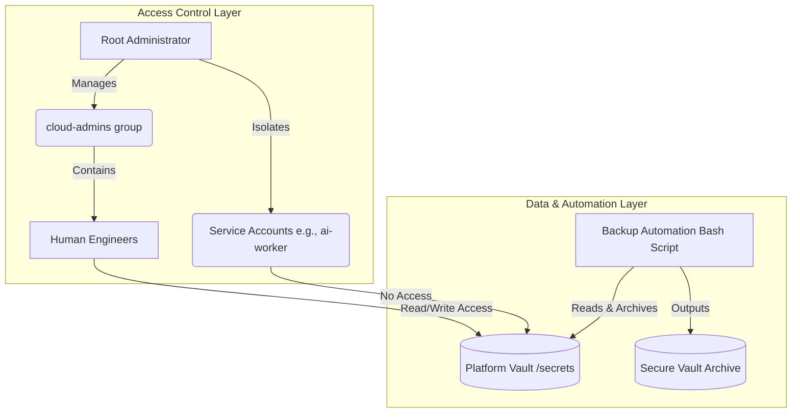

# Enterprise System Hardening & Automated Backup Engine

## 1. Business Scenario
Your enterprise is rapidly expanding its engineering workforce, bringing on dozens of developers and AI infrastructure specialists. Currently, user onboarding, permission management, and sensitive credential backups are performed manually by disparate IT teams, leading to security vulnerabilities, inconsistent access controls, and lost data. You have been assigned as the Lead Systems Administrator to architect and implement an automated, secure, and standardized user provisioning and system backup engine on the primary bastion host.

## 2. Project Goals
* Architect a structured multi-user environment separating human operators from service daemon accounts.
* Enforce strict least-privilege security controls on sensitive cloud credential vaults using octal permissions and ownership masking.
* Monitor and audit critical systemd background processes and network sockets.
* Engineer a robust, idempotent Bash automation script to autonomously backup sensitive configuration vaults with dynamic timestamping and error handling.

## 3. Required Skills
* User & Group Lifecycle Management (`useradd`, `groupadd`, `usermod`)
* Advanced Permission Hardening (`chmod`, `chown`, Octal/Symbolic modes)
* Process & Resource Auditing (`ps`, `systemctl`, `ss`)
* Bash Scripting & Automation (Variables, Conditionals, Loops, Exit Codes)

## 4. Prerequisites
* Completion of `MOD-LINUX-ADM` lessons 01 through 07.
* A functional Linux terminal sandbox (WSL2, Desktop Virtual Machine, or Cloud Shell).
* `sudo` administrative privileges on the terminal environment.

## 5. Architecture Overview
The project establishes a secure access control baseline where developers and service accounts are isolated, followed by an automated scheduled backup engine running via Bash.



### Architectural Breakdown
* **Access Control Layer:** Separates administrative power users from restricted application service accounts to ensure a zero-trust environment.
* **Data Layer:** Centralizes sensitive cloud credentials within a locked directory restricted by octal permissions (`600`).
* **Automation Layer:** Uses a robust Bash script to safely copy, archive, and verify the integrity of the credentials without manual intervention.

## 6. Deliverables
You must produce a structured project repository containing the following assets:
* `config/setup-users.sh`: A script for initializing groups and service accounts.
* `scripts/backup-vault.sh`: The core Bash automation script for archiving secrets.
* `README.md`: High-level documentation explaining the directory structure and execution steps.
* `tests/verify-project.sh`: A verification script asserting that permissions and backups are correctly applied.

## 7. Implementation Plan

### Phase 1: Planning and Access Architecture
Before typing commands, review the requirements. We need an administrative group (`cloud-admins`), an engineer user, and a non-login service account (`ai-worker`). We also need a central vault for secrets. Map out the exact UID/GID structure and octal permissions required. Trade-off consideration: Using an automated Bash script vs. a cronjob for backups (we start with a robust manual script that can be scheduled later).

### Phase 2: User and Group Provisioning
Execute the creation of the `cloud-admins` group and add your active user to it. Create the `ai-worker` service account with strict non-login access (`-s /usr/sbin/nologin`). Create the file `config/setup-users.sh` to automate this baseline.

### Phase 3: Vault Scaffold and Permission Hardening
Create the `platform-vault/secrets` directory. Generate a dummy cloud API key file. Assign ownership to `root:cloud-admins` and lock the file permissions to `600` (read/write for owner only, though group inheritance relies on directory permissions which you will also configure).

### Phase 4: System Audit and Logging Inspection
Use `ps aux` and `ss -tulpn` to verify no unauthorized rogue processes or open ports are running in your environment before implementing the backup engine. Check `systemctl status systemd-journald` to ensure logs are actively recording your administrative actions.

### Phase 5: Backup Automation Engine
Write `scripts/backup-vault.sh`. This script must:
1. Use `set -euo pipefail` for strict error handling.
2. Define variables for source and destination.
3. Check if the source directory exists.
4. Create a timestamped archive directory.
5. Securely copy the files.
6. Provide clear standard output and exit gracefully (`exit 0`).

## 8. Validation Criteria
To prove the system functions flawlessly, run your backup script, then execute the following checks:

```bash
# 1. Verify service account isolation
cat /etc/passwd | grep ai-worker

# 2. Verify vault permissions
ls -l ~/platform-vault/secrets/cloud_api.key

# 3. Execute the backup script and verify exit code
./scripts/backup-vault.sh
echo $?
```
**Expected Output:**
```text
ai-worker:x:998:998::/home/ai-worker:/usr/sbin/nologin
-rw------- 1 root cloud-admins 36 Jun 28 10:00 /home/user/platform-vault/secrets/cloud_api.key
Starting automated vault backup...
Successfully backed up...
0
```

## 9. Troubleshooting Guidance
* **Permission Denied executing the script:** Ensure you unlocked execution rights with `chmod +x scripts/backup-vault.sh`.
* **Script fails with "bad interpreter":** If edited on Windows, invisible carriage returns may exist. Run `dos2unix scripts/backup-vault.sh`.
* **Sudo commands rejected:** Verify your user is actually added to the sudoers file or `wheel` group using `sudo -l`.

## 10. Stretch Goals
1. **Automated Scheduling:** Integrate the backup script with `cron` or a `systemd` timer to run automatically every night at 2:00 AM.
2. **Log Rotation & Alerting:** Modify the script to automatically delete archives older than 7 days, and pipe success/failure outputs to `/var/log/custom-backup.log`.
3. **Advanced Security:** Implement `chattr +i` on the vault directory to make it completely immutable, requiring explicit unlocking even by root before modifying.

## 11. Reflection
1. Why is it dangerous to run backup scripts as the root user without strict error handling (`set -euo pipefail`)?
2. How does separating service accounts (like `ai-worker`) from human accounts prevent lateral movement during a security breach?
3. What are the architectural trade-offs between managing access via groups versus assigning permissions directly to individual users?

## 12. Portfolio Presentation Tips
* **GitHub:** Structure the repository with clear `config/` and `scripts/` folders. Provide a `README.md` containing the Mermaid architecture diagram and clear instructions on how to run the setup and backup engines.
* **Personal Portfolio:** Frame this as your foundational "Enterprise Infrastructure Initialization Engine." Emphasize that you don't just know commands; you know how to architect secure administrative baselines.
* **Technical Blog:** Write an article titled "Automating Secure Backups and Least-Privilege Access in Linux: A Platform Engineer's Guide." Discuss why `set -euo pipefail` is mandatory in production Bash scripts.
* **Resume:** "Engineered an automated, idempotent Linux access control and vault backup engine using Bash and systemd, reducing manual provisioning time and eliminating unauthorized access risks."
* **Interview Discussion:** Be prepared to whiteboard your group/user topology. When asked about process management, discuss how you isolate service daemon permissions to prevent application vulnerabilities from compromising the host OS.
