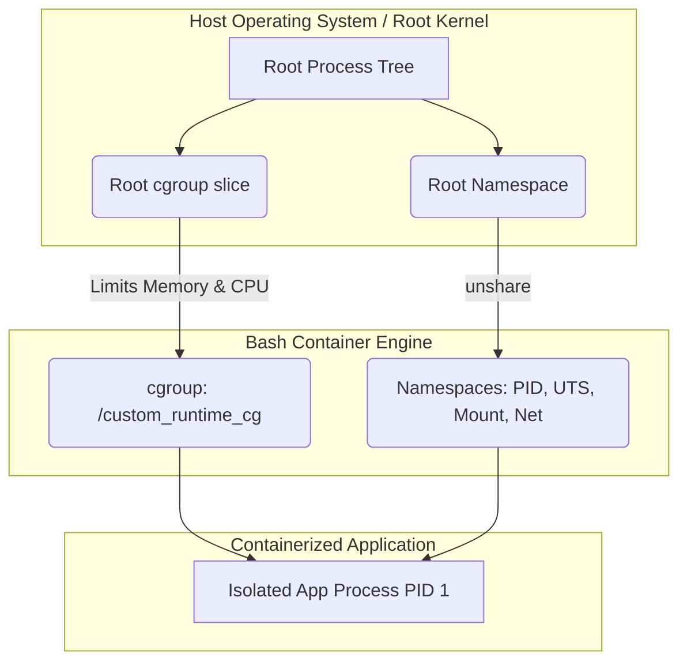

# Enterprise Custom Container Runtime Engine

## 1. Business Scenario
Your enterprise is experiencing severe "noisy neighbor" issues on legacy shared-VM infrastructure, causing sporadic application crashes due to runaway memory leaks. The engineering leadership has decided to migrate the entire fleet to a modern, containerized Kubernetes platform. However, the SRE team lacks a fundamental understanding of how container isolation actually works at the kernel level. You have been assigned as the Lead Platform Engineer to design, architect, and implement a custom, lightweight container runtime engine written entirely in Bash. This educational tool will isolate applications using Linux namespaces, limit memory using Cgroups v2, and trace syscalls to verify perfect kernel isolation, proving to the team exactly how Docker and containerd function under the hood.

## 2. Project Goals
* Architect a secure, isolated sandbox environment leveraging Linux namespaces (PID, UTS, Mount, and Network).
* Establish strict hardware resource boundaries using Cgroups v2 to prevent memory exhaustion attacks or leaks.
* Trace and verify application behavior inside the container using advanced kernel debugging tools (`strace` and `lsof`).
* Automate the container bootstrapping process via an idempotent, production-grade Bash script.

## 3. Required Skills
* **Linux Namespaces:** Creating isolated environments for processes using `unshare`.
* **Cgroups v2:** Modifying `/sys/fs/cgroup` unified hierarchies to set `memory.max` constraints.
* **Kernel Debugging:** Executing `strace` for system call interception and `lsof` for file descriptor tracking.
* **Process Management:** Traversing the `/proc` filesystem and understanding Linux process states.
* **Shell Automation:** Writing robust, idempotent bash scripts with strict error handling (`set -e`).

## 4. Prerequisites
* Completion of Module 03: Linux Internals (`MOD-LINUX-INT`).
* A Linux environment with root (`sudo`) privileges (Ubuntu 22.04+ or modern WSL2).
* Cgroups v2 enabled and mounted at `/sys/fs/cgroup`.
* Essential debugging tools installed: `strace`, `lsof`, `procps`.

## 5. Architecture Overview
The custom container runtime relies exclusively on kernel-level primitives to build isolation layers around an application payload.



**Architecture Breakdown:**
* **Host OS Layer:** The fundamental Linux kernel acting as the central arbiter of hardware resources.
* **Cgroup Layer:** A dedicated sub-directory in `/sys/fs/cgroup` strictly enforcing an absolute memory ceiling. 
* **Namespace Layer:** Launched via the `unshare` utility to detach the child process from the host's PID tree, hostname space, and networking stack.
* **Application Layer:** The target process running securely within these dual layers of isolation, oblivious to the host system.

## 6. Deliverables
You are required to produce the following directory structure and files:

```text
custom-runtime/
├── README.md                 # Professional documentation and architectural runbook
├── config/
│   └── runtime.conf          # Configuration file defining limits (e.g., MEM_LIMIT=100M)
├── scripts/
│   ├── run_container.sh      # The core engine script leveraging unshare and cgroups
│   └── cleanup.sh            # Idempotent cleanup script to remove orphaned cgroups
└── tests/
    └── verify-project.sh     # Validation script ensuring isolation and limits are active
```

## 7. Implementation Plan
**Phase 1: Planning and Configuration**
Before writing execution code, define the configuration variables in `config/runtime.conf`. Hardcoding values is an anti-pattern in platform engineering. Set your targeted memory limit and custom container hostname within this file.

**Phase 2: Establishing Resource Boundaries**
In your `run_container.sh` script, implement the logic to safely create a new Cgroup v2 directory (e.g., `/sys/fs/cgroup/custom_runtime_cg`). Parse the memory limit from `runtime.conf` and apply it to `memory.max`. 

**Phase 3: Launching the Isolated Payload**
Within the same script, utilize `unshare` to launch a bash shell payload. You must configure flags to isolate PID (`--pid --fork --mount-proc`), UTS (`--uts`), and Network (`--net`). Crucially, write the PID of this newly spawned child process into your Cgroup's `cgroup.procs` file to dynamically enforce the memory limit.

**Phase 4: Debugging and Verification**
Once the container is running, use a secondary host terminal to `strace` the containerized process and verify it is appropriately restricted. Write a `cleanup.sh` script to delete the cgroup and kill hanging processes upon termination to ensure infrastructure immutability.

## 8. Validation Criteria
Execute your verification script or perform the following commands manually to prove the engine works perfectly.

```bash
# 1. Start the container in the background
sudo ./scripts/run_container.sh &
CONT_PID=$!

# 2. Verify the cgroup was created and memory limit is applied
cat /sys/fs/cgroup/custom_runtime_cg/memory.max

# 3. Verify the container's PID is isolated from the host
sudo lsof -p $CONT_PID
```

**Expected Output:**
```text
104857600
COMMAND  PID USER   FD   TYPE DEVICE SIZE/OFF NODE NAME
... (Process scoped exclusively to its own pseudo-terminal and isolated environment)
```

## 9. Troubleshooting Guidance
* **Issue:** `unshare: mount /proc failed: Permission denied`. 
  **Solution:** You are likely running this inside a Docker container without the `--privileged` flag. The kernel strictly blocks recursive namespace manipulation by default to prevent breakouts. Run on a dedicated VM or a privileged container.
* **Issue:** `write error: No space left on device` when writing to `cgroup.procs`.
  **Solution:** Ensure you have root privileges and your system is running Cgroups v2 (`stat -fc %T /sys/fs/cgroup/` should output `cgroup2fs`).
* **Issue:** Orphaned processes consuming resources.
  **Solution:** Use `top` and `kill -9` to terminate rogue processes. Always run `cleanup.sh` after execution.

## 10. Stretch Goals
* **Root Filesystem Isolation:** Expand `unshare` to pivot into an entirely new root filesystem using `chroot` or `pivot_root` layered with an Alpine Linux tarball.
* **Network Bridging:** Use `ip link` and `veth` pairs to bridge the isolated container namespace to the host network so it can ping external IP addresses.
* **Security Hardening:** Implement a `seccomp` profile or drop Linux capabilities (using tools like `capsh`) inside the container to prevent privilege escalation attacks.

## 11. Reflection
* What are the architectural trade-offs between utilizing hardware virtualization (VMs) versus kernel namespace isolation (Containers) regarding security vs. performance?
* Why is it fundamentally dangerous to run processes as `root` inside a container, even if the container has its own namespace? 
* How did tracking the underlying file descriptors (`lsof`) change your mental model of the "everything is a file" philosophy?

## 12. Portfolio Presentation Tips
* **GitHub:** Create a pristine repository. Feature the Mermaid architecture diagram heavily in the `README.md`. Detail the flow of system calls when a container is bootstrapped.
* **Personal Portfolio:** Present this project as a demonstration of "First Principles Engineering." Showcase that you don't just use Docker—you understand exactly how it works natively in the Linux kernel.
* **Technical Blog:** Write a deep-dive article titled *"Building Docker from Scratch: A Journey into Linux Namespaces and Cgroups"*. Break down how `unshare` operates under the hood.
* **Resume:** Include a quantitative bullet: *"Architected a lightweight Linux container runtime utilizing Cgroups v2 and Kernel Namespaces, successfully proving complete process and memory isolation for untrusted enterprise payloads."*
* **Interview Discussion:** When asked about container security, pivot the conversation to how you built a runtime from scratch. Confidently draw the relationships between the Root Kernel, Cgroups, and PID Namespaces on a whiteboard.
