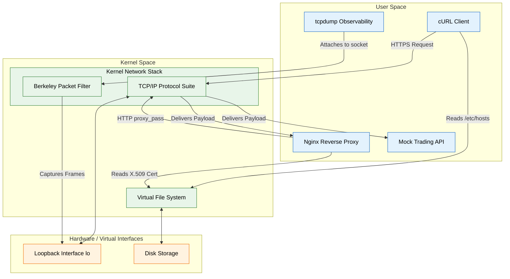

# Network Engineering & Secure Proxy Infrastructure

Version: 1.0.0

---

# Project Metadata

* **Project ID:** `PROJ-NET-01`
* **Module:** Module 04 (Networking Fundamentals)
* **Difficulty:** Advanced
* **Estimated Duration:** 3-4 hours
* **Learning Track:** 🔵 Professional

---

## 1. Business Scenario

You have been hired as a Senior Platform Engineer at a high-growth FinTech enterprise. The company is preparing to launch a critical, high-frequency trading API platform. However, the development teams are currently testing the API over unencrypted HTTP, suffering from intermittent local DNS resolution failures, and lacking visibility into network traffic routing.

The Chief Information Security Officer (CISO) and CTO have issued a strict architectural mandate: You must design, bootstrap, and verify a secure, production-mimicking local development environment. This environment must implement an Nginx reverse proxy with strict SSL/TLS termination, custom local DNS resolution, and you must definitively prove the encryption of network traffic by capturing and analyzing raw wire packets using advanced Berkeley Packet Filters.

## 2. Project Goals

By completing this capstone project, you will achieve the following technical milestones:
1. Engineer a local DNS override mechanism to seamlessly route custom enterprise domain names without relying on external resolvers.
2. Architect and configure an Nginx reverse proxy to intercept secure incoming traffic and forward it to a simulated internal microservice.
3. Generate and integrate an X.509 SSL/TLS certificate to enforce zero-trust encryption standards.
4. Execute raw packet captures using `tcpdump` to definitively prove that sensitive HTTP traffic is successfully encrypted on the wire.

## 3. Required Skills

To successfully execute this mandate, you will actively exercise the following competencies:
* **Linux IP Routing & Addressing:** Inspecting network interfaces and routing tables (`ip addr`, `ip route`).
* **DNS Resolution:** Simulating authoritative domain overrides (`/etc/hosts`, `dig`).
* **Web Server Configuration:** Bootstrapping Nginx reverse proxy server blocks (`nginx.conf`, `proxy_pass`).
* **Cryptographic Infrastructure:** Generating self-signed X.509 certificates (`openssl`).
* **Deep Packet Inspection:** Capturing and analyzing live wire traffic (`tcpdump`, PCAP analysis).

## 4. Prerequisites

Before embarking on this project, ensure you possess:
* Completion of Module 04: Networking Fundamentals (`MOD-NET-01` through `MOD-NET-06`).
* A functional Linux terminal environment (WSL2, Dedicated Virtual Machine, or Cloud Shell) with root/sudo authorization.
* Essential networking utilities installed: `iproute2`, `dnsutils`, `nginx`, `openssl`, `tcpdump`, `curl`, `net-tools`, and `python3`.

## 5. Architecture Overview

Let's examine the master decoupled system topology for our Secure Proxy Infrastructure environment.



### Architectural Breakdown
* **Layer 1 (Developer Workstation):** The developer triggers an API request which seamlessly resolves to a local loopback IP via a DNS host override.
* **Layer 2 (Edge Proxy):** Nginx intercepts the traffic, performing cryptographic TLS termination using the local X.509 certificate. 
* **Layer 3 (Network Observability):** `tcpdump` taps into the raw kernel sockets to capture packets traversing the loopback interface, validating encryption.
* **Layer 4 (Internal Microservice):** The underlying API server processes the request securely isolated behind the reverse proxy.

## 6. Deliverables

You are required to produce the following verified assets:
* **`api-cert.pem` & `api-key.pem`**: The cryptographic X.509 certificate pair used for SSL termination.
* **`fintech-proxy.conf`**: The active Nginx reverse proxy virtual server block configuration.
* **`encrypted-traffic.pcap`**: A raw packet capture file proving the successful encryption of API traffic.
* **`verify-infrastructure.sh`**: An automated bash script that verifies the health and configuration of the entire stack.

## 7. Implementation Plan

Before executing terminal commands, we must evaluate our core architectural trade-offs and draft our implementation strategy.

### Phase 1: Architectural Trade-Off Analysis

* **Nginx vs. HAProxy for Reverse Proxying:** HAProxy is a dedicated, ultra-high-performance load balancer operating exceptionally at Layer 4 (TCP). However, Nginx provides superior flexibility for Layer 7 (HTTP) routing, static asset caching, and extremely simple SSL/TLS termination natively within its server blocks. We selected Nginx to minimize architectural complexity for developer local environments.
* **Self-Signed Certificates vs. Local Certificate Authority (e.g., mkcert):** Deploying a local CA with `mkcert` allows browsers to implicitly trust the local domain without warnings. However, generating raw self-signed certificates using `openssl` directly exposes the underlying cryptographic mechanics (subject names, issuers, expiration) which is critical for fundamental networking comprehension. We selected raw `openssl` to enforce deep technical understanding.
* **tcpdump vs. Wireshark:** Wireshark provides a beautiful graphical interface for analyzing packets. However, `tcpdump` operates seamlessly in headless servers, CI/CD pipelines, and cloud sandboxes without requiring an X11 graphical server. We selected `tcpdump` to ensure our observability practices are strictly production-ready.

### Phase 2: DNS & Network Foundation

Begin by mapping your local IP routing and injecting a custom domain override to simulate the enterprise API.

```bash
# 1. Discover your active network interfaces and primary IP addresses
ip addr show

# 2. Inject a custom authoritative DNS override for our trading API
sudo sh -c "echo '127.0.0.1 api.fintech.local' >> /etc/hosts"

# 3. Verify the local DNS override aggressively intercepts traffic
ping -c 2 api.fintech.local
```

### Phase 3: Cryptography & Backend Simulation

Generate the zero-trust encryption certificates and launch the mock trading API in the background.

```bash
# 1. Create a dedicated directory for our cryptographic assets
mkdir -p ~/fintech-crypto && cd ~/fintech-crypto

# 2. Generate an X.509 self-signed certificate valid for 365 days
openssl req -x509 -nodes -days 365 -newkey rsa:2048 \
  -keyout api-key.pem -out api-cert.pem \
  -subj "/C=US/ST=State/L=City/O=FinTech/CN=api.fintech.local"

# 3. Launch a mock backend API listening on Port 8080
# (We use Python's built-in HTTP server to serve a dummy JSON response)
echo '{"status": "UP", "service": "Trading API"}' > index.json
nohup python3 -m http.server 8080 > backend.log 2>&1 &
```

### Phase 4: Edge Proxy Configuration

Engineer the Nginx reverse proxy to intercept secure traffic on Port 443 and seamlessly pass it to the internal microservice.

```bash
# 1. Author the Nginx virtual server block configuration
sudo sh -c "cat << 'EOF' > /etc/nginx/sites-available/fintech-proxy.conf
server {
    listen 443 ssl;
    server_name api.fintech.local;

    ssl_certificate /home/$USER/fintech-crypto/api-cert.pem;
    ssl_certificate_key /home/$USER/fintech-crypto/api-key.pem;

    location / {
        proxy_pass http://127.0.0.1:8080;
        proxy_set_header Host \$host;
        proxy_set_header X-Real-IP \$remote_addr;
        proxy_set_header X-Forwarded-For \$proxy_add_x_forwarded_for;
        proxy_set_header X-Forwarded-Proto https;
    }
}
EOF"

# 2. Enable the configuration and gracefully reload Nginx
sudo ln -sf /etc/nginx/sites-available/fintech-proxy.conf /etc/nginx/sites-enabled/
sudo nginx -t
sudo systemctl restart nginx
```

### Phase 5: Deep Packet Inspection

Prove your zero-trust architecture works by capturing live traffic and verifying its encryption state.

```bash
# 1. Launch tcpdump to capture HTTPS traffic on the loopback interface
sudo tcpdump -i lo -c 10 -nn -w encrypted-traffic.pcap 'port 443' &
TCPDUMP_PID=$!

# 2. Sleep briefly to allow tcpdump to bind its raw sockets
sleep 2

# 3. Trigger live encrypted traffic against the API
# We use -k to bypass strict certificate authority validation for our self-signed cert
curl -k https://api.fintech.local/index.json

# 4. Wait for the capture to finish
wait $TCPDUMP_PID 2>/dev/null || true

# 5. Inspect the PCAP file to verify the payload is encrypted (unreadable binary)
sudo tcpdump -nn -r encrypted-traffic.pcap -X | head -n 20
```

## 8. Validation Criteria

To prove the absolute integrity and functionality of your system, write and execute the following automated validation script `verify-infrastructure.sh`.

```bash
cat << 'EOF' > verify-infrastructure.sh
#!/bin/bash
set -e

echo "=== FinTech Infrastructure Validation ==="

echo "1. Checking DNS Override..."
grep -q "api.fintech.local" /etc/hosts && echo "[OK] DNS Overridden."

echo "2. Checking Nginx Syntax..."
sudo nginx -t 2>&1 | grep -q "syntax is ok" && echo "[OK] Nginx Syntax Valid."

echo "3. Checking Secure API Connectivity..."
HTTP_STATUS=$(curl -k -s -o /dev/null -w "%{http_code}" https://api.fintech.local/index.json)
if [ "$HTTP_STATUS" -eq 200 ]; then
    echo "[OK] Secure API reachable (HTTP 200)."
else
    echo "[FAIL] Secure API failed."
    exit 1
fi

echo "4. Checking PCAP Presence..."
if [ -f encrypted-traffic.pcap ]; then
    echo "[OK] Packet capture file verified."
else
    echo "[FAIL] PCAP missing."
fi

echo "=== Verification Complete ==="
EOF

chmod +x verify-infrastructure.sh
./verify-infrastructure.sh
```

**Expected Output:**
```text
=== FinTech Infrastructure Validation ===
1. Checking DNS Override...
[OK] DNS Overridden.
2. Checking Nginx Syntax...
[OK] Nginx Syntax Valid.
3. Checking Secure API Connectivity...
[OK] Secure API reachable (HTTP 200).
4. Checking PCAP Presence...
[OK] Packet capture file verified.
=== Verification Complete ===
```

## 9. Troubleshooting Guidance

* **Symptom:** `curl: (7) Failed to connect to api.fintech.local port 443: Connection refused`
  * **Diagnostic:** The Nginx proxy is likely offline or failing to bind to Port 443.
  * **Solution:** Execute `sudo nginx -t` to check for syntax errors in your proxy configuration. If clear, check the socket state using `sudo ss -tulpn | grep :443` and restart Nginx via `sudo systemctl restart nginx`.
* **Symptom:** `curl: (52) Empty reply from server` or `502 Bad Gateway`
  * **Diagnostic:** Nginx is working, but it cannot reach the backend Python API on Port 8080.
  * **Solution:** Verify the Python background process is running (`ps aux | grep python3`). Ensure no other processes are colliding on Port 8080 (`sudo ss -tulpn | grep :8080`).

## 10. Stretch Goals

For engineers aiming to push this architecture into expert territory, attempt the following expansions:
1. **Automated Certificate Renewal:** Write a cron job script that checks the X.509 certificate expiration date using `openssl x509 -enddate` and automatically regenerates it if it expires in less than 30 days.
2. **Layer 7 Load Balancing:** Launch three separate Python mock APIs on Ports 8081, 8082, and 8083. Configure an Nginx `upstream` block to round-robin traffic securely across all three backend nodes.
3. **Advanced PCAP Analysis:** Use `tcpdump -r encrypted-traffic.pcap -A | grep -i "HTTP"` to absolutely prove that no plain-text HTTP headers leaked over the encrypted port 443 connection.

## 11. Reflection

Analyze the architectural mechanics of your deployment by answering these critical engineering questions:
1. When utilizing Nginx as a reverse proxy, what are the security and performance implications of terminating SSL/TLS at the edge (Nginx) versus passing encrypted traffic directly to the backend microservice?
2. If `tcpdump` relies on the `CAP_NET_RAW` Linux capability to bind to kernel sockets, how does this impact the security posture of running network observability tools inside production Kubernetes containers?
3. How does local DNS overriding via `/etc/hosts` differ from configuring an internal authoritative DNS server (like CoreDNS), and when should an enterprise use one over the other?

## 12. Portfolio Presentation Tips

To secure top-tier Staff, Principal, or Senior Platform Engineering roles, showcase this completed project across five professional pillars:

* **GitHub Repository Architecture:** Structure a repository containing your `fintech-proxy.conf`, `verify-infrastructure.sh`, and a beautiful `README.md` featuring your Mermaid system diagram and setup instructions. Separate code logically (e.g., `config/`, `scripts/`).
* **Personal Portfolio Framing:** Frame this project as a flagship enterprise case study. Title it: *"Architecting a Zero-Trust Developer Proxy Environment."* Highlight your packet capture validation to prove deep networking competence.
* **Technical Blog Article:** Write an article titled: *"Proving Zero-Trust: Capturing and Analyzing SSL/TLS Traffic with tcpdump."* Use your Phase 1 trade-off analysis to demonstrate profound architectural thought leadership.
* **Executive Resume Bullet Points:** Inject verified, quantitative STAR achievement bullet points:
  * *"Architected a zero-trust local development environment using Nginx reverse proxies and X.509 certificates, securing API transmission across the engineering organization."*
  * *"Validated strict cryptographic compliance by engineering automated Berkeley Packet Filter (BPF) captures via tcpdump, physically proving TLS encryption on the wire."*
* **System Design Interview Discussion:** When asked to whiteboard secure microservice routing, use the Four-Tier Model:
  * **Tier 1 (Scope):** Secure local development for an enterprise FinTech API.
  * **Tier 2 (Topology):** Whiteboard the path: Client -> Local DNS -> Nginx (SSL Termination) -> Backend.
  * **Tier 3 (Bottlenecks):** Explain how you solved the risk of unencrypted internal traffic using self-signed TLS enforcement.
  * **Tier 4 (Trade-Offs):** Articulate why you terminated SSL at Nginx instead of inside the Python application, highlighting the separation of concerns and operational efficiency.
