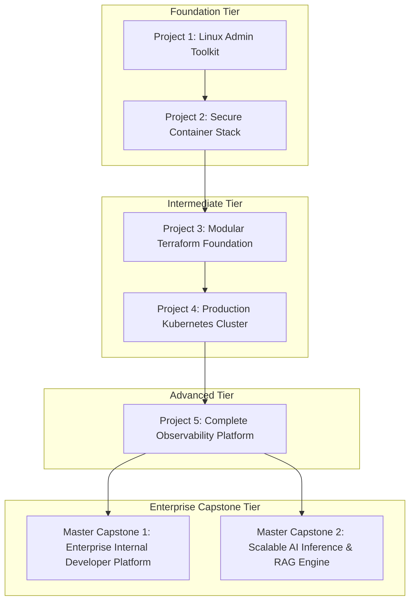

# Capstone Progression & Portfolio Strategy

Version: 1.0.0

Purpose: Structural roadmap governing the design, execution, and integration of practical portfolio projects across the curriculum.

Required Inputs: Milestone definitions, learning objectives, project standards.

Outputs: Authoritative specification for the Project Designer agent.

---

# Capstone Philosophy

As established in `COURSE_PRINCIPLES.md`, "learning happens by building" and "a student should graduate with a portfolio, not just notes." The capstone roadmap ensures that individual module projects build cumulatively toward two enterprise-grade master capstones.

---

# Enterprise Capstone Specifications

## Master Capstone 1: Enterprise Internal Developer Platform (IDP)

* **Objective:** Build a fully functional, self-service Internal Developer Platform that allows application developers to deploy microservices to Kubernetes via custom Terraform templates with zero manual intervention.
* **Integrating Modules:** `MOD-LINUX`, `MOD-GIT`, `MOD-DOCKER`, `MOD-TF`, `MOD-K8S`, `MOD-CICD`, `MOD-OBS`, `MOD-IDP`.
* **Technical Requirements:**
  1. Automated developer portal interface (e.g., Backstage or custom CLI scaffold).
  2. Versioned Terraform templates for application provisioning.
  3. Continuous integration pipeline enforcing automated container vulnerability scanning.
  4. Automatic injection of Prometheus monitoring and Grafana dashboard generation.
  5. GitOps deployment reconciliation via ArgoCD / GitHub Actions.

## Master Capstone 2: Scalable AI Inference & RAG Engine

* **Objective:** Architect a high-throughput, autoscale-enabled AI serving platform hosting Large Language Models (LLMs) and a vector database cluster, fully instrumented for latency and token tracking.
* **Integrating Modules:** `MOD-DOCKER`, `MOD-K8S`, `MOD-OBS`, `MOD-AI`, `MOD-MLOPS`, `MOD-ADV`.
* **Technical Requirements:**
  1. Kubernetes deployment of vLLM / Ollama serving engines with continuous batching.
  2. Horizontal Pod Autoscaling via KEDA based on custom GPU utilization / request queue metrics.
  3. Deployment of a highly available vector database cluster (Qdrant / Milvus / pgvector).
  4. Automated ingestion pipeline for Retrieval-Augmented Generation (RAG).
  5. Dedicated Grafana dashboard tracking Time-To-First-Token (TTFT), token throughput, and GPU memory bandwidth.

---

# Validation & Definition of Done

Every capstone project must be maintained in a dedicated public GitHub repository containing:
* Comprehensive `README.md` with system architecture diagrams (Mermaid).
* Fully reproducible deployment automation scripts (`scripts/`).
* Automated verification checks proving successful deployment.
* Written documentation of architectural trade-offs and engineering decisions.
