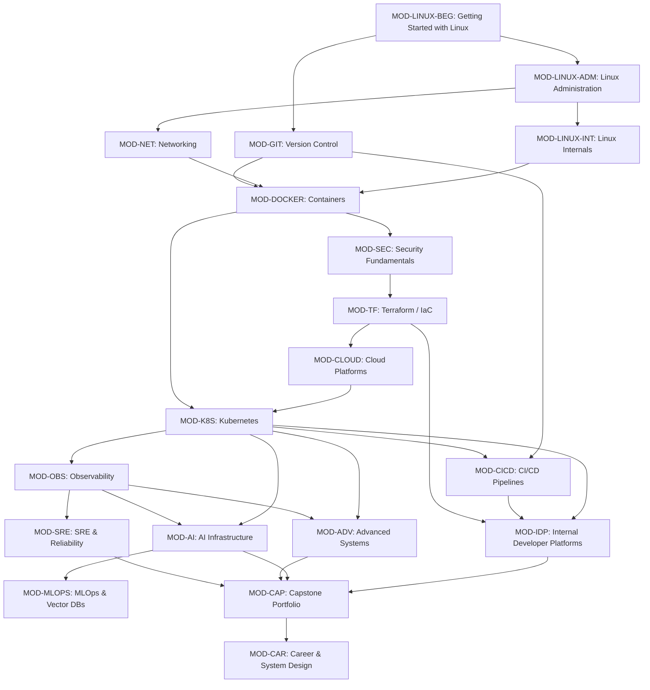

# Explicit Module Dependencies

Version: 2.0.0

Purpose: Directed acyclic dependency graph specification ensuring zero knowledge gaps, progressive difficulty escalation, and absolute learner confidence across the curriculum.

Required Inputs: Module map, learning progression order.

Outputs: Verification criteria for lesson authors to ensure prerequisites are satisfied.

---

# Directed Dependency Specification

---

# Explicit Prerequisite Declarations

## MOD-LINUX-ADM
* **Prerequisites:** `MOD-LINUX-BEG`
* **Rationale:** Requires fundamental terminal navigation and file management before introducing multi-user permissions and system daemons.

## MOD-LINUX-INT
* **Prerequisites:** `MOD-LINUX-ADM`
* **Rationale:** Requires solid administration and process management experience before diving into kernel system calls, cgroups, and namespaces.

## MOD-NET
* **Prerequisites:** `MOD-LINUX-ADM`
* **Rationale:** Requires command-line familiarity and basic package management to install and configure network diagnostic tools and proxies.

## MOD-GIT
* **Prerequisites:** `MOD-LINUX-BEG`
* **Rationale:** Requires directory navigation and text editing skills to initialize repositories and execute commits.

## MOD-DOCKER
* **Prerequisites:** `MOD-LINUX-INT`, `MOD-NET`, `MOD-GIT`
* **Rationale:** Direct application of Linux cgroups and namespaces, port binding, and git repository cloning for container builds.

## MOD-SEC
* **Prerequisites:** `MOD-DOCKER`, `MOD-LINUX-ADM`
* **Rationale:** Requires practical container execution and Linux permission models to implement vulnerability scanning and secret encryption.

## MOD-TF
* **Prerequisites:** `MOD-SEC`, `MOD-GIT`
* **Rationale:** Requires understanding of least-privilege identity concepts and declarative code versioning.

## MOD-CLOUD
* **Prerequisites:** `MOD-TF`, `MOD-NET`
* **Rationale:** Cloud infrastructure must be provisioned via Terraform rather than manual console interaction; requires VPC subnetting knowledge.

## MOD-K8S
* **Prerequisites:** `MOD-CLOUD`, `MOD-DOCKER`
* **Rationale:** Requires robust containerization and cloud infrastructure fundamentals to master control plane and worker node architectures.

## MOD-CICD
* **Prerequisites:** `MOD-K8S`, `MOD-GIT`
* **Rationale:** Automated deployment pipelines target Kubernetes clusters using GitOps reconciliation principles.

## MOD-OBS & MOD-SRE
* **Prerequisites:** `MOD-K8S`, `MOD-CICD`
* **Rationale:** Observability stacks (Prometheus/Grafana) monitor distributed Kubernetes workloads; SRE practices rely on automated metrics and deployment pipelines.

## MOD-AI & MOD-MLOPS
* **Prerequisites:** `MOD-K8S`, `MOD-OBS`
* **Rationale:** Enterprise AI serving requires deploying vLLM/Ollama containers to Kubernetes GPU nodes and tracking token throughput via Prometheus.

## MOD-IDP & MOD-ADV
* **Prerequisites:** `MOD-K8S`, `MOD-TF`, `MOD-CICD`
* **Rationale:** Internal Developer Platforms stitch together Terraform templates, Kubernetes namespaces, and CI/CD workflows into self-service portals.

## MOD-CAP & MOD-CAR
* **Prerequisites:** All prior modules (`MOD-LINUX-BEG` through `MOD-ADV`)
* **Rationale:** Master capstone implementation and whiteboard system design require comprehensive synthesis of the entire curriculum.
