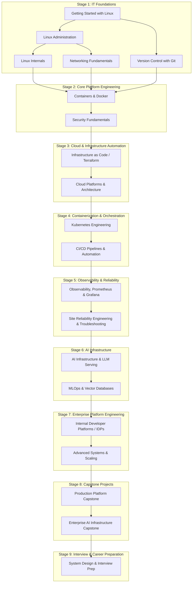

# Master Curriculum Roadmap

Version: 2.0.0

Purpose: High-level visual representation and structural roadmap of the Platform Engineering & AI Infrastructure Curriculum. Optimized for mastery learning, progressive complexity, and capability building.

Required Inputs: Project specifications, learning objectives, career milestones.

Outputs: End-to-end learning path roadmap for self-paced learning and AI agent generation.

---

# Curricular Overview

The Open Platform Engineering & AI Infrastructure Curriculum is designed to guide learners from zero Linux experience to advanced enterprise platform architecture and AI infrastructure management through clear, capability-driven milestones.

---

# Learning Tracks

The roadmap is bifurcated across three optional depth tiers to accommodate diverse learner backgrounds:

* 🟢 **Core:** Essential theory, fundamental commands, and foundational labs. Required for all students.
* 🔵 **Professional:** Production practices, troubleshooting workflows, real-world edge cases, and portfolio projects.
* 🟣 **Expert:** System internals, performance optimization, advanced architecture deep dives, and research topics.

---

# Strategic Progression

The roadmap guarantees that foundational prerequisites are fully mastered before introducing higher-level abstractions. Learners will spend the majority of their time building, deploying, breaking, and troubleshooting real infrastructure systems with absolute confidence.
