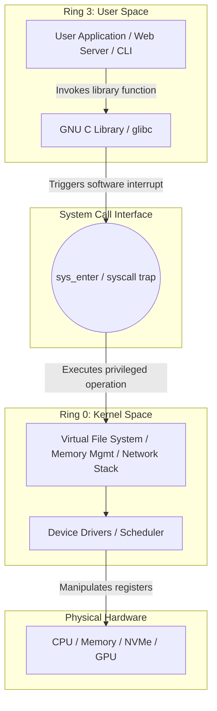

# MOD-LINUX-01: Linux Architectural Fundamentals & Kernel Anatomy

Version: 1.0.0

---

# Lesson Metadata

* **Lesson ID:** MOD-LINUX-01
* **Module:** Linux Fundamentals for Platform Engineers
* **Difficulty:** Beginner
* **Estimated Duration:** 45 minutes
* **Learning Track:** 🟢 Core / 🔵 Professional / 🟣 Expert
* **Version:** 1.0.0
* **Last Updated:** 2026-06-28

---

# Lesson Overview

This lesson explores the foundational architecture of the Linux operating system. As a platform engineer, understanding how user applications communicate with the underlying physical hardware via the Linux kernel is essential for debugging high-performance applications, container runtimes, and AI inference engines.

---

# Learning Objectives

By the end of this lesson, you will be able to:

* Identify the definitive operational boundaries between User Space and Kernel Space.
* Intercept and trace system calls (`syscalls`) executed by running processes using `strace`.
* Explain the security and stability mechanics of hardware execution rings (Ring 0 vs. Ring 3).

---

# Prerequisites

* Basic familiarity with a command-line terminal interface.
* Access to a Linux environment (Ubuntu, Debian, RHEL, or WSL2).

---

# Why This Exists

Early computing systems operated without strict memory or execution isolation. An application executed instructions directly against physical hardware. If a program crashed, contained an infinite loop, or wrote to an invalid memory address, the entire physical machine corrupted or halted.

To guarantee system stability, modern operating systems introduced a hard boundary between application software (User Space) and core hardware orchestration (Kernel Space). The Linux kernel acts as an ultra-secure, highly efficient referee, shielding physical memory, CPU cores, and peripherals from direct application manipulation.

---

# Core Concepts

## User Space vs. Kernel Space
* **User Space:** The unprivileged memory sandbox where all user applications (e.g., Python scripts, bash shells, web servers, LLM runtimes) execute. Code here cannot directly access hardware.
* **Kernel Space:** The privileged memory space where the Linux kernel core, device drivers, and core memory managers execute with absolute access to physical hardware.

## System Calls (`syscalls`)
When an application in User Space needs to allocate memory, write to a disk file, or open a network port, it cannot do so directly. It must issue a **system call** (`syscall`)—a secure, tightly controlled API request asking the kernel to perform the privileged operation on its behalf.

## Hardware Execution Rings
Modern x86/ARM processors enforce privilege isolation at the silicon level using hierarchical rings:
* **Ring 0 (Kernel Mode):** Unrestricted access to all processor instructions and physical memory addresses.
* **Ring 3 (User Mode):** Restricted execution mode. Attempting a privileged instruction in Ring 3 instantly generates a hardware trap, handing control back to Ring 0.

---

# Architecture



---

# Real-World Example

Consider a high-throughput production container serving an AI Large Language Model (LLM) via vLLM. When the model generates a token and sends it to the user over an HTTP REST API, the Python runtime in User Space cannot directly interact with the physical network interface card (NIC). 

Instead, it invokes the `sendto()` or `write()` system call. The CPU transitions from Ring 3 to Ring 0, where the Linux kernel's network stack encapsulates the token into a TCP packet and dispatches it to the physical NIC driver. Mastering this boundary allows platform engineers to identify whether latency is originating in the Python application (User Space) or the network driver (Kernel Space).

---

# Hands-on Demonstration

Let's observe the system call boundary in action by intercepting the execution of a simple command using `strace`.

## Input
We utilize `strace` to wrap an `echo` execution, filtering specifically for the `write` system call.

## Code
```bash
strace -e write echo "Platform Engineering Foundation"
```

## Expected Output
```text
Platform Engineering Foundation
write(1, "Platform Engineering Foundation\n", 32) = 32
+++ exited with 0 +++
```

## Explanation
Notice that `echo` never communicates directly with your terminal screen. It invokes the `write()` system call, passing three arguments: the file descriptor `1` (standard output), the memory buffer containing the text string, and the total byte count (`32`). The kernel takes over in Ring 0, renders the text, and returns the successful byte count (`32`) back to User Space.

---

# Hands-on Lab

* **Objective:** Intercept, log, and analyze the system calls of running Linux processes to identify silent failures and resource access attempts.
* **Estimated Time:** 20 minutes
* **Difficulty:** Beginner
* **Environment:** Any Linux terminal or WSL2 instance.

## Step-by-step Instructions

1. Open a terminal and inspect the system calls made by the `ls` command when checking a non-existent file:
   ```bash
   strace -e stat,lstat,access ls /nonexistent_directory
   ```
2. Observe the `ENOENT (No such file or directory)` error returned directly by the kernel before `ls` prints its user-facing error message.

## Verification
Run `strace -c ls /` to view a comprehensive tabular summary of all system calls, time spent in kernel mode, and error counts.

## Troubleshooting
* **Symptom:** `strace: command not found`
  * **Cause:** The `strace` package is not installed in your minimal Linux environment.
  * **Solution:** Execute `sudo apt-get install strace` or `sudo yum install strace`.

## Cleanup
No persistent files or daemon background processes were created; no cleanup required.

---

# Production Notes

In heavy production environments, frequent transitions between Ring 3 (User Space) and Ring 0 (Kernel Space)—known as **mode switching** or **context switching**—can introduce severe CPU overhead. For highly concurrent microservices, platform engineers utilize advanced kernel subsystems like `io_uring` or `epoll` to batch system calls together, minimizing the expensive hardware ring transitions.

---

# Common Mistakes

* **Treating Linux Commands as Magic:** Beginners view commands like `cat` or `ls` as self-contained magical binaries. In reality, they are merely thin User Space wrappers around standard kernel system calls (`openat`, `read`, `write`, `close`).
* **Ignoring System Call Error Codes:** When an application fails, beginners often look only at application logs. Senior engineers use `strace` to inspect the raw `ERRNO` returned by the kernel (e.g., `EACCES` for permission denied, `ENOMEM` for out of memory).

---

# Failure-Driven Learning

Let's observe how the kernel strictly limits User Space resource requests to prevent system starvation.

## The Failure
Every process has a kernel-enforced maximum limit on the number of file descriptors it can keep open simultaneously. Let's intentionally exhaust this limit.

```bash
# Spawn a subshell and lower the max open files limit to 16
(
  ulimit -n 16
  # Attempting to open multiple file descriptors
  exec 3<> /tmp/test1; exec 4<> /tmp/test2; exec 5<> /tmp/test3
  exec 6<> /tmp/test4; exec 7<> /tmp/test5; exec 8<> /tmp/test6
  exec 9<> /tmp/test7; exec 10<> /tmp/test8; exec 11<> /tmp/test9
  exec 12<> /tmp/test10; exec 13<> /tmp/test11; exec 14<> /tmp/test12
)
```

## Expected Output
```text
bash: /tmp/test12: Too many open files
```

## Diagnosis & Recovery
The kernel blocked the `openat()` system call with an `EMFILE` error code. To diagnose this in production, inspect the running process limits via `cat /proc/<PID>/limits` and check open handles using `lsof -p <PID>`. Recover by increasing the hard limit in `/etc/security/limits.conf`.

---

# Engineering Decisions

When architecting high-performance container platforms, you must decide between standard kernel I/O (`epoll`/`select`) and kernel-bypass technologies (like DPDK - Data Plane Development Kit).
* **Standard Kernel I/O:** Provides robust security, stability, and broad hardware compatibility, but incurs Ring 3 to Ring 0 switching overhead.
* **Kernel Bypass:** Allows User Space applications direct access to NIC hardware queues, achieving microsecond latency for trading platforms or telco workloads, but forfeits the Linux kernel's robust firewalling (`iptables`) and multi-tenant security isolation.

---

# Best Practices

* **Always Profile Before Optimizing:** Never assume an application is CPU-bound; use `strace -c` or `perf` to verify if it is spending its time waiting on kernel system calls.
* **Understand `strace` Overhead:** Never attach `strace` to a high-throughput database in production without caution; intercepting every system call can degrade process execution speed by 30% to 50%.

---

# Troubleshooting Guide

## Issue 1: Process Unresponsive but CPU Usage is Low

* **Cause:** The process is stuck in an uninterruptible sleep state (`D` state) waiting on a kernel system call (typically a blocked storage I/O request).
* **Diagnosis:** Execute `ps aux | grep <process_name>` and look for the `D` in the `STAT` column. Run `strace -p <PID>` to identify the exact hanging system call.
* **Solution:** Investigate underlying storage health (NFS, NVMe, or cloud EBS volumes). Note that processes in a `D` state cannot be killed with `kill -9` until the kernel I/O request completes or times out.

---

# Summary

The Linux operating system maintains an uncompromised architectural boundary between User Space applications and privileged Kernel Space operations. By understanding system calls (`syscalls`) and hardware rings, platform engineers gain the ability to peer beneath application abstractions and diagnose complex runtime behaviors directly at the kernel boundary.

---

# Cheat Sheet

| Command | Purpose | Example |
| :--- | :--- | :--- |
| `strace <command>` | Trace all system calls of a command | `strace echo "test"` |
| `strace -p <PID>` | Attach to a running process | `strace -p 1234` |
| `strace -c <command>` | Print summary table of system calls | `strace -c ls -l /` |
| `strace -e <syscall>` | Filter for specific system calls | `strace -e openat,read cat /etc/passwd` |
| `lscpu` | Display CPU architecture & protection details | `lscpu` |

---

# Knowledge Check

To test your mastery of Linux kernel boundaries, review the dedicated questions in `quizzes/quiz-linux-01.md`.

---

# Interview Preparation

## Beginner Questions
* What is the fundamental difference between User Space and Kernel Space?

## Intermediate Questions
* Explain what a system call (`syscall`) is and why a context switch between Ring 3 and Ring 0 is computationally expensive.

## Advanced Questions
* How does `io_uring` overcome the traditional performance bottlenecks of `epoll` in high-concurrency Linux environments?

## Scenario-Based Discussions
* **Scenario:** A production database is experiencing high latency, and `top` reveals 60% `sys` (system/kernel) CPU utilization. How would you isolate the root cause?
* **Key Talking Points:** Explain how you would utilize `strace -c` to inspect system call frequency, check for lock contention in kernel space, and analyze I/O alignment.

---

# Further Reading

1. [The Linux Kernel Documentation](https://www.kernel.org/doc/html/latest/)
2. [man strace(1)](https://man7.org/linux/man-pages/man1/strace.1.html)
3. [man syscalls(2)](https://man7.org/linux/man-pages/man2/syscalls.2.html)
4. [Linux System Programming by Robert Love](https://www.oreilly.com/library/view/linux-system-programming/9781449341527/)
