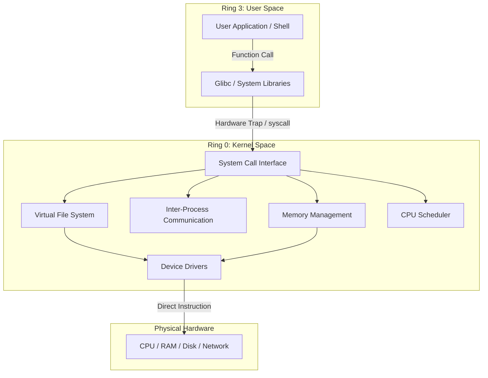

# MOD-LINUX-01: Linux Architectural Fundamentals & Kernel Anatomy

Version: 1.0.0

---

# Lesson Metadata

* **Lesson ID:** MOD-LINUX-01
* **Module:** Linux Fundamentals for Platform Engineers
* **Difficulty:** Beginner
* **Estimated Duration:** 45 minutes
* **Learning Track:** 🟢 Core / 🔵 Professional / 🟣 Expert
* **Version:** 1.0.0
* **Last Updated:** 2026-06-28

---

# Lesson Overview

This lesson demystifies the structural anatomy of the Linux operating system, exploring how the kernel interacts with user space, hardware rings, and system calls. You will learn why operating systems isolate applications from hardware and how to trace execution paths in real time.

---

# Learning Objectives

By the end of this lesson, you will be able to:

* Identify the operational boundaries between User Space and Kernel Space.
* Trace the execution path of a system call (`syscall`) using `strace`.
* Explain the protective mechanics of hardware execution rings (Ring 0 vs. Ring 3).

---

# Prerequisites

* Basic familiarity with opening a Linux terminal and executing simple shell commands.
* Access to a Linux environment with `strace` installed.

---

# Why This Exists

Early operating systems allowed application programs direct, unrestricted access to underlying hardware. If an application crashed or miscalculated a memory address, it corrupted the entire system, causing catastrophic halts. 

To solve this instability, modern operating systems introduced a strict boundary between user applications (User Space) and core hardware operations (Kernel Space). The Linux kernel acts as an ultra-secure, highly efficient referee that manages memory, CPU time, and peripheral access via a strictly controlled API called system calls (`syscalls`).

---

# Core Concepts

## User Space vs. Kernel Space
The memory of a Linux system is strictly divided into two territories:
* **User Space:** Where all user programs, shells, databases, and web servers execute. Code running here cannot access hardware directly.
* **Kernel Space:** The privileged area where the Linux kernel, device drivers, and core memory management routines execute.

## System Calls (Syscalls)
When a user space application needs to read a file, send a network packet, or allocate memory, it must ask the kernel to perform the work on its behalf. This request is executed via a System Call (`syscall`). Examples include `read()`, `write()`, `open()`, and `clone()`.

## Hardware Execution Rings
Modern x86/ARM processors enforce security at the silicon level using hierarchical privilege rings:
* **Ring 0 (Kernel Mode):** Unrestricted access to all hardware instructions and physical memory addresses.
* **Ring 3 (User Mode):** Restricted execution. Attempting to execute a privileged CPU instruction in Ring 3 results in a hardware exception.

---

# Architecture



---

# Real-World Example

In enterprise cloud infrastructure, high-throughput databases like PostgreSQL or Cassandra rely on the kernel's Virtual File System (VFS) and page cache to serve thousands of queries per second. Understanding kernel space vs. user space boundaries enables platform engineers to optimize buffer allocations, ensuring the database does not waste CPU cycles constantly switching execution rings.

---

# Hands-on Demonstration

To understand how user space applications request kernel intervention, let's trace a simple `echo` command using `strace`.

## Input
We invoke `strace` to intercept and record the system calls executed by `echo`.

## Code
```bash
strace -e write echo "Hello Platform Engineering"
```

## Expected Output
```text
Hello Platform Engineering
write(1, "Hello Platform Engineering\n", 27) = 27
+++ exited with 0 +++
```

## Explanation
Notice that `echo` cannot write directly to your display. Instead, it invokes the `write()` system call, asking the kernel to place 27 bytes into file descriptor `1` (`stdout`). The kernel executes the operation in Ring 0 and returns control to the application.

---

# Hands-on Lab

* **Objective:** Trace and analyze the system calls of standard file inspection commands (`cat`, `ls`) to map underlying file descriptor allocations.
* **Estimated Time:** 20 minutes
* **Difficulty:** Beginner
* **Environment:** Local Linux Terminal / Ubuntu VM

## Step-by-step Instructions

1. Open your terminal and create a dummy text file:
   ```bash
   echo "Debugging Kernel Space" > testfile.txt
   ```
2. Use `strace` to monitor the `openat` and `read` system calls when inspecting the file:
   ```bash
   strace -e openat,read cat testfile.txt
   ```

## Verification
Verify that `strace` outputs the exact file descriptor assigned to `testfile.txt` (typically `fd 3`):
```text
openat(AT_FDCWD, "testfile.txt", O_RDONLY) = 3
read(3, "Debugging Kernel Space\n", 131072) = 23
```

## Troubleshooting
* **Symptom:** `strace: command not found`
  * **Cause:** `strace` package is not installed in the local base image.
  * **Solution:** Run `sudo apt-get install strace` or `sudo dnf install strace`.

## Cleanup
```bash
rm -f testfile.txt
```

---

# Production Notes

In production Linux environments, excessive context switching between User Space and Kernel Space can severely degrade application performance. When configuring high-throughput systems like Nginx or Redis, senior platform engineers utilize asynchronous I/O (`epoll` or `io_uring`) to batch system calls and minimize CPU ring transition overhead.

---

# Common Mistakes

* **Treating `strace` as a lightweight tool:** Beginners often attach `strace` to a running production database process (`strace -p <PID>`). `strace` intercepts every system call via `ptrace`, which can introduce a 5x–10x latency penalty, effectively locking up production services.
* **Confusing Shell Builtins with Binaries:** Attempting to `strace cd` fails because `cd` is an internal shell command, not an external binary executing independent system calls.

---

# Failure-Driven Learning

Let's intentionally exhaust a system's file descriptors to observe how the kernel protects resource boundaries.

## The Failure
If an application leaks file descriptors without closing them, the kernel intervenes to prevent system-wide starvation.

```bash
# Simulating descriptor exhaustion in a subshell
(
  ulimit -n 64
  # Attempting to open exceeding files will generate:
  # bash: /dev/null: Too many open files
)
```

## Diagnosis & Recovery
To diagnose this in production, inspect the process limits using `cat /proc/<PID>/limits` and identify open handles with `lsof -p <PID>`. Recover by adjusting the hard limits in `/etc/security/limits.conf`.

---

# Engineering Decisions

When architecting high-performance network proxy layers, you must decide whether to use standard User Space packet processing (e.g., standard Nginx) or Kernel Space bypass technologies (e.g., eBPF / XDP). 
* **User Space:** Easier to configure, debug, and maintain; higher latency due to ring transitions.
* **Kernel Bypass (eBPF):** Near-zero overhead as packets are processed directly in Ring 0; requires specialized C/eBPF verification knowledge.

---

# Best Practices

* Always monitor system call frequency during load testing using `strace -c`.
* Never run user-facing web applications as `root`, as compromising a root process puts attackers one step away from executing raw Ring 0 instructions.
* Prefer asynchronous I/O frameworks (`io_uring`) when building high-concurrency platform tooling.

---

# Troubleshooting Guide

## Issue 1: High `sys` (System) CPU Utilization in Production

* **Problem:** `top` shows overall CPU utilization is normal, but `sys` (kernel space time) exceeds 50%.
* **Cause:** An application is trapped in an inefficient loop, spamming the kernel with rapid, blocking system calls (e.g., reading 1 byte at a time instead of buffering).
* **Diagnosis:** 
  ```bash
  # Inspect system call summary for the target process ID
  strace -c -p <PID>
  ```
* **Solution:** Modify the application's I/O handling to use buffered reading (`BufferedReader` / `bufio`), drastically reducing the number of `read()` system calls.

---

# Summary

The Linux operating system enforces strict architectural isolation between User Space (Ring 3) and Kernel Space (Ring 0). System calls (`syscalls`) form the explicit bridge between user applications and hardware execution. By mastering `strace` and understanding ring transitions, platform engineers can architect highly efficient, stable infrastructure.

---

# Cheat Sheet

| Command | Description | Example |
| :--- | :--- | :--- |
| `strace <cmd>` | Trace all system calls executed by a command | `strace ls` |
| `strace -e <syscall>`| Trace only specific system calls | `strace -e openat,read cat file` |
| `strace -c <cmd>` | Generate a statistical summary of system calls | `strace -c find /usr` |
| `strace -p <PID>` | Attach to a running process (Use with caution!) | `strace -p 1234` |

---

# Knowledge Check

## Multiple Choice Questions

1. Which hardware execution ring is reserved for the Linux kernel?
   * A) Ring 1
   * B) Ring 0
   * C) Ring 3
   * D) Ring 2

2. What mechanism does a user space application use to request hardware access?
   * A) Direct Memory Access (DMA)
   * B) Hardware Interrupt
   * C) System Call (`syscall`)
   * D) Kernel Module Injection

## Scenario Questions

**Scenario:** A development team complains that their multi-threaded Python microservice is running 5x slower on production Kubernetes than on their local laptops. You notice that `top` indicates high kernel (`sys`) CPU time. How would you investigate?

## Short Answer Questions

* Explain the difference between User Space and Kernel Space in your own words.

---

# Interview Preparation

## Beginner Questions
* What is the fundamental difference between User Space and Kernel Space?

## Intermediate Questions
* How does a context switch occur, and why is it computationally expensive?

## Advanced Questions
* Explain how `io_uring` overcomes the traditional performance bottlenecks of `epoll` in high-concurrency Linux environments.

## Scenario-Based Discussions
* **Scenario:** A production database is experiencing high latency, and `top` reveals 60% `sys` (system/kernel) CPU utilization. How would you isolate the root cause?
* **Key Talking Points:** Explain how you would utilize `strace -c` to inspect system call frequency, check for lock contention in kernel space, and analyze I/O alignment.

---

# Further Reading

1. [Linux Kernel Archives](https://kernel.org)
2. [Man7: syscalls(2)](https://man7.org/linux/man-pages/man2/syscalls.2.html)
3. [Man7: strace(1)](https://man7.org/linux/man-pages/man1/strace.1.html)
4. *Linux Kernel Development* by Robert Love
5. [Brendan Gregg's Linux Performance](https://www.brendangregg.com/linuxperformance.html)
