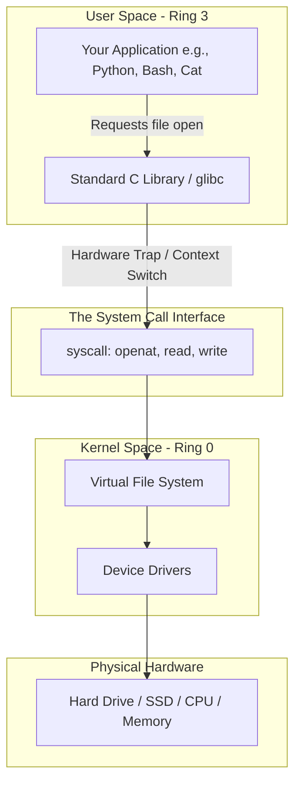
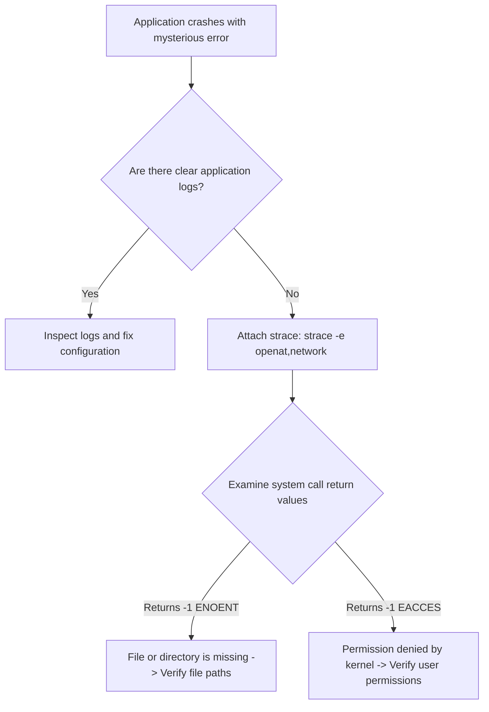

# Lesson 01: Linux Architectural Fundamentals & Kernel Anatomy

---

## 1. Lesson Metadata

* **Module:** Module 01 — Linux Fundamentals for Platform Engineers
* **Lesson:** Lesson 01 — Linux Architectural Fundamentals & Kernel Anatomy
* **Target Audience:** Future Platform Engineers & AI Infrastructure Engineers
* **Difficulty Level:** Beginner (80%) / Intermediate (20%)
* **Estimated Completion Time:** 45 minutes

---

## 2. Lesson Overview

Welcome to your very first lesson in Platform Engineering! 

In this lesson, we are going to explore the beautiful, elegant architecture of the Linux operating system. When you look at a modern computer or a massive cloud server, it can seem incredibly complex. But beneath the surface, Linux divides the entire world into two distinct, easy-to-understand realms: **User Space** (where your programs live) and **Kernel Space** (where the operating system manages the physical hardware).

By the end of this lesson, you will understand exactly how applications talk to hardware, why this strict boundary exists, and how you can look behind the scenes to watch this communication happen in real time!

---

## 3. Learning Objectives

By completing this lesson, you will be able to:
* **Explain** the fundamental difference between User Space and Kernel Space.
* **Describe** how hardware privilege rings (Ring 0 vs. Ring 3) protect the computer from crashing.
* **Define** what a System Call (`syscall`) is and explain its role as a secure bridge to the hardware.
* **Use** the `strace` command in the terminal to intercept and inspect real-time system calls made by everyday commands.

---

## 4. Prerequisites

To get the most out of this lesson, you only need:
* A basic curiosity about how operating systems work.
* Access to a standard Linux terminal (such as Ubuntu, a virtual machine, or Windows Subsystem for Linux - WSL).
* Zero prior systems engineering knowledge is assumed—we will learn everything together!

---

## 5. Why This Exists

Imagine a busy restaurant where hungry customers are allowed to walk directly into the kitchen, open the ovens, and grab food off the hot stoves. It wouldn't take long for someone to get burned, drop a dish, or shut down the entire kitchen!

Early computers worked exactly like this. Application programs had direct, unrestricted access to the computer's memory, hard drives, and CPU. If one user program crashed or made a tiny mistake in its calculations, it corrupted the physical memory, bringing down the entire machine and forcing a total system reboot.

To solve this chaos, modern operating systems put up a strict security wall. They divided the computer into two worlds: **User Space** (the dining room where your applications sit safely) and **Kernel Space** (the secure kitchen where the hardware operates). Now, when an application wants to save a file or send a network packet, it cannot touch the hardware directly. Instead, it places an order with a secure waiter—called a **System Call (`syscall`)**. The Linux kernel handles the heavy lifting safely behind the scenes, keeping your system perfectly stable and secure.

---

## 6. Core Concepts

### User Space vs. Kernel Space
* **User Space:** This is the playground where all your favorite applications run—your web browser, your text editor, your Python scripts, and your terminal window. Programs here run in a restricted sandbox. If a program in User Space crashes, it only kills itself; the rest of the computer keeps running perfectly!
* **Kernel Space:** This is the secure fortress of the operating system. The Linux kernel lives here. It is the master controller that has absolute, unrestricted access to your physical CPU, memory chips, hard drives, and network cards.

### Hardware Privilege Rings (Ring 0 vs. Ring 3)
Modern computer processors (CPUs) are physically wired with multiple levels of security called **Protection Rings**:
* **Ring 3 (Least Privileged):** This is where User Space applications run. If a Ring 3 program attempts to directly execute a dangerous hardware instruction (like shutting off a hard drive), the CPU immediately blocks it and throws an error.
* **Ring 0 (Most Privileged):** This is where the Linux kernel executes. In Ring 0, the code has absolute trust and can execute any hardware instruction on the machine.

### System Calls (`syscalls`)
Because User Space programs live in Ring 3, they cannot open files or send network messages on their own. When a program needs hardware assistance, it issues a **System Call (`syscall`)**. A system call is a polite request that pauses the User Space program, temporarily switches the CPU into Ring 0 (Kernel Space), performs the hardware action, and then hands the results back to the program in Ring 3.

---

## 7. Architecture

Here is a simple architectural map showing how an application talks to the hardware through the User Space / Kernel Space boundary:



---

## 8. Real-World Example

Let's look at how this plays out in a real-world production environment!

Imagine you are running a massive AI web application that saves user images to a hard drive. If fifty different users upload an image at the exact same millisecond, the web application doesn't have to worry about the exact physical spinning disks or memory blocks on the server. 

Each web worker simply makes a `write()` system call. The Linux kernel takes all fifty requests, organizes them safely in Kernel Space (Ring 0), and ensures that the images are cleanly written to the storage drive without any data corrupting or overwriting another user's file. The kernel acts as the ultimate traffic controller!

---

## 9. Hands-on Demonstration

Let's see how easy it is to look behind the curtain and watch system calls happen in real time using a wonderful tool called `strace` (system call tracer).

### Input
We will use the simple `echo` command to print "Hello Platform Engineering!" to the screen. But we will place `strace` right in front of it. `strace` will intercept every single system call the `echo` command makes to the Linux kernel and print it out for us to see!

### Code
```bash
# We use 'strace' to run 'echo' and watch its real-time communication with the Linux kernel.
# (Note: If strace is not installed, you can install it via 'sudo apt-get install strace').
strace echo "Hello Platform Engineering!"
```

### Expected Output
```text
execve("/usr/bin/echo", ["echo", "Hello Platform Engineering!"], 0x7ffd5342a310 /* 53 vars */) = 0
brk(NULL)                               = 0x55ca3b8e7000
arch_prctl(0x3001 /* ARCH_??? */, 0x7ffd5342a220) = -1 EINVAL (Invalid argument)
access("/etc/ld.so.preload", R_OK)      = -1 ENOENT (No such file or directory)
openat(AT_FDCWD, "/etc/ld.so.cache", O_RDONLY|O_CLOEXEC) = 3
fstat(3, {st_mode=S_IFREG|0644, st_size=55285, ...}) = 0
mmap(NULL, 55285, PROT_READ, MAP_PRIVATE, 3, 0) = 0x7f2cae5d9000
close(3)                                = 0
write(1, "Hello Platform Engineering!\n", 28) = 28
Hello Platform Engineering!
close(1)                                = 0
exit_group(0)                           = ?
+++ exited with 0 +++
```

### Explanation
Look at the incredible details in our output! Even though `echo` seems like a tiny, simple command, it made several system calls to the kernel:
1. `execve(...)`: This system call told the kernel to find the `echo` program on the hard drive and launch it into memory.
2. `openat(...)`: This opened underlying system libraries needed to run the command. `3` is the file descriptor number given back by the kernel.
3. `write(1, "Hello Platform Engineering!\n", 28)`: This is the magic moment! The `echo` program asked the kernel to write our 28-character string to file descriptor `1` (which stands for standard output, our terminal screen). 
4. `exit_group(0)`: The program politely told the kernel it was finished, and exited cleanly with a `0` (which means perfect success in Linux).

Notice how elegantly Linux handled all the heavy lifting behind the scenes!

---

## 10. Hands-on Lab

To reinforce your understanding of User Space, Kernel Space, and system calls, you will complete a dedicated, standalone practical laboratory.

### Lab Summary
In this lab, you will open your terminal and use `strace` to debug real-world scenarios. You will trace file creation, filter for specific system calls using the `-e` flag (such as `strace -e openat`), and observe how the kernel reports "file not found" errors (`ENOENT`).

### Lab Reference
For the complete step-by-step lab guide, please refer to the standalone lab document:
* **`labs/linux-automation.md`** *(Section 1: System Call Tracing)*

---

## 11. Production Notes

In a local learning environment, you might only run `strace` on quick, simple commands like `echo` or `cat`. But imagine running a massive production database at a major cloud company!

In production, Platform Engineers use system call tracing as a powerful diagnostic superpower. If a critical web server suddenly freezes or locks up, an engineer can attach `strace` to the running server process (using `strace -p <PID>`). Instantly, they can see exactly which system call is stuck—whether it's waiting on a slow network connection or trying to read a broken hard drive.

*(Where to learn more: We will explore advanced production tracing tools like eBPF and `bpftrace` in **Stage 4: Advanced Observability & Engineering Diagnostics**).*

---

## 12. Common Mistakes

When learning about the kernel and system calls, beginners often encounter a few common misconceptions:

* **Mistake 1: Thinking User Space programs can bypass the kernel.** 
  * *Correction:* Beginners sometimes believe that powerful root programs or Python scripts can talk directly to physical hardware. In reality, *every* Ring 3 program must use system calls. There is no bypassing the kernel!
* **Mistake 2: Running `strace` on high-traffic production servers without caution.**
  * *Correction:* While `strace` is an incredible tool, intercepting every single system call adds a tiny bit of delay to the program. In a learning environment, this delay is completely invisible. But on a production database serving 10,000 queries a second, running `strace` can slow things down! Always practice in a safe staging environment first.

---

## 13. Failure-Driven Learning

Let's perform a safe, instructive failure simulation in our terminal to understand how the Linux kernel protects itself and reports errors!

### Simulation
We will attempt to use `strace` to inspect the `cat` command opening a file that does not exist. We want to observe exactly how the kernel catches this mistake and reports the failure back to User Space.

### Code
```bash
# We use strace to filter only for 'openat' system calls while trying to read a fake file.
strace -e openat cat /invalid-fake-file.txt
```

### Expected Output
```text
openat(AT_FDCWD, "/etc/ld.so.cache", O_RDONLY|O_CLOEXEC) = 3
openat(AT_FDCWD, "/lib/x86_64-linux-gnu/libc.so.6", O_RDONLY|O_CLOEXEC) = 3
openat(AT_FDCWD, "/invalid-fake-file.txt", O_RDONLY) = -1 ENOENT (No such file or directory)
cat: /invalid-fake-file.txt: No such file or directory
+++ exited with 1 +++
```

### Explanation
Notice exactly what happened on the third line of our output! The `cat` program attempted to open `/invalid-fake-file.txt`. The kernel searched the hard drive, realized the file wasn't there, and returned `-1` along with the official kernel error code **`ENOENT`** (Error: No Official Entity / No such file or directory). 

The `cat` program took that kernel error, printed a human-friendly message to our screen, and exited with a `1` (which indicates an error). You just witnessed the exact moment the kernel protected the system from an invalid request!

---

## 14. Engineering Decisions

As a Platform Engineer, you will constantly make architectural trade-offs. Here is a foundational engineering decision related to the User Space / Kernel Space boundary:

### High-Level Languages vs. System Call Overhead
* **The Decision:** Should you write a high-performance network service in Python or in a lower-level systems language like Go or Rust?
* **The Trade-off:** High-level languages like Python are incredibly fast and pleasant for developers to write. However, they generate significantly more underlying system calls and memory overhead in User Space to accomplish simple tasks. For 95% of applications, Python is absolutely perfect! But for ultra-high-speed AI load balancers, Platform Engineers choose languages like Go or Rust because they manage system calls with extreme, lightweight efficiency.

---

## 15. Best Practices

Here are three actionable rules you should carry forward in your Platform Engineering career:

1. **Embrace `strace` for black-box debugging:** When an application fails with a mysterious error and leaves no log files, use `strace` to see exactly which file or network socket it failed to open.
2. **Understand the Ring 0 boundary:** Always remember that anything running in Kernel Space has absolute access to your system. Only install trusted kernel modules or drivers!
3. **Check exit codes:** After running a command, remember that an exit code of `0` means the underlying system calls succeeded perfectly, while anything higher (like `1`) indicates a kernel or application exception.

---

## 16. Troubleshooting Guide

When diagnosing application behavior on a Linux machine, follow this structured troubleshooting workflow:



### Common Troubleshooting Scenarios
* **Problem:** An application instantly crashes upon startup but prints no error message.
  * **Cause:** It is likely failing to locate a required configuration file on disk.
  * **Diagnosis:** Run `strace -e openat <command>` to isolate file open attempts.
  * **Solution:** Look for the `-1 ENOENT` line in the output, identify the missing file path, and create the required configuration file.
* **Problem:** An application works perfectly on your coworker's machine but fails on yours.
  * **Cause:** A difference in underlying file permissions or environment libraries.
  * **Diagnosis:** Run `strace <command>` and look for `-1 EACCES` (Error: Access Denied).
  * **Solution:** Adjust the file ownership or permissions so the kernel grants access.

---

## 17. Summary

Let's review the elegant concepts we have mastered in this lesson:
* **Two Distinct Worlds:** Linux secures the computer by separating **User Space** (the restricted sandbox where applications live) from **Kernel Space** (the trusted fortress where the operating system manages physical hardware).
* **Protection Rings:** CPUs enforce this security using hardware privilege levels. Applications run in **Ring 3**, while the kernel executes with absolute power in **Ring 0**.
* **System Calls:** When an application needs to touch hardware (like writing to a screen or saving a file), it cannot do so directly. It places a secure request called a **System Call (`syscall`)** to the kernel.
* **Superpower Debugging:** Using `strace`, we can look behind the curtain at any time to watch this beautiful real-time communication between our applications and the Linux kernel!

---

## 18. Cheat Sheet

Here is your quick-reference summary for Linux architectural concepts and system call tracing:

| Concept / Command | Quick Definition | Practical Use Case |
| :--- | :--- | :--- |
| **User Space (Ring 3)** | Restricted sandbox for user programs | Running Python, bash, web browsers |
| **Kernel Space (Ring 0)** | Trusted OS layer managing hardware | Executing device drivers, CPU allocation |
| **System Call (`syscall`)** | Secure bridge between User and Kernel space | `openat()`, `write()`, `read()`, `execve()` |
| `strace <command>` | Traces all system calls made by a command | Deep debugging of failing applications |
| `strace -e openat <cmd>` | Filters output to only show file open requests | Finding missing configuration files |
| `strace -p <PID>` | Attaches to an already-running process | Diagnosing a frozen production server |

### Standalone Cheat Sheet Reference
For a comprehensive, downloadable reference card of all Linux system calls and debugging flags, please check our standalone cheat sheet directory:
* **`cheatsheets/linux-architecture.md`**

---

## 19. Knowledge Check

To verify your comprehension of User Space, Kernel Space, and `strace` mechanics, please test your knowledge using our standalone self-assessment quiz.

### Quiz Reference
You can find the complete interactive quiz here:
* **`quizzes/linux-fundamentals.md`** *(Section 1: Architecture & Syscalls)*

---

## 20. Interview Preparation

Understanding the User Space / Kernel Space boundary is one of the most common topics in Platform Engineering job interviews! Here is how to answer questions across three depth tiers:

### Tier 1: Foundation (Beginner)
* **Question:** What is the difference between User Space and Kernel Space in Linux?
* **Answer:** User Space is a restricted sandbox where normal user applications run. Kernel Space is the protected, privileged area of memory where the core operating system executes and interacts directly with physical hardware.

### Tier 2: Implementation (Intermediate)
* **Question:** If a User Space application cannot touch hardware directly, how does it save a file to a hard drive?
* **Answer:** It executes a System Call (`syscall`), such as `write()`. This initiates a context switch, temporarily elevating the CPU from Ring 3 to Ring 0. The Linux kernel securely processes the file operation on the underlying hardware and returns the success code back to the application in User Space.

### Tier 3: Production/Scale (Advanced)
* **Question:** How would you diagnose a compiled binary application that is crashing on startup with zero log output?
* **Answer:** I would execute the binary using `strace` to trace its system calls, specifically filtering for file lifecycle events using `strace -e openat,access`. I would examine the execution trace for failing return codes such as `-1 ENOENT` (file not found) or `-1 EACCES` (permission denied) to pinpoint the exact missing dependency or configuration file causing the crash.

---

## 21. Further Reading

To expand your expertise in Linux kernel architecture and system debugging, explore these highly recommended external resources:
* **Book:** *Linux Kernel Development* by Robert Love (Excellent, approachable overview of kernel internals).
* **Article:** *The Linux Programming Interface* by Michael Kerrisk (The definitive bible on Linux system calls).
* **Online Reference:** [Brendan Gregg's Linux Syscall Tracing Guide](https://www.brendangregg.com) (World-class performance engineering insights).
