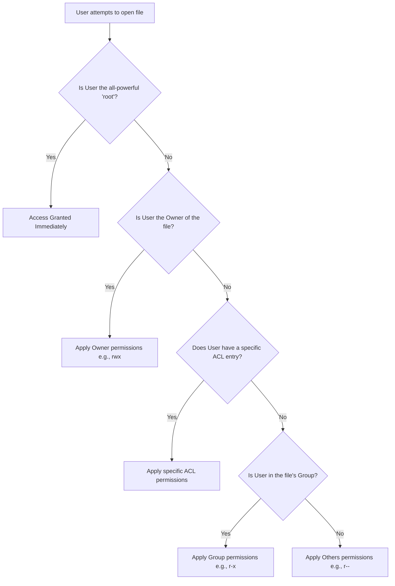
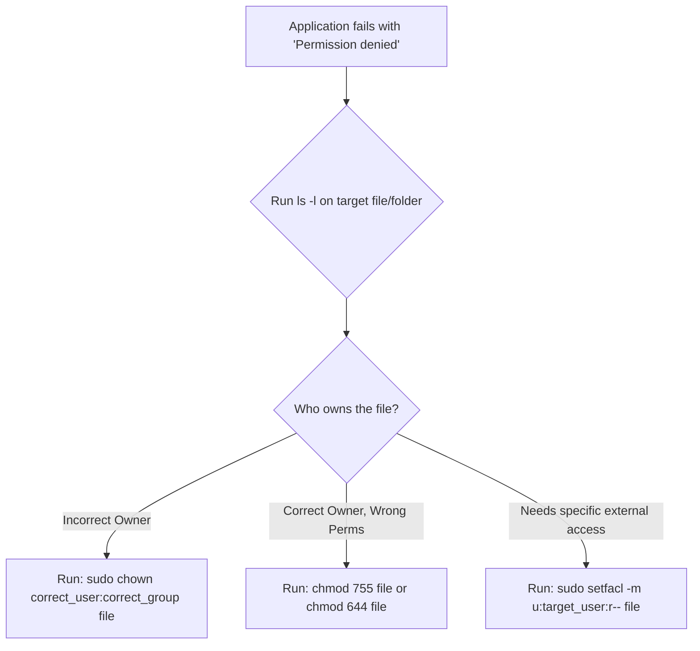

# Lesson 02: User, Group, and Permission Management (DAC & RBAC)

---

## 1. Lesson Metadata

* **Module:** Module 01 — Linux Fundamentals for Platform Engineers
* **Lesson:** Lesson 02 — User, Group, and Permission Management (DAC & RBAC)
* **Target Audience:** Future Platform Engineers & AI Infrastructure Engineers
* **Difficulty Level:** Beginner (80%) / Intermediate (20%)
* **Estimated Completion Time:** 45 minutes

---

## 2. Lesson Overview

Welcome back to your Linux fundamentals journey! In Lesson 01, we explored how the Linux kernel protects physical hardware by separating User Space from Kernel Space. Now, we are going to look at how Linux protects our files and directories from other users.

Have you ever wondered how fifty different engineers can log into the same cloud server without accidentally deleting each other's work? Or how a database service keeps its data completely hidden from regular users?

In this lesson, we will explore the elegant security rulebook known as **Discretionary Access Control (DAC)**. You will learn how to read permission flags (`rwx`), calculate octal numbers (`755`, `644`), share files securely using Access Control Lists (ACLs), and safely manage administrative powers using `sudo`.

---

## 3. Learning Objectives

By completing this lesson, you will be able to:
* **Explain** how Discretionary Access Control (DAC) secures files using Owner, Group, and Other boundaries.
* **Interpret** symbolic permission strings (e.g., `-rwxr-xr-x`) and convert them into octal numbers (`755`).
* **Manage** file ownership and permissions using `chown`, `chmod`, and `umask`.
* **Configure** fine-grained sharing using Access Control Lists (`setfacl` and `getfacl`).
* **Describe** how `sudo` safely delegates administrative privileges without sharing the master root password.

---

## 4. Prerequisites

To be fully prepared for this lesson, you should have:
* Completed **[Lesson 01: Linux Architectural Fundamentals & Kernel Anatomy](lesson-01.md)**.
* An active Linux terminal session to practice commands.
* Assume only what we learned in Lesson 01—we will build the rest of our intuition together!

---

## 5. Why This Exists

Imagine living in a massive apartment building where none of the doors have locks. Anyone could wander into your apartment, borrow your clothes, or accidentally throw away your favorite books! 

Early single-user computer systems worked like this. Whoever turned on the machine had complete access to every file on the hard drive. But Linux was designed from the very beginning to be a **multi-user operating system**. On a modern cloud server, you might have developers, site reliability engineers, automated deployment scripts, and database services all sharing the exact same filesystem simultaneously.

To prevent utter chaos, Linux implements a strict locking mechanism called **Discretionary Access Control (DAC)**. Every file and folder gets a secure digital lockbox. The creator of the file gets to decide exactly who is allowed to read it, who is allowed to edit it, and who is allowed to execute it. This ensures that a bug in a web server cannot accidentally wipe out your secure database files!

---

## 6. Core Concepts

### Discretionary Access Control (DAC)
In Linux, every file and directory is assigned two specific ownership labels when it is created:
* **The Owner (User - `u`):** The specific individual account that created the file.
* **The Group (`g`):** A collection of user accounts (like `developers` or `security`) that need shared access.
* **Others (`o`):** Everyone else on the system who is neither the Owner nor a member of the Group (the general public).

### The Permission Trio: Read, Write, Execute (`rwx`)
Linux assigns three specific permissions to each of the three ownership categories (Owner, Group, Others):
* **Read (`r`):** For a file, this allows you to view its contents. For a directory, it allows you to list the files inside it (like running `ls`).
* **Write (`w`):** For a file, this allows you to modify or delete its contents. For a directory, it allows you to add or remove files inside it.
* **Execute (`x`):** For a file, this allows you to run it as a program or script. For a directory, it allows you to "enter" the directory (like running `cd`).

### Octal Permissions (The Numbers)
Platform Engineers love speed and efficiency! Instead of typing out long strings of letters like `rwxr-xr-x`, we use simple three-digit numbers called **Octal Permissions**. Each permission has a numerical value:
* **Read (`r`) = 4**
* **Write (`w`) = 2**
* **Execute (`x`) = 1**

To find the permission number for a user, you simply add the numbers together!
* `rwx` = 4 + 2 + 1 = **7** (Full access!)
* `rw-` = 4 + 2 + 0 = **6** (Read and write, but not execute)
* `r-x` = 4 + 0 + 1 = **5** (Read and execute, but not write)
* `r--` = 4 + 0 + 0 = **4** (Read-only)

When you see a permission number like **`755`**, it simply means: Owner gets `7` (`rwx`), Group gets `5` (`r-x`), and Others get `5` (`r-x`).

### Access Control Lists (ACLs)
Standard DAC permissions are wonderful, but what if you want to share a file with *one specific coworker* without giving access to the entire Group or Others? Linux solves this using **Access Control Lists (ACLs)**. Using commands like `setfacl`, you can attach a special digital VIP pass to a file for a specific user!

### Sudo & Principle of Least Privilege
The `root` account in Linux is the all-powerful master account. It bypasses all permission checks completely. Sharing the root password with fifty engineers is incredibly dangerous! Instead, Linux uses **`sudo` (SuperUser DO)**. `sudo` allows regular users to execute specific administrative commands using their own password, creating a perfect security audit trail.

---

## 7. Architecture

Here is a clear structural diagram showing how Linux evaluates permissions when a user attempts to open a file:



---

## 8. Real-World Example

Let's look at how this operates in a real-world production environment!

Imagine you are managing a secure cloud server hosting a company's financial records. You have an automated Python billing script (`billing.py`) and a secure data directory (`/var/finance`). 

Using Linux permissions, you set the owner of `billing.py` to a dedicated service account called `finance-svc` with permissions `700` (`rwx------`). This ensures that no human developer or external web application can execute, view, or tamper with the billing logic. The Linux kernel guarantees absolute financial isolation!

---

## 9. Hands-on Demonstration

Let's open our terminal and see how easy it is to inspect file permissions, change them using octal numbers, and attach a special ACL pass for a specific user!

### Input
We will create a new file called `script.sh`, inspect its default permissions using `ls -l`, make it executable using `chmod 755`, and then use `setfacl` to grant read-only access to a specific guest user.

### Code
```bash
# 1. Let's create an empty script file.
touch script.sh

# 2. We use 'ls -l' (long listing) to view the default permissions and ownership.
ls -l script.sh

# 3. Let's update the permissions to 755 (Owner: rwx, Group: r-x, Others: r-x).
chmod 755 script.sh

# 4. Let's verify our new permissions.
ls -l script.sh

# 5. Now, let's attach a special Access Control List (ACL) granting read-only access to 'guest_user'.
# (Note: 'u:guest_user:r--' means User: guest_user gets read-only permissions).
sudo setfacl -m u:guest_user:r-- script.sh

# 6. We use 'getfacl' to inspect the detailed ACL rules attached to our file.
getfacl script.sh
```

### Expected Output
```text
-rw-r--r-- 1 aloysius developers 0 Jun 28 02:15 script.sh
-rwxr-xr-x 1 aloysius developers 0 Jun 28 02:15 script.sh

# file: script.sh
# owner: aloysius
# group: developers
user::rwx
user:guest_user:r--
group::r-x
mask::r-x
other::r-x
```

### Explanation
Look at how beautifully Linux tracks our changes! 
1. When we first ran `ls -l`, Linux showed `-rw-r--r--`. The very first `-` means it is a regular file. `rw-` means the owner (`aloysius`) can read and write. `r--` means the group (`developers`) and others can only read.
2. When we executed `chmod 755`, the string instantly changed to `-rwxr-xr-x`. Now the file is fully executable!
3. Finally, when we ran `getfacl`, Linux displayed the special VIP rule `user:guest_user:r--`. Even if `guest_user` is not in the `developers` group, the kernel will securely grant them read-only access to our script!

---

## 10. Hands-on Lab

To solidify your mastery of Linux permissions, `chmod`, and ACLs, you will complete a dedicated, standalone practical laboratory.

### Lab Summary
In this lab, you will navigate your terminal to create secure project directories, configure shared group folders using the `setgid` bit, and practice locking down sensitive configuration files to protect them from unauthorized users.

### Lab Reference
For the complete step-by-step lab guide, please refer to the standalone lab document:
* **`labs/linux-automation.md`** *(Section 2: Permission Management & ACLs)*

---

## 11. Production Notes

In a local learning environment, you might be used to running `sudo` for almost everything or setting permissions to `777` (world-readable, writable, executable) just to make things work. But in an enterprise cloud environment, doing this is a severe security risk!

In production, Platform Engineers operate under the **Principle of Least Privilege**. Every service, container, and engineer is granted *only* the precise minimum permissions needed to do their specific job. When configuring enterprise servers, engineers use automated configuration management (like Ansible or Terraform) to ensure sensitive files like private SSH keys or database passwords are hard-locked to `600` (`rw-------`).

*(Where to learn more: We will explore automated infrastructure security hardening in **Stage 3: Cloud & Infrastructure Automation**).*

---

## 12. Common Mistakes

When mastering Linux permissions, beginners frequently run into a few common pitfalls:

* **Mistake 1: Using `chmod 777` to fix permission errors.** 
  * *Correction:* When an application fails with "Permission Denied," beginners are tempted to run `chmod 777 <file>`. This gives every user and automated bot on the server complete power to edit or delete the file! Instead, use `ls -l` to see who owns the file and grant precise ownership using `chown` or `chmod 755`.
* **Mistake 2: Forgetting that directory execution (`x`) is required for navigation.**
  * *Correction:* If you remove the execute (`x`) permission from a directory (e.g., `chmod 644 my_folder`), you will suddenly find that you cannot `cd` into it! In Linux, directory execution is the permission that allows you to pass through the folder doors.

---

## 13. Failure-Driven Learning

Let's perform a safe, instructive failure simulation in our terminal to observe how Linux protects sensitive files from unauthorized users!

### Simulation
We will attempt to read a highly sensitive system file (`/etc/shadow`, where Linux stores encrypted user passwords) as a regular, non-root user. We want to observe how the kernel blocks us and how `sudo` elevates our privileges.

### Code
```bash
# 1. We attempt to read the secure password shadow file as a regular user.
cat /etc/shadow

# 2. Now, we use 'sudo' to request temporary root privileges to read the first line.
sudo head -n 1 /etc/shadow
```

### Expected Output
```text
cat: /etc/shadow: Permission denied
root:$6$xyz...encrypted_hash...:19500:0:99999:7:::
```

### Explanation
Notice exactly what happened! When we ran `cat /etc/shadow`, the Linux kernel inspected our user badge, saw that we were a regular user in User Space (Ring 3), and instantly rejected us with **`Permission denied`**. 

But when we placed `sudo` in front of the command, Linux checked the secure `/etc/sudoers` rulebook, verified our identity, and temporarily granted us administrative powers to cleanly read the first line of the file. You just witnessed the Principle of Least Privilege in action!

---

## 14. Engineering Decisions

As a Platform Engineer, you will make architectural trade-offs regarding access control models:

### Discretionary Access Control (DAC) vs. Role-Based Access Control (RBAC)
* **The Decision:** Should you manage server security using traditional Linux file permissions (DAC) or implement enterprise Role-Based Access Control (RBAC)?
* **The Trade-off:** Traditional Linux DAC is incredibly fast, simple, and built directly into the filesystem. However, on a massive cloud platform with 5,000 engineers, managing individual file groups becomes unmanageable. For single virtual machines, DAC is perfect! But for massive cloud platforms (like Kubernetes), Platform Engineers implement RBAC, where access is dynamically assigned based on a user's corporate job title (e.g., `Senior SRE`).

---

## 15. Best Practices

Here are three actionable rules you should embed in your daily engineering habits:

1. **Never log in directly as root:** Always log in as a regular user and use `sudo` for specific administrative tasks to maintain a clean security audit log.
2. **Audit your permissions regularly:** Use `ls -la` to inspect hidden files and ensure sensitive configuration scripts do not have world-writable (`777`) permissions.
3. **Use ACLs for temporary exceptions:** Rather than creating messy, ad-hoc user groups, use `setfacl` to grant temporary access to specific coworkers or service accounts.

---

## 16. Troubleshooting Guide

When diagnosing permission issues on a Linux system, follow this structured troubleshooting workflow:



### Common Troubleshooting Scenarios
* **Problem:** A web server process cannot read a newly uploaded website image.
  * **Cause:** The file was uploaded by a developer and has permissions `600` (readable only by the developer).
  * **Diagnosis:** Run `ls -l <image_file>` to inspect the current permissions and owner.
  * **Solution:** Run `chmod 644 <image_file>` to grant read-only access to the web server (Others).
* **Problem:** You cannot `cd` into a directory created by your coworker.
  * **Cause:** The directory is missing the execute (`x`) bit for group members.
  * **Diagnosis:** Run `ls -ld <directory>` and look for `drw-rw-r--`.
  * **Solution:** Run `chmod g+x <directory>` to add directory execution for the group.

---

## 17. Summary

Let's review the powerful access control concepts we have mastered in this lesson:
* **Discretionary Access Control (DAC):** Linux protects files by assigning every file an **Owner**, a **Group**, and **Others**.
* **The Permission Trio:** Every file has digital locks for **Read (`r`)**, **Write (`w`)**, and **Execute (`x`)**.
* **Octal Math:** We can rapidly calculate permissions using numbers (`r=4`, `w=2`, `x=1`), where **`755`** means full owner access and read/execute for everyone else.
* **Access Control Lists (ACLs):** Using `setfacl`, we can attach fine-grained VIP passes to files for specific users without breaking group rules.
* **Safe Administration:** Using `sudo`, we can securely execute administrative commands without sharing the highly dangerous master root password.

---

## 18. Cheat Sheet

Here is your quick-reference summary for Linux permission management and octal math:

| Command / Concept | Numerical Value | Practical Meaning / Use Case |
| :--- | :--- | :--- |
| **Read (`r`)** | `4` | View file contents / list directory contents |
| **Write (`w`)** | `2` | Edit file contents / add files to directory |
| **Execute (`x`)** | `1` | Run script as program / `cd` into directory |
| `chmod 755 <file>` | `rwxr-xr-x` | Standard permission for executable scripts |
| `chmod 644 <file>` | `rw-r--r--` | Standard permission for configuration files |
| `chmod 600 <file>` | `rw-------` | High-security permission for private SSH keys |
| `chown user:group <file>` | N/A | Changes the Owner and Group of a file |
| `setfacl -m u:user:rwx <file>`| N/A | Attaches an ACL pass for a specific user |

### Standalone Cheat Sheet Reference
For a complete, downloadable reference card of Linux permissions, `umask` calculations, and ACL flags, please check our standalone cheat sheet directory:
* **`cheatsheets/linux-permissions.md`**

---

## 19. Knowledge Check

To verify your comprehension of octal permissions, `chmod`, and `sudo` mechanics, please test your knowledge using our standalone self-assessment quiz.

### Quiz Reference
You can find the complete interactive quiz here:
* **`quizzes/linux-fundamentals.md`** *(Section 2: Permission Management & ACLs)*

---

## 20. Interview Preparation

Linux permission management is a foundational topic in Platform Engineering technical interviews! Here is how to answer questions across three depth tiers:

### Tier 1: Foundation (Beginner)
* **Question:** What does the permission string `755` mean on a Linux file?
* **Answer:** `755` is an octal permission representation. The first digit `7` (`4+2+1`) grants the Owner read, write, and execute permissions. The second digit `5` (`4+1`) grants the Group read and execute permissions. The third digit `5` grants Others read and execute permissions.

### Tier 2: Implementation (Intermediate)
* **Question:** How would you grant a specific service account read access to a configuration file without changing the file's owner or opening access to the general public?
* **Answer:** I would implement an Access Control List (ACL) rule using the `setfacl` command. Specifically, I would execute `setfacl -m u:<service_account>:r-- <file>`. This securely attaches a specific user access rule to the file's inode without altering traditional DAC group or other boundaries.

### Tier 3: Production/Scale (Advanced)
* **Question:** In an enterprise environment, why is running `chmod 777` considered an unacceptable practice, and how do you enforce secure defaults?
* **Answer:** `chmod 777` grants world-writable and executable permissions, violating the Principle of Least Privilege and exposing the file to tampering or execution by any compromised unprivileged process on the system. To enforce secure defaults at scale, I ensure appropriate `umask` configuration (such as `027` or `077`) in system profiles and utilize infrastructure-as-code tooling (like Ansible or Terraform) to maintain strict ownership and `644`/`600` permission states on all deployed assets.

---

## 21. Further Reading

To expand your expertise in Linux systems security and access control models, explore these highly recommended external resources:
* **Book:** *Practical Linux Security Cookbook* by Tajinder Kalsi (Outstanding hands-on security practices).
* **Article:** *Linux ACL (Access Control List) Guide* on the Arch Linux Wiki (Detailed breakdown of ACL mechanics).
* **Online Reference:** [Red Hat Enterprise Linux System Administration Guide - Managing Permissions](https://access.redhat.com/documentation) (Industry-standard administration practices).
