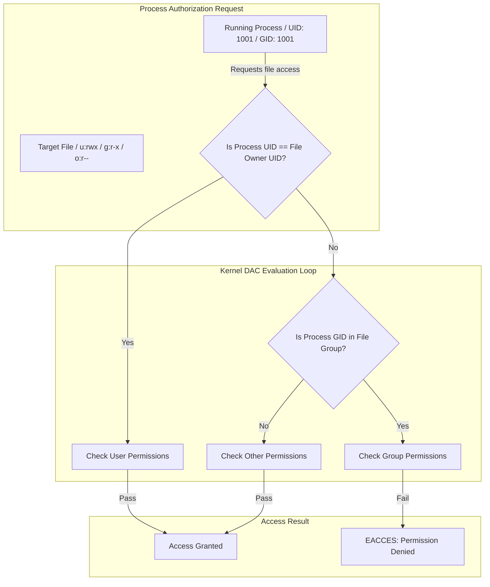

# MOD-LINUX-02: User, Group, and Permission Management (DAC & RBAC)

Version: 1.0.0

---

# Lesson Metadata

* **Lesson ID:** MOD-LINUX-02
* **Module:** Linux Fundamentals for Platform Engineers
* **Difficulty:** Beginner
* **Estimated Duration:** 45 minutes
* **Learning Track:** 🟢 Core / 🔵 Professional / 🟣 Expert
* **Version:** 1.0.0
* **Last Updated:** 2026-06-28

---

# Lesson Overview

This lesson explores how Linux manages identity, privilege authorization, and file access control. In platform engineering, least-privilege identity governance is the cornerstone of secure container execution, CI/CD pipeline automation, and zero-trust internal developer platforms.

---

# Learning Objectives

By the end of this lesson, you will be able to:

* Configure Discretionary Access Control (DAC) file permissions using octal and symbolic notation.
* Implement granular Access Control Lists (ACLs) for multi-tenant file sharing.
* Secure administrative escalation privileges using `/etc/sudoers` and `visudo`.

---

# Prerequisites

* Completion of `MOD-LINUX-01`.
* Access to a Linux terminal environment.

---

# Why This Exists

Early multi-user operating systems suffered from a lack of secure file boundary enforcement. If one user created a sensitive file, any other user logged into the same minicomputer could read, modify, or delete it.

To resolve this vulnerability, Linux adopted the Unix security model of Discretionary Access Control (DAC). Every file on the filesystem is owned by a specific User (UID) and Group (GID), accompanied by strict permission bits governing Read, Write, and Execute operations. This architecture ensures that unprivileged users cannot compromise core system binaries or access neighboring users' data.

---

# Core Concepts

## Discretionary Access Control (DAC)
Linux evaluates access based on three distinct entities:
* **User (`u`):** The individual owner of the file.
* **Group (`g`):** The designated group ownership assigned to the file.
* **Others (`o`):** Every other user on the system not matching the owner or group.

## Permission Bits (Octal Notation)
* **Read (`r` / `4`):** Permission to view file contents or list directory contents.
* **Write (`w` / `2`):** Permission to modify file contents or add/delete files within a directory.
* **Execute (`x` / `1`):** Permission to run a file as a program or traverse into a directory.

## Special Permission Flags
* **SUID (`4000`):** Executes binary with the privileges of the file owner (e.g., `/usr/bin/passwd`).
* **SGID (`2000`):** New files created in a directory inherit the directory's group ownership.
* **Sticky Bit (`1000`):** Only the file owner or root can delete files within the directory (e.g., `/tmp`).

---

# Architecture



---

# Real-World Example

When running a containerized microservice using Docker or Kubernetes, running processes inside the container as the default `root` user (`UID 0`) introduces catastrophic security risks. If an attacker discovers a container breakout vulnerability, they escape onto the underlying Kubernetes worker node as `root`.

Professional platform engineers enforce a strict `securityContext` in Kubernetes, mandating `runAsUser: 10001` and `runAsNonRoot: true`. Understanding underlying Linux DAC mechanisms allows you to properly configure container volume mount permissions (`fsGroup`) so that the unprivileged containerized process can successfully read and write to persistent storage without throwing fatal `EACCES` errors.

---

# Hands-on Demonstration

Let's observe how Linux evaluates Discretionary Access Control (DAC) by creating a file and restricting its permission bits.

## Input
We create a sensitive configuration file, modify its permission bits to `0600` (read/write by owner only), and attempt to read it as an unprivileged secondary user.

## Code
```bash
# Create file as root or primary user
echo "DB_PASSWORD=SuperSecretPass" > /tmp/db_secret.conf
chmod 0600 /tmp/db_secret.conf

# Verify permissions
ls -l /tmp/db_secret.conf

# Attempt to read as an unprivileged user 'nobody'
sudo -u nobody cat /tmp/db_secret.conf
```

## Expected Output
```text
-rw------- 1 primary_user primary_user 30 Jun 28 00:55 /tmp/db_secret.conf
cat: /tmp/db_secret.conf: Permission denied
```

## Explanation
The kernel evaluates the `cat` process spawned by user `nobody`. It verifies that `nobody` is not the file owner (`primary_user`) and does not belong to the file's group. It drops to the `Others` permission bits (`---`), instantly halting execution and returning an `EACCES (Permission denied)` error to User Space.

---

# Hands-on Lab

* **Objective:** Implement granular multi-tenant shared directory access using Access Control Lists (ACLs) and Set-GID (SGID).
* **Estimated Time:** 20 minutes
* **Difficulty:** Beginner
* **Environment:** Any Linux terminal.

## Step-by-step Instructions

1. Create a shared engineering directory:
   ```bash
   sudo mkdir -p /var/shared/engineering
   sudo groupadd -f eng_group
   sudo chown root:eng_group /var/shared/engineering
   ```
2. Enable Set-GID (SGID) so all new files inherit `eng_group`:
   ```bash
   sudo chmod 2775 /var/shared/engineering
   ```
3. Set an ACL granting specific read access to an external auditor user (`backup_user`):
   ```bash
   sudo useradd -m backup_user
   sudo setfacl -m u:backup_user:r-x /var/shared/engineering
   ```

## Verification
Execute `getfacl /var/shared/engineering` to verify the explicit ACL rules and SGID flag.

## Troubleshooting
* **Symptom:** `setfacl: Operation not supported`
  * **Cause:** The underlying filesystem mount option lacks `acl` support.
  * **Solution:** Remount the filesystem with ACL enabled (`sudo mount -o remount,acl /`).

## Cleanup
```bash
sudo rm -rf /var/shared/engineering
sudo userdel -r backup_user
```

---

# Production Notes

In enterprise platform engineering, local manual Linux user accounts (`/etc/passwd`) are an anti-pattern. Maintaining hundreds of standalone servers with local SSH keys creates massive audit and compliance vulnerabilities. Senior engineers integrate Linux servers with centralized Identity Providers (IdPs) via OpenLDAP, Kerberos, or HashiCorp Vault SSH dynamic certificate engines to manage ephemeral access dynamically.

---

# Common Mistakes

* **Abusing `chmod 777`:** When encountering a `Permission denied` error, beginners often execute `chmod 777` to force the application to work. This exposes the file to world-writable exploitation. Always isolate the exact UID/GID executing the process and grant least-privilege access.
* **Directly Editing `/etc/sudoers`:** Beginners edit `/etc/sudoers` directly with `nano` or `vim`. If a syntax error is introduced, all administrative `sudo` escalation is permanently broken. Always use `visudo`, which locks the file and validates syntax before saving.

---

# Failure-Driven Learning

Let's observe how misconfiguring directory traversal permissions breaks file access, even if the file itself is world-readable.

## The Failure
We create a world-readable file inside a directory where the execute (`x`) traversal bit has been removed.

```bash
mkdir -p /tmp/locked_dir
echo "Data" > /tmp/locked_dir/public.txt
chmod 0644 /tmp/locked_dir/public.txt

# Remove execute (traversal) permission from directory
chmod 0600 /tmp/locked_dir

# Attempt to read the world-readable file inside
cat /tmp/locked_dir/public.txt
```

## Expected Output
```text
cat: /tmp/locked_dir/public.txt: Permission denied
```

## Diagnosis & Recovery
To diagnose this, senior engineers inspect the full directory path using `namei -mo /tmp/locked_dir/public.txt`. The output reveals that `/tmp/locked_dir` lacks the `x` (traverse) bit. Recover by executing `chmod 0700 /tmp/locked_dir`.

---

# Engineering Decisions

When architecting shared build servers or jump hosts, you must decide between standard Linux DAC/ACLs and Mandatory Access Control (MAC) systems like SELinux or AppArmor.
* **DAC / ACLs:** Highly flexible, easy to configure, and broadly understood, but relies on users exercising good security discretion.
* **MAC (SELinux / AppArmor):** Enforces strict kernel-level security policies regardless of user file permissions, preventing container breakout and 0-day exploitation, but introduces complex policy management overhead.

---

# Best Practices

* **Audit SUID Binaries Regularly:** Keep track of files with SUID bits set using `find / -perm /4000 -print`, as these represent potential privilege escalation vectors.
* **Enforce `sudo` Principle of Least Privilege:** When granting `sudo` access in `visudo`, never use `ALL=(ALL:ALL) ALL`. Specify the exact binary path required (e.g., `app_user ALL=(root) NOPASSWD: /usr/bin/systemctl restart app.service`).

---

# Troubleshooting Guide

## Issue 1: Unprivileged User Cannot Start Service on Port 80 or 443

* **Cause:** Linux strictly reserves network ports below `1024` (privileged ports) for `root` execution only.
* **Diagnosis:** Inspect application startup logs for `bind: Permission denied` or `EACCES` on port 80/443.
* **Solution:** Do not run the application as `root`. Instead, grant the specific binary the `CAP_NET_BIND_SERVICE` Linux capability using `sudo setcap 'cap_net_bind_service=+ep' /usr/bin/my_app`.

---

# Summary

Mastering Linux user, group, and permission governance enables platform engineers to enforce bulletproof security boundaries across infrastructure. By combining DAC permission bits, ACLs, and strict `sudoers` rules, you ensure that running workloads adhere strictly to the principle of least privilege.

---

# Cheat Sheet

| Command | Purpose | Example |
| :--- | :--- | :--- |
| `chmod <mode> <file>` | Modify file permission bits | `chmod 0755 script.sh` |
| `chown <user>:<group> <file>`| Change file ownership | `chown app_user:app_group data/` |
| `visudo` | Safely edit `/etc/sudoers` | `sudo visudo` |
| `getfacl <file>` | Display access control lists | `getfacl shared_dir/` |
| `setfacl -m u:<user>:<perm>`| Add or modify ACL rule | `setfacl -m u:dev_user:rwx file` |

---

# Knowledge Check

To test your mastery of Linux permissions and ACLs, review the dedicated questions in `quizzes/quiz-linux-01.md`.

---

# Interview Preparation

## Beginner Questions
* What do the permission bits `0755` and `0600` represent in octal notation?

## Intermediate Questions
* Explain the purpose of the SUID, SGID, and Sticky bits on a Linux filesystem.

## Advanced Questions
* How do Linux Capabilities (e.g., `CAP_NET_BIND_SERVICE`) improve upon the traditional SUID binary security model?

## Scenario-Based Discussions
* **Scenario:** A developer complains that they cannot read a log file located at `/var/log/myapp/app.log`, even though `ls -l /var/log/myapp/app.log` shows `-rw-r--r--`. How would you troubleshoot this?
* **Key Talking Points:** Explain that directory traversal requires execute (`x`) permissions on every parent directory in the path. Mention utilizing `namei -mo /var/log/myapp/app.log` to quickly verify permissions across the entire directory tree.

---

# Further Reading

1. [man chmod(1)](https://man7.org/linux/man-pages/man1/chmod.1.html)
2. [man acl(5)](https://man7.org/linux/man-pages/man5/acl.5.html)
3. [man sudoers(5)](https://man7.org/linux/man-pages/man5/sudoers.5.html)
4. [man capabilities(7)](https://man7.org/linux/man-pages/man7/capabilities.7.html)
