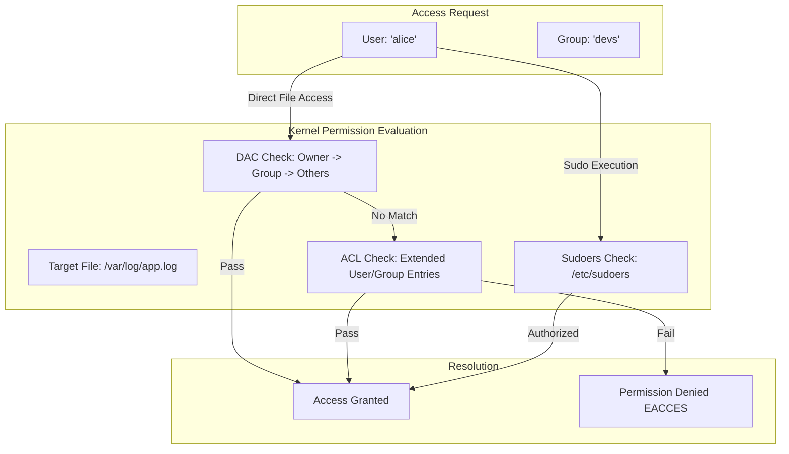

# MOD-LINUX-02: User, Group, and Permission Management (DAC & RBAC)

Version: 1.0.0

---

# Lesson Metadata

* **Lesson ID:** MOD-LINUX-02
* **Module:** Linux Fundamentals for Platform Engineers
* **Difficulty:** Beginner to Intermediate
* **Estimated Duration:** 45 minutes
* **Learning Track:** 🟢 Core / 🔵 Professional / 🟣 Expert
* **Version:** 1.0.0
* **Last Updated:** 2026-06-28

---

# Lesson Overview

This lesson covers the core mechanisms of Linux security governance: Discretionary Access Control (DAC), file permission bits, Access Control Lists (ACLs), and the configuration of privileged execution via `sudoers`. You will learn how to secure filesystems and implement least-privilege role-based access.

---

# Learning Objectives

By the end of this lesson, you will be able to:

* Calculate and apply octal and symbolic file permissions using `chmod` and `chown`.
* Configure fine-grained access control using Access Control Lists (`setfacl`, `getfacl`).
* Enforce least-privilege administration by configuring secure `/etc/sudoers` rules.

---

# Prerequisites

* Basic understanding of Linux directory navigation (`ls`, `cd`).
* Completion of `MOD-LINUX-01`.

---

# Why This Exists

In early computing, multi-user systems faced the immediate threat of users reading or modifying each other's private files. Linux adopted the Unix Discretionary Access Control (DAC) model, which assigns an owner and a group to every filesystem object. 

As enterprise computing evolved, the standard `User/Group/Others` triad proved too inflexible for complex organizations. Access Control Lists (ACLs) and `sudo` were introduced to provide granular, least-privilege security governance without sharing the root password.

---

# Core Concepts

## Discretionary Access Control (DAC)
Every file and directory in Linux possesses an owner (User) and a Group. Access is determined by three sets of permission bits:
* **User (u):** Permissions for the file owner.
* **Group (g):** Permissions for members of the file's group.
* **Others (o):** Permissions for anyone else on the system.

## Permission Bits (Octal & Symbolic)
Permissions are represented symbolically (`rwx`) or as octal numbers:
* `r` (Read = 4): View file contents / list directory contents.
* `w` (Write = 2): Modify file contents / create/delete files in a directory.
* `x` (Execute = 1): Run a file as a program / traverse into a directory.

## Access Control Lists (ACLs)
ACLs extend DAC by allowing you to assign specific permissions to individual users or groups who are not the primary owner or group of the file.

---

# Architecture



---

# Real-World Example

In enterprise Kubernetes environments, containerized microservices frequently share mounted persistent storage volumes. If the container executes as a non-root user (e.g., UID 10001) but the mounted volume is owned by root (UID 0) with strict `700` permissions, the microservice will crash with a `Permission Denied` error upon initialization. Platform engineers rely on robust DAC and `fsGroup` configurations to harmonize container storage access.

---

# Hands-on Demonstration

Let's demonstrate how to restrict file access using octal permissions and verify access rejection.

## Input
We create a confidential configuration file, set strict permissions allowing only the owner to read/write (`600`), and verify access.

## Code
```bash
echo "DATABASE_SECRET=supersecret" > config.env
chmod 600 config.env
ls -l config.env
```

## Expected Output
```text
-rw------- 1 aloysius aloysius 28 Jun 28 01:25 config.env
```

## Explanation
The `-rw-------` output confirms that the user `aloysius` has read (`4`) and write (`2`) permissions (`4+2=6`). The group and others have `0` permissions (`---`). If any other user attempts to `cat config.env`, the kernel immediately throws a `Permission Denied` error.

---

# Hands-on Lab

* **Objective:** Create multiple users, assign them to dedicated engineering groups, and establish granular file sharing using Access Control Lists (ACLs).
* **Estimated Time:** 20 minutes
* **Difficulty:** Intermediate
* **Environment:** Linux Terminal with root/sudo access

## Step-by-step Instructions

1. Create a shared project directory and two simulated users:
   ```bash
   sudo mkdir -p /opt/eng-project
   sudo useradd -m dev_charlie
   sudo useradd -m audit_dave
   ```
2. Set base permissions on the directory to restrict general access:
   ```bash
   sudo chmod 750 /opt/eng-project
   ```
3. Use `setfacl` to grant `audit_dave` read-only access to the directory without changing the primary owner/group:
   ```bash
   sudo setfacl -m u:audit_dave:r-x /opt/eng-project
   ```

## Verification
Use `getfacl` to verify that the extended ACL entry was successfully applied:
```bash
getfacl /opt/eng-project
```
**Expected Output:**
```text
# file: /opt/eng-project
# owner: root
# group: root
user::rwx
user:audit_dave:r-x
group::r-x
mask::r-x
other::---
```

## Troubleshooting
* **Symptom:** `setfacl: Operation not supported`
  * **Cause:** The underlying filesystem (e.g., legacy ext3 or tmpfs) was mounted without the `acl` flag.
  * **Solution:** Remount the filesystem with ACL support: `sudo mount -o remount,acl /`.

## Cleanup
```bash
sudo userdel -r dev_charlie
sudo userdel -r audit_dave
sudo rm -rf /opt/eng-project
```

---

# Production Notes

When configuring CI/CD runners (such as GitHub Actions or GitLab CI) on Linux instances, never grant the runner binary passwordless `sudo ALL` privileges in `/etc/sudoers`. If a malicious pull request executes arbitrary code in the pipeline, it instantly compromises the entire host. Instead, configure explicit, command-level sudo rules:
```text
gitlab-runner ALL=(root) NOPASSWD: /usr/bin/systemctl restart myapp
```

---

# Common Mistakes

* **Abusing `chmod 777`:** When beginners encounter `Permission Denied` errors, they frequently run `chmod -R 777 /var/www`. This grants world-write and world-execute permissions to every user and process on the system, creating a massive security vulnerability.
* **Misunderstanding Directory Execute (`x`) Permissions:** Removing `x` from a directory prevents users from using `cd` into it or accessing any files inside it, even if the files themselves have read permissions.

---

# Failure-Driven Learning

Let's intentionally lock ourselves out of a file using strict ownership and observe the diagnostic recovery path.

## The Failure
```bash
sudo touch /etc/app_config.yml
sudo chown root:root /etc/app_config.yml
sudo chmod 600 /etc/app_config.yml
# Attempting to append as a standard user:
echo "debug: true" >> /etc/app_config.yml
# bash: /etc/app_config.yml: Permission denied
```

## Diagnosis & Recovery
The append fails because the shell attempts to open `/etc/app_config.yml` before executing `sudo` (if used incorrectly). Recover by using `tee` to elevate the write stream:
```bash
echo "debug: true" | sudo tee -a /etc/app_config.yml > /dev/null
```

---

# Engineering Decisions

When designing shared storage architectures for development teams, you must decide between traditional Linux Groups and Access Control Lists (ACLs).
* **Linux Groups:** Simpler to audit and manage via automation (Ansible/Terraform); limited when a file requires different permissions for different teams.
* **ACLs:** Highly granular; can become difficult to audit at scale without dedicated tooling.

---

# Best Practices

* Always adhere to the Principle of Least Privilege (PoLP).
* Validate `/etc/sudoers` modifications exclusively using `visudo` to prevent syntax errors from locking administrators out of the system.
* Use `setgid` (`chmod g+s <dir>`) on shared team directories so newly created files inherit the parent directory's group ownership automatically.

---

# Troubleshooting Guide

## Issue 1: Developer Cannot Access Shared Key File

* **Problem:** A developer is a member of the `devops` group, but attempting to read `/etc/keys/app.key` (owned by `root:devops` with `640` permissions) returns `Permission Denied`.
* **Cause:** The developer was added to the `devops` group in `/etc/group`, but their active terminal session has not refreshed its security tokens.
* **Diagnosis:** 
  ```bash
  # Check active session groups
  groups
  ```
* **Solution:** Have the user execute `newgrp devops` or log out and log back in to refresh their active kernel group tokens.

---

# Summary

Linux permission governance relies on Discretionary Access Control (DAC), octal permission bits, and Access Control Lists (ACLs) to protect filesystem boundaries. By enforcing explicit file permissions and hardening `/etc/sudoers`, platform engineers prevent unauthorized lateral movement across enterprise systems.

---

# Cheat Sheet

| Command | Description | Example |
| :--- | :--- | :--- |
| `chmod <octal> <file>` | Change file permissions using octal mode | `chmod 644 index.html` |
| `chown <user>:<group> <file>` | Change file owner and group | `chown nginx:www-data app.py` |
| `getfacl <file>` | View Access Control Lists | `getfacl /var/log` |
| `setfacl -m u:<user>:<perms> <file>` | Add/modify an ACL rule for a user | `setfacl -m u:alice:rwx app` |
| `visudo` | Safely edit `/etc/sudoers` | `sudo visudo` |

---

# Knowledge Check

## Multiple Choice Questions

1. What octal permission represents read (`r`) and execute (`x`) without write (`w`)?
   * A) 5
   * B) 6
   * C) 7
   * D) 4

2. Which command must be used to safely edit `/etc/sudoers`?
   * A) `nano /etc/sudoers`
   * B) `vim /etc/sudoers`
   * C) `visudo`
   * D) `chown sudoers`

## Scenario Questions

**Scenario:** An automated deployment script needs to restart the `nginx` service via Systemd as root, but you cannot provide the script with a sudo password. How would you configure this securely?

## Short Answer Questions

* Explain why running `chmod -R 777` on a web server directory is a critical security vulnerability.

---

# Interview Preparation

## Beginner Questions
* What do the permission bits `755` represent?

## Intermediate Questions
* What is the purpose of the `setgid` bit on a directory, and how does it affect newly created files?

## Advanced Questions
* Explain the exact evaluation order the Linux kernel follows when a user accesses a file that has both standard DAC permissions and extended ACL rules.

## Scenario-Based Discussions
* **Scenario:** A junior engineer accidentally ran `chmod 700 /` on a staging server, breaking all non-root logins and services. How would you recover the system?
* **Key Talking Points:** Discuss booting into single-user mode or attaching the root volume to a rescue instance, then restoring default root directory permissions (`chmod 755 /`).

---

# Further Reading

1. [Man7: chmod(1)](https://man7.org/linux/man-pages/man1/chmod.1.html)
2. [Man7: acl(5)](https://man7.org/linux/man-pages/man5/acl.5.html)
3. [Man7: sudoers(5)](https://man7.org/linux/man-pages/man5/sudoers.5.html)
4. *Practical Linux System Administration* by Kenneth Hess
5. [Red Hat: Linux File Permissions Explained](https://www.redhat.com/en/blog/linux-file-permissions-explained)
