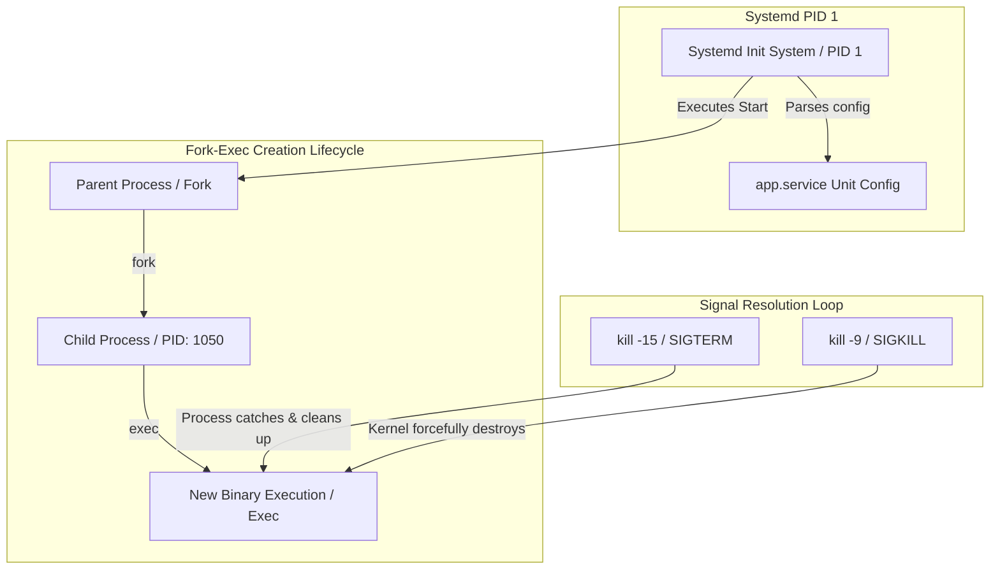

# MOD-LINUX-03: Process Management, Daemons, and Systemd Initialization

Version: 1.0.0

---

# Lesson Metadata

* **Lesson ID:** MOD-LINUX-03
* **Module:** Linux Fundamentals for Platform Engineers
* **Difficulty:** Intermediate
* **Estimated Duration:** 50 minutes
* **Learning Track:** 🟢 Core / 🔵 Professional / 🟣 Expert
* **Version:** 1.0.0
* **Last Updated:** 2026-06-28

---

# Lesson Overview

This lesson dives into the lifecycle of Linux processes, exploring the fork-exec execution model, inter-process communication via signals, and service initialization via Systemd. As a platform engineer, mastering process management is essential for orchestrating resilient microservices, debugging zombie processes, and writing robust Systemd unit files.

---

# Learning Objectives

By the end of this lesson, you will be able to:

* Explain the Linux `fork()` and `exec()` process creation lifecycle.
* Manage running processes using POSIX signals (`SIGTERM`, `SIGKILL`, `SIGHUP`).
* Create, manage, and debug production-grade Systemd service units and journals.

---

# Prerequisites

* Completion of `MOD-LINUX-01` and `MOD-LINUX-02`.
* Access to a Linux terminal with Systemd initialization.

---

# Why This Exists

In early monolithic computing systems, managing background tasks and restarting failed applications required brittle, manual initialization scripts (`SysVinit`). These sequential scripts executed slowly, lacked parallel dependency resolution, and failed to reliably track child processes spawned by background daemons.

To modernize system bootstrapping and process tracking, the Linux ecosystem adopted **Systemd**. Systemd introduces declarative unit files, sophisticated cgroup-based process tracking, parallel socket activation, and robust automatic service restart capabilities, ensuring high availability for enterprise platform workloads.

---

# Core Concepts

## The Fork-Exec Model
In Linux, new processes are created via a two-step kernel mechanism:
* `fork()`: Creates an exact duplicate of the parent process, assigning it a new Process ID (PID) and establishing a parent-child relationship (PPID).
* `exec()`: Replaces the child process's memory space with a new executable binary.

## POSIX Signals
Signals are asynchronous software interrupts used to manipulate process execution:
* **`SIGTERM` (15):** The polite request to terminate. Allows the process to execute cleanup traps, close database connections, and exit gracefully.
* **`SIGKILL` (9):** The immediate, forceful termination. Handled directly by the kernel; cannot be caught, ignored, or blocked by the target process.
* **`SIGHUP` (1):** Hangup signal. Traditionally used to inform daemons (like Nginx or Prometheus) to reload their configuration files without dropping active connections.

## Systemd Units & Cgroups
Systemd manages services using declarative unit files (`.service`, `.socket`, `.timer`). Unlike legacy init scripts, Systemd assigns every service to a dedicated Linux control group (`cgroup`), guaranteeing that even if a service forks multiple background daemons, Systemd can cleanly terminate the entire process tree.

---

# Architecture



---

# Real-World Example

Consider a containerized Kubernetes application undergoing a rolling deployment. When Kubernetes decides to terminate an existing Pod, the Kubelet does not simply destroy the container instantly. 

Instead, it sends a `SIGTERM` signal to `PID 1` inside the container. If your application handles `SIGTERM` correctly, it drains existing HTTP requests and flushes memory buffers to disk. If it ignores `SIGTERM`, Kubernetes waits for the configured `terminationGracePeriodSeconds` (default 30s) before issuing a forceful `SIGKILL`. Understanding Linux signals ensures your microservices scale down with zero dropped user connections.

---

# Hands-on Demonstration

Let's observe how processes respond to POSIX signals by spawning a background sleep task and sending it distinct termination requests.

## Input
We spawn a background sleep process, verify its existence using `ps`, send a graceful `SIGTERM`, and observe its exit state.

## Code
```bash
# Spawn background sleep process
sleep 300 &
SLEEP_PID=$!

# Verify process exists
ps -p $SLEEP_PID

# Send graceful SIGTERM (signal 15)
kill -15 $SLEEP_PID

# Verify process termination
sleep 1
ps -p $SLEEP_PID
```

## Expected Output
```text
  PID TTY          TIME CMD
 5432 pts/0    00:00:00 sleep
[1]+  Terminated              sleep 300
  PID TTY          TIME CMD
```

## Explanation
The `kill -15` command dispatched a `SIGTERM` software interrupt to `PID 5432`. Because `sleep` does not explicitly block or ignore `SIGTERM`, it caught the signal, exited gracefully, and the shell reported `[1]+ Terminated`.

---

# Hands-on Lab

* **Objective:** Write, deploy, and verify a resilient Systemd service unit featuring automatic crash recovery and environment variable injection.
* **Estimated Time:** 25 minutes
* **Difficulty:** Intermediate
* **Environment:** Linux server with Systemd.

## Step-by-step Instructions

1. Create a mock python web daemon script at `/usr/local/bin/mock_app.py`:
   ```python
   #!/usr/bin/env python3
   import time, os, sys
   print(f"Starting service with ENV: {os.getenv('APP_MODE')}", flush=True)
   while True:
       time.sleep(5)
   ```
2. Make the script executable:
   ```bash
   sudo chmod +x /usr/local/bin/mock_app.py
   ```
3. Create a Systemd unit file at `/etc/systemd/system/mock_app.service`:
   ```ini
   [Unit]
   Description=Mock Production Python Daemon
   After=network.target

   [Service]
   Type=simple
   Environment="APP_MODE=Production"
   ExecStart=/usr/local/bin/mock_app.py
   Restart=on-failure
   RestartSec=3s

   [Install]
   WantedBy=multi-user.target
   ```
4. Reload Systemd, start the service, and inspect its status:
   ```bash
   sudo systemctl daemon-reload
   sudo systemctl start mock_app.service
   sudo systemctl status mock_app.service
   ```

## Verification
Execute `sudo journalctl -u mock_app.service -n 10` to verify the logged environment variable output. Simulate a crash by killing the process with `sudo kill -9 $(pgrep -f mock_app.py)` and verify automatic recovery via `sudo systemctl status mock_app.service`.

## Troubleshooting
* **Symptom:** `mock_app.service: Failed with result 'exit-code'`
  * **Cause:** The script lacks execute permissions or contains a Python syntax error.
  * **Solution:** Verify `/usr/local/bin/mock_app.py` has `chmod +x` and executes successfully when run directly in the terminal.

## Cleanup
```bash
sudo systemctl stop mock_app.service
sudo systemctl disable mock_app.service
sudo rm -f /etc/systemd/system/mock_app.service
sudo systemctl daemon-reload
sudo rm -f /usr/local/bin/mock_app.py
```

---

# Production Notes

When deploying high-concurrency enterprise services (like Elasticsearch, PostgreSQL, or vLLM), default Systemd resource limits can severely restrict application throughput. By default, Systemd may cap file descriptors or processes lower than global system limits. Senior platform engineers explicitly define `LimitNOFILE=65536` and `LimitNPROC=4096` directly within the `[Service]` block of the Systemd unit file to ensure maximum scalability.

---

# Common Mistakes

* **Overusing `kill -9`:** Beginners routinely use `kill -9` (`SIGKILL`) as their default termination command. This forces an immediate kernel shutdown, corrupting database files and leaving orphan shared memory locks. Always use `kill -15` (`SIGTERM`) first.
* **Forgetting `systemctl daemon-reload`:** When modifying a `.service` file on disk, beginners wonder why their changes fail to take effect. Systemd caches unit configurations in memory; you must execute `systemctl daemon-reload` to flush the cache.

---

# Failure-Driven Learning

Let's observe the mechanics of an orphan process transitioning into a **Zombie Process** (`Z` state).

## The Failure
A zombie process occurs when a child process completes execution, but its parent fails to invoke the `wait()` system call to read its exit status.

```bash
# We spawn a python script that forks a child and sleeps without calling wait()
python3 -c '
import os, time
pid = os.fork()
if pid > 0:
    print(f"Parent PID: {os.getpid()}, Child PID: {pid}")
    time.sleep(300)
else:
    print("Child exiting immediately to become a zombie")
    os._exit(0)
' &
```

## Expected Output
```text
Parent PID: 8102, Child PID: 8103
Child exiting immediately to become a zombie
```

## Diagnosis & Recovery
To diagnose this, execute `ps aux | grep 'Z'`. You will observe `8103` sitting in a `Z+` (zombie/defunct) state. Note that a zombie process is already dead; you cannot kill it with `kill -9 8103`. To clear it, you must either send `SIGCHLD` to the parent or kill the parent process (`kill -9 8102`), allowing Systemd (`PID 1`) to inherit and reap the zombie.

---

# Engineering Decisions

When architecting container base images, you must decide whether to use a dedicated init system (like `tini` or `dumb-init`) as `PID 1` inside the container.
* **Bare Execution (`CMD ["python", "app.py"]`):** Simplifies Dockerfile setup, but the Python runtime becomes `PID 1`. Python does not automatically reap zombie child processes or forward signals reliably.
* **Dedicated Init (`CMD ["tini", "--", "python", "app.py"]`):** `tini` assumes `PID 1`, guarantees reliable child reaping, and forwards `SIGTERM` properly to the Python process, ensuring clean container shutdowns.

---

# Best Practices

* **Always Handle `SIGTERM` in Application Code:** Ensure your production microservices implement explicit signal handlers that close database pools before terminating.
* **Structure Unit Dependencies Declaratively:** Use `After=`, `Requires=`, and `Wants=` in Systemd unit files to guarantee that dependent services (like local caching daemons) are fully healthy before starting your application.

---

# Troubleshooting Guide

## Issue 1: Service Fails to Start on Boot but Starts Manually

* **Cause:** The service is attempting to bind to an IP address or storage mount that has not finished initializing during early boot.
* **Diagnosis:** Inspect boot logs using `journalctl -u my_app.service -b 0`. Look for `bind: Cannot assign requested address` or `Directory not found`.
* **Solution:** Add `After=network-online.target` and `Wants=network-online.target` to the `[Unit]` block of your service file to delay execution until the network stack is fully active.

---

# Summary

Understanding Linux process lifecycles, POSIX signals, and Systemd initialization empowers platform engineers to build highly resilient, automated service architectures. By treating processes as manageable lifecycle entities, you ensure zero downtime deployments and rapid automated crash recovery.

---

# Cheat Sheet

| Command | Purpose | Example |
| :--- | :--- | :--- |
| `systemctl start <unit>` | Start a Systemd service | `systemctl start nginx` |
| `systemctl status <unit>` | Inspect service status & logs | `systemctl status postgresql` |
| `systemctl daemon-reload` | Reload unit files from disk | `systemctl daemon-reload` |
| `journalctl -u <unit>` | Query logs for a specific service| `journalctl -u docker.service -f` |
| `kill -15 <PID>` | Send graceful SIGTERM signal | `kill -15 4021` |

---

# Knowledge Check

To test your mastery of process lifecycles and Systemd, review the dedicated questions in `quizzes/quiz-linux-01.md`.

---

# Interview Preparation

## Beginner Questions
* What is the difference between `SIGTERM` (15) and `SIGKILL` (9)?

## Intermediate Questions
* Explain what a Zombie process is and why it cannot be forcefully killed with `kill -9`.

## Advanced Questions
* How does Systemd utilize Linux control groups (`cgroups`) to ensure complete termination of a service's spawned child daemons?

## Scenario-Based Discussions
* **Scenario:** You deploy a new Python worker daemon via Systemd, but it randomly restarts every few hours. How would you isolate the root cause?
* **Key Talking Points:** Explain using `journalctl -u worker.service -b 0` to inspect exit codes. Discuss checking for `OOMKilled` (Out of Memory) events in kernel logs via `dmesg -T | grep -i oom`, and validating the `Restart=on-failure` configuration in the unit file.

---

# Further Reading

1. [man systemd.service(5)](https://man7.org/linux/man-pages/man5/systemd.service.5.html)
2. [man kill(1)](https://man7.org/linux/man-pages/man1/kill.1.html)
3. [man journalctl(1)](https://man7.org/linux/man-pages/man1/journalctl.1.html)
4. [The Tini Init System](https://github.com/krallin/tini)
