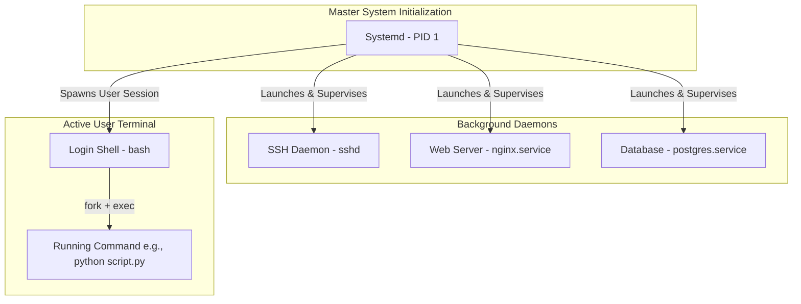

# Lesson 03: Process Management, Daemons, and Systemd Initialization

---

## 1. Lesson Metadata

* **Module:** Module 01 — Linux Fundamentals for Platform Engineers
* **Lesson:** Lesson 03 — Process Management, Daemons, and Systemd Initialization
* **Target Audience:** Future Platform Engineers & AI Infrastructure Engineers
* **Difficulty Level:** Beginner (80%) / Intermediate (20%)
* **Estimated Completion Time:** 45 minutes

---

## 2. Lesson Overview

Welcome back! In our previous lessons, we mastered how Linux protects physical hardware (User vs. Kernel Space) and how it protects files and directories (Permissions & ACLs). Now, we are going to explore the dynamic, living world of **Linux Processes**.

A program sitting on your hard drive is just a static collection of code. But when you launch it, it comes to life as a **Process**! 

Have you ever wondered how a massive web server stays running in the background for months at a time? Or how Linux knows exactly what to do when you press the power button on a server?

In this lesson, we will explore the lifecycle of running programs. You will learn how processes give birth to child processes (`fork` and `exec`), how to politely request a process to close down (`SIGTERM` vs. `SIGKILL`), and how to build robust, self-healing background services using **Systemd**.

---

## 3. Learning Objectives

By completing this lesson, you will be able to:
* **Explain** the biological lifecycle of Linux processes, including Parent/Child hierarchies (`fork`/`exec`) and Zombie processes.
* **Inspect** active process tables using `ps`, `top`, `htop`, and `pgrep`.
* **Transmit** execution signals (`SIGTERM`, `SIGKILL`, `SIGHUP`) using `kill` and `pkill`.
* **Define** what a Daemon process is and explain how it operates in the background without a terminal attached.
* **Create** and manage robust, self-healing Systemd service units (`systemctl`).

---

## 4. Prerequisites

To be fully prepared for this lesson, you should have completed:
* **[Lesson 01: Linux Architectural Fundamentals & Kernel Anatomy](lesson-01.md)**
* **[Lesson 02: User, Group, and Permission Management (DAC & RBAC)](lesson-02.md)**
* An active Linux terminal session to explore running processes.
* Assume only what we learned in Lessons 01 and 02—we will build the rest of our intuition together!

---

## 5. Why This Exists

Imagine running a massive factory full of heavy machinery. If you had to stand in front of every machine and manually hold down the power button to keep it running, you would never get any other work done! Furthermore, if a machine suddenly jammed or stopped working while you were looking away, the entire assembly line would shut down.

Early computer software faced this exact limitation. If you launched a long-running calculation or a server script in your terminal window, your terminal was completely blocked until the task finished. If you closed the window or lost your internet connection, the program instantly died!

To solve this problem, Linux created a robust background management system. It allows programs to detach from the terminal and run silently in the shadows as **Daemons**. And to ensure these daemons stay alive, Linux uses a master factory supervisor called **Systemd**. Systemd monitors your background services 24/7. If a web server suddenly crashes in the middle of the night, Systemd instantly restarts it while you are fast asleep!

---

## 6. Core Concepts

### The Process Lifecycle (`fork` and `exec`)
In Linux, new processes do not just appear out of nowhere; they are born from existing processes!
* **`fork()`:** When a running program (the Parent) wants to create a new task, it makes a copy of itself. This is called a fork. The new copy is called the Child Process.
* **`exec()`:** Once the Child is born, it replaces its own memory with a brand-new program. This beautiful two-step dance (`fork` and `exec`) is how every single command in Linux is launched!

### PID and PPID
Every running process gets two vital identification numbers:
* **PID (Process ID):** A unique number assigned to the process (like a social security number).
* **PPID (Parent Process ID):** The PID of the parent process that created it.

### Zombie Processes
When a Child process finishes its work, it stops running and waits for its Parent to acknowledge its exit code. During this brief waiting period, the child is called a **Zombie Process**. If the Parent process crashes or forgets to check on the child, the zombie stays in the process table! (Don't worry—zombies don't eat CPU or memory; they just take up a slot in the table).

### The Signal Playbook (`SIGTERM` vs. `SIGKILL`)
When you want to communicate with a running process, you transmit a **Signal**. Here are the three most famous signals in Platform Engineering:
* **`SIGTERM` (Signal 15 - Terminate):** This is a polite, professional request asking the process to shut down. The process gets time to save its files, close network connections, and exit gracefully.
* **`SIGKILL` (Signal 9 - Kill):** This is the emergency emergency switch! It bypasses the program entirely and tells the Linux kernel to instantly destroy the process. (Use this only when a program is completely frozen!).
* **`SIGHUP` (Signal 1 - Hangup):** Traditionally used when a terminal disconnects, modern background services use this signal to politely reload their configuration files without dropping active user connections.

### Systemd & Service Units
**Systemd** is the master initialization daemon of modern Linux. When you boot up a server, Systemd is the very first process born (PID 1). It is responsible for launching every other service, managing network interfaces, and restarting crashing applications using simple configuration files called **Service Units** (`.service`).

---

## 7. Architecture

Here is a clear architectural hierarchy showing how Systemd (PID 1) supervises background daemons and running user terminal processes:



---

## 8. Real-World Example

Let's look at how this plays out in a real-world production environment!

Imagine you are managing the AI inference API for a fast-growing tech startup. You have a Python API running in the background. If a sudden memory glitch causes the Python API to crash at 3:00 AM, you do not want your phone to ring for an emergency wake-up call!

Using Systemd, you configure a dedicated service unit (`ai-api.service`) with the magic setting **`Restart=on-failure`**. When the Python process crashes, Systemd instantly notices the non-zero exit code and respawns a fresh Python process within milliseconds. Your users barely notice a blip, and you get to sleep peacefully!

---

## 9. Hands-on Demonstration

Let's open our terminal and see how easy it is to inspect active processes, transmit a polite shutdown signal, and create our very own Systemd background service!

### Input
We will launch a background `sleep` process, use `ps` to verify its PID and Parent PID, transmit a polite `SIGTERM` signal using `kill -15`, and then inspect the structure of a real Systemd service unit file.

### Code
```bash
# 1. We launch a sleep command in the background using the '&' symbol.
sleep 400 &

# 2. Linux stores the PID of our last background job in the '$!' variable. Let's save it!
JOB_PID=$!
echo "Our background sleep process was born with PID: $JOB_PID"

# 3. We use 'ps -ef' to look up our process and verify its Parent PID (PPID).
ps -ef | grep $JOB_PID | grep -v grep

# 4. Now, let's send a polite termination signal (SIGTERM / 15) to shut it down gracefully.
kill -15 $JOB_PID

# 5. Let's verify it exited cleanly from the process table.
ps -ef | grep $JOB_PID | grep -v grep

# 6. Now, let's inspect the configuration of a real Systemd service unit!
# (We use cat to view the systemd journal service unit as an example).
systemctl cat systemd-journald.service | head -n 15
```

### Expected Output
```text
[1] 18234
Our background sleep process was born with PID: 18234
aloysius   18234   14201  0 02:40 pts/1    00:00:00 sleep 400
[1]+  Terminated              sleep 400

# /lib/systemd/system/systemd-journald.service
[Unit]
Description=Journal Service
Documentation=man:systemd-journald.service(8) man:journald.conf(5)
DefaultDependencies=no
Requires=systemd-journald.socket
After=systemd-journald.socket systemd-journald-dev-log.socket

[Service]
ExecStart=/lib/systemd/systemd-journald
Restart=always
RestartSec=1min
```

### Explanation
Look at the beautiful mechanics displayed in our output!
1. When we launched `sleep 400 &`, Linux instantly returned `[1] 18234`. `18234` is our unique PID, and `14201` is our terminal window's PPID.
2. By executing `kill -15 18234`, we politely asked the process to wrap up its work. The terminal verified this by printing `Terminated sleep 400`.
3. When we inspected `systemd-journald.service`, we saw exactly how Systemd manages background daemons. Notice the `[Service]` section: `ExecStart` tells Systemd which binary to run, and `Restart=always` guarantees that if the service crashes, Systemd will automatically restart it!

---

## 10. Hands-on Lab

To solidify your mastery of process hierarchies, signal transmission, and Systemd service creation, you will complete a dedicated, standalone practical laboratory.

### Lab Summary
In this lab, you will write a custom Python monitoring script, create a dedicated Systemd service unit file (`/etc/systemd/system/py-monitor.service`), enable it to start automatically on system boot (`systemctl enable`), and test its self-healing capabilities by intentionally killing the process.

### Lab Reference
For the complete step-by-step lab guide, please refer to the standalone lab document:
* **`labs/linux-automation.md`** *(Section 3: Process Management & Systemd)*

---

## 11. Production Notes

In a local learning environment, you might be used to starting programs directly in your terminal or using simple tools like `tmux` or `screen` to keep scripts running. But in a highly available enterprise cloud environment, relying on manual terminal sessions is an unacceptable practice!

In production, Platform Engineers ensure that *every* background application is wrapped in a dedicated initialization unit (like Systemd or a container runtime supervisor). When deploying massive microservices, engineers use Systemd's `LimitNOFILE=` settings inside the `.service` file to ensure the daemon has access to enough kernel file descriptors to handle heavy user traffic without crashing.

*(Where to learn more: We will explore how container runtimes like Docker and Kubernetes manage background daemons in **Stage 2: Containerization & Virtualization**).*

---

## 12. Common Mistakes

When mastering process management and Systemd, beginners frequently run into a few common pitfalls:

* **Mistake 1: Immediately using `kill -9` (`SIGKILL`) to close programs.** 
  * *Correction:* Beginners often memorize `kill -9` because it works instantly. However, `SIGKILL` forces the kernel to terminate the process without letting it save active files or close database transactions, which can corrupt your data! Always try `kill -15` (`SIGTERM`) first, and give the program a few seconds to exit gracefully.
* **Mistake 2: Forgetting to run `systemctl daemon-reload` after editing a service file.**
  * *Correction:* If you edit a `.service` file in `/etc/systemd/system/` and try to restart the service, Systemd will not notice your changes! You must explicitly tell Systemd to re-read its configuration files by executing `sudo systemctl daemon-reload`.

---

## 13. Failure-Driven Learning

Let's perform a safe, instructive failure simulation in our terminal to observe how Systemd handles a failing service unit!

### Simulation
We will attempt to start a non-existent Systemd service (`fake-ai-service.service`). We want to observe how `systemctl` reports the failure and how we can check the status to understand exactly what went wrong.

### Code
```bash
# 1. We attempt to start a non-existent background service using systemctl.
sudo systemctl start fake-ai-service.service

# 2. We use 'systemctl status' to inspect the detailed failure state.
systemctl status fake-ai-service.service
```

### Expected Output
```text
Failed to start fake-ai-service.service: Unit fake-ai-service.service not found.
Unit fake-ai-service.service could not be found.
```

### Explanation
Notice exactly what happened! When we executed `systemctl start fake-ai-service.service`, Systemd searched its configuration directories (`/lib/systemd/system/` and `/etc/systemd/system/`). Realizing there was no service unit file matching that name, Systemd instantly protected the system from an invalid execution and returned a clear, explicit error message. 

If this were a real service that had crashed, `systemctl status` would print the exact exit code and log output showing us exactly why the binary failed to launch!

---

## 14. Engineering Decisions

As a Platform Engineer, you will make architectural trade-offs regarding process supervision models:

### Systemd vs. Lightweight Container Supervisors (e.g., Supervisord / Tini)
* **The Decision:** Should you use Systemd to manage services inside a Docker container, or should you use a lightweight supervisor like Tini or Supervisord?
* **The Trade-off:** Systemd is an incredibly powerful, feature-rich initialization system designed to manage entire virtual machines and physical servers. However, it requires significant underlying system access (like mounting `cgroups` and D-Bus sockets). For full virtual machines, Systemd is absolute perfection! But inside lightweight microservice containers (like Docker), Platform Engineers choose minimal init systems like `tini` because they cleanly reap zombie processes without the heavy system overhead of Systemd.

---

## 15. Best Practices

Here are three actionable rules you should embed in your daily engineering habits:

1. **Adopt `SIGTERM` as your default:** Always allow background processes the opportunity to exit cleanly using `kill -15` before reaching for the emergency `kill -9` switch.
2. **Implement `Restart=on-failure`:** When writing Systemd service units for production applications, always configure automated restart policies to ensure self-healing behavior.
3. **Use `htop` for visual process monitoring:** While `ps` is excellent for quick scripts, use `htop` in your terminal to view interactive, real-time process hierarchies and resource utilization.

---

## 16. Troubleshooting Guide

When diagnosing failing background services or frozen processes, follow this structured troubleshooting workflow:

```mermaid
flowchart TD
    A[Background Service Fails or Freezes] --> B{Is it managed by Systemd?}
    B -->|Yes| C[Run: systemctl status service_name.service]
    C --> D{Inspect Exit Code & Logs}
    D -->|Active: failed| E[Run: journalctl -u service_name.service -n 50 --no-pager]
    B -->|No - Manual Process| F[Run: ps -ef | grep process_name]
    F --> G[Transmit polite shutdown: kill -15 PID]
    G --> H{Did process exit?}
    H -->|No - Completely Frozen| I[Transmit emergency kill: kill -9 PID]
```

### Common Troubleshooting Scenarios
* **Problem:** A Systemd background service refuses to start after you updated its configuration file.
  * **Cause:** Systemd has not loaded the new configuration file into its active memory.
  * **Diagnosis:** Run `systemctl status <service>` and look for the warning `Warning: The unit file, source configuration file or drop-ins of <service> changed on disk`.
  * **Solution:** Execute `sudo systemctl daemon-reload` and then `sudo systemctl restart <service>`.
* **Problem:** A Python data-processing script is completely unresponsive and ignoring your `Ctrl+C` presses.
  * **Cause:** The process is deadlocked in a kernel I/O wait or stuck in an infinite loop ignoring `SIGTERM`.
  * **Diagnosis:** Find the process PID using `pgrep -l python`.
  * **Solution:** Execute `kill -9 <PID>` to force the Linux kernel to immediately reclaim the process memory.

---

## 17. Summary

Let's review the dynamic process management concepts we have mastered in this lesson:
* **The `fork`/`exec` Dance:** Every running program is a process born when a parent process makes a copy of itself (`fork`) and replaces the memory with a new binary (`exec`).
* **PID and PPID:** Every process is tracked by its unique Process ID (`PID`) and its parent's ID (`PPID`).
* **The Signal Playbook:** We communicate with running processes using signals, always preferring polite termination (**`SIGTERM / 15`**) over emergency destruction (**`SIGKILL / 9`**).
* **Daemons & Systemd:** Background services detach from the terminal as daemons and are supervised 24/7 by **Systemd (PID 1)**, guaranteeing automated self-healing and clean system reboots!

---

## 18. Cheat Sheet

Here is your quick-reference summary for Linux process inspection, signal transmission, and Systemd administration:

| Command / Concept | Quick Definition | Practical Use Case |
| :--- | :--- | :--- |
| `ps -ef` | Lists every running process on the system | Finding the PID and PPID of a running script |
| `pgrep <name>` | Searches for processes by name | Quickly finding the PID of `nginx` or `python` |
| `kill -15 <PID>` | Transmits `SIGTERM` (Polite termination) | Gracefully shutting down a running server |
| `kill -9 <PID>` | Transmits `SIGKILL` (Forced destruction) | Instantly destroying a frozen, unresponsive app |
| `systemctl status <svc>` | Shows the running state of a service | Checking if a background web server is healthy |
| `systemctl restart <svc>`| Restarts a Systemd service unit | Applying fresh application code or configs |
| `systemctl enable <svc>` | Configures service to start on boot | Ensuring a database launches on system startup |
| `systemctl daemon-reload`| Reloads Systemd unit files from disk | Executed after editing a `.service` file |

### Standalone Cheat Sheet Reference
For a complete, downloadable reference card of Linux process states (Running, Sleeping, Zombie) and Systemd unit properties, please check our standalone cheat sheet directory:
* **`cheatsheets/linux-process-systemd.md`**

---

## 19. Knowledge Check

To verify your comprehension of process hierarchies, signals, and Systemd mechanics, please test your knowledge using our standalone self-assessment quiz.

### Quiz Reference
You can find the complete interactive quiz here:
* **`quizzes/linux-fundamentals.md`** *(Section 3: Process Management & Systemd)*

---

## 20. Interview Preparation

Process management and Systemd initialization are highly common topics in Platform Engineering technical interviews! Here is how to answer questions across three depth tiers:

### Tier 1: Foundation (Beginner)
* **Question:** What is the difference between `kill -15` (`SIGTERM`) and `kill -9` (`SIGKILL`)?
* **Answer:** `kill -15` (`SIGTERM`) is a polite request that allows a process to save its state, finish pending tasks, and exit gracefully. `kill -9` (`SIGKILL`) is an emergency override that cannot be caught or ignored; it commands the Linux kernel to immediately destroy the process without clean up.

### Tier 2: Implementation (Intermediate)
* **Question:** How would you configure a custom background daemon to automatically restart if it encounters an unexpected runtime crash?
* **Answer:** I would create a Systemd service unit file (e.g., `/etc/systemd/system/myapp.service`). Within the `[Service]` section, I would define `ExecStart=/path/to/binary` and configure `Restart=on-failure`. I would then execute `systemctl daemon-reload`, followed by `systemctl enable --now myapp.service` to start the service and ensure it respawns automatically on non-zero exit codes.

### Tier 3: Production/Scale (Advanced)
* **Question:** What is a Zombie process, why does it occur, and how do you resolve an active process table accumulating thousands of zombie states in a production container?
* **Answer:** A Zombie process (`DEFUNCT`) is a child process that has completed execution but retains an entry in the process table because its parent has not yet executed `wait()` to read its exit status. Zombie processes consume no CPU or memory, but exhaust available PID slots. If a production container accumulates thousands of zombies, it indicates a defective parent application failing to reap its children. To resolve this without rewriting the application code, I inject a dedicated, lightweight init supervisor such as `tini` (using `docker run --init`) as PID 1 to ensure automated, asynchronous zombie reaping.

---

## 21. Further Reading

To expand your expertise in Linux process mechanics and Systemd architecture, explore these highly recommended external resources:
* **Book:** *Linux Service Management Made Easy with systemd* by Donald A. Tevault (Outstanding guide to Systemd administration).
* **Article:** *Understanding the Linux Daemon & Systemd Init Workflow* on the DigitalOcean Community (Excellent beginner walkthrough).
* **Online Reference:** [Freedesktop.org Systemd Official Documentation](https://www.freedesktop.org/wiki/Software/systemd/) (The ultimate authoritative source on Systemd unit design).
