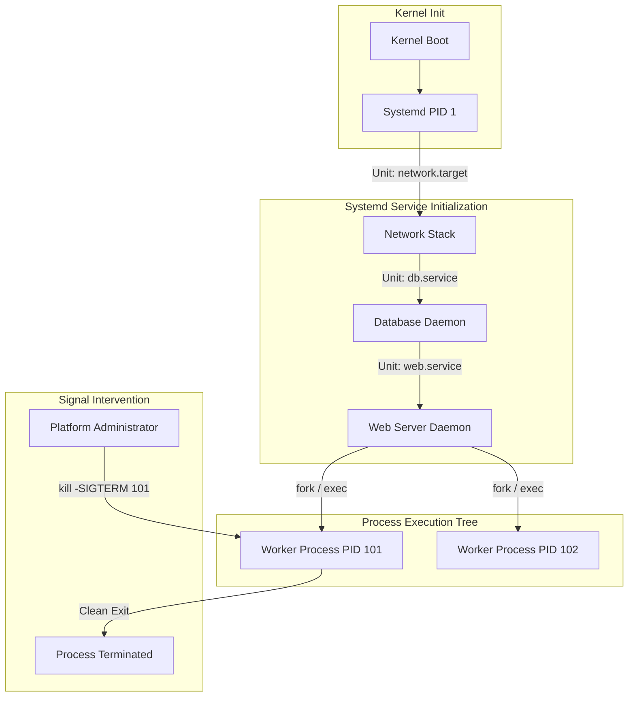

# MOD-LINUX-03: Process Management, Daemons, and Systemd Initialization

Version: 1.0.0

---

# Lesson Metadata

* **Lesson ID:** MOD-LINUX-03
* **Module:** Linux Fundamentals for Platform Engineers
* **Difficulty:** Intermediate
* **Estimated Duration:** 60 minutes
* **Learning Track:** 🟢 Core / 🔵 Professional / 🟣 Expert
* **Version:** 1.0.0
* **Last Updated:** 2026-06-28

---

# Lesson Overview

This lesson covers the lifecycle of Linux processes, exploring process states, signal handling, parent-child inheritance (`fork`/`exec`), daemonization, and the Systemd init system. You will learn how to inspect running process trees and write robust, production-grade Systemd service units and timers.

---

# Learning Objectives

By the end of this lesson, you will be able to:

* Inspect and analyze process states, zombie processes, and memory maps using `ps`, `top`, `htop`, and `pmap`.
* Transmit execution signals (`SIGTERM`, `SIGKILL`, `SIGHUP`) to manage process termination and reloading.
* Architect production-grade Systemd service units (`.service`) featuring automatic restart policies and dependency declarations.

---

# Prerequisites

* Understanding of Linux permissions (`MOD-LINUX-02`).
* Familiarity with text editors (`vim`, `nano`).

---

# Why This Exists

An operating system must manage thousands of concurrent tasks without allowing one frozen program to paralyze the entire machine. Early Unix established the process model, where every running task is an isolated entity identified by a Process ID (PID).

As Linux expanded into enterprise mission-critical servers, legacy initialization scripts (SysVinit) proved too slow, sequential, and brittle to manage complex daemon dependencies. Systemd was introduced to provide parallel service initialization, robust dependency tracking, and automatic service healing.

---

# Core Concepts

## Process Lifecycle (`fork` & `exec`)
In Linux, new processes are created when an existing process clones itself using the `fork()` system call, creating a child process. The child then replaces its execution memory with a new program using `execve()`. Every process has a Parent Process ID (PPID).

## Process States & Zombies
A process transitions through several states:
* **Running/Runnable (R):** Actively executing on a CPU core.
* **Sleeping (S / D):** Waiting for an event or I/O completion (`D` is uninterruptible disk sleep).
* **Zombie (Z):** A terminated process whose parent has not yet called `wait()` to collect its exit status.

## Systemd & Service Units
Systemd is the first process launched by the kernel (PID 1). It manages the system lifecycle using configuration files called Units (`.service`, `.timer`, `.socket`, `.mount`).

---

# Architecture



---

# Real-World Example

In modern cloud infrastructure, enterprise applications like Kubernetes `kubelet` or Docker `dockerd` run as Systemd background daemons. If the Docker daemon crashes due to memory exhaustion, a properly configured Systemd service unit (`Restart=on-failure`) detects the abnormal exit code and automatically restarts the daemon within seconds, preventing a prolonged cluster outage.

---

# Hands-on Demonstration

Let's demonstrate how to inspect process execution hierarchies and transmit termination signals.

## Input
We launch a background sleep process, verify its parent-child tree using `ps`, and terminate it cleanly using `SIGTERM`.

## Code
```bash
sleep 300 &
SLEEP_PID=$!
ps -ef | grep $SLEEP_PID | grep -v grep
kill -15 $SLEEP_PID
ps -ef | grep $SLEEP_PID | grep -v grep
```

## Expected Output
```text
aloysius   14521   14201  0 01:35 pts/1    00:00:00 sleep 300
[1]+  Terminated              sleep 300
```

## Explanation
The `ps -ef` output reveals `sleep 300` executing as PID `14521` under PPID `14201` (our active bash shell). We transmit signal `15` (`SIGTERM`), requesting a graceful shutdown. The subsequent check confirms the process has exited cleanly.

---

# Hands-on Lab

* **Objective:** Architect, deploy, and verify a custom Systemd service unit that launches a Python background monitoring worker with automated failure restart capabilities.
* **Estimated Time:** 25 minutes
* **Difficulty:** Intermediate
* **Environment:** Linux Terminal with sudo/root access

## Step-by-step Instructions

1. Create a simulated background worker script `/usr/local/bin/monitor.py`:
   ```bash
   sudo bash -c 'cat << "EOF" > /usr/local/bin/monitor.py
   #!/usr/bin/env python3
   import time, sys
   print("Starting monitoring worker...", flush=True)
   while True:
       time.sleep(5)
       print("Worker heartbeat active.", flush=True)
   EOF'
   sudo chmod +x /usr/local/bin/monitor.py
   ```
2. Create the Systemd service unit `/etc/systemd/system/py-monitor.service`:
   ```bash
   sudo bash -c 'cat << "EOF" > /etc/systemd/system/py-monitor.service
   [Unit]
   Description=Custom Python Monitoring Daemon
   After=network.target

   [Service]
   Type=simple
   ExecStart=/usr/local/bin/monitor.py
   Restart=on-failure
   RestartSec=3
   User=nobody

   [Install]
   WantedBy=multi-user.target
   EOF'
   ```
3. Reload Systemd daemon configurations, start the service, and enable it on boot:
   ```bash
   sudo systemctl daemon-reload
   sudo systemctl start py-monitor.service
   sudo systemctl enable py-monitor.service
   ```

## Verification
Verify the service is actively running and inspect its status:
```bash
sudo systemctl status py-monitor.service
```
**Expected Output:**
```text
● py-monitor.service - Custom Python Monitoring Daemon
     Loaded: loaded (/etc/systemd/system/py-monitor.service; enabled; vendor preset: enabled)
     Active: active (running) since Sun 2026-06-28 01:40:12 IST; 15s ago
   Main PID: 15123 (python3)
      Tasks: 1 (limit: 4615)
     Memory: 4.2M
     CGroup: /system.slice/py-monitor.service
             └─15123 /usr/bin/python3 /usr/local/bin/monitor.py
```

## Troubleshooting
* **Symptom:** `code=exited, status=203/EXEC`
  * **Cause:** The script at `ExecStart` is not marked as executable (`+x`) or contains an invalid shebang (`#!/usr/bin/env python3`).
  * **Solution:** Verify permissions with `sudo chmod +x /usr/local/bin/monitor.py`.

## Cleanup
```bash
sudo systemctl stop py-monitor.service
sudo systemctl disable py-monitor.service
sudo rm -f /etc/systemd/system/py-monitor.service
sudo rm -f /usr/local/bin/monitor.py
sudo systemctl daemon-reload
```

---

# Production Notes

In enterprise microservice environments, applications frequently require strict startup ordering (e.g., ensure the database volume is fully mounted and network interfaces are active before launching the API daemon). Utilize Systemd's `After=`, `Requires=`, and `Wants=` directives to construct declarative dependency graphs that prevent race conditions during server reboots.

---

# Common Mistakes

* **Overusing `kill -9` (`SIGKILL`):** Beginners instantly resort to `kill -9 <PID>` to stop stuck processes. `SIGKILL` bypasses the application entirely; the kernel terminates the process instantly without allowing it to flush memory buffers, close database transactions, or delete lock files, frequently causing data corruption. Always attempt `kill -15` (`SIGTERM`) first.
* **Attempting to Kill a Zombie Process:** You cannot kill a zombie (`Z`) process because it is already dead; it merely occupies a slot in the process table. To clear a zombie, you must kill its parent process (PPID).

---

# Failure-Driven Learning

Let's simulate a crashing Systemd daemon to observe automatic service healing in action.

## The Failure
We simulate an unexpected daemon crash by sending `SIGKILL` to our active `py-monitor.service` process.

```bash
# Find the main PID of py-monitor
MAIN_PID=$(sudo systemctl show -p MainPID py-monitor.service | cut -d= -f2)
# Simulate unexpected hard crash
sudo kill -9 $MAIN_PID
```

## Diagnosis & Recovery
Because our unit defined `Restart=on-failure`, Systemd instantly intercepts the abnormal exit code (`SIGKILL`) and restarts a fresh process instance within 3 seconds. Verify recovery via `journalctl`:
```bash
sudo journalctl -u py-monitor.service -n 10
```
**Expected Log Output:**
```text
py-monitor.service: Main process exited, code=killed, status=9/KILL
py-monitor.service: Failed with result 'exit-code'.
py-monitor.service: Scheduled restart job, restart counter is at 1.
Stopped Custom Python Monitoring Daemon.
Started Custom Python Monitoring Daemon.
```

---

# Engineering Decisions

When scheduling recurring background automation tasks, you must decide between traditional Linux Cron (`crontab`) and Systemd Timers (`.timer`).
* **Cron:** Simpler syntax (`* * * * *`); lacks built-in logging, dependency tracking, and sub-minute execution.
* **Systemd Timers:** Highly robust; natively logs to `journalctl`, prevents overlapping executions, and supports complex dependency graphs. Preferred for modern platform engineering.

---

# Best Practices

* Configure `LimitNOFILE=65536` in Systemd service units for high-concurrency applications (e.g., web servers) to prevent file descriptor exhaustion.
* Always execute application daemons under dedicated, non-root system users (`User=appuser`).
* Use `systemctl cat <unit>` to inspect service configurations directly rather than searching filesystem directories.

---

# Troubleshooting Guide

## Issue 1: High Load Average caused by Uninterruptible Sleep (`D` State)

* **Problem:** System load average is extremely high (e.g., `35.20`), but CPU utilization is low. `top` reveals dozens of processes stuck in `D` state.
* **Cause:** Processes in `D` state (Uninterruptible Sleep) are trapped in kernel space waiting for a severely throttled or unresponsive I/O device (e.g., a failing NFS share or exhausted AWS EBS volume).
* **Diagnosis:** 
  ```bash
  # Check for processes in D state
  ps -eo ppid,pid,user,stat,pcpu,comm,wchan | grep " D "
  ```
  *The `wchan` column reveals the exact kernel function (e.g., `rpc_wait_bit_killable`) where the process is blocked.*
* **Solution:** Do not attempt `kill -9` (it will fail on `D` state processes). You must resolve the underlying storage deadlock (e.g., forcefully unmount the frozen NFS volume `umount -f /mnt/nfs` or resize IOPS on the cloud volume).

---

# Summary

Understanding the Linux process lifecycle, signal mechanics, and Systemd initialization is essential for maintaining reliable infrastructure. By configuring robust Systemd units and practicing graceful signal intervention, platform engineers ensure maximum service availability and automated self-healing.

---

# Cheat Sheet

| Command | Description | Example |
| :--- | :--- | :--- |
| `ps -ef` | List all running processes in full format | `ps -ef | grep nginx` |
| `kill -15 <PID>` | Send graceful `SIGTERM` signal | `kill -15 1052` |
| `kill -9 <PID>` | Send forceful `SIGKILL` signal | `kill -9 1052` |
| `systemctl status <unit>` | Inspect service status and logs | `systemctl status sshd` |
| `systemctl daemon-reload` | Reload Systemd after modifying `.service` files | `sudo systemctl daemon-reload` |

---

# Knowledge Check

## Multiple Choice Questions

1. Which signal asks a process to gracefully shut down?
   * A) `SIGKILL` (9)
   * B) `SIGTERM` (15)
   * C) `SIGHUP` (1)
   * D) `SIGINT` (2)

2. What is the PID of the Systemd init process?
   * A) PID 0
   * B) PID 100
   * C) PID 1
   * D) PID 2

## Scenario Questions

**Scenario:** A background worker process spawned by a parent Python application has turned into a Zombie (`Z`). Your automated monitoring system is alerting you. How do you permanently clear the zombie process?

## Short Answer Questions

* Explain why Systemd Timers are generally preferred over Cron jobs in enterprise platform engineering environments.

---

# Interview Preparation

## Beginner Questions
* What is the difference between `SIGTERM` and `SIGKILL`?

## Intermediate Questions
* Explain what happens during a `fork()` and `exec()` sequence.

## Advanced Questions
* What is an uninterruptible sleep (`D`) state, why can't you `SIGKILL` a process in `D` state, and how do you resolve it?

## Scenario-Based Discussions
* **Scenario:** A production service managed by Systemd keeps crash-looping every 5 seconds. How would you investigate and stabilize the system?
* **Key Talking Points:** Discuss using `systemctl status` and `journalctl -u <unit> -fe` to inspect exit codes, verifying binary execution permissions, and checking for missing environment variables or unmounted storage targets.

---

# Further Reading

1. [Man7: systemd.service(5)](https://man7.org/linux/man-pages/man5/systemd.service.5.html)
2. [Man7: signal(7)](https://man7.org/linux/man-pages/man7/signal.7.html)
3. [Man7: ps(1)](https://man7.org/linux/man-pages/man1/ps.1.html)
4. [DigitalOcean: Systemd Essentials](https://www.digitalocean.com/community/tutorials/systemd-essentials-working-with-services-units-and-the-journal)
5. *Linux System Programming* by Robert Love
