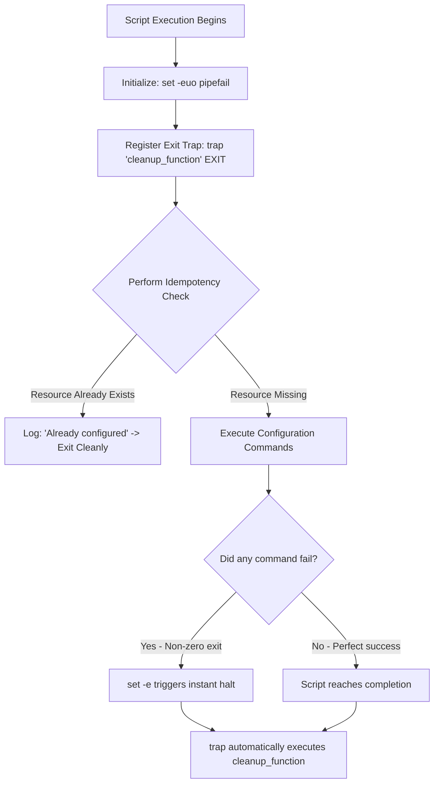
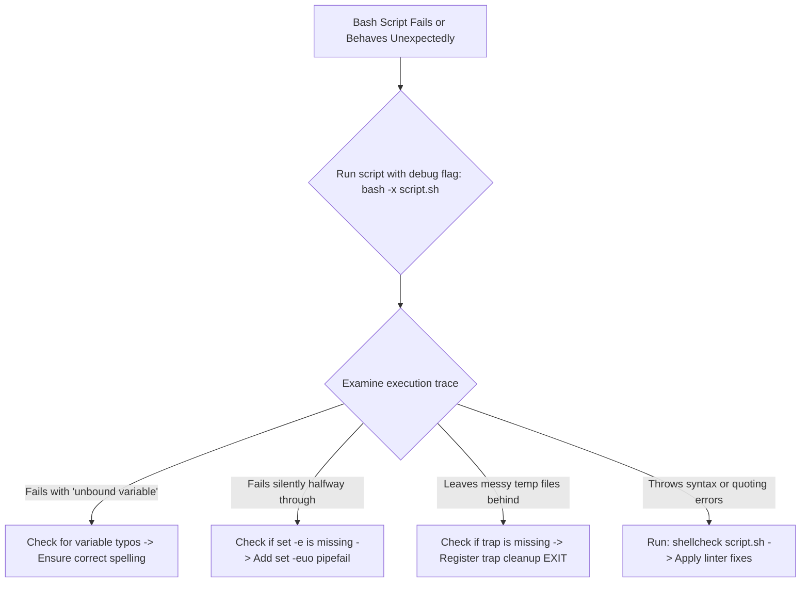

# Lesson 04: Advanced Bash Scripting & Production Automation

---

## 1. Lesson Metadata

* **Module:** Module 01 — Linux Fundamentals for Platform Engineers
* **Lesson:** Lesson 04 — Advanced Bash Scripting & Production Automation
* **Target Audience:** Future Platform Engineers & AI Infrastructure Engineers
* **Difficulty Level:** Beginner (80%) / Intermediate (20%)
* **Estimated Completion Time:** 45 minutes

---

## 2. Lesson Overview

Welcome back to your engineering journey! We have mastered Linux architecture (User/Kernel space), security (Permissions/ACLs), and process management (Systemd). Now, we are ready to unlock the true superpower of a Platform Engineer: **Production Automation**.

Have you ever wondered how an engineer can configure five hundred cloud servers in a matter of minutes without logging into each one manually? Or how automated deployment pipelines build and test complex AI software with zero human intervention?

In this lesson, we are going to elevate your shell scripting skills from quick, messy one-liners into professional, production-grade software engineering. You will learn how to write bulletproof automation scripts using **Unofficial Bash Strict Mode** (`set -euo pipefail`), ensure automatic cleanup using exit traps (`trap`), make your scripts safe to run multiple times (idempotency), and send structured logs to the system diary (`logger`).

---

## 3. Learning Objectives

By completing this lesson, you will be able to:
* **Apply** Unofficial Bash Strict Mode (`set -euo pipefail`) to prevent silent failures and script cascading errors.
* **Implement** asynchronous exit traps (`trap`) to guarantee clean system state cleanup regardless of script success or failure.
* **Design** idempotent automation scripts that can be executed repeatedly without breaking existing system configurations.
* **Integrate** structured syslog messaging using `logger` to maintain clear operational audit trails.
* **Execute** defensive shell scripting practices, including quotation checking and `ShellCheck` linting validation.

---

## 4. Prerequisites

To be fully prepared for this lesson, you should have completed:
* **[Lesson 01: Linux Architectural Fundamentals & Kernel Anatomy](lesson-01.md)**
* **[Lesson 02: User, Group, and Permission Management (DAC & RBAC)](lesson-02.md)**
* **[Lesson 03: Process Management, Daemons, and Systemd Initialization](lesson-03.md)**
* An active Linux terminal session to write and execute bash scripts.
* Assume only what we learned in Lessons 01–03—we will build the rest of our intuition together!

---

## 5. Why This Exists

Imagine you are building a spectacular dominos display with ten thousand pieces. If you make a clumsy mistake at the very beginning and knock over the first piece, the entire room of dominos comes crashing down in a catastrophic chain reaction!

Standard Bash scripting works exactly like this. By default, Bash is incredibly forgiving—to a fault! If a command in the middle of your script fails, Bash prints a quick warning but *keeps marching forward*, executing the next lines of code as if nothing happened. 

Imagine writing a deployment script that is supposed to download a fresh software update into a folder, delete the old files, and install the new ones. If the download fails due to a network blip, a standard Bash script will cheerfully proceed to delete your old files anyway, leaving your server completely broken!

To solve this danger, Platform Engineers treat shell scripting with the exact same rigor as professional software engineering. By injecting **Strict Mode** (`set -euo pipefail`) and **Exit Traps** (`trap`), we turn flimsy shell scripts into bulletproof automation tools that fail safely and protect our production servers from catastrophic chain reactions!

---

## 6. Core Concepts

### Unofficial Bash Strict Mode (`set -euo pipefail`)
To make Bash behave like a professional, defensive programming language, we place the magic string `set -euo pipefail` at the very top of our scripts. Here is exactly what each letter does:
* **`set -e` (Exit on Error):** If any command in the script fails (returns a non-zero exit code), the script immediately halts. No marching forward into disaster!
* **`set -u` (Unset Variables):** If you attempt to use a variable that doesn't exist (e.g., due to a simple typo like `$FILE_NMAE`), the script halts instantly instead of treating it as an empty string.
* **`set -o pipefail` (Pipe Safety):** In a command chain like `cat file.txt | grep "error" | sort`, Bash normally only checks the exit code of the *very last* command (`sort`). `pipefail` ensures that if *any* command in the pipeline fails, the entire chain returns an error.

### Exit Traps (`trap`)
Have you ever written a script that creates temporary backup files, but if the script crashes halfway through, those temporary files stay cluttered on your hard drive forever? Linux solves this using **`trap`**. A trap is a special cleanup instruction that tells Bash: *"No matter how this script exits—whether it succeeds perfectly, crashes with an error, or is killed by the user pressing Ctrl+C—guarantee that this cleanup command runs before the script dies!"*

### Idempotency (Repeatable Safety)
**Idempotency** is one of the most sacred words in Platform Engineering! An idempotent script is a script that can be executed once, twice, or five hundred times in a row, and it will always produce the exact same safe system state without duplicating files, throwing errors, or breaking existing configurations. (For example, checking if a folder exists using `[ -d my_folder ]` before trying to create it).

### Structured Syslog Integration (`logger`)
When an automated script runs at 4:00 AM, there is no human staring at the terminal screen to read `echo` statements. To ensure we have a permanent audit trail, Platform Engineers use the **`logger`** command. `logger` transmits script output directly into the master Linux system diary (the Syslog / Systemd journal), where it can be searched and analyzed later!

---

## 7. Architecture

Here is a clear structural diagram showing how a production-grade Bash script executes safely using Strict Mode, Exit Traps, and Idempotency checks:



---

## 8. Real-World Example

Let's look at how this operates in a real-world production environment!

Imagine you are managing an automated nightly database backup script for a massive healthcare platform. The script creates a temporary database dump, compresses it, uploads it to a secure cloud storage bucket, and writes a success log.

Using production Bash practices, you inject `set -euo pipefail` and register an exit trap (`trap 'rm -f /tmp/db_backup.sql' EXIT`). If the cloud storage upload suddenly fails due to an expired security token, `set -e` instantly halts the script, and the `trap` automatically deletes the uncompressed healthcare data from `/tmp`. The system remains perfectly secure, clean, and safe!

---

## 9. Hands-on Demonstration

Let's open our terminal and see how easy it is to write a production-grade automation script that uses Strict Mode, registers an exit trap, performs an idempotency check, and sends a structured log to the system diary!

### Input
We will create a script called `deploy.sh`. We will configure `set -euo pipefail`, register an exit trap that cleans up a temporary lock file, check if a target directory already exists (idempotency), and use `logger` to record our success.

### Code
```bash
# 1. Let's create our production-grade automation script.
cat << 'EOF' > deploy.sh
#!/bin/bash
# Unofficial Bash Strict Mode
set -euo pipefail

# Define our temporary lock file
LOCK_FILE="/tmp/deploy.lock"

# Register our exit trap to ensure clean cleanup regardless of success or failure
trap 'echo "Executing exit trap: cleaning up lock file..."; rm -f "$LOCK_FILE"' EXIT

echo "Starting production deployment script..."
touch "$LOCK_FILE"
echo "Lock file created at $LOCK_FILE"

# Idempotency Check: Verify if our target deployment directory already exists
TARGET_DIR="/tmp/ai_app_deploy"
if [ -d "$TARGET_DIR" ]; then
    echo "Idempotency check: Directory $TARGET_DIR already exists. Skipping creation."
else
    echo "Creating deployment directory $TARGET_DIR..."
    mkdir -p "$TARGET_DIR"
fi

# Send a structured log message to the master Linux syslog diary
logger -t AI_DEPLOY_SCRIPT "Deployment completed successfully for $TARGET_DIR"
echo "Deployment script completed successfully!"
EOF

# 2. We make our script executable using chmod 755.
chmod 755 deploy.sh

# 3. Let's run our script for the first time!
./deploy.sh

# 4. Let's run our script a second time to verify perfect idempotency!
./deploy.sh
```

### Expected Output
```text
Starting production deployment script...
Lock file created at /tmp/deploy.lock
Creating deployment directory /tmp/ai_app_deploy...
Deployment script completed successfully!
Executing exit trap: cleaning up lock file...

Starting production deployment script...
Lock file created at /tmp/deploy.lock
Idempotency check: Directory /tmp/ai_app_deploy already exists. Skipping creation.
Deployment script completed successfully!
Executing exit trap: cleaning up lock file...
```

### Explanation
Look at the incredible engineering rigor displayed in our output!
1. When we ran `./deploy.sh` the first time, it cleanly created our lock file, verified that `/tmp/ai_app_deploy` was missing, created it, and printed `Executing exit trap: cleaning up lock file...` right before exiting.
2. When we ran it the second time, notice how elegantly it handled the existing folder! Instead of throwing a messy `mkdir: cannot create directory` error, our idempotency check cleanly printed `Directory /tmp/ai_app_deploy already exists. Skipping creation.`
3. In both cases, the `trap` ensured that `/tmp/deploy.lock` was perfectly deleted before the script returned our prompt. You just wrote professional, production-grade automation!

---

## 10. Hands-on Lab

To solidify your mastery of Strict Mode, exit traps, idempotency logic, and logging integration, you will complete a dedicated, standalone practical laboratory.

### Lab Summary
In this lab, you will write a robust system backup script, use `ShellCheck` in your terminal to identify and fix hidden scripting vulnerabilities, practice quoting variable strings to prevent word splitting, and simulate network failures to verify that your exit traps execute flawlessly.

### Lab Reference
For the complete step-by-step lab guide, please refer to the standalone lab document:
* **`labs/linux-automation.md`** *(Section 4: Advanced Bash Scripting & Automation)*

---

## 11. Production Notes

In a local learning environment, you might write quick ten-line shell scripts to automate simple tasks on your laptop. But in an enterprise cloud environment, automation scripts manage mission-critical infrastructure deployments across thousands of servers!

In production, Platform Engineers enforce defensive scripting standards through automated Continuous Integration (CI) pipelines. Before any Bash script is allowed to merge into the main codebase, automated linters like `ShellCheck` inspect the code for unquoted variables, missing strict flags, and syntax vulnerabilities. 

*(Where to learn more: We will explore how to integrate automated CI linting pipelines using GitHub Actions in **Stage 3: Cloud & Infrastructure Automation**).*

---

## 12. Common Mistakes

When mastering advanced Bash scripting, beginners frequently run into a few common pitfalls:

* **Mistake 1: Forgetting to wrap variables in double quotes.** 
  * *Correction:* If you write `rm $FILE` without quotes, and the filename contains a space (e.g., `my backup.txt`), Bash splits the string in half and attempts to delete two completely separate files: `my` and `backup.txt`! Always wrap your variables in double quotes: `rm "$FILE"`.
* **Mistake 2: Confusing `set -e` behavior inside conditional `if` statements.**
  * *Correction:* Beginners sometimes worry that `set -e` will kill the script if an `if` condition returns false (e.g., `if grep -q "error" file.txt; then`). Notice how elegantly Bash handles this: `set -e` intentionally ignores failing commands if they are directly evaluated inside an `if` statement or linked with a `||` (OR) operator!

---

## 13. Failure-Driven Learning

Let's perform a safe, instructive failure simulation in our terminal to observe how `set -u` protects us from dangerous variable typos!

### Simulation
We will attempt to execute a script that contains a subtle typo in a variable name while trying to delete a temporary directory. We want to observe how `set -u` instantly catches the mistake and halts execution before any files are deleted.

### Code
```bash
# 1. Let's create a script with a dangerous variable typo and set -euo pipefail enabled.
cat << 'EOF' > failing_script.sh
#!/bin/bash
set -euo pipefail

TEMP_DIR="/tmp/my_temp_files"
echo "Attempting to clean up temporary directory..."

# Dangerous Typo: We accidentally misspell TEMP_DIR as TEMP_DOR!
echo "Deleting files in $TEMP_DOR..."
rm -rf "$TEMP_DOR"
EOF

# 2. We make our script executable using chmod 755.
chmod 755 failing_script.sh

# 3. Let's run our script and watch set -u protect us from disaster!
./failing_script.sh
```

### Expected Output
```text
Attempting to clean up temporary directory...
./failing_script.sh: line 8: TEMP_DOR: unbound variable
```

### Explanation
Notice exactly what happened on the second line of our output! Because we misspelled `TEMP_DIR` as `TEMP_DOR`, a normal Bash script would have treated `$TEMP_DOR` as an empty string. Running `rm -rf ""` could have resulted in deleting the current working directory!

But because we had `set -u` enabled, Bash instantly noticed the unbound variable, threw an explicit `unbound variable` error, and immediately halted execution before the dangerous `rm` command could run. You just witnessed Strict Mode saving the system from a catastrophic mistake!

---

## 14. Engineering Decisions

As a Platform Engineer, you will make architectural trade-offs regarding automation tooling:

### Bash Scripting vs. Infrastructure as Code (e.g., Ansible / Terraform / Python)
* **The Decision:** Should you automate server configurations using advanced Bash scripts or implement dedicated Infrastructure as Code tooling like Ansible, Terraform, or Python?
* **The Trade-off:** Bash is incredibly lightweight, built directly into every Linux machine, and requires zero external package installations. However, as automation logic grows beyond 100 lines, maintaining complex idempotency checks in Bash becomes difficult. For bootstrap scripts, container entrypoints, and simple CI tasks, Bash is absolute perfection! But for configuring entire fleets of cloud servers, Platform Engineers choose tools like Ansible or Terraform because they provide built-in, declarative idempotency out of the box.

---

## 15. Best Practices

Here are three actionable rules you should embed in your daily engineering habits:

1. **Mandate Strict Mode:** Never write a Bash script without placing `set -euo pipefail` immediately below the `#!/bin/bash` shebang.
2. **Always Quote Variables:** Habitually wrap every variable expansion in double quotes (e.g., `"$DIRECTORY"`) to prevent word splitting and globbing bugs.
3. **Use `ShellCheck` religiously:** Install `shellcheck` in your terminal or IDE and run it against every script to catch hidden syntax vulnerabilities before running your code.

---

## 16. Troubleshooting Guide

When diagnosing failing automation scripts or unexpected Bash behavior, follow this structured troubleshooting workflow:



### Common Troubleshooting Scenarios
* **Problem:** A script works perfectly when you run it manually in your terminal, but fails when executed by an automated cron job.
  * **Cause:** Cron jobs run in a minimal, stripped-down environment with a very restricted `$PATH` variable.
  * **Diagnosis:** Add `echo "PATH is: $PATH"` to the top of your script or check the syslog outputs.
  * **Solution:** Always use absolute paths for commands in automation scripts (e.g., `/usr/bin/logger` instead of `logger`) or explicitly define the `$PATH` at the top of the script.
* **Problem:** Your script halts unexpectedly when running a `grep` command that finds no matching lines.
  * **Cause:** `grep` returns an exit code of `1` when it finds no matches, which instantly triggers `set -e` to kill the script.
  * **Diagnosis:** Run `bash -x <script>` and observe the script halting immediately after `grep`.
  * **Solution:** Append `|| true` to the grep command (e.g., `grep "error" file.txt || true`) to ensure it fails safely without halting the script.

---

## 17. Summary

Let's review the powerful production automation concepts we have mastered in this lesson:
* **Strict Mode (`set -euo pipefail`):** We turn Bash into a defensive, professional language that instantly halts on errors (`-e`), unbound variables (`-u`), and pipeline failures (`-o pipefail`).
* **Exit Traps (`trap`):** We guarantee that cleanup commands (like deleting lock files or temporary directories) execute flawlessly regardless of how the script exits.
* **Idempotency:** We design scripts that can be executed repeatedly without breaking existing system configurations or throwing duplicate errors.
* **Syslog Integration (`logger`):** We transmit structured script logs directly into the master Linux system diary to maintain permanent, searchable audit trails!

---

## 18. Cheat Sheet

Here is your quick-reference summary for production Bash scripting, Strict Mode flags, and debugging mechanics:

| Command / Flag | Quick Definition | Practical Use Case |
| :--- | :--- | :--- |
| `set -e` | Exit immediately on command failure | Preventing script from cascading into disaster |
| `set -u` | Exit immediately on unbound variables | Catching dangerous variable name typos |
| `set -o pipefail`| Exit on any failing command in a pipeline | Ensuring `cat file | grep | sort` fails safely |
| `trap 'cmd' EXIT`| Registers cleanup command on script exit | Deleting temporary lock files when script dies |
| `logger -t TAG "msg"`| Sends structured log to system diary | Recording background automation success |
| `bash -x <script>` | Runs script in verbose debugging mode | Watching every command execute in real time |
| `shellcheck <script>`| Lints script for hidden vulnerabilities | Fixing quoting and syntax bugs before running |
| `[ -d "$DIR" ]` | Conditional check if directory exists | Implementing idempotency before running `mkdir` |

### Standalone Cheat Sheet Reference
For a complete, downloadable reference card of Bash conditional operators (`-f`, `-d`, `-z`), loop constructs, and string manipulation syntax, please check our standalone cheat sheet directory:
* **`cheatsheets/bash-production-scripting.md`**

---

## 19. Knowledge Check

To verify your comprehension of Strict Mode, exit traps, idempotency logic, and `logger` mechanics, please test your knowledge using our standalone self-assessment quiz.

### Quiz Reference
You can find the complete interactive quiz here:
* **`quizzes/linux-fundamentals.md`** *(Section 4: Advanced Bash Scripting & Automation)*

---

## 20. Interview Preparation

Advanced Bash scripting and defensive automation practices are highly common topics in Platform Engineering technical interviews! Here is how to answer questions across three depth tiers:

### Tier 1: Foundation (Beginner)
* **Question:** Why should you include `set -euo pipefail` at the top of your Bash scripts?
* **Answer:** `set -euo pipefail` is Unofficial Bash Strict Mode. It makes the script fail fast and safely by halting execution immediately if a command returns an error (`-e`), if an undefined variable is referenced (`-u`), or if any command within a pipeline chain fails (`-o pipefail`).

### Tier 2: Implementation (Intermediate)
* **Question:** How would you ensure that a temporary database dump file created by your deployment script is cleanly deleted, even if the script encounters a runtime error or is terminated by the user pressing `Ctrl+C`?
* **Answer:** I would implement an exit trap using the `trap` command immediately after defining the temporary file. Specifically, I would write `trap 'rm -f /tmp/db_dump.sql' EXIT`. The `EXIT` signal specification guarantees that the Bash shell will automatically execute the cleanup command right before the process terminates, regardless of the exit status.

### Tier 3: Production/Scale (Advanced)
* **Question:** What does idempotency mean in the context of infrastructure automation, why is it critical, and how would you implement an idempotent Bash function to append a configuration line to a system file?
* **Answer:** Idempotency is the property whereby an automation task can be executed multiple times without altering the system state beyond the initial application, preventing duplicate configurations or unintended side effects. To implement an idempotent Bash function for appending a configuration line, I utilize `grep -q` to inspect the target file before modifying it. For example: `grep -qxF 'my_config=true' /etc/app.conf || echo 'my_config=true' >> /etc/app.conf`. This guarantees that the configuration line is added only once, regardless of how many times the automation script runs.

---

## 21. Further Reading

To expand your expertise in production shell scripting and defensive automation design, explore these highly recommended external resources:
* **Book:** *Classic Shell Scripting* by Arnold Robbins & Nelson H. Beebe (The definitive industry guide to robust shell programming).
* **Article:** *Unofficial Bash Strict Mode* by Aaron Maxwell (The famous foundational article on `set -euo pipefail`).
* **Online Reference:** [ShellCheck Official GitHub & Web Sandbox](https://www.shellcheck.net) (Excellent interactive linter and educational explanations).
