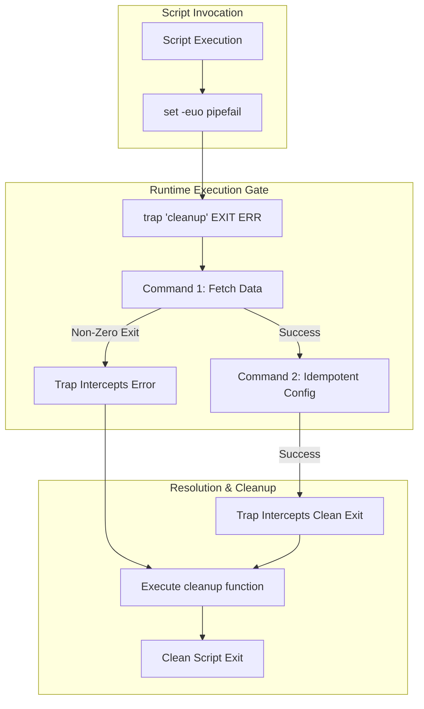

# MOD-LINUX-04: Advanced Bash Scripting & Production Automation

Version: 1.0.0

---

# Lesson Metadata

* **Lesson ID:** MOD-LINUX-04
* **Module:** Linux Fundamentals for Platform Engineers
* **Difficulty:** Intermediate to Advanced
* **Estimated Duration:** 60 minutes
* **Learning Track:** 🟢 Core / 🔵 Professional / 🟣 Expert
* **Version:** 1.0.0
* **Last Updated:** 2026-06-28

---

# Lesson Overview

This lesson transforms basic shell scripting into robust, enterprise-grade systems automation. You will learn how to write idempotent Bash scripts, implement strict error handling (`set -euo pipefail`), manage execution traps (`trap`), handle command-line arguments safely, and integrate structured logging with system journals.

---

# Learning Objectives

By the end of this lesson, you will be able to:

* Enforce strict runtime execution boundaries using `set -euo pipefail`.
* Implement execution traps (`trap`) to guarantee clean resource cleanup upon unexpected script termination.
* Design idempotent automation scripts that execute safely across repeated invocations.
* Transmit structured automation logs directly to the system journal using `logger`.

---

# Prerequisites

* Basic familiarity with Bash command-line execution (`MOD-LINUX-03`).
* Understanding of Linux environment variables.

---

# Why This Exists

In early systems administration, engineers wrote quick, ad-hoc shell scripts to automate repetitive tasks. However, standard Bash behaves highly permissively by default: if a command fails, Bash ignores the failure and blindly executes the next line. If an uninitialized variable is referenced, Bash treats it as an empty string.

In enterprise cloud environments, this permissive behavior causes catastrophic failures (e.g., `rm -rf /$UNINITIALIZED_VAR` deleting the entire root filesystem). Advanced production automation practices were established to bring software engineering rigor, strict error handling, and idempotency to Bash scripting.

---

# Core Concepts

## The Unofficial Bash Strict Mode (`set -euo pipefail`)
Placing `set -euo pipefail` at the top of a script hardens runtime execution:
* `set -e`: Exit immediately if any command returns a non-zero exit status.
* `set -u`: Exit immediately if an uninitialized variable is referenced.
* `set -o pipefail`: Ensure that a failure within a pipeline (e.g., `false | true`) causes the entire pipeline to fail, rather than masking the error with the final command's success.

## Idempotency
An idempotent script produces the exact same end state regardless of how many times it is executed, without throwing errors or creating duplicate configurations.

## Traps & Resource Cleanup
The `trap` command intercepts asynchronous execution signals (`SIGINT`, `SIGTERM`, `ERR`) and executes a designated cleanup function before the script exits, ensuring lock files and temporary directories are reliably purged.

---

# Architecture



---

# Real-World Example

In enterprise CI/CD pipelines (e.g., GitHub Actions or GitLab CI), deployment scripts are frequently written in Bash to bootstrap Kubernetes cluster environments or initialize database schemas. If a network blip causes a package download to fail, an unhardened script will proceed to deploy corrupted binaries. Platform engineers enforce `set -euo pipefail` and `trap` to ensure pipelines fail instantly and clean up partially deployed cloud resources.

---

# Hands-on Demonstration

Let's demonstrate the protective power of `set -u` when handling uninitialized variables.

## Input
We create two scripts attempting to delete a temporary directory using an uninitialized variable. One uses default Bash behavior; the other enforces `set -u`.

## Code
```bash
# Script 1: Default Permissive Bash
bash -c 'TEMP_DIR=""; echo "Cleaning ${TEMP_DIR}/usr"'

# Script 2: Hardened Bash Strict Mode
bash -c 'set -u; echo "Cleaning ${UNINITIALIZED_VAR}/usr"'
```

## Expected Output
```text
Cleaning /usr
bash: line 1: UNINITIALIZED_VAR: unbound variable
```

## Explanation
In Script 1, Bash silently evaluates `${TEMP_DIR}` as an empty string, attempting to execute against `/usr` (which could destroy system binaries). In Script 2, `set -u` detects the unbinded variable and aborts execution instantly, preventing catastrophic damage.

---

# Hands-on Lab

* **Objective:** Architect a production-grade, idempotent Bash backup automation script featuring strict error boundaries, exit trapping, and syslog integration.
* **Estimated Time:** 25 minutes
* **Difficulty:** Advanced
* **Environment:** Linux Terminal

## Step-by-step Instructions

1. Create the production script `/usr/local/bin/secure-backup.sh`:
   ```bash
   sudo bash -c 'cat << "EOF" > /usr/local/bin/secure-backup.sh
   #!/usr/bin/env bash
   set -euo pipefail

   # Configuration
   BACKUP_SRC="/var/log"
   BACKUP_DST="/tmp/enterprise_backup"
   LOCK_FILE="/tmp/secure_backup.lock"

   # Structured Logger
   log() {
       echo "[$(date +'%Y-%m-%dT%H:%M:%S%z')] $1"
       logger -t secure-backup "$1"
   }

   # Cleanup Trap
   cleanup() {
       log "Executing trap cleanup..."
       rm -f "$LOCK_FILE"
   }
   trap cleanup EXIT ERR SIGINT SIGTERM

   # Concurrency Lock Check
   if [[ -f "$LOCK_FILE" ]]; then
       log "ERROR: Backup already in progress. Lock file exists."
       exit 1
   fi
   touch "$LOCK_FILE"

   # Idempotent Destination Creation
   if [[ ! -d "$BACKUP_DST" ]]; then
       log "Creating backup destination directory..."
       mkdir -p "$BACKUP_DST"
   fi

   # Execution
   log "Starting backup of $BACKUP_SRC to $BACKUP_DST..."
   tar -czf "${BACKUP_DST}/log_backup.tar.gz" -C "$BACKUP_SRC" . 2>/dev/null || true
   log "Backup completed successfully."
   EOF'
   sudo chmod +x /usr/local/bin/secure-backup.sh
   ```
2. Execute the backup script:
   ```bash
   /usr/local/bin/secure-backup.sh
   ```

## Verification
Verify the backup archive exists and check the system journal for our structured logs:
```bash
ls -lh /tmp/enterprise_backup/log_backup.tar.gz
sudo journalctl -t secure-backup -n 5
```
**Expected Log Output:**
```text
secure-backup[16212]: Creating backup destination directory...
secure-backup[16212]: Starting backup of /var/log to /tmp/enterprise_backup...
secure-backup[16212]: Backup completed successfully.
secure-backup[16212]: Executing trap cleanup...
```

## Troubleshooting
* **Symptom:** `secure-backup.sh: unbound variable`
  * **Cause:** A variable was referenced with a typo (e.g., `$BACKUP_SRCC`). `set -u` caught the error.
  * **Solution:** Fix the variable spelling in the script.

## Cleanup
```bash
sudo rm -f /usr/local/bin/secure-backup.sh
rm -rf /tmp/enterprise_backup
rm -f /tmp/secure_backup.lock
```

---

# Production Notes

When writing Bash automation that interacts with cloud provider APIs or database endpoints, commands frequently fail due to transient network blips. Implement exponential backoff retry loops rather than failing instantly on the first error:
```bash
retry() {
    local n=1; local max=5; local delay=2
    while true; do
        "$@" && break || {
            if [[ $n -lt $max ]]; then
                sleep $delay; ((n++)); ((delay*=2))
            else
                return 1
            fi
        }
    done
}
```

---

# Common Mistakes

* **Not Quoting Variables:** Beginners write `mkdir $DIR_NAME`. If `DIR_NAME` contains spaces (e.g., `DIR_NAME="My Folder"`), Bash splits the string and creates two separate directories (`My` and `Folder`). Always wrap variables in double quotes: `mkdir "$DIR_NAME"`.
* **Using `ls` to Parse Directories:** Attempting to loop over files using `for file in $(ls *.txt)` breaks catastrophically if filenames contain spaces or newlines. Always use shell globbing: `for file in *.txt; do`.

---

# Failure-Driven Learning

Let's intentionally trigger an execution error mid-script to observe how `trap` guarantees clean resource release.

## The Failure
We modify our backup script to execute an invalid command (`fake_command`) right after creating the concurrency lock file.

```bash
# Simulating mid-script crash
bash -c '
set -euo pipefail
LOCK="/tmp/fail_test.lock"
cleanup() { echo "TRAP: Removing lock"; rm -f "$LOCK"; }
trap cleanup EXIT ERR
touch "$LOCK"
echo "Executing invalid command..."
fake_command_execute_now
echo "This line will never execute."
'
```

## Diagnosis & Recovery
The output immediately shows `TRAP: Removing lock`. Even though `fake_command_execute_now` aborted execution due to `set -e`, the `trap` successfully intercepted the exit and purged the lock file, preventing the script from permanently deadlocking future executions.

---

# Engineering Decisions

When automating complex platform workflows (e.g., provisioning multi-server application architectures), you must decide when to stop using Bash and transition to higher-level languages (Python, Go) or configuration management tools (Ansible, Terraform).
* **Bash:** Excellent for single-instance bootstrapping, container entrypoints, and glued pipeline logic under 100 lines.
* **Python / Go / Ansible:** Mandatory when workflows require complex data structure parsing (JSON/YAML manipulation via APIs), complex exception handling, or multi-node orchestration.

---

# Best Practices

* Always utilize `ShellCheck` (`shellcheck myscript.sh`) in your CI/CD pipelines to catch syntax errors and anti-patterns before execution.
* Explicitly declare variables as `local` inside Bash functions (`local my_var="foo"`) to prevent variable scope pollution across the script.
* Use `logger -t <tag>` to ensure script execution milestones are visible to enterprise SIEM and observability platforms.

---

# Troubleshooting Guide

## Issue 1: Script Fails Silently Inside a Pipeline

* **Problem:** A deployment script executes `kubectl apply -f manifest.yml | grep "service"` and succeeds, but the Kubernetes resources are never created.
* **Cause:** `kubectl apply` failed due to a syntax error, but `grep` successfully processed the empty stream or error output (or exited cleanly). By default, Bash only evaluates the exit code of the final command in a pipeline.
* **Diagnosis:** 
  ```bash
  # Check pipeline failure propagation
  bash -c 'false | true; echo $?' # Returns 0 (Success)
  ```
* **Solution:** Add `set -o pipefail` at the top of the script. This forces the pipeline to return a non-zero exit code if any command within it fails.

---

# Summary

Applying software engineering rigor to Bash scripting is essential for enterprise platform automation. By enforcing `set -euo pipefail`, utilizing `trap` for guaranteed resource cleanup, and writing idempotent logic, platform engineers build highly resilient, predictable automation pipelines.

---

# Cheat Sheet

| Command / Pattern | Description | Best Practice / Rationale |
| :--- | :--- | :--- |
| `set -euo pipefail` | Unofficial Bash Strict Mode | Prevents runaway execution on errors or unbound variables. |
| `trap 'func' EXIT ERR`| Execute cleanup function on exit/error | Guarantees lock files and temp dirs are purged. |
| `logger -t <tag> "<msg>"`| Send structured log to syslog/journal | Preserves automation execution audit trails. |
| `[[ -f "$FILE" ]]` | Robust file existence check | Superior to legacy `[ -f $FILE ]` syntax. |
| `shellcheck <script>` | Static analysis linter for Bash | Catch quoting errors and anti-patterns instantly. |

---

# Knowledge Check

## Multiple Choice Questions

1. What does `set -u` do in a Bash script?
   * A) Unsets all active environment variables.
   * B) Exits immediately if an uninitialized variable is referenced.
   * C) Updates the system package manager before execution.
   * D) Ignores all pipeline errors.

2. Which command intercepts asynchronous execution signals to perform cleanups?
   * A) `catch`
   * B) `trap`
   * C) `exit`
   * D) `intercept`

## Scenario Questions

**Scenario:** You are reviewing a pull request for a Bash script that downloads a database dump and restores it. The author wrote: `curl http://example.com/db.sql > /tmp/db.sql; mysql -u root mydb < /tmp/db.sql`. What are the critical safety flaws in this implementation, and how would you refactor it?

## Short Answer Questions

* Explain what `set -o pipefail` does and why it is critical for CI/CD automation scripts.

---

# Interview Preparation

## Beginner Questions
* What is the purpose of `set -e` in a Bash script?

## Intermediate Questions
* Explain the concept of idempotency in systems automation and provide a concrete example in Bash.

## Advanced Questions
* How does variable scoping work in Bash functions, and what happens if you omit the `local` keyword when declaring a variable inside a recursive function?

## Scenario-Based Discussions
* **Scenario:** A legacy Bash script used to rotate application logs runs as root and occasionally deletes active production log directories. How would you audit and refactor the script?
* **Key Talking Points:** Discuss implementing `set -euo pipefail`, wrapping all variables in double quotes, using `ShellCheck` for static analysis, and adding `trap` statements to handle concurrency lock files.

---

# Further Reading

1. [Unofficial Bash Strict Mode](http://redsymbol.net/articles/unofficial-bash-strict-mode/)
2. [ShellCheck Static Analysis Tool](https://www.shellcheck.net/)
3. [Man7: bash(1)](https://man7.org/linux/man-pages/man1/bash.1.html)
4. *Classic Shell Scripting* by Arnold Robbins & Nelson H. Beebe
5. [Google Shell Style Guide](https://google.github.io/styleguide/shellguide.html)
