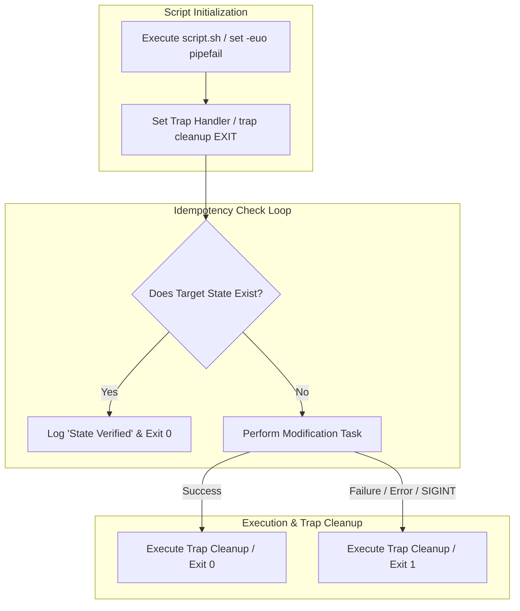

# MOD-LINUX-04: Advanced Bash Scripting & Production Automation

Version: 1.0.0

---

# Lesson Metadata

* **Lesson ID:** MOD-LINUX-04
* **Module:** Linux Fundamentals for Platform Engineers
* **Difficulty:** Intermediate
* **Estimated Duration:** 50 minutes
* **Learning Track:** 🟢 Core / 🔵 Professional / 🟣 Expert
* **Version:** 1.0.0
* **Last Updated:** 2026-06-28

---

# Lesson Overview

This lesson covers the principles of writing resilient, idempotent, production-grade Bash scripts. While platform engineers frequently use Python or Go for complex tooling, Bash remains the universal glue language for container entrypoints, CI/CD pipeline automation, and early system bootstrapping.

---

# Learning Objectives

By the end of this lesson, you will be able to:

* Enforce strict runtime execution safety using `set -euo pipefail`.
* Implement robust signal cleanup handling using `trap` statements.
* Design idempotent execution blocks that run safely multiple times without side effects.

---

# Prerequisites

* Completion of `MOD-LINUX-01`, `MOD-LINUX-02`, and `MOD-LINUX-03`.
* Access to a Linux terminal environment.

---

# Why This Exists

In early systems administration, operational automation relied on fragile, imperative shell scripts. If a command within a 100-line script failed midway, the script blindly continued executing subsequent commands, frequently wiping out production directories or corrupting configuration files.

To elevate shell scripting to an enterprise engineering standard, professional platform engineers adopted strict execution guardrails, idempotency patterns, and structured error trapping. These practices ensure that automation scripts behave predictably, fail fast upon encountering anomalies, and leave systems in a clean, consistent state.

---

# Core Concepts

## Unofficial Bash Strict Mode (`set -euo pipefail`)
* `set -e`: Exit immediately if any command returns a non-zero exit status.
* `set -u`: Treat unset variables as an error and exit immediately (prevents catastrophic `rm -rf /${UNSET_VAR}` executions).
* `set -o pipefail`: Ensure that a failure anywhere within a pipeline (e.g., `false | true`) returns a non-zero exit code rather than masking the failure with the rightmost command's success.

## Idempotency
An idempotent script produces the exact same end state regardless of whether it is executed once, twice, or a hundred times. Before taking action (e.g., creating a user, adding a configuration line), an idempotent script actively inspects the system to check if the desired state has already been achieved.

## Trap Handling
The `trap` command intercepts POSIX signals (`SIGTERM`, `SIGINT`, `EXIT`) and executes designated cleanup functions before the shell process destroys its execution memory space.

---

# Architecture



---

# Real-World Example

Consider an automated deployment script running inside a GitHub Actions CI/CD pipeline runner. The script is responsible for downloading a sensitive encryption key to a temporary file, decrypting a production asset, and deploying it to Kubernetes.

If the deployment step fails due to a network timeout, a naive script simply exits, leaving the unencrypted sensitive key file sitting on the shared CI/CD runner disk. Professional platform engineers utilize `trap 'rm -f /tmp/secret_key' EXIT`. Regardless of whether the script succeeds, encounters a syntax error, or receives a user cancellation (`SIGINT`), the kernel guarantees the trap executes, purging the sensitive plaintext credential from disk.

---

# Hands-on Demonstration

Let's observe the protective behavior of `set -euo pipefail` by creating a script containing an unset variable and observing how the shell handles it.

## Input
We write a script with strict mode enabled that attempts to reference an unassigned variable.

## Code
```bash
cat << 'EOF' > /tmp/strict_test.sh
#!/usr/bin/env bash
set -euo pipefail

echo "Starting deployment..."
# Referencing an unset variable
echo "Deploying to environment: ${TARGET_ENV}"
echo "This line should never execute."
EOF

chmod +x /tmp/strict_test.sh
/tmp/strict_test.sh
```

## Expected Output
```text
Starting deployment...
/tmp/strict_test.sh: line 6: TARGET_ENV: unbound variable
```

## Explanation
Because `set -u` was active, the Bash interpreter intercepted the attempt to evaluate `${TARGET_ENV}`. Instead of evaluating it as an empty string and continuing execution, it instantly halted the script and threw a fatal `unbound variable` error, protecting downstream logic from executing with incomplete parameters.

---

# Hands-on Lab

* **Objective:** Architect an idempotent, strict-mode Bash automation script that manages local service configurations with trap-based lockfile management.
* **Estimated Time:** 25 minutes
* **Difficulty:** Intermediate
* **Environment:** Any Linux terminal.

## Step-by-step Instructions

1. Create the automation script `/usr/local/bin/deploy_service.sh`:
   ```bash
   sudo cat << 'EOF' > /usr/local/bin/deploy_service.sh
   #!/usr/bin/env bash
   set -euo pipefail

   LOCKFILE="/tmp/deploy.lock"
   CONFIG_DIR="/etc/my_service"

   # Trap cleanup function
   cleanup() {
       echo "Executing trap cleanup: removing lockfile."
       rm -f "${LOCKFILE}"
   }
   trap cleanup EXIT

   # Atomic lockfile creation
   if ( set -noclobber; echo "$$" > "${LOCKFILE}" ) 2> /dev/null; then
       echo "Acquired exclusive execution lock."
   else
       echo "Failed to acquire lock. Another deployment is running." >&2
       exit 1
   fi

   # Idempotent directory creation
   if [[ ! -d "${CONFIG_DIR}" ]]; then
       echo "Config directory missing. Creating ${CONFIG_DIR}..."
       mkdir -p "${CONFIG_DIR}"
   else
       echo "Config directory ${CONFIG_DIR} already exists. Skipping."
   fi

   echo "Deployment complete."
   EOF
   ```
2. Make the script executable:
   ```bash
   sudo chmod +x /usr/local/bin/deploy_service.sh
   ```
3. Execute the script twice to verify its idempotent behavior:
   ```bash
   sudo /usr/local/bin/deploy_service.sh
   sudo /usr/local/bin/deploy_service.sh
   ```

## Verification
Inspect the terminal output of the second run to verify it logs `already exists. Skipping.` and verify `/tmp/deploy.lock` is cleanly removed after execution.

## Troubleshooting
* **Symptom:** `Failed to acquire lock. Another deployment is running.`
  * **Cause:** A previous test run was forcefully killed with `kill -9`, bypassing the exit trap and leaving a stale lockfile.
  * **Solution:** Manually remove the stale lockfile using `sudo rm -f /tmp/deploy.lock`.

## Cleanup
```bash
sudo rm -rf /etc/my_service
sudo rm -f /usr/local/bin/deploy_service.sh
```

---

# Production Notes

In enterprise environments, writing massive, thousand-line Bash scripts is an anti-pattern. Shell scripts lack robust data structures (maps, nested structs) and comprehensive unit testing frameworks. If your automation logic requires complex API polling, JSON parsing, or multi-threading, senior platform engineers migrate the logic to Python, Go, or encapsulate it within declarative tools like Ansible or Terraform.

---

# Common Mistakes

* **Parsing `ls` Output:** Beginners frequently iterate over file directories using `for file in $(ls *.txt)`. If a filename contains a space, the loop breaks it into multiple distinct invalid files. Always use globbing: `for file in *.txt; do ...`.
* **Neglecting Quotes Around Variables:** Writing `echo $VAR` instead of `echo "$VAR"`. Unquoted variables are subjected to word splitting and glob expansion, leading to unpredictable script failures.

---

# Failure-Driven Learning

Let's observe how pipeline failures are silently masked in Bash unless `set -o pipefail` is explicitly declared.

## The Failure
We simulate a failing command piped into a successful formatting command (like `tee` or `awk`).

```bash
# Executing without pipefail
(
  set +o pipefail
  ls /nonexistent_dir | tee /tmp/output.log
  echo "Exit code without pipefail: $?"
)

# Executing with pipefail
(
  set -o pipefail
  ls /nonexistent_dir | tee /tmp/output.log
  echo "Exit code with pipefail: $?"
)
```

## Expected Output
```text
ls: cannot access '/nonexistent_dir': No such file or directory
Exit code without pipefail: 0
ls: cannot access '/nonexistent_dir': No such file or directory
Exit code with pipefail: 2
```

## Diagnosis & Recovery
Without `pipefail`, the pipeline returns `0` (success) because `tee` succeeded, hiding the fatal `ls` failure from your CI/CD runner. With `pipefail`, the non-zero exit code (`2`) propagates correctly, allowing your orchestration platform to catch the failure and halt deployment.

---

# Engineering Decisions

When writing container entrypoint scripts, you must decide between using `exec` to replace the shell process or allowing the shell to spawn the application as a child process.
* **Child Process (`python app.py`):** The bash script remains `PID 1` and spawns Python as `PID 2`. Bash does not forward `SIGTERM` signals to child processes by default, preventing graceful shutdowns.
* **Exec Replacement (`exec python app.py`):** The `exec` command replaces the Bash shell memory space entirely with the Python runtime. Python assumes `PID 1`, receiving Kubernetes `SIGTERM` signals directly for clean shutdowns.

---

# Best Practices

* **Lint All Scripts with ShellCheck:** Never merge a Bash script into a Git repository without passing it through `shellcheck`, an advanced static analysis tool that detects edge cases and syntax vulnerabilities.
* **Use Double Brackets for Tests:** Prefer `[[ condition ]]` over legacy `[ condition ]`. Double brackets support clean regex matching and prevent word splitting errors.

---

# Troubleshooting Guide

## Issue 1: Script Fails with `\r: command not found` or `bad interpreter`

* **Cause:** The script was edited on a Windows machine, introducing CRLF (`\r\n`) line endings instead of Linux LF (`\n`).
* **Diagnosis:** Inspect the raw line endings using `file my_script.sh` or `cat -v my_script.sh`. You will see `^M` appended to every line.
* **Solution:** Strip the Windows carriage returns using `dos2unix my_script.sh` or `sed -i -e 's/\r$//' my_script.sh`.

---

# Summary

Writing resilient, idempotent Bash scripts ensures that platform automation executes predictably and safely across enterprise infrastructure. By enforcing strict mode, designing idempotent blocks, and capturing exit traps, you transform brittle shell scripts into robust engineering tooling.

---

# Cheat Sheet

| Command | Purpose | Example |
| :--- | :--- | :--- |
| `set -euo pipefail` | Unofficial Bash Strict Mode | `set -euo pipefail` |
| `trap <cmd> EXIT` | Execute cleanup on termination | `trap 'rm -f $TEMP' EXIT` |
| `exec <command>` | Replace shell process memory | `exec /usr/bin/supervisord` |
| `shellcheck <script>` | Perform static analysis linting | `shellcheck deploy.sh` |
| `dos2unix <script>` | Fix Windows CRLF line endings | `dos2unix entrypoint.sh` |

---

# Knowledge Check

To test your mastery of advanced bash scripting and idempotency, review the dedicated questions in `quizzes/quiz-linux-01.md`.

---

# Interview Preparation

## Beginner Questions
* What is the purpose of `set -e` in a Bash script?

## Intermediate Questions
* Explain the concept of idempotency and give an example of an idempotent file modification check in Bash.

## Advanced Questions
* Why is using `exec` inside a Docker container `entrypoint.sh` script critical for proper Kubernetes Pod lifecycle management?

## Scenario-Based Discussions
* **Scenario:** A legacy automation script randomly fails midway during a massive server migration, leaving half the servers configured and half untouched. How would you redesign it?
* **Key Talking Points:** Explain refactoring the script to include `set -euo pipefail` for fast failure. Discuss implementing explicit idempotency checks before every modification step, and utilizing lockfiles via `trap` to prevent race conditions.

---

# Further Reading

1. [ShellCheck — Shell Script Static Analysis Tool](https://www.shellcheck.net/)
2. [Unofficial Bash Strict Mode](http://redsymbol.net/articles/unofficial-bash-strict-mode/)
3. [man bash(1)](https://man7.org/linux/man-pages/man1/bash.1.html)
