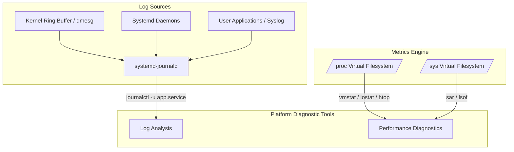

# MOD-LINUX-05: Linux Logging, System Monitoring & Diagnostics

Version: 1.0.0

---

# Lesson Metadata

* **Lesson ID:** MOD-LINUX-05
* **Module:** Linux Fundamentals for Platform Engineers
* **Difficulty:** Intermediate
* **Estimated Duration:** 60 minutes
* **Learning Track:** 🟢 Core / 🔵 Professional / 🟣 Expert
* **Version:** 1.0.0
* **Last Updated:** 2026-06-28

---

# Lesson Overview

This lesson covers the core methodologies of Linux system monitoring, log analysis, and performance diagnostics. You will learn how to interrogate the Systemd journal (`journalctl`), analyze traditional syslog files, and utilize mission-critical diagnostic utilities (`iostat`, `vmstat`, `htop`, `lsof`, `sar`) to isolate CPU, memory, and disk I/O bottlenecks in production environments.

---

# Learning Objectives

By the end of this lesson, you will be able to:

* Query and filter system and service logs efficiently using `journalctl`.
* Diagnose disk I/O saturation and storage bottlenecks using `iostat` and `iotop`.
* Analyze virtual memory statistics, paging, and swapping behavior using `vmstat`.
* Isolate open file descriptors and network port bindings using `lsof`.

---

# Prerequisites

* Understanding of Systemd daemons (`MOD-LINUX-03`).
* Basic terminal text filtering knowledge (`grep`, `awk`).

---

# Why This Exists

When a production server experiences severe latency or crashes, platform engineers cannot rely on guesswork. Early Unix systems wrote unstructured text logs to `/var/log`, requiring engineers to manually parse disparate files with complex regex strings.

As enterprise infrastructure scaled to distributed microservices, centralized structured logging (Systemd Journal) and real-time kernel metrics instrumentation (`/proc` and `/sys` virtual filesystems) were introduced. These enable engineers to conduct rapid, structured root-cause analysis during high-pressure production incidents.

---

# Core Concepts

## Systemd Journal (`journalctl`)
The Systemd journal is a centralized, structured, binary logging system managed by `systemd-journald`. It indexes logs by metadata (Unit, UID, priority, boot session), allowing highly performant filtering.

## The `/proc` and `/sys` Virtual Filesystems
The Linux kernel projects real-time hardware and process metrics directly into memory via the `/proc` and `/sys` virtual filesystems. Monitoring utilities (`top`, `iostat`, `vmstat`) do not perform magic; they simply parse and format data from these virtual directories.

## Bottleneck Isolation (The USE Method)
Developed by performance architect Brendan Gregg, the USE Method stands for **Utilization, Saturation, and Errors**. For every system resource (CPU, Memory, Disk, Network), platform engineers inspect these three metrics to isolate performance bottlenecks.

---

# Architecture



---

# Real-World Example

In enterprise Kubernetes clusters, worker nodes occasionally experience "Disk Pressure" conditions, causing the `kubelet` to evict active application pods. Platform engineers utilize `iostat -xz 1` and `journalctl -u kubelet` to determine whether the underlying storage volume is exhausted by excessive I/O wait times (`%iowait`) or if an aggressive logging daemon is saturating disk write queues.

---

# Hands-on Demonstration

Let's demonstrate how to interrogate the system journal for specific service failures and inspect real-time disk I/O statistics.

## Input
We query `journalctl` for recent kernel error messages and execute `iostat` to verify disk utilization.

## Code
```bash
# Query journal for high-priority kernel errors from the current boot session
sudo journalctl -k -p err -b 0

# Inspect extended disk I/O statistics
iostat -xz 1 2
```

## Expected Output
```text
Jun 28 01:45:12 enterprise-node kernel: [ 12.345678] EXT4-fs (sda1): re-mounted. Opts: (null)

Linux 5.15.0-102-generic (enterprise-node) 	06/28/2026 	_x86_64_	(4 CPU)

Device:         rrqm/s   wrqm/s     r/s     w/s    rkB/s    wkB/s avgrq-sz avgqu-sz   await r_await w_await  svctm  %util
sda               0.02     1.50    5.20   12.30   204.10   150.20    40.50     0.02    1.20    0.80    1.50   0.50   1.10
```

## Explanation
The `journalctl` command filters specifically for kernel logs (`-k`), priority error or higher (`-p err`), from the active boot session (`-b 0`). The `iostat -xz 1 2` command outputs extended (`-x`) disk metrics excluding idle devices (`-z`), revealing average queue sizes (`avgqu-sz`) and overall disk utilization (`%util` at `1.10%`).

---

# Hands-on Lab

* **Objective:** Simulate an aggressive memory and disk I/O load, then utilize `vmstat`, `iostat`, and `journalctl` to isolate the performance bottleneck in real time.
* **Estimated Time:** 25 minutes
* **Difficulty:** Intermediate
* **Environment:** Linux Terminal with sudo/root access

## Step-by-step Instructions

1. Install required diagnostic utilities (`sysstat` package provides `iostat` and `vmstat`):
   ```bash
   sudo apt-get update && sudo apt-get install -y sysstat || sudo dnf install -y sysstat
   ```
2. In a background process, simulate high disk I/O and CPU load by copying raw data from `/dev/zero`:
   ```bash
   dd if=/dev/zero of=/tmp/load_test bs=1M count=1024 oflag=dsync &
   DD_PID=$!
   ```
3. Immediately open a new terminal window (or execute concurrently) and use `vmstat` to observe virtual memory and CPU I/O wait (`wa`) states:
   ```bash
   vmstat 1 5
   ```
4. Use `iostat` to inspect disk saturation and queue latency:
   ```bash
   iostat -xz 1 5
   ```

## Verification
Verify that `vmstat` reflects elevated I/O wait time in the `wa` column and `iostat` shows `%util` nearing 100% on the target storage device:
```text
# vmstat sample output showing elevated 'wa' (I/O Wait)
procs -----------memory---------- ---swap-- -----io---- -system-- ------cpu-----
 r  b   swpd   free   buff  cache   si   so    bi    bo   in   cs us sy id wa st
 1  1      0 123456  45678 890123    0    0     0 45678 1234 5678 10 20 20 50  0
```

## Troubleshooting
* **Symptom:** `iostat: command not found`
  * **Cause:** The `sysstat` package is not installed on the system.
  * **Solution:** Execute `sudo apt-get install sysstat` or `sudo yum install sysstat`.

## Cleanup
```bash
kill -9 $DD_PID 2>/dev/null || true
rm -f /tmp/load_test
```

---

# Production Notes

When configuring enterprise logging architectures (e.g., Elasticsearch/Fluentd/Kibana or Loki/Promtail), ensure `systemd-journald` is configured with strict storage limits in `/etc/systemd/journald.conf` (`SystemMaxUse=5G`). Without limit caps, runaway application debug logs can consume 100% of the root disk volume, crashing the entire host.

---

# Common Mistakes

* **Parsing unstructured text logs with `cat`:** Beginners frequently run `cat /var/log/syslog | grep "error"`. This loads massive multi-gigabyte files directly into memory, thrashing the page cache. Always utilize `grep` directly (`grep "error" /var/log/syslog`) or use `journalctl` for indexed searches.
* **Misinterpreting High Memory Usage in `top`:** Beginners panic when `top` shows 98% memory utilization. In Linux, unused memory is wasted memory; the kernel aggressively caches filesystem data in RAM (`buff/cache`). Always inspect the `available` memory metric to gauge true memory exhaustion.

---

# Failure-Driven Learning

Let's simulate a silent service failure where a port binding conflict prevents a daemon from starting, and observe the diagnostic isolation path.

## The Failure
We launch a background python web server on port `8080`, then attempt to launch a second instance on the exact same port.

```bash
# Launch first server instance
python3 -m http.server 8080 &
SERVER_PID=$!
# Attempt to launch second instance on same port
python3 -m http.server 8080
# OSError: [Errno 98] Address already in use
```

## Diagnosis & Recovery
When a production service fails with `Address already in use`, platform engineers use `lsof` or `ss` to isolate the conflicting process occupying the port:
```bash
# Isolate process occupying port 8080
lsof -i :8080
# Or using socket statistics
ss -tulpn | grep 8080
```
Recover by terminating the conflicting process ID (`kill -15 $SERVER_PID`).

---

# Engineering Decisions

When designing metric collection architectures for platform monitoring, you must decide between Pull-based scraping (e.g., Prometheus) and Push-based ingestion (e.g., Telegraf / StatsD).
* **Pull (Prometheus):** Highly scalable; centralized configuration; excellent for dynamic container environments (Kubernetes) where targets disappear rapidly.
* **Push (Telegraf):** Excellent for edge devices or legacy bare-metal servers behind strict firewalls where inbound scraping is blocked.

---

# Best Practices

* Use the USE Method (Utilization, Saturation, Errors) systematically when diagnosing system emergencies.
* Rotate traditional text logs using `logrotate` to prevent storage exhaustion.
* Always inspect `dmesg -T` or `journalctl -k` during unexpected application terminations to check if the kernel Out-Of-Memory (`OOMKiller`) forcefully terminated the process.

---

# Troubleshooting Guide

## Issue 1: Process Forcefully Terminated by Kernel (OOM-Killed)

* **Problem:** A production Java or AI inference container mysteriously disappears or exits with code `137`.
* **Cause:** The application exceeded its allocated memory boundaries, threatening system stability. The Linux kernel's Out-Of-Memory Killer (`OOMKiller`) stepped in and forcefully terminated the process (`SIGKILL`) to free up physical RAM.
* **Diagnosis:** 
  ```bash
  # Interrogate kernel ring buffer for OOM Killer invocations
  sudo dmesg -T | grep -i -E 'oom|kill'
  # Or query journalctl
  sudo journalctl -k | grep -i "oom-killer"
  ```
* **Solution:** Increase the memory limit allocation for the container in Kubernetes/Docker manifests, or configure JVM/runtime memory flags (`-Xmx`) to ensure the application garbage collects before breaching physical memory boundaries.

---

# Summary

Mastering Linux logging and diagnostic utilities is non-negotiable for enterprise reliability. By systematically applying the USE Method, querying `journalctl`, and leveraging kernel instrumentation (`iostat`, `vmstat`, `lsof`), platform engineers can isolate and remediate complex infrastructure bottlenecks with absolute confidence.

---

# Cheat Sheet

| Command | Description | Best Practice / Diagnostic Focus |
| :--- | :--- | :--- |
| `journalctl -u <unit> -f` | Follow live service logs | Replaces legacy `tail -f /var/log/syslog`. |
| `journalctl -k -b 0` | Inspect kernel logs from active boot | Essential for diagnosing hardware/OOM errors. |
| `iostat -xz 1` | Real-time disk I/O diagnostics | Watch `%util` and `avgqu-sz` for disk saturation. |
| `vmstat 1` | Virtual memory & CPU wait diagnostics| Watch `wa` (I/O wait) and `si`/`so` (swap in/out). |
| `lsof -i :<port>` | Isolate process binding to a port | Resolves `Address already in use` conflicts instantly. |

---

# Knowledge Check

## Multiple Choice Questions

1. Which command filters `journalctl` specifically for kernel messages?
   * A) `journalctl -u kernel`
   * B) `journalctl -k`
   * C) `journalctl -p emerg`
   * D) `journalctl -m`

2. What does the `wa` column in `vmstat` output represent?
   * A) Warning alerts
   * B) Worker threads
   * C) CPU time spent waiting for I/O operations
   * D) Allocated memory swap

## Scenario Questions

**Scenario:** A production API server is becoming highly unresponsive. `top` reveals low CPU usage, but `iostat` shows 100% `%util` on `/dev/sda1`. How would you identify the specific process causing this massive disk write activity?

## Short Answer Questions

* Explain what the USE Method is and how you would apply it to diagnose a memory bottleneck.

---

# Interview Preparation

## Beginner Questions
* What is the purpose of `journalctl`?

## Intermediate Questions
* Explain the difference between active memory (`used`) and cached memory (`buff/cache`) in Linux.

## Advanced Questions
* How does the Linux kernel determine which process to terminate when invoking the OOM Killer, and how can you adjust a process's OOM score (`oom_score_adj`) to protect mission-critical daemons?

## Scenario-Based Discussions
* **Scenario:** An enterprise database server crashes at 2:00 AM every night. There are no application error logs. How would you diagnose the root cause?
* **Key Talking Points:** Discuss interrogating `journalctl -k` or `dmesg` for OOM Killer events, inspecting `sar` (System Activity Report) historical metrics for memory/disk spikes around 2:00 AM, and checking for conflicting scheduled cron/systemd backup jobs.

---

# Further Reading

1. [Man7: journalctl(1)](https://man7.org/linux/man-pages/man1/journalctl.1.html)
2. [Man7: iostat(1)](https://man7.org/linux/man-pages/man1/iostat.1.html)
3. [Brendan Gregg: The USE Method](https://www.brendangregg.com/usemethod.html)
4. *Systems Performance: Enterprise and the Cloud* by Brendan Gregg
5. [Red Hat: Monitoring System Performance with sysstat](https://www.redhat.com/en/blog/monitoring-system-performance-sysstat)
