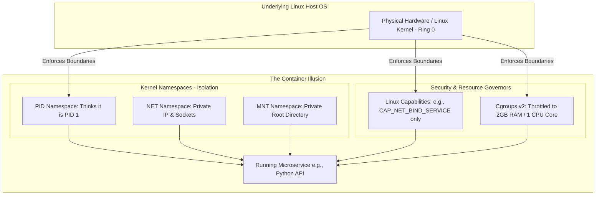
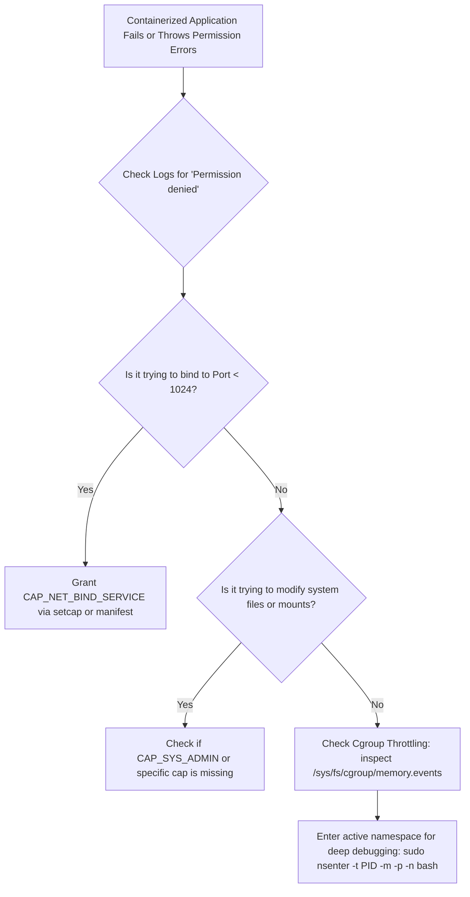

# Lesson 06: Enterprise Linux Security, Cgroups & Capability Hardening

---

## 1. Lesson Metadata

* **Module:** Module 01 — Linux Fundamentals for Platform Engineers
* **Lesson:** Lesson 06 — Enterprise Linux Security, Cgroups & Capability Hardening
* **Target Audience:** Future Platform Engineers & AI Infrastructure Engineers
* **Difficulty Level:** Beginner (80%) / Intermediate (20%)
* **Estimated Completion Time:** 45 minutes

---

## 2. Lesson Overview

Welcome to the grand capstone lesson of Module 01! Throughout our previous lessons, we mastered Linux architecture (User/Kernel space), file security (Permissions/ACLs), process management (Systemd), automation (Advanced Bash), and diagnostics (Logging & Monitoring). Now, we are ready to explore the crowning achievement of modern Platform Engineering: **Kernel Hardening & Containerization Building Blocks**.

Have you ever wondered what a "container" (like Docker) actually is? Beginners often think Docker is a magical lightweight virtual machine. But here is the amazing secret: **containers do not exist in the Linux kernel!** 

A container is simply a beautiful illusion created by combining three powerful Linux security features: **Linux Capabilities**, **Kernel Namespaces**, and **Control Groups (`cgroups v2`)**. 

In this capstone lesson, we will explore these incredible building blocks. You will learn how to break down the dangerous monolithic root account using Capabilities (`setcap`), isolate a process's view of the world using Namespaces (`unshare`), and limit a program's CPU and memory consumption using Control Groups. You are about to master the fundamental technology that powers the entire modern cloud!

---

## 3. Learning Objectives

By completing this lesson, you will be able to:
* **Explain** how modern containerization (Docker/Kubernetes) is constructed from foundational Linux kernel security primitives.
* **Deconstruct** monolithic root privileges into granular access rules using Linux Capabilities (`setcap`, `getcap`, `getpcaps`).
* **Isolate** process execution environments across PID, Mount, and Network boundaries using Kernel Namespaces (`unshare`, `lsns`, `nsenter`).
* **Regulate** process resource consumption (CPU, Memory, I/O) using Control Groups (`cgroups v2`).
* **Synthesize** enterprise Linux security practices to harden application runtimes against privilege escalation vulnerabilities.

---

## 4. Prerequisites

To be fully prepared for this capstone lesson, you should have completed:
* **[Lesson 01: Linux Architectural Fundamentals & Kernel Anatomy](lesson-01.md)**
* **[Lesson 02: User, Group, and Permission Management (DAC & RBAC)](lesson-02.md)**
* **[Lesson 03: Process Management, Daemons, and Systemd Initialization](lesson-03.md)**
* **[Lesson 04: Advanced Bash Scripting & Production Automation](lesson-04.md)**
* **[Lesson 05: Linux Logging, System Monitoring & Diagnostics](lesson-05.md)**
* An active Linux terminal session to explore capability and namespace commands.
* Assume only what we learned in Lessons 01–05—we will build the rest of our intuition together!

---

## 5. Why This Exists

Imagine you are managing a highly secure bank. In the old days, the bank manager had one single master golden key. This key opened the front doors, the customer safety deposit boxes, the employee lounge, and the main underground vault. If a clumsy employee needed to open the front door and borrowed the master key, they suddenly had the power to walk into the underground vault and take all the money!

Traditionally, Linux operated exactly like this. You were either a regular user in User Space with zero administrative power, or you were the all-powerful `root` user with the master golden key. If a web server needed to listen on network port `80` (which requires administrative privileges), you had to run the entire web server as root. If a hacker found a tiny bug in the web server, they instantly gained the master golden key to your entire machine!

To solve this massive security danger, Linux created three elegant security walls:
1. **Linux Capabilities:** Instead of one master golden key, Linux broke root down into forty distinct digital keycards (e.g., one keycard *just* for opening network ports).
2. **Kernel Namespaces:** A magic mirror that tricks a process into thinking it is the only program running on the entire computer.
3. **Control Groups (`cgroups v2`):** A strict resource governor that ensures a program cannot consume 100% of the CPU or memory.

By combining these three features, Platform Engineers created modern containers, allowing us to run untrusted microservices securely and efficiently on massive cloud servers!

---

## 6. Core Concepts

### Linux Capabilities (Breaking Down Root)
Instead of granting absolute root powers, **Linux Capabilities** allow you to assign precise, granular administrative privileges directly to an application binary using `setcap`. Here are three famous capabilities every Platform Engineer should know:
* **`CAP_NET_BIND_SERVICE`:** Allows a program to open privileged network ports (like port `80` or `443`) without needing full root access.
* **`CAP_CHOWN`:** Allows a program to change file ownership without needing full root access.
* **`CAP_SYS_ADMIN`:** The ultimate heavyweight capability! It allows advanced kernel operations (like mounting filesystems). (Treat this one with extreme caution!).

### Kernel Namespaces (The Magic Mirror)
**Kernel Namespaces** wrap a process in an isolated virtual bubble. When a program runs inside a namespace, it cannot see or interfere with any other programs on the machine! Here are the core namespaces that make containers possible:
* **PID Namespace:** Isolates the process table. Inside a PID namespace, your program thinks it is `PID 1`!
* **MNT (Mount) Namespace:** Isolates the filesystem. The program gets its own private `/` root folder.
* **NET (Network) Namespace:** Isolates network interfaces. The program gets its own private IP address and routing table.
* **UTS Namespace:** Isolates the hostname. The program gets its own unique computer name.
* **USER Namespace:** Isolates user accounts. A program can run as fake `root` inside the bubble while remaining a completely unprivileged regular user outside!

### Control Groups (`cgroups v2` / Resource Throttling)
While Namespaces isolate what a program *sees*, **Control Groups (`cgroups v2`)** isolate what a program *uses*. A cgroup is a strict governor created in the virtual `/sys/fs/cgroup` directory. If you place a heavy AI processing script inside a cgroup configured with a 2GB memory limit, the moment it attempts to use 2.1GB, the kernel instantly throttles or terminates it, protecting the rest of your server from starving!

---

## 7. Architecture

Here is a clear architectural diagram showing how a modern container is constructed by wrapping a process in Capabilities, Namespaces, and Control Groups:



---

## 8. Real-World Example

Let's look at how this operates in a real-world production environment!

Imagine you are managing a massive Kubernetes cluster running thousands of customer microservices. One customer deploys a poorly written web application that contains a severe security vulnerability and a massive memory leak.

Because your container runtime utilizes Linux security primitives, the application is locked inside a **PID Namespace** (so it cannot see or kill other customer processes), stripped of all **Linux Capabilities** except `CAP_NET_BIND_SERVICE` (so even if a hacker breaks in, they cannot mount filesystems or modify system passwords), and throttled by a **Cgroup** (so the memory leak is instantly contained). Your Kubernetes cluster remains perfectly stable, secure, and blazing fast!

---

## 9. Hands-on Demonstration

Let's open our terminal and see how easy it is to inspect Linux capabilities, attach a capability to a binary using `setcap`, and create our very own isolated container namespace bubble using `unshare`!

### Input
We will inspect the capabilities of the `ping` command using `getcap`, make a copy of the `python3` binary and grant it `CAP_NET_BIND_SERVICE` using `setcap`, and then use `unshare` to launch an isolated shell that thinks it is running in a brand-new process namespace!

### Code
```bash
# 1. We use 'getcap' to inspect the built-in capabilities of the ping command.
# (Note: Ping requires CAP_NET_RAW to send raw ICMP network packets without full root).
getcap /usr/bin/ping || true

# 2. Let's make a local copy of the python3 binary so we can experiment safely.
cp /usr/bin/python3 ./my_py_server

# 3. We use 'setcap' to attach the capability to bind to low network ports (like port 80).
sudo setcap 'cap_net_bind_service=+ep' ./my_py_server

# 4. Let's verify our capability was successfully attached to our custom binary!
getcap ./my_py_server

# 5. Now, let's use 'unshare' to create an isolated container namespace bubble!
# (Note: '--fork --pid --mount-proc' creates a brand-new PID namespace table where our command becomes PID 1!).
sudo unshare --fork --pid --mount-proc bash -c 'echo "Inside our Namespace bubble! Our PID is: $$"; ps -ef'
```

### Expected Output
```text
/usr/bin/ping cap_net_raw=ep
./my_py_server cap_net_bind_service=ep

Inside our Namespace bubble! Our PID is: 1
UID          PID    PPID  C STIME TTY          TIME CMD
root           1       0  0 03:15 ?        00:00:00 bash -c echo "Inside our Namespace bubble! Our PID is: $$"; ps -ef
root           2       1  0 03:15 ?        00:00:00 ps -ef
```

### Explanation
Look at the incredible container mechanics displayed in our output!
1. When we inspected `/usr/bin/ping`, Linux revealed `cap_net_raw=ep`. This is why regular users can ping external servers without typing `sudo`!
2. When we executed `setcap` on `./my_py_server`, we securely attached `cap_net_bind_service=ep`. Now our custom Python binary can launch production web servers on port `80` as a completely unprivileged regular user!
3. Finally, when we executed `unshare`, notice the magic mirror in our output! The `ps -ef` command inside the bubble printed `PID 1`. Our bash shell had absolutely no idea that there were hundreds of other processes running on the host machine. You just built a container from scratch!

---

## 10. Hands-on Lab

To solidify your mastery of Linux capabilities, `setcap`, namespace isolation (`unshare`), and cgroup resource limits, you will complete a dedicated, standalone practical laboratory.

### Lab Summary
In this lab, you will open your terminal to build a miniature container runtime from scratch using basic Linux commands. You will practice stripping dangerous capabilities from web servers, explore active namespaces using `lsns`, and configure a custom cgroup in `/sys/fs/cgroup` to successfully throttle a heavy CPU script.

### Lab Reference
For the complete step-by-step lab guide, please refer to the standalone lab document:
* **`labs/linux-automation.md`** *(Section 6: Security, Cgroups & Containerization)*

---

## 11. Production Notes

In a local learning environment, you might be used to running `docker run` and letting Docker handle all the underlying namespaces and cgroups for you. But in an enterprise cloud environment, Platform Engineers must deeply inspect and harden these boundaries to comply with strict security audits!

In production, Platform Engineers configure **Security Contexts and Capability Dropping** inside Kubernetes deployment manifests. Instead of accepting default container settings, engineers explicitly configure `securityContext.capabilities.drop: ["ALL"]` and add back *only* the precise capabilities required for the microservice to function.

*(Where to learn more: We will explore advanced container security hardening and Kubernetes runtime configurations in **Stage 2: Containerization & Virtualization**).*

---

## 12. Common Mistakes

When mastering container building blocks, beginners frequently run into a few common pitfalls:

* **Mistake 1: Assuming containers provide the exact same isolation as physical virtual machines.** 
  * *Correction:* Beginners often believe that a Docker container is as isolated as a VMware or AWS EC2 virtual machine. Notice the underlying architecture: virtual machines get their own independent guest operating system kernel. Containers, however, all share the exact same underlying host Linux kernel! If a hacker breaks out of a container using a kernel vulnerability in Ring 0, they can compromise the entire host machine. This is why capability hardening is so critical!
* **Mistake 2: Granting `CAP_SYS_ADMIN` to solve minor container permission errors.**
  * *Correction:* When an application inside a container throws a permission error, beginners are tempted to add `CAP_SYS_ADMIN` or run the container in `--privileged` mode. This is the equivalent of handing back the master golden key! `CAP_SYS_ADMIN` allows the container to rewrite host filesystems and bypass namespace boundaries entirely. Never use it unless absolutely necessary.

---

## 13. Failure-Driven Learning

Let's perform a safe, instructive failure simulation in our terminal to observe how Linux protects privileged network ports from unprivileged programs!

### Simulation
We will attempt to launch a Python web server on port `80` (a privileged port reserved for root) as a regular user using a standard python binary that lacks capabilities. We want to observe how the kernel rejects us and how capabilities solve the problem.

### Code
```bash
# 1. We attempt to launch a web server on privileged port 80 using standard python3.
python3 -m http.server 80 || true

# 2. Now, let's verify that our custom binary with CAP_NET_BIND_SERVICE can bind perfectly!
# (Note: We use our custom binary created in the previous demonstration).
./my_py_server -m http.server 80 &
CUSTOM_SRV_PID=$!
sleep 2

# 3. Let's clean up our custom web server using kill.
kill -15 $CUSTOM_SRV_PID
```

### Expected Output
```text
Traceback (most recent call last):
  File "/usr/lib/python3.10/http/server.py", line 130, in server_bind
    socketserver.TCPServer.server_bind(self)
PermissionError: [Errno 13] Permission denied

Serving HTTP on 0.0.0.0 port 80 (http://0.0.0.0:80/) ...
[1]+  Terminated              ./my_py_server -m http.server 80
```

### Explanation
Notice exactly what happened! When we ran standard `python3` on port `80`, the Linux kernel inspected our privilege ring (Ring 3), saw that we lacked root powers or specific capabilities, and instantly rejected us with **`PermissionError: [Errno 13] Permission denied`**.

But when we executed `./my_py_server` (which had `CAP_NET_BIND_SERVICE` attached), the kernel verified the digital keycard and allowed our unprivileged regular user to launch a production web server on port `80` perfectly! You just witnessed the incredible power of Linux capability hardening!

---

## 14. Engineering Decisions

As a Platform Engineer, you will make architectural trade-offs regarding container runtimes:

### Traditional Shared-Kernel Containers vs. MicroVM Containers (e.g., Kata Containers / gVisor)
* **The Decision:** Should you deploy multi-tenant customer applications using traditional shared-kernel containers (Docker/containerd) or implement hardware-isolated MicroVM containers like Kata Containers or Google gVisor?
* **The Trade-off:** Traditional shared-kernel containers are incredibly lightweight, spinning up in milliseconds with near-zero memory overhead. However, because they share the underlying host Linux kernel, a kernel exploit compromises the entire node. For trusted internal microservices, traditional containers are absolute perfection! But for running completely untrusted, third-party customer code (like serverless cloud functions), Platform Engineers choose MicroVM runtimes like Kata Containers because they wrap each container in a dedicated, hardware-isolated miniature kernel.

---

## 15. Best Practices

Here are three actionable rules you should embed in your daily engineering habits:

1. **Drop ALL capabilities by default:** When creating container deployment manifests, get into the habit of dropping all capabilities (`drop: ["ALL"]`) and adding back only the specific flags your application needs.
2. **Never run containers in `--privileged` mode:** Treat privileged container execution as a severe security vulnerability; it bypasses namespaces and cgroups entirely.
3. **Audit active namespaces with `lsns`:** Use `lsns` in your terminal to inspect running namespaces and understand exactly how your container runtime is isolating process trees on the host machine.

---

## 16. Troubleshooting Guide

When diagnosing failing container runtimes or capability permission blocks, follow this structured troubleshooting workflow:



### Common Troubleshooting Scenarios
* **Problem:** A containerized database performs exceptionally slowly during peak traffic hours despite the host server having plenty of idle CPU cores.
  * **Cause:** The database process is being actively throttled by its Control Group (`cgroup`) CPU quota settings.
  * **Diagnosis:** Inspect the cgroup throttling metrics by reading `/sys/fs/cgroup/cpu.stat` and looking for high `nr_throttled` counts.
  * **Solution:** Adjust the container runtime CPU limit allocation (e.g., increasing `resources.limits.cpu` in Kubernetes).
* **Problem:** You need to debug network routing tables inside a running lightweight container that has no shell or debugging tools installed.
  * **Cause:** Lightweight distroless containers lack `bash`, `ip`, or `curl` binaries.
  * **Diagnosis:** Find the container's underlying host PID using `docker inspect <container>`.
  * **Solution:** Execute `sudo nsenter -t <PID> -n -p -m bash` from the host machine to enter the container's network namespace using your host terminal's powerful debugging binaries!

---

## 17. Summary

Let's review the spectacular enterprise security and containerization concepts we have mastered in this capstone lesson:
* **Deconstructing Root:** Using **Linux Capabilities**, we break down the dangerous monolithic root account into granular digital keycards (`CAP_NET_BIND_SERVICE`, `CAP_CHOWN`), adhering to the Principle of Least Privilege.
* **The Magic Mirror:** **Kernel Namespaces** (`PID`, `MNT`, `NET`) wrap processes in isolated virtual bubbles, tricking programs into thinking they are running alone on a private machine.
* **Resource Throttling:** **Control Groups (`cgroups v2`)** act as strict resource governors, preventing runaway applications from consuming 100% of host CPU or memory.
* **The Container Illusion:** We understand that modern containers (Docker/Kubernetes) are not magical virtual machines, but are beautifully engineered combinations of Capabilities, Namespaces, and Cgroups!

---

## 18. Cheat Sheet

Here is your quick-reference summary for Linux capabilities, namespace isolation flags, and cgroup administration:

| Command / Flag | Quick Definition | Practical Use Case |
| :--- | :--- | :--- |
| `CAP_NET_BIND_SERVICE`| Capability to bind to ports < 1024 | Running web servers on port `80`/`443` without root |
| `CAP_SYS_ADMIN` | Heavyweight capability for system admin | Allowing advanced storage mounts (use with caution!) |
| `getcap <binary>` | Displays capabilities attached to a file | Checking if a custom binary has network privileges |
| `sudo setcap 'cap=ep' <file>`| Attaches a capability to a binary file | Allowing an unprivileged binary to bind low ports |
| `lsns` | Lists all active kernel namespaces | Inspecting running container bubbles on a host |
| `sudo unshare --flags <cmd>`| Runs a command in a new namespace bubble| Creating a brand-new isolated `PID 1` environment |
| `sudo nsenter -t <PID> -n`| Enters an existing process's namespace | Debugging network tables inside a running container |
| `/sys/fs/cgroup/` | Virtual filesystem for Control Groups | Inspecting active CPU and memory throttling quotas |

### Standalone Cheat Sheet Reference
For a complete, downloadable reference card of all 40+ Linux capabilities, cgroup v2 memory event parameters, and advanced `nsenter` debugging syntax, please check our standalone cheat sheet directory:
* **`cheatsheets/linux-security-containers.md`**

---

## 19. Knowledge Check

To verify your comprehension of capabilities, namespaces, `cgroups v2`, and container mechanics, please test your knowledge using our standalone self-assessment quiz.

### Quiz Reference
You can find the complete interactive quiz here:
* **`quizzes/linux-fundamentals.md`** *(Section 6: Security, Cgroups & Containerization)*

---

## 20. Interview Preparation

Linux kernel security, namespaces, and cgroups are some of the most prestigious, highly sought-after topics in elite Platform Engineering technical interviews! Here is how to answer questions across three depth tiers:

### Tier 1: Foundation (Beginner)
* **Question:** What is the difference between Kernel Namespaces and Control Groups (`cgroups`) in Linux containerization?
* **Answer:** Kernel Namespaces isolate what a process can *see* (e.g., providing a private process table, network IP, and filesystem root). Control Groups (`cgroups`) isolate what a process can *use* (e.g., enforcing strict quotas on CPU, memory, and disk I/O consumption).

### Tier 2: Implementation (Intermediate)
* **Question:** How would you debug a network connectivity issue inside a running production container that was built from a minimal "distroless" image containing no shell or networking tools?
* **Answer:** I would utilize the `nsenter` command from the underlying host machine. First, I would identify the container's root process ID on the host using `docker inspect` or `crictl inspect`. Then, I would execute `sudo nsenter -t <PID> -n -p -m bash`. This securely attaches my host terminal session directly to the container's network and process namespaces, allowing me to execute host debugging tools like `curl`, `ip`, and `tcpdump` within the container's isolated network environment.

### Tier 3: Production/Scale (Advanced)
* **Question:** In an enterprise Kubernetes environment, explain why running containers with `securityContext.privileged: true` is an unacceptable practice, the specific kernel risks involved, and how you would architect a secure alternative for a microservice requiring specialized storage administration.
* **Answer:** Running a container in privileged mode disables cgroup device filtering, mounts system directories like `/sys` and `/proc` with read-write permissions, and grants all 40+ Linux capabilities (including `CAP_SYS_ADMIN` and `CAP_SYS_PTRACE`). Because containers share the underlying host Linux kernel, a compromised privileged container allows an attacker to execute kernel modules, inspect host memory, and achieve total host node takeover. To architect a secure alternative for a microservice requiring specialized storage administration, I explicitly reject privileged mode, mandate `capabilities.drop: ["ALL"]`, and selectively inject only the precise minimal capability required—such as `CAP_SYS_ADMIN` or `CAP_MKNOD`—combined with strict AppArmor or SELinux security profiles to contain execution boundaries.

---

## 21. Further Reading

To expand your expertise in advanced Linux kernel security and containerization architecture, explore these highly recommended external resources:
* **Book:** *Container Security: Fundamental Technology Concepts that Protect Containerized Applications* by Liz Rice (The definitive industry guide to namespaces, cgroups, and capabilities).
* **Article:** *Anatomy of a Container: Namespaces, Cgroups & Some Filesystem Magic* on the Docker Engineering Blog.
* **Online Reference:** [Linux Kernel User & Group Namespaces Documentation](https://www.kernel.org/doc/html/latest/) (The ultimate authoritative kernel documentation).
