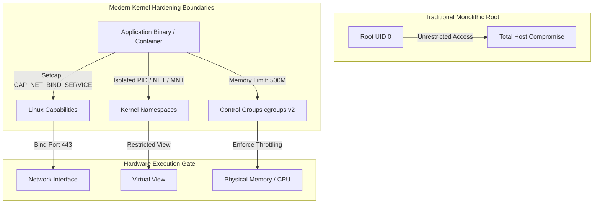

# MOD-LINUX-06: Enterprise Linux Security, Cgroups & Capability Hardening

Version: 1.0.0

---

# Lesson Metadata

* **Lesson ID:** MOD-LINUX-06
* **Module:** Linux Fundamentals for Platform Engineers
* **Difficulty:** Advanced to Expert
* **Estimated Duration:** 60 minutes
* **Learning Track:** 🔵 Professional / 🟣 Expert
* **Version:** 1.0.0
* **Last Updated:** 2026-06-28

---

# Lesson Overview

This capstone lesson explores the advanced kernel security boundaries that make modern containerization (Docker/Kubernetes) and secure platform engineering possible. You will learn how to restrict resource consumption using Linux Control Groups (`cgroups v2`), isolate execution environments using Kernel Namespaces, and break apart monolithic root privileges using Linux Capabilities (`setcap`, `getcap`).

---

# Learning Objectives

By the end of this lesson, you will be able to:

* Configure Linux Control Groups (`cgroups v2`) to throttle CPU and memory resource consumption for running process trees.
* Identify and inspect active Kernel Namespaces (`pid`, `net`, `mnt`) using `lsns` and `nsenter`.
* Dismantle monolithic root privileges by assigning fine-grained Linux Capabilities (`setcap`) to application binaries.

---

# Prerequisites

* Mastery of Linux Process Management (`MOD-LINUX-03`).
* Understanding of Discretionary Access Control (`MOD-LINUX-02`).

---

# Why This Exists

For decades, Linux security relied on a binary privilege model: you were either a standard user with limited rights, or you were `root` (UID 0) with god-like, unrestricted access to the entire machine. If a web server needed to bind to a privileged port (e.g., port `80` or `443`), it had to run as root. If the web server was compromised, the attacker gained total control of the host.

To solve this fatal architectural flaw, the Linux kernel introduced three revolutionary isolation mechanisms: **Linux Capabilities** (breaking root into granular permissions), **Namespaces** (isolating what a process can see), and **Control Groups / Cgroups** (isolating what a process can use). These three technologies form the exact foundation of modern container virtualization.

---

# Core Concepts

## Linux Capabilities
Capabilities decompose the god-like privileges of `root` into 40+ distinct, granular permissions. For example, `CAP_NET_BIND_SERVICE` allows a binary to bind to port 80 without granting any other root privileges. `CAP_SYS_ADMIN` is the most powerful capability (often equated to full root).

## Kernel Namespaces
Namespaces wrap a global system resource in an isolated abstraction, making it appear to a process that it has its own dedicated instance of the system.
* **PID Namespace:** Isolates the process ID table (a container sees itself as PID 1).
* **NET Namespace:** Isolates network interfaces, routing tables, and firewall rules.
* **MNT Namespace:** Isolates filesystem mount points.

## Control Groups (`cgroups v2`)
While namespaces govern what a process can *see*, cgroups govern what a process can *use*. Cgroups form a hierarchical tree structure (`/sys/fs/cgroup`) that meters and caps CPU time, physical memory, and disk I/O for groups of processes.

---

# Architecture



---

# Real-World Example

When you define `resources.limits.memory: 512Mi` in a Kubernetes Pod manifest, Kubernetes does not magically constrain the Java or Python application. Instead, the container runtime (`containerd` / `crio`) translates that manifest configuration into a direct kernel cgroup declaration inside `/sys/fs/cgroup/kubepods.slice/.../memory.max`. When the application breaches 512MB, the kernel cgroup mechanism instantly executes an OOM-Kill.

---

# Hands-on Demonstration

Let's demonstrate how to grant a non-root binary the ability to bind to a privileged system port using Linux Capabilities.

## Input
We attempt to launch a Python web server on port `80` as a standard user, observe access rejection, apply `CAP_NET_BIND_SERVICE` using `setcap`, and verify successful binding.

## Code
```bash
# Copy python binary to local directory to avoid modifying system-wide binaries
cp /usr/bin/python3 ./my_py_server

# Attempt to bind to privileged port 80 as a standard user
./my_py_server -m http.server 80 2>&1 | grep "Permission denied" || true

# Assign CAP_NET_BIND_SERVICE capability to the binary using sudo
sudo setcap 'cap_net_bind_service=+ep' ./my_py_server

# Verify capability assignment
getcap ./my_py_server
```

## Expected Output
```text
Permission denied
./my_py_server = cap_net_bind_service+ep
```

## Explanation
Standard users cannot bind to ports below `1024`. By applying `cap_net_bind_service=+ep` (`e` = effective, `p` = permitted), the kernel grants `./my_py_server` the precise authority to bind to port 80 without requiring `sudo` or elevating the process UID to 0.

---

# Hands-on Lab

* **Objective:** Interrogate active kernel namespaces using `lsns`, inspect running cgroup v2 hierarchies, and utilize `nsenter` to inject a debugging shell directly into an isolated process namespace.
* **Estimated Time:** 30 minutes
* **Difficulty:** Advanced
* **Environment:** Linux Terminal with sudo/root access

## Step-by-step Instructions

1. Verify your Linux instance is utilizing `cgroups v2` by checking the filesystem mount type:
   ```bash
   stat -fc %T /sys/fs/cgroup
   ```
   *(Expected output: `cgroup2fs`. If `tmpfs` is returned, you are on legacy cgroups v1).*
2. Create an isolated background process running in a new PID and Network namespace using `unshare`:
   ```bash
   sudo unshare --pid --net --fork --mount-proc bash -c 'sleep 3600' &
   UNSHARE_PID=$!
   ```
3. Use `lsns` to identify the specific isolated namespaces assigned to the `sleep` process:
   ```bash
   sudo lsns -p $UNSHARE_PID
   ```
4. Use `nsenter` to inject a fresh terminal shell directly into the isolated network namespace of the target process, and verify it cannot see the host network interfaces:
   ```bash
   sudo nsenter -t $UNSHARE_PID --net ip a
   ```

## Verification
Verify that `nsenter --net ip a` outputs only the isolated loopback interface (`lo`), proving the process is completely isolated from the host's physical network cards:
```text
1: lo: <LOOPBACK> mtu 65536 qdisc noop state DOWN group default qlen 1000
    link/loopback 00:00:00:00:00:00 brd 00:00:00:00:00:00
```

## Troubleshooting
* **Symptom:** `unshare: Operation not permitted`
  * **Cause:** Your terminal session lacks `CAP_SYS_ADMIN` privileges or is running inside an unprivileged container.
  * **Solution:** Ensure you execute `unshare` with `sudo`.

## Cleanup
```bash
sudo kill -9 $UNSHARE_PID 2>/dev/null || true
rm -f ./my_py_server
```

---

# Production Notes

When architecting secure Kubernetes clusters, senior platform engineers strictly forbid running containers with `securityContext.privileged: true`. A privileged container bypasses cgroups, inherits `CAP_SYS_ADMIN`, and shares the host's root namespaces. If an attacker compromises a privileged container, they can execute `nsenter -t 1 -m -u -n -i sh` to gain instant root shell access to the underlying Kubernetes worker node.

---

# Common Mistakes

* **Equating `root` inside a container to `root` on the host:** Beginners assume a container running as root (UID 0) has full host access. In a properly hardened container runtime, the kernel strips powerful capabilities (`CAP_SYS_ADMIN`, `CAP_NET_ADMIN`, `CAP_SYS_MODULE`) from the container's bounding set, rendering container-root significantly less powerful than host-root.
* **Using `setcap` on interpreted scripts:** You cannot execute `setcap` directly on a Python or Bash script (`setcap ... myscript.py`). Capabilities can only be assigned to compiled binary executables (e.g., `/usr/bin/python3`).

---

# Failure-Driven Learning

Let's simulate an application crashing due to missing capabilities and observe the audit debugging path.

## The Failure
We attempt to execute a network packet capture using `tcpdump` as a standard user without `sudo` or capabilities.

```bash
# Attempt packet capture as non-root
tcpdump -c 1 -i any 2>&1 | grep "Permission denied" || true
# tcpdump: any: You don't have permission to capture on that device
```

## Diagnosis & Recovery
To diagnose which exact capability was blocked by the kernel during an execution failure, platform engineers interrogate the kernel audit log (`auditd` / `journalctl`):
```bash
sudo journalctl -k | grep -i "audit" | grep "capability" || true
```
Recover by assigning `CAP_NET_RAW` and `CAP_NET_ADMIN` to the target binary using `setcap`.

---

# Engineering Decisions

When hardening enterprise container images, you must decide between running containers as a completely non-root user (`USER 10001`) or running as root but dropping all Linux capabilities (`securityContext.capabilities.drop: ["ALL"]`).
* **Non-Root User:** Industry gold standard; ensures zero chance of privilege escalation; requires pre-configuring filesystem permissions during image build.
* **Root with Dropped Capabilities:** Useful for legacy applications that hardcode root checks but do not actually require underlying kernel capabilities.

---

# Best Practices

* Drop `CAP_NET_RAW` from all Kubernetes Pod manifests by default to prevent attackers from executing ARP spoofing or ping floods inside the cluster network.
* Utilize `cgroups v2` memory throttling (`memory.high`) rather than strict kill limits (`memory.max`) to allow applications time to gracefully shed load before an OOM Kill.
* Audit system binaries with elevated capabilities regularly using `getcap -r / 2>/dev/null`.

---

# Troubleshooting Guide

## Issue 1: High Latency due to Cgroup CPU Throttling (`CFS Quota`)

* **Problem:** A production Go or Node.js microservice running in Kubernetes is experiencing severe latency spikes, yet `top` inside the container shows CPU usage is only at 40%.
* **Cause:** The Kubernetes Pod was assigned a strict CPU limit (e.g., `limits.cpu: 500m`). The kernel's Completely Fair Scheduler (CFS) enforces this via cgroups by giving the process a 50ms execution quota per 100ms period. If the multi-threaded application burns through its 50ms quota in the first 20ms, the kernel forcefully throttles (freezes) the process for the remaining 80ms.
* **Diagnosis:** 
  ```bash
  # Interrogate cgroup v2 CPU stat virtual files for throttle metrics
  cat /sys/fs/cgroup/kubepods.slice/.../cpu.stat | grep "throttled"
  ```
  *(If `nr_throttled` and `throttled_time` are scaling rapidly, the kernel is freezing your application).*
* **Solution:** Remove CPU limits from the Pod manifest (retaining only CPU requests) or increase the quota allocation, allowing the application to utilize burst CPU cycles on the worker node.

---

# Summary

Modern enterprise infrastructure security relies entirely on the Linux kernel's advanced isolation boundaries. By harnessing Linux Capabilities to dismantle monolithic root privileges, leveraging Namespaces for execution isolation, and configuring Control Groups (`cgroups v2`) for resource throttling, platform engineers build impenetrable, highly resilient cloud architectures.

---

# Cheat Sheet

| Command | Description | Best Practice / Diagnostic Focus |
| :--- | :--- | :--- |
| `getcap <binary>` | List capabilities assigned to a binary | Audit `/usr/bin` for unexpected privilege escalations. |
| `setcap '<cap>=+ep' <bin>`| Assign capability to a binary | Replaces the need for `sudo` or `setuid` root bits. |
| `lsns -p <PID>` | List namespaces of a running process | Essential for verifying container isolation boundaries. |
| `nsenter -t <PID> --net` | Inject shell into process namespace | Ultimate debugging tool for isolated container networks. |
| `stat -fc %T /sys/fs/cgroup`| Verify cgroups v2 active mount | Ensures compatibility with modern eBPF/resource limits. |

---

# Knowledge Check

## Multiple Choice Questions

1. Which kernel mechanism governs what system resources (CPU/RAM) a process can *use*?
   * A) Namespaces
   * B) Linux Capabilities
   * C) Control Groups (`cgroups`)
   * D) Access Control Lists (ACLs)

2. What capability allows a non-root binary to bind to port 443?
   * A) `CAP_SYS_ADMIN`
   * B) `CAP_NET_ADMIN`
   * C) `CAP_NET_BIND_SERVICE`
   * D) `CAP_SYS_PTRACE`

## Scenario Questions

**Scenario:** A security audit reveals that a legacy monitoring agent running in your Kubernetes cluster requires `securityContext.privileged: true` simply to inspect host network packets. How would you refactor the deployment to adhere to least-privilege principles?

## Short Answer Questions

* Explain the architectural difference between Kernel Namespaces and Control Groups (`cgroups`).

---

# Interview Preparation

## Beginner Questions
* What is a Linux Capability?

## Intermediate Questions
* Explain the difference between the PID namespace inside a container versus the host PID namespace.

## Advanced Questions
* Describe the mechanics of the kernel Completely Fair Scheduler (CFS) quota mechanism and how it causes artificial latency throttling in containerized multi-threaded applications.

## Scenario-Based Discussions
* **Scenario:** You are tasked with architecting a multi-tenant container runtime environment on bare-metal Linux servers where competing engineering teams execute untrusted code. How do you ensure total isolation?
* **Key Talking Points:** Discuss enforcing `cgroups v2` for strict memory/CPU isolation, mapping unprivileged user namespaces (`user_namespaces`) so container-root maps to an unprivileged host UID, dropping all capabilities, and utilizing secure computing mode (`seccomp`) filters to block dangerous system calls.

---

# Further Reading

1. [Man7: capabilities(7)](https://man7.org/linux/man-pages/man7/capabilities.7.html)
2. [Man7: namespaces(7)](https://man7.org/linux/man-pages/man7/namespaces.7.html)
3. [Man7: cgroups(7)](https://man7.org/linux/man-pages/man7/cgroups.7.html)
4. [Kernel.org: cgroups v2 Documentation](https://www.kernel.org/doc/html/latest/admin-guide/cgroup-v2.html)
5. *Container Security* by Liz Rice
