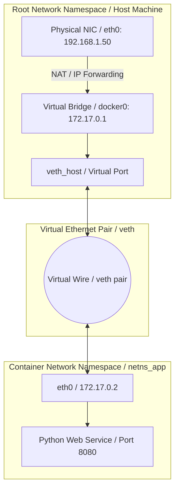

# MOD-LINUX-06: Linux Networking, Socket States & Kernel Firewalling

Version: 1.0.0

---

# Lesson Metadata

* **Lesson ID:** MOD-LINUX-06
* **Module:** Linux Fundamentals for Platform Engineers
* **Difficulty:** Advanced
* **Estimated Duration:** 55 minutes
* **Learning Track:** 🟢 Core / 🔵 Professional / 🟣 Expert
* **Version:** 1.0.0
* **Last Updated:** 2026-06-28

---

# Lesson Overview

This lesson bridges the gap between local operating system fundamentals and advanced cloud networking. We explore Linux network namespaces, socket state analysis, routing tables, and kernel firewalling via Netfilter. As a platform engineer, mastering Linux networking internals is mandatory for understanding Docker bridge networking, Kubernetes CNI plugins, and service mesh sidecars.

---

# Learning Objectives

By the end of this lesson, you will be able to:

* Inspect active network sockets and TCP connection states using `ss`.
* Modify IP addresses, virtual links, and routing tables using the `ip` route suite.
* Explain the underlying mechanics of Linux Network Namespaces (`netns`) and Virtual Ethernet pairs (`veth`).

---

# Prerequisites

* Completion of `MOD-LINUX-01` through `MOD-LINUX-05`.
* Access to a Linux terminal with `iproute2` installed.

---

# Why This Exists

Early server networking operated on a globally shared network stack. A physical machine possessed a single routing table, a single set of firewall rules, and a single pool of port numbers (1 to 65535). If two independent applications attempted to bind to port `8080`, a fatal collision occurred.

To enable multi-tenant virtualization and containerization, the Linux kernel introduced **Network Namespaces (`netns`)**. A network namespace overhead provides an isolated replica of the entire network stack—complete with its own private routing tables, firewall rules, loopback devices, and interface bindings. This isolation enables thousands of independent containers to run on a single host without port collisions.

---

# Core Concepts

## Network Namespaces (`netns`)
A kernel feature that isolates network communication. Every container created by Docker or Kubernetes executes inside its own dedicated network namespace, appearing to possess its own private network stack.

## Virtual Ethernet Pairs (`veth`)
Because a network namespace is completely isolated, it cannot communicate with the outside world by default. A **`veth` pair** acts as a virtual wire connecting two network namespaces (e.g., connecting a container's private namespace back to the host's root network bridge).

## Netfilter & `iptables` / `nftables`
Netfilter is the kernel packet filtering framework. It intercepts incoming and outgoing network packets at explicit hook points (`PREROUTING`, `FORWARD`, `POSTROUTING`), allowing tools like `iptables` to perform Network Address Translation (NAT), port forwarding, and packet dropping.

---

# Architecture



---

# Real-World Example

Consider a Kubernetes worker node hosting dozens of microservice Pods. When an external user sends an HTTPS request to your application's Kubernetes Service IP, the physical node intercepts the request.

How does the physical node know which specific container to route the traffic toward? The Kubernetes `kube-proxy` daemon configures Linux Netfilter rules (`iptables` or IPVS) in the root network namespace. These rules perform a Destination NAT (`DNAT`), rewriting the external target IP to the container's private Virtual Ethernet (`veth`) IP address, seamlessly bridging physical hardware with containerized User Space.

---

# Hands-on Demonstration

Let's observe how to query active sockets and inspect local routing tables using `ss` and `ip`.

## Input
We utilize `ss` to list active listening TCP sockets, and `ip route` to display the kernel's routing decisions.

## Code
```bash
# List all listening TCP sockets with numerical addresses and process names
sudo ss -tulpn

# Display the main kernel routing table
ip route show
```

## Expected Output
```text
Netid  State   Recv-Q  Send-Q     Local Address:Port      Peer Address:Port  Process
tcp    LISTEN  0       128              0.0.0.0:22             0.0.0.0:*      users:(("sshd",pid=912,fd=3))
default via 192.168.1.1 dev eth0 proto dhcp metric 100
192.168.1.0/24 dev eth0 proto kernel scope link src 192.168.1.50 metric 100
```

## Explanation
`ss -tulpn` inspects kernel socket tables directly, revealing that `sshd` (`PID 912`) is actively listening on `0.0.0.0:22`. `ip route show` confirms that any outbound traffic not matching the local subnet (`192.168.1.0/24`) is routed out through `eth0` toward the default gateway `192.168.1.1`.

---

# Hands-on Lab

* **Objective:** Create an isolated Linux network namespace, establish a Virtual Ethernet (`veth`) pair, and verify ping connectivity across namespace boundaries.
* **Estimated Time:** 25 minutes
* **Difficulty:** Advanced
* **Environment:** Any Linux terminal with `root` / `sudo` privileges.

## Step-by-step Instructions

1. Create a new isolated network namespace named `netns_lab`:
   ```bash
   sudo ip netns add netns_lab
   ```
2. Create a virtual ethernet (`veth`) pair connecting `veth_host` to `veth_lab`:
   ```bash
   sudo ip link add veth_host type veth peer name veth_lab
   ```
3. Move `veth_lab` into the isolated network namespace:
   ```bash
   sudo ip link set veth_lab netns netns_lab
   ```
4. Assign IP addresses and bring the virtual interfaces online:
   ```bash
   sudo ip addr add 10.100.0.1/24 dev veth_host
   sudo ip link set veth_host up
   sudo ip netns exec netns_lab ip addr add 10.100.0.2/24 dev veth_lab
   sudo ip netns exec netns_lab ip link set veth_lab up
   ```
5. Verify connectivity by pinging across the virtual wire:
   ```bash
   sudo ip netns exec netns_lab ping -c 3 10.100.0.1
   ```

## Verification
Inspect the successful ping responses confirming packets successfully traversed from `netns_lab` (`10.100.0.2`) across the `veth` pair to the root host namespace (`10.100.0.1`).

## Troubleshooting
* **Symptom:** `Cannot create namespace file /var/run/netns/netns_lab: Permission denied`
  * **Cause:** You attempted to execute `ip netns` without `sudo`. Modifying kernel namespaces requires `root` elevation.
  * **Solution:** Prefix all commands with `sudo`.

## Cleanup
```bash
sudo ip netns delete netns_lab
sudo ip link delete veth_host 2>/dev/null || true
```

---

# Production Notes

In enterprise Kubernetes environments, manually creating `veth` pairs and configuring `iptables` rules is completely automated by Container Network Interface (CNI) plugins like Calico, Cilium, or Flannel. Advanced CNI plugins like Cilium bypass legacy Netfilter/`iptables` entirely, leveraging eBPF (Extended Berkeley Packet Filter) to attach high-performance routing programs directly to kernel socket layers.

---

# Common Mistakes

* **Using Legacy `netstat` and `ifconfig`:** Beginners continue using `netstat` and `ifconfig`. These tools belong to the obsolete `net-tools` suite; they parse `/proc` synchronously and perform poorly on systems with thousands of container sockets. Always use `ss` and `ip`, which communicate directly with the kernel via Netlink sockets.
* **Overlooking IP Forwarding:** When setting up a Linux router or container bridge, beginners wonder why packets fail to route between interfaces. Linux disables packet forwarding by default; you must explicitly enable it via `sysctl -w net.ipv4.ip_forward=1`.

---

# Failure-Driven Learning

Let's observe how the kernel handles packets attempting to traverse an unforwarded network interface.

## The Failure
We simulate an inspection of kernel routing failure when IP forwarding is disabled.

```bash
# Inspecting current IP forwarding state
sysctl net.ipv4.ip_forward

# If set to 0, incoming packets targeting an external subnet are dropped by the kernel.
```

## Expected Output
```text
net.ipv4.ip_forward = 0
```

## Diagnosis & Recovery
When `ip_forward` is `0`, the Netfilter framework drops packets at the `FORWARD` chain hook point. To diagnose this in production, inspect dropped packet counters using `netstat -s | grep -i drop` or `iptables -nvL FORWARD`. Recover by executing `sudo sysctl -w net.ipv4.ip_forward=1` and persisting it in `/etc/sysctl.conf`.

---

# Engineering Decisions

When architecting service meshes or container networking, you must decide between `iptables`-based routing and eBPF-based routing.
* **`iptables` / Netfilter:** Highly compatible and universally supported, but evaluates packet rules sequentially. In Kubernetes clusters with 10,000 services, sequential rule evaluation introduces significant network latency.
* **eBPF (Cilium):** High performance, executes bytecode directly in the kernel socket layer, providing O(1) lookup speeds regardless of cluster size, but requires modern Linux kernel versions (5.4+).

---

# Best Practices

* **Always Filter `ss` Output:** On production AI inference servers or API gateways, running `ss -a` will flood your terminal with tens of thousands of `TIME-WAIT` sockets. Use `ss -tulpn` to isolate listening servers.
* **Persist Route Changes:** Remember that manual `ip route add` commands are stored strictly in volatile memory. Always persist custom routing rules in your Linux distribution's declarative networking config (`netplan` or `NetworkManager`).

---

# Troubleshooting Guide

## Issue 1: High Connection Refused Errors but Service is Running

* **Cause:** The service is actively running but bound strictly to `127.0.0.1` (localhost) rather than `0.0.0.0` (all interfaces).
* **Diagnosis:** Execute `ss -tulpn | grep <port>`. If the `Local Address:Port` displays `127.0.0.1:8080`, the kernel will reject all external packets arriving on physical NICs (`eth0`).
* **Solution:** Modify your application's configuration file to bind to `0.0.0.0:8080` and restart the service via `systemctl restart my_app.service`.

---

# Summary

Understanding Linux network namespaces, virtual ethernet pairs, and socket states gives platform engineers the foundational clarity required to demystify complex container networking architectures. By treating networking as an inspectable kernel subsystem, you can confidently debug packet flow from the physical NIC to the containerized microservice.

---

# Cheat Sheet

| Command | Purpose | Example |
| :--- | :--- | :--- |
| `ss -tulpn` | Display listening TCP sockets | `ss -tulpn` |
| `ip addr show` | Display interface IP addresses | `ip addr show eth0` |
| `ip route show` | Inspect main routing table | `ip route show` |
| `ip netns list` | List active network namespaces | `ip netns list` |
| `sysctl net.ipv4.ip_forward`| Check IP forwarding status | `sysctl net.ipv4.ip_forward` |

---

# Knowledge Check

To test your mastery of Linux networking and namespaces, review the dedicated questions in `quizzes/quiz-linux-01.md`.

---

# Interview Preparation

## Beginner Questions
* Why should you use `ss` and `ip` instead of legacy `netstat` and `ifconfig`?

## Intermediate Questions
* Explain what a Virtual Ethernet (`veth`) pair is and how Docker utilizes it to provide container connectivity.

## Advanced Questions
* How does eBPF improve upon traditional `iptables`/Netfilter architectures when routing traffic in massive Kubernetes clusters?

## Scenario-Based Discussions
* **Scenario:** A developer spins up a Docker container on a Linux host, but external clients receive `Connection refused`. The developer insists the container is healthy. How do you debug?
* **Key Talking Points:** Discuss checking `ss -tulpn` on the host to verify if the port is bound to `0.0.0.0`. Explain checking `sysctl net.ipv4.ip_forward` to ensure host packet forwarding is enabled, and verifying `iptables -t nat -nvL` to confirm Docker's `DNAT` port forwarding rules are correctly configured.

---

# Further Reading

1. [man ip-netns(8)](https://man7.org/linux/man-pages/man8/ip-netns.8.html)
2. [man ss(8)](https://man7.org/linux/man-pages/man8/ss.8.html)
3. [Cilium & eBPF Networking](https://cilium.io/)
4. [Linux Kernel Networking: Advanced Topics by Rami Rosen](https://link.springer.com/book/10.1007/978-1-4302-6170-9)
