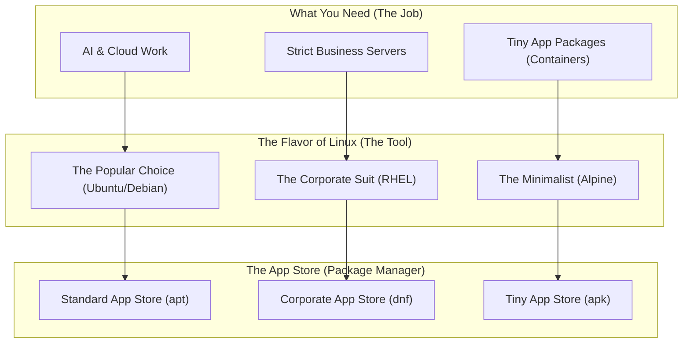

# Linux Distributions & Environments (Ubuntu, Debian, RHEL, Alpine)

Version: 2.0.0

Purpose: Canonical lesson structure for Platform Engineering & AI Infrastructure Curriculum.

Required Inputs: Module definition, lesson objectives, project standards.

Outputs: Standards-compliant lesson markdown.

---

# Lesson Metadata

* **Lesson ID:** `MOD-LINUX-BEG-03`
* **Module:** Getting Started with Linux (`MOD-LINUX-BEG`)
* **Difficulty:** Beginner
* **Estimated Duration:** 35 minutes
* **Learning Track:** 🟢 Core
* **Version:** 2.0.0
* **Last Updated:** 2026-06-28

---

# Lesson Overview

This lesson navigates the rich ecosystem of Linux distributions (often called "distros"), exploring how the universal Linux kernel is packaged with different tools to serve diverse enterprise needs. By understanding the specific design goals behind Ubuntu, Debian, Red Hat Enterprise Linux (RHEL), and Alpine Linux, you will acquire the vital architectural context supporting our module capability: **"I can install Linux, navigate the terminal, and manage files."**

---

# Learning Objectives

* Define what a Linux distribution (distro) is and explain why so many different variations exist.
* Differentiate between the major Linux distribution families (Debian/Ubuntu, RHEL/Fedora, Alpine).
* Identify which Linux distributions are optimized for local development, enterprise servers, or minimal containers.
* Select the correct Linux distribution for a given Platform Engineering or AI infrastructure workload.

---

# Prerequisites

* Basic desktop computer literacy.
* Completion of `MOD-LINUX-BEG-01` (What is Linux?) and `MOD-LINUX-BEG-02` (Why Linux?).

---

# Why This Exists

As we learned in Lesson 01, the Linux kernel by itself is just the engine of the operating system; it manages the physical hardware but does not include a terminal window, text editor, package installer, or system utilities. 

If you wanted to build a working Linux operating system from scratch, you would have to manually compile the kernel, locate and download hundreds of essential user utilities, configure a bootloader, and assemble everything into a functional system. In the early 1990s, this required weeks of agonizing, error-prone labor.

To solve this massive usability headache, organizations and open-source communities created **Linux Distributions ("Distros")**. A distribution acts like a master car manufacturer: they take the universal Linux kernel (the engine), wrap it in a beautiful chassis with seats, steering wheels, and radios (user tools, package managers, and system libraries), and deliver a fully functional, ready-to-run operating system tailored for specific use cases.

---

# Core Concepts

## What is a Linux Distribution?
A Linux distribution is a complete operating system package assembled from the Linux kernel, system software, and package management tools. Because Linux is open-source, anyone can assemble their own distribution tailored to their exact preferences.

## The Major Distro Families
While hundreds of Linux distributions exist, the vast majority belong to three dominant enterprise families:

```
                  ┌──► Ubuntu (Cloud & AI Dev Standard)
   ┌──► Debian ───┤
   │              └──► Linux Mint / Others
   │
Linux Kernel ──┼──► RHEL ─────┬──► Fedora (Cutting-Edge Upstream)
   │              └──► Rocky Linux / AlmaLinux (Enterprise Server)
   │
   └──► Alpine Linux (Ultra-Minimalist Container Standard)
```

### 1. Debian & Ubuntu Family
* **Debian:** Known for incredible rock-solid stability and strict adherence to free software principles. It uses the `apt` (Advanced Package Tool) package manager.
* **Ubuntu:** Built directly on top of Debian, Ubuntu is the most popular Linux distribution on earth. It prioritizes user-friendliness, extensive hardware support, and is the absolute gold standard for AI/ML engineering and cloud development.

### 2. Red Hat Enterprise Linux (RHEL) Family
* **RHEL:** The dominant commercial standard for massive enterprise corporations, banks, and government agencies. It offers long-term commercial support contracts and uses the `dnf` / `yum` package manager.
* **Fedora / Rocky Linux:** Fedora serves as the cutting-edge experimental testing ground for future RHEL features, while Rocky Linux provides a free, production-grade enterprise clone of RHEL.

### 3. Alpine Linux
* **Alpine Linux:** An ultra-minimalist, security-oriented distribution designed specifically for cloud containers (Docker). While a standard Ubuntu installation takes up over 1 Gigabyte of disk space, a base Alpine Linux installation takes up only **5 Megabytes**!

---

# Architecture



---

# Real-World Example

Imagine you are architecting the infrastructure for a major ride-sharing application like Uber. You have two vastly different technical requirements:
1. **The AI Development Servers:** Your data scientists need powerful "AI & Cloud Work" tools. For this, you deploy "The Popular Choice", as it provides flawless out-of-the-box support for AI. You can easily download libraries using its "Standard App Store".
2. **The Microservice Containers:** Your location-tracking service needs to be a "Tiny App Package". For this, you build using "The Minimalist", reducing the image size from 500MB down to 15MB using the "Tiny App Store", allowing containers to launch instantly!

---

# Hands-on Demonstration

Let's see how an engineer inspects the operating system release identification files on a running Linux server to verify exactly which distribution and version they are logged into.

## Input
We use the `cat` (concatenate) command to display the contents of the `/etc/os-release` file, which is the universal standard file where Linux distributions store their identification details.

## Code
```bash
# The 'cat' command reads the contents of a file and prints it to the terminal screen.
# '/etc/os-release' is the configuration file containing distro identification metadata.
cat /etc/os-release
```

## Expected Output
```text
PRETTY_NAME="Ubuntu 24.04 LTS"
NAME="Ubuntu"
VERSION_ID="24.04"
VERSION="24.04 LTS (Noble Numbat)"
VERSION_CODENAME=noble
ID=ubuntu
ID_LIKE=debian
HOME_URL="https://www.ubuntu.com/"
SUPPORT_URL="https://help.ubuntu.com/"
BUG_REPORT_URL="https://bugs.launchpad.net/ubuntu/"
```

## Explanation
Look at the beautiful details in our output! `PRETTY_NAME="Ubuntu 24.04 LTS"` tells us instantly that we are running Ubuntu version 24.04. The letters `LTS` stand for **Long Term Support**, meaning this enterprise release receives official security patches for at least five years. Notice the line `ID_LIKE=debian`—this confirms that Ubuntu inherits its architectural roots directly from the Debian distro family!

---

# Hands-on Lab

* **Objective:** Inspect the distribution identification files of a running Linux instance.
* **Estimated Time:** 10 minutes
* **Difficulty:** Beginner
* **Environment:** Interactive Browser Terminal / Local Sandbox

## Step-by-step Instructions

1. Open your terminal sandbox.
2. Type `cat /etc/os-release` and press Enter to inspect the distribution details of your environment.
3. Type `cat /etc/issue` to view the system greeting banner displayed before login.

## Verification

```bash
cat /etc/os-release
cat /etc/issue
```
*If the output displays a distribution name like `Ubuntu`, `Debian`, `Alpine`, or `RHEL`, you have successfully identified your Linux distro!*

## Troubleshooting

* **Issue:** The terminal says `cat: /etc/os-release: No such file or directory`.
* **Solution:** You may be running on an incredibly ancient legacy Linux system or macOS. If on macOS, use `sw_vers` instead.

## Cleanup

No cleanup is required for this inspection lab.

---

# Production Notes

When standardizing an enterprise Platform Engineering environment, engineering leadership establishes a strict "Golden Base Image." Rather than allowing developers to use a random mix of Ubuntu, Fedora, and Arch Linux across different projects, the platform team mandates a single, hardened enterprise distribution (e.g., Ubuntu LTS or Rocky Linux). This standardization drastically reduces cognitive load, simplifies security patching, and ensures unified package manager syntax (`apt` vs `dnf`) across all automated CI/CD pipelines.

---

# Common Mistakes

* **Fighting Over "The Best" Distro:** Beginners often waste endless hours debating which Linux distro is "the absolute best." In reality, every major distro uses the exact same Linux kernel; the only difference is the package manager and default pre-installed tools. Choose the distro that fits your specific workload.
* **Trying to use `apt` on RHEL or `dnf` on Ubuntu:** Beginners frequently copy and paste tutorial commands from the internet without checking the distro family. Attempting to run `apt install` on a Red Hat server will instantly fail because Red Hat uses `dnf`.

---

# Failure-Driven Learning

Imagine a junior engineer attempts to install a software package on a Red Hat / Rocky Linux enterprise server using Debian package manager syntax.

## Simulated Failure
```bash
# Attempting to install the 'git' tool using Debian syntax on a Red Hat server
apt install git
```

## Output
```text
bash: apt: command not found
```

## Diagnosis & Recovery
Why did this fail? `apt` is the package manager used exclusively by the Debian/Ubuntu distribution family! Because the engineer is logged into a Red Hat (RHEL) server, the operating system uses `dnf` (Dandified Yum). To recover, the engineer must inspect `/etc/os-release` to verify the distro family, and then execute the correct package manager command: `dnf install git`.

---

# Engineering Decisions

## Feature Velocity vs. Long-Term Stability
When selecting a Linux distribution for a production server, platform architects must choose between rolling releases and Long Term Support (LTS) releases.
* **Rolling Releases (e.g., Arch Linux, Fedora):** Continuously update to the latest experimental software packages every day. Excellent for accessing cutting-edge developer features, but carries a high risk of unexpected package updates breaking production services.
* **LTS Releases (e.g., Ubuntu LTS, RHEL):** Freeze the core software package versions for 3 to 10 years, releasing only rigorous security patches. 
* **The Platform Decision:** For production cloud servers and enterprise platforms, LTS releases are the unanimous, mandatory standard.

---

# Best Practices

* **Match Dev and Prod Distros:** Always ensure your local development environment or container uses the exact same Linux distribution family as your production cloud servers to prevent unexpected compatibility bugs.
* **Leverage Alpine for Containers:** Whenever building microservice container images, default to Alpine Linux to keep image sizes ultra-minimalist and reduce attack surfaces.

---

# Troubleshooting Guide

## Issue 1: Package Manager Command Failures

* **Cause:** You copy an installation command from an online tutorial, but the terminal returns `command not found`.
* **Diagnosis:** Run `cat /etc/os-release` to verify the `ID` and `ID_LIKE` parameters of your operating system.
* **Solution:** If `ID_LIKE=debian`, use `apt`. If `ID_LIKE=rhel`, use `dnf` or `yum`. If `ID=alpine`, use `apk`.

---

# Summary

* A Linux distribution ("distro") packages the universal Linux kernel with package managers, system libraries, and user tools into a functional operating system.
* **Ubuntu / Debian:** The dominant standard for cloud virtual machines, AI/ML development, and user-friendly administration (`apt`).
* **RHEL / Rocky Linux:** The commercial standard for massive enterprise corporations and highly regulated environments (`dnf`).
* **Alpine Linux:** The ultra-minimalist, lightweight standard designed specifically for cloud containers (`apk`).
* Platform Engineers standardize on specific distributions to ensure predictable automation and unified operations.

---

# Cheat Sheet

```bash
# Print detailed distribution identification metadata
cat /etc/os-release

# Print the pre-login system greeting banner
cat /etc/issue

# Verify the active package manager in Debian/Ubuntu
apt --version

# Verify the active package manager in RHEL/Rocky Linux
dnf --version

# Verify the active package manager in Alpine Linux
apk --version
```

---

# Knowledge Check

## Multiple Choice Questions

1. Which Linux distribution is famous for being ultra-minimalist (around 5 Megabytes in base size) and is the industry standard for lightweight cloud containers?
   * A) Red Hat Enterprise Linux (RHEL)
   * B) Windows 11
   * C) Alpine Linux
   * D) Ubuntu 24.04 LTS

## Scenario Questions

You are architecting a new microservice deployment for an e-commerce platform. Your lead developer wants to package the application inside a full 1.2 Gigabyte Ubuntu container image, but your cloud bill is suffering from high storage and bandwidth costs. Based on what you learned in this lesson, what alternative Linux distribution do you suggest for the container image and why?

## Short Answer Questions

Explain the difference between the Debian/Ubuntu distribution family and the Red Hat (RHEL) distribution family regarding how they install software packages.

<details>
<summary><b>View Answers</b></summary>

### Multiple Choice
1. **C** - Alpine Linux uses an incredibly small base footprint, making it the most efficient choice for cloud containers and microservices where minimal disk space is critical.

### Scenario
I suggest Alpine Linux. Its ultra-minimalist design reduces container sizes from gigabytes to megabytes, which will drastically decrease storage and bandwidth costs while speeding up deployments.

### Short Answer
The Debian/Ubuntu family uses `apt` (Advanced Package Tool), while the RHEL family uses `dnf` or `yum` as its package manager. They employ different syntax and package formats to achieve the same result.

</details>

---

# Interview Preparation

## Beginner Questions

* What is a Linux distribution?
* How would you check which Linux distribution is currently running on a server?
* Name the primary package manager used by Ubuntu and Debian.

## Intermediate Questions

* Why do Platform Engineers prefer Long Term Support (LTS) releases over rolling releases for production cloud servers?
* Explain why Alpine Linux is vastly smaller in disk size compared to a standard Ubuntu server installation.

## Advanced Questions

* How does the choice of C-library (`glibc` in Ubuntu/RHEL vs. `musl libc` in Alpine) impact the compilation and execution of advanced high-performance applications in production?

## Scenario-Based Discussions

* Discuss the architectural trade-offs of standardizing an entire engineering organization on a single Linux distribution versus allowing autonomous microservice teams to choose their own distros.

---

# Further Reading

1. [Ubuntu Official Documentation](https://ubuntu.com/)
2. [Debian Operating System](https://www.debian.org/)
3. [Red Hat Enterprise Linux (RHEL)](https://www.redhat.com/en/technologies/linux-platforms/enterprise-linux)
4. [Alpine Linux Official Website](https://alpinelinux.org/)
5. [DistroWatch (Tracking Linux Distributions)](https://distrowatch.com/)
