# Installing & Accessing Linux (WSL2, Virtual Machines & Cloud Shells)

Version: 2.0.0

Purpose: Canonical lesson structure for Platform Engineering & AI Infrastructure Curriculum.

Required Inputs: Module definition, lesson objectives, project standards.

Outputs: Standards-compliant lesson markdown.

---

# Lesson Metadata

* **Lesson ID:** `MOD-LINUX-BEG-04`
* **Module:** Getting Started with Linux (`MOD-LINUX-BEG`)
* **Difficulty:** Beginner
* **Estimated Duration:** 45 minutes
* **Learning Track:** 🟢 Core
* **Version:** 2.0.0
* **Last Updated:** 2026-06-28

---

# Lesson Overview

This lesson guides you through the practical setup and access mechanisms required to establish your own professional Linux engineering environment. By exploring Windows Subsystem for Linux (WSL2), desktop Virtual Machines, and instant Cloud Shells, you will directly achieve the first essential pillar of our module capability: **"I can install Linux, navigate the terminal, and manage files."**

---

# Learning Objectives

* Explain the architectural differences between dual-booting, Virtual Machines (VMs), and Windows Subsystem for Linux (WSL2).
* Set up a fully functional Linux terminal environment on a personal computer or through a web browser.
* Access a remote Linux server using Secure Shell (SSH) principles.
* Describe how Platform Engineers interact with remote Linux infrastructure in daily enterprise operations.

---

# Prerequisites

* Basic desktop computer literacy.
* Completion of `MOD-LINUX-BEG-01` through `MOD-LINUX-BEG-03`.

---

# Why This Exists

In the early days of Linux, if you wanted to learn the operating system or develop software, you had to perform a dangerous, nerve-wracking procedure called "dual-booting." You had to manually partition your computer's hard drive, wipe out existing sections of Windows, and install Linux directly onto the bare metal hardware. If you made a single mistake during the installation, you permanently erased all your personal files and bricked your computer! Furthermore, you could only run one operating system at a time; to check your Windows email, you had to fully shut down Linux and reboot the machine.

This immense friction prevented millions of curious beginners from ever exploring Linux. 

To eliminate this massive barrier, modern virtualization technology was invented. Today, through breakthroughs like **Windows Subsystem for Linux (WSL2)** and **Cloud Virtual Machines**, you can launch a fully functional, real Linux kernel directly inside a standard Windows window or a web browser tab in a matter of seconds—with absolutely zero risk to your personal computer!

---

# Core Concepts

## 1. Windows Subsystem for Linux (WSL2)
If you are using a Windows computer, WSL2 is the ultimate, industry-standard mechanism for running Linux. 
* **Real Linux Kernel:** Unlike older emulators, WSL2 utilizes a true, lightweight Hyper-V virtual machine running a genuine Microsoft-built Linux kernel.
* **Flawless Integration:** You can open an Ubuntu terminal window side-by-side with your Windows applications, share files instantly between Windows and Linux, and run Linux container workloads (Docker) natively.

## 2. Desktop Virtual Machines (Hypervisors)
If you prefer complete, isolated sandbox environments, you can use a desktop hypervisor like VirtualBox or VMware.
* **Full Isolation:** A hypervisor acts as a virtual computer within your computer. It creates a simulated hard drive, CPU, and memory space where you can install any Linux distribution (like Rocky Linux or Debian) completely isolated from your host operating system.

## 3. Cloud Shells & Remote Virtual Machines
In the professional Platform Engineering world, you rarely run heavy enterprise infrastructure directly on your local laptop. Instead, you launch Virtual Machines in the cloud (AWS EC2, Google Cloud Compute Engine) or access instant browser-based environments (AWS CloudShell, Google Cloud Shell, GitHub Codespaces).
* **Instant Onboarding:** Cloud shells provide immediate, pre-configured Linux terminals running directly in your web browser with zero local installation required.

---

# Architecture

```mermaid
flowchart TD
    subgraph LocalSetup ["Your Personal Computer Setup"]
        WIN["Your Windows Laptop"] --> WSL["The Translator (WSL2)"]
        WSL --> LIN_WSL["The Core Engine (Ubuntu Linux)"]
    end

    subgraph CloudSetup ["The Internet Setup (Cloud)"]
        BROWSER["Web Browser"] --> SSH["Secret Tunnel (SSH)"]
        SSH --> CLOUD_VM["Rented Cloud Computer"]
    end

    subgraph DesktopVM ["The Matryoshka Setup (Virtual Machine)"]
        HOST["Your Computer (Windows/Mac)"] --> HYP["The Simulator (VirtualBox)"]
        HYP --> GUEST["The Pretend Computer (Linux VM)"]
    end
```



---

# Real-World Example

Consider a globally distributed engineering team at a company like GitHub or Microsoft. When a new software engineer is hired, they are not mailed a heavy, complex Linux laptop and told to spend three days installing operating systems.

Instead, the engineer opens "Your Windows Laptop", launches "The Translator (WSL2)" or clicks a button to open a "Rented Cloud Computer" in their web browser via a "Secret Tunnel". Within 30 seconds, they have access to a blazing-fast, standardized Ubuntu Linux terminal perfectly pre-configured for enterprise development.

---

# Hands-on Demonstration

Let's look at how incredibly simple it is to install Ubuntu Linux on a modern Windows machine using WSL2, and how an engineer connects to a remote Linux cloud server using the `ssh` (Secure Shell) command.

## Input 1: Installing WSL2 on Windows
From a standard Windows PowerShell prompt (opened as Administrator), we execute the single master install command for WSL.

## Code 1
```powershell
# The 'wsl' command manages the Windows Subsystem for Linux.
# The '--install' flag automatically downloads and installs the default Ubuntu Linux distribution.
wsl --install
```

## Expected Output 1
```text
Installing: Virtual Machine Platform
Virtual Machine Platform has been installed.
Installing: Windows Subsystem for Linux
Windows Subsystem for Linux has been installed.
Installing: Ubuntu
Ubuntu has been installed.
The operation was successful. Changes will take effect after you reboot the system.
```

## Explanation 1
Look at how elegantly Windows handles this! With a single command, Windows automatically downloads a real Linux kernel, enables the underlying hardware virtualization hypervisor, and installs a fully functional Ubuntu terminal. Once installed, typing `wsl` in your terminal instantly drops you into a pristine Linux bash prompt!

---

## Input 2: Connecting to a Remote Linux Server via SSH
Once you have a Linux terminal open, you use the `ssh` command to log into a remote cloud server located anywhere in the world.

## Code 2
```bash
# The 'ssh' command establishes a secure, encrypted terminal connection to a remote machine.
# Syntax: ssh [username]@[ip_address_or_hostname]
ssh aloysius@192.168.10.50
```

## Expected Output 2
```text
The authenticity of host '192.168.10.50 (192.168.10.50)' can't be established.
ED25519 key fingerprint is SHA256:abc123xyz789...
Are you sure you want to continue connecting (yes/no/[fingerprint])? yes
Warning: Permanently added '192.168.10.50' (ED25519) to the list of known hosts.
aloysius@192.168.10.50's password: 
Welcome to Ubuntu 24.04 LTS (GNU/Linux 6.8.0-31-generic x86_64)

aloysius@remote-cloud-server:~$ 
```

## Explanation 2
Notice how beautifully this works! When connecting for the first time, SSH presents a secure cryptographic fingerprint to verify the identity of the remote server. After typing `yes` and entering our credentials, our terminal prompt changes from our local machine to `aloysius@remote-cloud-server:~$`. We are now fully logged into the remote Linux machine, and any command we type will execute directly on the cloud server!

---

# Hands-on Lab

* **Objective:** Verify your active Linux terminal environment and explore local system access.
* **Estimated Time:** 15 minutes
* **Difficulty:** Beginner
* **Environment:** WSL2 / Interactive Browser Terminal / Cloud Sandbox

## Step-by-step Instructions

1. Launch your Linux terminal sandbox (or open your local WSL2 Ubuntu terminal).
2. Type `echo "Hello, Linux World!"` to verify terminal execution.
3. Type `hostname` to verify the unique name of the machine you are logged into.
4. Type `whoami` to verify the username you are actively logged in as.

## Verification

```bash
echo "Hello, Linux World!"
hostname
whoami
```
*If the terminal echoes your message and displays your active hostname and username, your Linux engineering environment is perfectly established!*

## Troubleshooting

* **Issue (Windows Local Setup):** `wsl --install` returns an error stating `Virtual Machine Platform is not enabled`.
* **Solution:** You need to ensure that Hardware Virtualization (VT-x or AMD-V) is enabled in your computer's physical BIOS/UEFI settings.

## Cleanup

No cleanup is required. Your Linux environment is ready for the remaining lessons of this curriculum!

---

# Production Notes

In enterprise cloud architecture, Platform Engineers strictly forbid logging into remote servers using simple passwords over SSH. Passwords can be guessed or stolen through automated brute-force attacks. Instead, enterprise environments mandate **SSH Key Pairs (Public/Private Keys)** or ephemeral identity certificates (e.g., HashiCorp Boundary or AWS Systems Manager Session Manager). This ensures that only authenticated engineering laptops possessing unbreakable cryptographic keys can access production cloud servers.

---

# Common Mistakes

* **Confusing the Windows Command Prompt (`cmd.exe`) with a Linux Terminal:** Beginners often open a standard Windows command prompt and become frustrated when Linux commands like `ls` or `uname` fail. You must ensure you have explicitly launched your WSL Linux terminal or cloud shell.
* **Forgetting Which Machine You Are Logged Into:** When using SSH, it is easy to forget whether you are typing commands on your local laptop or a remote production server. Always check the system prompt (e.g., `user@local-laptop:~$` vs `user@production-db-server:~$`) before running administrative commands!

---

# Failure-Driven Learning

Imagine a junior engineer attempts to connect to a remote cloud server over SSH, but the remote server has its SSH service blocked or turned off.

## Simulated Failure
```bash
# Attempting to SSH into a server where port 22 is blocked or offline
ssh aloysius@192.168.10.99
```

## Output
```text
ssh: connect to host 192.168.10.99 port 22: Connection timed out
```

## Diagnosis & Recovery
Why did this fail? The error `Connection timed out` occurs because the `ssh` command attempted to reach the remote server on TCP port 22 (the universal standard port for SSH), but received zero electrical response across the network! To recover, the engineer must verify that the remote server is powered on, check that the IP address is typed correctly, and ensure the cloud security firewall (Security Group) permits incoming traffic on port 22.

---

# Engineering Decisions

## Local Laptop Execution vs. Remote Cloud Development
When designing a developer experience (DevEx) platform, engineering leaders must choose where code execution takes place.
* **Local Execution (WSL2 / Desktop VMs):** Zero ongoing cloud infrastructure costs, fully functional offline (e.g., while flying on an airplane), but limited by the physical RAM and CPU of the developer's laptop.
* **Remote Cloud Development (Codespaces / Cloud VMs):** Requires continuous cloud compute spending, but provides access to massive servers (e.g., 64-core, 256GB RAM workstations with AI GPUs) and prevents sensitive source code from being stored on easily stolen physical laptops.
* **The Platform Decision:** Many modern enterprises adopt a hybrid approach: WSL2 for lightweight local drafting, and remote Cloud VMs for heavy compiling and AI model testing.

---

# Best Practices

* **Keep WSL2 Updated:** If using WSL2, periodically run `wsl --update` from PowerShell to ensure you are running the latest, most secure Microsoft Linux kernel.
* **Guard Your SSH Keys:** If you generate SSH private keys for connecting to cloud servers, treat them like bank vault combinations. Never share them or upload them to public Git repositories.

---

# Troubleshooting Guide

## Issue 1: SSH Connection Refused vs. Connection Timed Out

* **Cause:** You attempt to connect to a remote Linux server via `ssh`, but the connection fails.
* **Diagnosis:** Inspect the exact error message returned by the terminal.
* **Solution:** 
  * If `Connection refused`: The remote server is powered on and reachable, but the SSH daemon service is not running or listening on port 22. Log in via cloud console to start the service (`systemctl start ssh`).
  * If `Connection timed out`: The server is completely unreachable over the network. Check your internet connection, verify the IP address, and inspect cloud firewall rules.

---

# Summary

* **WSL2** allows Windows users to run a real, lightweight Linux kernel side-by-side with Windows applications with zero dual-booting friction.
* **Cloud Shells** provide instant, pre-configured browser-based Linux environments ideal for immediate cloud administration.
* **SSH (Secure Shell)** is the industry-standard protocol used by Platform Engineers to establish secure, encrypted terminal connections to remote cloud servers worldwide.
* Establishing a reliable Linux terminal environment is the essential first step toward mastering infrastructure automation.

---

# Cheat Sheet

```bash
# Windows PowerShell command to install WSL2 and Ubuntu
wsl --install

# Windows PowerShell command to list installed WSL Linux distributions
wsl --list --verbose

# Connect to a remote Linux server via SSH
ssh username@ip_address

# Connect to a remote Linux server using a specific custom SSH key file
ssh -i /path/to/private_key username@ip_address

# Connect to a remote Linux server operating on a non-standard port (e.g., 2222)
ssh -p 2222 username@ip_address
```

---

# Knowledge Check

## Multiple Choice Questions

1. What is the primary advantage of using Windows Subsystem for Linux (WSL2) over traditional dual-booting?
   * A) WSL2 makes your computer screen run in 4K resolution.
   * B) WSL2 allows you to run a real Linux kernel simultaneously with Windows applications, eliminating the danger of wiping your hard drive or needing to reboot to switch operating systems.
   * C) WSL2 forces you to buy a secondary computer monitor.
   * D) There is no advantage; dual-booting is vastly faster and safer.

## Scenario Questions

You are helping a newly hired junior engineer set up their laptop. They are terrified of installing Linux because they heard a horror story about someone accidentally erasing their entire hard drive during a Linux installation. Based on what you learned in this lesson, what modern tool do you recommend they use to set up Linux safely on their Windows laptop, and how would you explain the safety of this approach to calm their fears?

## Short Answer Questions

Explain in your own words what the `ssh` command does and why it is essential for a Platform Engineer managing cloud infrastructure.

<details>
<summary><b>View Answers</b></summary>

### Multiple Choice
1. **B** - WSL2 allows a real Linux kernel to run securely in a hypervisor alongside Windows, preventing the risk of losing data or needing to restart the computer to switch systems.

### Scenario
I recommend WSL2. It safely runs Linux inside a lightweight virtual machine on top of Windows, so there is zero risk of erasing the hard drive or breaking the host operating system.

### Short Answer
The `ssh` command establishes a secure, encrypted terminal connection to a remote machine, allowing Platform Engineers to securely manage cloud servers from anywhere in the world without physical access.

</details>

---

# Interview Preparation

## Beginner Questions

* What is WSL2, and how does it help Windows users learn Linux?
* What is SSH, and what default network port does it operate on?
* How would you check your active username and hostname in a Linux terminal?

## Intermediate Questions

* Explain the architectural difference between a Type-2 desktop hypervisor (like VirtualBox) and Windows Subsystem for Linux (WSL2).
* Why do enterprise cloud environments forbid the use of plain passwords for SSH login, and what do they mandate instead?

## Advanced Questions

* How does the underlying Hyper-V architecture of WSL2 manage memory allocation between the Windows host operating system and the Linux guest kernel?

## Scenario-Based Discussions

* Discuss the security and productivity trade-offs of mandating browser-based remote cloud development environments (like GitHub Codespaces) versus allowing engineers to develop locally on their physical laptops using WSL2.

---

# Further Reading

1. [Microsoft Official WSL Documentation](https://learn.microsoft.com/en-us/windows/wsl/)
2. [OpenSSH Official Project](https://www.openssh.com/)
3. [Secure Shell (SSH) Protocol Summary (Wikipedia)](https://en.wikipedia.org/wiki/Secure_Shell)
4. [AWS CloudShell Overview](https://aws.amazon.com/cloudshell/)
5. [GitHub Codespaces Documentation](https://docs.github.com/en/codespaces)
