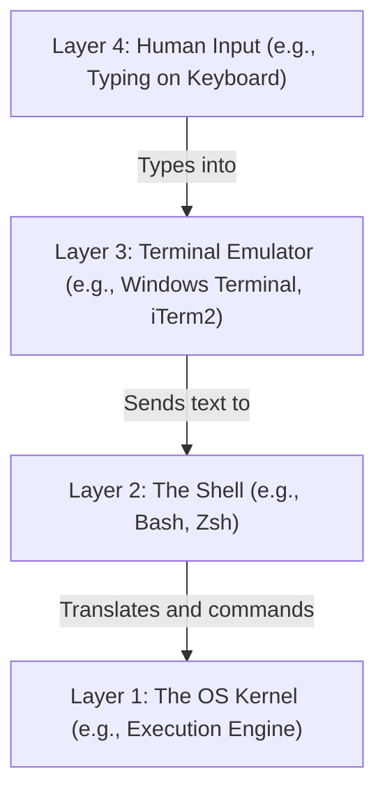

# Terminal Basics & The Shell Prompt (Navigation & Core Syntax)

Version: 2.0.0

Purpose: Canonical lesson structure for Platform Engineering & AI Infrastructure Curriculum.

Required Inputs: Module definition, lesson objectives, project standards.

Outputs: Standards-compliant lesson markdown.

---

# Lesson Metadata

* **Lesson ID:** `MOD-LINUX-BEG-05`
* **Module:** Getting Started with Linux (`MOD-LINUX-BEG`)
* **Difficulty:** Beginner
* **Estimated Duration:** 40 minutes
* **Learning Track:** 🟢 Core
* **Version:** 2.0.0
* **Last Updated:** 2026-06-28

---

# Lesson Overview

This lesson decrypts the mysteries of the Linux terminal window and the shell prompt, exploring how the shell interprets your keystrokes and acts as a direct bridge to the underlying operating system. By breaking down the exact anatomy of the command line prompt and mastering keyboard shortcuts, you will confidently establish the second pillar of our module capability: **"I can install Linux, navigate the terminal, and manage files."**

---

# Learning Objectives

* Differentiate between a Terminal Emulator, a Shell, and the Command-Line Interface (CLI).
* Deconstruct the exact anatomy of a standard Linux shell prompt (Username, Hostname, Current Directory, Prompt Symbol).
* Explain the functional difference between the standard user prompt (`$`) and the root superuser prompt (`#`).
* Utilize essential terminal keyboard shortcuts (Tab completion, reverse history search) to navigate the CLI efficiently.

---

# Prerequisites

* Basic desktop computer literacy.
* Completion of `MOD-LINUX-BEG-04` (Installing & Accessing Linux).

---

# Why This Exists

When you first open a Linux terminal window, it can look intimidating. You are greeted by a black window containing a tiny string of green or white text ending with a blinking cursor. There are no buttons to click, no menus to open, and no friendly tooltips telling you what to do. 

In the early days of computing, before graphical displays existed, humans sat at physical electro-mechanical teletypewriters (called TTYs). When an engineer typed a character on the physical keyboard, it sent an electrical pulse down a copper wire to a massive mainframe computer in another room. The computer processed the command and physically printed the response onto a roll of paper using ink!

While physical teletype machines are long gone, modern Linux terminals function using this exact same elegant, text-in / text-out design philosophy. The terminal window you open today is a virtual simulation of those classic teletype machines, providing the cleanest, most uncorrupted channel of communication between human intent and computer execution.

---

# Core Concepts

## 1. Terminal vs. Shell vs. CLI
Beginners often use the words "terminal," "shell," and "CLI" interchangeably, but they are three distinct technical layers:
* **The Terminal (Terminal Emulator):** The graphical window application you open on your desktop (e.g., Windows Terminal, GNOME Terminal, macOS iTerm2). It displays fonts, background colors, and captures your keystrokes.
* **The Shell:** The actual software program running *inside* the terminal window (e.g., Bash, Zsh, Fish). The shell takes the text words you type, interprets their meaning, and commands the Linux kernel to execute them.
* **The CLI (Command-Line Interface):** The general concept of interacting with computer software by typing strings of text rather than clicking graphical buttons.

## 2. Anatomy of the Shell Prompt
When you open a terminal, the shell prints a line of text waiting for your command. This is called the **Prompt**. A standard Linux prompt follows a highly informative, universal structure:

```text
aloysius@ubuntu-sandbox:~/projects$ 
```

Let's deconstruct every single piece of this beautiful string:
* `aloysius`: Your active **Username**.
* `@`: The literal "at" symbol separating user from machine.
* `ubuntu-sandbox`: The **Hostname** (the unique name of the computer you are logged into).
* `:`: A separator colon dividing the machine name from your location.
* `~/projects`: Your **Current Working Directory** (where you are currently standing in the filesystem). The tilde (`~`) is a universal shortcut symbol representing your user's home directory!
* `$`: The **Prompt Symbol**. This indicates that the shell is ready and waiting for your command.

## 3. The `$` vs. `#` Prompt Symbols
The final character of your prompt is a critical safety indicator:
* `$`: **Standard User Prompt.** You are logged in as a normal user with standard security permissions. You cannot accidentally destroy system files.
* `#`: **Root (Superuser) Prompt.** You are logged in as `root`—the absolute master administrator of the system. You have unrestricted, god-like power over the entire operating system. If you make a mistake here, you can instantly wipe the entire hard drive!

---

# Architecture



---

# Real-World Example

Imagine you are a Site Reliability Engineer (SRE) responding to a major production database outage at 3:00 AM at a company like Amazon. You have ten different terminal windows open connecting to various cloud servers.

Because you understand the exact anatomy of the shell prompt, you never get confused. A quick glance at `db-admin@prod-database-01:~#` instantly tells you three mission-critical facts: you are logged in as `db-admin`, you are touching the production database server (`prod-database-01`), and the `#` symbol warns you that you possess absolute root administrative privileges! The commands you type via **Layer 4: Human Input** are captured by **Layer 3: Terminal Emulator**, translated and checked by **Layer 2: The Shell**, and seamlessly executed by **Layer 1: The OS Kernel**.

---

# Hands-on Demonstration

Let's look at how an engineer inspects the active shell program and explores the incredible speed of terminal keyboard shortcuts.

## Input 1: Identifying the Active Shell Program
We use `echo` combined with the `$SHELL` environment variable to ask Linux which shell program is currently translating our commands.

## Code 1
```bash
# The 'echo' command prints text to the screen.
# '$SHELL' is a system variable containing the absolute path to your active shell software.
echo $SHELL
```

## Expected Output 1
```text
/bin/bash
```

## Explanation 1
Look at how beautifully simple this is! `/bin/bash` tells us that our active shell is **Bash** (the Bourne Again Shell), which is the absolute dominant standard shell across the Linux world. 

---

## Input 2: Leveraging Tab Completion
In the terminal, you almost never type out long file or command names entirely. You use the **Tab key** to let the shell automatically complete words for you!

## Code 2
```bash
# Type the first three letters of the 'history' command, then press the Tab key.
his[PRESS TAB KEY]
```

## Expected Output 2
```text
history
```

## Explanation 2
Notice how magical this feels! When you press the Tab key, the Bash shell instantly searches the entire operating system for any command starting with `his`. Because `history` is the only match, it automatically fills in the remaining letters instantly! This saves Platform Engineers millions of keystrokes every year and completely eliminates spelling errors.

---

# Hands-on Lab

* **Objective:** Inspect your shell prompt anatomy and practice essential terminal keyboard shortcuts.
* **Estimated Time:** 15 minutes
* **Difficulty:** Beginner
* **Environment:** Interactive Browser Terminal / Local Sandbox

## Step-by-step Instructions

1. Open your terminal sandbox.
2. Inspect your prompt string. Identify your username, hostname, current directory, and prompt symbol (`$` or `#`).
3. Type `echo $SHELL` to verify your active shell program.
4. Type `cle` and press the **Tab key** to let the shell automatically complete the `clear` command, then press Enter to wipe the screen clean.
5. Press the **Up Arrow key** on your keyboard to instantly recall your previously typed command (`clear`).

## Verification

```bash
echo $SHELL
clear
```
*If the terminal completes your commands via Tab and recalls history via the Up arrow, you have mastered foundational shell interaction!*

## Troubleshooting

* **Issue:** You press Tab, but the terminal just beeps or does nothing.
* **Solution:** This happens when there are multiple commands starting with those same letters. Press Tab **twice** rapidly to make the shell print a list of all possible matching commands!

## Cleanup

No cleanup is required for this navigation lab.

---

# Production Notes

In enterprise platform teams, engineers frequently customize their shell prompt using advanced tools like `Starship` or `Oh My Zsh`. These tools dynamically inject rich visual indicators directly into the prompt string—such as showing the active Git branch name, current Kubernetes cluster context, or AWS cloud account ID. This visual feedback drastically reduces cognitive load and prevents engineers from accidentally deploying code to the wrong cloud environment.

---

# Common Mistakes

* **Being Terrified of the Blinking Cursor:** Beginners often freeze up when staring at a blank terminal prompt, afraid to type anything. Remember, as long as you see the `$` symbol (standard user), you are operating safely in a sandbox. You cannot break the computer!
* **Typing Every Single Word Manually:** Beginners often ignore the Tab key and manually type out massive file paths, leading to frustrating typos like `No such file or directory`. Train your pinky finger to press Tab constantly!

---

# Failure-Driven Learning

Imagine a junior engineer accidentally runs a command that freezes up or locks the terminal in a runaway loop, leaving them unable to type new commands.

## Simulated Failure
```bash
# Running an endless loop that locks up the terminal prompt
while true; do echo "Runaway loop!!!"; sleep 1; done
```

## Output
```text
Runaway loop!!!
Runaway loop!!!
Runaway loop!!!
[Terminal completely locked, ignoring normal typing...]
```

## Diagnosis & Recovery
Why did this happen? The command entered an infinite loop that hijacked the terminal's output stream! Beginners often panic and forcefully close the entire terminal window. To recover elegantly like a professional engineer, you simply press **Ctrl + C** on your keyboard. `Ctrl + C` sends a powerful electrical interrupt signal (`SIGINT`) directly to the shell, instantly killing the runaway process and returning you safely to a clean prompt!

---

# Engineering Decisions

## Defaulting to Bash vs. Zsh or Fish
When configuring automated server environments, platform architects must decide which shell to set as the default.
* **Fish / Zsh:** Offer beautiful, colorful syntax highlighting and auto-suggestions out-of-the-box, but feature slightly non-standard scripting syntax.
* **Bash (Bourne Again Shell):** The universal, unshakeable standard. It is pre-installed on 99.9% of all Linux cloud servers, containers, and enterprise virtual machines on earth.
* **The Platform Decision:** For automated CI/CD scripts and production server base images, Bash is the absolute mandatory standard.

---

# Best Practices

* **Master Ctrl + R (Reverse Search):** Instead of pressing the Up arrow fifty times to find a command you ran yesterday, press **Ctrl + R**, type a fragment of the command, and let Bash instantly find it in your history!
* **Never Run Unknown Scripts as `#` (Root):** If a tutorial tells you to switch to the `#` root prompt to run a downloaded script, stop and verify the script's contents first.

---

# Troubleshooting Guide

## Issue 1: Terminal Unresponsiveness / Frozen Screen

* **Cause:** You accidentally pressed **Ctrl + S** on your keyboard while typing, which is a legacy teletype shortcut that completely locks/pauses terminal output!
* **Diagnosis:** You type on the keyboard, but absolutely no letters appear on the screen. The terminal appears completely frozen.
* **Solution:** Press **Ctrl + Q** on your keyboard. This instantly unpauses the terminal output stream and restores flawless typing functionality!

---

# Summary

* The **Terminal** is the window application, the **Shell** is the command translator (e.g., Bash), and the **CLI** is the text-based interface.
* A standard Linux prompt elegantly displays your `username@hostname:directory$`.
* The `$` symbol indicates a safe standard user, while the `#` symbol indicates an all-powerful root superuser.
* Essential keyboard shortcuts like **Tab completion**, **Up arrow history**, and **Ctrl + C (Cancel)** empower Platform Engineers to navigate the CLI with incredible speed and confidence.

---

# Cheat Sheet

```bash
# Print your active shell program path
echo $SHELL

# Instantly clear the terminal screen (or press Ctrl + L)
clear

# Cancel/Kill a running or frozen command in the terminal
Ctrl + C

# Automatically complete a command or file name
Tab Key

# Search your previous command history interactively
Ctrl + R

# Unfreeze a terminal accidentally locked by Ctrl + S
Ctrl + Q
```

---

# Knowledge Check

## Multiple Choice Questions

1. You open a terminal and notice your prompt ends with the `#` symbol (e.g., `root@ubuntu-server:~#`). What does this specific symbol signify?
   * A) It means the computer is connected to Twitter/X.
   * B) It signifies that you are logged in as the root superuser with unrestricted, god-like administrative powers over the entire operating system.
   * C) It means the computer battery is low.
   * D) It indicates a standard, highly restricted guest user account.

## Scenario Questions

You are pair programming with a colleague who is manually typing out a massive directory path: `/var/log/nginx/access_log_backup_2026.log`, and they keep getting frustrated by spelling errors. Based on what you learned in this lesson, what keyboard shortcut do you teach them to solve this problem instantly, and how does it work?

## Short Answer Questions

Explain the exact technical difference between a Terminal Emulator window (like Windows Terminal) and a Shell program (like Bash).

<details>
<summary><b>View Answers</b></summary>

### Multiple Choice
1. **B** - The `#` symbol indicates root superuser privileges, granting unrestricted administrative access to modify or delete anything on the system.

### Scenario
I teach them to use the **Tab key** for auto-completion. The shell instantly searches for matches and automatically fills in the rest of the file or command name, saving time and preventing typos.

### Short Answer
The Terminal Emulator is the graphical window that displays text and captures keystrokes, while the Shell is the software program (like Bash) running inside the terminal that interprets commands and tells the OS what to do.

</details>

---

# Interview Preparation

## Beginner Questions

* What is the difference between the `$` prompt symbol and the `#` prompt symbol?
* How does Tab completion work in a Linux terminal?
* If a terminal command gets stuck in an endless loop, what keyboard shortcut do you press to cancel it?

## Intermediate Questions

* Explain what the `$SHELL` environment variable contains and why an engineer might check it.
* What is the historical origin of the term "TTY" in Linux operating systems?

## Advanced Questions

* How does the Bash shell handle the parsing and tokenization of a command string before handing execution over to the Linux kernel `execve` system call?

## Scenario-Based Discussions

* Discuss the productivity and security implications of heavily customizing shell prompts with third-party plugins in an enterprise Platform Engineering organization.

---

# Further Reading

1. [GNU Bash Official Manual](https://www.gnu.org/software/bash/manual/)
2. [The TTY Demystified (Deep Historical Exploration)](https://www.linusakesson.net/programming/tty/)
3. [Oh My Zsh Open Source Framework](https://ohmyz.sh/)
4. [Starship - The Cross-Shell Prompt](https://starship.rs/)
5. [Linux Command Line Cheat Sheet](https://www.linux-commands-cheat-sheet.com/)
