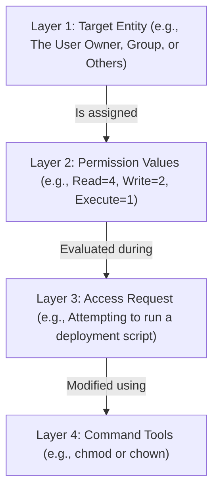

# Linux Permission Mechanics (`chmod`, `chown`, Octal & Symbolic Modes)

Version: 2.0.0

Purpose: Canonical lesson structure for Platform Engineering & AI Infrastructure Curriculum.

Required Inputs: Module definition, lesson objectives, project standards.

Outputs: Standards-compliant lesson markdown.

---

# Lesson Metadata

* **Lesson ID:** `MOD-LINUX-ADM-02`
* **Module:** Linux Administration (`MOD-LINUX-ADM`)
* **Difficulty:** Beginner
* **Estimated Duration:** 45 minutes
* **Learning Track:** 🟢 Core
* **Version:** 2.0.0
* **Last Updated:** 2026-06-28

---

# Lesson Overview

This lesson decrypts the foundational permission model of the Linux operating system, exploring how Linux assigns granular read, write, and execute access rights to files and directories. By mastering `chmod`, `chown`, and the elegant mechanics of octal and symbolic permission modes, you will firmly secure the second pillar of our module capability: **"I can administer a Linux server, manage permissions, automate simple tasks, and troubleshoot common issues."**

---

# Learning Objectives

* Deconstruct the 10-character permission string produced by `ls -la` (File Type, User Permissions, Group Permissions, Others Permissions).
* Differentiate between Read (`r`), Write (`w`), and Execute (`x`) permissions for both standard files and system directories.
* Modify file and directory permissions using `chmod` in both Symbolic Mode (`u+x`) and Octal Mode (`755`).
* Change file ownership across users and groups using `chown`.

---

# Prerequisites

* Completion of `MOD-LINUX-ADM-01` (User & Group Administration).
* Foundational terminal navigation skills (`ls -la`, `pwd`, `cd`).

---

# Why This Exists

In Lesson 01, we learned that Linux is a secure multi-user operating system where operators are isolated across unique User IDs (UIDs) and Group IDs (GIDs). However, separating users is only half the battle. If fifty developers are logged into a server, how does the Linux kernel know who is allowed to view an engineering document, who is allowed to edit a configuration file, or who is allowed to execute an automated deployment script?

In legacy single-user operating systems, file permissions were often clumsy afterthoughts. In Linux, file permissions are an elegant, mathematically perfect foundation built directly into the filesystem metadata.

To solve the challenge of shared resource governance, Unix and Linux established the **Traditional File Permission Model**. Every single file and folder in Linux possesses a set of specific access locks assigned to three distinct entities: the **User (Owner)**, the **Group**, and **Others (Everyone Else)**. By mastering `chmod` (Change Mode) and `chown` (Change Owner), Platform Engineers can construct highly secure, least-privilege cloud environments where data is perfectly protected from unauthorized modification.

---

# Core Concepts

## 1. Anatomy of the Permission String
Think of every file and folder like a room in a house. When you execute `ls -la` in the terminal, the far-left column prints a 10-character string (e.g., `-rwxr-xr--`). This string is the master keycard blueprint for that room, deciding who among **The People** has access.

```text
-  rwx  r-x  r--
┬  ┬┬┬  ┬┬┬  ┬┬┬
│  └┼┘  └┼┘  └┼┘
│   │    │    └──► The Strangers (Others): Look Around Key only (r--)
│   │    └───────► The Roommates (Group): Look Around and Enter Room Keys (r-x)
│   └────────────► The Owner (User): Look Around, Rearrange Furniture, and Enter Room Keys (rwx)
└────────────────► File Type: (-) standard file, (d) directory, (l) symlink
```

## 2. The Meaning of `r`, `w`, and `x`
The **House Keys** behave differently depending on whether they unlock a standard file (like a document) or a directory (like a room):
* **Look Around Key (Read: `r`):** 
  * *Files:* You can open the file and read it.
  * *Directories:* You can peek inside the room and see the names of files.
* **Rearrange Furniture Key (Write: `w`):** 
  * *Files:* You can edit or overwrite the file.
  * *Directories:* You can add, delete, or rename files inside the room.
* **Enter Room Key (Execute: `x`):** 
  * *Files:* You can run the file as a program.
  * *Directories:* You can physically walk into the room using `cd`! *(Note: If you don't have this key, you cannot enter the room, even if you have the Look Around key!)*

## 3. Changing Permissions (`chmod`)
To change the locks on the door, you use **The Locksmith Tools**. `chmod` stands for **Change Mode** (or "Change Locks"). There are two elegant ways to use `chmod`:
* **Symbolic Mode:** Uses letters and math (`+` to add a key, `-` to take a key away) for the Owner (`u`), Roommates (`g`), Strangers (`o`), or All (`a`).
  * `chmod u+x deploy.sh`: Gives the Enter Room Key (`+x`) to the Owner (`u`).
  * `chmod go-w config.env`: Takes away the Rearrange Furniture Key (`-w`) from Roommates (`g`) and Strangers (`o`).
* **Octal Mode (Mathematical Mode):** Uses three numbers calculated from binary math where Look Around = 4, Rearrange Furniture = 2, and Enter Room = 1.
  * `rwx` = 4 + 2 + 1 = **7**
  * `rw-` = 4 + 2 + 0 = **6**
  * `r-x` = 4 + 0 + 1 = **5**
  * `r--` = 4 + 0 + 0 = **4**
  * `chmod 755 server.py`: Sets permissions to `rwxr-xr-x` (Owner: 7, Roommates: 5, Strangers: 5).
  * `chmod 600 id_rsa`: Sets permissions to `rw-------` (Owner: 6, Roommates: 0, Strangers: 0). This locks out everyone but the Owner!

## 4. Changing Ownership (`chown`)
If you build a room but want to hand the title over to a standard developer named `alex`, you use `chown` (Change Owner, or "Transfer Title").
* `sudo chown alex:engineering database.db`: Simultaneously transfers the title to `alex` (Owner) and assigns it to the `engineering` group (Roommates)!

---

# Architecture



---

# Real-World Example

Imagine you are managing an automated CI/CD deployment runner in an enterprise AWS cloud environment. Your developer commits a brand-new Python deployment script named `deploy_infra.py` to Git. This maps directly to our layered architecture:
* **Layer 1: Target Entity:** The deployment runner acts as the user owner trying to interact with the script.
* **Layer 2: Permission Values:** The script was created on a Windows machine and only has Read and Write permissions, lacking execute (`x`) in its metadata.
* **Layer 3: Access Request:** When the automated pipeline attempts to execute the script using `./deploy_infra.py`, the terminal crashes instantly with `Permission denied` because the permissions are insufficient.
* **Layer 4: Command Tools:** You update the pipeline to execute `chmod +x deploy_infra.py` before running the script. The script executes flawlessly, and your cloud infrastructure deploys successfully!

---

# Hands-on Demonstration

Let's look at how an engineer inspects file permissions, modifies access rights using both symbolic and octal modes, and changes file ownership using `chown`.

## Input 1: Inspecting and Modifying Permissions via Symbolic Mode
We create a script file using `echo`, check its default permissions with `ls -l`, and add execute permissions using `chmod u+x`.

## Code 1
```bash
# Create a sample deployment script.
echo "echo 'Deploying Cloud Infrastructure!'" > start_deploy.sh

# Verify the default permissions of the newly created file.
ls -l start_deploy.sh

# Add execute permissions (+x) specifically for the User owner (u).
chmod u+x start_deploy.sh

# Verify the updated permissions and execute the script.
ls -l start_deploy.sh
./start_deploy.sh
```

## Expected Output 1
```text
-rw-r--r-- 1 aloysius aloysius 37 Jun 28 04:10 start_deploy.sh
-rwxr--r-- 1 aloysius aloysius 37 Jun 28 04:10 start_deploy.sh
Deploying Cloud Infrastructure!
```

## Explanation 1
Look at how beautifully this works! The initial `ls -l` confirms our file started with `-rw-r--r--`, meaning it lacked execute permissions. After running `chmod u+x`, the permission string instantly changes to `-rwxr--r--`. We are now fully authorized to run the script using `./start_deploy.sh`, and the terminal echoes our successful deployment message!

---

## Input 2: Securing Files via Octal Mode and Changing Ownership
We secure a highly sensitive configuration file using octal mode (`chmod 600`), and use `sudo chown` to transfer ownership.

## Code 2
```bash
# Create a sample sensitive secrets configuration file.
echo "SUPER_SECRET_KEY=ai_blockchain_2026" > master_secret.env

# Secure the file so only the owner can read/write it (Octal 600 = rw-------).
chmod 600 master_secret.env
ls -l master_secret.env

# Transfer ownership of the file to the root superuser and the root group.
sudo chown root:root master_secret.env
ls -l master_secret.env
```

## Expected Output 2
```text
-rw------- 1 aloysius aloysius 35 Jun 28 04:12 master_secret.env
[sudo] password for aloysius: 
-rw------- 1 root root 35 Jun 28 04:12 master_secret.env
```

## Explanation 2
Notice how perfectly secure this is! `chmod 600` strips away all access from groups and others, leaving a pristine `-rw-------` permission string. This is the ultimate standard for protecting secrets. Following `sudo chown root:root`, the owner and group columns instantly change from `aloysius aloysius` to `root root`. The file is now perfectly protected by the superuser!

---

# Hands-on Lab

* **Objective:** Inspect permission strings, modify access rights using symbolic and octal modes, and transfer file ownership.
* **Estimated Time:** 15 minutes
* **Difficulty:** Beginner
* **Environment:** Interactive Browser Terminal / Local Sandbox

## Step-by-step Instructions

1. Open your terminal sandbox.
2. Type `echo "echo 'Automation Engine Active'" > run_engine.sh` to create a script file.
3. Type `ls -l run_engine.sh` to inspect its starting permission string.
4. Type `chmod +x run_engine.sh` to add execute permissions for everyone.
5. Type `./run_engine.sh` to execute the script and verify output.
6. Type `echo "DB_PASS=production_secure" > db.env` to create a sensitive secrets file.
7. Type `chmod 600 db.env` to restrict access strictly to your owner account.
8. Type `ls -l db.env` to verify the `-rw-------` permission string.

## Verification

```bash
ls -l run_engine.sh db.env
./run_engine.sh
```
*If your terminal confirms `-rwxr-xr-x` for the script and `-rw-------` for the secrets file, you have mastered Linux permissions!*

## Troubleshooting

* **Issue:** `./run_engine.sh` returns `bash: ./run_engine.sh: Permission denied`.
* **Solution:** You forgot to run `chmod +x run_engine.sh` before attempting to execute the file.

## Cleanup

```bash
# Safely remove the demonstration files when finished
rm -f run_engine.sh db.env
```

---

# Production Notes

In enterprise cloud security architecture (such as AWS EC2 or Kubernetes container hardening), Platform Engineers rely heavily on the concept of **Least Privilege**. Automated compliance auditing tools (like AWS Inspector or OpenSCAP) continuously scan cloud servers for misconfigured permissions. If an automated scanner detects a sensitive system file or private SSH key with world-readable permissions (e.g., `chmod 777` or `-rwxrwxrwx`), it instantly flags a critical security violation and blocks the deployment pipeline!

---

# Common Mistakes

* **The Lethal Habit of `chmod 777`:** When beginners encounter a `Permission denied` error, they often panic and search the internet, where bad tutorials tell them to run `chmod 777 file.txt`. `777` grants complete read, write, and execute permissions to literally everyone in the world (`-rwxrwxrwx`). This completely obliterates system security and allows hackers to overwrite your code instantly. **Never use `chmod 777` in production!**
* **Expecting `chmod` to Work on Files You Don't Own:** You can only use `chmod` on files where you are the explicit User Owner! If a file is owned by `root`, attempting to run `chmod 755` as a standard user will fail with `Operation not permitted`. You must elevate via `sudo chmod`.

---

# Failure-Driven Learning

Imagine a junior engineer attempts to use `cd` to navigate into a directory where they possess Read (`r`) permissions but lack Execute (`x`) permissions.

## Simulated Failure
```bash
# Creating a directory and removing execute permissions for the owner
mkdir secure_vault
chmod u-x secure_vault

# Attempting to 'cd' into the directory
cd secure_vault
```

## Output
```text
bash: cd: secure_vault: Permission denied
```

## Diagnosis & Recovery
Why did this fail? The error `Permission denied` occurs because, for directories, the Execute (`x`) permission lock controls the physical ability to walk into the folder! Even though the owner still has read (`r`) permissions, without `x`, the Linux kernel drops a concrete barrier over the directory entrance. To recover, the engineer must restore execute permissions using `chmod u+x secure_vault`, after which `cd secure_vault` will succeed perfectly!

---

# Engineering Decisions

## Symbolic Mode (`u+x`) vs. Octal Mode (`755`)
When writing automated infrastructure scripts, platform architects must choose how to structure permission commands.
* **Symbolic Mode (`chmod u+x`):** Highly intuitive for human readability, and excellent for making surgical adjustments (adding a single permission while leaving existing group permissions completely untouched).
* **Octal Mode (`chmod 755`):** Extremely fast, absolute, and highly predictable. Octal mode completely overwrites all existing permissions with an exact mathematical state.
* **The Platform Decision:** For automated CI/CD scripts and Dockerfile container configurations, Octal Mode (`chmod 755`, `chmod 600`) is the absolute mandatory standard to ensure perfect reproducibility.

---

# Best Practices

* **Memorize Essential Octals:** Train your brain to instantly recognize the big three octal modes: `755` (Standard executable/directory), `644` (Standard text configuration file), and `600` (Highly secure secrets file).
* **Use `chown -R` for Folders:** If you need to transfer ownership of an entire folder and all the thousands of files inside it, add the `-R` (recursive) flag: `sudo chown -R alex:engineering project_folder/`.

---

# Troubleshooting Guide

## Issue 1: "UNPROTECTED PRIVATE KEY FILE!" (SSH Permission Error)

* **Cause:** You attempt to connect to a remote cloud server using a private SSH key file (`id_rsa`), but SSH forcefully aborts the connection.
* **Diagnosis:** The terminal returns `WARNING: UNPROTECTED PRIVATE KEY FILE! Permissions 0644 for 'id_rsa' are too open.`.
* **Solution:** The SSH protocol is designed with strict security protections. It refuses to use a private key file that can be read by other users on the system! Execute `chmod 600 id_rsa` to strip away group/others permissions (`-rw-------`), and re-run your SSH command.

---

# Summary

* The 10-character permission string in `ls -la` cleanly displays access locks for the **User (u)**, **Group (g)**, and **Others (o)**.
* **Read (`r` = 4)** allows viewing files and listing directories; **Write (`w` = 2)** allows editing files and modifying directory contents; **Execute (`x` = 1)** allows running scripts and using `cd` into directories.
* `chmod` modifies permissions using highly intuitive Symbolic Mode (`u+x`) or absolute Octal Mode (`755`, `600`).
* `chown` transfers file ownership across users and groups, empowering Platform Engineers to govern shared server resources securely.

---

# Cheat Sheet

```bash
# Inspect detailed file permissions and ownership
ls -la [file_or_directory]

# Add execute permissions for the User owner (Symbolic Mode)
chmod u+x script.sh

# Remove write permissions for Group and Others (Symbolic Mode)
chmod go-w config.env

# Set standard executable or directory permissions (Octal Mode: rwxr-xr-x)
chmod 755 server.py

# Set standard text file permissions (Octal Mode: rw-r--r--)
chmod 644 README.md

# Set highly secure secrets / private key permissions (Octal Mode: rw-------)
chmod 600 private_key.pem

# Transfer ownership of a file to a new user and group
sudo chown username:groupname database.db

# Transfer ownership of an entire directory tree recursively (-R)
sudo chown -R username:groupname project_folder/
```

---

# Knowledge Check

## Multiple Choice Questions

1. You are configuring a highly secure private SSH key named `cloud_key.pem` to connect to a production AWS server. Which octal `chmod` command ensures that only your user account can read and write the file (`-rw-------`), preventing SSH from aborting the connection?
   * A) `chmod 777 cloud_key.pem`
   * B) `chmod 755 cloud_key.pem`
   * C) `chmod 600 cloud_key.pem`
   * D) `chmod 644 cloud_key.pem`

## Scenario Questions

You are pair programming with a junior developer who is attempting to make a Python script named `build_app.py` executable. They are confused about whether to use `chmod u+x build_app.py` or `chmod 755 build_app.py`. Based on what you learned in this lesson, how do you explain the exact difference between these two approaches, and which one would you recommend if they want to ensure the file is executable by everyone on the engineering team?

## Short Answer Questions

Explain the exact functional difference between possessing Execute (`x`) permissions on a standard text file versus possessing Execute (`x`) permissions on a system directory (folder).

<details>
<summary><b>View Answers</b></summary>

### Multiple Choice
1. **C** - `chmod 600` sets read and write permissions exclusively for the owner, which SSH requires for private keys.

### Scenario
`chmod u+x` adds execute permission only for the file owner, leaving group and others unchanged. `chmod 755` sets absolute permissions: read/write/execute for the owner, and read/execute for everyone else. To ensure the whole team can execute the script, `chmod 755` (or `chmod a+x`) is the recommended approach.

### Short Answer
Execute (`x`) permission on a file allows the operating system to run it as a program or script. On a directory, execute permission allows a user to "enter" (`cd`) the directory and access its contents.

</details>

---

# Interview Preparation

## Beginner Questions

* What do the letters `r`, `w`, and `x` stand for in Linux permissions?
* What does the `chmod` command do?
* How would you change the owner of a file from `root` to `sarah`?

## Intermediate Questions

* Explain the mathematical calculation behind the octal permission mode `755`.
* Why does the SSH protocol forcefully abort connections if your private key file has `644` permissions?

## Advanced Questions

* Explain how the Linux `umask` (user file-creation mode mask) mechanism calculates and applies default permissions dynamically whenever a brand-new file or directory is created by a process.

## Scenario-Based Discussions

* Discuss the security risks and compliance implications of an engineering organization where developers routinely use `chmod 777` to resolve permission errors in a shared development environment.


<details>
<summary><b>View Answers</b></summary>

### Beginner
* **r, w, and x**: They stand for Read (`r`), Write (`w`), and Execute (`x`). For files, this controls reading, modifying, and executing. For directories, it controls listing contents (`r`), creating/deleting files (`w`), and entering the directory (`x`).
* **chmod command**: `chmod` stands for "change mode" and is used to alter the access permissions (read, write, execute) of files and directories for the owner, group, and others.
* **Changing file owner**: You would use the `chown` command: `sudo chown sarah filename`. (If you also need to change the group, `sudo chown sarah:sarah filename`).

### Intermediate
* **Mathematical calculation for 755**: Octal mode calculates permissions by assigning numerical values: Read = 4, Write = 2, Execute = 1. `7` (Owner) = 4 + 2 + 1. `5` (Group) = 4 + 1. `5` (Others) = 4 + 1. Thus, 755 grants full rights to the owner and read/execute rights to everyone else.
* **SSH aborting for 644 permissions**: SSH mandates strict security for private keys (`~/.ssh/id_rsa`). `644` allows "others" to read the file, risking key theft. SSH aborts the connection and demands `600` (read/write by owner only) to guarantee the cryptographic material is inaccessible to others.

### Advanced
* **Linux umask mechanism**: The OS starts with base permissions: `666` for files and `777` for directories. The `umask` acts as a subtractive filter, masking out specific permission bits. For example, a umask of `022` subtracts write access for group (2) and others (2). Thus, `666 - 022 = 644` for files, and `777 - 022 = 755` for directories.

### Scenario-Based Discussions
* **Security risks of chmod 777**: Using `chmod 777` grants universal read, write, and execute access, violating the principle of least privilege. It exposes sensitive data to unauthorized internal users, allows malware to easily overwrite or execute files, creates compliance failures during audits (e.g., SOC2, PCI-DSS), and makes tracing accountability impossible.

</details>

---

# Further Reading

1. [Linux File Permissions Explained (Red Hat)](https://www.redhat.com/en/topics/linux/linux-file-permissions)
2. [GNU Chmod Official Manual](https://www.gnu.org/software/coreutils/manual/html_node/chmod-invocation.html)
3. [Understanding umask in Linux (Linux Handbook)](https://linuxhandbook.com/umask/)
4. [Linux Permissions Calculator Online](https://chmod-calculator.com/)
5. [Mastering chown and chgrp Commands](https://www.digitalocean.com/community/tutorials/linux-file-permissions-explained)
