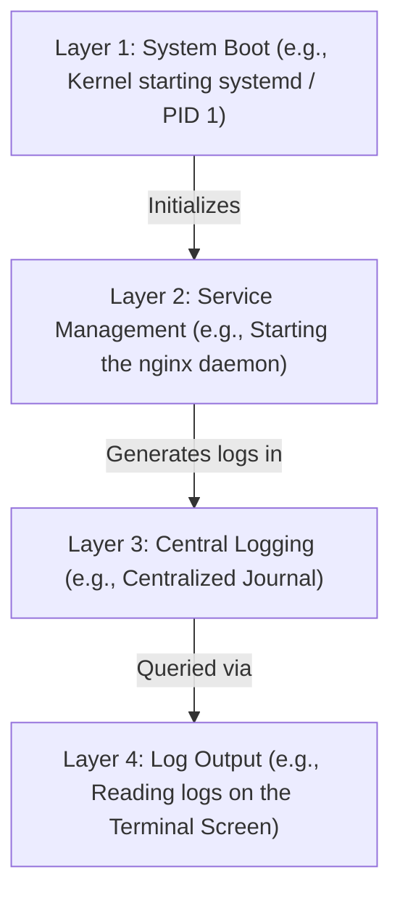

# Service Management with Systemd (`systemctl`, Daemons & Startups)

Version: 2.0.0

Purpose: Canonical lesson structure for Platform Engineering & AI Infrastructure Curriculum.

Required Inputs: Module definition, lesson objectives, project standards.

Outputs: Standards-compliant lesson markdown.

---

# Lesson Metadata

* **Lesson ID:** `MOD-LINUX-ADM-04`
* **Module:** Linux Administration (`MOD-LINUX-ADM`)
* **Difficulty:** Beginner
* **Estimated Duration:** 45 minutes
* **Learning Track:** 🟢 Core
* **Version:** 2.0.0
* **Last Updated:** 2026-06-28

---

# Lesson Overview

This lesson explores the master init system of modern Linux architectures, decrypting how Linux manages background services, automated startups, and system logging. By mastering `systemctl`, `journalctl`, and the elegant mechanics of systemd unit files, you will firmly establish the core operational capabilities supporting our module capability: **"I can administer a Linux server, manage permissions, automate simple tasks, and troubleshoot common issues."**

---

# Learning Objectives

* Define what a Linux Daemon is and explain the architectural role of `systemd` (`PID 1`).
* Start, stop, restart, and check the status of system services using `systemctl`.
* Configure services to launch automatically upon system boot using `systemctl enable`.
* Inspect and filter system service log journals using `journalctl`.
* Deconstruct the basic anatomy of a Systemd Unit File (`.service`).

---

# Prerequisites

* Completion of `MOD-LINUX-ADM-03` (Process Inspection & Control).
* Foundational terminal administration skills (`sudo`, `cat`, `grep`).

---

# Why This Exists

In Lesson 03, we learned how to launch software processes in the background using `&` and inspect them using `ps aux`. However, launching an enterprise web server or AI database manually from your terminal prompt carries a massive structural flaw: if the physical cloud server reboots due to a power outage or automated maintenance, your manually launched background process is permanently destroyed! When the server finishes rebooting, your web server remains completely offline until a human engineer logs back in via SSH to manually restart the command.

In early Unix and Linux systems, engineers attempted to solve this by writing complex, messy startup scripts (known as System V `init.d` scripts). These scripts were notoriously difficult to debug, executed slowly one-by-one, and frequently failed to restart services if they crashed unexpectedly.

To solve this massive operational bottleneck, the modern Linux ecosystem standardized on **Systemd (System Daemon)**. `systemd` is the absolute master init system of Linux. It operates as `PID 1` and acts as an elite, automated traffic conductor. It launches services in parallel during boot, automatically restarts applications if they crash, and captures perfect structured log journals (`journalctl`). Mastering `systemctl` empowers Platform Engineers to ensure mission-critical cloud services achieve flawless, automated high availability.

---

# Core Concepts

## 1. What is a Daemon?
Think of a **Daemon** (pronounced *dee-mon*) as a dedicated factory worker who works constantly in the background without needing a desk or manager watching them. These **Workers** wait silently for work to arrive (e.g., the `sshd` worker waits for remote logins, the `nginx` worker waits for website visitors). In Linux, these worker names traditionally end with the letter `d`.

## 2. The Role of Systemd (`PID 1`)
When the computer turns on the power, it immediately hires **The Factory Manager** called `systemd` (who gets the very first badge, `PID 1`). The Factory Manager is responsible for hiring every other worker, unlocking the doors, managing the network, and making sure all critical workers stay on the job.

## 3. Giving Orders (`systemctl`)
To give orders to The Factory Manager, you use `systemctl` (System Control).
* `sudo systemctl status nginx`: Asks the manager for a status report on a specific worker (like Nginx), showing if they are working and their recent log entries.
* `sudo systemctl start nginx`: Tells the manager to put the worker on the clock instantly.
* `sudo systemctl stop nginx`: Tells the manager to send the worker home.
* `sudo systemctl restart nginx`: Tells the manager to instantly send the worker home and bring them right back.
* `sudo systemctl reload nginx`: **Reload** is a special trick! It tells the worker to quietly read the new rulebook without dropping the tasks they are currently holding!

## 4. The Daily Roster (`systemctl enable`)
To make sure a worker automatically shows up for their shift the moment the factory powers on, you put them on **The Daily Roster** using `enable`.
* `sudo systemctl enable nginx`: Tells The Factory Manager to automatically start Nginx every time the computer boots up. (`disable` takes them off the roster).

## 5. The Master Logbook (`journalctl`)
The Factory Manager meticulously records every single peep the workers make into a secure **Master Logbook**. You can read this logbook using `journalctl` (Journal Control).
* `sudo journalctl -u nginx.service`: Filters the massive logbook to show only the reports made by the Nginx worker!
* `sudo journalctl -f`: **Follow** acts like a live security ticker, printing new reports to your screen in real-time as the worker speaks!

---

# Architecture



---

# Real-World Example

Imagine you are an Infrastructure Engineer managing a fleet of cloud virtual machines hosting a highly critical payment gateway microservice. This aligns directly with our architecture:
* **Layer 1: System Boot:** At 2:15 AM, the primary cloud server undergoes an automated hardware reboot by the cloud provider (e.g., AWS EC2 maintenance), prompting the kernel to start `systemd`.
* **Layer 2: Service Management:** Because you executed `sudo systemctl enable payment.service`, `systemd` automatically launches the payment daemon without human intervention.
* **Layer 3: Central Logging:** The payment gateway securely writes all its startup health checks and errors to the centralized journal.
* **Layer 4: Log Output:** In the morning, you run `journalctl` to view the terminal screen and confirm the gateway returned online seamlessly!

---

# Hands-on Demonstration

Let's look at how an engineer checks the status of a critical system service using `systemctl status`, inspects service log journals using `journalctl`, and deconstructs a systemd unit file.

## Input 1: Inspecting Service Status and Log Journals
We use `systemctl status` to inspect the active SSH daemon (`ssh.service`), and use `journalctl -u` to view its recent log history.

## Code 1
```bash
# Check the active status, main PID, and health of the SSH daemon service.
systemctl status ssh.service

# Inspect the most recent 10 log lines (-n 10) generated specifically by the SSH service (-u).
sudo journalctl -u ssh.service -n 10
```

## Expected Output 1
```text
● ssh.service - OpenBSD Secure Shell server
     Loaded: loaded (/usr/lib/systemd/system/ssh.service; enabled; preset: enabled)
     Active: active (running) since Sun 2026-06-28 01:12:00 UTC; 3h ago
   Main PID: 712 (sshd)
      Tasks: 1 (limit: 4614)
     Memory: 5.2M
     CGroup: /system.slice/ssh.service
             └─712 /usr/sbin/sshd -D

Jun 28 01:12:00 server systemd[1]: Started OpenBSD Secure Shell server.
Jun 28 01:12:05 server sshd[712]: Server listening on 0.0.0.0 port 22.
```

## Explanation 1
Look at how beautifully rich this dashboard is! `Active: active (running)` confirms the SSH daemon is healthy and active. `enabled` confirms it is configured to launch automatically on system boot. Notice the `Main PID: 712`—this is the master process ID tracked by `systemd`. Our `journalctl` command perfectly isolates the exact log lines showing when the server started listening on port 22!

---

## Input 2: Deconstructing a Systemd Unit File
We use `cat` to inspect the actual plain-text configuration file (`.service`) that teaches `systemd` how to manage a service.

## Code 2
```bash
# Display the plain-text contents of the SSH systemd unit configuration file.
cat /usr/lib/systemd/system/ssh.service
```

## Expected Output 2
```text
[Unit]
Description=OpenBSD Secure Shell server
After=network.target auditd.service
ConditionPathExists=!/etc/ssh/sshd_not_to_be_run

[Service]
EnvironmentFile=-/etc/default/ssh
ExecStart=/usr/sbin/sshd -D $SSHD_OPTS
ExecReload=/bin/kill -HUP $MAINPID
KillMode=process
Restart=on-failure
RestartSec=42s

[Install]
WantedBy=multi-user.target
```

## Explanation 2
Notice how beautifully elegant and readable this unit file is! Let's deconstruct the three master sections:
* `[Unit]`: Defines metadata and dependencies. `After=network.target` guarantees `systemd` will wait until the computer's network connection is fully online before attempting to launch SSH!
* `[Service]`: Defines execution rules. `ExecStart` tells `systemd` the exact terminal command to execute to launch the daemon. `Restart=on-failure` is an incredible engineering feature—if the SSH daemon crashes unexpectedly, `systemd` will automatically restart it after 42 seconds (`RestartSec=42s`)!
* `[Install]`: Defines boot behavior. `WantedBy=multi-user.target` tells `systemd` to launch this service during the normal multi-user boot sequence.

---

# Hands-on Lab

* **Objective:** Inspect service status, manage service execution, and filter centralized log journals.
* **Estimated Time:** 15 minutes
* **Difficulty:** Beginner
* **Environment:** Interactive Browser Terminal / Local Sandbox

## Step-by-step Instructions

1. Open your terminal sandbox.
2. Type `systemctl status ssh` (or `systemctl status systemd-journald` if running in a minimal container) to inspect active service health.
3. Type `sudo systemctl restart ssh` to simulate an administrative service restart.
4. Type `systemctl status ssh` to verify the `Active: active (running) since...` timestamp has perfectly updated.
5. Type `sudo systemctl enable ssh` to verify automated boot symlinks.
6. Type `sudo journalctl -u ssh.service -n 5` to inspect the exact log lines generated during your recent restart.

## Verification

```bash
systemctl is-active ssh.service
systemctl is-enabled ssh.service
```
*If your terminal echoes `active` and `enabled`, you have mastered Systemd service administration!*

## Troubleshooting

* **Issue:** `systemctl status` returns `System has not been booted with systemd as init system (PID 1). Can't operate.`.
* **Solution:** You are running inside a legacy Docker container or an old WSL1 environment that does not use `systemd` as `PID 1`. Use a standard virtual machine, cloud shell, or modern WSL2 instance.

## Cleanup

No cleanup is required for this service management lab.

---

# Production Notes

In enterprise infrastructure automation (such as Ansible, Chef, or Terraform cloud-init scripts), Platform Engineers completely automate the creation of Systemd unit files. Whenever deploying a custom internal microservice, the automation script writes a pristine `.service` file into `/etc/systemd/system/`, executes `sudo systemctl daemon-reload` to command `systemd` to scan for new files, and runs `sudo systemctl enable --now my-app.service` to instantly start and enable the microservice in a single clean command!

---

# Common Mistakes

* **Forgetting `systemctl daemon-reload`:** If you manually edit a `.service` file on the hard drive, `systemd` will *not* automatically notice your changes! If you attempt to restart the service, `systemctl` will return a warning telling you the file changed on disk. You must execute `sudo systemctl daemon-reload` to command `systemd` to re-read the unit files!
* **Confusing `restart` with `reload`:** `restart` completely kills the daemon process and launches a brand-new PID, instantly disconnecting any active users currently downloading files from your server. `reload` keeps the existing PID running and gracefully re-reads configuration files without dropping connections. Use `reload` whenever possible!

---

# Failure-Driven Learning

Imagine a junior engineer attempts to start a web server service using `systemctl start`, but the service's configuration file contains a severe typo.

## Simulated Failure
```bash
# Attempting to start a service with a broken configuration file
sudo systemctl start nginx.service
```

## Output
```text
Job for nginx.service failed because the control process exited with error code.
See "systemctl status nginx.service" and "journalctl -xeu nginx.service" for details.
```

## Diagnosis & Recovery
Why did this fail? `systemd` attempted to execute the command defined in `ExecStart`, but the Nginx software encountered a fatal configuration typo and crashed with an exit code! `systemd` instantly caught the crash and halted the startup. To recover, the engineer must follow `systemd`'s beautiful advice: execute `sudo journalctl -eu nginx.service` to inspect the exact log lines, locate the configuration typo (e.g., a missing semicolon in `nginx.conf`), fix the typo, and re-run `sudo systemctl start nginx.service`.

---

# Engineering Decisions

## Monolithic init vs. Systemd Architecture
When selecting an operating system base image, platform architects must understand the init system architecture.
* **Legacy System V init (`init.d`):** Launches services sequentially one-by-one using complex bash scripts. If a service freezes during boot, the entire server hangs.
* **Systemd (`PID 1`):** Launches services asynchronously in parallel using clean, declarative unit files (`.service`). Provides built-in dependency management (`After=network.target`), automatic crash restarts (`Restart=on-failure`), and centralized structured logging (`journalctl`).
* **The Platform Decision:** `systemd` is the absolute unanimous standard across all modern enterprise Linux distributions (Ubuntu, RHEL, Debian).

---

# Best Practices

* **Always Configure `Restart=on-failure`:** Whenever creating custom systemd unit files for your microservices, always include `Restart=on-failure` to ensure `systemd` acts as an automated self-healing mechanism if your app crashes.
* **Leverage `journalctl -f` During Deployments:** When deploying a new application version, keep a terminal tab open running `sudo journalctl -u my-app.service -f` (follow) to watch the live application logs scroll across your screen in real-time!

---

# Troubleshooting Guide

## Issue 1: "Unit my-app.service is masked"

* **Cause:** You attempt to start or enable a service, but `systemctl` forcefully rejects the operation.
* **Diagnosis:** The terminal returns `Failed to start my-app.service: Unit my-app.service is masked.`.
* **Solution:** **Masking** is an elite security feature in Linux! It links a service file directly to `/dev/null`, making it mathematically impossible for the service to be started, even by `root`! This is used to permanently block insecure legacy services. If you genuinely need to start the service, you must first unmask it: `sudo systemctl unmask my-app.service`.

---

# Summary

* A **Daemon** is a continuous background software process, managed by `systemd` (`PID 1`).
* `systemctl` empowers administrators to `start`, `stop`, `restart`, `reload`, and check `status` of system services.
* `systemctl enable` configures automated service startup during the system boot sequence.
* `journalctl` provides centralized, filterable access to system service log journals.
* Systemd Unit Files (`.service`) provide clean, declarative blueprints defining service dependencies, execution commands, and automated crash recovery rules.

---

# Cheat Sheet

```bash
# Inspect the active status and health of a service
systemctl status [service_name]

# Start, stop, or restart a service
sudo systemctl start [service_name]
sudo systemctl stop [service_name]
sudo systemctl restart [service_name]

# Gracefully reload a service's configuration without dropping connections
sudo systemctl reload [service_name]

# Configure a service to launch automatically on system boot
sudo systemctl enable [service_name]

# Disable automated boot startup for a service
sudo systemctl disable [service_name]

# Command systemd to re-read unit files after manual modifications
sudo systemctl daemon-reload

# Inspect the log journal for a specific service
sudo journalctl -u [service_name]

# Follow live, scrolling log journals in real-time
sudo journalctl -u [service_name] -f

# Verify if a service is actively running or enabled for boot
systemctl is-active [service_name]
systemctl is-enabled [service_name]
```

---

# Knowledge Check

## Multiple Choice Questions

1. You have written a custom Python microservice and want `systemd` to automatically restart the application if it crashes unexpectedly due to a database disconnect. Which declarative parameter do you add to the `[Service]` section of your systemd unit file to achieve this?
   * A) `KillMode=brutal`
   * B) `Restart=on-failure`
   * C) `After=network.target`
   * D) `WantedBy=multi-user.target`

## Scenario Questions

You are managing a production Nginx web server. You modify the Nginx configuration file to add a new security header. A junior engineer suggests executing `sudo systemctl restart nginx` to apply the changes. Based on what you learned in this lesson, why is `restart` risky in a high-traffic production environment, and what alternative `systemctl` command do you recommend they execute instead?

## Short Answer Questions

Explain the exact purpose of executing `sudo systemctl daemon-reload` and describe the specific scenario where an engineer must run it.

<details>
<summary><b>View Answers</b></summary>

### Multiple Choice
1. **B** - `Restart=on-failure` instructs systemd to automatically restart the service if it exits abnormally or with a non-zero exit code.

### Scenario
Using `restart` forcefully kills the process and starts it again, dropping all active user connections and causing downtime. Instead, recommend `sudo systemctl reload nginx`, which seamlessly applies the new configuration without terminating active connections.

### Short Answer
`sudo systemctl daemon-reload` tells systemd to rescan the disk and load updated unit files into memory. It must be run anytime a systemd `.service` file is created, modified, or deleted before attempting to start or enable it.

</details>

---

# Interview Preparation

## Beginner Questions

* What is a daemon in Linux?
* What does `systemctl enable` do?
* How would you view the live, real-time scrolling logs of a web server service?

## Intermediate Questions

* Explain the difference between `systemctl restart` and `systemctl reload`.
* What does the `After=network.target` parameter achieve in a systemd unit file?

## Advanced Questions

* Explain how `systemd` utilizes Linux cgroups (control groups) to track and manage all spawned child processes of a daemon, preventing orphaned processes from escaping when the main service is stopped.

## Scenario-Based Discussions

* Discuss the architectural trade-offs of managing background microservices directly on virtual machines using Systemd unit files versus packaging them into containers managed by a Kubernetes kubelet daemon in an enterprise environment.


<details>
<summary><b>View Answers</b></summary>

### Beginner
* **Linux daemon**: A daemon is a background process that runs continuously without a controlling terminal, waiting to handle periodic requests, perform system tasks, or provide services (e.g., web servers, SSH).
* **systemctl enable**: `systemctl enable` configures a systemd service to start automatically upon system boot by creating symbolic links for the unit file in the appropriate target directories.
* **Viewing live web server logs**: You would use the `journalctl` command with the follow flag and the unit name: `journalctl -u [servicename] -f` (e.g., `journalctl -u nginx -f`).

### Intermediate
* **systemctl restart vs reload**: `systemctl restart` completely stops the service and starts it again, causing a brief period of downtime and dropping active connections. `systemctl reload` sends a signal (usually `SIGHUP`) instructing the daemon to re-read its configuration files without terminating the main process, maintaining uptime and active connections.
* **After=network.target**: It ensures that systemd waits until the system's networking stack has been initialized and is available before attempting to start this specific service, preventing startup failures for daemons that bind to network ports.

### Advanced
* **systemd and cgroups**: When `systemd` starts a service, it places the main process into a dedicated cgroup. Any child processes forked by the daemon automatically inherit and reside in the same cgroup. When `systemctl stop` is issued, `systemd` sends termination signals to the entire cgroup, guaranteeing that all descendant processes are reliably killed, preventing "escaped" orphans from consuming resources in the background.

### Scenario-Based Discussions
* **Systemd vs Kubernetes for microservices**: Managing microservices directly with Systemd on VMs offers simplicity, lower latency, and deep OS integration, but suffers from "works on my machine" dependency conflicts, difficult scaling, and slow immutable deployments. Kubernetes containers provide strict isolation, immutable identical artifacts, and auto-scaling, but introduce massive platform complexity, networking overhead, and a steep learning curve.

</details>

---

# Further Reading

1. [Systemd Official Project Website & Documentation](https://systemd.io/)
2. [Understanding Systemd Units and Unit Files (DigitalOcean Tutorial)](https://www.digitalocean.com/community/tutorials/understanding-systemd-units-and-unit-files)
3. [Mastering journalctl for System Logging (Red Hat)](https://www.redhat.com/)
4. [Linux Daemons Explained (Linux Handbook)](https://linuxhandbook.com/)
5. [The Systemd Master Manual (`man systemd`)](https://www.freedesktop.org/software/systemd/man/latest/systemd.html)
