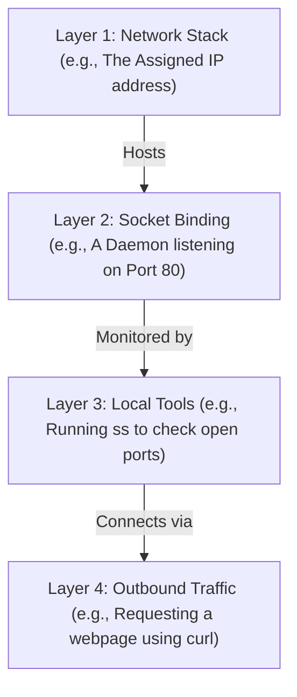

# Networking Basics in the Terminal (`ip`, `ping`, `curl`, `ss`)

Version: 2.0.0

Purpose: Canonical lesson structure for Platform Engineering & AI Infrastructure Curriculum.

Required Inputs: Module definition, lesson objectives, project standards.

Outputs: Standards-compliant lesson markdown.

---

# Lesson Metadata

* **Lesson ID:** `MOD-LINUX-ADM-05`
* **Module:** Linux Administration (`MOD-LINUX-ADM`)
* **Difficulty:** Beginner
* **Estimated Duration:** 45 minutes
* **Learning Track:** 🟢 Core
* **Version:** 2.0.0
* **Last Updated:** 2026-06-28

---

# Lesson Overview

This lesson navigates the essential networking command-line utilities of the Linux operating system, exploring how Linux configures interfaces, tests network connectivity, inspects open listening ports, and makes direct HTTP requests. By mastering `ip`, `ping`, `ss`, and `curl`, you will establish the fundamental connectivity troubleshooting capabilities supporting our module capability: **"I can administer a Linux server, manage permissions, automate simple tasks, and troubleshoot common issues."**

---

# Learning Objectives

* Inspect active network interfaces, IP addresses, and routing tables using `ip addr` and `ip route`.
* Verify end-to-end network connectivity and measure packet latency using `ping`.
* Identify open listening network sockets and active connections using `ss` (Socket Statistics).
* Execute command-line HTTP/REST requests and inspect web server response headers using `curl`.

---

# Prerequisites

* Completion of `MOD-LINUX-ADM-04` (Service Management with Systemd).
* Foundational terminal administration skills (`sudo`, `grep`, `|`).

---

# Why This Exists

In the preceding lessons, we mastered how to administer an isolated, standalone Linux server—managing its users, permissions, processes, and background systemd services. However, a cloud server operating in absolute isolation is useless. Modern enterprise platforms are massive, interconnected webs of microservices, cloud databases, AI model endpoints, and external client applications communicating continuously over computer networks.

When you deploy a new web application to a cloud virtual machine, it must bind to a network port (like port 80 or 443), obtain an IP address, and route traffic across the internet. 

In a desktop operating system, you verify internet connectivity by opening a graphical web browser like Chrome and seeing if a webpage loads. In a headless cloud server or containerized microservice, there is no graphical browser. If your AI microservice suddenly starts failing with `Connection timed out` when attempting to query a database, how do you verify if the server's network interface is active? How do you check if the database port is physically listening? How do you test if the API endpoint is returning valid data?

To solve this mission-critical operational requirement, Linux provides an elite suite of **Terminal Networking Utilities** (`ip`, `ping`, `ss`, `curl`). These lightweight, razor-sharp tools act as your virtual network diagnostic suite, allowing Platform Engineers to pinpoint and resolve complex connectivity failures across distributed cloud environments instantly.

---

# Core Concepts

## 1. Finding Your Home Address (`ip`)
Think of your computer as a house connected to a massive city grid. Every connection passes through a **Physical Mailbox Slot** (a network interface, like `eth0`). To inspect these, you use the `ip` tool.
* `ip addr show`: Shows you the **The Home Address** (IP address) assigned to your house so others can send you mail.
* `ip route show`: Shows you **The Mail Carrier** route (the default gateway), which is the exact path your letters take to leave your neighborhood and reach the broader internet.

## 2. Knocking on the Door (`ping`)
When you need to see if a neighbor's house (another server) is currently standing and someone is home, you use `ping`.
* `ping [hostname_or_IP]`: Sends a tiny "Knock-Knock" message across the internet. If the neighbor is awake, they instantly shout "Who's there!" back at you. `ping` measures exactly how many milliseconds the round trip took. *(Note: In Linux, `ping` knocks forever by default! You must press `Ctrl + C` to stop it, or use the `-c 4` flag to knock exactly 4 times!)*

## 3. Checking the Mailboxes (`ss`)
When you hire a worker like a web server (Nginx), they stand at a specific **Mailbox** (a network port, like port 80) waiting for letters. To verify if a worker is actively standing at their mailbox, you use **The Mail Inspector** tool `ss` (Socket Statistics).
* `sudo ss -tulpn`: The universal master command to inspect all mailboxes. Let's break down the flags:
  * `t`: Shows TCP mailboxes (letters that require a signature).
  * `u`: Shows UDP mailboxes (postcards thrown over the fence).
  * `l`: Shows only mailboxes actively waiting for mail (`LISTEN`).
  * `p`: Shows the exact name of the worker standing at the mailbox! (Requires `sudo`).
  * `n`: Shows raw numbers (like `80`) instead of guessing the mailbox's purpose, making it much faster!

## 4. Requesting a Document (`curl`)
When you need to send a letter requesting a specific document from a business (like fetching a web page or API data), you use `curl` (Client URL).
* `curl http://example.com`: Asks for the full document (webpage) and prints it instantly on your screen.
* `curl -I http://example.com`: Asks *only* for the envelope's summary details (HTTP Response Headers), telling you if the document exists (`200 OK`) without forcing you to read the entire 50-page document!

---

# Architecture



---

# Real-World Example

Imagine you are a Cloud Infrastructure Engineer deploying a brand-new AI inference microservice to a Kubernetes cluster. The service needs to connect to a vector database, following our layered architecture:
* **Layer 1: Network Stack:** First, you run `ip addr` to confirm the container successfully obtained an IP address so it can route traffic.
* **Layer 2: Socket Binding:** The container tries to reach the database daemon, which should be listening on port `5432`.
* **Layer 3: Local Tools:** To troubleshoot, you log into the database server and run `ss -tulpn`. The output is completely empty, showing the database daemon crashed and isn't listening!
* **Layer 4: Outbound Traffic:** After you restart the database service, outbound traffic flows properly and your `ping` and `curl` commands reach the target successfully!

---

# Hands-on Demonstration

Let's look at how an engineer inspects active network interfaces using `ip addr`, verifies network connectivity using `ping`, inspects open ports using `ss`, and makes HTTP requests using `curl`.

## Input 1: Inspecting Interfaces and Testing Connectivity
We use `ip addr` to view our network interface configuration, and `ping -c 3` to test round-trip connectivity to the local loopback interface.

## Code 1
```bash
# Display detailed information about all active network interfaces and IP addresses.
ip addr show

# Send exactly 3 ICMP echo request packets (-c 3) to the local loopback IP address (127.0.0.1).
ping -c 3 127.0.0.1
```

## Expected Output 1
```text
1: lo: <LOOPBACK,UP,LOWER_UP> mtu 65536 qdisc noqueue state UNKNOWN group default qlen 1000
    link/loopback 00:00:00:00:00:00 brd 00:00:00:00:00:00
    inet 127.0.0.1/8 scope host lo
       valid_lft forever preferred_lft forever
2: eth0: <BROADCAST,MULTICAST,UP,LOWER_UP> mtu 1500 qdisc pfifo_fast state UP group default qlen 1000
    link/ether 02:42:ac:11:00:02 brd ff:ff:ff:ff:ff:ff
    inet 172.17.0.2/16 brd 172.17.255.255 scope global eth0
       valid_lft forever preferred_lft forever

PING 127.0.0.1 (127.0.0.1) 56(84) bytes of data.
64 bytes from 127.0.0.1: icmp_seq=1 ttl=64 time=0.025 ms
64 bytes from 127.0.0.1: icmp_seq=2 ttl=64 time=0.031 ms
64 bytes from 127.0.0.1: icmp_seq=3 ttl=64 time=0.029 ms

--- 127.0.0.1 ping statistics ---
3 packets transmitted, 3 received, 0% packet loss, time 2049ms
rtt min/avg/max/mdev = 0.025/0.028/0.031/0.002 ms
```

## Explanation 1
Look at how beautifully rich this networking data is! `ip addr` reveals two interfaces: `lo` (loopback, `127.0.0.1`) and `eth0` (Ethernet, `172.17.0.2`). Notice our ping statistics: `3 packets transmitted, 3 received, 0% packet loss`. The local loopback network stack is operating with pristine, lightning-fast health (`0.028 ms` average latency)!

---

## Input 2: Inspecting Listening Ports and Fetching HTTP Headers
We use `sudo ss -tulpn` to inspect open listening network sockets, and `curl -I` to fetch the HTTP response headers of a web server.

## Code 2
```bash
# Inspect all listening TCP/UDP sockets, numeric ports, and owning process PIDs.
sudo ss -tulpn

# Fetch only the HTTP response headers (-I) from the public example website.
curl -I https://example.com
```

## Expected Output 2
```text
Netid State  Recv-Q Send-Q   Local Address:Port    Peer Address:Port Process                                  
tcp   LISTEN 0      128            0.0.0.0:22           0.0.0.0:*     users:(("sshd",pid=712,fd=3))
tcp   LISTEN 0      511            0.0.0.0:80           0.0.0.0:*     users:(("nginx",pid=1050,fd=6))

HTTP/1.1 200 OK
Accept-Ranges: bytes
Age: 512214
Cache-Control: max-age=604800
Content-Type: text/html; charset=UTF-8
Date: Sun, 28 Jun 2026 04:30:00 GMT
Server: ECAcc (lhr/9796)
Content-Length: 1256
```

## Explanation 2
Notice how perfectly transparent this inspection is! `ss -tulpn` isolates two listening sockets: port `22` (owned by `sshd`, PID `712`) and port `80` (owned by `nginx`, PID `1050`). `0.0.0.0` means the services are listening on literally every available network interface! `curl -I` perfectly retrieves the web server's headers, confirming a healthy `HTTP/1.1 200 OK` status code!

---

# Hands-on Lab

* **Objective:** Inspect network interfaces, test packet latency, verify listening sockets, and execute HTTP requests.
* **Estimated Time:** 15 minutes
* **Difficulty:** Beginner
* **Environment:** Interactive Browser Terminal / Local Sandbox

## Step-by-step Instructions

1. Open your terminal sandbox.
2. Type `ip addr show` to identify your active primary IP address.
3. Type `ip route show` to discover your default gateway IP address.
4. Type `ping -c 4 8.8.8.8` to test outbound internet connectivity to Google's public DNS servers.
5. Type `sudo ss -tulpn` to inspect all open listening network ports on your machine.
6. Type `curl -I https://www.google.com` to inspect the HTTP response headers of a live production search engine.

## Verification

```bash
ip route show
curl -I https://example.com | grep "HTTP"
```
*If your terminal confirms a default gateway route and outputs `HTTP/1.1 200 OK`, you have mastered Linux terminal networking!*

## Troubleshooting

* **Issue:** `ping 8.8.8.8` returns `ping: connect: Network is unreachable`.
* **Solution:** Your terminal sandbox or local virtual machine does not have an active outbound internet connection, or your firewall is blocking ICMP packets. Use `ping 127.0.0.1` to practice local loopback connectivity.

## Cleanup

No cleanup is required for this networking inspection lab.

---

# Production Notes

In enterprise cloud environments (such as AWS VPCs or Kubernetes Service Meshes), Platform Engineers rely heavily on `curl` to execute automated health checks. For example, when deploying a containerized microservice, Kubernetes configures an automated `livenessProbe` that executes `curl -f http://localhost:8080/healthz` every 10 seconds. If the application freezes or returns an HTTP 500 error, `curl -f` instantly fails with an exit code, prompting Kubernetes to automatically terminate and restart the failing container!

---

# Common Mistakes

* **Forgetting `-c` with `ping` in Automated Scripts:** In Windows, `ping` automatically stops after sending 4 packets. In Linux, `ping` runs indefinitely until manually cancelled with `Ctrl + C`! If you write an automated bash script containing `ping example.com` without the `-c 4` flag, the script will get stuck in an endless loop forever! Always include `-c`!
* **Assuming `ss` Shows PIDs Without `sudo`:** If you run `ss -tulpn` as a standard user (`$`), Linux will successfully print the open port numbers but will leave the `Process` column completely blank! Linux's security model forbids standard users from seeing which PIDs own which sockets. You must elevate via `sudo ss -tulpn` to view the owning process names!

---

# Failure-Driven Learning

Imagine a junior engineer attempts to start a second Python web server on port 80, but Nginx is already actively running and bound to port 80.

## Simulated Failure
```bash
# Attempting to start a Python web server on a port that is already in use
sudo python3 -m http.server 80
```

## Output
```text
Traceback (most recent call last):
  File "/usr/lib/python3.10/socketserver.py", line 452, in server_bind
    self.socket.bind(self.server_address)
OSError: [Errno 98] Address already in use
```

## Diagnosis & Recovery
Why did this fail? The fatal error `Address already in use` (Errno 98) occurs because the Linux network stack strictly mandates that only one software process can bind to a specific network socket (IP:Port) at a time! Because Nginx is already listening on port 80, Python's bind request was forcefully rejected. To recover, the engineer must use `sudo ss -tulpn | grep :80` to identify the existing PID (`1050`), gracefully stop Nginx (`sudo systemctl stop nginx`), and re-run the Python command, or configure Python to use an available alternate port like `8080`!

---

# Engineering Decisions

## Dedicated Port Binding vs. Reverse Proxy Architecture
When architecting a cloud server hosting multiple web applications, engineering leaders must decide how applications bind to network sockets.
* **Direct Port Binding:** Run three different web apps directly on ports 80, 8080, and 8081. This exposes multiple raw application sockets directly to the public internet, making security management and SSL certificate setup incredibly painful.
* **Reverse Proxy Architecture (Nginx / Envoy):** Run a single master reverse proxy daemon (Nginx) bound securely to port 80/443. Run the individual web apps on internal loopback ports (`127.0.0.1:5001`, `5002`). Nginx catches all public traffic and securely routes it internally!
* **The Platform Decision:** Platform Engineers strictly mandate Reverse Proxy and Ingress Controller architectures to secure network socket binding across all enterprise environments.

---

# Best Practices

* **Master `ss` Filtering:** When troubleshooting busy servers, append `| grep :[port]` to your `ss -tulpn` command to instantly isolate a single listening port number.
* **Use `curl -v` for Deep Debugging:** If an API endpoint is failing mysteriously, use `curl -v` (verbose) to print the complete, plain-text handshake, SSL certificate verification, and exact request/response headers!

---

# Troubleshooting Guide

## Issue 1: "curl: (7) Failed to connect to example.com port 80: Connection refused"

* **Cause:** You attempt to make an HTTP request to a remote server, but the server forcefully rejects the connection.
* **Diagnosis:** The terminal returns `curl: (7) Failed to connect to example.com port 80: Connection refused`.
* **Solution:** `Connection refused` is an incredibly specific error! It means the network packet successfully reached the destination server, but there is absolutely no software daemon (like Nginx or Apache) actively listening on port 80! Log into the target server, verify service health using `systemctl status`, and verify listening ports using `ss -tulpn`.

---

# Summary

* `ip addr show` and `ip route show` reveal active network interfaces, assigned IP addresses, and kernel routing tables.
* `ping -c` tests end-to-end network reachability and measures exact packet latency using ICMP echo requests.
* `sudo ss -tulpn` isolates active listening TCP/UDP sockets, numeric port numbers, and owning process PIDs.
* `curl` fetches raw web server response bodies, while `curl -I` retrieves HTTP response headers, empowering Platform Engineers to diagnose and resolve complex network connectivity failures directly in the terminal.

---

# Cheat Sheet

```bash
# Display detailed information about all active network interfaces and IP addresses
ip addr show

# Inspect the active kernel routing table and default gateway
ip route show

# Send exactly 4 ICMP echo request packets to a remote host
ping -c 4 [hostname_or_IP]

# Inspect all listening TCP/UDP sockets, numeric ports, and owning process PIDs
sudo ss -tulpn

# Filter listening sockets for a specific port number
sudo ss -tulpn | grep :80

# Fetch and display the raw HTML/JSON body of a webpage
curl http://example.com

# Fetch only the HTTP response headers of a web server
curl -I http://example.com

# Perform a verbose, highly detailed HTTP request for deep debugging
curl -v http://example.com

# Fail silently with an exit code on HTTP errors (used in automated health checks)
curl -f http://example.com
```

---

# Knowledge Check

## Multiple Choice Questions

1. You are troubleshooting a Linux server and need to quickly verify which background daemon process is actively listening on TCP port 443 (HTTPS). Which command pipeline achieves this perfectly?
   * A) `ip addr show | grep 443`
   * B) `sudo ss -tulpn | grep :443`
   * C) `ping -c 443 localhost`
   * D) `curl -I http://localhost:443`

## Scenario Questions

You are writing an automated container deployment script. The script needs to verify that an internal REST API located at `http://api.internal:8080/health` is returning a healthy `HTTP/1.1 200 OK` status before proceeding to deploy dependent services. Based on what you learned in this lesson, what exact `curl` command and flag would you use to fetch only the response headers without downloading the entire API body?

## Short Answer Questions

Explain why an engineer must include `sudo` when executing `ss -tulpn` if they want to identify the exact software application owning a listening port.

<details>
<summary><b>View Answers</b></summary>

### Multiple Choice
1. **B** - `sudo ss -tulpn` lists all listening TCP/UDP sockets with process IDs, and `grep :443` filters the output for HTTPS.

### Scenario
Use the `-I` (or `--head`) flag, for example: `curl -I http://api.internal:8080/health`. This sends an HTTP HEAD request to retrieve only the headers, verifying the `200 OK` status without pulling the response body.

### Short Answer
By default, the Linux kernel restricts users from viewing process information belonging to other users. Adding `sudo` grants the necessary root privileges for `ss` to inspect and display the PID and program name for all listening ports.

</details>

---

# Interview Preparation

## Beginner Questions

* What does `ip addr show` do?
* Why does the `ping` command run forever in Linux by default, and how do you limit it?
* What is the purpose of the `curl` command?

## Intermediate Questions

* Explain the difference between `curl http://example.com` and `curl -I http://example.com`.
* What do the letters `t`, `u`, `l`, `p`, and `n` stand for in the `ss -tulpn` command?

## Advanced Questions

* Explain how the Linux kernel manages network socket file descriptors within a process's file descriptor table, and how this relates to the `Address already in use` (`SO_REUSEADDR`) socket binding exception.

## Scenario-Based Discussions

* Discuss the operational and security trade-offs of allowing ICMP echo requests (`ping`) across enterprise internal cloud subnets versus blocking ICMP entirely via cloud security groups in an enterprise environment.


<details>
<summary><b>View Answers</b></summary>

### Beginner
* **ip addr show**: It displays all network interfaces on the system along with their current IP addresses (both IPv4 and IPv6), MAC addresses, and link status.
* **ping looping forever**: Unlike Windows, the Linux `ping` command loops infinitely to provide continuous network monitoring. You can limit it by using the `-c` (count) flag, for example, `ping -c 4 example.com` to send exactly 4 packets.
* **curl command**: `curl` (Client URL) is a command-line tool used to transfer data to or from a network server using various protocols (HTTP, HTTPS, FTP, etc.). It is heavily used for interacting with REST APIs and downloading files.

### Intermediate
* **curl vs curl -I**: `curl http://example.com` performs a standard HTTP GET request, downloading and printing the entire HTML body of the webpage. `curl -I` performs an HTTP HEAD request, fetching only the HTTP response headers (like status codes and content type) without downloading the actual payload.
* **ss -tulpn flags**: `-t` shows TCP sockets, `-u` shows UDP sockets, `-l` shows only listening sockets (servers waiting for connections), `-p` shows the process ID and name holding the socket (requires root), and `-n` forces numeric output for IPs and ports instead of attempting slow DNS resolution.

### Advanced
* **Socket file descriptors and SO_REUSEADDR**: In Linux, a network socket is treated as a file descriptor. When a daemon is restarted, its previous socket might remain in a `TIME_WAIT` state in the TCP stack. If the daemon tries to bind to the same port, the kernel throws an `Address already in use` error. Setting `SO_REUSEADDR` allows the daemon to forcefully reclaim and bind to that port even if a previous connection is lingering in `TIME_WAIT`.

### Scenario-Based Discussions
* **Allowing vs Blocking ICMP**: Allowing ICMP internally vastly simplifies network troubleshooting, allowing engineers to quickly verify routing, latency, and subnet connectivity. However, it can expose internal topology to lateral movement or reconnaissance. Blocking ICMP completely maximizes stealth and hardens the attack surface but heavily degrades operational observability, forcing teams to use cumbersome application-layer tests to debug basic routing issues.

</details>

---

# Further Reading

1. [Linux ip Command Cheat Sheet (Red Hat)](https://www.redhat.com/)
2. [Curl Official Project Website & Documentation](https://curl.se/)
3. [Mastering the ss Command (Linux Handbook)](https://linuxhandbook.com/ss-command/)
4. [Linux Networking Commands Explained (DigitalOcean Tutorial)](https://www.digitalocean.com/)
5. [Understanding Linux Network Sockets](https://en.wikipedia.org/wiki/Network_socket)
