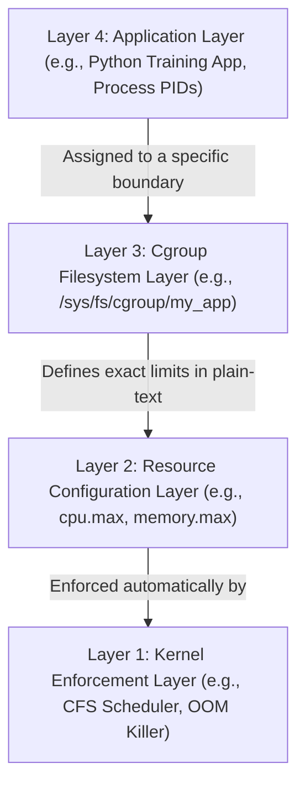

# Resource Isolation with Cgroups (Control Groups, Memory/CPU Limiting)

Version: 2.0.0

Purpose: Canonical lesson structure for Platform Engineering & AI Infrastructure Curriculum.

Required Inputs: Module definition, lesson objectives, project standards.

Outputs: Standards-compliant lesson markdown.

---

# Lesson Metadata

* **Lesson ID:** `MOD-LINUX-INT-06`
* **Module:** Linux Internals (`MOD-LINUX-INT`)
* **Difficulty:** Advanced
* **Estimated Duration:** 50 minutes
* **Learning Track:** 🟢 Core
* **Version:** 2.0.0
* **Last Updated:** 2026-06-28

---

# Lesson Overview

This lesson explores the legendary resource governance engine of the Linux kernel, decrypting how Linux meters, limits, and isolates physical CPU, memory, and disk I/O across running software processes. By mastering Control Groups (`cgroups`), resource throttling mechanics, and the `/sys/fs/cgroup` pseudo-filesystem, you will unlock the definitive containerization fundamentals supporting our module capability: **"I understand how Linux works internally, can trace system calls, manage resource cgroups, and debug complex system behavior."**

---

# Learning Objectives

* Define what a Control Group (`cgroup`) is and explain its architectural role in modern containerization (Docker/Kubernetes).
* Differentiate between Cgroups v1 (multiple hierarchies) and Cgroups v2 (unified hierarchy).
* Inspect active cgroup allocation trees and resource limits within the `/sys/fs/cgroup` pseudo-filesystem.
* Explain the exact kernel mechanics of CPU Throttling (`cfs_quota_us` / `cfs_period_us`) and Cgroup OOM Killer execution (`memory.max`).
* Create a custom cgroup manually in the terminal, assign process PIDs, and enforce strict physical memory limits.

---

# Prerequisites

* Completion of `MOD-LINUX-INT-01` through `MOD-LINUX-INT-05`.
* Foundational Linux internal memory and process monitoring skills (`free -h`, `ps aux`, `cat`).

---

# Why This Exists

In the preceding lessons of Module 03, we explored how the Linux kernel isolates memory between User Space and Kernel Space, virtualizes RAM using Page Tables, and manages processes using the `fork-exec` model. However, traditional Linux process management carries a massive structural vulnerability: **No default resource isolation!**

By default, any standard software process running on a Linux server is allowed to compete for 100% of the server's physical CPU and memory resources. If you run fifty microservices on a cloud server, and one badly written Python script enters an infinite `while true` loop or suffers a massive memory leak, it will consume 100% of the CPU and RAM, starving the other forty-nine microservices and crashing the entire server!

In 2006, engineers at Google (Paul Menage and Rohit Seth) set out to solve this catastrophic vulnerability. They invented **Control Groups (`cgroups`)**, which were officially merged into the Linux kernel in 2008. 

A `cgroup` is an elite kernel mechanism that allows you to wrap a concrete resource boundary around a process or group of processes. You can tell the Linux kernel: *"Process `1050` is strictly forbidden from consuming more than 500 Megabytes of RAM or more than 20% of CPU core 1."* Cgroups form the absolute physical resource bedrock of modern containerization (Docker and Kubernetes).

---

# Core Concepts

## 1. What is a Control Group (`cgroup`)?
A `cgroup` is a kernel mechanism that meters, limits, and governs physical system resources (CPU, Memory, Disk I/O, Network bandwidth) for a collection of running process PIDs.
* **The Master Enforcer:** When a process belongs to a cgroup, the Linux kernel's execution scheduler continuously monitors its resource consumption. If the process attempts to breach its assigned limits, the kernel instantly intervenes—throttling its CPU cycles or triggering a localized OOM Killer execution!

## 2. Cgroups v1 vs. Cgroups v2
The Linux kernel has evolved through two distinct architectural generations of cgroups:
* **Cgroups v1 (Legacy):** Maintained multiple independent hierarchy trees for different resources (a separate tree for CPU, a separate tree for Memory). Highly complex, messy, and prone to severe deadlock synchronization bugs between trees.
* **Cgroups v2 (Modern Standard):** Features a beautiful **Unified Hierarchy**. A single master directory tree manages all resources (CPU, Memory, I/O) for a process simultaneously! Cgroups v2 is the absolute unanimous standard across modern Linux distributions (Ubuntu 22.04+, RHEL 9+) and Kubernetes environments.

## 3. The `/sys/fs/cgroup` Pseudo-Filesystem
How do you create or configure a cgroup? You don't need complex administrative software! In accordance with the "everything is a file" philosophy, the Linux kernel presents cgroups as a plain-text pseudo-filesystem located at `/sys/fs/cgroup`.
* **Creating a Cgroup:** Creating a brand-new folder (`mkdir /sys/fs/cgroup/my_container`) instantly commands the Linux kernel to generate a brand-new cgroup, automatically populating the folder with plain-text configuration files!
* **Assigning PIDs:** Writing a process PID into the `cgroup.procs` file (`echo 1050 > /sys/fs/cgroup/my_container/cgroup.procs`) instantly traps the process inside the cgroup boundary!

## 4. CPU Throttling Mechanics (`cpu.max`)
How does Kubernetes limit a container to exactly `0.5` CPU cores (`limits.cpu: 500m`)? It uses the Completely Fair Scheduler (CFS) quota mechanics in `cpu.max`!
* **Period vs. Quota:** The kernel divides CPU time into windows called **Periods** (traditionally 100,000 microseconds = 100ms). The **Quota** defines exactly how many microseconds within that period the process is allowed to run on the CPU.
* **Throttling:** If you set `cpu.max` to `50000 100000`, the process is allowed to run for 50ms. Once it hits 50ms, the kernel forcefully pauses the process (**CPU Throttling**) for the remaining 50ms of the window, perfectly limiting it to 50% of a CPU core!

## 5. Memory Limiting Mechanics (`memory.max`)
How does Kubernetes limit a container to exactly `1 Gigabyte` of RAM (`limits.memory: 1Gi`)? It writes the byte limit into `memory.max`!
* **Localized OOM Killer:** If a process attempts to allocate more RAM than the byte limit defined in `memory.max`, the Linux kernel does *not* crash the physical server. Instead, it triggers a **Localized Cgroup OOM Killer**, dropping a `SIGKILL` (`kill -9`) signal *only* on the processes trapped inside that specific cgroup!

---

# Architecture



---

# Real-World Example

Imagine you are managing an AI training platform. Your data scientists deploy a Python training app in **Layer 4: Application Layer** configured with a strict limit of `2 CPU cores`.

During training, they complain that their app is running incredibly slowly. When you inspect the server, you notice the server's 16 CPU cores are mostly idle! 

Because you understand the architecture, you know exactly what happened: the Python app in **Layer 4** spawned 16 workers that instantly tried to run as fast as possible, hitting the exact limits defined in **Layer 2: Resource Configuration Layer** via the **Layer 3: Cgroup Filesystem Layer**. **Layer 1: Kernel Enforcement Layer** (the speed cop) caught them and forcefully paused (throttled) the app for the rest of every single time window! You explain the mechanics to the data scientists, increase their CPU limit to 8 cores, and their AI training speed increases by 400%!

---

# Hands-on Demonstration

Let's look at how an engineer inspects the active cgroup version on a server, creates a custom cgroup manually in `/sys/fs/cgroup`, assigns a process PID, and configures a strict physical memory limit.

## Input 1: Inspecting Cgroup Version and Filesystem Mounts
We use `stat -fc %T /sys/fs/cgroup/` to verify if our server is running Cgroups v2, and inspect the root cgroup directory contents using `ls -la`.

## Code 1
```bash
# Verify if the server is running Cgroups v2 (returns cgroup2fs) vs Cgroups v1 (tmpfs).
stat -fc %T /sys/fs/cgroup/

# Display the master configuration files in the root cgroup directory.
# We pipe it into grep to view the core memory and cpu controllers.
ls -la /sys/fs/cgroup/ | grep -E "cgroup.procs|cpu|memory" | head -n 5
```

## Expected Output 1
```text
cgroup2fs
-rw-r--r--  1 root root 0 Jun 28 01:12 cgroup.procs
-rw-r--r--  1 root root 0 Jun 28 01:12 cpu.pressure
-rw-r--r--  1 root root 0 Jun 28 01:12 cpu.stat
-rw-r--r--  1 root root 0 Jun 28 01:12 memory.pressure
-rw-r--r--  1 root root 0 Jun 28 01:12 memory.stat
```

## Explanation 1
Look at how beautifully transparent Linux is! `cgroup2fs` proudly confirms our server is running the modern Cgroups v2 unified hierarchy. Notice the plain-text configuration files: `cgroup.procs` tracks active PIDs, while `cpu.stat` and `memory.stat` track master resource pressure metrics!

---

## Input 2: Creating a Custom Cgroup and Setting Memory Limits
We use `sudo mkdir` to create a custom cgroup named `ai_sandbox`, assign our active Bash PID (`$$`) to `cgroup.procs`, and configure a strict 500-Megabyte memory limit in `memory.max`.

## Code 2
```bash
# Create a brand-new custom cgroup directory named 'ai_sandbox'.
sudo mkdir -p /sys/fs/cgroup/ai_sandbox

# Verify that the Linux kernel automatically populated our new directory with cgroup files!
ls -la /sys/fs/cgroup/ai_sandbox | head -n 5

# Assign our active Bash terminal PID ($$) into the cgroup's procs file.
sudo sh -c "echo $$ > /sys/fs/cgroup/ai_sandbox/cgroup.procs"

# Configure a strict 500-Megabyte memory limit (500 * 1024 * 1024 = 524288000 bytes).
sudo sh -c "echo 524288000 > /sys/fs/cgroup/ai_sandbox/memory.max"

# Verify the active PIDs and memory limit of our custom cgroup.
cat /sys/fs/cgroup/ai_sandbox/cgroup.procs
cat /sys/fs/cgroup/ai_sandbox/memory.max
```

## Expected Output 2
```text
total 0
drwxr-xr-x 2 root root 0 Jun 28 05:30 .
drwxr-xr-x 4 root root 0 Jun 28 01:12 ..
-rw-r--r-- 1 root root 0 Jun 28 05:30 cgroup.procs
-rw-r--r-- 1 root root 0 Jun 28 05:30 cgroup.controllers

1050
524288000
```

## Explanation 2
Notice how magical this feels! When we executed `mkdir`, the Linux kernel instantly detected the folder creation and automatically populated it with `cgroup.procs` and controller files! By echoing `$$` (PID 1050) into `cgroup.procs`, our active shell is now officially trapped inside the `ai_sandbox` cgroup. `524288000` in `memory.max` guarantees that if our shell attempts to consume more than 500MB of RAM, the kernel will instantly terminate it with a localized OOM kill!

---

# Hands-on Lab

* **Objective:** Inspect cgroup versions, create custom cgroups in `/sys/fs/cgroup`, assign process PIDs, and configure resource limits.
* **Estimated Time:** 15 minutes
* **Difficulty:** Advanced
* **Environment:** Interactive Browser Terminal / Local Sandbox (Root / Sudo access required)

## Step-by-step Instructions

1. Open your terminal sandbox.
2. Type `stat -fc %T /sys/fs/cgroup/` to verify your active Cgroups v2 filesystem mount.
3. Type `sudo mkdir -p /sys/fs/cgroup/platform_lab` to create a custom cgroup.
4. Type `sudo sh -c "echo $$ > /sys/fs/cgroup/platform_lab/cgroup.procs"` to assign your active shell PID to the cgroup.
5. Type `sudo sh -c "echo 104857600 > /sys/fs/cgroup/platform_lab/memory.max"` to configure a strict 100-Megabyte memory limit (100 * 1024 * 1024).
6. Type `cat /sys/fs/cgroup/platform_lab/memory.max` to verify your active byte limit.

## Verification

```bash
cat /sys/fs/cgroup/platform_lab/cgroup.procs
```
*If your terminal successfully outputs your active Bash PID number, you have mastered Linux cgroup administration!*

## Troubleshooting

* **Issue:** `sudo sh -c "echo $$ > /sys/fs/cgroup/platform_lab/cgroup.procs"` returns `bash: echo: write error: No space left on device` or `Invalid argument`.
* **Solution:** You are running inside an unprivileged Docker container where the `/sys/fs/cgroup` filesystem is mounted as read-only to protect the host machine. Run the lab in a standard virtual machine, cloud shell, or launch your container with `docker run --privileged`.

## Cleanup

```bash
# To clean up a cgroup, move your PID back to the root cgroup first, then remove the folder
sudo sh -c "echo $$ > /sys/fs/cgroup/cgroup.procs"
sudo rmdir /sys/fs/cgroup/platform_lab
```

---

# Production Notes

In enterprise Kubernetes engineering, Platform Engineers rely heavily on inspecting `cpu.stat` and `memory.stat` inside cgroup directories to debug performance anomalies. If a Kubernetes microservice is running slowly but `top` shows low CPU usage, inspecting `cat /sys/fs/cgroup/kubepods.slice/kubepods-burstable.slice/.../cpu.stat` will reveal the exact metric `nr_throttled` (number of times the container was throttled) and `throttled_time` (total nanoseconds spent frozen). This provides definitive mathematical proof that your container is suffering from CPU throttling!

---

# Common Mistakes

* **Trying to Remove a Cgroup Directory Using `rm -rf`:** Beginners frequently attempt to delete a custom cgroup folder using `rm -rf /sys/fs/cgroup/my_cgroup`. This will instantly fail with `Device or resource busy` or `Operation not permitted`! Cgroups are kernel objects, not normal files! To delete a cgroup, you must first move all active PIDs out of `cgroup.procs`, and then use `rmdir` (remove empty directory).
* **Expecting Memory Limits to Apply to VSZ:** Junior engineers are often confused when they set `memory.max` to 500MB, but `ps aux` shows the process consuming 2GB of VSZ without being killed. As established in Lesson 03, cgroup memory limits apply strictly to **RSS (Resident Set Size / Physical RAM)**, never to VSZ virtual illusions!

---

# Failure-Driven Learning

Imagine a junior engineer configures a custom cgroup with a highly restrictive memory limit and attempts to execute a memory-intensive software process inside it.

## Simulated Failure
```bash
# Simulating a Cgroup Localized OOM Killer execution
sudo mkdir -p /sys/fs/cgroup/oom_test
# Set a tiny 10-Megabyte memory limit (10 * 1024 * 1024 = 10485760 bytes)
sudo sh -c "echo 10485760 > /sys/fs/cgroup/oom_test/memory.max"
sudo sh -c "echo $$ > /sys/fs/cgroup/oom_test/cgroup.procs"

# Attempt to allocate 50 Megabytes of RAM in Python
python3 -c 'a = " " * (50 * 1024 * 1024)'
```

## Output
```text
Killed
```

## Diagnosis & Recovery
Why did this fail? The fatal message `Killed` confirms that when Python attempted to allocate 50MB of physical RAM, it breached the 10MB byte limit defined in `/sys/fs/cgroup/oom_test/memory.max`! The Linux kernel instantly caught the breach and deployed the localized Cgroup OOM Killer, terminating the Python process while leaving the rest of the server running flawlessly. To confirm this in production, the engineer must inspect `cat /sys/fs/cgroup/oom_test/memory.events`. The output will proudly display `oom_kill 1`, proving the cgroup OOM killer executed the process! To recover, the engineer must increase `memory.max` to a reasonable limit.

---

# Engineering Decisions

## Cgroups v1 Multiple Hierarchies vs. Cgroups v2 Unified Hierarchy
When architecting an enterprise container platform, engineering leaders must evaluate cgroup hierarchy models.
* **Cgroups v1 (Multiple Hierarchies):** Allows a process to belong to `cgroup A` for CPU and `cgroup B` for Memory. This flexibility caused immense architectural nightmares: if a process ran out of memory in `cgroup B`, the kernel struggled to coordinate CPU throttling in `cgroup A`, leading to severe kernel deadlocks.
* **Cgroups v2 (Unified Hierarchy):** Mandates that a process belongs to exactly one cgroup directory in `/sys/fs/cgroup`. That single directory governs CPU, Memory, Disk I/O, and PIDs simultaneously! This allows the kernel to coordinate complex interactions flawlessly (e.g., throttling CPU when disk I/O pressure is high).
* **The Platform Decision:** Platform Engineers strictly mandate Cgroups v2 for all modern Kubernetes and Docker base architectures.

---

# Best Practices

* **Monitor `memory.events`:** When debugging container crashes, inspect `memory.events` inside the cgroup directory. It tracks exact counts of `low`, `high`, `max`, `oom`, and `oom_kill` events!
* **Leverage Systemd for Cgroups:** In production, Platform Engineers rarely create cgroup folders manually using `mkdir`. Instead, they use Systemd unit files (`MemoryMax=500M`, `CPUQuota=50%`), and let `systemd` automatically construct the underlying folders in `/sys/fs/cgroup/system.slice/`!

---

# Troubleshooting Guide

## Issue 1: "CPU Throttling under low CPU utilization" (`cpu.stat` Throttling)

* **Cause:** Your containerized application is running exceptionally slowly, even though physical server CPU usage is low. The application is multithreaded and exhausting its CFS quota within the first few milliseconds of the period window.
* **Diagnosis:** Inspecting `cat /sys/fs/cgroup/.../cpu.stat` reveals massive numbers for `nr_throttled` (e.g., `nr_throttled 5420`) and `throttled_time`.
* **Solution:** The kernel is forcefully freezing your container. To resolve this, you must either increase your Kubernetes CPU limit (`limits.cpu`), or optimize your application runtime (e.g., `GOMAXPROCS` in Go, or UV_THREADPOOL_SIZE in Node.js) to spawn fewer concurrent threads.

---

# Summary

* **Control Groups (`cgroups`)** are a kernel mechanism that meters, limits, and isolates physical CPU, memory, and disk I/O across running process PIDs.
* **Cgroups v2** utilizes a beautiful unified hierarchy where a single folder in `/sys/fs/cgroup/` governs all resources simultaneously.
* **`cpu.max`** enforces CPU throttling using CFS Quota/Period windows; **`memory.max`** enforces memory boundaries using localized Cgroup OOM Killer executions.
* Cgroups form the absolute physical resource isolation bedrock of modern containerization (Docker and Kubernetes).

---

# Cheat Sheet

```bash
# Verify if the server is running Cgroups v2 (cgroup2fs) vs Cgroups v1 (tmpfs)
stat -fc %T /sys/fs/cgroup/

# Create a brand-new custom cgroup directory in Cgroups v2
sudo mkdir -p /sys/fs/cgroup/[cgroup_name]

# Assign a running process PID into a cgroup
sudo sh -c "echo [PID] > /sys/fs/cgroup/[cgroup_name]/cgroup.procs"

# Configure a strict physical memory limit in bytes (e.g., 500MB = 524288000)
sudo sh -c "echo 524288000 > /sys/fs/cgroup/[cgroup_name]/memory.max"

# Configure a CPU limit (e.g., 50% of 1 CPU core = 50000 100000)
sudo sh -c "echo '50000 100000' > /sys/fs/cgroup/[cgroup_name]/cpu.max"

# Inspect active CPU throttling metrics for a cgroup
cat /sys/fs/cgroup/[cgroup_name]/cpu.stat

# Inspect active memory OOM kill event counts for a cgroup
cat /sys/fs/cgroup/[cgroup_name]/memory.events

# Remove a custom cgroup directory (Must be empty of PIDs first!)
sudo rmdir /sys/fs/cgroup/[cgroup_name]
```

---

# Knowledge Check

## Multiple Choice Questions

1. You are investigating a slow Kubernetes microservice. You log into the underlying server node, locate the container's cgroup directory in `/sys/fs/cgroup`, and execute `cat cpu.stat`. The output reports `nr_periods 1000, nr_throttled 850, throttled_time 45000000000`. What is the correct interpretation of this metric?
   * A) The container is perfectly healthy and has run for 1,000 periods.
   * B) The container has completely run out of memory and triggered the OOM killer 850 times.
   * C) The container breached its assigned CPU quota in 850 out of 1,000 periods, causing the Linux kernel to forcefully pause (throttle) its execution for 45 billion nanoseconds.
   * D) The container is waiting for slow hard drive I/O.

## Scenario Questions

You are writing a custom automated sandbox script for executing untrusted user code. You want to ensure the untrusted code cannot consume more than 200 Megabytes of physical RAM. Based on what you learned in this lesson, how do you manually create a cgroup in `/sys/fs/cgroup`, assign the untrusted process PID, and configure the 200MB memory limit?

## Short Answer Questions

Explain the exact architectural difference between Cgroups v1 (Multiple Hierarchies) and Cgroups v2 (Unified Hierarchy).

<details>
<summary><b>View Answers</b></summary>

### Multiple Choice
1. **C** - The container breached its assigned CPU quota in 850 out of 1,000 periods, causing the Linux kernel to forcefully pause (throttle) its execution for 45 billion nanoseconds.

### Scenario
First, create the cgroup: `sudo mkdir -p /sys/fs/cgroup/sandbox`. Then, assign the process: `sudo sh -c "echo [PID] > /sys/fs/cgroup/sandbox/cgroup.procs"`. Finally, set the limit (200MB = 209715200 bytes): `sudo sh -c "echo 209715200 > /sys/fs/cgroup/sandbox/memory.max"`.

### Short Answer
Cgroups v1 maintains multiple independent hierarchy trees for different resources (e.g., separate trees for CPU and Memory), causing synchronization complexity. Cgroups v2 uses a Unified Hierarchy where a single directory controls all resources for a process simultaneously.

</details>

---

# Interview Preparation

## Beginner Questions

* What is a cgroup in Linux?
* Where is the cgroup pseudo-filesystem located on the hard drive?
* What happens if a process attempts to consume more memory than defined in `memory.max`?

## Intermediate Questions

* Explain the difference between `cgroup.procs` and `memory.events`.
* How does the Completely Fair Scheduler (CFS) use `cpu.max` (Quota and Period) to throttle CPU usage?

## Advanced Questions

* Explain how the Linux kernel handles cgroup memory pressure metrics (`memory.pressure`) using PSI (Pressure Stall Information) to allow user-space daemons to proactively shed load before triggering an OOM kill.

## Scenario-Based Discussions

* Discuss the operational trade-offs of configuring strict CPU limits (`limits.cpu`) on Kubernetes containers (which can cause severe CFS throttling latency) versus configuring only CPU requests (`requests.cpu`) and allowing containers to burst across shared node CPU cores in an enterprise environment.

---

# Further Reading

1. [Linux Cgroups v2 Official Kernel Documentation](https://www.kernel.org/doc/html/latest/admin-guide/cgroup-v2.html)
2. [Understanding Linux CPU Throttling and CFS Quota (Deep Dive)](https://engineering.squarespace.com/)
3. [Mastering Cgroups v2 for Container Resource Limiting (Red Hat)](https://www.redhat.com/)
4. [Demystifying Kubernetes Resource Limits and Cgroups](https://kubernetes.io/docs/concepts/configuration/manage-resources-containers/)
5. [Pressure Stall Information (PSI) Architecture](https://lwn.net/Articles/759658/)
