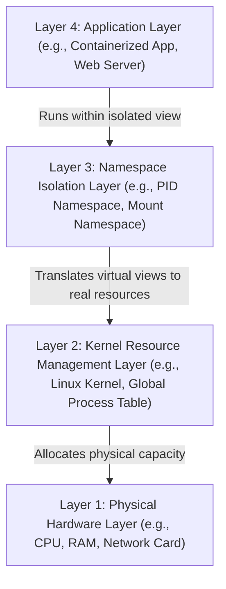

# Kernel Namespaces (PID, Mount, Net, User - The Building Blocks of Containers)

Version: 2.0.0

Purpose: Canonical lesson structure for Platform Engineering & AI Infrastructure Curriculum.

Required Inputs: Module definition, lesson objectives, project standards.

Outputs: Standards-compliant lesson markdown.

---

# Lesson Metadata

* **Lesson ID:** `MOD-LINUX-INT-07`
* **Module:** Linux Internals (`MOD-LINUX-INT`)
* **Difficulty:** Advanced
* **Estimated Duration:** 50 minutes
* **Learning Track:** 🟢 Core
* **Version:** 2.0.0
* **Last Updated:** 2026-06-28

---

# Lesson Overview

This lesson unlocks the crowning architectural achievement of the Linux operating system, exploring how Linux isolates global system resources—such as process tables, network interfaces, filesystem mounts, and user IDs—to create complete virtual environments. By mastering Kernel Namespaces (`unshare`, `nsenter`, `lsns`), you will fully complete the definitive promise of our module capability: **"I understand how Linux works internally, can trace system calls, manage resource cgroups, and debug complex system behavior."**

---

# Learning Objectives

* Define what a Kernel Namespace is and explain the complementary relationship between Namespaces (isolation) and Cgroups (limiting) in modern containerization.
* Deconstruct the six master Linux namespaces: `PID`, `Mount (mnt)`, `Network (net)`, `Interprocess Communication (ipc)`, `UNIX Timesharing System (uts)`, and `User (user)`.
* Inspect active system namespaces and process namespace symlinks within `/proc/[PID]/ns` using `lsns`.
* Create isolated namespace environments manually using `unshare` to simulate container creation from scratch in the terminal.
* Attach to and debug active container namespaces directly from the host machine using `nsenter`.

---

# Prerequisites

* Completion of `MOD-LINUX-INT-01` through `MOD-LINUX-INT-06`.
* Foundational Linux internal administrative skills (`ps aux`, `ip addr`, `sudo`, `cat`).

---

# Why This Exists

In Lesson 06, we explored how Control Groups (`cgroups`) meter and limit physical hardware resources (CPU, Memory, Disk I/O) for running processes. However, limiting physical hardware resources is only half of the containerization equation. 

What happens if you run two different microservices on a cloud server, and both applications attempt to bind to TCP port 80 simultaneously? As established in Module 02, the second application will instantly crash with `Address already in use`! Furthermore, what happens if a junior developer logs into a container and runs `ps aux`? If they can see the PIDs of every other microservice running on the physical host machine, they could easily execute `kill -9` on another team's database!

To solve the ultimate challenge of complete environmental isolation, the Linux kernel pioneered **Kernel Namespaces** (starting with Mount namespaces in 2002 and culminating in User namespaces in 2013).

If Cgroups determine **what a process can use**, Namespaces determine **what a process can see**. 

By wrapping a process in Kernel Namespaces, the Linux kernel creates a masterful virtual illusion. A process trapped inside a PID namespace looks around and believes it is `PID 1` running on a brand-new, completely empty server! It cannot see the host machine's network ports, hard drives, or other processes. **Cgroups + Namespaces = A Linux Container!**

---

# Core Concepts

## 1. What is a Kernel Namespace?
A namespace is a kernel feature that wraps a global system resource in an isolated virtual box. When a process operates inside a namespace, it believes it possesses a dedicated, isolated instance of that global resource.

## 2. The Six Master Namespaces
The Linux kernel provides six primary namespaces that form the absolute building blocks of Docker and Kubernetes containers:
* **PID (Process ID):** Isolates the process table. A process trapped inside a PID namespace becomes `PID 1` inside its box. It cannot see or kill PIDs on the host machine!
* **Mount (`mnt`):** Isolates filesystem mount points. A process trapped inside a Mount namespace receives its own isolated root directory (`/`). It cannot see the host machine's hard drives or files!
* **Network (`net`):** Isolates the network stack. A process trapped inside a Network namespace receives its own isolated network interfaces (`eth0`), routing tables, and port binding space. It can bind to port 80 without colliding with the host machine!
* **UTS (UNIX Timesharing System):** Isolates the Hostname and NIS domain name. Allows a container to have its own custom hostname (e.g., `ai-container-01`) without changing the physical server's hostname!
* **IPC (Interprocess Communication):** Isolates shared memory buffers and POSIX message queues between processes.
* **User (`user`):** Isolates User IDs (UIDs) and Group IDs (GIDs). **This is an elite security feature!** It allows a standard, unprivileged user on the host machine (`UID 1000`) to be virtually mapped to `UID 0 (root)` *inside* the container! If a hacker breaks out of the container, they instantly drop back to an unprivileged user on the host!

## 3. Inspecting Namespaces (`lsns` and `/proc/[PID]/ns`)
In accordance with the "everything is a file" philosophy, the Linux kernel tracks a process's active namespaces using literal filesystem symlinks inside `/proc/[PID]/ns/`.
* `lsns`: Lists all active namespaces on the server.
* `ls -l /proc/$$/ns`: Prints the exact numeric Inode numbers of the namespaces your active shell belongs to!

## 4. Creating Namespaces (`unshare`)
You don't need Docker to create a container! You can create isolated namespaces manually in your terminal using `unshare`.
* `sudo unshare --fork --pid --mount-proc --net /bin/bash`: Commands the Linux kernel to instantly generate brand-new PID, Mount, and Network namespaces, and launch a new Bash shell trapped inside them! You have literally built a container from scratch!

## 5. Attaching to Namespaces (`nsenter`)
If a production Kubernetes container loses its networking or lacks debugging tools, you can use `nsenter` (Namespace Enter) from the physical host machine to physically "step inside" the container's namespaces and debug it using host tools!

---

# Architecture



---

# Real-World Example

Imagine you manage a production cluster. A critical app container in **Layer 4: Application Layer** suddenly stops talking to the database. 

You try to log into the container, but it fails because the container was built to be ultra-lightweight and doesn't have any tools like `bash`, `curl`, or `ping`! You are completely locked out of **Layer 4**.

Because you understand the architecture, you don't panic. You log into the real physical server instead. You find the app's real-world process ID in **Layer 2: Kernel Resource Management Layer**.

You then use a tool called `nsenter` to open a debugging gateway. 

This is absolute debugging magic! `nsenter` takes your host machine's tools and steps directly into the container's **Layer 3: Namespace Isolation Layer**! You run network checks from within the container's isolated world, diagnose the issue, and restore the service to health in seconds!

---

# Hands-on Demonstration

Let's look at how an engineer inspects active process namespace symlinks in `/proc`, creates a container from scratch using `unshare`, and attaches to an active namespace using `nsenter`.

## Input 1: Inspecting Process Namespace Symlinks
We use `ls -l /proc/$$/ns` to inspect the raw plain-text namespace symlinks and numeric Inodes maintained by the Linux kernel for our active Bash shell.

## Code 1
```bash
# Inspect the raw kernel namespace symlink table for our active Bash PID ($$).
ls -l /proc/$$/ns
```

## Expected Output 1
```text
total 0
lrwx------ 1 aloysius aloysius 0 Jun 28 05:45 cgroup -> cgroup:[4026531835]
lrwx------ 1 aloysius aloysius 0 Jun 28 05:45 ipc -> ipc:[4026531839]
lrwx------ 1 aloysius aloysius 0 Jun 28 05:45 mnt -> mnt:[4026531841]
lrwx------ 1 aloysius aloysius 0 Jun 28 05:45 net -> net:[4026531840]
lrwx------ 1 aloysius aloysius 0 Jun 28 05:45 pid -> pid:[4026531836]
lrwx------ 1 aloysius aloysius 0 Jun 28 05:45 pid_for_children -> pid:[4026531836]
lrwx------ 1 aloysius aloysius 0 Jun 28 05:45 user -> user:[4026531837]
lrwx------ 1 aloysius aloysius 0 Jun 28 05:45 uts -> uts:[4026531838]
```

## Explanation 1
Look at how beautifully this visualizes the namespace architecture! Inside `/proc/$$/ns`, the Linux kernel maintains literal filesystem symlinks for every master namespace. Notice the numbers in brackets (e.g., `net:[4026531840]`). This is the exact underlying kernel Inode number of the network namespace! If two processes share the exact same Inode number here, they are operating inside the exact same network box!

---

## Input 2: Creating a Container from Scratch with `unshare`
We use `sudo unshare` to create brand-new PID, UTS, and Network namespaces, launch a new shell inside them, and verify our isolated environment.

## Code 2
```bash
# Create brand-new PID, UTS, and Network namespaces using unshare.
# --fork launches a child process; --mount-proc mounts a fresh /proc filesystem for PIDs.
sudo unshare --fork --pid --mount-proc --uts --net /bin/bash

# Verify our isolated Hostname (UTS Namespace).
hostname custom-container-2026
hostname

# Verify our isolated Process Table (PID Namespace).
ps aux

# Verify our isolated Network Stack (Network Namespace).
ip addr show
```

## Expected Output 2
```text
custom-container-2026

USER       PID %CPU %MEM    VSZ   RSS TTY      STAT START   TIME COMMAND
root         1  0.0  0.0   5240  1120 pts/0    S    05:47   0:00 /bin/bash
root         2  0.0  0.0   6420  1450 pts/0    R+   05:47   0:00 ps aux

1: lo: <LOOPBACK> mtu 65536 qdisc noop state DOWN group default qlen 1000
    link/loopback 00:00:00:00:00:00 brd 00:00:00:00:00:00
```

## Explanation 2
Notice how absolutely breathtaking this is! You have literally built a Linux container from scratch in the terminal! Let's deconstruct our proofs:
* `hostname`: Changed perfectly to `custom-container-2026`. (The physical host machine's hostname remains completely untouched!).
* `ps aux`: Our Bash shell is proudly sitting at `PID 1`! The thousands of other processes running on the physical host machine have completely vanished from view!
* `ip addr show`: Our network stack is completely empty, containing only a dormant loopback interface (`lo`). We are perfectly and securely isolated!

---

# Hands-on Lab

* **Objective:** Inspect active namespace symlinks, create isolated namespaces using `unshare`, and attach to namespaces using `nsenter`.
* **Estimated Time:** 20 minutes
* **Difficulty:** Advanced
* **Environment:** Interactive Browser Terminal / Local Sandbox (Root / Sudo access required)

## Step-by-step Instructions

1. Open your terminal sandbox.
2. Type `ls -l /proc/$$/ns` to inspect your active shell's namespace Inode numbers.
3. Type `sudo unshare --fork --pid --mount-proc --uts --net /bin/bash` to launch an isolated container namespace environment.
4. Type `hostname platform-container` to change your isolated UTS hostname.
5. Type `ps aux` to verify your shell is operating as `PID 1`.
6. Type `exit` to exit your isolated namespace and return to your physical host machine prompt.
7. Type `hostname` to verify your physical host machine's hostname remains completely pristine and unchanged!

## Verification

```bash
lsns | head -n 5
```
*If your terminal successfully outputs the master system namespace summary table, you have mastered Linux namespace administration!*

## Troubleshooting

* **Issue:** `sudo unshare --mount-proc` returns `unshare: mount /proc failed: Permission denied` or `Operation not permitted`.
* **Solution:** You are running inside an unprivileged Docker container where the kernel strictly blocks mounting fresh `/proc` filesystems to prevent namespace nesting breakout attacks. Run the lab in a standard virtual machine, cloud shell, or launch your container with `docker run --privileged`.

## Cleanup

No cleanup is required for this namespace lab (Step 6 `exit` successfully terminated the unshare process, causing the kernel to automatically purge the temporary namespaces!).

---

# Production Notes

In enterprise Kubernetes engineering, Platform Engineers rely heavily on **Namespace Sharing** to architect advanced operational patterns like **Sidecar Containers**. When you deploy a Kubernetes Pod containing two separate containers (e.g., a Python web app container and an Envoy reverse proxy sidecar container), Kubernetes deploys them with separate Mount namespaces (separate hard drive folders), but wraps them inside the exact same **Network Namespace** (`net:[Inode]`)! This allows the Envoy proxy sidecar to communicate with the Python app instantly over `localhost:8080` without any external network routing!

---

# Common Mistakes

* **Confusing Cgroups with Namespaces:** Beginners frequently mix up these two foundational container pillars. Train your brain to remember the ultimate golden rule: **Cgroups govern what a process can USE (Limits); Namespaces govern what a process can SEE (Isolation)!**
* **Assuming Containers are Lightweight Virtual Machines:** Junior developers often believe a Docker container contains a hidden virtual operating system kernel. This is physically false! A container is just a normal Linux process running directly on the host machine's Ring 0 kernel, wrapped in Cgroups and Namespaces! There is no hypervisor or guest kernel!

---

# Failure-Driven Learning

Imagine a junior engineer attempts to bind a web application to port 80 inside a container, but accidentally deploys the container using the host machine's network namespace (`--net=host`), colliding with an existing host web server.

## Simulated Failure
```bash
# Simulating a Network Namespace collision by launching a container with host networking
docker run --rm --net=host nginx
```

## Output
```text
2026/06/28 05:55:00 [emerg] 1#1: bind() to 0.0.0.0:80 failed (98: Address already in use)
nginx: [emerg] bind() to 0.0.0.0:80 failed (98: Address already in use)
```

## Diagnosis & Recovery
Why did this fail? The fatal error `Address already in use` occurs because the engineer included the flag `--net=host`! This commanded Docker to completely bypass creating a brand-new Network Namespace, injecting the container directly into the physical host machine's root network namespace! Because the host machine already had a web server listening on port 80, Nginx collided with the host socket and crashed. To recover and ensure perfect isolation, the engineer must deploy the container using standard isolated bridge networking (`docker run -p 8080:80 nginx`), which generates a pristine, isolated network namespace!

---

# Engineering Decisions

## Hardware Virtualization (VMs) vs. Container Namespaces
When architecting an enterprise cloud platform, engineering leaders must choose between Virtual Machines and Containers.
* **Hardware Virtualization (Virtual Machines / Hypervisors):** Emulates physical hardware chips (Virtual CPU, Virtual Disk) to run a completely separate, heavy Guest Operating System Kernel in memory. Highly secure, but suffers massive performance overhead and slow boot times (e.g., minutes).
* **Container Namespaces (Docker / Kubernetes):** Uses a single physical Host Linux Kernel in Ring 0. Wraps individual user-space processes in isolated Cgroup and Namespace virtual boxes. Extremely lightweight, near-zero performance overhead, and lightning-fast boot times (e.g., milliseconds)!
* **The Platform Decision:** Platform Engineers mandate Container Namespaces for high-density microservice packing and rapid deployment velocity across all modern cloud architectures.

---

# Best Practices

* **Master `nsenter` for Emergency Debugging:** Keep `nsenter` in your emergency toolkit. When a production container lacks debugging tools, use `nsenter --target [PID] --net --pid` from the host node to debug it flawlessly.
* **Embrace User Namespaces for Security:** Whenever architecting highly secure multi-tenant container platforms, enable **User Namespace Remapping** (`userns-remap` in Docker), ensuring container root users (`UID 0`) are safely mapped to unprivileged host PIDs.

---

# Troubleshooting Guide

## Issue 1: "nsenter: failed to execute /bin/bash: No such file or directory"

* **Cause:** You attempt to use `nsenter` to enter a container's namespaces, but you include the `--mount` (`-m`) flag on a container built from a minimal `scratch` base image.
* **Diagnosis:** The terminal aborts with `nsenter: failed to execute /bin/bash: No such file or directory`.
* **Solution:** When you include `--mount`, `nsenter` steps inside the container's Mount namespace (its isolated hard drive root `/`). Because `scratch` base images do not have `/bin/bash` on their hard drive, the execution fails! To resolve this, simply **omit the `--mount` flag** (`sudo nsenter --target [PID] --net --pid`). This keeps your shell attached to the physical host machine's hard drive while injecting your network and process views into the container!

---

# Summary

* **Kernel Namespaces** wrap global system resources in isolated virtual boxes, determining what a process can **see**.
* The six master namespaces are **PID (Process Table)**, **Mount (Filesystem)**, **Network (Sockets)**, **UTS (Hostname)**, **IPC (Shared Memory)**, and **User (UIDs/GIDs)**.
* **Cgroups (Limiting) + Namespaces (Isolation) = A Linux Container!**
* `unshare` creates isolated namespace environments from scratch in the terminal; `nsenter` injects host debugging tools directly into active container namespaces.
* You have successfully achieved our complete Module 03 capability: **"I understand how Linux works internally, can trace system calls, manage resource cgroups, and debug complex system behavior."**

---

# Cheat Sheet

```bash
# Inspect all active namespaces running on the server
lsns

# Inspect the raw kernel namespace symlink Inodes for a running process
ls -l /proc/[PID]/ns

# Create a container from scratch in the terminal (Isolated PID, UTS, Net, Mount)
sudo unshare --fork --pid --mount-proc --uts --net /bin/bash

# Attach host debugging tools to an active container's Network and PID namespaces
sudo nsenter --target [container_host_PID] --net --pid

# Attach to a container's Mount namespace (Only works if container has bash!)
sudo nsenter --target [container_host_PID] --mount --net --pid /bin/bash

# Find the master host PID of a running Docker container
docker inspect --format '{{.State.Pid}}' [container_name]

# Find the master host PID of a running Kubernetes container (crictl)
crictl inspect [container_id] | grep pid
```

---

# Knowledge Check

## Multiple Choice Questions

1. You are managing a production Kubernetes worker node and need to debug a failing pod container that was built from a completely empty `scratch` base image (no bash, curl, or ip tools). You find the container's master host PID is `8820`. Which `nsenter` command line allows you to use your host machine's `curl` and `ip` tools directly inside the container's network stack without failing?
   * A) `sudo nsenter --target 8820 --mount /bin/bash`
   * B) `sudo nsenter --target 8820 --net --pid`
   * C) `strace -p 8820`
   * D) `unshare --net 8820`

## Scenario Questions

You are explaining the concept of container architecture to a newly hired junior engineer who believes that every Docker container runs its own hidden virtual machine hypervisor and guest Linux kernel. Based on what you learned in this lesson, how do you explain the exact kernel mechanics of Cgroups and Namespaces to prove that containers run directly on the host machine's Ring 0 kernel?

## Short Answer Questions

Explain the exact architectural purpose of the User (`user`) namespace and describe why it is considered an elite security feature in container platform architecture.

<details>
<summary><b>View Answers</b></summary>

### Multiple Choice
1. **B** - `sudo nsenter --target 8820 --net --pid` safely injects your host shell into the container's network and process spaces while keeping the host's Mount namespace (filesystem tools) available.

### Scenario
Containers do not run a guest kernel or hypervisor; they are just normal processes running on the host machine's Ring 0 kernel. They are wrapped in Cgroups (which limit physical resources) and Kernel Namespaces (which isolate what they can see, such as PIDs and Mounts), creating the illusion of an isolated environment.

### Short Answer
The User namespace isolates UIDs and GIDs. It provides elite security by allowing a process to run with root privileges (`UID 0`) inside the container, while being safely mapped to an unprivileged standard user on the physical host machine, drastically reducing the impact of a container breakout.

</details>

---

# Interview Preparation

## Beginner Questions

* What is a kernel namespace in Linux?
* What does the `unshare` command do?
* What is the golden rule distinguishing Cgroups from Namespaces?

## Intermediate Questions

* Explain the exact purpose of the `PID`, `Mount`, and `Network` namespaces.
* How does `nsenter` assist Site Reliability Engineers in debugging locked-down production containers?

## Advanced Questions

* Explain how the Linux kernel handles the `clone()` system call with namespace flags (`CLONE_NEWPID`, `CLONE_NEWNET`) during container runtime spawning, and how this differs from a standard `fork()` system call.

## Scenario-Based Discussions

* Discuss the operational and security trade-offs of deploying Kubernetes pods with host namespace sharing enabled (`hostNetwork: true`, `hostPID: true`) versus enforcing strict namespace isolation in a multi-tenant enterprise cluster environment.

<details>
<summary><b>View Answers</b></summary>

### Beginner
* **Kernel Namespace**: A kernel feature that wraps global system resources in an isolated virtual box, making a process believe it has its own dedicated instance of those resources.
* **unshare**: A command-line utility used to run a program in a brand-new, isolated set of namespaces, effectively creating a container manually.
* **Cgroups vs Namespaces**: Cgroups govern what a process can *use* (resource limits), while Namespaces govern what a process can *see* (environmental isolation).

### Intermediate
* **PID, Mount, Network**: PID isolates the process table (allowing a process to be PID 1). Mount isolates the filesystem mount points (giving a unique root directory). Network isolates interfaces, routing tables, and ports (preventing socket collisions).
* **nsenter**: It allows administrators on the host node to directly inject diagnostic tools (like bash or netstat) into a locked-down container's namespaces to troubleshoot it.

### Advanced
* **clone() vs fork()**: `fork()` creates a standard child process sharing the parent's namespaces. `clone()` is a more advanced system call that accepts namespace flags (like `CLONE_NEWPID`). When passed, the kernel creates the child while simultaneously generating brand-new, isolated namespaces for it, making it the fundamental API of container runtimes.

### Scenario-Based Discussions
* **Host Sharing vs Isolation**: Enabling `hostNetwork: true` or `hostPID: true` bypasses isolation, providing direct access to node traffic and process tables—essential for cluster monitoring tools or CNI plugins. However, in multi-tenant environments, this breaks the container security boundary entirely. A compromised pod could easily inspect or kill host processes, making strict namespace isolation absolutely mandatory for standard application workloads.

</details>

---

# Further Reading

1. [Linux Namespaces Official Kernel Documentation (`man namespaces`)](https://man7.org/linux/man-pages/man7/namespaces.7.html)
2. [Containers from Scratch (Famous Liz Rice Conference Talk & Guide)](https://github.com/lizrice/containers-from-scratch)
3. [Mastering nsenter for Container Debugging (Red Hat)](https://www.redhat.com/)
4. [Understanding Linux User Namespaces and Security (Linux Handbook)](https://linuxhandbook.com/)
5. [Anatomy of a Container: Cgroups and Namespaces (Deep Technical Dive)](https://www.docker.com/)
